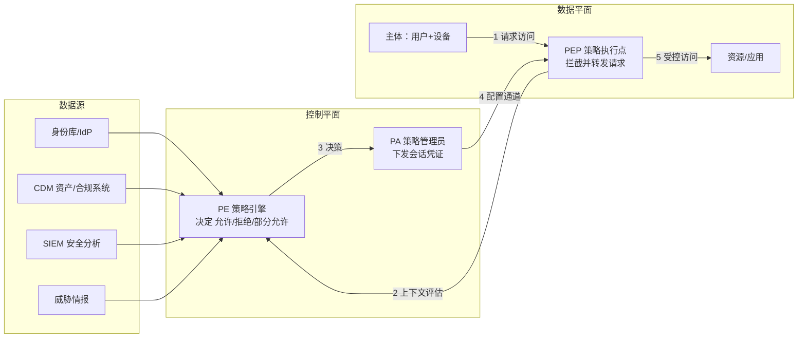

## 1. 为什么需要零信任

传统安全模型是「城堡与护城河」：防火墙内是可信内网，边界一过就默认安全。两个事实击穿了它：

1. **办公边界消失**：远程办公、SaaS、云上资源，流量大多根本不出现在「内网出口」。
2. **横向移动**：攻击者只要拿下任意一台边界内主机（钓鱼终端、VPN 漏洞），就能以
   「可信内网用户」身份扫内网、抓凭证、逐台渗透。

零信任（Zero Trust）的回应是把假设反过来：**网络位置不提供任何信任**，无论请求来自
公司内网还是公网，都要走同一套「验证身份 → 验证设备 → 最小授权 → 持续评估」的流程。

> 术语源自 Forrester 2010 年的研究，产业级定义以 NIST SP 800-207（零信任架构）为准。
> 类比：城堡模型像「进了小区大门，谁都可以敲门」；零信任像「每户门都装指纹锁，
> 且访客每次进每户都要重新验证，还要出示健康证（设备状态）」。

## 2. 三大原则

| 原则                          | 含义                                             | 反面示例           |
| :---------------------------- | :----------------------------------------------- | :----------------- |
| Never trust, always verify    | 每次访问都验证身份与上下文，不因「来自内网」放行 | 内网免认证的管理台 |
| Least privilege（最小权限）   | 只授予完成当前任务所需的最小访问，且默认拒绝     | 全员可读所有共享盘 |
| Assume breach（假设已被入侵） | 架构按「攻击者已在内网」设计：微分段、加密、审计 | 平面网络 + 明文协议 |

理解「always verify」的关键：验证对象不仅是**用户身份**，还包括**设备健康度、
行为上下文（时间/地点/访问频率）、目标资源敏感级**，且验证是**每一次请求**而非一次登录。

## 3. NIST SP 800-207 的逻辑组件

标准把零信任架构拆成三个核心角色，加上策略引擎的数据源：



- **PEP（Policy Enforcement Point）**：策略执行点，物理或逻辑上挡在主体与资源之间。
  形态可以是身份代理（BeyondCorp 类网关）、SDP/微分段网关、API 网关。
- **PE（Policy Engine）+ PA（Policy Administrator）**：策略决策与下发。PE 综合身份、
  设备、威胁情报打分，输出细粒度决策（允许/拒绝/只读/限时限流）。
- **持续诊断（CDM）与 SIEM**：为 PE 提供「当下」的设备与行为状态——这是「持续验证」
  得以成立的数据基础。

一次典型决策：`用户 Alice + 已注册且合规的笔记本 + 工作时间 + 请求财务报表系统`
→ 允许只读；同一用户深夜用未注册设备请求同一系统 → 拒绝并触发 MFA/告警。

## 4. 两个产业级参考实现

### 4.1 Google BeyondCorp

Google 在 2011 年 aurora 攻击后转向的实践，已成为零信任的事实原型：

```text
核心动作：
1. 把应用从内网搬出，统一置于前端访问代理之后（公网可达但强制认证）
2. 每台终端纳入设备清单库，客户端证书 + 设备合规状态参与访问决策
3. 按「用户+设备+资源」三级置信度决定可达性，替代「内网即可达」
4. 访问控制与网络拓扑解耦：在家办公与工位办公体验完全一致
```

### 4.2 CISA 零信任成熟度模型（ZTMM）

美国 CISA 发布的 ZTMM 用五个支柱（身份、设备、网络、应用与工作负载、数据）与
传统/初始/高级/优化四级刻画成熟度，适合作为路线图自评框架。
微软、Gartner 等也有各自模型，思想一致：**按支柱分批达标，而非一次性重写网络**。

## 5. 微分段与实现形态

零信任在网络上落地的抓手是**微分段（Micro-segmentation）**：把平面网络切成多个
「按工作负载划分、默认互不可达」的小区，东西向流量（服务器到服务器）默认拒绝。

| 实现形态              | 原理                                   | 典型产品/技术                |
| :-------------------- | :------------------------------------- | :--------------------------- |
| 身份代理（代理网关）  | 应用前置反向代理，按会话做认证与授权   | Google IAP、Cloudflare Access、Pomerium |
| SDP/软件定义边界      | 先认证后连线，端口对未授权者不可见     | AppGate、各厂商 SDP 方案     |
| 服务网格 mTLS         | 服务间双向证书认证 + 细粒度授权策略    | Istio、Linkerd               |
| 主机级微分段          | 终端 Agent 强制本机防火墙策略          | Illumio、EDR 内置防火墙管控  |
| 云原生网络策略        | NetworkPolicy/安全组按标签收敛东西向   | K8s NetworkPolicy、安全组    |

## 6. 分阶段落地路线

零信任不是买一个产品，而是持续项目。务实的三阶段：

```text
阶段一（看清 + 身份收敛，约 0-6 个月）
  - 资产盘点：谁、什么设备、访问什么资源（无清单谈不上策略）
  - 统一身份：SSO + MFA 强制覆盖全部 SaaS 与关键系统（见 032-IdentityAccessManagement）
  - 特权收敛：管理员/服务账号最小化，消灭共享账号

阶段二（入口替代 + 分段试点，约 6-18 个月）
  - 用身份代理/零信任网络访问（ZTNA）替代 VPN 的「全网可达」模式
  - 选取 1-2 个敏感应用做微分段试点（先监控模式跑策略，再切阻断）
  - 设备管理：MDM/EDR 接入，设备健康度进入访问决策

阶段三（持续验证 + 规模推广，18 个月以上）
  - 策略引擎接入 SIEM/威胁情报，实现基于风险的动态决策
  - 东西向全面微分段（服务网格或主机 Agent）
  - 数据分级与加密策略跟进，指标化运营（阻断率、误伤率、MTTD）
```

## 7. 常见误区

| 误区                             | 事实                                                   |
| :------------------------------- | :----------------------------------------------------- |
| 「零信任是一个产品」             | 它是架构理念；厂商产品只是 PEP/PE 的实现载体           |
| 「上了 VPN 替代品就是零信任」    | 仅替代入口不等于微分段与持续验证，只完成了阶段二一半   |
| 「内网还需要这么麻烦吗」         | 恰恰是内网横向移动让边界模型失效，内网才是主战场       |
| 「先全网铺开再调优」             | 应试点先行（监控模式），误伤可控后再推广               |
| 「零信任 = 不再需要防火墙」      | 边界控制仍然存在，只是不再作为唯一的信任依据           |

## 小结

- **初学者要点**：零信任回应两个问题——「边界消失」「内网横向移动」。记住三原则
  （持续验证、最小权限、假设被入侵）和三个角色（PEP 执行、PE 决策、数据源供上下文）。
- **进阶注意**：落地顺序先身份（SSO+MFA）与资产清单，再入口改造（ZTNA 替代 VPN），
  最后东西向微分段与动态风控；参考 NIST SP 800-207 的组件划分与 CISA ZTMM 的成熟度
  分级做自评；产品选型上身份代理、SDP、服务网格分别适配远程办公、基础设施、
  微服务三类场景，通常组合使用。
