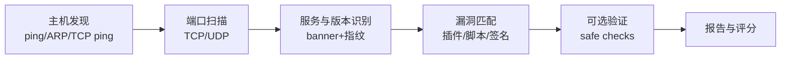
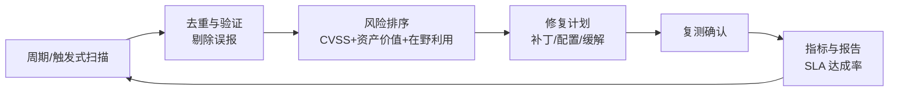

## 1. 扫描器如何工作

漏洞扫描器的通用流水线，理解它才能解读与质疑扫描结果：



三类角色分工：**Nmap** 负责发现层（主机/端口/服务/NSE 脚本探测）；
**Nessus/OpenVAS(GVM)** 负责漏洞层（插件库对版本与配置做 CVE 匹配）；
**专用工具**（Nuclei/Nikto 等 Web 向）见 024-VulnerabilityScan 的专项介绍。

授权提醒：扫描必须落在书面授权范围内（IP 段、时间窗、扫描强度），否则在多数司法辖区
构成违法或侵权行为。

## 2. Nmap：发现与脚本探测

### 2.1 端口与服务

```bash
# 快速存活发现（内网可用 ARP，跨网段用 TCP ping）
nmap -sn 192.168.1.0/24

# SYN 半开扫描：速度快、日志痕迹少（需 root）
sudo nmap -sS -T4 --top-ports 1000 192.168.1.10

# 版本与系统识别
sudo nmap -sV -O --version-intensity 5 192.168.1.10

# 输出三种格式：普通/可 grep/XML（供导入 Nessus/报告）
sudo nmap -sV -oA scan-20260901 192.168.1.10
```

| 常用参数 | 作用                       | 备注                       |
| :------- | :------------------------- | :------------------------- |
| `-sS/-sT` | SYN 半开 / 全连接         | 无 root 退化为 `-sT`       |
| `-sV`    | 服务版本探测               | 版本是 CVE 匹配的输入      |
| `-sU`    | UDP 扫描                   | 慢，聚焦 DNS/SNMP/NTP 等   |
| `-T0..5` | 时序模板                   | `-T4` 内网常用，公网用温和档 |
| `-p-`    | 全 65535 端口              | 全量盘点时必用             |

### 2.2 NSE 脚本引擎

NSE 让 Nmap 具备轻量漏洞探测能力（不替代专业扫描器）：

```bash
nmap --script vuln 192.168.1.10                 # vuln 类别：已知 CVE 探测
nmap --script smb-vuln-ms17-010 -p445 192.168.1.10   # 定向：永恒之蓝
nmap --script http-enum -p80,443 example.com    # Web 路径枚举
nmap --script ssl-enum-ciphers -p443 example.com     # TLS 套件审计
```

深入用法（时序调优、防火墙规避、输出解析）见 038-NmapScan。

## 3. Nessus：任务化漏洞扫描

Tenable 的商业扫描器，插件库大、误报率低，Essentials 版免费供个人小规模使用。

```text
典型工作流：
1. Policies（策略）：选择模板（Basic Network Scan / Credentialed Patch Audit /
   Web Application Tests），配置并发与超时
2. Scans（任务）：指定目标、计划（周期扫描）、通知
3. 凭据扫描（关键）：提供 SSH/SMB 只读凭据 → 从「看版本猜漏洞」升级为
   「登录盘点补丁级」，误报大幅下降
4. 报告：按主机/漏洞两视角导出 PDF/CSV，可自定义合规模板
```

**凭据扫描与否**是结果质量的分水岭：非凭据扫描对打满补丁但版本号未变的发行版
（如 RHEL backport）会大量误报；凭据扫描直接读取补丁号，结果可信度接近事实。

## 4. OpenVAS/GVM：开源替代

OpenVAS 已并入 GVM（Greenbone Vulnerability Management）框架，扫描能力（NVT 网络漏洞测试）
与 Nessus 同构，许可证宽松，适合预算敏感与自定义集成。

```bash
# Kali 快速安装
sudo apt install gvm && sudo gvm-setup      # 首次初始化较久，生成 admin 口令
sudo gvm-start

# 同步 NVT 漏洞签名库（务必保持最新）
sudo gvm-feed-update

# 命令行创建任务并启动（gvm-cli）
gvm-cli socket --xml '<authenticate><credentials><username>admin</username>
  <password>PASS</password></credentials></authenticate>'
gvm-cli socket --xml '<create_target><name>lab</name><hosts>192.168.1.10</hosts></create_target>'
```

与 Nessus 取舍：插件时效与准确度 Nessus 占优；成本与可定制性 GVM 占优。
国内团队亦可用绿盟 RSAS 等商采设备，方法论一致。命令速查见 055-OpenVASCommands。

## 5. 从扫描结果到漏洞管理

扫描器的输出只是起点，漏洞管理是持续流程：



### 5.1 CVSS 评分怎么读

CVSS v3.1 由三组指标构成：基础分（利用难度与影响，0-10）、时间分、环境分。
读报告时优先看向量的这几个维度：

```text
AV:N 攻击向量=网络（可远程利用）
AC:L 利用复杂度=低
PR:L 所需权限=低          # PR:N（无需权限）更危险
UI:N 用户交互=无
C:H/I:H/A:H 机密性/完整性/可用性影响
示例：AV:N/AC:L/PR:N/UI:N → 网络可达、零交互 → 通常 9.x Critical
```

### 5.2 排序不能只看分数

```text
升权因素：
  - 出现在 CISA KEV（已知被在野利用漏洞目录）
  - 暴露面：公网可达 > 内网 > 无网络路径
  - 资产重要性：域控/核心数据库 > 测试环境
  - 有公开 EXP/POC

降权因素：
  - 仅内网且分段隔离、无横向路径
  - 厂商确认不适用（发行版 backport 已修复 → 误报）
SLA 参考线：Critical 7 天 / High 30 天 / Medium 90 天（按行业合规收紧）
```

### 5.3 误报处理三步法

```text
1. 核对版本号是否被发行版「回移」：apt changelog <pkg> / rpm -q --changelog <pkg>
2. 查看 Nessus 插件中的「Solution/See Also」与检测逻辑（插件号查 Tenable 官网）
3. 受控复现：在测试机部署同版本验证，确认后在扫描器标记例外并注明依据
```

## 6. 常见陷阱

| 陷阱                             | 事实                                                   |
| :------------------------------- | :----------------------------------------------------- |
| 用生产环境跑高强度全端口扫描     | 老旧设备（打印机/PLC）可能被扫宕机，先监控模式试点     |
| 只看高危数量汇报                 | 无在野利用的内网中危可能不如一个公网 Critical 紧急     |
| 扫描器自己不更新                 | 插件/NVT 过期等于拿着旧地图找新大陆                    |
| 凭据扫描凭据长期不变             | 扫描凭据也是攻击目标，纳入轮换与最小权限               |
| 把「修复」等同于「装补丁」       | 补丁、配置、缓解（虚拟补丁/WAF 规则）三条路都算修复    |

## 小结

- **初学者要点**：流水线四步（发现→端口→服务→漏洞匹配）；Nmap 管发现与轻量探测，
  Nessus/GVM 管任务化漏洞扫描；读报告先看 CVSS 向量（远程、零权限、零交互最危险），
  再结合暴露面与在野利用排序。
- **进阶注意**：凭据扫描显著降低误报（应对发行版 backport）；修复排序引入 CISA KEV
  与资产价值；把复测与 SLA 达成率作为运营指标；扫描行为本身受授权约束，强度、
  范围、时间窗都要写进测试授权书。
