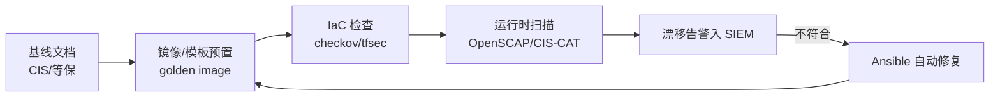

## 1. 什么是安全基线

基线（Baseline）= 某类系统「上线时必须满足的最低安全配置集合」。它把零散的加固经验
变成可核查、可自动化的检查表，解决三个工程问题：

1. **一致性**：一百台机器不必靠一百个人的习惯来保证安全。
2. **可验证**：配置是否符合基线可以用工具扫描得出结论。
3. **可追溯**：出事后对照基线能回答「我们按标准做了吗」。

类比：基线像体检的「正常值范围」——不保证你健康，但任何一项超标都值得追查。

## 2. CIS Benchmark

CIS（Center for Internet Security）维护着最广泛使用的公开基线库，覆盖操作系统、
数据库、中间件、云服务、容器等 100+ 目标。每份 Benchmark 的条目结构固定：

```text
编号（1.1.4）→ 审计方法（Audit，怎么查）→ 修复方法（Remediation，怎么改）
→ 默认值 → 影响说明（改了会影响什么业务行为）
```

「影响说明」是 CIS 区别于普通检查表的关键：每条建议标注了收紧后可能付出的可用性代价，
便于按业务取舍。条目分为 Level 1（基础且低风险）与 Level 2（更高安全性、
可能影响功能或性能），生产环境通常先全量达成 Level 1。

```bash
# 常见 benchmark 示例（节选自 CIS Ubuntu Linux Benchmark）
6.2.10 检查除 root 外无 UID 0 账户
       awk -F: '($3 == 0) {print $1}' /etc/passwd      # 输出应只有 root
5.2.18 SSH 仅允许强 MAC 算法
       sshd -T | grep -i macs                           # 应不含 *-md5、*-96 系列
4.1.2.3 记录 sudo 命令使用（auditd）
       auditctl -l                                      # 应含 execve 相关规则
```

配套工具 **CIS-CAT**（CIS 官方评估器）与社区版 OpenSCAP 内容可自动给出达标率报告。

## 3. 等保 2.0

网络安全等级保护 2.0（GB/T 22239-2019）是国内强制性合规框架，流程为
「定级 → 备案 → 建设整改 → 等级测评 → 监督检查」。

| 等级 | 对象     | 受侵害客体               | 测评周期   |
| :--- | :------- | :----------------------- | :--------- |
| 一级 | 一般系统 | 合法权益                 | 自行保护   |
| 二级 | 一般系统 | 严重损害合法权益         | 建议每两年 |
| 三级 | 重要系统 | 社会秩序/公共利益        | 每年       |
| 四级 | 特别重要 | 严重损害社会秩序/国家安全 | 每半年     |
| 五级 | 极端重要 | 国家安全                 | 专门监管   |

安全要求分「安全通用要求」+ 针对云计算/移动互联/物联网/工业控制的「安全扩展要求」；
通用要求下再分技术（安全物理环境/通信网络/区域边界/计算环境/管理中心）与管理
（管理制度/机构/人员/建设/运维）两翼。等保与 CIS 的关系是「框架 vs 明细」：
等保告诉你要有访问控制与审计能力，CIS/基线给出逐条怎么配。

## 4. 系统加固清单

### 4.1 Linux 基础加固（可直接执行的核心子集）

```bash
# 身份与认证
sed -i 's/^PASS_MAX_DAYS.*/PASS_MAX_DAYS   90/' /etc/login.defs   # 密码有效期
sed -i 's/^PASS_MIN_LEN.*/PASS_MIN_LEN   12/'  /etc/login.defs    # 最小长度
usermod -L username                    # 锁定长期未用账号
passwd -l $(awk -F: '$2=="!"{print $1}' /etc/shadow) 2>/dev/null || true

# SSH 加固 /etc/ssh/sshd_config
PermitRootLogin no
PasswordAuthentication no              # 仅密钥登录
ClientAliveInterval 300
ClientAliveCountMax 2
AllowAgentForwarding no
# systemctl restart sshd

# 权限与文件
chmod 600 /etc/shadow; chown root:root /etc/shadow
find / -xdev -perm -4000 -type f       # 盘点 SUID，按需移除
umask 027                              # 收紧默认权限（/etc/profile）

# 内核参数 /etc/sysctl.conf
net.ipv4.conf.all.accept_redirects = 0
net.ipv4.conf.all.send_redirects = 0
net.ipv4.conf.all.accept_source_route = 0
kernel.randomize_va_space = 2          # ASLR
sysctl -p
```

### 4.2 数据库加固要点（以 MySQL 为例）

```sql
-- 移除匿名账户与测试库
DELETE FROM mysql.user WHERE User='';
DROP DATABASE IF EXISTS test;

-- 限制 root 远程登录
SELECT user, host FROM mysql.user;     -- root 应仅存 root@localhost

-- 最小权限业务账号，禁止 USING *.*
CREATE USER 'app'@'10.0.%' IDENTIFIED BY '<强随机口令>';
GRANT SELECT, INSERT, UPDATE ON shop.* TO 'app'@'10.0.%';

-- 开启审计与慢日志（留存策略按合规要求）
SET GLOBAL general_log = ON;
```

### 4.3 中间件加固要点

```text
Nginx    ：关闭 server_tokens、禁用 autoindex、限制 HTTP 方法、TLS 1.2+（见 021）
Tomcat   ：删除默认应用（docs/examples/manager）、修改shutdown端口口令、低权限运行
Redis    ：requirepass 强口令、bind 内网地址、rename FLUSHALL/CONFIG、禁 root 运行
K8s      ：kube-bench 对标 CIS Benchmark、禁匿名 API 访问、开启 Pod Security
```

Redis 是攻击者最爱：未授权 Redis 曾是挖矿与勒索的Top入口，加固三件套
（口令、绑定、禁危险命令）缺一不可。

## 5. 自动化合规

基线的价值在于持续验证。三层工具链：

```bash
# 1) 扫描：OpenSCAP 对标 CIS 内容
oscap xccdf eval --profile xccdf_org.ssgproject.content_profile_cis_level1_server \
  --results results.xml --report report.html \
  /usr/share/xml/scap/ssg/content/ssg-ubuntu2204-ds.xml

# 2) 修复：Ansible 加固角色（DevSec 硬化角色为社区事实标准）
ansible-playbook -i hosts devsec.os-hardening.yml   # 幂等，可反复执行

# 3) 拦截：IaC 阶段检查（配置进代码仓库时即校验）
checkov -d terraform/          # Terraform/K8s/Dockerfile 合规扫描
kube-bench run --benchmark cis-1.8
```



## 6. 常见陷阱

| 陷阱                             | 事实                                                   |
| :------------------------------- | :----------------------------------------------------- |
| 基线一次配置后不再复核           | 配置漂移是常态，必须周期性扫描 + 变更拦截              |
| 全量照搬 Level 2 条目            | 部分条目影响业务功能，需按影响说明评估取舍并留痕       |
| 「扫描通过 = 安全」              | 基线只覆盖已知配置项，逻辑漏洞与访问控制需另行验证     |
| 手工逐台修复                     | 必须自动化（镜像预置 + Ansible），否则下次扩容即回退   |
| 只做技术要求不做管理要求         | 等保测评为技术+管理双维度，制度缺失同样失分            |

## 小结

- **初学者要点**：基线是「最低安全配置标准」，CIS Benchmark 提供逐条明细（含审计与
  修复方法），等保 2.0 提供国内合规框架（定级备案、通用+扩展要求）。Linux 加固从
  账号、SSH、权限、内核参数四块入手即可覆盖大部分高风险项。
- **进阶注意**：基线的生命力在自动化闭环——镜像预置、IaC 检查、运行时扫描、漂移修复；
  Level 2 条目按业务取舍并记录理由；等保三级系统每年测评，整改证据（扫描报告、
  流程记录）要与制度同步归档。
