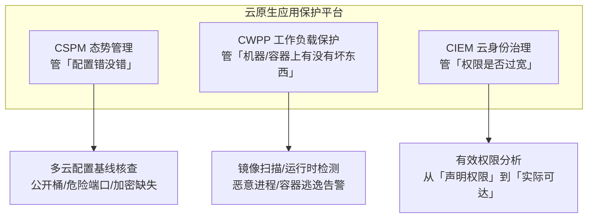

## 1. 共享责任模型：先分清「谁的锅」

云安全的所有讨论都从共享责任模型开始：**云厂商负责「云本身的安全」（of the cloud），
客户负责「云中内容的安全」（in the cloud）**。分界线随服务模型上移：

| 层级         | IaaS（ECS/EC2） | PaaS（托管数据库） | SaaS（在线办公） |
| :----------- | :-------------- | :----------------- | :--------------- |
| 物理与硬件   | 厂商            | 厂商               | 厂商             |
| 虚拟化层     | 厂商            | 厂商               | 厂商             |
| 操作系统     | **客户**        | 厂商               | 厂商             |
| 运行时/中间件 | **客户**       | 厂商（部分）       | 厂商             |
| 应用与配置   | **客户**        | **客户**           | 厂商             |
| 数据与身份   | **客户**        | **客户**           | **客户**         |

注意最后一行：无论哪种模型，**身份与数据永远在客户侧**——历史上绝大多数「云泄露」
（对象存储公开可读、AK 泄露、权限过宽）责任都在配置而非平台。厂商标榜「安全」时，
指的是它那一半。

## 2. 云 IAM：最大的单点风险

### 2.1 与传统 IAM 的三个差异

1. **机器身份占大头**：AK/SK（Access Key）、实例角色、服务账号的数量远超人类账号。
2. **权限表达力强**：策略可以细到 API 级 + 资源级，因此也容易写错成 `"*"`。
3. **临时凭证机制**：实例角色（IMDS）下发短期凭证，替代写死在配置里的长期 AK。

### 2.2 治理清单

```bash
# AWS CLI 示例：排查长期未轮换与过宽的凭证（云厂商 CLI 思路一致）
aws iam generate-credential-report && aws iam get-credential-report \
  --output text --query Content | base64 -d | column -t -s,
# 关注列：password_enabled / mfa_active / access_key_1_last_used_date

# 找出含通配符 Action 的策略
aws iam list-policies --scope Local --query \
  'Policies[?Arn!=`null`].{n:PolicyName,a:Arn}' --output text
# 逐条 list-policy-versions 审查 Statement.Action 是否为 "*"
```

```text
人类账号：SSO 统一入口 + MFA 强制，root/主账号只做极少用的管理动作
机器凭证：优先实例角色/工作负载身份；必须用 AK 时入密钥管理并轮换（≤90 天）
权限边界：按角色模板最小化；用权限边界（permissions boundary）封顶
审计     ：CloudTrail/操作审计全区域开启，写事件告警（root 登录、策略变更、安全组放通）
```

## 3. 云元数据服务与 SSRF

云环境最经典的攻击链是「Web 漏洞 → 元数据服务 → 接管实例身份」：

```text
应用存在 SSRF（如 URL 预览功能）
  → 请求 http://169.254.169.254/latest/meta-data/iam/security-credentials/<role>
  → 返回该实例角色的临时 AK/SK
  → 攻击者用 AK/SK 直接调用云 API（列桶、读数据、起新机器）

对应架构级防御（AWS 为例）：
  IMDSv2：PUT 方式获取 session token，且要求 Token TTL 与跳数限制
          → 传统 GET 型 SSRF 直接失效
  curl -X PUT "http://169.254.169.254/latest/api/token" -H "X-aws-ec2-metadata-token-ttl-seconds: 21600"
```

配套措施：实例角色最小化（宁可多个窄角色也不共用宽角色）、SSRF 防护
（见 011-SSRFAttack）、出网代理白名单。

## 4. 常见错误配置 Top 清单

| 错误配置                     | 典型后果         | 修复要点                       |
| :--------------------------- | :--------------- | :----------------------------- |
| 对象存储公开读写             | 全量数据泄露     | 桶默认私有、阻断公开策略、审计 |
| 安全组 0.0.0.0/0 开 22/3389  | 爆破与漏洞利用   | 堡垒机/SSM 会话替代公网 SSH    |
| 主账号/root 直接用           | 权限爆炸不可控   | 子账号 + SSO + MFA             |
| AK 硬编码进 Git 仓库         | 凭证泄露接管云   | 预提交扫描 + 泄露即吊销轮换    |
| 磁盘/快照未加密、快照公开    | 离线数据还原     | 默认加密策略 + 快照权限审计    |
| 元数据 v1 未禁用             | SSRF 接管实例    | 强制 IMDSv2                    |

## 5. CSPM / CWPP / CNAPP

三类产品分工（按「管配置」还是「管负载」划分）：



- **CSPM** 的核心价值是持续核查：以 AWS Config Rules、Azure Policy、
  GCP Organization Policy 或第三方工具（Prowler、Checkov）实现「配置漂移即告警」。
- **CWPP** 的典型栈：镜像扫描（Trivy/Grype）+ 运行时检测（Falco 规则，如
  容器内出现 `nsenter`、写 `/etc/shadow` 即告警）+ 完整性监控。
- **CNAPP** 是上述能力的平台化整合（国际厂商产品线为主流形态），配套把
  「代码→构建→部署→运行」的发现按同一资产上下文聚合。

## 6. 云原生安全左移

把安全检查塞进交付流水线（与 018-SecureDevelopment 的 SDL 呼应）：

```yaml
# CI 流水线安全阶段示例（伪配置）
stages:
  secrets:                       # 1. 密钥泄露扫描
    cmd: gitleaks detect --source . --report-format json
  sast:                          # 2. 代码漏洞扫描
    cmd: semgrep ci --config auto
  sca:                           # 3. 依赖漏洞（SBOM 随行）
    cmd: trivy fs --scanners vuln,license --format cyclonedx .
  iac:                           # 4. IaC 与云配置
    cmd: checkov -d terraform/ --framework terraform
  image:                         # 5. 镜像构建后扫描 + 签名
    cmd: trivy image --exit-code 1 --severity CRITICAL app:latest && cosign sign app:latest
  deploy:                        # 6. 部署前策略校验（准入控制）
    cmd: kyverno apply policies/ --resource manifests/
```

运行时兜底：K8s 的 Pod Security Standards（禁 privileged、只读根文件系统）、
NetworkPolicy 默认拒绝、服务网格 mTLS——与零信任思想一致（见 031-ZeroTrustArchitecture）。

## 7. 云合规与取证注意

- 合规映射：等保/ISO 27001 的控制项大多有云厂商原生对应物（加密、审计、访问控制），
  用共享责任矩阵逐条标注「厂商实现 / 客户实现」即成合规证据。
- 取证特殊性：日志在云上（操作审计、流日志、对象存储访问日志），先**保留快照与日志
  归档**再做修复，防止「处置动作销毁证据」；跨区域复制留存满足时效要求。

## 8. 常见误区

| 误区                             | 事实                                                   |
| :------------------------------- | :----------------------------------------------------- |
| 「上云 = 厂商负责安全」          | 身份、配置、数据永远在客户侧，泄露多源于配置错误       |
| 「内网安全组放了就安全」         | 横向移动与 SSRF 不看网段，最小权限 + 身份校验才是边界  |
| 「开了 CloudTrail 就有审计」     | 未开启多区域/写事件告警、日志桶未保护等于没记          |
| 「临时凭证不用管」               | 角色权限过宽时，一次 SSRF 就能借临时凭证横向           |
| 「镜像扫一次就完」               | 新 CVE 不断公开，镜像需周期性重扫与重建（rebuild）     |

## 小结

- **初学者要点**：共享责任模型决定「什么该你管」；历史泄露事故绝大多数是配置与
  凭证问题——公开存储桶、过宽策略、AK 入 Git、元数据 v1。CSPM 管「配置错没错」，
  CWPP 管「负载干净不干净」。
- **进阶注意**：云 IAM 的治理重点是机器身份与「实际可达权限」（CIEM 视角）；
  IMDSv2 + 最小实例角色是 SSRF→接管的根本解；把安全左移进 CI（密钥/SAST/SCA/IaC/
  镜像五连检）并用运行时检测兜底；取证时先固化日志与快照再处置。
