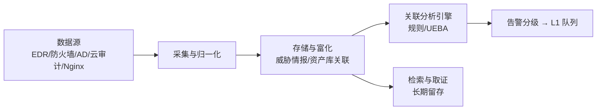

## 1. SOC 是什么

安全运营中心（Security Operations Center）是组织**持续监测、检测、分析与响应**
安全威胁的职能（可以是物理房间、虚拟团队或外包服务 MDR）。它与 IT 运维的区别：
运维保障「系统可用」，SOC 保障「没有坏人在系统里自由行动」。

> 类比：SOC 像医院的急诊科——平时有分诊台（告警分级）、化验室（威胁情报/沙箱）、
> 住院部（事件处置），一切围绕「早发现、快处置、可复盘」。

人员上通常三层分级：

| 层级 | 角色       | 职责                                     |
| :--- | :--------- | :--------------------------------------- |
| L1   | 告警分诊   | 盯告警队列，按手册初筛，升级或关闭       |
| L2   | 事件分析师 | 深入调查（取证、关联）、确定影响范围     |
| L3   | 专家/猎手  | 威胁狩猎、规则与 Playbook 设计、复杂取证 |

## 2. SIEM：检测的数据底座

SIEM（Security Information and Event Management）完成「日志进来 → 告警出去」：



### 2.1 数据源优先级

预算有限时按「检测价值密度」排序接入：

```text
第一梯队：身份日志（AD/IdP 登录、权限变更）、EDR 终端进程/网络事件、邮件网关
第二梯队：边界防火墙/NAT、DNS 解析日志（隐蔽通道高发地）、云平台审计日志
第三梯队：Web/Nginx 访问日志、数据库审计、DHCP/无线
```

### 2.2 关联规则：从日志到告警

规则是「攻击模式的结构化表达」。示例（伪 Sigma 规则，Sigma 是跨 SIEM 的规则标准格式）：

```yaml
title: 可疑的 SAM 注册表导出（凭证转储前兆）
logsource:
    product: windows
    service: sysmon
detection:
    selection:
        EventID: 1
        Image|endswith: '\reg.exe'
        CommandLine|contains|all:
            - 'save'
            - 'hklm\sam'
    condition: selection
tags: [attack.credential_access, attack.t1003.002]
level: high
```

典型的复合场景规则（多事件关联）：

```text
暴力破解成功：同一源 IP 5 分钟内 ≥5 次登录失败 且 随后成功登录
异常登录     ：用户首次从新国家/非工作时段登录 且 紧随大量文件访问
权限维持     ：新增本地管理员 + 45 分钟内创建计划任务
数据外带     ：单主机对外上传流量超基线 3 倍 且 访问新注册域名
```

### 2.3 告警调优：SOC 的日常胜负手

没有调优的 SIEM 会淹没团队。三个手段：

1. **白名单抑制**：已知合法行为（扫描器、备份账号、变更窗口）明确登记后抑制，
   但保留「白名单本身被滥用」的元规则（如该账号突然换了源 IP）。
2. **基线化**：用统计基线替代绝对阈值（「每天登录失败 >50」不如「超过该账号
   90 天基线 3 个标准差」）。
3. **定期复盘**：每周统计误报 Top 规则，逐条改进或降级；关闭规则必须有记录。

常见产品：Splunk（功能全）、Elastic Security（开源栈）、Microsoft Sentinel（云原生、
按量计费）、QRadar、Wazuh（轻量开源）。选型看数据量、留存要求与团队运维能力。

## 3. SOAR：让响应自动化

SOAR（Security Orchestration, Automation and Response）把「告警 → 富化 → 判定 →
处置」流水线写成可编排的 Playbook，把 L1 从重复劳动中解放出来。

```yaml
# Playbook 示例：暴力破解自动处置（伪 YAML，各平台语法不同）
name: brute-force-auto-triage
trigger:
  alert: brute_force_detected
steps:
  - enrich:                      # 富化：给告警补充上下文
      - geoip: source_ip
      - threat_intel: source_ip  # 查询 IP 信誉（见第 4 节）
      - asset: destination_host  # 查资产库：这是台什么机器
  - decide:
      rule: |
        ip.reputation in [malicious, botnet] and asset.criticality != "high"
  - act_true:
      - block_ip: { target: source_ip, device: edge_fw, ttl: 24h }
      - notify: { channel: soc-l1, template: bf_blocked }
  - act_false:
      - task: assign_to_L1       # 情况不明转人工
```

自动化边界原则：**高置信 + 可逆 + 低爆炸半径**的动作才全自动（封 IP、隔离终端）；
涉及生产业务与高价值资产的动作必须人工确认（阻断账号、拔网线）。

## 4. 威胁情报

情报分四个层次，误用最多的就是把「IoC 列表」当成全部情报：

| 类型 | 内容                       | 时效     | 用途               |
| :--- | :------------------------- | :------- | :----------------- |
| 战略 | 攻击趋势、地缘、行业风险   | 年/季    | 预算与策略决策     |
| 运营 | 攻击者组织、动机、活动阶段 | 周/月    | 猎捕与研判         |
| 战术 | TTP（手法、工具、过程）    | 月       | 检测规则设计       |
| 技术 | IoC：恶意 IP/域名/哈希     | 小时/天  | 自动拦截与富化     |

- IoC 时效最短（ weeks 级衰减），只适合短期拦截；TTP 检测寿命最长。
- 用 MITRE ATT&CK 编号组织战术情报（见 006-SecurityModelFramework）。
- 情报要进两类系统：SIEM（回溯 30-90 天是否中招）与边界设备（前置拦截）。
- 免费源起步： abuse.ch 系列（URLhaus/ThreatFox）、CISA KEV、AlienVault OTX。

## 5. 事件分级与响应衔接

SOC 检出的事件需要分级驱动响应时效（流程展开见 015-IncidentResponse）：

| 级别 | 判定示例                       | 响应时效  | 指挥层级 |
| :--- | :----------------------------- | :-------- | :------- |
| P1   | 勒索软件执行、批量数据外带     | 15 分钟内 | 管理层   |
| P2   | 确认入侵（WebShell、持久化）   | 1 小时内  | SOC 经理 |
| P3   | 可疑行为待查（爆破成功告警）   | 4 小时内  | L2       |
| P4   | 策略违规、低置信告警           | 24 小时内 | L1       |

## 6. 安全度量：证明 SOC 在起作用

| 指标   | 含义与目标参考                                     |
| :----- | :------------------------------------------------- |
| MTTD   | 平均检测时间：从入侵发生到告警确认，目标压到小时级 |
| MTTR   | 平均响应时间：从确认到遏制完成                     |
| 误报率 | 误报/总告警，L1 队列质量的核心指标                 |
| 覆盖率 | ATT&CK 技术/子技术有检测映射的比例                 |
| 检出验证 | 红队/Atomic Red Team 注入后是否产生告警（真检出率） |

注意指标游戏化陷阱：告警总量大不等于能力强；「红队动作被检出率」是比告警数
诚实得多的指标。

## 7. 建设路径与常见误区

```text
小团队起步（1-3 人）：EDR + 云 SIEM（Sentinel/Elastic）+ 精选 20 条核心规则
  + 关键 Playbook 3 个（爆破/WebShell/勒索）+ 周报指标
中型（3-10 人）：全量第一梯队数据源 + UEBA + SOAR + 威胁情报平台（TIP）
大型/合规要求：7x24 值守（或 MDR 外包混合）、专责狩猎、Purple Team 演练常态化
```

| 误区                             | 事实                                                   |
| :------------------------------- | :----------------------------------------------------- |
| 「买了 SIEM 就有了检测能力」     | 没有规则调优与人员，SIEM 只是昂贵日志仓库             |
| 「告警越多越安全」               | 告警疲劳让真告警被忽略，质量远重要于数量              |
| 「全自动响应最先进」             | 不可逆动作必须人工确认，自动化失控会自伤业务          |
| 「IoC 情报库越全越好」           | 无差别灌入 IoC 会产生海量误报，需按信誉与时效加权     |
| 「SOC 只管检测不管改进」         | 每次事件都要回流为规则、基线与 Playbook 的改进        |

## 小结

- **初学者要点**：SOC = 人（L1/L2/L3）+ 流程（分级响应）+ 平台（SIEM/SOAR/情报）。
  SIEM 的价值在「关联规则 + 持续调优」，SOAR 把高置信处置自动化，威胁情报分四层、
  TTP 比 IoC 更长效。
- **进阶注意**：建设顺序是「数据源 → 少量高质量规则 → 调优 → 自动化」，跳步会导致
  告警沼泽；度量以 MTTD/MTTR 与 ATT&CK 覆盖率为主，用红队注入验证真检出；
  与 015-IncidentResponse 的响应流程、035-WAFRule 的边界拦截形成闭环。
