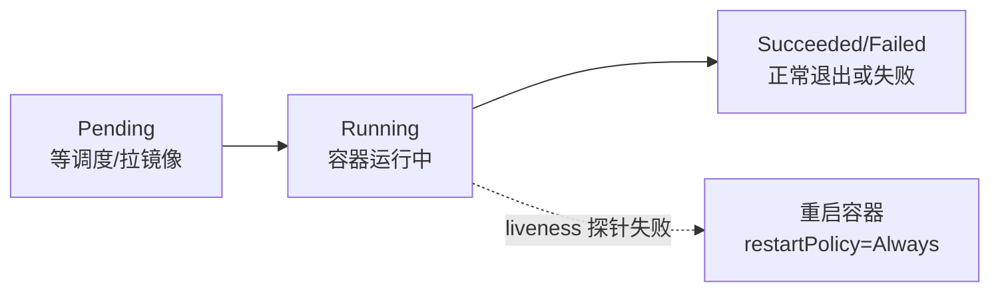

## 0. 一句话理解

> Kubernetes 的一切运维动作都是围绕**核心资源对象**展开的：Pod 是最小部署单元，
> Deployment 管 Pod 的副本与滚动更新，Service 提供稳定访问入口，Ingress 管外部
> 路由，ConfigMap/Secret 管配置，StatefulSet/HPA 处理有状态与弹性。
> 本文是对这些对象的"为什么这样设计 + 怎么用好"的详解。

前置说明：本文示例以 Kubernetes 1.33/1.34 为基准（2025 年的当前版本线），
API 全部为 GA 稳定版本；升级集群时以官方 API 参考为准。

## 1. Pod：最小调度单元

### 1.1 为什么是 Pod 而不是容器

一个 Pod = 一个或多个共享网络/存储的容器组。设计动机：有些进程天然需要"同生共死、
共享 localhost"（如主进程 + 日志代理 sidecar）。调度、扩缩容、网络身份都以 Pod 为单位。

### 1.2 Pod 的生命周期



关键点：

1. **Pod 是易逝的（ephemeral）**：被删除后不会"复活"，IP 也会变。任何需要
   "稳定身份"的需求都应交给 Deployment/StatefulSet 而不是手工管理裸 Pod。
2. **探针决定生死**：`livenessProbe` 失败重启容器，`readinessProbe` 失败只摘除流量，
   `startupProbe` 给慢启动应用"免检期"。探针路径务必轻量，避免查数据库。

```yaml
# 完整的单容器 Pod：探针 + 资源 + 配置注入
apiVersion: v1
kind: Pod
metadata:
  name: web-app
  labels:
    app: web
spec:
  containers:
    - name: web
      image: nginx:1.28-alpine # 固定版本标签，不用 latest
      ports:
        - containerPort: 80
      resources:
        requests: { cpu: 100m, memory: 128Mi } # 调度依据
        limits: { cpu: 500m, memory: 512Mi }   # 硬上限（内存超限 OOMKill）
      readinessProbe: # 就绪才接流量
        httpGet: { path: /, port: 80 }
        initialDelaySeconds: 5
        periodSeconds: 5
      livenessProbe: # 失败则重启容器
        httpGet: { path: /, port: 80 }
        initialDelaySeconds: 15
        periodSeconds: 10
  restartPolicy: Always
```

## 2. Deployment：无状态应用的控制器

### 2.1 声明副本数，控制器补差价

Deployment 声明"我要 3 个副本"，ReplicaSet 控制器持续对比期望与实际并补齐/回收 Pod。
发布时它创建新 ReplicaSet、按 `maxSurge/maxUnavailable` 逐步切换，实现滚动更新。

```yaml
apiVersion: apps/v1
kind: Deployment
metadata:
  name: web-deployment
spec:
  replicas: 3
  revisionHistoryLimit: 5        # 保留 5 个历史版本供回滚
  selector:
    matchLabels: { app: web }    # 必须与 template 标签匹配，否则报校验错误
  strategy:
    type: RollingUpdate
    rollingUpdate:
      maxSurge: 1        # 最多多起 1 个新 Pod（发布不缩容）
      maxUnavailable: 0  # 不允许减少可用副本（零停机关键参数）
  template:
    metadata:
      labels: { app: web }
    spec:
      containers:
        - name: web
          image: myapp:v2
          readinessProbe: # 没有 readiness 的滚动更新=盲切流量
            httpGet: { path: /healthz, port: 8080 }
```

### 2.2 发布、回滚与常见坑

```bash
kubectl set image deployment/web-deployment web=myapp:v3
kubectl rollout status deployment/web-deployment   # 阻塞等待完成
kubectl rollout undo deployment/web-deployment     # 回滚上一版
kubectl rollout history deployment/web-deployment  # 查看历史修订
```

常见坑：

1. **template 标签与 selector 不匹配**：直接报错，是新手第一坑。
2. **没配 readinessProbe**：新 Pod 一启动就接流量，请求大量失败。
3. **镜像标签用 latest**：`imagePullPolicy` 默认 Always 且无法追踪版本，回滚语义混乱。
4. **优雅终止缺失**：配 `terminationGracePeriodSeconds` 并在应用里处理 SIGTERM，
   否则滚动更新瞬间出现 502。

## 3. Service：给易逝的 Pod 一个稳定地址

### 3.1 三种类型与选择

| 类型 | 暴露范围 | 典型场景 |
| :--- | :--- | :--- |
| ClusterIP（默认） | 集群内虚拟 IP + DNS 名 | 服务间调用 |
| NodePort | 每个节点开 30000-32767 端口 | 临时演示、无 LB 环境 |
| LoadBalancer | 云厂商负载均衡器 | 生产对外入口（常与 Ingress 配合） |

```yaml
apiVersion: v1
kind: Service
metadata:
  name: web-service
spec:
  type: ClusterIP
  selector: { app: web } # 按标签动态选中 Pod，Pod 换 IP 无影响
  ports:
    - port: 80        # Service 端口
      targetPort: 8080 # 容器端口
```

集群内任何 Pod 都可用 DNS 名 `web-service.<namespace>.svc.cluster.local` 访问它。
原理：kube-proxy 在每个节点写 iptables/IPVS 规则做目的地址转换（DNAT），
并不是真的"一个代理进程转发"。

### 3.2 Ingress：七层路由入口

Service 只能按"服务"暴露，Ingress 把不同域名/路径汇聚到一个入口：

```yaml
apiVersion: networking.k8s.io/v1
kind: Ingress
metadata:
  name: web-ingress
  annotations:
    cert-manager.io/cluster-issuer: letsencrypt-prod # 自动签发 TLS 证书
spec:
  ingressClassName: nginx # 1.18+ 用字段而非废弃的 kubernetes.io/ingress.class 注解
  tls:
    - hosts: [example.com]
      secretName: example-tls
  rules:
    - host: example.com
      http:
        paths:
          - path: /api
            pathType: Prefix
            backend: { service: { name: api-service, port: { number: 80 } } }
          - path: /
            pathType: Prefix
            backend: { service: { name: web-service, port: { number: 80 } } }
```

Ingress 资源本身只是"路由规则"，必须有 Ingress Controller（如 ingress-nginx）
运行才生效。网关型新 API 是 Gateway API（v1 已 GA），复杂路由场景值得了解。

## 4. ConfigMap 与 Secret：配置与敏感信息

| 对象 | 用途 | 注意 |
| :--- | :--- | :--- |
| ConfigMap | 非敏感配置（键值/文件） | 挂载为 env 的部分更新不会热生效 |
| Secret | 敏感信息（密码/证书） | etcd 中仅 Base64 **编码非加密**，需开静态加密 |

```yaml
apiVersion: v1
kind: ConfigMap
metadata:
  name: app-config
data:
  LOG_LEVEL: 'info'
  nginx.conf: |
    server { listen 80; location / { proxy_pass http://web-service; } }
---
apiVersion: v1
kind: Secret
metadata:
  name: db-secret
type: Opaque
stringData: # 明文写法，API 会转成 base64 的 data 字段
  username: admin
  password: secret123
```

生产建议：Secret 的真实加密交给外部体系——Vault + External Secrets Operator、
云 KMS 的 `EncryptionConfiguration` 静态加密，并开启 RBAC + 审计限制访问。

## 5. StatefulSet：有状态应用的专属控制器

与 Deployment 的三大差异：

1. **稳定网络身份**：Pod 名固定为 `<名称>-序号`（如 `mysql-0`），配 headless Service
   可被稳定解析。
2. **稳定存储**：每个 Pod 绑定自己的 PVC（`volumeClaimTemplates`），重建后重新挂回。
3. **有序部署/伸缩**：默认从 N-1 到 0 逆序删除、0 到 N-1 顺序创建（可并行）。

```yaml
apiVersion: apps/v1
kind: StatefulSet
metadata:
  name: mysql
spec:
  serviceName: mysql-headless # 必须，稳定域名的基础
  replicas: 3
  selector: { matchLabels: { app: mysql } }
  template:
    metadata: { labels: { app: mysql } }
    spec:
      containers:
        - name: mysql
          image: mysql:8.4
          volumeMounts:
            - { name: data, mountPath: /var/lib/mysql }
  volumeClaimTemplates: # 每个 Pod 一块独立 PVC
    - metadata: { name: data }
      spec:
        accessModes: ['ReadWriteOnce']
        resources: { requests: { storage: 50Gi } }
```

判断标准：需要稳定身份/独立存储/主从拓扑的（数据库、MQ、ES）用 StatefulSet；
否则一律 Deployment。能外置的状态（用云数据库）优先外置，别为了练手把
MySQL 搬上 StatefulSet。

## 6. HPA：水平自动扩缩容

```yaml
apiVersion: autoscaling/v2
kind: HorizontalPodAutoscaler
metadata:
  name: web-hpa
spec:
  scaleTargetRef: { apiVersion: apps/v1, kind: Deployment, name: web-deployment }
  minReplicas: 2
  maxReplicas: 10
  metrics:
    - type: Resource
      resource:
        name: cpu
        target: { type: Utilization, averageUtilization: 70 }
  behavior:
    scaleDown:
      stabilizationWindowSeconds: 300 # 5 分钟缩容冷静期，防抖动
```

要点：

1. HPA 基于 **Pod 实际用量/requests 的比率**：没配 requests 就无法计算，HPA 直接失效。
2. 需要 Metrics Server（资源指标）或 Prometheus Adapter（自定义指标）。
3. 缩容冷静期是防"流量抖动→副本震荡"的关键；扩容默认响应快、缩容慢，符合直觉。

## 7. 陷阱与排查速查

| 现象 | 高频原因 | 排查命令 |
| :--- | :--- | :--- |
| Pod 卡 Pending | 资源不足/无可用节点/亲和性不满足 | `kubectl describe pod` 看 Events |
| Pod CrashLoopBackOff | 应用启动失败/探针配置错误 | `kubectl logs --previous` |
| ImagePullBackOff | 镜像名错/私有仓库未配凭据 | `kubectl describe pod` + `kubectl create secret docker-registry` |
| Service 访问不通 | selector 与 Pod 标签不匹配 | `kubectl get endpoints <svc>`（无 IP 即不匹配） |
| 滚动更新卡住 | readiness 不通过/配额不足 | `kubectl rollout status` + `describe` |

## 8. 小结

**初学者要点**

1. Pod 是易逝的，稳定性由 Deployment/Service/StatefulSet 这些控制器提供。
2. 四件套最小闭环：Deployment（跑应用）+ Service（内部访问）+ Ingress（外部入口）
   + ConfigMap/Secret（配置）。
3. readinessProbe 与 resources.requests 是从"能跑"到"能上生产"的分水岭。

**进阶注意**

1. 滚动更新零停机依赖：maxUnavailable=0 + readinessProbe + 优雅终止三者齐备。
2. 有状态服务先评估"外置托管"，确需 StatefulSet 时理解有序性与 PVC 绑定语义。
3. HPA 的前提是 requests 准确；用量长期贴 limit 的应用先扩 limit 再谈自动扩缩。
4. Ingress 的继任者 Gateway API 适合多团队/复杂路由场景，新集群可提前规划。
