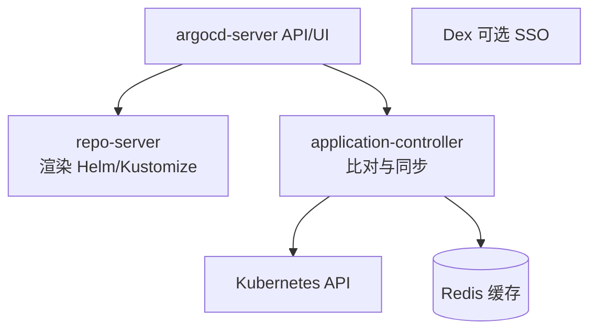

## 0. 一句话理解

> GitOps 的操作对象是 Git 而不是集群：把期望状态（YAML/Chart）提交到仓库，
> 集群内的控制器（ArgoCD）持续比对"Git 里写的"与"集群里跑的"，自动把差异抹平。
> 从此"改环境=提 PR"，回滚=revert 一个 commit。

## 1. GitOps 四原则与 Push/Pull 之别

| 原则 | 含义 |
| :--- | :--- |
| 声明式 | 期望状态必须是可声明的（YAML/Helm/Kustomize） |
| 版本化 | 唯一事实来源在 Git，每笔变更可追溯 |
| 自动拉取 | Agent 自动从 Git 取期望状态，人不在回路中 |
| 持续协调 | 控制器不断纠正漂移，实际状态向期望状态收敛 |

Push 与 Pull 模式的本质区别在**凭证放哪里**：

```text
Push（传统 CI/CD）：流水线拿着生产 kubeconfig 从外面 kubectl apply
  -> 凭证在 CI 系统里，CI 被攻破=集群被攻破

Pull（GitOps）：集群内 Agent 只读拉取 Git、由内向外 apply
  -> 生产凭证不出集群，CI 只需要"写 Git"的权限，攻击面小得多
```

## 2. ArgoCD 架构与安装



三个关键组件：`application-controller` 执行 diff/同步循环（核心），
`repo-server` 把 Helm/Kustomize 渲染成纯清单，`server` 提供 API 与 UI。

```bash
# 安装（命名空间 argocd）
kubectl create namespace argocd
kubectl apply -n argocd -f https://raw.githubusercontent.com/argoproj/argo-cd/stable/manifests/install.yaml

# CLI 登录（改掉初始 admin 密码）
argocd admin initial-password -n argocd
argocd login <ARGOCD_HOST> --username admin --password <密码>
```

## 3. 第一个 Application

Application 是 ArgoCD 的核心 CRD：描述"从哪个仓库的哪个路径，同步到哪个集群的哪个命名空间"。

```yaml
apiVersion: argoproj.io/v1alpha1
kind: Application
metadata:
  name: myapp
  namespace: argocd
spec:
  project: default
  source:
    repoURL: https://github.com/org/myapp-manifests.git
    targetRevision: main
    path: overlays/production # Kustomize overlay 或 Helm chart 目录
  destination:
    server: https://kubernetes.default.svc # 本集群
    namespace: production
  syncPolicy:
    automated:
      prune: true    # Git 里删了资源，集群里也删
      selfHeal: true # 有人手改集群状态，自动拉回与 Git 一致
    syncOptions:
      - CreateNamespace=true
    retry:
      limit: 5
      backoff: { duration: 5s, factor: 2, maxDuration: 3m }
```

三种同步状态：`Synced`（一致）、`OutOfSync`（有漂移）、`Unknown`（比对失败）。
健康状态（Healthy/Degraded/Progressing/missing）由各资源的健康检查逻辑决定，
两者独立：**Synced 只管"清单一致"，Healthy 才代表"服务真的没事"**。

## 4. 同步策略：自动、手动与 Hook

1. **自动同步**：合并即上线，适合开发/预发；配合 `selfHeal` 防手工漂移。
2. **手动同步**：Git 是事实源，但需要人点"Sync"按钮放行——生产常用的审批位。
3. **Sync Hook**：在同步前后插入 Job（数据库迁移、冒烟测试）：

```yaml
# 同步前执行的迁移任务：argocd.argoproj.io/hook: PreSync
apiVersion: batch/v1
kind: Job
metadata:
  name: db-migrate
  annotations:
    argocd.argoproj.io/hook: PreSync          # 还有 PostSync/SyncFail/Skip
    argocd.argoproj.io/hook-delete-policy: HookSucceeded
spec:
  template:
    spec:
      restartPolicy: Never
      containers:
        - name: migrate
          image: myapp:2.0.0
          command: ["./manage", "migrate", "--apply"]
```

## 5. 多环境与规模化模式

### 5.1 仓库布局的两种主流流派

```text
单仓多环境（推荐起步）：                多仓分离（应用仓 / 配置仓）：
repo: k8s-manifests                    app-repo: 代码 + Dockerfile + CI
├── base/                              config-repo: 环境清单（ArgoCD 监听）
│   ├── deployment.yaml                CI 构建镜像后，由 bot 向 config-repo
│   └── kustomization.yaml             提交"新镜像 tag"的 PR -> 自动同步
└── overlays/
    ├── dev/kustomization.yaml
    └── prod/kustomization.yaml
```

多仓分离的关键收益：**应用代码变更与配置变更解耦**，CI 只需要向配置仓写镜像版本，
这正是 GitHub Actions 里常见的 `sed`/kustomize edit 步骤。

### 5.2 App of Apps 与 ApplicationSet

- **App of Apps**：一个父 Application 指向一个"Application 清单目录"，
  管住集群里的所有应用——引导（bootstrap）整个集群就用一个 Application。
- **ApplicationSet**：用 generator（Git 目录/集群列表/矩阵）批量生成 Application，
  多集群场景的标准答案：

```yaml
apiVersion: argoproj.io/v1alpha1
kind: ApplicationSet
metadata:
  name: myapp-all-envs
  namespace: argocd
spec:
  generators:
    - list:
        elements:
          - env: dev
            server: https://dev-cluster.example.com
          - env: prod
            server: https://prod-cluster.example.com
  template:
    metadata: { name: 'myapp-{{env}}' }
    spec:
      source: { repoURL: https://github.com/org/myapp-manifests.git, targetRevision: main, path: 'overlays/{{env}}' }
      destination: { server: '{{server}}', namespace: myapp }
      syncPolicy:
        automated: { prune: true, selfHeal: true }
```

## 6. 常见陷阱

| 陷阱 | 现象 | 对策 |
| :--- | :--- | :--- |
| Git 是事实源，密码也进了 Git | Secret 泄漏 | SealedSecrets/External Secrets/Vault |
| 只看 Synced 不看 Healthy | "同步成功"但服务不健康 | 接告警看健康状态 + `argocd app wait` |
| CI 直接 kubectl 改集群 | 绕过 Git 造成永久漂移 | CI 只改 Git，selfHeal 兜底 |
| prune 误删共享资源 | 被其他系统管理的对象被清掉 | 资源加注解 `argocd.argoproj.io/sync-options: Prune=false` |
| 大仓库渲染超时 | repo-server 频繁 OOM | 拆仓/调大并发，用 manifest generate 缓存 |
| CRD 升级靠 replace | CRD 不会被子资源更新 | 用 ServerSideApply 或 Sync hook 处理 CRD |

## 7. 动手试试

1. 用 kind 起一个本地集群并安装 ArgoCD，把一个 `helm create` 的 Chart 目录作为
   source.path 创建 Application，观察 UI 里的资源树。
2. 手动 `kubectl scale` 改副本数，等待 selfHeal 把它拉回 Git 声明的值。
3. 加一个 PreSync Job 打印"开始同步"，合并一个 PR 观察 Hook 的执行顺序。

## 8. 小结

**初学者要点**

1. GitOps=声明式 + 版本化 + 自动拉取 + 持续协调；ArgoCD 是其在 K8s 的事实标准实现。
2. Application 描述"仓库路径 -> 集群位置"，Synced 与 Healthy 是两个维度。
3. 改环境=提 PR，回滚=revert，审计与安全模型都围绕 Git 建立。

**进阶注意**

1. 应用仓/配置仓分离 + CI 回写镜像版本，是团队协作的标准拓扑。
2. App of Apps 引导集群、ApplicationSet 管多集群，两者组合支撑规模化。
3. 渐进式发布（金丝雀）由 Argo Rollouts/Flagger 补位，见持续交付篇。

## 应用管理

**基本用法:创建应用**
`argocd app create <应用名> --repo <仓库> --path <路径> --dest-server <集群> --dest-namespace <命名空间>`

```bash
# 从 Git 仓库创建应用
argocd app create web-app \
  --repo https://github.com/org/repo.git \
  --path manifests/web \
  --dest-server https://kubernetes.default.svc \
  --dest-namespace production

# 从 Helm Chart 创建应用
argocd app create helm-app \
  --repo https://github.com/org/charts.git \
  --path charts/nginx \
  --helm-chart nginx \
  --dest-server https://kubernetes.default.svc \
  --dest-namespace production
```

---

**基本用法:查看应用列表**
`argocd app list`

```bash
# 列出所有应用
argocd app list

# 按命名空间筛选
argocd app list -A | grep production

# 输出 JSON 格式
argocd app list -o json | jq '.[].metadata.name'
```

---

**基本用法:查看应用详情**
`argocd app get <应用名>`

```bash
# 查看应用配置与同步状态
argocd app get web-app

# 查看应用完整 YAML
argocd app get web-app -o yaml

# 查看应用状态简报
argocd app get web-app --show-params
```

---

**基本用法:删除应用**
`argocd app delete <应用名>`

```bash
# 删除应用(保留集群中的资源)
argocd app delete web-app

# 级联删除(同时删除集群中资源)
argocd app delete web-app --cascade

# 强制删除
argocd app delete web-app --yes
```

---

## 同步操作

**基本用法:手动同步应用**
`argocd app sync <应用名>`

```bash
# 同步应用
argocd app sync web-app

# 同步指定修订版
argocd app sync web-app --revision=v1.2.0

# 同步前先刷新 Git
argocd app sync web-app --refresh

# 干运行(仅显示变更不执行)
argocd app sync web-app --dry-run
```

---

**基本用法:选择性同步**
`argocd app sync <应用名> --resource <资源>`

```bash
# 仅同步指定资源
argocd app sync web-app --resource deployment:web

# 仅同步指定资源类型
argocd app sync web-app --resource Deployment

# 排除某些资源同步
argocd app sync web-app --resource '!Service'

# 应用同步前钩子
argocd app sync web-app --apply-out-of-sync-only
```

---

**基本用法:同步策略**
`argocd app set <应用名> --sync-policy <策略>`

```bash
# 设置自动同步
argocd app set web-app --sync-policy automated

# 自动同步时自动修剪资源
argocd app set web-app --auto-prune

# 自动同步时自愈(防止手动修改)
argocd app set web-app --self-heal

# 禁用自动同步
argocd app set web-app --sync-policy none
```

---

**基本用法:查看同步状态**
`argocd app sync <应用名> --dry-run`

```bash
# 查看同步差异
argocd app diff web-app

# 查看与指定版本的差异
argocd app diff web-app --revision=HEAD

# 查看本地文件与应用差异
argocd app diff web-app --local=manifests/
```

---

## 应用配置

**基本用法:修改应用参数**
`argocd app set <应用名> [选项]`

```bash
# 设置 Helm 参数
argocd app set web-app --helm-set image.tag=v1.2.0

# 设置 Helm 参数(从文件)
argocd app set web-app --values values-production.yaml

# 设置 Kustomize 镜像
argocd app set web-app --kustomize-image web=nginx:1.28

# 修改目标命名空间
argocd app set web-app --dest-namespace staging
```

---

**基本用法:查看应用参数**
`argocd app get <应用名> --show-params`

```bash
# 显示应用所有参数
argocd app get web-app --show-params

# 查看应用 manifests
argocd app manifests web-app

# 查看应用历史
argocd app history web-app
```

---

**基本用法:回滚应用**
`argocd app rollback <应用名> <版本号>`

```bash
# 查看历史版本
argocd app history web-app

# 回滚到指定版本
argocd app rollback web-app 3

# 回滚后禁用自动同步(避免被自动同步回去)
argocd app set web-app --sync-policy none
```

---

## 仓库与项目

**基本用法:添加仓库**
`argocd repo add <仓库URL>`

```bash
# 添加 Git 仓库
argocd repo add https://github.com/org/repo.git --username user --password pass

# 添加私有仓库(SSH)
argocd repo add git@github.com:org/repo.git --ssh-private-key-path ~/.ssh/id_rsa

# 添加 HTTPS 仓库(带凭据)
argocd repo add https://github.com/org/repo.git --username ci --password $GITHUB_TOKEN
```

---

**基本用法:查看仓库**
`argocd repo list`

```bash
# 列出已配置的仓库
argocd repo list

# 测试仓库连接
argocd repo list -o json | jq '.[].repo'

# 查看仓库详情
argocd repo get https://github.com/org/repo.git
```

---

**基本用法:管理项目**
`argocd proj create <项目名>`

```bash
# 创建项目
argocd proj create my-project \
  --dest https://kubernetes.default.svc,production \
  --src https://github.com/org/repo.git

# 添加允许的目标集群
argocd proj add-destination my-project https://kubernetes.default.svc staging

# 添加允许的源仓库
argocd proj add-source my-project https://github.com/org/another-repo.git

# 查看项目列表
argocd proj list
```

---

**基本用法:项目角色与令牌**
`argocd proj role create <项目> <角色>`

```bash
# 创建项目角色
argocd proj role create my-project ci-role

# 添加策略(允许操作应用)
argocd proj role add-policy my-project ci-role \
  --action '*' --resource '*' --permission allow

# 生成角色令牌
argocd proj role create-token my-project ci-role

# 查看角色
argocd proj role get my-project ci-role
```

---

## 集群管理

**基本用法:添加集群**
`argocd cluster add <上下文名>`

```bash
# 添加当前 kubectl 上下文对应的集群
argocd cluster add my-cluster

# 添加集群到指定命名空间
argocd cluster add my-cluster --name prod-cluster -n argocd

# 添加外部集群(通过 kubeconfig)
argocd cluster add prod-cluster --kubeconfig /path/to/kubeconfig
```

---

**基本用法:查看集群**
`argocd cluster list`

```bash
# 列出所有注册的集群
argocd cluster list

# 查看集群详情
argocd cluster get https://kubernetes.default.svc

# 查看集群名称
argocd cluster list -o json | jq '.[].name'
```

---

## 账户与认证

**基本用法:登录 ArgoCD**
`argocd login <服务器地址>`

```bash
# 登录(交互式)
argocd login argocd.example.com

# 使用用户名密码登录
argocd login argocd.example.com --username admin --password $ARGOCD_PASS

# 跳过 TLS 验证(测试环境)
argocd login argocd.example.com --username admin --password $ARGOCD_PASS --insecure
```

---

**基本用法:管理账户**
`argocd account list`

```bash
# 列出所有账户
argocd account list

# 查看当前用户
argocd account get-user-info

# 修改密码
argocd account update-password

# 生成 API 令牌
argocd account generate-token
```

---

**基本用法:RBAC 配置**
`argocd account get-user-info`

```bash
# 查看当前用户权限
argocd account get-user-info

# 查看项目角色绑定
argocd proj role list my-project

# 通过 ConfigMap 编辑 RBAC 规则
kubectl edit configmap argocd-rbac-cm -n argocd
```

---

## ApplicationSet 多集群部署

**基本用法:创建 ApplicationSet**
`kubectl apply -f <appset.yaml>`

```yaml
# appset.yaml 多集群部署
apiVersion: argoproj.io/v1alpha1
kind: ApplicationSet
metadata:
  name: web-multi-cluster
  namespace: argocd
spec:
  generators:
  - list:
      elements:
      - cluster: https://kubernetes.default.svc
        env: prod
      - cluster: https://staging-cluster.example.com
        env: staging
  template:
    metadata:
      name: 'web-{{env}}'
    spec:
      project: default
      source:
        repoURL: https://github.com/org/repo.git
        targetRevision: HEAD
        path: manifests/web
      destination:
        server: '{{cluster}}'
        namespace: '{{env}}'
      syncPolicy:
        automated:
          prune: true
```

---

**基本用法:Git 生成器**
`spec.generators.git`

```yaml
# 基于 Git 目录结构生成应用
apiVersion: argoproj.io/v1alpha1
kind: ApplicationSet
metadata:
  name: git-generator
  namespace: argocd
spec:
  generators:
  - git:
      repoURL: https://github.com/org/mono-repo.git
      revision: HEAD
      directories:
      - path: apps/*
  template:
    metadata:
      name: '{{path.basename}}'
    spec:
      source:
        repoURL: https://github.com/org/mono-repo.git
        targetRevision: HEAD
        path: '{{path}}'
      destination:
        server: https://kubernetes.default.svc
        namespace: '{{path.basename}}'
      syncPolicy:
        automated: {}
```

---

## 通知与钩子

**基本用法:Sync Hooks**
`metadata.annotations.argocd.argoproj.io/hook`

```yaml
# deployment-with-hook.yaml 带 PreSync 钩子
apiVersion: batch/v1
kind: Job
metadata:
  name: db-migration
  annotations:
    argocd.argoproj.io/hook: PreSync
    argocd.argoproj.io/hook-delete-policy: HookSucceeded
spec:
  template:
    spec:
      containers:
      - name: migrate
        image: migrate/migrate
        command: ["migrate", "-path", "/migrations", "-database", "$DB_URL", "up"]
      restartPolicy: Never
  backoffLimit: 3
```

---

**基本用法:配置通知**
`kubectl edit configmap argocd-notifications-cm -n argocd`

```yaml
# 通知配置示例
apiVersion: v1
kind: ConfigMap
metadata:
  name: argocd-notifications-cm
  namespace: argocd
data:
  service.slack: |
    token: $slack-token
  trigger.on-deployed: |
    - when: app.status.operationState.phase in ['Succeeded']
      send: [slack-deployed]
  template.slack-deployed: |
    message: |
      {{.app.metadata.name}} 已成功部署
```

---

## 排查与诊断

**基本用法:查看应用事件**
`argocd app get <应用名> --show-operation`

```bash
# 查看最近的同步操作
argocd app get web-app --show-operation

# 查看应用资源树
argocd app resources web-app

# 查看应用同步日志
argocd app logs web-app
```

---

**基本用法:排查同步失败**
`argocd app sync <应用名> --dry-run`

```bash
# 干运行查看将同步的资源
argocd app sync web-app --dry-run

# 查看同步错误
argocd app get web-app | grep -A 20 "sync"

# 强制重新同步
argocd app sync web-app --replace --force

# 查看 ArgoCD 控制器日志
kubectl logs -n argocd -l app.kubernetes.io/name=argocd-application-controller --tail=50
```

---

**基本用法:刷新与缓存**
`argocd app get <应用名> --refresh`

```bash
# 强制刷新 Git 状态
argocd app get web-app --refresh

# 重新评估应用
argocd app get web-app --hard-refresh

# 刷新所有应用
argocd app list -o json | jq -r '.[].metadata.name' | xargs -I {} argocd app get {} --refresh
```
