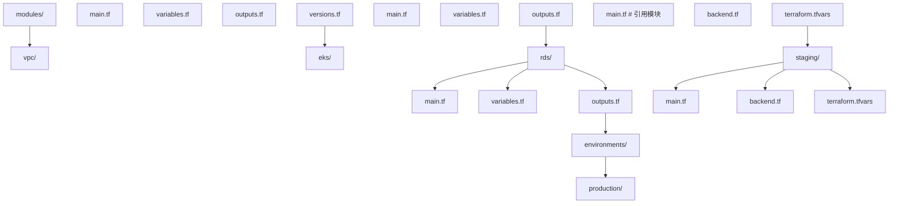
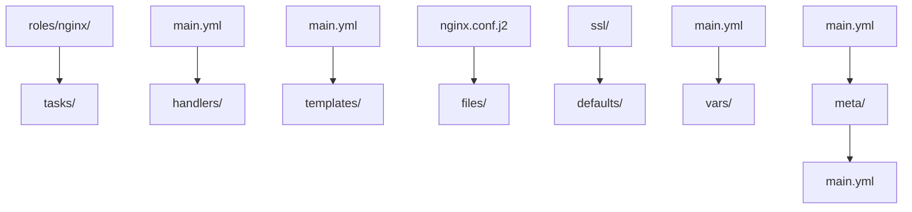
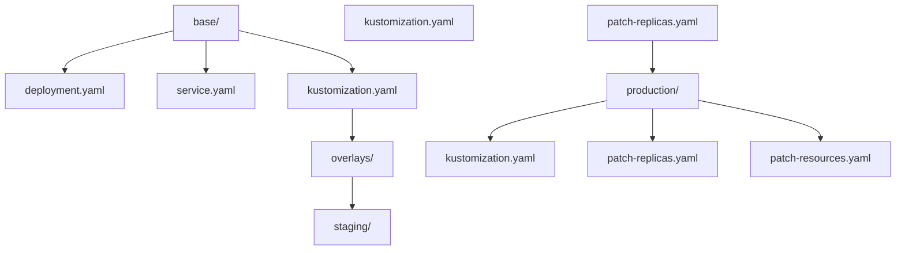

## 1. IaC 理念

### 1.1 核心原则

| 原则         | 描述                       |
| :----------- | :------------------------- |
| **声明式**   | 描述期望状态，而非操作步骤 |
| **版本控制** | 所有配置纳入 Git 管理      |
| **幂等性**   | 多次执行结果一致           |
| **不可变**   | 替换而非修改基础设施       |
| **自助服务** | 代码即文档，可重复执行     |

### 1.2 IaC 工具分类

| 类型         | 代表工具               | 特点                 |
| :----------- | :--------------------- | :------------------- |
| **配置管理** | Ansible, Chef, Puppet  | 管理已有服务器的配置 |
| **资源编排** | Terraform, Pulumi, CDK | 创建和管理云资源     |
| **容器编排** | Helm, Kustomize        | 管理 K8s 应用        |
| **GitOps**   | ArgoCD, Flux           | Git 驱动的持续部署   |

## 2. Terraform

### 2.1 核心概念

| 概念         | 描述                               |
| :----------- | :--------------------------------- |
| **Provider** | 云厂商插件（AWS/Azure/GCP/阿里云） |
| **Resource** | 基础设施资源（VM/VPC/数据库）      |
| **Module**   | 可复用的配置包                     |
| **State**    | 资源状态文件                       |
| **Plan**     | 预览变更                           |
| **Apply**    | 执行变更                           |

### 2.2 基础配置

```hcl
# provider.tf
terraform {
  required_version = ">= 1.10" # 1.10（2024-11）引入临时资源（ephemeral）与 S3 原生状态锁
  required_providers {
    aws = {
      source  = "hashicorp/aws"
      version = "~> 5.0"
    }
  }

  # 远程状态存储
  backend "s3" {
    bucket       = "terraform-state-prod"
    key          = "infrastructure/terraform.tfstate"
    region       = "us-east-1"
    use_lockfile = true # Terraform 1.10+ 使用 S3 原生条件写锁，不再依赖 DynamoDB
    encrypt      = true
  }
}

provider "aws" {
  region = "us-east-1"
}
```

### 2.3 资源定义

```hcl
# vpc.tf
resource "aws_vpc" "main" {
  cidr_block           = "10.0.0.0/16"
  enable_dns_hostnames = true
  enable_dns_support   = true

  tags = {
    Name        = "${var.project}-vpc"
    Environment = var.environment
    ManagedBy   = "terraform"
  }
}

resource "aws_subnet" "public" {
  count                   = length(var.public_subnet_cidrs)
  vpc_id                  = aws_vpc.main.id
  cidr_block              = var.public_subnet_cidrs[count.index]
  availability_zone       = var.azs[count.index]
  map_public_ip_on_launch = true

  tags = {
    Name = "${var.project}-public-${count.index + 1}"
  }
}

resource "aws_subnet" "private" {
  count             = length(var.private_subnet_cidrs)
  vpc_id            = aws_vpc.main.id
  cidr_block        = var.private_subnet_cidrs[count.index]
  availability_zone = var.azs[count.index]

  tags = {
    Name = "${var.project}-private-${count.index + 1}"
  }
}

# variables.tf
variable "project" {
  description = "Project name"
  type        = string
  default     = "myapp"
}

variable "environment" {
  description = "Environment name"
  type        = string
}

variable "public_subnet_cidrs" {
  type    = list(string)
  default = ["10.0.1.0/24", "10.0.2.0/24", "10.0.3.0/24"]
}

variable "private_subnet_cidrs" {
  type    = list(string)
  default = ["10.0.10.0/24", "10.0.20.0/24", "10.0.30.0/24"]
}
```

### 2.4 EKS 集群

```hcl
# eks.tf
module "eks" {
  source  = "terraform-aws-modules/eks/aws"
  version = "~> 20.0"

  cluster_name    = "${var.project}-${var.environment}"
  cluster_version = "1.33" # 上线前查官方支持矩阵选择当前受支持版本

  vpc_id     = aws_vpc.main.id
  subnet_ids = aws_subnet.private[*].id

  cluster_endpoint_private_access = true
  cluster_endpoint_public_access  = true

  cluster_addons = {
    coredns    = {}
    kube-proxy = {}
    vpc-cni    = {}
  }

  eks_managed_node_groups = {
    general = {
      min_size       = 2
      max_size       = 10
      desired_size   = 3
      instance_types = ["t3.medium"]

      labels = {
        role = "general"
      }
    }
    monitoring = {
      min_size       = 1
      max_size       = 3
      desired_size   = 1
      instance_types = ["t3.small"]

      labels = {
        role = "monitoring"
      }
      taints = [{
        key    = "dedicated"
        value  = "monitoring"
        effect = "NO_SCHEDULE"
      }]
    }
  }
}
```

### 2.5 状态管理

> 版本提示：Terraform 1.10 起 S3 后端支持 `use_lockfile` 原生锁（DynamoDB 锁
> 变为兼容选项）；1.7 起支持 `moved` 块重构资源、config-driven `import`；
> 1.10 引入临时资源（ephemeral resources）与 write-only 参数演进，密钥可
> 不落状态文件。许可方面 Terraform 自 1.6 起采用 BUSL，开源替代为 OpenTofu
> （语法基本兼容，示例同样适用）。

```bash
# 状态操作
terraform state list                    # 列出资源
terraform state show aws_vpc.main       # 查看资源详情
terraform state mv aws_vpc.old aws_vpc.new  # 重命名
terraform state rm aws_vpc.orphan       # 移除（不删除实际资源）

# 导入已有资源
terraform import aws_vpc.main vpc-12345678

# 工作区（环境隔离）
terraform workspace new staging
terraform workspace select production
terraform workspace list
```

### 2.6 模块化



```hcl
# environments/production/main.tf
module "vpc" {
  source = "../../modules/vpc"

  project     = var.project
  environment = "production"
  cidr_block  = "10.0.0.0/16"
}

module "eks" {
  source = "../../modules/eks"

  project     = var.project
  environment = "production"
  vpc_id      = module.vpc.vpc_id
  subnet_ids  = module.vpc.private_subnet_ids
}
```

## 3. Ansible

### 3.1 Inventory

```ini
# inventory/production.ini
[web]
web1 ansible_host=10.0.1.10
web2 ansible_host=10.0.1.11

[db]
db1 ansible_host=10.0.10.20

[monitoring]
prometheus ansible_host=10.0.20.10
grafana ansible_host=10.0.20.11

[production:children]
web
db
monitoring

[production:vars]
ansible_user=deploy
ansible_ssh_private_key_file=~/.ssh/deploy_key
```

### 3.2 Playbook

```yaml
# playbooks/deploy-web.yml
- name: Deploy Web Application
  hosts: web
  become: true
  vars:
    app_version: '2.0.0'
    app_port: 8080

  tasks:
    - name: Ensure app directory exists
      file:
        path: /opt/myapp
        state: directory
        owner: appuser
        group: appgroup

    - name: Pull Docker image
      community.docker.docker_image:
        name: 'registry.example.com/myapp:{{ app_version }}'
        source: pull

    - name: Run application container
      community.docker.docker_container:
        name: myapp
        image: 'registry.example.com/myapp:{{ app_version }}'
        state: started
        restart_policy: unless-stopped
        ports:
          - '{{ app_port }}:8080'
        env:
          NODE_ENV: production
          DATABASE_URL: '{{ vault_database_url }}'
        volumes:
          - /opt/myapp/data:/app/data

    - name: Wait for application to be ready
      uri:
        url: 'http://localhost:{{ app_port }}/health'
        status_code: 200
      register: result
      until: result is success
      retries: 10
      delay: 5

    - name: Notify deployment
      slack:
        token: '{{ vault_slack_token }}'
        msg: 'Deployed myapp {{ app_version }} to {{ inventory_hostname }}'
      delegate_to: localhost
      run_once: true
```

### 3.3 Role 结构



```yaml
# roles/nginx/tasks/main.yml
- name: Install Nginx
  apt:
    name: nginx
    state: present
    update_cache: true

- name: Configure Nginx
  template:
    src: nginx.conf.j2
    dest: /etc/nginx/nginx.conf
    owner: root
    group: root
    mode: '0644'
  notify: Reload Nginx

- name: Ensure Nginx is running
  service:
    name: nginx
    state: started
    enabled: true

# roles/nginx/handlers/main.yml
- name: Reload Nginx
  service:
    name: nginx
    state: reloaded
```

## 4. Pulumi

### 4.1 Pulumi vs Terraform

| 维度         | Terraform | Pulumi                  |
| :----------- | :-------- | :---------------------- |
| **语言**     | HCL       | Python/TypeScript/Go/C# |
| **学习曲线** | 需学 HCL  | 用已有编程语言          |
| **测试**     | 有限      | 原生单元测试            |
| **逻辑**     | 声明式    | 命令式 + 声明式         |
| **状态**     | 自管理    | Pulumi Cloud 或自管理   |

### 4.2 Pulumi 示例

```python
# __main__.py
import pulumi
import pulumi_aws as aws

# 配置
config = pulumi.Config()
environment = config.require("environment")

# VPC
vpc = aws.ec2.Vpc("main-vpc",
    cidr_block="10.0.0.0/16",
    enable_dns_hostnames=True,
    tags={"Name": f"myapp-{environment}-vpc"}
)

# 子网
for i, az in enumerate(["us-east-1a", "us-east-1b"]):
    aws.ec2.Subnet(f"subnet-{i}",
        vpc_id=vpc.id,
        cidr_block=f"10.0.{i+1}.0/24",
        availability_zone=az,
        tags={"Name": f"myapp-{environment}-subnet-{i}"}
    )

# EKS 集群
cluster = aws.eks.Cluster("my-cluster",
    role_arn=cluster_role.arn,
    vpc_config=aws.eks.ClusterVpcConfigArgs(
        subnet_ids=[s.id for s in subnets]
    ),
    version="1.29"
)

# 输出
pulumi.export("cluster_name", cluster.name)
pulumi.export("cluster_endpoint", cluster.endpoint)
```

## 5. GitOps

### 5.1 GitOps 原则

| 原则         | 描述                   |
| :----------- | :--------------------- |
| **声明式**   | 系统描述必须是声明式的 |
| **版本控制** | 期望状态存储在 Git     |
| **自动拉取** | 自动从 Git 拉取并应用  |
| **持续协调** | 软件代理持续协调状态   |

### 5.2 Flux

```yaml
# flux-system/gotk-sync.yaml
apiVersion: source.toolkit.fluxcd.io/v1
kind: GitRepository
metadata:
  name: flux-system
  namespace: flux-system
spec:
  interval: 1m
  ref:
    branch: main
  url: https://github.com/org/myapp-manifests

---
apiVersion: kustomize.toolkit.fluxcd.io/v1
kind: Kustomization
metadata:
  name: flux-system
  namespace: flux-system
spec:
  interval: 10m
  path: ./clusters/production
  prune: true
  sourceRef:
    kind: GitRepository
    name: flux-system
  validation: server
```

### 5.3 Kustomize



```yaml
# base/kustomization.yaml
apiVersion: kustomize.config.k8s.io/v1beta1
kind: Kustomization
resources:
  - deployment.yaml
  - service.yaml

# overlays/production/kustomization.yaml
apiVersion: kustomize.config.k8s.io/v1beta1
kind: Kustomization
resources:
  - ../../base
patches:
  - path: patch-replicas.yaml
  - path: patch-resources.yaml

# overlays/production/patch-replicas.yaml
apiVersion: apps/v1
kind: Deployment
metadata:
  name: web
spec:
  replicas: 5
```

## 6. IaC 安全

### 6.1 安全实践

| 实践              | 描述                        |
| :---------------- | :-------------------------- |
| **状态加密**      | 加密远程状态存储            |
| **密钥管理**      | 使用 Vault/云 KMS，不硬编码 |
| **PR 审查**       | 所有变更需 Code Review      |
| **Plan 审查**     | 审查 terraform plan 输出    |
| **最小权限**      | CI/CD 使用最小必要权限      |
| ** drifted 检测** | 定期检测配置漂移            |

### 6.2 Terraform 安全扫描

```bash
# tfsec - Terraform 安全扫描
tfsec .

# checkov - 策略扫描
checkov -d .

# terrascan - 合规扫描
terrascan scan -t aws

# 在 CI 中集成
- name: Security Scan
  run: |
    tfsec --soft-fail .
    checkov -d . --framework terraform
```

## 7. 小结

IaC 是现代运维的基础：

1. **Terraform** 是多云资源编排的事实标准，HCL 语法简洁
2. **Ansible** 适合配置管理和应用部署，无需 Agent
3. **Pulumi** 用编程语言写 IaC，适合有编程背景的团队
4. **GitOps** 是 K8s 部署的最佳实践，ArgoCD 和 Flux 是主流工具
5. **状态管理**是 Terraform 的关键，必须使用远程后端和锁
6. **安全扫描**应集成到 CI/CD，防止不安全配置上线
