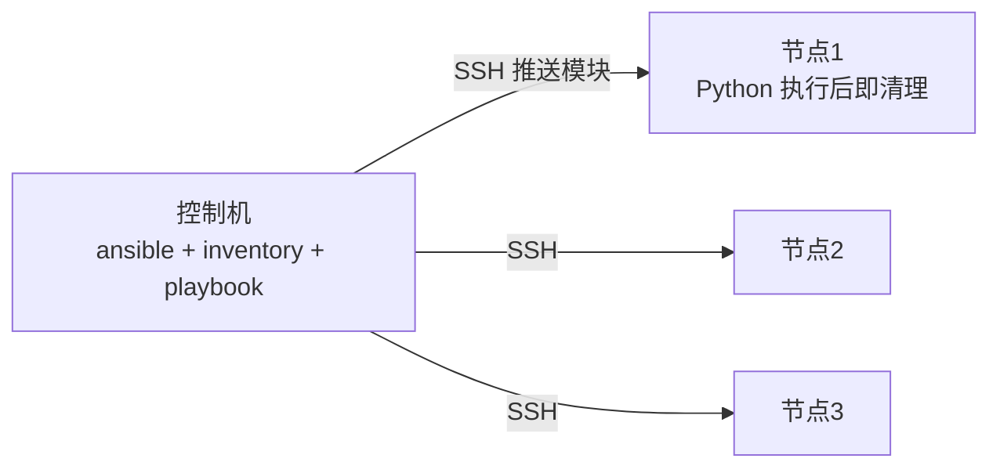

## 0. 一句话理解

> Ansible 是"无 Agent 的批量配置管理"：通过 SSH（或 WinRM）连上机器，把 YAML
> 写的 Playbook（步骤清单）推过去执行，而且执行是幂等的——跑一遍和跑十遍结果一样。
> 它解决的是"Terraform 建好机器之后，机器里面的东西谁来装"。

## 1. 架构：控制机 + 被管节点



被管节点不需要常驻 Agent，只要有 SSH 和 Python——这是它与 Chef/Puppet 的
Agent 模式最大的区别：接入快，但"持续纠偏"要靠定时重跑（cron、CI 或 AWX）。

## 2. Inventory：机器的花名册

```ini
# inventory/production.ini
[web]
web1 ansible_host=10.0.1.10
web2 ansible_host=10.0.1.11

[db]
db1 ansible_host=10.0.10.20

[prod:children]
web
db

[prod:vars]
ansible_user=deploy
```

```bash
ansible -i inventory/production.ini all -m ping               # 连通性验证
ansible -i inventory/production.ini web -m shell -a 'uptime'  # 临时命令（ad-hoc）
```

要点：生产环境用**动态 inventory**（云插件自动拉取实例列表）代替手工维护 IP，
机器弹性伸缩的时代，静态清单必然过时。

## 3. Playbook：幂等的任务清单

```yaml
# deploy-web.yml
- name: 部署 Web 应用
  hosts: web
  become: true # 提权 sudo
  vars:
    app_version: '2.0.0'
  tasks:
    - name: 确保应用目录存在
      ansible.builtin.file:
        path: /opt/myapp
        state: directory
        owner: appuser
        mode: '0755'

    - name: 拉取应用镜像
      community.docker.docker_image:
        name: registry.example.com/myapp:{{ app_version }}
        source: pull

    - name: 运行容器（幂等：已存在且配置一致则跳过）
      community.docker.docker_container:
        name: myapp
        image: registry.example.com/myapp:{{ app_version }}
        state: started
        restart_policy: unless-stopped
        ports: ['8080:8080']
      notify: Restart app   # 变更发生时才触发 handler

  handlers:
    - name: Restart app
      ansible.builtin.service:
        name: myapp
        state: restarted
```

理解 Ansible 的三个关键词：

1. **幂等**：每个模块把"期望状态"翻译成最小变更，状态一致就跳过（输出 ok vs changed）。
2. **changed_when/failed_when**：任务级结果控制，别用 shell 写"每次都执行"的逻辑。
3. **handler**：配置变了才重启服务，避免无意义重启。

## 4. Role：可复用的结构化单元

```text
roles/nginx/
├── tasks/main.yml      # 任务
├── handlers/main.yml   # 处理器
├── templates/          # Jinja2 模板（.j2）
├── files/              # 直接拷贝的静态文件
├── defaults/main.yml   # 默认变量（优先级最低，可被覆盖）
└── meta/main.yml       # 依赖与其他元数据
```

```yaml
# site.yml：用 role 组装整台机器
- hosts: web
  roles:
    - role: nginx
      vars: { worker_processes: 4 }
```

复用与分发走 Galaxy：`ansible-galaxy role install geerlingguy.nginx`，
或从 Git 引用内部 role。变量优先级是 Ansible 最著名的深坑——记住口诀
"defaults 最弱、extra vars（-e）最强、group_vars/host_vars 居中"；遇到覆盖问题，
用 `ansible-inventory --host web1 -y` 查看最终生效值。

## 5. 密钥与敏感信息：Vault

```bash
# 创建加密文件（交互输密码）
ansible-vault create group_vars/prod/vault.yml
# 编辑 / 查看密文 / 更换密码
ansible-vault edit group_vars/prod/vault.yml
ansible-vault view group_vars/prod/vault.yml
ansible-vault rekey group_vars/prod/vault.yml
# 运行时解密：--ask-vault-pass 或 --vault-password-file
ansible-playbook site.yml --vault-password-file ~/.vault-pass
```

工程惯例：普通 `vars.yml` 里引用 `{{ vault_db_password }}`，真实值放在
`vault.yml`（加密后进 Git），两文件按 vars 目录约定自动关联。

## 6. 最佳实践与常见陷阱

| 实践/陷阱 | 说明 |
| :--- | :--- |
| 模块名用全限定形式 | `ansible.builtin.template` 等，可读且抗集合改名 |
| 不用 shell/command 做模块能做的事 | 失去幂等与 check 模式支持 |
| `--check --diff` 演练 | 上线前先看"会改什么"，等价 Terraform 的 plan |
| `serial: 1` 滚动变更 | 批量操作生产集群时限制爆炸半径 |
| 敏感任务加 `no_log: true` | 否则密码原样进日志 |
| 目标机 Python 版本 | 需 Python 3.x，老系统先用 `ansible.builtin.raw` 引导 |
| 控制并发 | `forks` 默认 5，几百台机器要调大并按需 `strategy: free` |

## 7. 动手试试

1. 用 Docker 起两个装了 sshd 的 Ubuntu 容器当目标机，配免密登录，
   跑通 `ping` 与安装软件两个任务。
2. 把第 3 节 playbook 跑两遍，观察第二遍全部 `ok` 而非 `changed`——这就是幂等。
3. 修改 nginx 配置模板后先 `--check --diff` 预览差异，再真实执行。

## 8. 小结

**初学者要点**

1. 无 Agent、SSH 推送、YAML 声明、幂等执行是 Ansible 的四个基本盘。
2. Inventory 定"对谁做"，Playbook 定"做什么"，Role 管"怎么复用"。
3. 敏感信息一律 Vault 加密，绝不裸奔进 Git。

**进阶注意**

1. `--check --diff` 是 Ansible 的"plan"，生产变更前必跑。
2. 持续纠偏要靠定时/事件驱动重跑（AWX、CI 定时任务），Ansible 本身没有常驻控制循环。
3. 大规模场景调 forks、用动态 inventory 与 fact 缓存（`gather_facts: smart`）。

## ansible 命令

**基本用法:临时执行命令**
`ansible <主机模式> -m <模块> -a "<参数>"`

```bash
# 在所有主机上执行 ping
ansible all -m ping

# 在 web 组上执行 shell 命令
ansible web -m shell -a "uptime"

# 指定用户与私钥
ansible web -m ping -u deploy --private-key=~/.ssh/id_rsa

# 切换 sudo 执行
ansible db -m shell -a "systemctl restart nginx" -b --ask-become-pass
```

---

**基本用法:主机模式**
`ansible <模式> [选项]`

```bash
# 所有主机
ansible all -m ping

# 指定主机组
ansible web -m ping

# 多组交集
ansible 'web:&production' -m ping

# 排除某些主机
ansible 'web:!disabled' -m ping

# 直接指定主机
ansible web1.example.com -m ping

# 使用通配符
ansible '*.example.com' -m ping
```

---

**基本用法:常用选项**
`ansible <主机> [选项]`

```bash
# 列出匹配主机(不执行)
ansible all --list-hosts

# 指定清单文件
ansible all -i inventory.ini -m ping

# 指定并发数
ansible all -m ping -f 10

# 输出详细
ansible web -m ping -v
ansible web -m ping -vvv

# 限制单台主机执行
ansible web -m ping --limit web1.example.com
```

---

## ansible-playbook 命令

**基本用法:执行 Playbook**
`ansible-playbook <playbook.yml>`

```bash
# 执行 Playbook
ansible-playbook site.yml

# 指定清单文件
ansible-playbook -i production.ini site.yml

# 指定用户与权限
ansible-playbook site.yml -u deploy -b -K

# 显示差异
ansible-playbook site.yml --diff

# 检查模式(不实际执行)
ansible-playbook site.yml --check
```

---

**基本用法:标签与限制**
`ansible-playbook <playbook> [--tags|--skip-tags]`

```bash
# 仅执行带指定标签的任务
ansible-playbook site.yml --tags "install,configure"

# 跳过指定标签
ansible-playbook site.yml --skip-tags "test"

# 列出所有标签
ansible-playbook site.yml --list-tags

# 限制主机执行
ansible-playbook site.yml --limit web1.example.com

# 限制单台主机并指定起始任务
ansible-playbook site.yml --limit web1 --start-at-task "install nginx"
```

---

**基本用法:变量与额外参数**
`ansible-playbook <playbook> -e "<变量=值>"`

```bash
# 命令行传入变量
ansible-playbook site.yml -e "env=production version=v1.2"

# 从文件传入变量
ansible-playbook site.yml -e @vars.yml

# JSON 格式变量
ansible-playbook site.yml -e '{"env":"prod","replicas":3}'

# 显示主机变量
ansible-playbook site.yml --list-hosts
```

---

## 核心模块

**基本用法:file 文件管理**
`ansible <主机> -m file -a "path=<路径> state=<状态>"`

```bash
# 创建目录
ansible web -m file -a "path=/opt/app state=directory mode=0755"

# 创建符号链接
ansible web -m file -a "src=/etc/nginx/nginx.conf dest=/etc/nginx/nginx.conf.bak state=link"

# 删除文件
ansible web -m file -a "path=/tmp/oldfile state=absent"

# 修改权限
ansible web -m file -a "path=/opt/app owner=deploy group=deploy mode=0644"
```

---

**基本用法:copy 与 template**
`ansible <主机> -m copy -a "src=<源> dest=<目标>"`

```bash
# 复制文件
ansible web -m copy -a "src=app.conf dest=/etc/nginx/conf.d/app.conf owner=root mode=0644"

# 备份原文件
ansible web -m copy -a "src=nginx.conf dest=/etc/nginx/nginx.conf backup=yes"

# 直接写入内容
ansible web -m copy -a "content='Hello World\n' dest=/tmp/test.txt"

# template 模块渲染 Jinja2
ansible web -m template -a "src=nginx.j2 dest=/etc/nginx/nginx.conf"
```

---

**基本用法:包管理**
`ansible <主机> -m yum -a "name=<包名> state=<状态>"`

```bash
# 安装包(yum)
ansible web -m yum -a "name=nginx state=present"

# 安装最新版
ansible web -m yum -a "name=nginx state=latest"

# 卸载包
ansible web -m yum -a "name=nginx state=absent"

# apt 包管理
ansible web -m apt -a "name=nginx state=present update_cache=yes"
```

---

**基本用法:service 服务管理**
`ansible <主机> -m service -a "name=<服务> state=<状态>"`

```bash
# 启动服务
ansible web -m service -a "name=nginx state=started"

# 重启服务
ansible web -m service -a "name=nginx state=restarted"

# 设置开机启动
ansible web -m service -a "name=nginx enabled=yes state=started"

# systemd 模块
ansible web -m systemd -a "name=nginx state=restarted daemon_reload=yes"
```

---

**基本用法:user 与 group**
`ansible <主机> -m user -a "name=<用户> ..."`

```bash
# 创建用户
ansible web -m user -a "name=deploy shell=/bin/bash groups=docker append=yes"

# 创建用户并设置 SSH 公钥
ansible web -m user -a "name=deploy ssh_key_file=~/.ssh/id_rsa.pub"

# 删除用户
ansible web -m user -a "name=olduser state=absent remove=yes"

# 创建组
ansible web -m group -a "name=developers state=present"
```

---

## Playbook 编写

**基本用法:Playbook 结构**
`--- hosts: <主机>`

```yaml
# playbook.yml Playbook 基本结构
---
- name: 部署 Nginx Web 服务
  hosts: web
  become: yes
  vars:
    nginx_port: 80
    server_name: example.com

  tasks:
  - name: 安装 Nginx
    yum:
      name: nginx
      state: present

  - name: 配置 Nginx
    template:
      src: nginx.conf.j2
      dest: /etc/nginx/nginx.conf
    notify: restart nginx

  - name: 启动 Nginx
    service:
      name: nginx
      state: started
      enabled: yes

  handlers:
  - name: restart nginx
    service:
      name: nginx
      state: restarted
```

---

**基本用法:条件与循环**
`when: <条件> / loop: <列表>`

```yaml
# 条件与循环示例
---
- name: 多服务管理
  hosts: web
  tasks:
  - name: 安装多个包
    yum:
      name: "{{ item }}"
      state: present
    loop:
    - nginx
    - git
    - curl

  - name: 根据系统分发执行
    service:
      name: nginx
      state: restarted
    when: ansible_os_family == "RedHat"

  - name: 仅在开发环境执行
    debug:
      msg: "这是开发环境"
    when: env == "dev"

  - name: 创建多个用户
    user:
      name: "{{ item.name }}"
      groups: "{{ item.groups }}"
    loop:
    - { name: alice, groups: dev }
    - { name: bob, groups: ops }
```

---

**基本用法:变量与模板**
`vars:`

```yaml
# 变量使用示例
---
- name: 应用部署
  hosts: web
  vars:
    app_name: myapp
    app_version: "1.2.0"
    app_ports:
    - 8080
    - 8443

  vars_files:
  - vars/secret.yml

  tasks:
  - name: 显示应用信息
    debug:
      msg: "部署 {{ app_name }} 版本 {{ app_version }}"

  - name: 渲染配置文件
    template:
      src: app.conf.j2
      dest: "/etc/{{ app_name }}/app.conf"
```

```
# app.conf.j2 模板文件
server {
    
    listen {{ port }};
    
    server_name {{ app_name }}.example.com;
    version {{ app_version }};
}
```

---

## Roles 角色

**基本用法:创建 Role 目录**
`ansible-galaxy init <角色名>`

```bash
# 创建 Role 标准目录结构
ansible-galaxy init nginx

# 目录结构
# nginx/
# ├── defaults/main.yml      默认变量
# ├── files/                 静态文件
# ├── handlers/main.yml      处理器
# ├── meta/main.yml          元数据
# ├── tasks/main.yml         任务
# ├── templates/             Jinja2 模板
# └── vars/main.yml          变量(高优先级)
```

---

**基本用法:使用 Role**
`roles: - <角色>`

```yaml
# site.yml 使用 Role 示例
---
- name: 部署 Web 服务器
  hosts: web
  become: yes
  roles:
  - role: nginx
    vars:
      nginx_port: 80
  - role: firewall

# 也可以简写
- hosts: web
  roles:
  - nginx
  - monitoring
```

---

**基本用法:Role 依赖**
`meta/main.yml`

```yaml
# nginx/meta/main.yml 角色依赖
dependencies:
- role: common
  vars:
    common_packages:
    - curl
    - vim
- role: firewall
  when: enable_firewall | bool
```

---

## ansible-galaxy

**基本用法:安装 Role**
`ansible-galaxy install <作者>.<角色>`

```bash
# 从 Galaxy 安装 Role
ansible-galaxy install geerlingguy.nginx

# 指定版本
ansible-galaxy install geerlingguy.nginx,v3.1.0

# 从 git 安装
ansible-galaxy install git+https://github.com/geerlingguy/ansible-role-nginx.git

# 安装到指定路径
ansible-galaxy install geerlingguy.nginx -p ./roles
```

---

**基本用法:管理 Role**
`ansible-galaxy list|search|remove`

```bash
# 列出已安装 Role
ansible-galaxy list

# 搜索 Role
ansible-galaxy search nginx

# 查看 Role 信息
ansible-galaxy info geerlingguy.nginx

# 删除 Role
ansible-galaxy remove geerlingguy.nginx

# 通过 requirements.yml 批量安装
ansible-galaxy install -r requirements.yml
```

```yaml
# requirements.yml 依赖列表
- src: geerlingguy.nginx
  version: 3.1.0
- src: git+https://github.com/org/role.git
  name: custom-role
```

---

## Inventory 清单

**基本用法:INI 格式清单**
`/etc/ansible/hosts`

```ini
# inventory.ini 清单文件示例
[web]
web1.example.com ansible_host=192.168.1.10
web2.example.com ansible_host=192.168.1.11

[db]
db1.example.com ansible_host=192.168.1.20

[production:children]
web
db

[production:vars]
ansible_user=deploy
ansible_ssh_private_key_file=~/.ssh/prod_rsa
env=production
```

---

**基本用法:YAML 格式清单**
`inventory.yml`

```yaml
# inventory.yml YAML 格式清单
all:
  children:
    web:
      hosts:
        web1.example.com:
          ansible_host: 192.168.1.10
        web2.example.com:
          ansible_host: 192.168.1.11
      vars:
        nginx_port: 80
    db:
      hosts:
        db1.example.com:
          ansible_host: 192.168.1.20
  vars:
    ansible_user: deploy
    env: production
```

---

**基本用法:动态清单**
`ansible -i <脚本> all --list-hosts`

```bash
# 使用动态清单脚本
ansible -i ./ec2_inventory.py all --list-hosts

# 同时使用多个清单
ansible -i inventory.ini -i ec2.py all -m ping

# 启用清单缓存
export ANSIBLE_INVENTORY_CACHE=True
export ANSIBLE_INVENTORY_CACHE_CONNECTION=redis
```

---

## ansible-vault 加密

**基本用法:加密文件**
`ansible-vault encrypt <文件>`

```bash
# 加密文件
ansible-vault encrypt vars/secret.yml

# 加密时指定密码文件
ansible-vault encrypt vars/secret.yml --vault-password-file ~/.vault_pass

# 加密字符串(用于嵌入)
ansible-vault encrypt_string 'mypassword' --name 'db_password'

# 加密字符串并追加到文件
ansible-vault encrypt_string 'secret' --name 'api_key' >> vars/secrets.yml
```

---

**基本用法:解密与查看**
`ansible-vault view|decrypt <文件>`

```bash
# 查看加密文件内容
ansible-vault view vars/secret.yml

# 解密文件
ansible-vault decrypt vars/secret.yml

# 编辑加密文件
ansible-vault edit vars/secret.yml

# 重新加密(修改密码)
ansible-vault rekey vars/secret.yml
```

---

**基本用法:执行加密 Playbook**
`ansible-playbook --ask-vault-pass <playbook>`

```bash
# 交互式输入密码
ansible-playbook site.yml --ask-vault-pass

# 使用密码文件
ansible-playbook site.yml --vault-password-file ~/.vault_pass

# 使用多个密码文件
ansible-playbook site.yml --vault-password-file ~/.vault_pass --vault-password-file ~/.vault_pass_dev
```

---

## 调试与排查

**基本用法:语法检查**
`ansible-playbook --syntax-check <playbook>`

```bash
# 语法检查
ansible-playbook --syntax-check site.yml

# 检查模式(模拟执行)
ansible-playbook --check site.yml

# 检查模式 + 显示差异
ansible-playbook --check --diff site.yml

# 列出任务
ansible-playbook --list-tasks site.yml
```

---

**基本用法:debug 模块**
`debug: var=<变量>`

```yaml
# Playbook 中使用 debug
- name: 调试示例
  hosts: web
  tasks:
  - name: 显示主机名
    debug:
      msg: "主机名: {{ inventory_hostname }} IP: {{ ansible_host }}"

  - name: 显示变量
    debug:
      var: ansible_distribution

  - name: 注册变量并显示
    shell: uptime
    register: result

  - name: 显示命令输出
    debug:
      var: result.stdout_lines

  - name: 失败时显示
    debug:
      msg: "命令失败: {{ result.stderr }}"
    when: result.failed
```

---

**基本用法:verbose 输出**
`ansible-playbook -v[vvv] <playbook>`

```bash
# 不同详细级别
ansible-playbook site.yml -v       # 基础输出
ansible-playbook site.yml -vv      # 含变量
ansible-playbook site.yml -vvv     # 含 SSH 详情
ansible-playbook site.yml -vvvv    # 含插件详情

# 仅查看执行步骤(详细模式 + 检查模式)
ansible-playbook site.yml --check --diff -v
```

---

## ansible-config 配置

**基本用法:查看配置**
`ansible-config view|list|dump`

```bash
# 查看当前生效配置
ansible-config view

# 列出所有配置选项
ansible-config list

# 查看生效的配置项
ansible-config dump | grep -i host_key

# 查看指定配置项
ansible-config dump | grep DEFAULT_INVENTORY
```

---

**基本用法:常用配置**
`ansible.cfg`

```ini
# ansible.cfg 配置文件
[defaults]
inventory = ./inventory.ini
host_key_checking = False
remote_user = deploy
private_key_file = ~/.ssh/id_rsa
roles_path = ./roles
log_path = /var/log/ansible.log
forks = 10
gathering = smart
fact_caching = redis
fact_caching_connection = localhost:6379

[privilege_escalation]
become = True
become_method = sudo
become_user = root
```

```bash
# 设置环境变量覆盖配置
export ANSIBLE_HOST_KEY_CHECKING=False
export ANSIBLE_FORKS=20

# 生成默认配置文件
ansible-config init --disabled > ansible.cfg
```
