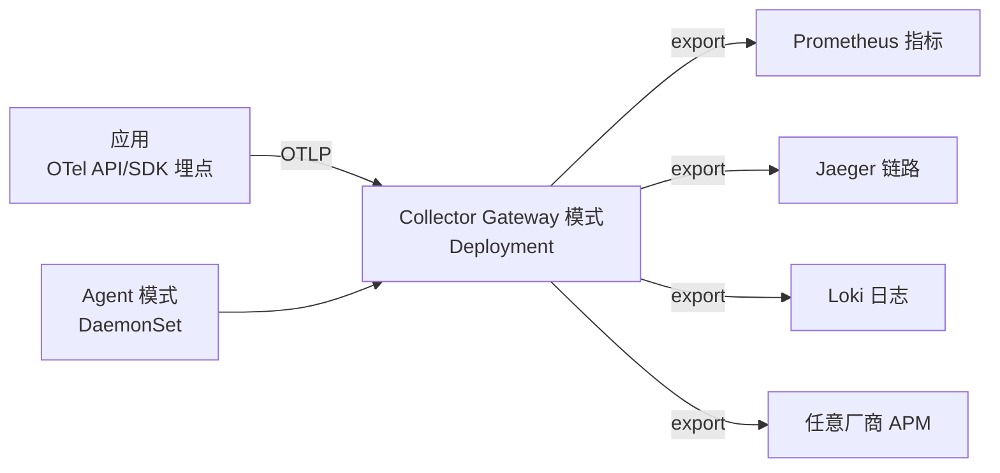

## 0. 一句话理解

> OpenTelemetry（OTel）是 CNCF 的可观测性**采集标准**：一套 API/SDK + 一条通用数据
> 协议（OTLP）+ 一个 Collector，把指标、日志、链路三种信号"统一埋点、统一传输、
> 统一导出"，应用代码不再绑定任何一家监控厂商。

类比：OTel 之于可观测性，就像 USB-C 之于充电线——设备（应用）只用一种接口，
另一端可以插任何显示器（Prometheus/Jaeger/商业 APM）。

## 1. 为什么需要 OpenTelemetry

### 1.1 OTel 之前的世界

| 问题 | 具体表现 |
| :--- | :--- |
| 埋点绑定厂商 | 用了某 APM 的 Agent，换厂商要重写全部埋点代码 |
| 三种信号各自为政 | 指标用 StatsD、日志用 Fluentd、链路用 Jaeger SDK，三套配置三套运维 |
| 上下文割裂 | 日志里没有 trace_id，出了问题要在三个系统之间手动"人肉关联" |

### 1.2 OTel 的答案

1. **一套 API**：应用只面向 `opentelemetry-api` 编程，实现（SDK）可替换。
2. **一套协议**：所有信号统一走 OTLP（gRPC :4317 / HTTP :4318）导出。
3. **一个 Collector**：接收、处理（过滤/脱敏/采样/补标签）、导出的独立进程，
   应用只管"发出去"，后端换不换与应用无关。

## 2. 三大信号（+ 一个在路上）

| 信号 | 是什么 | 典型后端 |
| :--- | :--- | :--- |
| **Traces 链路** | 一次请求跨服务调用的完整路径（Span 树） | Jaeger、Tempo、Zipkin |
| **Metrics 指标** | 数值型时间序列（计数器/直方图/仪表） | Prometheus、Mimir |
| **Logs 日志** | 带时间戳的结构化事件记录 | Loki、Elasticsearch |
| Profiles 性能剖析 | 函数级 CPU/内存采样（发展中，勿当已定稿使用） | Pyroscope、Parca |

三大支柱的意义在于**相互印证**：指标发现"错误率涨了"，链路回答"慢在哪个服务"，
日志回答"具体报了什么错"——OTel 用同一组 Trace 上下文把它们串起来。

## 3. 核心概念与架构



### 3.1 关键术语

| 术语 | 含义 | 类比 |
| :--- | :--- | :--- |
| **Span** | 一次有起止时间的工作单元（如一次 HTTP 处理、一次 SQL 查询） | 快递单上的一站记录 |
| **Trace** | 共享同一 trace_id 的 Span 树 | 整张快递单 |
| **Context Propagation** | trace 上下文跨进程传播（HTTP header 等） | 快递单号随包裹流转 |
| **Resource** | 产生遥测数据的实体属性（服务名、版本、环境） | 发件方信息 |
| **Exporter** | 把数据发出去的插件（OTLP/Prometheus/……） | 出口 |

### 3.2 W3C Trace Context

跨服务传播的事实标准是两个 HTTP 头：

```text
traceparent: 00-<32位traceId>-<16位spanId>-01
             版本-Trace ID-父 Span ID-采样标志
tracestate: 供应商扩展信息（可选）
```

只要框架自动埋点（instrumentation）在两侧都开启，头会被自动注入与解析，
不需要业务代码参与。

## 4. 上手：Python + FastAPI 全链路示例

### 4.1 安装与初始化

```bash
pip install opentelemetry-sdk \
            opentelemetry-exporter-otlp \
            opentelemetry-instrumentation-fastapi \
            opentelemetry-instrumentation-requests
```

```python
# otel_setup.py：初始化 Trace 与 Metric（自包含可运行）
from opentelemetry import trace, metrics
from opentelemetry.sdk.resources import Resource
from opentelemetry.sdk.trace import TracerProvider
from opentelemetry.sdk.trace.export import BatchSpanProcessor
from opentelemetry.sdk.metrics import MeterProvider
from opentelemetry.sdk.metrics.export import PeriodicExportingMetricReader
from opentelemetry.exporter.otlp.proto.grpc.trace_exporter import OTLPSpanExporter
from opentelemetry.exporter.otlp.proto.grpc.metric_exporter import OTLPMetricExporter

# Resource 声明"我是谁"：service.name 必填，其余按需
resource = Resource.create({
    "service.name": "order-service",
    "service.version": "1.4.2",
    "deployment.environment": "production",
})

# Trace：批量异步导出，不阻塞业务线程
tracer_provider = TracerProvider(resource=resource)
tracer_provider.add_span_processor(
    BatchSpanProcessor(OTLPSpanExporter(endpoint="http://otel-collector:4317", insecure=True))
)
trace.set_tracer_provider(tracer_provider)

# Metric：周期性（默认 60s）导出
meter_provider = MeterProvider(
    resource=resource,
    metric_readers=[PeriodicExportingMetricReader(
        OTLPMetricExporter(endpoint="http://otel-collector:4317", insecure=True)
    )],
)
metrics.set_meter_provider(meter_provider)
```

### 4.2 自动埋点 + 手动埋点

```python
# main.py
from fastapi import FastAPI
from opentelemetry import trace
from opentelemetry.instrumentation.fastapi import FastAPIInstrumentor
from opentelemetry.instrumentation.requests import RequestsInstrumentor
from otel_setup import tracer_provider  # 初始化副作用

app = FastAPI()
FastAPIInstrumentor.instrument_app(app)   # 自动：每个 HTTP 请求一个 Server Span
RequestsInstrumentor().instrument()       # 自动：出站 HTTP 传播 traceparent 头

tracer = trace.get_tracer(__name__)

@app.get("/orders/{order_id}")
async def get_order(order_id: str):
    # 手动：给关键业务段落命名，属性遵循语义约定（semantic conventions）
    with tracer.start_as_current_span("load_order_from_db") as span:
        span.set_attribute("order.id", order_id)
        span.set_attribute("db.system", "postgresql")
        order = {"id": order_id, "status": "paid"}  # 模拟查询
        return order
```

无代码侵入的零改造方式是 **Java/Node 的 javaagent、Python 的
`opentelemetry-instrument` 命令行**：不改一行代码即可自动埋点。

## 5. OTel Collector：数据的中转站

### 5.1 最小配置

```yaml
# otel-collector-config.yaml
receivers:
  otlp:
    protocols:
      grpc:
        endpoint: 0.0.0.0:4317
      http:
        endpoint: 0.0.0.0:4318

processors:
  batch: # 批量发送，降低后端压力
    timeout: 5s
  # 生产建议：脱敏、内存保护、重试
  memory_limiter:
    check_interval: 1s
    limit_mib: 512

exporters:
  otlp/jaeger:
    endpoint: jaeger:4317
    tls:
      insecure: true
  prometheus:
    endpoint: 0.0.0.0:8889 # 以 Prometheus 抓取格式暴露指标

service:
  pipelines:
    traces:
      receivers: [otlp]
      processors: [memory_limiter, batch]
      exporters: [otlp/jaeger]
    metrics:
      receivers: [otlp]
      processors: [memory_limiter, batch]
      exporters: [prometheus]
```

### 5.2 为什么应用直连 Collector 而不直连后端

1. **解耦**：后端迁移/多后端并存只改 Collector 配置。
2. **缓冲与重试**：后端抖动时 Collector 兜底，应用不丢不塞。
3. **统一处理**：PII 脱敏、尾采样（tail sampling）、按租户路由都在这一层做。

## 6. 采样策略（进阶）

全量采集链路数据成本高，生产环境通常采样：

| 策略 | 时机 | 特点 |
| :--- | :--- | :--- |
| 头部采样 Head Sampling | Span 创建时决定 | 实现简单、省资源；可能丢掉"恰好出错"的链路 |
| 尾部采样 Tail Sampling | Trace 结束后在 Collector 决定 | 可"错误与高延迟全保留、正常请求抽 1%"；需集中决策点 |

```yaml
# Collector 尾部采样示例：错误链路 100% 保留，正常链路抽 10%
processors:
  tail_sampling:
    decision_wait: 10s
    policies:
      - name: errors-policy
        type: status_code
        status_code: { status_codes: [ERROR] }
      - name: probabilistic-policy
        type: probabilistic
        probabilistic: { sampling_percentage: 10 }
```

## 7. 日志与 Trace 关联

两种主流做法：

1. **日志经 OTel 采集**：SDK/Collector 在日志记录上自动附加 `trace_id`/`span_id`，
   后端（如 Loki）可用这些字段反查链路。
2. **应用侧注入**：日志格式化时从当前 Span 取上下文，输出 `trace_id` 字段。

```python
# 应用侧注入示例（伪代码）
import logging
from opentelemetry import trace

span = trace.get_current_span()
ctx = span.get_span_context()
logging.info("payment failed", extra={
    "trace_id": f"{ctx.trace_id:032x}",  # 32 位十六进制
    "span_id": f"{ctx.span_id:016x}",
})
```

之后在 Grafana 里即可从日志跳转链路、从链路 Span 跳转日志。

## 8. 常见陷阱

| 陷阱 | 后果 | 正确做法 |
| :--- | :--- | :--- |
| 每个服务自己直连后端 | 后端迁移=全量改配置 | 应用只发 OTLP 到 Collector |
| 不设置 `service.name`/环境 Resource | 数据无法按服务分组 | Resource.create 统一注入 |
| 在请求热路径同步导出 | 延迟抖动 | 用 BatchSpanProcessor 异步批量 |
| 高基数标签（userId 做 metric label） | 时序爆炸拖垮存储 | 指标标签控制在低基数维度 |
| 头部采样后排查丢关键链路 | 抽样恰好抽掉故障请求 | 错误敏感场景上尾部采样 |
| 忘记传播 `traceparent`（自研 RPC） | 链路断裂 | 手动注入/解析或接入对应 instrumentation |

## 9. 动手试试

1. 用 Docker 启动 `otel/opentelemetry-collector-contrib` + `jaegertracing/all-in-one`，
   跑通第 4 节示例，在 Jaeger UI 里找到 `load_order_from_db` Span。
2. 把 FastAPI 的出站 `requests` 调用指向第二个服务，验证 `traceparent` 头传播、
   两个服务的 Span 在同一条 Trace 下。
3. 给 Collector 加 `tail_sampling`，制造一个 500 错误请求，确认错误链路 100% 被保留。

## 10. 小结

**初学者要点**

1. OTel 解决的是"埋点标准化"：一套 API + OTLP 协议 + Collector。
2. 三大信号（Trace/Metric/Log）用同一 trace 上下文关联，排障不再人肉拼接。
3. 自动埋点优先（框架 instrumentation），只为关键业务段落手动埋点。

**进阶注意**

1. 生产部署采用 Agent（DaemonSet）+ Gateway（Deployment）两级 Collector。
2. 采样是成本控制核心：头部采样省资源，尾部采样保关键链路。
3. Profiles（性能剖析）信号仍在发展中，采用前关注官方状态，勿当作稳定能力宣传。
4. OTel 不做存储与可视化——后端（Prometheus/Jaeger/Loki 等）依然需要，OTel 只统一"进"的一侧。
