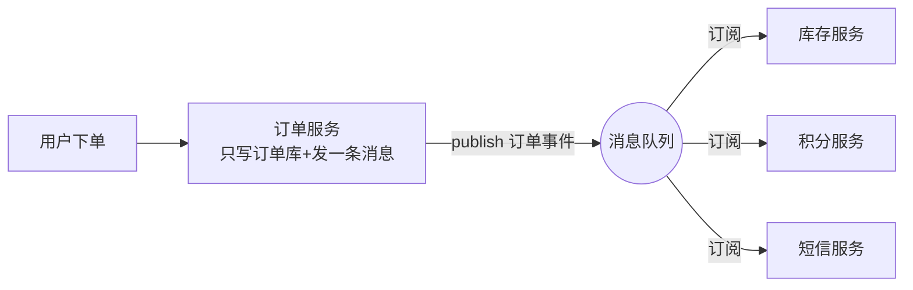

## 0. 一句话理解

> 消息队列（MQ）就是"生产者把消息放进信箱，消费者有空再取"：它让系统之间解耦、削峰、异步，是分布式系统的标配中间件。

## 1. 消息队列解决什么问题

### 1.1 解耦

下单后要通知库存、积分、短信三个系统。直接调用接口，每加一个系统就要改代码；改成"下单消息发到队列"，新系统自己订阅即可。

### 1.2 削峰

秒杀瞬间 10 万请求打到数据库会挂。先把请求写进队列，消费端按数据库能承受的速度慢慢处理——"排队打饭"而不是"一起挤窗口"。

### 1.3 异步

发邮件、生成报表等耗时操作从请求链路里挪到后台异步执行，接口响应从 3 秒降到 100 毫秒。

### 1.4 MQ 在一次下单链路中的位置

对比同步调用：订单服务不再知道库存/积分/短信的存在，任何下游挂了都不影响下单，
新下游上线只需要"多一个订阅者"。

## 2. 核心概念

| 概念 | 说明 | 生活类比 |
| --- | --- | --- |
| Producer 生产者 | 发消息的一方 | 寄信人 |
| Consumer 消费者 | 收消息处理的一方 | 收信人 |
| Broker 代理 | 消息暂存与转发的服务器 | 邮局 |
| Topic / Queue | 消息的分类容器 | 信箱 |
| 消费组 | 一组消费者分担消息 | 多个邮递员分工 |

## 3. 三种投递语义

| 语义 | 含义 | 代价 |
| --- | --- | --- |
| At-most-once 至多一次 | 消息可能丢，但绝不重复 | 最低 |
| At-least-once 至少一次 | 不丢，但可能重复 | 需消费端幂等 |
| Exactly-once 精确一次 | 不丢不重 | 最高，通常配合事务/幂等实现 |

企业默认选择 **At-least-once + 消费端幂等**：既不丢消息，又用"去重表/唯一键"把重复消费变成无害操作。

## 4. 主流中间件对比

| 维度 | Kafka | RabbitMQ | Pulsar |
| --- | --- | --- | --- |
| 定位 | 分布式事件流平台 | 传统消息代理 | 云原生流平台 |
| 模型 | Topic + 分区 | Exchange + Queue | Topic + 分区 |
| 顺序保证 | 分区内有序 | 单队列有序 | 分区内有序 |
| 吞吐 | 极高 | 中 | 高 |
| 延迟 | 毫秒级 | 微秒级 | 毫秒级 |
| 重放 | 消息可保留重读 | 消费后删除 | 可保留重读 |
| 典型场景 | 日志、指标、事件流 | 任务分发、RPC 解耦 | 混合场景、多租户 |

## 5. 什么时候不要用消息队列

- 调用方必须立刻知道结果（改用同步 API）；
- 系统只有一个模块、没有峰值压力（引入 MQ 徒增复杂度）；
- 需要强事务跨系统一致性（MQ 只能最终一致，账务场景要慎重）。

## 6. 推模式与拉模式：消费端的两条路线

| 维度 | 推（Push）：RabbitMQ | 拉（Pull）：Kafka |
| :--- | :--- | :--- |
| 触发方式 | Broker 主动送上门 | 消费者主动来取 |
| 优点 | 低延迟，消费端简单 | 消费端按能力取，天然背压 |
| 缺点 | 需要 prefetch 限流防"撑死" | 有轮询延迟，长轮询优化后毫秒级 |
| 类比 | 食堂阿姨帮你打菜 | 自己端着餐盘去窗口 |

Kafka 的"长轮询"（long polling）让拉模式在没消息时也不空转——这点知道即可，
重要的是记住：**RabbitMQ 的积压治理靠 prefetch，Kafka 的积压治理靠消费组扩容**。

## 7. 选型决策树

```mermaid
flowchart TD
    Q{需要的是日志/事件流<br/>还是要回放历史?} -->|是| K1{吞吐是海量级<br/>或要多消费组各自读全量?}
    Q -->|否，是任务分发/复杂路由| R1{需要灵活路由规则<br/>与低延迟?}
    K1 -->|是| K[Kafka]
    K1 -->|否，量不大| K2{团队已熟某套技术栈?}
    K2 -->|是| K2Y[沿用现有即可<br/>别为选型而选型]
    K2 -->|否| R[RabbitMQ 也完全够用]
    R1 -->|是| R
    R1 -->|否| R
    Q -->|云原生多租户/存算分离| P[Pulsar]
```

三个常识校准：

1. **量不大就别上 Kafka**：Kafka 的运维成本（分区、副本、控制器、滚动升级）显著高于
   RabbitMQ，日均百万级以下的消息 RabbitMQ 更省心。
2. **Kafka 消息默认保留 7 天可重放**，RabbitMQ 消费确认后即删——这是两种世界观，
   决定了"历史回放"能力只有流平台才有。
3. **云厂商托管版优先于自建**：自建 MQ 集群是运维深坑，除非有特殊合规要求，
   优先评估托管服务（MSK/Amazon MQ/阿里云 RocketMQ 等）。

## 8. 常见误区

| 误区 | 现实 |
| :--- | :--- |
| "MQ 能保证消息绝对不丢" | 默认配置都可能丢（发送无确认、无持久化）；不丢是靠整套机制堆出来的，见可靠消息篇 |
| "Exactly-once 开箱即用" | 各家实现都限定范围（如 Kafka 事务只在 Kafka Streams/事务 API 内有效），跨系统仍要靠消费端幂等 |
| "加了 MQ 系统就解耦了" | 消息格式成了隐式契约，不治理 schema 就是新的强耦合 |
| "消息队列 = 降级仓库，堆着慢慢消费" | 积压是有成本的：内存/磁盘、消息过期、时效性承诺全部受损，积压必须监控与治理 |

## 9. 动手试试

1. 列出你熟悉的三个系统交互场景，判断哪个适合引入 MQ、为什么。
2. 用 Docker 分别启动 Kafka 与 RabbitMQ（见后续两章），跑通"发一条、收一条"。
3. 思考：如果消费者处理失败，消息应该怎么办？（答案见可靠消息模式篇的死信队列）
4. 画一张你所在系统的调用关系图，圈出"调用方根本不关心结果"的链路——
   这些就是 MQ 化改造的第一批候选。

## 10. 一句话记住

> MQ 的三大价值是解耦、削峰、异步；选型看场景：海量事件流选 Kafka，灵活任务分发选 RabbitMQ，云原生多租户选 Pulsar；投递语义默认 At-least-once + 消费端幂等。
