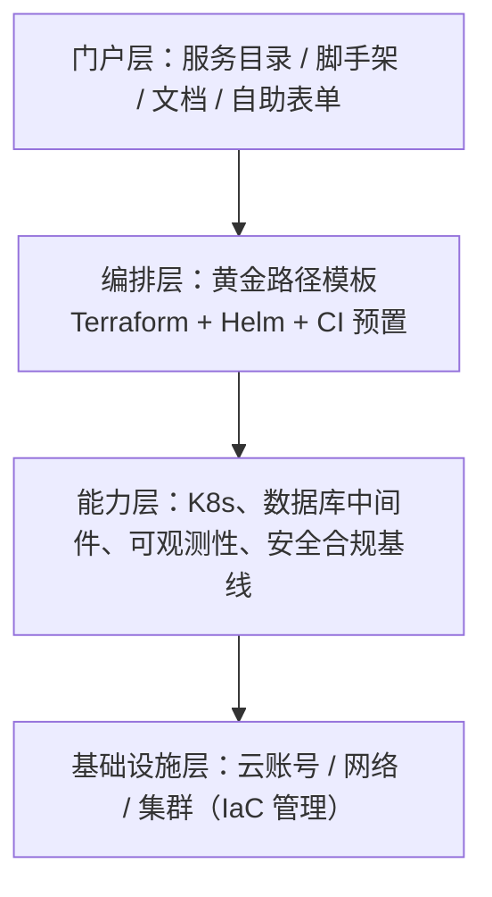

## 0. 一句话理解

> 平台工程（Platform Engineering）是把"给开发者用的基础设施"当作**产品**来做：
> 有专职平台团队、有内部用户（业务开发者）、以用户采纳率为北极星指标。
> 交付载体是**内部开发者门户（IDP, Internal Developer Platform）**——
> 开发者自助完成"建服务、配流水线、上环境"的自助入口。

类比：IDP 之于基础设施，就像应用商店之于操作系统内核——底层能力（K8s/CI/监控）
一直都在，门户把这些能力包装成"一键安装、开箱即用"的体验。

## 1. 为什么会冒出平台工程

### 1.1 它解决的是 DevOps 的"最后一公里"

DevOps 说"谁构建谁运行"，但现实是：

| 痛点 | 表现 |
| :--- | :--- |
| 认知负担爆炸 | 开发者要懂 K8s、Terraform、Helm、ArgoCD、Prometheus……写业务之外要学一整套平台栈 |
| 重复造轮子 | 每个团队自己写 CI、自己搭 Helm Chart，质量参差 |
| 基础设施团队救火式响应 | 到处是"帮我开个权限/建个环境"的工单，价值工作被打断 |
| 微服务尾大不掉 | 服务数超过"康威极限"（一支团队 8-10 个服务）后，协作成本指数上升 |

平台工程的答案：由平台团队把上述能力**产品化**，业务团队像用产品一样自助消费，
认知负担从"人人都是半吊子运维"收敛为"用好一个门户"。

### 1.2 平台工程 vs DevOps vs SRE

| 维度 | DevOps | SRE | 平台工程 |
| :--- | :--- | :--- | :--- |
| 关注点 | 文化与协作流程 | 可靠性工程化（SLO/错误预算） | 开发者体验与自助能力 |
| 交付物 | 流程与实践 | 可靠性方法与工程实践 | 平台产品（IDP） |
| 衡量 | 部署频率/前置时间 | SLA 达成率 | 采纳率、开发者净推荐值、DORA |

三者是互补关系：平台工程把 SRE 的方法与 DevOps 的文化**固化成产品能力**，
让好实践成为默认路径而不是口头倡导。

## 2. IDP 的组成：分层能力模型



四个核心构件：

1. **服务目录（Service Catalog）**：全组织服务资产的总账——每个服务是谁的、
   什么技术栈、部署在哪、健康如何、on-call 是谁。
2. **脚手架（Scaffolding）**：一键生成新服务的模板仓库（代码骨架 + CI + 部署清单 +
   告警基线），"黄金路径"由此而来。
3. **自助动作（Self-service Actions）**：在门户上点按钮完成"拉起预发环境、
   扩容、回滚、开临时权限"，底层由工作流引擎执行并留审计。
4. **评分卡与洞察（Scorecards）**：每个服务的规范符合度打分（有告警吗？有 SLO 吗？
   依赖有漏洞吗？），把治理从"人肉检查"变成"透明排名"。

## 3. 黄金路径：产品思维的落点

黄金路径（Golden Path）= 官方支持、文档完备、开箱即用的"推荐路线"。
设计要点：

1. **约束在模板里，不在文档里**：安全基线、日志格式、trace 注入都焊死在脚手架里，
   开发者"不做错"比"学着做对"便宜得多。
2. **80/20 原则**：黄金路径覆盖 80% 的常规场景，剩下 20% 允许偏离——
   但偏离要有审批与评分卡降级，堵死"曲线救国绕过平台"的口子。
3. **可升级性**：模板升级后，存量服务要有低成本跟进手段（批量 PR、自动迁移），
   否则黄金路径半年就碎成"百样服务"。

## 4. Backstage：事实标准的开源 IDP 框架

Backstage（Spotify 开源并捐赠给 CNCF 的项目）是当前最主流的开源门户框架，
三块核心概念：软件目录（catalog）、脚手架（Scaffolder）、TechDocs。

```yaml
# catalog-info.yaml：一个服务在目录中的"户口本"
apiVersion: backstage.io/v1alpha1
kind: Component
metadata:
  name: order-service
  title: 订单服务
  description: 提供下单/查询/取消等订单能力
  tags: [java, spring, tier-1]
spec:
  type: service
  lifecycle: production
  owner: team-order            # 归属团队（Group 实体）
  dependsOn: [resource:orders-db, component:payment-service]
  providesApis: [order-api]
---
apiVersion: backstage.io/v1alpha1
kind: Resource
metadata:
  name: orders-db
spec:
  type: database
  owner: team-order
  dependencyOf: [component:order-service]
```

```yaml
# Scaffolder 模板片段：一键创建新服务
apiVersion: scaffolder.backstage.io/v1beta3
kind: Template
metadata:
  name: spring-golden-path
  title: Java 服务（黄金路径）
spec:
  parameters:
    - title: 基本信息
      properties:
        name: { type: string, title: 服务名 }
        owner: { type: string, title: 归属团队 }
  steps:
    - id: fetch
      action: fetch:template           # 渲染代码骨架
      input: { url: ./skeleton, values: { name: '${{ parameters.name }}' } }
    - id: publish
      action: publish:github           # 建仓库并推送
      input: { repoUrl: 'github.com?owner=org&repo=${{ parameters.name }}' }
    - id: register
      action: catalog:register         # 自动注册进服务目录
      input: { repoContentsUrl: '${{ steps.publish.output.repoContentsUrl }}' }
```

落地提醒：Backstage 只提供框架，**目录数据、模板、插件生态都要自己养**；
"装好 Backstage"与"有了一个好用的 IDP"之间隔着数个季度的产品化运营。

## 5. 度量：平台工程的验收标准

| 指标类别 | 代表指标 | 说明 |
| :--- | :--- | :--- |
| DORA 四指标 | 部署频率、变更前置时间、变更失败率、MTTR | 交付效能的行业基准（Google DORA 项目） |
| 采纳率 | 经黄金路径创建/部署的服务占比、门户周活 | 平台的北极星——没人用的平台等于零 |
| 开发者体验 | 开发者 NPS、新服务上线时间、SPACE 框架调研 | 主观体验与客观耗时互相印证 |
| 平台自身可靠性 | 平台 SLO（门户可用性、流水线成功率） | 平台也是生产系统，同样要 SLO 与值班 |

注意：**度量用于改进平台而非考核个人**。DORA 指标一旦被当成 KPI，
"多部署几次""失败不算失败"的博弈立刻出现。

## 6. 落地路线图

```text
阶段 0（1-2 月）  现状盘点：技术栈地图、重复劳动清单、痛点访谈
阶段 1（2-3 月）  最小可用：统一 CI 模板 + 一个黄金路径脚手架（先赢一次）
阶段 2（3-6 月）  服务目录 + 自助环境：门户可见、可点、可查
阶段 3（6-12 月） 治理自动化：评分卡、合规基线、成本可见性
阶段 4（持续）    平台运营：采纳率复盘、模板升级、按产品节奏迭代
```

常见失败模式与对策：

| 失败模式 | 对策 |
| :--- | :--- |
| 大爆炸式上线：憋一年憋出全能平台 | 按阶段交付，每阶段都有真实用户反馈 |
| 强制迁移：行政命令逼所有团队上平台 | 用体验赢采纳，先让标杆团队受益并背书 |
| 平台团队闭门造车 | 设开发者体验负责人，定期用户访谈，公开路线图 |
| 只建门户不管模板治理 | 模板同样走 CI 评审与版本管理，黄金路径定期升级 |
| 平台没有 SLO/值班 | 平台即产品，产品也要可靠性承诺与支持渠道 |

## 7. 与本模块其他主题的关系

- 平台的"能力层"就是前面各篇的工程化：容器（Docker/K8s）、CI/CD、IaC（Terraform）、
  GitOps（ArgoCD）、可观测性（Prometheus/OTel）。
- IDP 是把这些散件**串成自助产品**的那层皮；没有扎实的底层，门户只是好看的空壳。
- 反过来，平台工程为 GitOps 提供入口：门户的"部署"按钮最终落到配置仓的一个 PR。

## 8. 动手试试

1. 盘点你所在团队的"重复基建劳动"：新服务从零到上线的步骤清单里，
   哪些步骤每个服务都要重复一遍？——那就是黄金路径模板的候选清单。
2. 为一个新服务手写 `catalog-info.yaml`，标注 owner 与依赖，体会"服务户口本"的用法。
3. 用 Backstage Demo（官方演示站）走一遍 Scaffolder 流程，观察模板参数到仓库
   创建再到目录注册的链路。

## 9. 小结

**初学者要点**

1. 平台工程 = 把内部基础设施当产品做；IDP 是交付载体，黄金路径是核心体验。
2. 服务目录、脚手架、自助动作、评分卡是 IDP 的四件套。
3. 采纳率是北极星指标：没人用的平台是昂贵的摆设。

**进阶注意**

1. Backstage 是框架不是成品，产品化运营（模板治理、DX 访谈）才是成败关键。
2. 度量用 DORA + 采纳率 + 开发者体验三角互证，警惕指标异化为 KPI 博弈。
3. 平台自身的可靠性（SLO、值班、变更管理）常被忽视，却是信任的底线。
