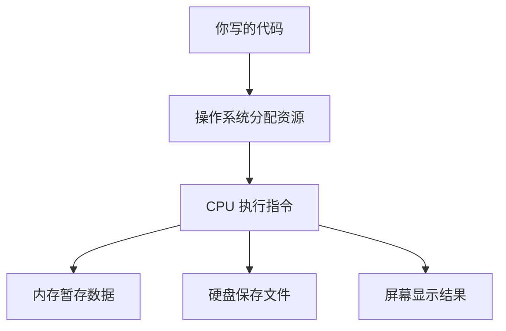

## 为什么这是第一课

在你写下第一行代码之前，先花二十分钟建立一个正确的心智模型，是回报率最高的投入。之后学习中遇到的绝大多数困惑——"程序为什么不会自己动""代码写完去哪了""内存到底是什么"——都源于缺少这一课。

## 计算机的三个层次

把计算机想象成一栋办公楼：

| 层次 | 类比 | 实际是什么 |
| --- | --- | --- |
| 硬件 | 楼体与水电管线 | CPU（干活的工人）、内存（工作台）、硬盘（仓库）、屏幕键盘（对讲窗口） |
| 操作系统 | 物业管理系统 | Windows、macOS、Linux——分配资源、调度工人、管理文件 |
| 应用程序 | 进驻的公司 | 浏览器、微信、你将要写的程序 |

## 程序运行的完整旅程

当你在电脑上双击一个程序，背后发生了这些事：

1. 操作系统把程序文件从硬盘复制到内存；
2. CPU 从内存中逐条读取指令并执行；
3. 执行结果写回内存，或显示到屏幕，或保存到硬盘。

**你写的代码最终也会变成这样一段被 CPU 执行的指令。** 不同编程语言的差别，只在于"你写的人类可读文本"如何变成"CPU 可执行的指令"：

- 编译型语言（如 Go、C++）：先整体翻译成机器指令，生成可执行文件；
- 解释型语言（如 Python、JavaScript）：一边翻译一边执行，灵活但稍慢；
- 虚拟机语言（如 Java、Kotlin）：先编译成中间码，由虚拟机再翻译执行。

这些概念现在只需要知道名字，后续到对应模块会逐一深入。

## 文件与文件夹：一切数据的组织方式

操作系统用**文件系统**管理数据。你现在看到的每一个 `.md`、`.png`、`.exe` 都是文件；文件夹（目录）是文件的容器。写程序本质上就是：**用文本编辑器写文件，用工具链把文件变成可运行的程序。**

路径是文件的地址。Windows 用反斜杠 `C:\Users\you\file.txt`，macOS 与 Linux 用正斜杠 `/home/you/file.txt`。开发中你会频繁与路径打交道，下一课的命令行就是操作路径的利器。

## 动手环节：观察你自己的电脑

不用写任何代码，先完成三个观察：

1. 打开任务管理器（Windows：`Ctrl+Shift+Esc`；macOS：活动监视器），找到 CPU 与内存占用——这就是"工人"与"工作台"的实时状态。
2. 随便打开一个文件夹，在地址栏查看当前路径——这就是你未来敲命令时所处的"工作目录"。
3. 打开浏览器按 `F12`，切到 Console（控制台）标签——你将在 JavaScript 模块的第一课里在这里写下第一行代码。

## 常见困惑

**"内存和硬盘到底差在哪？"**——内存断电即失、速度极快；硬盘断电不丢、速度较慢。程序运行时必须在内存里，文件保存必须进硬盘。

**"为什么有的程序卡有的不卡？"**——CPU 排队执行的指令太多（计算密集）或等待硬盘、网络响应太慢（IO 等待）。后续学习并发与异步时会反复回到这张图。

## 下一步

完成本课的三个观察后，进入[编程是什么与编程语言全景](/getting-started/002-WhatIsProgramming)，弄清楚"写代码"这件事的全貌，再选择你的第一门语言。
