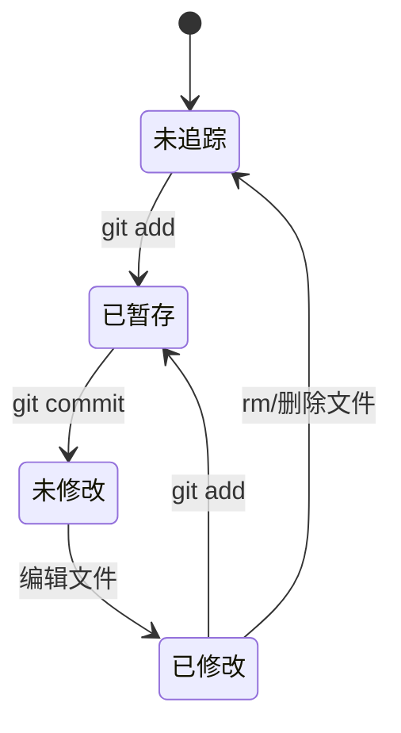

## 1. Git 工作区、暂存区和本地仓库

### 1.1 概念解释

- **工作区（Working Directory）**：项目目录下用户直接编辑的文件区域
- **暂存区（Staging Area）**：位于 `.git/index` 文件中，用于保存即将提交的文件列表
- **本地仓库（Local Repository）**：位于 `.git` 目录中，包含了完整的项目历史

### 1.2 文件状态

Git 中的文件有两种状态：

- **已追踪（Tracked）**：已被纳入版本控制的文件
- 未修改（Unmodified）
- 已修改（Modified）
- 已暂存（Staged）
- **未追踪（Untracked）**：不在版本控制中的新文件

### 1.3 文件状态流转



## 2. 状态管理

### 2.1 查看状态

```bash
 git status
```

输出说明：

- `Changes to be committed`：暂存区中的文件（已暂存）
- `Changes not staged for commit`：工作区中已修改但未暂存的文件
- `Untracked files`：未追踪的新文件

### 2.2 简略格式

```bash
 git status -s
```

输出标记：

- `??`：未追踪的文件
- `A`：新添加到暂存区的文件
- `M`：已修改的文件
- `D`：已删除的文件

## 3. 暂存与提交

### 3.1 暂存操作

```bash
 # 暂存单个文件
 git add <file>
 # 暂存所有文件
 git add .
 # 暂存所有已追踪文件的修改
 git add -u
 # 交互式暂存
 git add -p
```

### 3.2 提交操作

```bash
 # 提交暂存区的文件
 git commit -m "commit message"
 # 提交所有已追踪文件的修改（跳过暂存）
 git commit -a -m "commit message"
 # 修改最后一次提交
 git commit --amend -m "new message"
 # 提交空目录（需要在里面添加 .gitkeep）
 git add directory/.gitkeep
 git commit -m "add directory"
```

### 3.3 提交信息规范

推荐格式：

```text
 <type>: <subject>
 <body>
 <footer>
```

类型（type）：

- `feat`：新功能
- `fix`：bug 修复
- `docs`：文档更新
- `style`：格式调整
- `refactor`：重构
- `test`：测试相关
- `chore`：构建/工具相关

## 4. 查看历史

### 4.1 查看提交历史

```bash
 # 查看完整提交历史
 git log
 # 查看简洁的提交历史
 git log --oneline
 # 查看最近 N 次提交
 git log -n 5
 # 查看分支合并历史
 git log --graph --oneline --all
 # 查看特定文件的修改历史
 git log <file>
 # 查看某次提交的详细信息
 git show <commit-hash>
```

### 4.2 查看差异

```bash
 # 查看工作区与暂存区的差异
 git diff
 # 查看暂存区与上次提交的差异
 git diff --cached
 # 查看两个分支的差异
 git diff <branch1>..<branch2>
 # 查看特定文件的差异
 git diff <file>
```

## 5. 标签管理

### 5.1 创建标签

```bash
 # 创建轻量标签
 git tag <tag-name>
 # 创建附注标签
 git tag -a <tag-name> -m "tag message"
 # 为特定提交创建标签
 git tag -a <tag-name> <commit-hash> -m "tag message"
```

### 5.2 查看和操作标签

```bash
 # 查看所有标签
 git tag
 # 查看标签详细信息
 git show <tag-name>
 # 删除标签
 git tag -d <tag-name>
 # 推送标签到远程
 git push <remote-name> <tag-name>
 # 推送所有标签到远程
 git push <remote-name> --tags
 # 检出到特定标签
 git checkout <tag-name>
```

## 6. 撤销操作

### 6.1 撤销工作区修改

```bash
 # 撤销单个文件的修改
 git checkout -- <file>
 # 撤销所有文件的修改
 git checkout -- .
 # 使用 git restore（Git 2.23+）
 git restore <file>
 git restore .
```

### 6.2 撤销暂存

```bash
 # 撤销暂存（保留工作区修改）
 git reset HEAD <file>
 # 使用 git restore（Git 2.23+）
 git restore --staged <file>
```

### 6.3 撤销提交

```bash
 # 软回退：撤销提交，保留修改在暂存区
 git reset --soft HEAD~1
 # 混合回退：撤销提交，保留修改在工作区
 git reset --mixed HEAD~1
 # 硬回退：撤销提交，丢弃所有修改
 git reset --hard HEAD~1
```

### 6.4 使用 git revert

```bash
 # 创建一个新提交来撤销指定提交
 git revert <commit-hash>
 # 撤销多个提交
 git revert <commit-hash1> <commit-hash2>
```

**注意**：`git reset` 会改写历史，已推送到远程的提交不建议使用；`git revert` 是安全的撤销方式，会创建新的提交。

## 7. 远程仓库操作

### 7.1 添加和查看远程仓库

```bash
 # 添加远程仓库
 git remote add origin <url>
 # 查看远程仓库
 git remote -v
 # 修改远程仓库 URL
 git remote set-url origin <new-url>
 # 删除远程仓库
 git remote remove origin
```

### 7.2 推送和拉取

```bash
 # 推送到远程仓库
 git push origin main
 # 拉取远程仓库的更新
 git pull origin main
 # 获取远程仓库的更新（不合并）
 git fetch origin
```

## 8. 日常开发流程

### 8.1 标准开发流程

```bash
 # 1. 拉取最新代码
 git pull origin main
 # 2. 创建功能分支
 git checkout -b feature/new-feature
 # 3. 开发并提交
 git add .
 git commit -m "feat: add new feature"
 # 4. 推送到远程
 git push origin feature/new-feature
 # 5. 合并到主分支
 git checkout main
 git merge feature/new-feature
 git push origin main
 # 6. 删除功能分支
 git branch -d feature/new-feature
```

### 8.2 紧急修复流程

```bash
 # 1. 创建修复分支
 git checkout -b hotfix/fix-bug
 # 2. 修复并提交
 git add .
 git commit -m "fix: fix critical bug"
 # 3. 合并到主分支和开发分支
 git checkout main
 git merge hotfix/fix-bug
 git checkout develop
 git merge hotfix/fix-bug
 # 4. 删除修复分支
 git branch -d hotfix/fix-bug
```

## 9. 最佳实践

### 9.1 提交规范

- **频繁提交**：小步快跑，每次提交只做一件事
- **有意义的提交信息**：使用规范的提交信息格式
- **不要提交半成品**：确保每次提交都是可运行的

### 9.2 分支管理

- **主分支保持稳定**：main 分支始终可部署
- **功能分支开发**：每个功能在独立分支上开发
- **及时合并和删除**：合并后及时删除功能分支

### 9.3 常用快捷命令

| 命令                     | 说明                    |
| ------------------------ | ----------------------- |
| `git stash`              | 暂存当前修改            |
| `git stash pop`          | 恢复暂存的修改          |
| `git stash list`         | 查看暂存列表            |
| `git cherry-pick <hash>` | 选择性合并某个提交      |
| `git rebase main`        | 变基到 main 分支        |
| `git bisect`             | 二分查找引入 bug 的提交 |

---

## 状态查看

**基本写法：查看仓库状态**
`git status`
```bash
# 显示工作区、暂存区文件状态
git status;
```

**简略写法：短格式状态**
`git status -s`
```bash
# 输出 ?? 未追踪 / A 新增暂存 / M 修改 / D 删除
git status -s;
```

---

## 暂存操作

**基本写法：暂存单个文件**
`git add <file>`
```bash
# 暂存指定文件
git add src/index.js;
```

**基本写法：暂存所有变更**
`git add .`
```bash
# 暂存当前目录下所有文件
git add .;
```

**单行写法：暂存多个文件**
`git add <file1> <file2> <file3>`
```bash
# 一次性暂存多个文件
git add src/index.js src/utils.js src/config.js;
```

**换行写法：暂存多个文件**
`git add <file1> <file2> <file3>`
```bash
# 换行书写多个文件
git add src/index.js \
        src/utils.js \
        src/config.js;
```

**基本写法：暂存已追踪文件**
`git add -u`
```bash
# 暂存所有已追踪文件的修改（不含新文件）
git add -u;
```

**基本写法：交互式暂存**
`git add -p`
```bash
# 逐代码块确认是否暂存
git add -p;
```

---

## 提交操作

**基本写法：标准提交**
`git commit -m "<message>"`
```bash
# 提交暂存区内容并附带消息
git commit -m "feat: add login module";
```

**基本写法：跳过暂存提交**
`git commit -a -m "<message>"`
```bash
# 自动暂存已追踪文件并提交
git commit -a -m "fix: resolve crash";
```

**基本写法：修改最后一次提交**
`git commit --amend -m "<message>"`
```bash
# 修改最近一次提交消息
git commit --amend -m "feat: add login module v2";
```

---

## 提交信息规范

**基本写法：约定式提交格式**
`<type>: <subject>`
```text
# type 取值：feat / fix / docs / style / refactor / test / chore
feat: add user authentication
```

---

## 查看历史

**基本写法：查看完整历史**
`git log`
```bash
# 查看完整提交历史
git log;
```

**基本写法：简洁历史**
`git log --oneline`
```bash
# 每条提交一行显示
git log --oneline;
```

**基本写法：限制条数**
`git log -n <count>`
```bash
# 查看最近 5 次提交
git log -n 5;
```

**基本写法：图形化分支历史**
`git log --graph --oneline --all`
```bash
# 查看所有分支的合并图
git log --graph --oneline --all;
```

**基本写法：查看文件历史**
`git log <file>`
```bash
# 查看 src/index.js 的修改历史
git log src/index.js;
```

**基本写法：查看提交详情**
`git show <commit-hash>`
```bash
# 查看指定提交的详情
git show abc1234;
```

---

## 查看差异

**基本写法：工作区与暂存区差异**
`git diff`
```bash
# 查看未暂存的修改
git diff;
```

**基本写法：暂存区与上次提交差异**
`git diff --cached`
```bash
# 查看已暂存但未提交的修改
git diff --cached;
```

**基本写法：分支间差异**
`git diff <branch1>..<branch2>`
```bash
# 比较 main 与 feature 分支差异
git diff main..feature;
```

**基本写法：文件差异**
`git diff <file>`
```bash
# 查看 src/index.js 的修改
git diff src/index.js;
```

---

## 撤销工作区修改

**基本写法：撤销单个文件修改**
`git checkout -- <file>`
```bash
# 撤销 src/index.js 的工作区修改
git checkout -- src/index.js;
```

**基本写法：撤销所有文件修改**
`git checkout -- .`
```bash
# 撤销所有工作区修改
git checkout -- .;
```

**基本写法：使用 restore 撤销**
`git restore <file>`
```bash
# 撤销指定文件修改（Git 2.23+）
git restore src/index.js;
```

---

## 撤销暂存

**基本写法：取消暂存（保留修改）**
`git reset HEAD <file>`
```bash
# 将 src/index.js 移出暂存区
git reset HEAD src/index.js;
```

**基本写法：使用 restore 撤销暂存**
`git restore --staged <file>`
```bash
# 取消暂存但保留工作区修改（Git 2.23+）
git restore --staged src/index.js;
```

---

## 撤销提交

**基本写法：软回退**
`git reset --soft HEAD~<n>`
```bash
# 撤销最近一次提交，修改保留在暂存区
git reset --soft HEAD~1;
```

**基本写法：混合回退**
`git reset --mixed HEAD~<n>`
```bash
# 撤销最近一次提交，修改保留在工作区
git reset --mixed HEAD~1;
```

**基本写法：硬回退**
`git reset --hard HEAD~<n>`
```bash
# 撤销最近一次提交并丢弃修改
git reset --hard HEAD~1;
```

**基本写法：安全撤销（revert）**
`git revert <commit-hash>`
```bash
# 创建反向提交撤销 abc1234
git revert abc1234;
```

**单行写法：撤销多个提交**
`git revert <hash1> <hash2>`
```bash
# 撤销多个不连续的提交
git revert abc1234 def5678;
```

---

## 远程仓库基础

**基本写法：添加远程仓库**
`git remote add <name> <url>`
```bash
# 添加名为 origin 的远程仓库
git remote add origin https://github.com/user/repo.git;
```

**基本写法：查看远程仓库**
`git remote -v`
```bash
# 显示远程仓库名称和地址
git remote -v;
```

**基本写法：修改远程仓库 URL**
`git remote set-url <name> <new-url>`
```bash
# 更新 origin 的 URL
git remote set-url origin https://github.com/user/new-repo.git;
```

**基本写法：删除远程仓库**
`git remote remove <name>`
```bash
# 删除名为 origin 的远程仓库
git remote remove origin;
```

---

## 推送与拉取

**基本写法：推送到远程**
`git push <remote> <branch>`
```bash
# 推送 main 分支到 origin
git push origin main;
```

**基本写法：拉取远程更新**
`git pull <remote> <branch>`
```bash
# 拉取 origin 的 main 分支并合并
git pull origin main;
```

**基本写法：获取远程更新（不合并）**
`git fetch <remote>`
```bash
# 获取 origin 的更新但不合并
git fetch origin;
```

---

## 暂存修改（stash）

**基本写法：暂存当前修改**
`git stash`
```bash
# 暂存当前所有修改
git stash;
```

**基本写法：恢复暂存修改**
`git stash pop`
```bash
# 恢复最近一次暂存的修改并删除该暂存
git stash pop;
```

**基本写法：查看暂存列表**
`git stash list`
```bash
# 查看所有暂存记录
git stash list;
```

---

## 选择性合并

**基本写法：挑选提交合并**
`git cherry-pick <commit-hash>`
```bash
# 将 abc1234 提交应用到当前分支
git cherry-pick abc1234;
```
