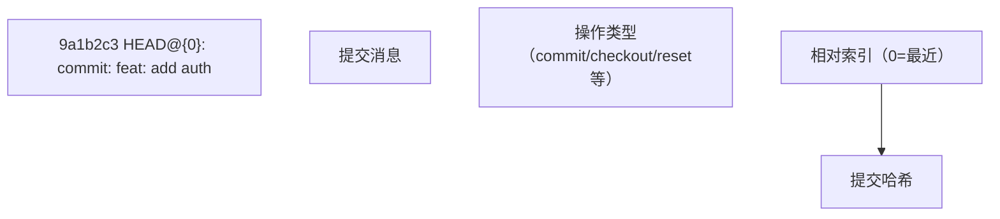

## 1. reflog 概述

### 1.1 什么是 reflog

reflog（Reference Log）记录了**本地引用的变更历史**，包括 HEAD、分支指针的每次移动。它是 Git 的**安全网**，即使执行了看似破坏性的操作，也可以通过 reflog 恢复。

### 1.2 reflog 与 log 的区别

| 特性               | `git log`    | `git reflog` |
| :----------------- | :----------- | :----------- |
| **记录内容**       | 提交历史     | 引用移动历史 |
| **范围**           | 所有可达提交 | 仅本地操作   |
| **包含已删除提交** |              |              |
| **共享**           | 推送到远程   | 仅本地       |
| **过期**           | 永久         | 默认90天     |

## 2. 基本用法

### 2.1 查看引用日志

```bash
# 查看 HEAD 的 reflog
git reflog
# 9a1b2c3 HEAD@{0}: commit: feat: add auth
# def4567 HEAD@{1}: checkout: moving from feature to main
# abc1234 HEAD@{2}: commit: fix: resolve bug
# ...

# 查看指定分支的 reflog
git reflog show main
git reflog show feature

# 查看所有引用的 reflog
git reflog show --all
```

### 2.2 reflog 条目解读



### 2.3 常见操作类型

| 操作              | reflog 记录                        |
| :---------------- | :--------------------------------- |
| `git commit`      | `commit: feat: xxx`                |
| `git checkout`    | `checkout: moving from A to B`     |
| `git reset`       | `reset: moving to HEAD~3`          |
| `git merge`       | `merge feature: Merge made by ...` |
| `git rebase`      | `rebase: checkout main`            |
| `git cherry-pick` | `cherry-pick: fix: xxx`            |
| `git pull`        | `pull: Fast-forward`               |
| `git clone`       | `clone: from https://...`          |

## 3. 恢复误操作

### 3.1 恢复 reset --hard

```bash
# 误操作：重置了3个提交
git reset --hard HEAD~3

# 恢复：通过 reflog 找到重置前的提交
git reflog
# abc1234 HEAD@{0}: reset: moving to HEAD~3    ← 重置操作
# def5678 HEAD@{1}: commit: feat: add auth     ← 重置前的提交

# 恢复到重置前的状态
git reset --hard def5678
# 或使用相对索引
git reset --hard HEAD@{1}
```

### 3.2 恢复误删的分支

```bash
# 误删分支
git branch -D feature

# 查找分支最后的提交
git reflog
# 9a1b2c3 HEAD@{5}: checkout: moving from feature to main  ← feature 的最后提交

# 重新创建分支
git branch feature 9a1b2c3
# 或
git checkout -b feature 9a1b2c3
```

### 3.3 恢复 rebase 失败

```bash
# rebase 过程中出错
git rebase main
# ... 冲突处理失败 ...

# 查找 rebase 前的状态
git reflog
# abc1234 HEAD@{2}: rebase: checkout main  ← rebase 开始前

# 放弃 rebase
git rebase --abort

# 或恢复到 rebase 前
git reset --hard HEAD@{2}
```

### 3.4 恢复 amend 之前的提交

```bash
# 误操作：amend 修改了提交
git commit --amend -m "new message"

# 查找 amend 前的提交
git reflog
# def5678 HEAD@{0}: commit (amend): new message
# abc1234 HEAD@{1}: commit: old message  ← amend 前的提交

# 恢复
git reset --soft abc1234
```

## 4. reflog 过期机制

### 4.1 默认过期时间

| 引用类型       | 过期时间 | 配置项                       |
| :------------- | :------- | :--------------------------- |
| **HEAD**       | 90 天    | `gc.reflogExpire`            |
| **可达提交**   | 90 天    | `gc.reflogExpire`            |
| **不可达提交** | 30 天    | `gc.reflogExpireUnreachable` |

### 4.2 配置过期时间

```bash
# 设置永不过期
git config --global gc.reflogExpire never

# 设置30天过期
git config --global gc.reflogExpire 30.days

# 设置不可达提交7天过期
git config --global gc.reflogExpireUnreachable 7.days
```

### 4.3 手动清理

```bash
# 删除所有过期的 reflog 条目
git reflog expire --expire=now --all

# 配合 gc 清理不可达对象
git reflog expire --expire=now --all && git gc --prune=now
```

## 5. 高级用法

### 5.1 按时间查找

```bash
# 查看指定时间点的 HEAD 位置
git reflog --date=iso
git show HEAD@{2026-06-10}

# 查看昨天的 HEAD
git show HEAD@{yesterday}
```

### 5.2 diff 比较

```bash
# 比较当前状态和3步前的差异
git diff HEAD@{3}

# 比较两个 reflog 条目
git diff HEAD@{5} HEAD@{3}
```

### 5.3 查看文件历史版本

```bash
# 查看文件在某个 reflog 点的内容
git show HEAD@{3}:src/index.js
```
## 查看 reflog

**基本写法：查看当前分支引用日志**
`git reflog [show]`
```bash
# 查看当前分支的引用日志
git reflog
```

---

**基本写法：查看指定分支引用日志**
`git reflog <分支名>`
```bash
# 查看 main 分支的引用日志
git reflog main
```

---

**基本写法：查看 HEAD 引用日志**
`git reflog show HEAD`
```bash
# 查看 HEAD 的所有移动记录
git reflog show HEAD
```

---

**基本写法：限定显示条数**
`git reflog -<数量>`
```bash
# 仅显示最近 5 条引用记录
git reflog -5
```

---

**基本写法：带日期过滤**
`git reflog --since="<时间>"`
```bash
# 仅显示最近 2 小时的记录
git reflog --since="2 hours ago"
```

---

## reflog 输出格式

**基本写法：自定义输出格式**
`git reflog --format="<格式>"`
```bash
# 自定义显示提交哈希与引用动作
git reflog --format="%h %gs"
```

---

**基本写法：显示时间戳**
`git reflog --date=iso`
```bash
# 以 ISO 格式显示日期
git reflog --date=iso
```

---

## 恢复丢失的提交

**基本写法：通过 reflog 哈希恢复提交**
`git reset --hard <reflog哈希>`
```bash
# 重置到 reflog 记录的某次提交
git reset --hard HEAD@{2}
```

---

**基本写法：通过 cherry-pick 恢复单个提交**
`git cherry-pick <reflog哈希>`
```bash
# 将丢失的提交重新应用
git cherry-pick 9a3b1c2
```

---

**基本写法：创建新分支保存丢失提交**
`git branch <分支名> <reflog哈希>`
```bash
# 用新分支指向丢失的提交
git branch recover-work HEAD@{3}
```

---

**基本写法：强制移动分支到 reflog 位置**
`git branch -f <分支名> <reflog哈希>`
```bash
# 将分支强制指向 reflog 记录
git branch -f feature HEAD@{1}
```

---

## 恢复误删分支

**基本写法：通过 reflog 重建被删分支**
`git branch <分支名> <reflog哈希>`
```bash
# 恢复已删除的 feature 分支
git branch feature feature@{2}
```

---

**基本写法：查看已删除分支的 reflog**
`git reflog show <已删除分支名>`
```bash
# 查看已删除分支历史位置
git reflog show deleted-branch
```

---

## 恢复误用 reset

**基本写法：撤销硬重置**
`git reset --hard HEAD@{1}`
```bash
# 回到 reset 之前的位置
git reset --hard HEAD@{1}
```

---

**基本写法：用 ORIG_HEAD 恢复**
`git reset --hard ORIG_HEAD`
```bash
# 使用上次操作前的 HEAD
git reset --hard ORIG_HEAD
```

---

## reflog 过期与管理

**基本写法：查看 reflog 子命令**
`git reflog --help`
```bash
# 查看 reflog 完整用法
git reflog --help
```

---

**基本写法：删除单条 reflog 记录**
`git reflog delete <引用>@{<序号>}`
```bash
# 删除指定 reflog 条目
git reflog delete HEAD@{5}
```

---

**基本写法：立即过期所有 reflog**
`git reflog expire --expire=now --all`
```bash
# 标记所有 reflog 条目为过期
git reflog expire --expire=now --all
```

---

**基本写法：按时间过期 reflog**
`git reflog expire --expire=<时间> --all`
```bash
# 90 天前的可达条目过期
git reflog expire --expire=90.days --all
```

---

**基本写法：过期不可达条目**
`git reflog expire --expire-unreachable=<时间> --all`
```bash
# 30 天前不可达的条目过期
git reflog expire --expire-unreachable=30.days --all
```

---

## 与 fsck 配合查找悬空对象

**基本写法：查找所有悬空提交**
`git fsck --lost-found`
```bash
# 查找未引用的对象并写入 .git/lost-found
git fsck --lost-found
```

---

**基本写法：查看悬空提交内容**
`git show <悬空提交哈希>`
```bash
# 查看悬空提交的变更
git show d1f2a3b
```

---

## 配置 reflog 保留时长

**基本写法：设置可达条目保留时间**
`git config --global gc.reflogExpire "<时间>"`
```bash
# 可达条目保留 90 天
git config --global gc.reflogExpire "90 days"
```

---

**基本写法：设置不可达条目保留时间**
`git config --global gc.reflogExpireUnreachable "<时间>"`
```bash
# 不可达条目保留 30 天
git config --global gc.reflogExpireUnreachable "30 days"
```

---

**基本写法：禁用某 ref 自动写 reflog**
`git config --global core.logAllRefUpdates false`
```bash
# 关闭自动记录引用更新
git config --global core.logAllRefUpdates false
```

---

## reflog 与 stash 协同

**基本写法：查看 stash 的 reflog**
`git reflog show stash`
```bash
# 查看 stash 栈所有变更
git reflog show stash
```

---

**基本写法：恢复误删的 stash**
`git stash apply <stash@{n}>`
```bash
# 通过 reflog 找回已 drop 的 stash
git stash apply stash@{2}
```
