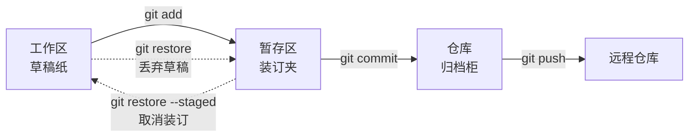
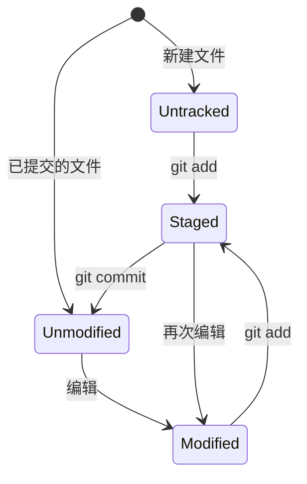

## 前置知识与学习目标

**前置知识**：完成过至少一次 `git init` → `add` → `commit` 流程。

学完本文你应当能够：

1. 说出工作区、暂存区、仓库三棵树各自的角色与物理位置；
2. 看懂 `git status -s` 的双列状态码；
3. 用 diff 矩阵准确定位「我的改动到底在哪棵树里」；
4. 掌握暂存部分改动、撤销误暂存等日常操作。

一个贯穿全文的类比：**工作区是草稿纸，暂存区是装订夹，仓库是归档柜**。草稿随便涂改；觉得稳定的页面放进装订夹（`git add`）；每攒好一册就归档一份完整快照（`git commit`）。装订夹的意义在于允许你把散碎改动整理成干净的一册再归档。

## 1. 三棵树模型

Git 在任何一个时刻都用三份「目录清单」管理工作状态：

| 树           | 物理位置       | 内容                       | 进出命令                    |
| :----------- | :------------- | :------------------------- | :-------------------------- |
| **工作区**   | 项目目录       | 你正在编辑的实际文件       | 编辑器、`git restore`       |
| **暂存区**   | `.git/index`   | 下一次提交将包含的快照     | `git add` / `git rm`        |
| **仓库**     | `.git/objects` | 提交历史与全部对象         | `git commit`                |



一个必须先扭转的直觉：**暂存区存的不是「改动清单」，而是完整的文件快照**。`git add` 时 Git 把文件内容做成 blob 写入对象库，并在 index 里记录「这个路径现在指向哪个 blob」。所以暂存区随时可以整体拿出来当一棵树看（它就是下一次提交的 tree 的草稿）。

## 2. 工作区：文件的四种状态



`git status` 的完整输出会分区显示这三类：

```bash
git status
# On branch main
# Changes to be committed:          ← 暂存区相对 HEAD 有差异（将进入提交）
#   modified:   index.js
# Changes not staged for commit:    ← 工作区相对暂存区有差异
#   modified:   README.md
# Untracked files:                  ← 从未进入过快照的文件
#   new-feature.js
```

## 3. 暂存区：index 文件

### 3.1 直接观察 index

```bash
git ls-files -s
# 100644 a1b2c3d... 0	README.md      ← mode  blob哈希  stage号  路径
# 100644 e5f6a7b... 0	src/index.js
```

mode、blob 哈希、路径正是提交时 tree 条目的三个组成部分（见 [对象模型](git/240-ObjectModel)），stage 号在合并冲突时区分「ours / theirs / 原始版」（非 0 即有冲突，见 [合并冲突解决](git/130-MergeConflictResolution)）。

### 3.2 进出暂存区

```bash
git add file.txt           # 暂存单个文件
git add .                  # 暂存当前目录全部变更（含新文件）
git add -u                 # 只暂存已跟踪文件的修改与删除
git add -p                 # 交互式按代码块暂存

git restore --staged f.js  # 取消暂存（Git 2.23+，推荐）
git rm --cached f.js       # 停止跟踪但保留工作区文件
```

### 3.3 部分暂存：把一次修改拆成两个提交

```bash
git add -p src/auth.js
# Stage this hunk [y,n,q,a,d,s,e,?]?
# y 暂存此块   n 跳过   q 退出
# s 把相邻改动拆成更小块   e 手动编辑块
```

典型场景：同一文件里既有 bug 修复又有重构，用 `-p` 只暂存修复部分，保证单个提交只做一件事。

### 3.4 一个高频困惑：add 之后又改了文件

```bash
echo "v1" >> app.js && git add app.js
echo "v2" >> app.js        # 暂存后继续编辑

git status -s
# MM app.js      ← 第一列：暂存区有 v1；第二列：工作区又有 v2
git diff --cached app.js   # 看到 v1
git diff app.js            # 看到 v2
```

暂存的是「那一刻的快照」，之后的编辑不会自动跟进——这正是双列状态码存在的原因。

## 4. 仓库：提交即归档

```bash
git commit -m "feat: add login"        # 归档暂存区快照
git commit -a -m "fix: typo"           # 跳过 add：先暂存已跟踪文件的改动再提交
git commit --amend --no-edit           # 把当前暂存区并入上一次提交
```

注意 `commit -a` 只对**已跟踪**文件生效，新文件仍需 `git add`。提交的对象层面发生什么（blob/tree/commit 的构造过程）见 [对象模型](git/240-ObjectModel)。

## 5. 三棵树之间的差异：diff 矩阵

| 命令                    | 比较的两棵树      | 回答的问题             |
| :---------------------- | :---------------- | :--------------------- |
| `git diff`              | 工作区 vs 暂存区  | 「还没装订的草稿」     |
| `git diff --staged`     | 暂存区 vs HEAD    | 「即将归档的内容」     |
| `git diff HEAD`         | 工作区 vs HEAD    | 「所有未提交的改动」   |
| `git diff --name-only`  | （同默认，只列名）| 快速列出改动文件       |

`--staged` 与 `--cached` 是同义词。记忆法：diff 不带参数看「装订夹外的」，带 `--staged` 看「装订夹里的」。

## 6. 完整会话：一次规范的工作循环

```bash
# 1) 修改文件后先体检
git status                # 我改了什么？
git diff                  # 具体改了哪几行？

# 2) 分块暂存并复核
git add -p
git diff --staged         # 装订夹里到底是什么？

# 3) 提交与推送
git commit -m "fix: validate email format in login form"
git push

# 4) 常见修正
git restore --staged wrong.js   # 暂存错了文件
git restore typo.js             # 丢弃工作区里的误改
git add missed.js
git commit --amend --no-edit    # 提交完发现漏文件（未推送时）
```

## 7. 陷阱与调试

- **「我明明 add 了，为什么 diff 还有输出」**：add 之后又编辑了文件，见 3.4 节；暂存快照不会跟随后续编辑。
- **`git add .` 把日志、构建产物都暂存了**：先补 `.gitignore`（见 [.gitignore 深入](git/040-GitignoreDeepDive)），已误暂存用 `git restore --staged` 退出。
- **想丢弃工作区改动却用了 `git restore --staged`**：前者只动装订夹、后者只动草稿；真正丢弃工作区修改的是不带 `--staged` 的 `git restore`，执行前确认清楚。
- **`commit -a` 之外新增的文件没进提交**：`-a` 不含 untracked，新文件必须显式 add。
- **`git diff` 没变化但提交内容不对**：你看到的可能是暂存区旧快照，用 `git diff --staged HEAD` 对照确认。

## 小结

**初学者要点**

- 三棵树 = 工作区（草稿）/ 暂存区（装订夹）/ 仓库（归档柜）；`add` 装订、`commit` 归档。
- `git status` 的分区与 `-s` 双列码是定位改动位置最快的体检工具。
- diff 命令按「比较哪两棵树」记忆，不要死记参数。

**进阶注意**

- 暂存区是完整快照（`.git/index` 二进制文件），`ls-files -s` 可直接解剖，冲突时 stage 号为 1/2/3。
- `commit -a` 只覆盖已跟踪文件；`--amend` 只应在未推送提交上使用。
- 现代命令分工：`restore`（工作区/暂存区修复）已接管 `checkout --` 与 `reset <path>` 的日常场景，reset 保留给「移动分支指针」的本职（见 [git reset](git/300-GitReset)）。
