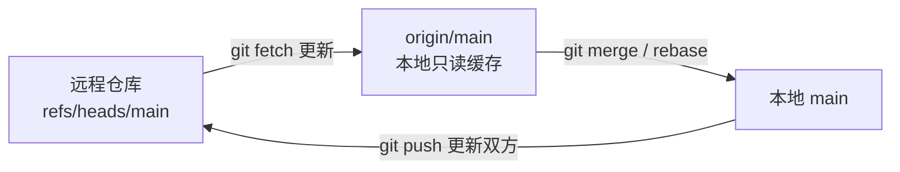

## 前置知识与学习目标

**前置知识**：会 clone、push、pull；理解本地分支是指针（见 [HEAD 与分支本质](git/110-HEADPointerBranchEssence)）。

学完本文你应当能够：

1. 说清 `origin/main` 不是远程服务器上的分支，而是**它的本地只读缓存**；
2. 理解 fetch / pull / push 分别移动哪些指针；
3. 配置上游分支，读懂 `git branch -vv` 的 ahead/behind；
4. 清理远程已删除分支留下的过期引用。

类比先行：`origin/main` 是**公告栏的抄送件**——远程仓库的 main 分支是公告原件，你上次「fetch」时抄了一份贴在本地公告栏。抄送件只在你主动 fetch 时更新；本地 main 则是你按抄送件对齐后的自己的工作版本。

## 1. 远程跟踪分支是什么

克隆仓库后，`.git/refs/remotes/origin/` 下会生成一组**本地引用**，记录「上次与远程同步时，对方各分支停在哪」：

```bash
cat .git/refs/remotes/origin/main
# 8c9d0e1a5b6c7d8e9f0a1b2c3d4e5f6a7b8c9d0e

git branch -r
# origin/HEAD -> origin/main
# origin/main
# origin/feature
```

三个关键性质：

- **只读**：你不直接在 `origin/main` 上开发或提交；
- **惰性**：只在 `git fetch` / `git pull` / `git push` 时更新；
- **本地**：即使离线也能查看、diff、log 这些引用。



## 2. fetch / pull / push 各自动了谁

### 2.1 fetch：只更新抄送件

```bash
git fetch origin          # 拉取全部分支的最新状态，更新 refs/remotes/origin/*
git fetch origin main     # 只更新一个分支
git fetch --all           # 所有已配置的远程

git log --oneline main..origin/main    # 远程领先了哪些提交
git diff main origin/main              # 本地与远程的差异
```

fetch 永远不改你的工作区、不碰本地分支——它是纯粹的「刷新情报」，也是最安全的网络操作。

### 2.2 pull：fetch + 整合

```bash
git pull origin main          # fetch 后把 origin/main 合并（merge）进本地
git pull --rebase             # fetch 后把本地独有提交变基到 origin/main 之上
git pull --ff-only            # 只接受快进，产生分叉时直接失败

# 团队常用配置（Git 2.27+ 会主动提示你三选一）
git config --global pull.rebase true
```

### 2.3 push：请求远程前移并更新抄送件

```bash
git push origin main          # 把本地 main 推给远程
git push                      # 有上游配置时可省略参数

# 推送成功后，origin/main 与本地 main 指向同一提交
```

push 被拒（non-fast-forward）说明远程有你没有的提交：先 fetch 查看，再整合（pull --rebase / merge）后重推。改写过历史的独占分支才允许 `--force-with-lease`（见 [git rebase 黄金法则](git/270-GitRebase)）。

## 3. 上游分支（upstream）

上游是**本地分支与远程跟踪分支之间的关联**，记录在配置里。设置后，裸 `git push` / `git pull` 知道找谁，状态命令也能报进度：

```bash
# 首推时一并设置（最常用）
git push -u origin feature

# 或事后补设
git branch -u origin/feature
git branch --set-upstream-to=origin/feature feature

git branch -vv
# * main    8c9d0e1 [origin/main: ahead 2, behind 1] feat: login
#   feature 5e6f7a8 [origin/feature] fix: token
```

`ahead 2` = 本地独有 2 个提交（待推送）；`behind 1` = 远程独有 1 个提交（待拉取）。等价查询：

```bash
git rev-list --left-right --count main...origin/main
# 2	1
git status -sb          # 顶部简报同样显示 ahead/behind
```

脚本与别名里，`@{u}`（`@{upstream}`）是上游的引用简写：

```bash
git log --oneline @{u}..        # 我有哪些没推送的提交
git diff @{u}                   # 与上游的差异
```

### 3.1 自动跟踪的规则

- `git clone`：main（或远程 HEAD 分支）自动建立跟踪；
- `git checkout feature` / `git switch feature`：本地不存在但远程存在同名分支时，Git 自动创建并跟踪（`--track` 可显式指定任意对应关系）；
- `git switch -c brand-new`：全新分支没有上游，首次 `git push -u` 后建立。

## 4. 过期引用与清理

同事删除远程分支后，你本地的 `origin/xxx` 抄送件不会自动消失：

```bash
git fetch --prune            # fetch 时顺手清理已删除分支的引用
git remote prune origin --dry-run   # 预览将清理哪些
git remote show origin       # 查看远程全景（含"stale tracking"标注）
```

注意：prune 只删**本地缓存引用**，不影响远程；被清理分支上的提交若曾被合并自然可达，否则仍在对象库中等待 gc。

## 5. fetch 的底层：refspec

`remote.origin.fetch` 配置（refspec）定义「远程的哪些引用、映射到本地哪个命名空间」：

```text
+refs/heads/*:refs/remotes/origin/*
 ↑   ↑             ↑
强制  远程引用       本地缓存位置
```

克隆默认建立的正是这条通配映射。掌握 refspec 后你可以做进阶操作，如只镜像某个分支、或把同事仓库作为第二个远程（`git remote add alice ../alice-repo`，之后 `git fetch alice` 会在 `refs/remotes/alice/` 下生成另一组抄送件）。

## 6. 陷阱与调试

- **「我 push 了为什么 origin/main 没动」**：push 被拒时本地引用不会更新；用 `git fetch` 后 `git log --oneline main..origin/main` 对账。
- **`git pull` 默认行为没配，行为不定**：Git 2.27+ 在分叉场景会提示先选 merge / rebase / ff-only；团队统一配置 `pull.rebase` 或 `pull.ff only` 最省心。
- **本地分支与远程同名却没跟踪**：`git branch -u origin/<分支>` 补上，或下次 `push -u`。
- **看不到同事新分支**：先 `git fetch`，再 `git branch -r`；`git switch <分支名>` 即可检出并自动跟踪。
- **`origin/HEAD` 指向漂移**：远程换默认分支后可 `git remote set-head origin --auto` 校正。

## 多远程协作实例

fork 参与上游项目是远程跟踪分支机制的完整应用：

```bash
git clone git@github.com:you/repo.git
cd repo
git remote add upstream git@github.com:org/repo.git

git fetch upstream                       # 生成 refs/remotes/upstream/main
git switch -c feature upstream/main      # 从上游最新开分支
# ...开发、push 到自己的 origin...
git fetch upstream && git rebase upstream/main   # 定期跟进上游
```

此刻每个分支的上游仍是 `origin/*`（`branch.<名>.remote` 决定 push/pull 的默认对象），而 `upstream/*` 只是另一组只读抄送件，随 `git fetch upstream` 更新——两组缓存互不干扰，正是「远程只是名字」的直接体现。

## 小结

**初学者要点**

- `origin/main` 是远程 main 的本地只读缓存，fetch 更新它，merge/rebase 消化它，push 推动双方。
- 首推分支记得 `push -u`，此后 `git push` / `git pull` 直达。
- `git branch -vv` 的 ahead/behind 是本地与远程对账的仪表盘。

**进阶注意**

- `pull` 的三种策略（merge / rebase / ff-only）要团队统一显式配置。
- `--prune`（或 `fetch.prune true`）保持引用列表干净。
- refspec 是 fetch/push 的映射规则，多远程协作与镜像的进阶钥匙。
