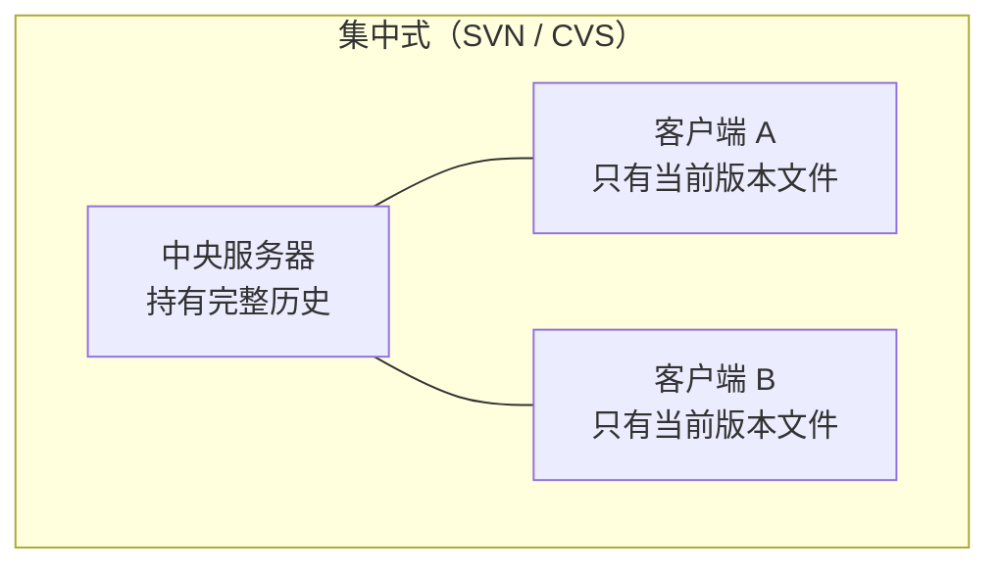
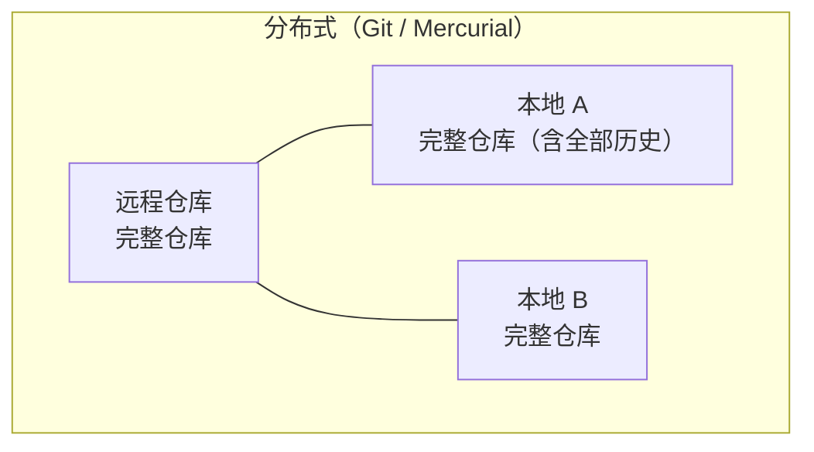

## 前置知识与学习目标

**前置知识**：用过 SVN 或至少听说过「提交到服务器」的工作方式。

学完本文你应当能够：

1. 说清集中式（SVN）与分布式（Git）在架构上的本质差异；
2. 解释「每个克隆都是完整仓库」意味着什么、带来哪些能力；
3. 理解快照 + 去重存储为什么既省空间又保证完整；
4. 认识 Git 支持的多种协作形态（中心化、多远程、点对点）。

类比先行：集中式像**只此一间的图书馆**——借书还书都得去那里，闭馆就全城没书看；分布式像**每个读者家里都有全馆复印件**，日常在家翻阅批注（离线提交），偶尔去图书馆交换增量（fetch/push）。所谓「远程仓库」只是大家约定常去交换的那一家，并非系统必需品。

## 1. 集中式与分布式

### 1.1 两种架构





集中式的客户端只持有「当前版本的文件」，历史查询、分支创建、diff 全部要问服务器；分布式的每个克隆都是**带着全部对象库的完整仓库**，绝大多数操作是纯本地计算。

### 1.2 能力对照

| 能力         | 集中式             | 分布式（Git）          |
| :----------- | :----------------- | :--------------------- |
| 离线提交历史 | 不支持             | 完整支持               |
| 查看历史/diff| 需联网             | 本地毫秒级             |
| 创建分支     | 服务器端操作，较慢 | 本地写一个指针文件     |
| 数据冗余     | 服务器是单点       | N 个克隆 = N 份全量备份|
| 改历史       | 服务器上永久留痕   | 本地随便重写，推送才共享|

「多副本」常被低估：任何一个开发者的机器都天然是一份全量备份，中央服务器宕机或损坏可由任意克隆重建。

## 2. 快照存储与去重

Git 不存储「v2 相对 v1 改了哪几行」这类差异链，而是给每次提交存一棵**完整快照树**；省空间的诀窍在于快照里未变化的文件**指向同一个 blob**：

```text
v1: [A][B][C]        ← 三个 blob
v2: [A][B'][C]       ← 只有 B 换了新 blob，A、C 复用
v3: [A][B'][C']      ← 只有 C 换了新 blob
```

配合 zlib 压缩与打包时的 delta 压缩（见 [git-gc](git/420-GitGc)），全量快照模型的仓库通常比差异式更小。对象与哈希的完整机制见 [对象模型](git/240-ObjectModel) 与 [SHA-1 完整性校验](git/250-SHA1IntegrityCheck)。

```bash
# 亲眼看去重：内容相同 → 同一 blob
echo "hello" > a.txt && cp a.txt b.txt
git add a.txt b.txt
git ls-files -s
# 100644 ce013625... 0	a.txt
# 100644 ce013625... 0	b.txt    ← 同一个哈希
```

## 3. 完整性与不可篡改性

每个对象以其 SHA-1 哈希作为身份，且子对象哈希被写进父对象（tree 记 blob、commit 记 tree 与 parent）。推论：

- 改任何内容 → 对应 blob 哈希变 → tree 变 → commit 变 → **其后整条提交链哈希全变**；
- 历史在数学上无法被静默篡改，传输中损坏的数据包会因哈希不符被整体拒收。

这就是「提交哈希是历史指纹」的含义，也是 Git 敢于放心做本地改写历史（rebase/amend）的底气——改错了永远能凭哈希找回来。

## 4. 协作模型

### 4.1 数据在仓库间的流动


| 操作      | 数据流向         | 说明                     |
| :-------- | :--------------- | :----------------------- |
| `clone`   | 远程 → 全新本地  | 复制整个仓库             |
| `fetch`   | 远程 → 本地      | 只更新远程跟踪引用，最安全 |
| `pull`    | 远程 → 本地      | fetch + 合并/变基        |
| `push`    | 本地 → 远程      | 请求远程分支前移         |

注意方向：pull 的「终点」是**本地仓库/分支**，工作区的文件更新是其附带结果。

### 4.2 多远程：Git 的常态协作

远程只是名字（URL 别名），可以挂任意多个：

```bash
git remote add origin   git@github.com:you/repo.git      # 你的派生仓库
git remote add upstream git@github.com:org/repo.git      # 上游原仓库

git fetch upstream            # 取上游更新
git merge upstream/main       # 或 rebase
git push origin main          # 推到自己的 origin
```

典型的开源「fork + 上游同步」流、以及「GitHub + 内网 GitLab 双推」都是这套机制的应用。

### 4.3 点对点：没有服务器也能协作

分布式架构下服务器并非必需，Git 自带离线交换工具：

```bash
# 补丁交换（邮件/即时通讯即可）
git format-patch -1 HEAD          # 把最近一个提交导出为补丁文件
git apply 0001-xxx.patch          # 或 git am 保留作者信息地应用

# 整仓打包交换
git bundle create repo.bundle main
git clone repo.bundle restored-repo    # 离线环境也能完整克隆
```

这些机制在今天依然实用：给无法联网的产线环境送代码、审计与备份，细节见 [git format-patch](git/400-GitFormatPatch)。

## 5. 性能为什么快

「几乎所有操作都是本地操作」是 Git 速度的第一性原因：

| 操作         | 依赖网络 | 典型耗时       |
| :----------- | :------- | :------------- |
| `git log`    | 否       | 毫秒级         |
| `git diff`   | 否       | 毫秒级         |
| `git branch` | 否       | 微秒级（写指针文件）|
| `git commit` | 否       | 毫秒级         |
| `git push`   | 是       | 秒级（传输增量）|

## 6. 陷阱与理解误区

- **「clone = 下载最新版本」**：clone 得到的是完整历史；只要历史规模大，clone 就慢——大仓库可用 `--depth 1` 浅克隆或 partial clone（`--filter=blob:none`）只取需要的历史。
- **「远程仓库有特殊地位」**：它与本地仓库格式完全相同；`git clone ../project` 本地互克隆一样成立。「中央」只是约定。
- **「分布式就不需要备份」**：克隆副本会随着开发者流失、磁盘损坏而消失，官方仓库仍需正规备份策略。
- **把 pull 当唯一同步手段**：pull 隐含合并动作，审计先行应养成 `fetch` 后看 `log main..origin/main` 的习惯（见 [远程跟踪分支](git/160-RemoteTrackingBranch)）。

## 小结

**初学者要点**

- 分布式的核心是「每个克隆 = 完整仓库」：离线可用、天然多副本、分支本地即时创建。
- Git 存快照而非差异，靠内容寻址去重，配合压缩反而更省空间。
- 远程仓库只是个有名字的普通仓库，fetch/push 才是数据流动的时刻。

**进阶注意**

- 完整性由「子哈希写入父对象」的链条保证，篡改必然导致哈希链断裂。
- fork + upstream、多远程双推、format-patch / bundle 离线交换，都是同一架构的不同用法。
- 大仓库体验优化方向：浅克隆、partial clone、后台维护（见 git-gc 篇的 git maintenance）。
