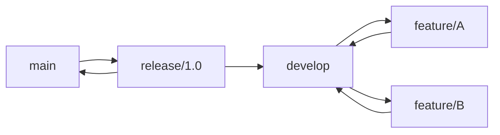
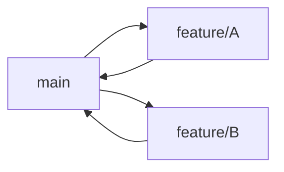

## 1. 分支模型概述

### 1.1 为什么需要分支模型

分支模型定义了团队如何使用分支进行协作，核心解决：

- 如何组织功能开发
- 如何管理发布
- 如何处理热修复
- 如何保持主分支稳定

## 2. Git Flow

### 2.1 分支结构



| 分支        | 命名        | 生命周期 | 用途         |
| :---------- | :---------- | :------- | :----------- |
| **main**    | `main`      | 永久     | 生产版本     |
| **develop** | `develop`   | 永久     | 开发集成分支 |
| **feature** | `feature/*` | 临时     | 功能开发     |
| **release** | `release/*` | 临时     | 发布准备     |
| **hotfix**  | `hotfix/*`  | 临时     | 紧急修复     |

### 2.2 工作流程

```bash
# 1. 从 develop 创建功能分支
git checkout -b feature/auth develop

# 2. 开发并提交
git commit -m "feat: add login"

# 3. 完成后合并回 develop
git checkout develop
git merge --no-ff feature/auth
git branch -d feature/auth

# 4. 准备发布
git checkout -b release/1.0 develop
# 修复 Bug、更新版本号
git commit -m "chore: bump version to 1.0"

# 5. 合并到 main 和 develop
git checkout main
git merge --no-ff release/1.0
git tag -a v1.0.0
git checkout develop
git merge --no-ff release/1.0
git branch -d release/1.0

# 6. 热修复
git checkout -b hotfix/bug-123 main
git commit -m "fix: resolve critical bug"
git checkout main
git merge --no-ff hotfix/bug-123
git tag -a v1.0.1
git checkout develop
git merge --no-ff hotfix/bug-123
git branch -d hotfix/bug-123
```

### 2.3 Git Flow 工具

```bash
# 安装 git-flow
brew install git-flow        # macOS
sudo apt install git-flow    # Linux

# 初始化
git flow init

# 功能开发
git flow feature start auth
git flow feature finish auth

# 发布
git flow release start 1.0
git flow release finish 1.0

# 热修复
git flow hotfix start bug-123
git flow hotfix finish bug-123
```

## 3. GitHub Flow

### 3.1 分支结构



| 分支        | 命名        | 生命周期 | 用途         |
| :---------- | :---------- | :------- | :----------- |
| **main**    | `main`      | 永久     | 始终可部署   |
| **feature** | `feature/*` | 临时     | 所有开发工作 |

### 3.2 工作流程

```bash
# 1. 从 main 创建分支
git checkout -b feature/auth main

# 2. 开发并提交
git commit -m "feat: add authentication"

# 3. 推送并创建 Pull Request
git push -u origin feature/auth
# 在 GitHub 上创建 PR

# 4. 代码审查
# 团队成员审查代码

# 5. 合并到 main
# 通过 GitHub 合并 PR
# 自动部署到生产环境

# 6. 删除分支
git branch -d feature/auth
git push origin --delete feature/auth
```

### 3.3 核心原则

- `main` 分支**始终可部署**
- 所有开发在功能分支进行
- 通过 Pull Request 进行代码审查
- 合并后立即部署

## 4. 模型对比

| 特性         | Git Flow           | GitHub Flow      |
| :----------- | :----------------- | :--------------- |
| **复杂度**   | 高                 | 低               |
| **分支数量** | 5种                | 2种              |
| **发布节奏** | 计划发布           | 持续部署         |
| **适用团队** | 大团队、版本化产品 | 小团队、Web 应用 |
| **学习成本** | 较高               | 较低             |
| **热修复**   | 专用 hotfix 分支   | 从 main 创建分支 |
| **版本管理** | 明确的版本标签     | 持续交付         |

## 5. 其他模型

### 5.1 Trunk-Based Development


- 所有开发者在 main 上直接提交
- 使用功能开关（Feature Flag）控制
- 极短的分支生命周期（<1天）
- 适合 CI/CD 成熟的团队

### 5.2 选型建议

| 场景              | 推荐模型                  |
| :---------------- | :------------------------ |
| **Web/SaaS 应用** | GitHub Flow               |
| **移动应用**      | Git Flow                  |
| **开源项目**      | GitHub Flow               |
| **嵌入式/固件**   | Git Flow                  |
| **微服务**        | GitHub Flow / Trunk-Based |
| **大型团队**      | Git Flow                  |
| **初创团队**      | GitHub Flow               |
## 分支模型

**基本写法：主分支 main**
`main`
```bash
# 仅存放稳定的发布版本
# 每次合并都打标签
```

---

**基本写法：开发分支 develop**
`develop`
```bash
# 日常集成分支，反映最新开发状态
# feature 分支从此切出
```

---

**基本写法：功能分支 feature**
`feature/<功能名>`
```bash
# 单个功能开发分支
# 完成后合并回 develop
```

---

**基本写法：发布分支 release**
`release/<版本号>`
```bash
# 准备发布版本，仅修复 bug
# 完成后合并到 main 与 develop
```

---

**基本写法：热修分支 hotfix**
`hotfix/<编号>`
```bash
# 基于 main 修复线上问题
# 完成后合并到 main 与 develop
```

---

## git-flow 工具

**基本写法：安装 git-flow**
`apt-get install git-flow`
```bash
# Debian/Ubuntu 安装 git-flow 扩展
apt-get install git-flow
```

---

**基本写法：初始化 git-flow**
`git flow init`
```bash
# 交互式配置各分支命名
git flow init
```

---

**基本写法：非交互式初始化**
`git flow init -d`
```bash
# 使用默认配置初始化
git flow init -d
```

---

## feature 工作流

**基本写法：开始新功能**
`git flow feature start <功能名>`
```bash
# 从 develop 切出新功能分支
git flow feature start login
```

---

**基本写法：发布功能到远程**
`git flow feature publish <功能名>`
```bash
# 将功能分支推送到远程协作
git flow feature publish login
```

---

**基本写法：拉取远程功能分支**
`git flow feature track <功能名>`
```bash
# 跟踪远程已有的功能分支
git flow feature track login
```

---

**基本写法：完成功能**
`git flow feature finish <功能名>`
```bash
# 合并功能分支到 develop 并删除
git flow feature finish login
```

---

**基本写法：完成功能保留分支**
`git flow feature finish -k <功能名>`
```bash
# 合并后保留功能分支
git flow feature finish -k login
```

---

## release 工作流

**基本写法：开始发布分支**
`git flow release start <版本号>`
```bash
# 从 develop 创建发布分支
git flow release start 1.2.0
```

---

**基本写法：发布分支推到远程**
`git flow release publish <版本号>`
```bash
# 推送发布分支供团队协作
git flow release publish 1.2.0
```

---

**基本写法：完成发布**
`git flow release finish <版本号>`
```bash
# 合并到 main 与 develop 并打标签
git flow release finish 1.2.0
```

---

**基本写法：完成发布带推送**
`git flow release finish -p <版本号>`
```bash
# 完成后自动推送 main、develop 与标签
git flow release finish -p 1.2.0
```

---

**基本写法：完成发布带信息**
`git flow release finish -m "<消息>" <版本号>`
```bash
# 为合并提交与标签添加信息
git flow release finish -m "release 1.2.0" 1.2.0
```

---

## hotfix 工作流

**基本写法：开始热修**
`git flow hotfix start <版本号> [<基线>]`
```bash
# 基于 main 创建热修分支
git flow hotfix start 1.2.1
```

---

**基本写法：完成热修**
`git flow hotfix finish <版本号>`
```bash
# 合并到 main 与 develop 并打标签
git flow hotfix finish 1.2.1
```

---

**基本写法：完成热修带推送**
`git flow hotfix finish -p <版本号>`
```bash
# 完成后推送所有相关分支与标签
git flow hotfix finish -p 1.2.1
```

---

## 手动实现 Git Flow

**基本写法：手动创建 feature 分支**
`git checkout -b feature/<功能名> develop`
```bash
# 从 develop 创建功能分支
git checkout -b feature/login develop
```

---

**基本写法：完成 feature 合并**
`git checkout develop && git merge --no-ff feature/<功能名>`
```bash
# 用 --no-ff 保留合并记录
git checkout develop && git merge --no-ff feature/login
```

---

**基本写法：手动创建 release 分支**
`git checkout -b release/<版本号> develop`
```bash
# 从 develop 创建发布分支
git checkout -b release/1.2.0 develop
```

---

**基本写法：完成 release 合并到 main**
`git checkout main && git merge --no-ff release/<版本号>`
```bash
# 发布分支合并到 main
git checkout main && git merge --no-ff release/1.2.0
```

---

**基本写法：打版本标签**
`git tag -a <版本号> -m "<消息>"`
```bash
# 在 main 上打带注释标签
git tag -a v1.2.0 -m "Release 1.2.0"
```

---

**基本写法：release 合并回 develop**
`git checkout develop && git merge --no-ff release/<版本号>`
```bash
# 发布内容同步回 develop
git checkout develop && git merge --no-ff release/1.2.0
```

---

**基本写法：删除已合并分支**
`git branch -d <分支名>`
```bash
# 删除已合并的功能分支
git branch -d feature/login
```

---

## GitHub Flow 简化流程

**基本写法：从 main 切分支**
`git checkout -b <分支名> main`
```bash
# 简化流程仅使用 main 与功能分支
git checkout -b feature/login main
```

---

**基本写法：推送并创建 PR**
`git push -u origin <分支名>`
```bash
# 推送后通过 Pull Request 合并
git push -u origin feature/login
```

---

**基本写法：合并后删除分支**
`git branch -d <分支名> && git push origin --delete <分支名>`
```bash
# 本地与远程同时删除分支
git branch -d feature/login && git push origin --delete feature/login
```

---

## 版本号管理

**基本写法：语义化版本号格式**
`<主版本>.<次版本>.<修订号>`
```bash
# 例如 1.2.3 表示主版本 1 次版本 2 修订 3
```

---

**基本写法：发布标签命名规范**
`v<版本号>`
```bash
# 标签前加 v 表示版本
git tag -a v1.2.0 -m "Release 1.2.0"
```

---

## 与 CI/CD 协同

**基本写法：基于标签触发部署**
`git push origin --tags`
```bash
# 推送标签触发发布流水线
git push origin --tags
```

---

**基本写法：仅 main 触发生产部署**
`git push origin main`
```bash
# 主分支推送触发生产环境部署
git push origin main
```

---

**基本写法：develop 触发测试部署**
`git push origin develop`
```bash
# 开发分支推送触发测试环境部署
git push origin develop
```
