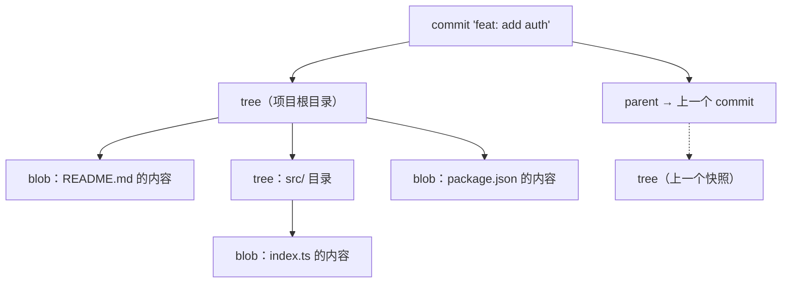
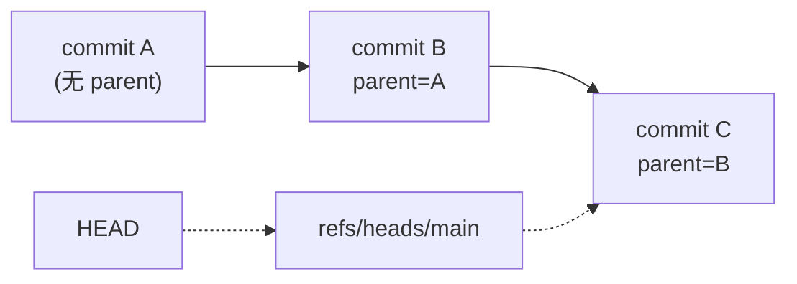

## 前置知识与学习目标

**前置知识**：会用 `git init` / `add` / `commit` 完成基本提交，知道 `.git` 目录的存在。

学完本文你应当能够：

1. 说出 Git 的四种对象（blob / tree / commit / tag）各自存什么；
2. 用 `git cat-file`、`git hash-object`、`git ls-tree` 亲手观察对象；
3. 理解「提交不是差异，而是快照」这句话在存储层面意味着什么；
4. 独立完成一次「手工构造提交」实验。

## 1. 为什么需要对象模型

初学者常把 Git 当成「记录文件修改的工具」，但 Git 本质上是一个**内容寻址的键值数据库**：你存进去任何内容，它返回一个哈希值作为钥匙；之后凭这把钥匙总能原样取出内容。

一个贴切的类比是**快递柜**：每个包裹（对象）入柜时按内容算出一个唯一柜号（SHA-1 哈希），取件时只认柜号不认人。内容哪怕差一个字节，柜号就完全不同——这就是 Git 完整性校验的根基（详见 [SHA-1 完整性校验](git/250-SHA1IntegrityCheck)）。

`git add`、`git commit`、`git branch` 这些命令，本质上都只是往这个数据库里写对象、或者移动指向对象的「引用」。理解了对象模型，后面学 reset、rebase、reflog 时就不会觉得它们是魔法。

## 2. 四种对象总览

| 对象类型   | 解决的问题 | 存储内容                          |
| :--------- | :--------- | :-------------------------------- |
| **blob**   | 文件内容   | 纯文件数据（不含文件名）          |
| **tree**   | 目录结构   | 文件名 + 权限 + 下层对象的引用    |
| **commit** | 版本快照   | 指向 tree + 父提交 + 作者等元数据 |
| **tag**    | 命名锚点   | 指向某个对象并附带签名/说明       |

四层关系如下：commit 引用一棵 tree，tree 引用 blob 和子 tree，父提交让 commit 串成链。



关键认知：**commit 保存的是整个项目的快照（引用），而不是与上一版的差异**。修改一个文件后提交，Git 只为新内容创建一个新 blob，其余文件继续共享旧 blob——这就是 Git 分支轻快、仓库去重的原因。

## 3. blob：只存内容，不存名字

### 3.1 结构与实验

每个对象在磁盘上存储前都会加一行头信息 `<类型> <字节数>\0`，再整体做 zlib 压缩。blob 的存储格式可表示为：

```text
blob <内容字节数>\0<文件内容>
```

动手验证（可在任意已有仓库执行）：

```bash
# 把一段内容写为 blob 对象，输出它的哈希
echo "hello world" | git hash-object -w --stdin
# 3b18e512dba79e4c8300dd08aeb37f8e728b8dad

# 按哈希取出内容
git cat-file -p 3b18e512dba79e4c8300dd08aeb37f8e728b8dad
# hello world

# 确认对象类型
git cat-file -t 3b18e512dba79e4c8300dd08aeb37f8e728b8dad
# blob

# 查看对象字节大小
git cat-file -s 3b18e512dba79e4c8300dd08aeb37f8e728b8dad
# 12
```

### 3.2 文件名与内容分离

blob 不包含文件名——「这个内容叫什么、放在哪个目录」是 tree 的职责。这带来一个重要特性：**相同内容只存一份**。

```bash
echo "hello" > a.txt
echo "hello" > b.txt
git add a.txt b.txt

# 两个文件名指向同一个 blob
git ls-files -s
# 100644 ce013625030ba8dba906f756967f9e9ca394464a 0	a.txt
# 100644 ce013625030ba8dba906f756967f9e9ca394464a 0	b.txt   ← 同一哈希
```

类比：快递柜里两个包裹内容一模一样时，Git 只存一个包裹，两个位置各放一张指向它的取件码。

## 4. tree：目录的对象化

### 4.1 条目格式

一个 tree 对象对应目录的「一页清单」，每个条目由权限、类型、哈希、名字组成：

```text
<mode> <type> <哈希>\t<名称>
```

```bash
# 查看当前提交对应的根 tree
git cat-file -p HEAD^{tree}
# 100644 blob a1b2c3d...  README.md
# 100644 blob e5f6a7b...  package.json
# 040000 tree c3d4e5f...  src
```

### 4.2 文件模式（mode）

| 模式     | 类型   | 说明                                    |
| :------- | :----- | :-------------------------------------- |
| `100644` | blob   | 普通文件                                |
| `100755` | blob   | 可执行文件                              |
| `120000` | blob   | 符号链接（blob 存链接目标路径）        |
| `040000` | tree   | 子目录                                  |
| `160000` | commit | gitlink，子模块指向的提交（见子模块篇） |

注意 mode 只有这几种，Git 并不完整保存 Unix 权限位——所以「文件权限丢失」不是 bug 而是设计。

## 5. commit：快照 + 血缘 + 元数据

### 5.1 真实输出解剖

```bash
git cat-file -p HEAD
# tree 9f0d1a2b3c4d5e6f708192a3b4c5d6e7f8091a2b   ← 这次的快照
# parent 1a2b3c4d5e6f708192a3b4c5d6e7f8091a2b3c   ← 上一个提交（首个提交无此行）
# author Zhang San <zhang@example.com> 1757400000 +0800
# committer Zhang San <zhang@example.com> 1757400000 +0800
#
# feat: add user authentication
```

| 字段          | 说明                                                  |
| :------------ | :---------------------------------------------------- |
| **tree**      | 指向该项目版本的根 tree                               |
| **parent**    | 父提交；合并提交会有两行 parent（第一父、第二父）    |
| **author**    | 原始作者与时间（补丁被转发重提交时保留原作者）      |
| **committer** | 实际执行提交的人与时间                                |
| **message**   | 空行之后的提交说明                                    |

时间戳是 Unix 秒数 + 时区偏移。author 与 committer 分离是给「补丁工作流」（见 [git format-patch](git/400-GitFormatPatch)）留的口子。

### 5.2 提交链与分支的本质



commit 通过 parent 形成单向链表，分支只是指向链尾的**可移动指针**（41 字节文本文件），HEAD 是指向分支的指针。指针的移动历史被 reflog 记录（见 [git reflog](git/260-GitReflog)），这也是一切「找回丢失提交」操作的原理。

## 6. tag：给对象挂名牌

轻量标签不创建对象，只是一张写着 commit 哈希的便签；附注标签（`-a`）才是第四种对象，多一层间接：

```bash
# 轻量标签：refs/tags/v1.0 直接存 commit 哈希
git tag v1.0.0

# 附注标签：创建独立 tag 对象
git tag -a v1.0.0 -m "Release version 1.0.0"
git cat-file -p v1.0.0
# object 1a2b3c4...        ← 指向的目标对象
# type commit
# tag v1.0.0
# tagger Zhang San <zhang@example.com> 1757400000 +0800
#
# Release version 1.0.0
```

tag 对象理论上可以指向任意对象（blob、tree 也行），但实践中几乎总是指向 commit。发布版优先用附注标签，因为它有独立的作者、日期和消息。

## 7. 对象如何落盘

### 7.1 松散对象与打包文件

新对象先以**松散对象**（loose object）形式存储在 `.git/objects/` 下，路径规则是「哈希前 2 位做目录 + 后 38 位做文件名」：

```bash
ls .git/objects/3b/
# 18e512dba79e4c8300dd08aeb37f8e728b8dad   ← 即 3b18e512... 的存储路径
```

时间一长松散对象会拖慢文件系统，`git gc`（或后台自动维护）把它们打包成 packfile，并用 delta 压缩进一步省空间：

```bash
git gc
ls .git/objects/pack/
# pack-0e1f2a....idx   pack-0e1f2a....pack

# 查看对象库统计
git count-objects -v
# count: 0                 ← 松散对象数
# in-pack: 27              ← 已打包对象数
# size-pack: 3             ← 包文件总大小（KB）
```

### 7.2 哈希算法的演进

传统对象哈希为 SHA-1，并带 SHA-1 对抗碰撞加固。Git 2.29 起支持实验性的 SHA-256 对象格式（`git init --object-format=sha256`），但与主流托管平台的兼容仍在推进中，日常项目暂不建议切换；涉及签名校验的细节见 [签名提交与安全实践](git/350-SignedCommitsAndSecurityPractices)。

## 8. 完整实验：手工构造一个提交

下面不借助 `git add` / `git commit`，只用底层管道命令造出一个提交，验证对象模型的真实运转。全程可复制运行：

```bash
mkdir git-lab && cd git-lab
git init

# 第 1 步：手工写入一个 blob
echo "hello git" | git hash-object -w --stdin
# 输出形如 8d0e4123...（记下这个哈希，下称 <blob>）

# 第 2 步：把 blob 以 hello.txt 之名写入暂存区（index）
git update-index --add --cacheinfo 100644,<blob>,hello.txt

# 第 3 步：把 index 的内容写成 tree 对象
git write-tree
# 输出形如 9c1d2e3f...（下称 <tree>）

# 第 4 步：基于 tree 创建 commit 对象
echo "我的第一个手工提交" | git commit-tree <tree>
# 输出形如 4a5b6c7d...（下称 <commit>）

# 第 5 步：让当前分支指向这个 commit 并同步工作区
git reset --hard <commit>

git log --oneline
# 4a5b6c7 (HEAD, main) 我的第一个手工提交
cat hello.txt
# hello git
```

这个实验说明：`git add` 是「造 blob、更新 index」，`git commit` 是「index 写成 tree、再包一层 commit」——高级命令只是底层管道的组合。

## 9. 陷阱与调试

- **想直接解压 `.git/objects` 下的文件**：那是 zlib 压缩后的二进制，`cat` 不可读；老文章里「`git cat-file <hash> | zlib-decompress`」式写法是错的（`cat-file -p` 输出的已是解压后的明文）。想看原始头信息，可用 `git cat-file --batch-check` 或专门的解压脚本，一般无需走到这一步。
- **文件改名内容不变，仓库会变大吗**：不会，内容 blob 只有一份，变化的是 tree 里的名字。
- **`git cat-file -p` 传错类型**：传 tree 哈希得到的是条目清单而非文件内容；先用 `-t` 确认类型再 `-p`。
- **以为 reset 删了对象**：reset 只是移动引用，对象仍在数据库中，直到 reflog 过期并被 gc 清理（见 [git-gc](git/420-GitGc)）。
- **文档示例哈希对不上**：哈希由内容决定，头信息含字节数与文件名所在 tree 位置，任何环境差异都会导致哈希不同；验证时以自己命令的输出为准。

## 小结

**初学者要点**

- 四种对象：blob 存内容、tree 存目录、commit 存快照、tag 存命名锚点。
- 提交是快照不是差异；相同内容全局只存一份。
- 分支是指针，commit 靠 parent 串链，一切的「历史」都从 HEAD 沿 parent 回溯。

**进阶注意**

- blob 与文件名解耦是 Git 去重和 rename 便宜检测的根源。
- mode 只存 644/755/链接/子模块四种，不要指望 Git 保存完整 Unix 权限。
- 对象一旦写入即不可变，所有「改历史」操作都是生成新对象 + 移动引用。
- gc 会把松散对象打包并做 delta 压缩，`count-objects -v` 是观察对象库的第一入口。
