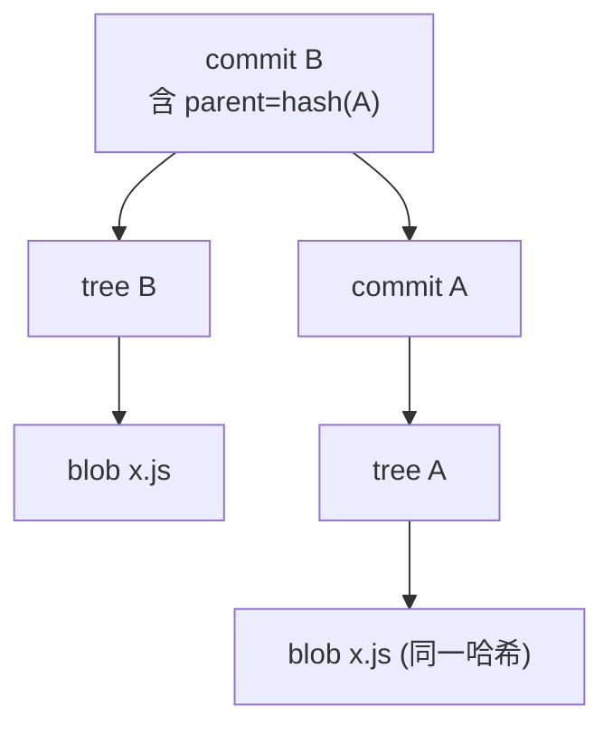

## 前置知识与学习目标

**前置知识**：了解四种 Git 对象（blob/tree/commit/tag）的基本概念。

学完本文你应当能够：

1. 解释「内容寻址」：哈希为什么既是地址又是校验码；
2. 手动复现一个 blob 的 SHA-1 计算过程；
3. 说清 Git 的防篡改链条与碰撞风险的真实量级；
4. 知道 SHA-256 仓库格式的现状。

类比先行：普通文件系统用**位置**寻址（这个文件在 C 盘哪个目录），Git 用**内容**寻址（这份数据的指纹是啥）。就像体检报告只认指纹不认名字——内容不变指纹不变，内容变一个字节指纹面目全非，谁也别想冒名顶替。

## 1. 哈希的三大职责

Git 用 SHA-1 为每个对象生成 160 位（20 字节）摘要，书写为 40 个十六进制字符。这一个值同时承担三件事：

| 职责     | 原理                                     |
| :------- | :--------------------------------------- |
| **标识** | 哈希即对象名，`.git/objects` 以它为路径  |
| **去重** | 内容相同 → 哈希相同 → 全库只存一份       |
| **校验** | 内容有任何改动 → 哈希完全不同 → 篡改必现 |

「标识即校验」是设计上的妙笔：你无法伪造一个哈希去引用被篡改的内容，因为取出来时哈希对不上，Git 直接报错。

## 2. 手动复现哈希计算

Git 对象的哈希并不是对裸内容做 SHA-1，而是先加一行头信息 `<类型> <字节数>\0`：

```text
SHA-1("blob " + 内容字节数 + "\0" + 内容)
```

动手验证（两条输出应完全一致）：

```bash
# Git 侧：计算 "hello\n" 的对象哈希
echo "hello" | git hash-object --stdin
# ce013625030ba8dba906f756967f9e9ca394464a

# 手工侧：拼出头信息后用 openssl 计算
printf "blob 6\0hello\n" | openssl sha1
# ce013625030ba8dba906f756967f9e9ca394464a
```

四种对象的头信息只有类型名不同：

| 对象    | 参与哈希的内容                        |
| :------ | :------------------------------------ |
| blob    | `"blob " + size + "\0" + 文件内容`    |
| tree    | `"tree " + size + "\0" + 目录条目`    |
| commit  | `"commit " + size + "\0" + 提交元数据`|
| tag     | `"tag " + size + "\0" + 标签元数据`   |

## 3. 防篡改的连锁结构

对象之间互相引用哈希，构成一条**哈希链**：commit 记录 tree 哈希与 parent 哈希，tree 记录 blob 哈希。



推论链条：改动任何文件 → 它的 blob 哈希变 → 引用它的 tree 哈希变 → 引用该 tree 的 commit 哈希变 → 所有后代提交的哈希全变。**想改历史而不被发现，等于要重新计算并冒充其后全部提交的哈希**——这就是「提交哈希是历史指纹」的含义。

### 3.1 校验的日常形态

```bash
git fsck                      # 全量体检对象库
# dangling blob 6c7d8e9...    ← 悬空对象（add 后未提交的残留，无害）
# missing tree ...            ← 真问题：对象缺失
# corrupt object ...          ← 真问题：对象损坏

git fsck --connectivity-only  # 只查连通性，大仓库快速版
```

fetch/pull 时对每个传输对象逐一验哈希，损坏的数据包会被整体拒收——这正是「Git 仓库极难在传输中被静默篡改」的机制基础。对象库的物理位置与打包规则见 [对象模型](git/240-ObjectModel)。

## 4. 碰撞：风险的真实量级

### 4.1 SHAttered 与 Git 的免疫逻辑

2017 年 Google 与 CWI 公布首个构造性 SHA-1 碰撞（SHAttered），但 **Git 并未因此出现实际攻击面**，原因有三层：

1. 攻击需要双方前缀相同的定制 PDF 格式；Git 对象头（`blob <size>\0`）使得任意现成碰撞对不再成立；
2. Git 自 2.13 起集成了能识别构造性碰撞的 SHA-1 实现（sha1dc），读取到碰撞对象会直接报错拒绝，而非静默接受；
3. 就算找到任意碰撞，还得让碰撞内容恰好替换进历史并让所有后代提交哈希保持一致——在哈希链下实际上不可行。

生日攻击的概率量级感受：在 2^160 的空间里，碰撞概率约为 n²/2^161。一个十亿提交（约 2^30）的仓库，碰撞概率仍在 2^100 量级分之一——「宇宙热寂之前」级别的不可能。

### 4.2 SHA-256 的演进现状

```bash
git init --object-format=sha256 sha256-lab   # 实验性创建 SHA-256 仓库
git rev-parse HEAD                            # 哈希为 64 个十六进制字符
```

Git 2.29 起支持 SHA-256 对象格式，但主流托管平台（GitHub 等）的工具链兼容尚未全面落地，跨仓库互推、签名生态也仍在过渡。日常项目维持 SHA-1 即可；关注安全签名实践见 [签名提交与安全实践](git/350-SignedCommitsAndSecurityPractices)。

## 5. 短哈希与引用

日常不需要写全 40 位，Git 支持任意长度的**唯一前缀**：

```bash
git show 8c9d0e1              # 短哈希（7-8 位在大仓库内基本唯一）
git log --abbrev-commit       # 输出自动缩写
git rev-parse --short=10 HEAD # 指定长度
git rev-parse --disambiguate=8c9d0   # 查询该前缀命中的所有对象（歧义排查）
```

前缀若命中多个对象，Git 会报 `ambiguous argument`，此时补长前缀即可。

```bash
git rev-parse HEAD            # 当前提交完整哈希
git rev-parse main feature    # 引用名 → 哈希
git show-ref                  # 全部引用及其哈希
```

## 6. 陷阱与调试

- **以为提交哈希由「文件内容」决定**：commit 哈希由 tree + parent + 作者/时间 + 消息共同决定；同一份代码两次提交（时间不同）哈希必然不同——这也是「可重现构建」场景要固定作者与时间戳的原因。
- **手工计算对不上**：`echo` 自带换行符（`\n` 占 1 字节）；换行风格（CRLF/LF）、头信息拼错都会导致哈希不同。
- **`--disambiguate` 与补长前缀搞混**：前者是「查这个前缀有哪些对象」，后者是「把前缀写长以消除歧义」。
- **看到 dangling 就慌**：悬空对象多为 add 后未提交的残留或回滚产物，通常无害，还可能是救援素材（见 [git reflog](git/260-GitReflog)）。
- **SHA-256 仓库推给老平台失败**：对象格式是仓库级属性，混用会直接报错，实验请用独立仓库。

## 短哈希长度与仓库规模

短哈希的「够用长度」取决于仓库对象数：k 位前缀有 16^k 个组合，按生日界只要仓库对象数远小于 16^(k/2) 就几乎不会歧义。

| 仓库量级（对象数） | 常用前缀 | 歧义概率 |
| :----------------- | :------- | :------- |
| < 10 万（中小项目）| 7 位     | 可忽略   |
| 百万级（大型单仓） | 8-10 位  | 偶发     |
| 超大仓库/超长周期  | 12 位    | 罕见     |

Git 的 `--abbrev-commit` 默认按当前对象数自动选择够用的长度并留余量，团队脚本不必手工定长；固定长度（`--short=10`）只在跨仓库引用、日志比对等需要稳定列宽的场景使用。

## 小结

**初学者要点**

- 哈希 = 对象的地址 + 校验码，内容由 `blob <字节数>\0` 头 + 内容共同决定。
- 改一个字节 → 整条后代提交链哈希全变，篡改无法隐藏。
- 日常用短哈希引用对象，歧义时补长即可。

**进阶注意**

- SHAttered 不构成 Git 的现实威胁：对象头、sha1dc 碰撞检测、哈希链三层防线。
- SHA-256 仓库（`init --object-format=sha256`）已可用但生态未成熟，暂作观察项。
- 复现哈希实验时留意换行符与 CRLF 配置对内容字节数的影响。
