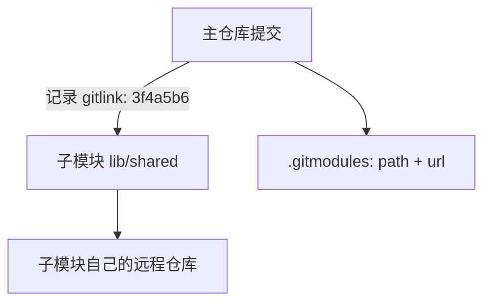

## 前置知识与学习目标

**前置知识**：远程仓库的 clone / pull / push；对分离 HEAD 有基本认识。

学完本文你应当能够：

1. 在主仓库中添加、克隆、更新、移除子模块；
2. 理解主仓库记录的是子模块的**提交指针（gitlink）**，而非「最新版本」；
3. 避开子模块最著名的三个坑：空目录、分离 HEAD、忘了先推子模块。

类比先行：子模块像**书里夹的一张可更换书签**——主仓库这本书的某一页写着「此处应插入书签 X，且指向第 N 页」（一个具体提交哈希）。书签自己是一本独立的书，内容不随主书变化，除非你换一张书签并重新标注页码。

## 1. 子模块是什么

`git submodule` 允许把一个 Git 仓库作为子目录嵌入另一个仓库，两者保持独立的历史与远程。主仓库为子目录记录的信息只有一样东西：**一个提交哈希**（在对象模型中是 tree 条目里 mode 为 `160000` 的 gitlink，见 [对象模型](git/240-ObjectModel)）。

由此得出子模块最核心的心智模型：

- 主仓库**不跟踪**子模块内部的任何文件内容；
- 主仓库记录的是「子模块此刻应停留在哪个提交」；
- 子模块的远程地址存在主仓库根部的 `.gitmodules` 文件里（因为哈希本身不含地址）。



### 1.1 何时用子模块

| 场景               | 说明                                       |
| :----------------- | :----------------------------------------- |
| 共享核心库         | 多产品引用同一协议库/组件库的精确版本      |
| 引入第三方源码     | 要随主项目一起构建、但需锁定版本           |
| 大仓拆分的过渡方案 | 子团队独立演进，主项目按提交固定集成点     |

语言生态内的依赖（npm、pip、Maven）优先走包管理器；需要「源码级、可定制、版本精确」时子模块才合适。

## 2. 添加子模块

```bash
# 在主仓库根目录执行
git submodule add https://github.com/user/shared-lib.git lib/shared
# Cloning into 'lib/shared'...

git status -s
# A  .gitmodules          ← 子模块配置（要提交）
# A  lib/shared           ← gitlink 指针（要提交）

git commit -m "feat: integrate shared-lib as submodule"
```

`.gitmodules` 是随仓库走的人类可读配置：

```ini
[submodule "lib/shared"]
	path = lib/shared
	url = https://github.com/user/shared-lib.git
	branch = main        # 可选：update --remote 时跟踪的分支
```

## 3. 克隆含子模块的仓库

**新人克隆后子模块目录是空的**——这是子模块第一名坑，因为 gitlink 只是个指针，需要额外一步把它「取回本地」：

```bash
# 方式一：克隆时递归拉取（推荐）
git clone --recurse-submodules https://github.com/user/main.git

# 方式二：事后补齐
git submodule update --init --recursive
#（等价于 submodule init 注册 + update 检出，--recursive 处理嵌套子模块）

# 方式三：让后续 pull 自动初始化与更新
git config --global submodule.recurse true
```

## 4. 更新子模块

理解两条路径的区别，就不会混淆「谁更新谁」：

```bash
# 路径 A：把子模块推进到它自己远程的最新提交（需要 .gitmodules 的 branch 配置）
cd lib/shared && git fetch && git switch main && git pull && cd -
git add lib/shared                 # 主仓库的指针前移
git commit -m "chore: bump shared-lib to 3f4a5b6"

# 路径 A 的快捷形式
git submodule update --remote lib/shared
git add lib/shared && git commit -m "chore: bump shared-lib"

# 路径 B：别人前移了指针，你把本地子模块对齐到主仓库记录的提交
git pull                           # 先拿到主仓库的新指针
git submodule update --init --recursive
```

要点：`submodule update --remote` 是「追上游最新」，裸 `submodule update` 是「对齐主仓库锁定版本」；团队日常用得最多的是路径 B。

## 5. 协作三坑与规避

### 5.1 分离 HEAD

`submodule update` 检出的是具体提交，子模块因此处于分离 HEAD。直接在子模块里改代码再提交，提交不会挂在任何分支上，切走就丢：

```bash
cd lib/shared
git switch main        # 先附着到分支再开发（或 switch -c 新分支）
# ...提交...
git switch main && git merge <你的提交>
```

### 5.2 忘了先推子模块

主仓库提交了「指向子模块新提交」的指针，但子模块的新提交还只在你本地——同事拉取后 `submodule update` 会报 `fatal: remote error` 找不到对象。规范顺序是**先推子模块，再推主仓库**；也可以让 Git 代查：

```bash
git push --recurse-submodules=check      # 子模块未推送则拒绝
git push --recurse-submodules=on-demand  # 自动先推送子模块
# 可设为默认：git config push.recurseSubmodules check
```

### 5.3 状态噪音与脏子模块

子模块内部有未提交改动时，主仓库 status 会显示 `(modified content)` / `(new commits)`：

```bash
git status                                  # 看到子模块脏状态
git diff --submodule=log                    # 详细显示指针变化
git config submodule.lib/shared.ignore dirty   # 本地忽略脏改动（按需）
git submodule update --force                # 放弃子模块本地改动，对齐指针
```

### 5.4 移除子模块

```bash
git submodule deinit -f lib/shared           # 1) 取消注册（清工作区与 .git/config）
git rm -f lib/shared                         # 2) 删除 gitlink 与 .gitmodules 条目
rm -rf .git/modules/lib/shared               # 3) 清理主仓库存储的子模块对象库
git commit -m "chore: remove shared-lib submodule"
```

## 6. 合并中的子模块冲突

合并时若两条分支把指针移到了不同提交，冲突体现在 gitlink 上（没有文本冲突标记）：

```bash
git checkout --ours lib/shared    # 采用己方指针
# 或
git checkout --theirs lib/shared  # 采用对方指针
git add lib/shared
git commit                        # 完成合并
# 需要第三种选择时：手动 cd 进子模块切换到目标提交，再 git add
```

## 7. 替代方案：git subtree

subtree 把子仓库的内容**真实拷贝进**主仓库历史，对使用者完全透明（克隆后无需任何初始化），代价是主仓库历史膨胀、双向同步命令繁琐：

```bash
# 引入（--squash 只压入一条摘要提交，避免灌入全部历史）
git subtree add --prefix=lib/shared https://github.com/user/shared-lib.git main --squash

# 拉取上游更新
git subtree pull --prefix=lib/shared https://github.com/user/shared-lib.git main --squash

# 把本地对 lib/shared 的改动推回上游仓库
git subtree push --prefix=lib/shared https://github.com/user/shared-lib.git main
```

选型速记：**依赖方少、要锁版本、接受两段式流程 → submodule；想让仓库自成一体、依赖改动以主项目为主 → subtree；纯库依赖 → 包管理器。**

## 小结

**初学者要点**

- 子模块 = 主仓库记一个「子仓库的提交指针」+ 一份地址配置。
- 克隆带子模块的仓库必须 `--recurse-submodules` 或 `submodule update --init --recursive`，否则只有空目录。
- 更新分两个方向：追上游最新（`--remote`）与对齐主仓库锁定版本（裸 `update`）。

**进阶注意**

- gitlink 是 tree 中 mode 160000 的条目，主仓库从不感知子模块内部文件。
- 推送顺序「先子后主」可用 `push.recurseSubmodules=check` 强制；分离 HEAD 下先建分支再开发。
- 合并冲突发生在指针上，用 `--ours/--theirs` 或手动进子模块选定提交。
- subtree 是「内容内联」的替代品，透明但历史更重；语法速查见上方命令。
