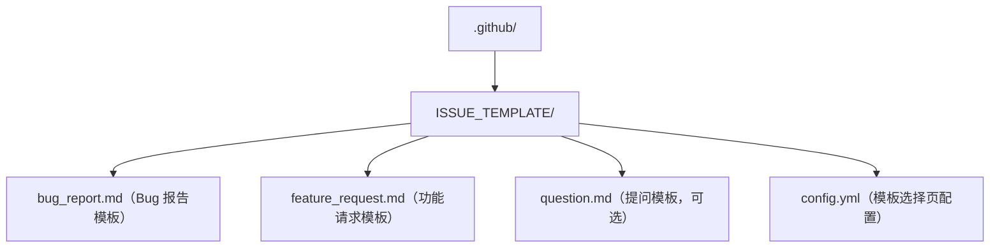

## 0. 从一个生活场景说起：意见箱与工单系统

想象一家公司在大堂放了一个**意见箱**：起初大家随手写纸条，内容五花八门——有吐槽、有报障、有提建议，字迹潦草、信息不全，客服根本没法处理。后来公司升级成**工单系统**：每张工单必须填"问题类型、紧急程度、复现步骤、期望结果"；系统给工单打上**分类标签**（故障/建议/行政），并按**月度目标**统计解决进度。公司顿时高效起来。

GitHub 的 **Issues** 就是这套"工单系统"：**Issue 模板** 统一填写格式，**Labels（标签）** 分类筛选，**Milestones（里程碑）** 聚合进度。本篇采用**清单驱动**的结构，以"可照做的清单"为主线，教你搭好这套问题跟踪体系。

## 1. 原理讲解：Issue 体系三件套

| 组件 | 生活类比 | 作用 |
| :--- | :--- | :--- |
| Issue 模板 | 工单格式 | 让报告者按标准填写，信息完整可处理 |
| Labels | 分类标签 | 一眼看清类型、优先级、状态 |
| Milestones | 月度目标 | 聚合一批 Issue，跟踪版本/迭代进度 |

三者配合：**模板保证"输入规范"，标签保证"分类清晰"，里程碑保证"目标可见"**。

## 2. 清单一：Issue 模板配置

### 2.1 目录结构清单

在仓库创建 `.github/ISSUE_TEMPLATE/` 目录，放入模板文件：



### 2.2 Bug 报告模板（可直接使用）

每个模板文件开头用 YAML frontmatter 声明元数据，后面是 Markdown 正文：

```markdown
---
name: Bug 报告
about: 报告可复现的缺陷
title: "[BUG] "
labels: bug
assignees: ''
---

## 环境信息
- 操作系统：
- 浏览器/版本：
- 应用版本：

## 复现步骤
1.
2.
3.

## 期望行为
（描述你期望的结果）

## 实际行为
（描述实际发生的情况）

## 截图
（如有，请附截图）

## 额外信息
```

### 2.3 功能请求模板（可直接使用）

```markdown
---
name: 功能请求
about: 建议新功能
title: "[FEATURE] "
labels: enhancement
assignees: ''
---

## 功能描述
（简要描述希望添加的功能）

## 问题背景
（解释为什么需要这个功能，它解决什么问题）

## 实现建议
（描述希望如何实现）

## 额外信息
```

### 2.4 模板选择页配置（config.yml）

```yaml
blank_issues_enabled: false
contact_links:
  - name: 社区讨论
    url: https://github.com/org/repo/discussions
    about: 一般问题请到讨论区提问
  - name: 官方文档
    url: https://docs.example.com
    about: 先查文档，避免重复提问
```

> 设置 `blank_issues_enabled: false` 后，用户必须从模板中选择一种创建 Issue，空模板被禁用。

## 3. 清单二：标签体系（Labels）

### 3.1 建议标签分类清单

| 分类 | 标签示例 | 用途 |
| :--- | :--- | :--- |
| 类型 | `bug`、`enhancement`、`documentation`、`question` | 这是什么问题 |
| 优先级 | `priority:high`、`priority:medium`、`priority:low` | 多紧急 |
| 状态 | `needs-triage`、`in-progress`、`review-needed` | 处理到哪一步 |
| 难度 | `good-first-issue`、`help-wanted` | 适合谁来做 |
| 模块 | `frontend`、`backend`、`api`、`database` | 涉及哪个模块 |

> `good first issue` 是 GitHub 官方推荐的引导新手标签：标了它，新手可以在仓库的 "Good first issues" 筛选器里找到合适任务，开源项目常用它培养贡献者。

### 3.2 标签使用规范清单

- **命名**：小写字母 + 连字符，如 `good-first-issue`。
- **颜色**：同类标签用相似颜色（优先级用红/黄/绿渐变）。
- **数量**：控制在 20-30 个以内，避免膨胀。
- **描述**：每个标签配一句用途说明，避免歧义。
- **统一**：组织内统一命名规范，跨仓库通用。

### 3.3 命令行管理标签

```bash
# 列出标签
gh label list
# 创建标签
gh label create bug --description "代码缺陷" --color d73a4a
# 修改标签
gh label edit bug --description "可复现的缺陷" --color d73a4a
# 删除标签
gh label delete bug --yes
```

## 4. 清单三：里程碑（Milestones）

### 4.1 创建里程碑清单

1. 仓库 **Issues → Milestones** → **New milestone**。
2. 填写**标题**（建议版本号或迭代名，如 `v1.0.0`、`Sprint 12`）、**描述**、**截止日期**。
3. 创建后把相关 Issue/PR 关联到里程碑（在 Issue 右侧栏选择）。

### 4.2 使用里程碑的收益

- 里程碑页面自动显示**完成百分比**（已关闭 / 总数）。
- 接近截止日期时高亮提醒，便于规划。
- 同一里程碑内的 Issue 聚合到一次发布中，发布后统一验证关闭。

### 4.3 里程碑规划建议

- 一个里程碑装 **10-20 个** Issue 比较合理，避免"过大无法交付"或"过小没有意义"。
- 每个里程碑有明确**目标与交付物**，拒绝把无关任务塞进来。
- 定期检查进度，发现无法按时完成时及时裁剪范围或调整日期。

### 4.4 Issue 撰写与维护最佳实践清单

无论用不用模板，以下习惯都能提升 Issue 的可处理性：

- **搜索先于创建**：开新 Issue 前先搜仓库，避免重复工单；重复的直接链接到旧 Issue 并关闭。
- **标题即结论**：用"现象一句话"做标题，如 `[BUG] 登录页在 Safari 下表单无法提交`，而不是"求助"。
- **描述五要素**：环境 / 复现步骤 / 期望行为 / 实际行为 / 截图（Bug 类必填）。
- **善用 Markdown**：用任务列表 `- [ ]` 拆分子任务，用 `@mention` 通知负责人，用 `#123` 交叉引用关联 Issue。
- **及时更新状态**：解决后关闭并简要说明"在 #PR 中修复"；长期搁置的 Issue 定期 triage（分类处理）。

## 5. 清单四：自动化与衔接

### 5.1 自动关闭 Issue 关键词

在 **commit message 或 PR 描述**中写入以下关键词，合并 PR 时会自动关闭对应 Issue：

- `Fixes #123`
- `Closes #123`
- `Resolves #123`
- `Closes #123, #456`（同时关闭多个）

> 注意：只有 PR 合并到**默认分支**时才会触发自动关闭；fork 仓库需使用跨仓库引用格式。

### 5.2 GitHub Actions 自动打标签

```yaml
name: Label issues
on:
  issues:
    types: [opened]
jobs:
  label:
    runs-on: ubuntu-latest
    permissions:
      issues: write
    steps:
      - uses: actions/labeler@v5
        with:
          repo-token: ${{ secrets.GITHUB_TOKEN }}
          configuration-path: .github/labeler.yml
```

配合 `.github/labeler.yml` 按路径/标题关键词自动分配标签。

### 5.3 自动分配 Issue

```yaml
name: Auto assign
on:
  issues:
    types: [opened]
jobs:
  assign:
    runs-on: ubuntu-latest
    permissions:
      issues: write
    steps:
      - uses: pozil/auto-assign-issue@v2
        with:
          assignees: dev-team
          numOfAssignee: 1
```

### 5.4 与项目板（Projects）衔接

把 Issue 拖入项目板（To Do / In Progress / Review / Done 列），通过移动卡片更新状态，看板即"工单流转墙"——新工单进 To Do，认领后进 In Progress，修复合并后进 Done 并自动关闭。

### 5.5 安全漏洞上报：Security advisories

**不要在公开 Issue 中报告安全漏洞**——漏洞细节一旦公开，等于给攻击者递刀。正确做法：

1. 在仓库创建 `SECURITY.md`，说明漏洞上报渠道（建议用"私密漏洞报告"功能，见 019/018 篇）。
2. 维护者通过 **Security → Security advisories** 创建私有通告，与报告者私密沟通细节。
3. 修复发布后，再选择公开通告并登记 CVE 编号。

## 6. 常见错误与对策

| 常见错误 | 报错/现象 | 原因 | 解决办法 |
| :--- | :--- | :--- | :--- |
| 模板不显示 | 新建 Issue 时没有模板选项 | 模板路径错误或 YAML frontmatter 语法错误 | 确认文件在 `.github/ISSUE_TEMPLATE/` 下；检查 `---` 块格式；确认仓库启用了 Issues 功能 |
| 空模板无法禁用 | 用户仍可开空白 Issue | config.yml 未配置或格式错误 | 配置 `blank_issues_enabled: false` 并推送到默认分支 |
| 自动关闭不生效 | 合并后 Issue 仍开着 | 关键词未写进 PR 描述/提交信息；PR 未合并到默认分支 | 在 PR 描述写 `Closes #123`；确认合并到默认分支 |
| 标签过多难管理 | 标签列表失控 | 无规范随意创建 | 清理合并相似标签；按第 3.2 节规范统一命名 |
| 里程碑进度不准 | 完成百分比与实情不符 | 部分 Issue 未关联里程碑或状态未更新 | 把所有相关 Issue 关联到里程碑；及时关闭已解决的 Issue |
| Actions 自动化失败 | 打标签/分配任务工作流报错 | GITHUB_TOKEN 权限不足或 workflow 语法错误 | 检查 `permissions` 字段；查看 Actions 日志定位语法问题 |

## 8. 一句话记忆

**Issue 是"工单"，模板保证工单填得全，标签让工单分得清，里程碑让目标看得见，Actions 让流转自动化——四件套齐了，问题跟踪不再靠吼。**

### 延伸阅读

- gh CLI 管理 Issue 与标签的命令速查，见 048 篇《Gh Issue 管理》与 056 篇《Gh Label》。
- 项目看板（Projects）使用，见 012 篇《Projects 看板》。
- 社区健康文件（CONTRIBUTING 等），见 026 篇《社区健康文件》。
- 安全漏洞上报（Security advisories），见 019/018 篇。
