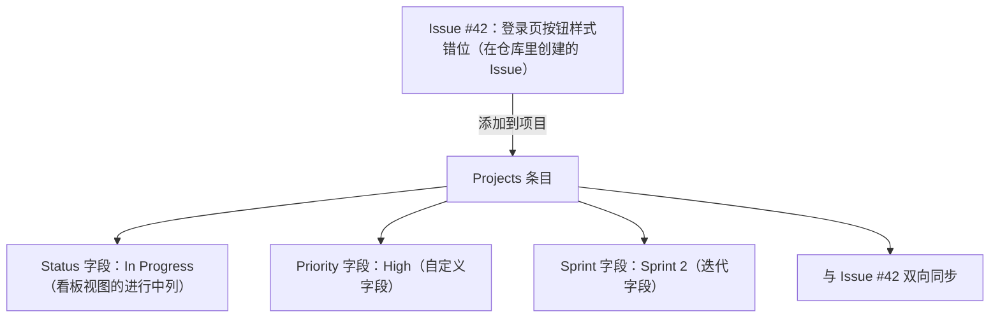

## 0. 从一块白板说起：Projects 就是团队的"项目白板 + 便利贴墙"

想象你们小组要办一场校园编程马拉松。没有电脑辅助的年代，大家会怎么管这件事？

教室墙上挂一块大白板，画上几列：**待办 → 进行中 → 待验收 → 完成**。然后每个人把任务写在便利贴上，往相应列一贴。谁认领了任务，就把自己的便利贴拖到"进行中"；做完一张，撕下来贴到"完成"列。白板旁边还贴着截止日期、负责人、优先级小标记。

这块白板解决的核心问题只有一个：**让所有人在一眼之间看清"现在做到哪了、接下来做什么"**。

GitHub Projects（项目）就是这块白板的数字化升级版，而便利贴变成了 **Issue（议题）和 Pull Request（拉取请求）**。它不仅保留了"拖拽便利贴"的直观体验，还多了几个实体白板做不到的能力：数据自动同步、多维视图切换、统计图表、自动化流转。

本文就沿着"白板"这条线索，把 Projects 讲透。

## 1. 直观理解：Projects 是什么

### 1.1 一个项目长什么样

Projects 是 GitHub 内置的项目管理工具。它的核心是一张可定制的"大表"（背后是数据），但提供三种看它的"视角"（视图）：

| 视图 | 长相 | 对应白板类比 | 适合场景 |
| :--- | :--- | :--- | :--- |
| **表格（Table）** | 像 Excel，每行一条任务，每列一个属性 | 白板旁边那张"任务登记表" | 批量编辑、筛选、排序 |
| **看板（Board）** | 按"状态"分列的卡片墙 | 教室白板本体 | 日常拖拽流转 |
| **时间线（Roadmap/Timeline）** | 按日期排的横条图 | 墙上贴的甘特图 | 规划里程碑、汇报进度 |

三者看的是**同一批数据**，只是展示方式不同。这就好比同一份班级名单，既可以按身高排队，也可以按学号排队，还可以画成座位表——人还是那些人。

### 1.2 它能管理什么

Projects 里的"便利贴"有三种来源：

- **Issue**：任务、Bug、功能请求（最常用）；
- **Pull Request**：代码改动；
- **草稿条目（Draft）**：还没转成 Issue 的临时想法，直接在白板上写，比如"下一步要调研 X 方案"。

## 2. 原理讲解：数据为什么是"活"的

### 2.1 先直观理解

普通便利贴墙的最大痛点：便利贴上的字和实际工作**不同步**。代码里 Bug 修好了，白板上还贴着"进行中"；任务改了负责人，白板没更新。

Projects 用"**双向同步**"解决了这个问题。

### 2.2 再讲原理

当你把某个 Issue 添加到 Project 后，两者之间就建立了**直接引用关系**（官方文档称 projects 由你添加的 Issue 和 PR 构建，信息在变更时自动同步到视图和图表中）：

- **Issue → 项目**：Issue 被关闭时，如果项目配置了内置工作流，卡片状态自动变为"完成"；
- **项目 → Issue**：你在项目表格里改了负责人、里程碑，Issue 页面上同步生效；
- **拖拽即修改**：在看板视图把卡片从"进行中"拖到"待验收"，本质上是修改了该条目的"Status 字段"，数据层完全一致。

这种"一处修改、处处生效"的机制，是 Projects 与静态表格的本质区别。

### 2.3 最后看示例



## 3. 操作示例：从创建到投入使用

### 3.1 创建项目

**组织项目**（适合团队）：进入组织主页 → 点顶部 **Projects** 标签 → **New project** → 选择模板（内置模板有"Bug 追踪""团队待办"等）或从空白开始选 Table/Board/Roadmap 布局。

**用户/仓库项目**（适合个人）：个人主页或仓库页面 → **Projects** → **New project**。仓库项目会自动关联当前仓库。

### 3.2 添加条目

```text
方法一：在项目页点 "+" → 搜索仓库里的 Issue / PR 添加
方法二：打开 Issue 页面 → 右侧边栏 "Projects" 选择项目
方法三：在项目里直接创建草稿条目（Draft）
```

### 3.3 配置自定义字段（白板上的"便利贴属性"）

新建项目后，项目自带一个 `Status` 单选字段（Backlog → Todo → In Progress → In Review → Done 等默认选项）。团队通常还要加这些字段：

| 字段类型 | 用途示例 | 白板类比 |
| :--- | :--- | :--- |
| **Single select（单选）** | 状态、优先级（Critical/High/Medium/Low）、类型（Bug/Feature/Docs） | 便利贴颜色 |
| **Iteration（迭代）** | Sprint 1 / Sprint 2，支持设置休假期 | 白板上的周计划表 |
| **Number（数字）** | 工作量估算（1/2/3/5/8/13） | 便利贴角落的工时 |
| **Date（日期）** | 截止日期、目标发布日期 | 便利贴上的截止日 |
| **Text（文本）** | 备注、验收标准 | 便利贴背面小字 |
| **Milestone / Assignee** | 内置字段，直接引用 | 便利贴上的负责人签名 |

官方文档说明：单个项目最多可添加 **50 个字段**，字段配置一次，团队所有人共享。

## 4. 三种视图的切换与配置

### 4.1 表格视图

适合批量操作：每行一个条目，点击单元格即可修改字段，支持按任意列排序、筛选（如只看 `Sprint 2` 且 `Priority: High`）、按字段分组。

```text
| Title              | Status      | Priority | Sprint   | Assignee |
| :----------------- | :---------- | :------- | :------- | :------- |
| 登录页按钮错位     | In Progress | High     | Sprint 2 | 张三     |
| API 限流文档       | Done        | Medium   | Sprint 1 | 李四     |
| 性能监控告警       | Todo        | Low      | Sprint 3 | 王五     |
```

### 4.2 看板视图

按"分组依据"（默认按 Status）分列，卡片可拖拽。想按负责人分组？把分组依据改成 Assignee 即可。拖拽卡片换组 = 修改字段值，这是看板最顺手的地方。

### 4.3 时间线（Roadmap）视图

把时间轴设为日期字段（如截止日期），每个条目变成一根横条，用于向团队和管理层展示里程碑进度。官方快速入门中，常用它"规划迭代、向协作者传达优先级和进度"。

### 4.4 视图保存

每个视图可以命名保存（如"我的待办""本轮迭代"），团队成员可以共享视图，也可以建个人私有视图。同一条数据，多种看法，互不干扰。

## 5. 自动化：让白板自己动起来

### 5.1 内置工作流（Built-in workflows）

这是 Projects 最有价值的能力之一。配置路径：项目 → 顶部 **Workflows** → **Configure**。常用规则：

| 触发条件 | 自动执行 | 白板类比 |
| :--- | :--- | :--- |
| Issue 刚添加时 | 设置状态为 Todo | 新便利贴自动贴到"待办"列 |
| 对应的 PR 标记为 Ready for review | 状态改为 In Review | 有人喊"我做好了"，卡片自己挪过去 |
| Issue / PR 被关闭（或 PR 合并） | 状态改为 Done | 任务做完，便利贴自动撕到"完成" |
| 条目被重新打开 | 状态改回 Todo | 复活的任务自己回到待办列 |

### 5.2 用 GitHub Actions 做更复杂的自动化

内置工作流不够用时，可以用 Actions。经典场景：**给打上指定标签的 Issue 自动加入项目**。

```yaml
# .github/workflows/add-to-project.yml
name: Add issues to project
on:
  issues:
    types: [opened, labeled]        # Issue 新建或被打标签时触发
jobs:
  add-to-project:
    runs-on: ubuntu-latest
    steps:
      - uses: actions/add-to-project@v1.0.2
        with:
          project-url: https://github.com/orgs/your-org/projects/1
          github-token: ${{ secrets.PROJECT_TOKEN }}
          labeled: bug, feature      # 只有带这些标签的 Issue 才加入
```

注意：`actions/add-to-project` 需要一个人格化令牌（PAT）或细粒度令牌，权限至少包含读写项目。

### 5.3 用 GraphQL API 自动化（进阶）

```graphql
mutation {
  addProjectV2ItemById(input: {
    projectId: "PVT_xxxxxx",      # 项目 ID
    contentId: "I_xxxxxx"         # Issue ID
  }) {
    item { id }
  }
}
```

## 6. 洞察图表（Insights）：白板的"数据看板"

项目 → **Insights** 标签可以基于项目数据生成图表，所有有项目查看权限的人都能看到。两类图表：

- **当前图表（Current charts）**：快照式统计，比如"每个成员名下有多少条目""每个迭代分配了多少问题""按标签分布"；
- **历史图表（Historical charts）**：随时间变化，比如默认的 **Burn up（燃尽）图**，展示"已完成工作 vs 剩余工作"随时间的变化，用来发现瓶颈、预测进度。

官方提示：洞察**不追踪已归档或删除的条目**，所以想保留历史统计，别急着归档。

## 7. 常见错误与对策表

| 常见错误 | 现象/报错 | 原因 | 解决办法 |
| :--- | :--- | :--- | :--- |
| 找不到新建项目入口 | 页面没有 New project 按钮 | 权限不足或无组织归属 | 组织项目需组织成员身份；个人项目在个人主页 Projects 下创建 |
| 添加条目时搜索不到 Issue | 列表为空 | 项目权限未包含该仓库 | 在项目设置中添加仓库，或确认仓库归属 |
| 改了 Issue 状态但项目没变 | 卡片状态不变 | 未配置内置工作流 | 项目 → Workflows → 开启"关闭时设为完成"等规则 |
| 拖拽换列没生效 | 卡片弹回原列 | 分组的字段不是 Status | 确认看板按 Status 分组，拖拽本质是改字段值 |
| Actions 自动化失败 | `Resource not accessible by integration` | 令牌权限不够 | 使用带 `read:project`/`write:project` 的 PAT，存在仓库 Secrets 中 |
| 多人看到的视图不一致 | 各自字段不同 | 改了私有视图而非共享视图 | 保存视图时选择"保存到共享视图"（团队需要时可复制） |
| 图表数据对不上 | Insights 缺条目 | 洞察不含已归档/已删除条目 | 统计期内不要归档条目，或使用筛选修正口径 |

## 9. 一句话记忆

**Projects 就是把团队白板搬进 GitHub：Issue 和 PR 是便利贴，表格/看板/时间线是三种看法，自定义字段是便利贴上的属性，内置工作流让便利贴自动流转——所有数据双向同步，一处改动处处生效。**

### 延伸阅读（站内文档）

- Issue 模板、标签与里程碑，见 004-github 模块《Issues模板-标签与里程碑》。
- GitHub Actions 触发方式，见 004-github 模块《Actions触发》。
- 社区讨论与需求收集，见 004-github 模块《Discussions》。
- 用 GraphQL 操作项目，见 004-github 模块《REST与GraphQL-API》。
