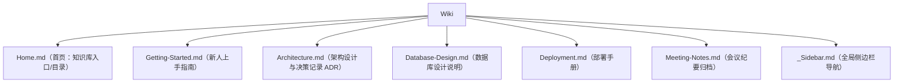

## 0. 从一个场景说起：团队知识都去哪了

你的社团要做一个校园二手交易平台，10 个人分了三组：前端、后端、测试。三个月过去了，你发现一个可怕的现象：

- 后端组长离职，他脑子里那套"数据库怎么设计的、为什么这么设计"的决策理由，随着他的离开一起消失了；
- 新人小周接手前端，只能靠翻聊天记录和问人，同一个问题被问了五遍；
- 项目验收时，评审问"你们的接口文档在哪"，全组面面相觑——散落在三份不同的共享文档里，版本还对不上。

这就是**知识沉淀缺失**的典型症状：知识只存在于个别人的脑子里和聊天记录里，项目越做越大，知识越散越碎。

GitHub 仓库自带一个解决这个问题的"知识库"区域——**Wiki（维基）**。本文围绕"团队知识沉淀"这个场景，讲解 Wiki 怎么用、怎么组织、怎么长期维护。

## 1. 场景判断：什么时候该用 Wiki

### 1.1 先直观理解

Wiki 是每个 GitHub 仓库自带的文档托管区域，适合放**长篇幅、多页面、需要持续积累**的文档。它的定位一句话可以概括：**README 讲"是什么"，Wiki 讲"怎么做、为什么这么设计"**。

### 1.2 再对照场景

| 内容类型 | 放哪 | 场景举例 |
| :--- | :--- | :--- |
| 项目一句话介绍、快速开始 | README | "这是什么、怎么跑起来" |
| 使用教程、设计文档、架构说明 | Wiki | "数据库为什么这么设计""部署手册" |
| API 自动生成的参考文档 | docs 目录 + 工具生成 | 类型定义、接口签名 |
| 讨论与问答 | Discussions / Issues | "这个功能该不该做""我遇到了 Bug" |

具体来说，出现以下情况之一，就该考虑开 Wiki 了：

- 新成员加入时，需要一份"从零到能干活"的文档；
- 团队经常重复解释同一个问题；
- 设计决策（为什么用这个方案而不是另一个）无处记录；
- 文档超过 5 个页面，README 已经塞不下。

### 1.3 最后看示例



## 2. 启用与权限配置

### 2.1 启用 Wiki

仓库默认开启了 Wiki 功能。如果没看到 **Wiki** 标签页：

1. 进入仓库 **Settings（设置）**；
2. 找到 **Features（功能）** 区，勾选 **Wikis**；
3. 回到仓库主页，顶部就会出现 Wiki 标签，访问地址为 `https://github.com/你的用户名/仓库名/wiki`。

### 2.2 权限设置

在 Settings → Features → Wiki 下方可以设置谁能编辑：

| 选项 | 说明 | 适用场景 |
| :--- | :--- | :--- |
| **Restrict editing to collaborators only（仅协作者可编辑）** | 只有有写权限的人能改 Wiki | 团队内部文档、私有仓库 |
| **Anyone on GitHub can edit（任何人都可编辑）** | 公开仓库中所有人都能贡献 | 开源项目文档众包 |

提示：如果希望搜索引擎收录 Wiki 内容，GitHub 官方说明——**只有配置为"禁止公开编辑"且星标数达到 500 的公开仓库 Wiki 才会被搜索引擎索引**。普通 Wiki 内容对搜索并不友好，需要被收录的内容建议用 GitHub Pages 发布。

## 3. 创建和组织 Wiki 页面

### 3.1 创建首页

第一次进入 Wiki 页，点击 **Create the first page（创建第一页）**。首页默认文件名是 `Home.md`。建议首页就做"入口"：一段简短介绍 + 指向各页面的链接树。

### 3.2 添加新页面

1. Wiki 页面右上角点 **New Page（新建页面）**；
2. 标题栏输入页面标题（标题会成为文件名，如 `Getting-Started` → `Getting-Started.md`）；
3. 编辑模式默认是 Markdown，也可以从下拉框切换为其他格式（如 Textile、Asciidoc）；
4. 填写"编辑消息"（类似提交信息），点击 **Save Page** 保存。

### 3.3 页面间链接

Wiki 里链接其他页面，推荐用双括号语法，渲染后自动生成链接：

```markdown
了解更多请访问 [[架构设计]] 和 [[部署手册]]。
```

### 3.4 侧边栏（_Sidebar.md）

侧边栏显示在 Wiki 所有页面右侧，是全局导航。创建方法：Wiki 主页 → **Add a custom sidebar（添加自定义侧边栏）**，编辑 `_Sidebar.md`：

```markdown
**文档导航**

- [[Home|首页]]
- [[Getting-Started|新人上手]]
- [[Architecture|架构设计]]
  - [[Frontend-Design|前端设计]]
  - [[Backend-Design|后端设计]]
- [[Deployment|部署手册]]
- [[FAQ|常见问题]]
```

### 3.5 页脚（_Footer.md）

页脚显示在每个页面底部，适合放版权、更新说明、反馈入口。创建方法与侧边栏类似（**Add a custom footer**）：

```markdown
---

文档最后更新于 2026-08-02
发现错误？请提交 [Issue](../../issues) 或直接编辑本页。
```

## 4. 本地编辑：Wiki 其实是个 Git 仓库

### 4.1 原理

Wiki 页面支持在网页上直接编辑，但它的底层是一个**独立的 Git 仓库**（和你项目的主仓库分开）。这意味着你可以像管理代码一样管理文档：克隆、分支、提交、推送。

### 4.2 克隆 Wiki

```bash
# 克隆格式：仓库名后加 .wiki.git
git clone https://github.com/你的用户名/你的仓库.wiki.git
cd 你的仓库.wiki

# 目录结构示例
# Home.md            ← 首页
# _Sidebar.md        ← 侧边栏
# _Footer.md         ← 页脚
# Getting-Started.md ← 自定义页面
```

### 4.3 本地编辑并推送

```bash
# 修改页面
vim Deployment.md

# 提交并推送（注意分支通常是 master）
git add .
git commit -m "docs: 更新部署手册，补充回滚步骤"
git push origin master
```

### 4.4 命名注意事项（官方明确提醒）

- 文件名就是页面标题，扩展名决定渲染方式：`foo.md` / `foo.markdown` 用 Markdown 渲染，`foo.textile` 用 Textile；
- **页面标题中不要使用这些字符**：`\ / : * ? " < > |`，否则部分操作系统的用户无法正常处理文件名；
- 多人协作时可以建分支，但**只有推送到默认分支的修改才会生效展示**。

## 5. 维护最佳实践：让知识库"活"下去

Wiki 最大的敌人是"写完就忘"。以下实践能让文档持续更新：

- **首页当目录**：首页只做导航，不堆正文，所有知识按主题拆页；
- **统一侧边栏**：用 `_Sidebar.md` 维持全局导航，新增页面后及时登记；
- **文档随代码走**：接口变了，当天就更新对应页面，约定"改代码的人负责改文档"；
- **记录决策**：架构选型、方案权衡写进"决策记录（ADR）"页面，格式固定为"背景→方案→理由→代价"；
- **定期体检**：每轮迭代结束，安排 30 分钟清理过期页面、合并重复内容；
- **明确权限**：团队内部仓库一律"仅协作者可编辑"，避免内容被误改。

## 6. 常见错误与对策表

| 常见错误 | 现象/报错 | 原因 | 解决办法 |
| :--- | :--- | :--- | :--- |
| 找不到 Wiki 标签 | 仓库顶部没有 Wiki 页签 | 功能被关闭 | Settings → Features → 勾选 Wikis |
| 页面标题含特殊字符 | 克隆后部分文件无法检出 | 标题含 `\ / : * ? " < > \|` | 去掉这些字符再重命名页面 |
| 本地改了不生效 | 网页上还是旧内容 | 推到了非默认分支 | 确认推送目标是默认分支（master/main） |
| 链接 404 | 双括号链接点开是空页 | 目标页面尚未创建 | 先创建目标页面，再检查文件名大小写 |
| 内容不显示 | 一片空白或渲染异常 | 扩展名与内容格式不匹配 | 内容用 Markdown 就存为 `.md`，并检查语法 |
| 文档与代码脱节 | 页面内容过时 | 没有维护机制 | 采用"改代码者同步改文档"约定 + 定期体检 |
| Wiki 太多页打不开 | 部分页面访问缓慢 | 官方对 Wiki 有软限制（约 5000 个文件） | 超过规模改用 GitHub Pages 或 docs 目录 |

## 8. 一句话记忆

**Wiki 是仓库自带的"项目百科"：README 讲是什么，Wiki 讲怎么做和为什么这么设计；用首页做目录、侧边栏做导航、页脚做版权与反馈，把它当独立 Git 仓库来维护，知识才能持续沉淀。**

### 延伸阅读（站内文档）

- README 与 Wiki 的分工，见 004-github 模块《README文件》。
- 从 Issue 到 PR 的协作流程，见 004-github 模块《PullRequest完整协作流程》。
- 社区问答与公告，见 004-github 模块《Discussions》。
- 用 GitHub Pages 发布可被搜索引擎收录的文档站，见 004-github 模块《GitHubPages多站点方案》。
