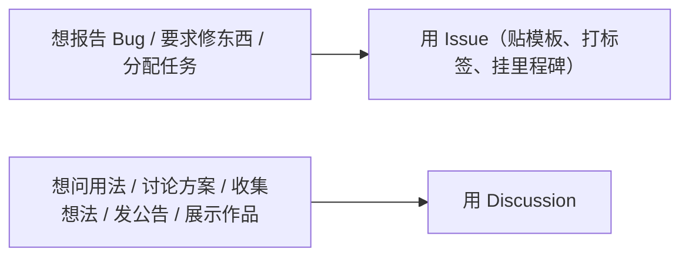
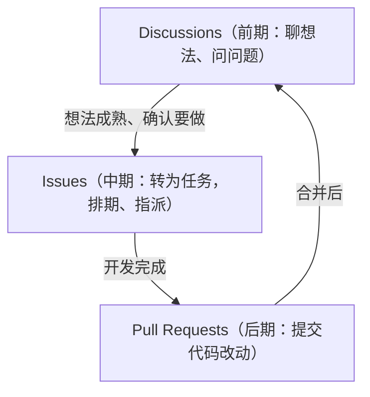

## 0. 从一个困惑说起：我该用 Issue 还是 Discussion？

你第一次参与开源项目，想问一个问题："这个项目支持 Windows 吗？"你打开仓库，看到两个入口：**Issues（议题）** 和 **Discussions（讨论）**。

你犹豫了：这俩有什么区别？问问题到底该点哪个？填错了会不会被维护者嫌弃？

这个困惑，几乎所有 GitHub 新手都经历过。要回答它，先看一个生活类比：

- **Issue 像"保修单/工单系统"**：你买了冰箱坏了，填一张保修单，注明故障现象，厂家会安排人处理，处理完这张单子就结案归档，有编号可追踪；
- **Discussions 像"社区论坛/商品评论区"**：大家在论坛里聊"这个牌子的冰箱怎么样""怎么保养能延长寿命"，没有结案一说，谁都可以加入，好的回答会被点赞顶到最上面。

它们的本质区别：**Issue 是"任务"，需要被解决、被追踪；Discussion 是"话题"，适合开放交流、沉淀问答**。本文就从这个问题切入，把 Discussions 讲透。

## 1. 直观理解：Discussions 是什么

### 1.1 一句话定义

GitHub Discussions 是仓库（或组织）自带的一个**论坛式沟通区**。官方文档的定义是：它为项目周围的开源或内部社区提供协作式沟通论坛——适合需要透明、开放访问，但**不需要在项目里追踪、也不直接关联代码**的对话。

### 1.2 和论坛对照

| 论坛概念 | Discussions 对应物 |
| :--- | :--- |
| 板块 | 分类（Category），如"问答""公告""想法" |
| 帖子 | 讨论（Discussion） |
| 回帖 | 评论（Comment），可以多级回复 |
| 采纳答案 | 标记答案（Answer），Q&A 分类专用 |
| 置顶帖 | 置顶讨论（Pinned） |
| 投票贴 | 投票（Poll） |

## 2. 核心问题：Issue 还是 Discussion？一张决策表搞定

### 2.1 决策对照表

| 判断维度 | 用 Issue | 用 Discussion |
| :--- | :--- | :--- |
| 对话性质 | 有明确交付物：Bug、任务、功能请求 | 开放式：提问、想法、闲聊、公告 |
| 是否需要解决 | 需要，有"关闭"状态 | 不需要，持续存在 |
| 是否关联代码 | 常关联 PR、提交 | 独立于代码 |
| 负责人 | 有明确负责人（Assignee） | 通常没有 |
| 输出 | 任务被完成、修复 | 讨论被沉淀、达成共识 |
| 生命周期 | 创建 → 讨论 → 关闭 | 长期滚动，可归档 |

### 2.2 决策速查



官方文档给出的"Discussion 场景"清单：

- 我有一个问题，但不一定和仓库里某个文件相关；
- 我想和协作者或团队分享资讯；
- 我想发起或参与一次开放式的讨论；
- 我想向社区发布公告。

### 2.3 两个工具配合的完整图景

在一个成熟的开源项目里，它们这样配合：



## 3. 启用 Discussions 并配置分类

### 3.1 启用（仓库级）

1. 仓库主页进入 **Settings**；
2. 滚动到 **Features** 区，点击 **Set up discussions**；
3. 编辑"欢迎贴"内容（决定社区基调的第一条讨论），点击 **Start discussion**。

启用后访问地址：`https://github.com/你的用户名/仓库名/discussions`。

### 3.2 组织级启用（可选）

组织管理员可在组织 **Settings → Discussions** 勾选启用，并指定一个"源仓库"来承载组织讨论。注意：**讨论权限与源仓库权限一致，更换源仓库不会迁移已有讨论**。

### 3.3 分类体系（板块设计）

所有讨论都必须属于一个分类。分类有三种格式：

| 格式 | 说明 | 谁能发帖 |
| :--- | :--- | :--- |
| **开放式讨论（Open-ended）** | 普通话题，任何人可发起 | 所有人 |
| **问答（Question & answer）** | 问题贴，可标记最佳答案 | 所有人 |
| **公告（Announcement）** | 只读发布区，评论开放 | 仅管理员/维护者 |

仓库默认带五个分类，建议保留并理解用途：

| 默认分类 | 格式 | 用途 | 论坛类比 |
| :--- | :--- | :--- | :--- |
| **Announcements** | 公告 | 版本发布、重大变更通知 | 置顶公告区 |
| **General** | 开放式 | 通用讨论 | 综合版块 |
| **Ideas** | 开放式 | 功能想法、头脑风暴 | 建议区 |
| **Q&A** | 问答 | 使用问题求助 | 问答版块 |
| **Show and Tell** | 开放式 | 展示基于项目的作品 | 展示区 |

自定义分类：仓库管理员在 Discussions 页面 → **Manage categories** → 新建分类（可设图标、颜色、格式、发帖模板）。

## 4. 问答的正确用法：提问 → 回答 → 采纳

### 4.1 流程

1. 在 **Q&A** 分类发帖，标题写成问题（如"如何配置代理？"），正文给出：环境、想做什么、尝试过什么、期望结果；
2. 别人回复后，你可以把某个回答标记为 **答案**（Answer）；
3. 被采纳的回答会置顶展示，形成"人肉 FAQ"。

### 4.2 官方机制：最有帮助的贡献者

GitHub 会自动识别"答案被采纳次数最多"的社区成员，在讨论页展示**最有帮助的贡献者**列表。这意味着：认真回答别人的问题，不只是做好事，还会获得社区的公开认可。

### 4.3 提问模板示例

```markdown
## 环境

- 项目版本：v2.3.0
- 操作系统：Windows 11
- 复现方式：运行 `npm run dev` 后访问 /login

## 问题描述

登录接口返回 500，日志如下：

```
TypeError: Cannot read properties of undefined (reading 'token')
```

## 我已尝试

- 重新安装依赖（无效）
- 检查环境变量（配置正确）
```

## 5. 公告、投票与展示

### 5.1 发布公告

把分类设为"公告"格式后，只有管理员能发新帖，其他人只能评论。适合：版本发布、安全通告、迁移通知、社区规则更新。发布后建议**置顶（Pin）**，让新访客第一眼看到。

### 5.2 发起投票（Poll）

在支持的分类里新建讨论时可以附加投票选项，适合社区决策：

```markdown
## 下季度优先做哪个功能？

- [ ] 移动端适配
- [ ] 暗色主题
- [ ] 插件系统
- [ ] 性能优化
```

### 5.3 展示作品（Show and Tell）

鼓励用户发帖展示自己的用法、衍生作品、教程，是低成本高回报的社区运营手段——用户获得展示机会，项目获得传播和案例。

## 6. 与 Issue 的相互转换

### 6.1 Discussion → Issue

讨论中的想法成熟后，转成 Issue 进入任务队列：

1. 打开讨论，右侧边栏选择 **Convert to issue**；
2. 选择目标仓库和 Issue 模板，补充必要信息；
3. 转换后，原讨论会保留并链接到新 Issue，两边的讨论不丢失。

### 6.2 Issue → Discussion

反过来，如果某个 Issue 只是开放式讨论、没有明确任务，维护者可以把它转为讨论（**Convert to discussion**），让 Issue 列表保持"全部是待办任务"的清爽状态。

## 7. 维护者运营最佳实践

- **写好欢迎贴**：置顶一条欢迎贴，说明"这个社区聊什么、提问前先搜索、提问格式"；
- **规定提问纪律**：在欢迎贴或 README 中说明"技术求助去 Q&A，Bug 报告去 Issue"；
- **及时采纳答案**：Q&A 帖子有了好回答，第一时间标记答案，降低重复提问；
- **定期转化沉淀**：每周把成熟讨论转成 Issue，把常见问答整理进 Wiki 或 FAQ；
- **用好公告分类**：所有正式通知走公告分类并置顶，保持信息权威性；
- **维护社区公约**：参照 GitHub 社区行为准则，对不当内容使用锁定（Lock）和删除功能。

## 8. 常见错误与对策表

| 常见错误 | 现象/报错 | 原因 | 解决办法 |
| :--- | :--- | :--- | :--- |
| 把 Bug 报告发到 Discussions | 讨论区被任务淹没，维护者不看 | 混淆了任务与话题 | Bug 走 Issue 模板；讨论区只放开放话题 |
| 问答帖没人答/不采纳 | 问题质量低或无人标记答案 | 提问信息不足 | 按 4.3 模板补齐环境/复现/已尝试；有好答案立即标记 |
| 找不到新建讨论按钮 | 页面没有 New discussion | 未启用或分类权限受限 | Settings → Features 启用；确认分类允许你发帖 |
| 公告被普通人刷屏 | 公告区出现非官方帖子 | 分类格式未设为"公告" | 把该分类改为公告格式（仅管理员可发帖） |
| 转换 Issue 后内容丢失 | 转完后讨论区找不到了 | 误以为转换是"移动" | 转换会保留原讨论并互相链接，无需担心 |
| 分类混乱 | 帖子发错版块 | 分类设计不合理 | 精简分类数量，每个分类写清用途说明 |
| 讨论区冷清 | 发帖无人响应 | 社区未运营 | 维护者主动发起话题、欢迎贴置顶、展示问答 |

## 10. 一句话记忆

**Discussions 是仓库的社区论坛：Issue 管"要完成的任务"，Discussion 管"开放的话题"——问题、想法、公告、展示都放这儿，问答可标记答案，想法成熟后转成 Issue 继续推进，一静一动配合使用。**

### 延伸阅读（站内文档）

- Issue 模板、标签与里程碑，见 004-github 模块《Issues模板-标签与里程碑》。
- 团队任务看板，见 004-github 模块《Projects看板》。
- 知识沉淀与 FAQ 整理，见 004-github 模块《Wikis》。
- 社区公约与健康文件，见 004-github 模块《社区健康文件》。
