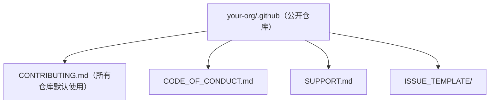

## 0. 从一个类比说起：开源项目就像一个新建成的小区

你搬进一个新小区，物业塞给你一本《业主手册》。打开一看，里面写得很清楚：

- 《小区公约》：遛狗要牵绳、晚上十点后不要大声喧哗（**行为准则**）；
- 《装修须知》：什么时间可以施工、垃圾放哪、找谁审批（**贡献指南**）；
- 《报修指引》：水管坏了打哪个电话、电梯困人找谁（**支持资源**）；
- 《访客登记》：陌生人进小区要登记（**安全策略**）。

没有这些文件会怎样？垃圾乱扔、半夜开派对、水管漏了三天没人管——小区看起来"能住人"，但没人愿意长期住下去，更没人愿意搬进来。

**开源项目就是一个"数字小区"**，而社区健康文件（Community Health Files）就是它的《业主手册》合集。它们不包含技术文档和代码，而是**支持健康协作的"规则框架"**：告诉别人如何参与、什么行为可接受、遇到问题找谁、发现漏洞怎么办。

本文按一份"社区健康文件清单"逐项讲解，你可以把清单当作装修验收表来用。

## 1. 清单总览：社区健康文件全家福

### 1.1 核心文件清单

| 文件 | 作用 | 类比 | 建议位置 |
| :--- | :--- | :--- | :--- |
| **README.md** | 介绍项目、如何开始 | 小区宣传册 | 仓库根目录 |
| **CONTRIBUTING.md** | 如何参与贡献（流程、规范） | 装修须知 | 根目录或 `.github/` |
| **CODE_OF_CONDUCT.md** | 行为准则与举报渠道 | 小区公约 | 根目录或 `.github/` |
| **SUPPORT.md** | 如何获取帮助 | 报修指引 | 根目录或 `.github/` |
| **SECURITY.md** | 如何报告安全漏洞 | 访客登记与安保 | 根目录或 `.github/` |
| **CODEOWNERS** | 文件/目录由谁负责审查 | 每栋楼的楼长 | 根目录或 `.github/` |
| **FUNDING.yml** | 赞助按钮配置 | 小区会所募捐箱 | `.github/` |
| **Issue/PR 模板** | 规范问题与改动提交格式 | 各类申请表格 | `.github/ISSUE_TEMPLATE/` 等 |

### 1.2 检查工具：社区标准（Community standards）

GitHub 自带检查器：公开仓库 → **Insights（洞察）** 标签 → **Community standards（社区标准）**，页面会列出上述文件的完备情况，打勾即达标。这是你判断"项目健不健康"的第一份体检报告。

## 2. 清单第一项：CONTRIBUTING.md（贡献指南）

### 2.1 作用

告诉新人：**怎么报告 Bug、怎么提功能请求、怎么提交代码、开发环境怎么搭、代码规范是什么**。它的存在能大幅减少"无效 Issue"和"格式错误的 PR"。

### 2.2 推荐结构模板

```markdown
# 贡献指南

感谢你愿意参与本项目！请先阅读以下内容。

## 如何报告 Bug

1. 先搜索现有 Issue，确认没有重复
2. 使用"Bug 报告"模板创建 Issue
3. 附上：环境、复现步骤、期望行为、实际行为

## 如何提交功能请求

1. 描述你想要的场景与理由
2. 说明替代方案（如果有）

## 如何提交代码（Fork 工作流）

1. Fork 本仓库并克隆到本地
2. 创建功能分支：git checkout -b feature/xxx
3. 修改并提交（提交信息遵循 Conventional Commits）
4. 推送分支并创建 Pull Request，描述中关联 Issue（Fixes #123）

## 开发环境

```bash
git clone https://github.com/你的用户名/仓库.git
cd 仓库
npm install
npm run dev
```

## 代码规范

- 使用 ESLint + Prettier，提交前运行 `npm run lint`
- 所有新功能必须包含测试
```

## 3. 清单第二项：CODE_OF_CONDUCT.md（行为准则）

### 3.1 作用

定义社区的**行为底线**和**举报渠道**，保护参与者免受骚扰，营造包容环境。GitHub 官方推荐使用成熟的 **Contributor Covenant（贡献者公约）** 模板，你只需要改联系方式即可。

### 3.2 快速添加方式

GitHub 提供一键模板：仓库 → **Add file → Create new file** → 文件名输入 `CODE_OF_CONDUCT.md` → 点击右上角 **Choose a code of conduct template** 选择模板。

### 3.3 核心内容示例（精简版）

```markdown
# 行为准则（Contributor Covenant 2.1）

## 我们的承诺

作为贡献者和维护者，我们承诺为每个人提供无骚扰的参与体验，
无论其年龄、体型、残障、族裔、性别认同与表达、经验水平、
国籍、外貌、种族、宗教或性取向如何。

## 我们的标准

积极行为：使用友好包容的语言；尊重不同观点；优雅接受建设性批评；
对社区其他成员表示同理心。

不可接受行为：性化语言或图像；挑衅、侮辱或人身攻击；公开或私下骚扰；
未经许可泄露他人隐私。

## 执行

违规行为请通过 conduct@example.com 报告。
维护者将对违规行为进行审查并采取适当处理（警告、临时/永久移除）。
```

注意：**光有文件不够，还要有真的会执行的维护者**——举报邮箱要有人定期查看。

## 4. 清单第三项：SECURITY.md（安全策略）

### 4.1 作用

告诉安全研究者：**支持哪些版本、如何私密地报告漏洞**（而不是公开发 Issue 暴露漏洞）。

### 4.2 模板

```markdown
# 安全策略

## 支持的版本

| 版本 | 支持状态 |
| :--- | :--- |
| 2.x | 完全支持（安全更新） |
| 1.x | 仅关键修复 |
| < 1.0 | 不再支持 |

## 报告安全漏洞

**请不要通过公开 Issue 报告漏洞。**

请发送邮件至 security@example.com，包含：

1. 漏洞描述与影响范围
2. 复现步骤（最小示例最佳）
3. 受影响的版本
4. 建议的修复方案（如有）

## 响应承诺

- 48 小时内确认收到报告
- 7 天内给出初步评估与修复计划
- 修复发布后公开致谢（除非报告者要求匿名）
```

## 5. 清单第四项：SUPPORT.md（支持资源）

### 5.1 作用

让用户知道"遇到问题去哪求助"，避免所有问题都涌向 Issue。

```markdown
# 获取帮助

## 自助文档

- [快速开始](docs/getting-started.md)
- [常见问题](docs/faq.md)
- [Wiki 知识库](../../wiki)

## 社区渠道

- [GitHub Discussions](../../discussions)：问答与讨论
- 邮件列表 / Discord / 微信群（按项目实际情况填写）

## 官方渠道

- 报告 Bug：[创建 Issue](../../issues/new?template=bug_report.md)
- 功能请求：[功能模板](../../issues/new?template=feature_request.md)

## 商业支持（如适用）

- 联系 support@example.com
```

## 6. 清单其余项：CODEOWNERS、FUNDING、Issue/PR 模板

### 6.1 CODEOWNERS：指定代码审查负责人

在 `.github/190-CODEOWNERS` 中声明"谁负责哪些路径"，PR 改动这些路径时自动指定审查人：

```text
# 全局默认
* @owner-team

# docs 目录由文档组负责
/docs/ @doc-maintainers

# 安全相关文件由核心成员负责
src/auth/ @admin-user
```

### 6.2 FUNDING.yml：开源赞助入口

在 `.github/FUNDING.yml` 配置后，仓库会显示"Sponsor（赞助）"按钮：

```yaml
github: [你的用户名, 组织名]      # GitHub Sponsors
patreon: 用户名                   # Patreon
custom: [https://你的赞助页地址]
```

### 6.3 Issue/PR 模板

在 `.github/ISSUE_TEMPLATE/` 下放模板文件，让新手也能提交规范的问题单（模板语法支持 YAML frontmatter 形式的表单）。

## 7. 进阶机制：默认社区健康文件（.github 仓库）

如果组织/账号下有多个仓库，不必在每个仓库重复维护同样文件。**官方机制**：在组织或用户名下创建一个名为 `.github` 的**公开**仓库，把默认社区健康文件放进去（根目录），其他没有自带对应文件的仓库会自动"继承"使用这些默认文件。



优先级规则（官方明确）：单个仓库的查找顺序为 `.github` 文件夹 → 仓库根目录 → `docs` 文件夹；都没有时，才使用 `.github` 默认仓库中的文件。注意：**LICENSE 不能作为默认文件**，许可证必须放到每个仓库本身；私有 `.github` 仓库不生效。

## 8. 常见错误与对策表

| 常见错误 | 现象/报错 | 原因 | 解决办法 |
| :--- | :--- | :--- | :--- |
| 文件名大小写错误 | 社区标准检查不通过 | 写成 `contributing.md` 等 | 使用规范大小写：`CONTRIBUTING.md`、`SECURITY.md` |
| 行为准则没人执行 | 违规无人处理 | 只放文件未设举报邮箱/负责人 | 填真实邮箱并指定维护者定期查看 |
| 漏洞公开报告 | 漏洞被发成公开 Issue | 没有 SECURITY.md 引导 | 加 SECURITY.md；已有公开漏洞可转私密安全通告 |
| 默认文件不生效 | 其他仓库看不到默认 CONTRIBUTING | `.github` 仓库是私有或位置不对 | 公开 `.github` 仓库；文件放根目录；Issue 模板放 `.github/ISSUE_TEMPLATE/` |
| 许可证缺失 | 访客不敢使用代码 | 未添加 LICENSE | LICENSE 必须每个仓库单独添加，不能走默认文件 |
| 模板文件名不对 | 新建 Issue 时模板不出现 | 模板未放对目录 | Issue 模板必须位于 `.github/ISSUE_TEMPLATE/` |
| 内容与现实脱节 | 新人按指南操作失败 | 文件写完从不更新 | 每轮迭代同步检查健康文件，用社区标准页面体检 |

## 10. 一句话记忆

**社区健康文件是开源项目的《业主手册》：CONTRIBUTING 讲怎么干活，CODE_OF_CONDUCT 讲什么不能干，SUPPORT 讲去哪求助，SECURITY 讲漏洞怎么报——用 Insights 的社区标准页面做体检，用 .github 公开仓库做默认模板，一次维护、全组织生效。**

### 延伸阅读（站内文档）

- README 的写法，见 004-github 模块《README文件》。
- CODEOWNERS 自动审查，见 004-github 模块《CODEOWNERS》。
- Issue 模板与标签，见 004-github 模块《Issues模板-标签与里程碑》。
- 社区问答与公告，见 004-github 模块《Discussions》。
