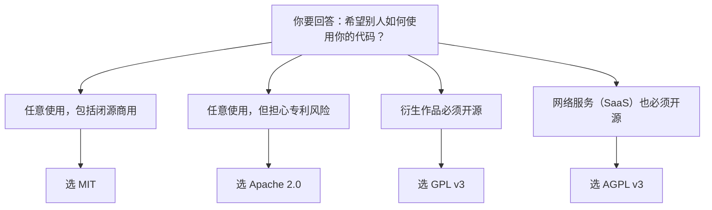

## 0. 先来一个生活场景：作品版权授权合同

你写了一首歌，把它发到网上，希望别人能唱。但你需要先回答三个问题：

- 别人**可不可以拿去卖钱**（商业使用）？
- 别人**改了歌词**再唱，算不算侵权（修改与衍生）？
- 别人用你的歌做了个翻唱专辑，**专辑里的其他歌**要不要也归你管（传染性）？

如果你什么都不说，法律默认"**保留所有权利**"——任何人都不能合法地复制、修改、分发你的作品。如果你想说"大家随便用，但有几条规矩"，你就需要一份**授权合同**。

在开源世界里，这份"授权合同"就叫**开源许可证（Open Source License）**。你发布代码时附上一份许可证，就相当于说："这份作品我授权大家使用，使用条件如下。"

GitHub 官方文档明确指出：**没有许可证的公开仓库，默认适用版权法——你保留源代码的所有权利，任何人都不得复制、分发或创作衍生作品**。你如果希望代码真正"开源"，就必须选择并添加一份许可证。

本文采用**对比驱动**的结构：先用一张总表对比 MIT / Apache 2.0 / GPL 三大类许可证，再逐一详解，最后给出"怎么选"的决策方法。

## 1. 先搞懂原理：为什么"公开"不等于"开源"

### 1.1 直观理解：三步递进

1. **把代码公开在 GitHub 上**：别人能看、能 fork。但 fork 不等于能随便用——fork 只是"复制了一份到我这里"。
2. **没有许可证**：从法律上讲，任何人使用你的代码（包括商业使用、修改后发布）都可能侵权。
3. **加上许可证**：你主动授予使用、修改、分发等权利，同时可以附加条件（比如保留版权声明、衍生作品必须开源）。

### 1.2 原理：许可证的本质是"权利授予"

许可证的本质是版权人（你）对使用者（全世界）的**单方授权**。它回答三类问题：

| 问题 | 对应许可证条款 |
| :--- | :--- |
| 能不能用？ | 使用权（Use） |
| 能不能改？ | 修改权（Modify） |
| 能不能给别人？ | 分发权（Distribute） |

不同许可证对这三类权利附加的条件不同，于是形成了"宽松"与"传染"两大阵营。

## 2. 一张总表：三大类许可证对比

这是全文的核心。先看总表，再逐项解释：

| 特性 | MIT | Apache 2.0 | GPL v3 | AGPL v3 |
| :--- | :---: | :---: | :---: | :---: |
| 商业使用 | 允许 | 允许 | 允许 | 允许 |
| 自由修改 | 允许 | 允许 | 允许 | 允许 |
| 自由分发 | 允许 | 允许 | 允许 | 允许 |
| 闭源分发 | 允许 | 允许 | **禁止**（必须开源） | **禁止** |
| 专利授权 | 无 | **有**（明确条款） | 有（条款） | 有（条款） |
| 网络服务（SaaS）需开源 | 否 | 否 | 否 | **是** |
| 衍生作品必须开源 | 否 | 否 | **是** | **是** |
| 必须保留版权声明 | 是 | 是 | 是 | 是 |
| 修改需声明变更 | 否 | **是** | 是 | 是 |
| 附带 NOTICE 文件 | 否 | 建议 | 否 | 否 |

### 2.1 直观理解：用"授权程度"排一条线

```
最宽松 ────────────────────────────────────────→ 最严格
MIT    <  Apache 2.0   <   GPL v3   <   AGPL v3
自由     多专利保护      传染性        网络也算分发
```

- **MIT**：你用我的代码，只要保留我的版权声明，其他随便。
- **Apache 2.0**：MIT 基础上加**专利授权**和**变更声明**条款，适合企业。
- **GPL**：你的程序只要**分发**了，就必须以 GPL 提供源代码（"传染"）。
- **AGPL**：连**通过网络提供服务**（SaaS）也算分发，也必须开源。

### 2.2 原理：什么是"传染性"（Copyleft）

"传染"这个词来自 Copyleft 理念，是 GPL 的核心设计。它的意思是：如果你分发一个**基于 GPL 代码修改而来**的作品，那么你的衍生作品也必须采用 GPL 许可证，把源代码开放给下游使用者。

反过来说，MIT 这类宽松许可证没有传染性：你可以把 MIT 代码嵌入闭源商业软件，无需开放你的代码。

## 3. 许可证详解

### 3.1 MIT License：程序员最爱的"佛系"许可证

**核心条款**（全文极短，约 170 字）：

```
Copyright (c) <年份> <版权人>

特此免费授予任何获得本软件及关联文档（下称"软件"）副本的人，
不受限制地处理本软件的权利，包括但不限于使用、复制、修改、合并、
发布、分发、再许可和/或销售软件的副本，并允许向其提供软件的人
这样做，但须满足以下条件：

上述版权声明和本许可声明应包含在本软件的所有副本或实质性部分中。

本软件按"现状"提供，不作任何明示或默示的担保……
```

**要点总结**：

- 允许：商业使用、修改、分发、闭源使用、再授权。
- 唯一要求：**保留版权声明和许可证文本**。
- 不提供：专利保护、担保。

**适用场景**：个人项目、工具库、希望最大范围传播的代码。React、jQuery、Vue 等知名项目都采用 MIT。

### 3.2 Apache License 2.0：企业级"商务精英"许可证

在 MIT 基础上增加三块内容：

| 新增内容 | 含义 |
| :--- | :--- |
| **专利授权（Grant of Patent License）** | 贡献者自动授予使用者专利许可，明确"你用了我的代码不会被我告专利侵权" |
| **变更声明（NOTICE）** | 修改衍生作品时，需在 NOTICE 文件中声明你做了哪些修改 |
| **商标保护** | 明确许可证**不**授予商标使用权 |

**要点总结**：

- 包含 MIT 的全部权利。
- 专利授权条款保护使用者免受专利诉讼。
- 要求保留版权声明 + 声明变更 + 附 NOTICE 文件（如有）。

**适用场景**：企业级项目、涉及专利风险的项目。Kubernetes、TensorFlow、Android 相关项目大量采用 Apache 2.0。

### 3.3 GPL v3：自由软件运动的"理想主义"许可证

**核心逻辑**：GPL 关注的是"分发"环节。

- 你可以商业使用、修改、分发 GPL 代码。
- 但**分发**衍生作品时，必须以 GPL 提供完整源代码。
- GPL v3 还加入反 Tivoization（禁止硬件锁定）条款和专利授权条款。

**要点总结**：

- 传染性：衍生作品必须 GPL。
- 不能闭源分发：分发时必须提供源码。
- 允许内部使用不触发开源义务（只要不分发）。

**适用场景**：希望代码及其衍生作品永远开源的项目。Linux、Git、WordPress 采用 GPL。

### 3.4 AGPL v3：面向 SaaS 时代的"网络增强版" GPL

GPL 有一个著名的"漏洞"：如果你的软件部署为**网络服务**（用户通过浏览器使用，不"分发"代码副本），则不需要开源。AGPL v3 堵上了这个漏洞：

- 继承 GPL v3 全部条款。
- **通过网络提供服务 = 分发**：只要别人能通过网络使用你的 AGPL 代码，你就必须开放源码。

**适用场景**：SaaS 服务、防止云厂商白嫖闭源的场景。MongoDB（旧版）等曾使用 AGPL。

### 3.5 顺带一提：BSD 与 LGPL

| 许可证 | 一句话说明 | 典型项目 |
| :--- | :--- | :--- |
| BSD 3-Clause | 与 MIT 类似，额外要求"不得用作者名义背书" | Nginx、FreeBSD |
| LGPL | 库的"温和版 GPL"：修改库本身才需开源，动态链接使用不受传染 | FFmpeg、GTK |

## 4. 怎么选：决策方法

### 4.1 决策树：三个问题搞定选择



### 4.2 按项目类型速查

| 项目类型 | 推荐许可证 | 理由 |
| :--- | :--- | :--- |
| 工具库 / SDK | MIT | 最大程度推广，降低商业采用门槛 |
| 框架 | MIT 或 Apache 2.0 | 便于大厂闭源集成（如 Vue 选 MIT 收获生态） |
| 应用程序 | GPL v3 | 防止竞争对手闭源分叉 |
| SaaS / 云服务 | AGPL v3 | 防止云厂商闭源白嫖 |
| 企业内项目 | Apache 2.0 | 专利保护 + 变更声明管理 |
| 学术 / 机构 | BSD 3-Clause | 禁止用作者名义背书，风格保守 |

### 4.3 官方决策工具

GitHub 官方维护了 **choosealicense.com**，用交互式问答帮你选择许可证。步骤：打开网站 → 回答 4-5 个问题 → 获得推荐。选型时建议同时查阅 SPDX 许可证清单（https://spdx.org/licenses/）确认许可证的规范化标识符（如 `MIT`、`Apache-2.0`、`GPL-3.0-only`）。

## 5. 在 GitHub 上添加许可证

### 5.1 方式一：创建仓库时直接选择（推荐新手）

创建新仓库时，在 "Add a license" 下拉列表中选择许可证，GitHub 会自动在仓库根目录生成对应的 `LICENSE` 文件，并自动填入年份与用户名。

### 5.2 方式二：为已有仓库添加（Web 界面）

1. 进入仓库主页，点击 "Add file" → "Create new file"。
2. 文件名输入 `LICENSE`（大小写均可，行业惯例大写）。
3. 此时右侧会出现 "Choose a license template" 按钮，点击进入模板选择页。
4. 选择许可证模板（如 MIT License），GitHub 自动填充 `[year]` 与 `[fullname]`。
5. 点击 "Commit changes" 提交。

### 5.3 方式三：命令行添加

```bash
# 从 GitHub 官方 choosealicense 仓库下载 MIT 模板
curl -o LICENSE https://raw.githubusercontent.com/github/choosealicense.com/gh-pages/_licenses/mit.txt

# 打开 LICENSE，把 [year] 和 [fullname] 替换为实际年份与姓名
# 例如：Copyright (c) 2026 Zhang San

git add LICENSE
git commit -m "docs: 添加 MIT 许可证"
git push
```

### 5.4 在项目配置中声明许可证

除了 LICENSE 文件，还应在生态配置中声明（GitHub 会根据配置文件自动识别）：

```json
// package.json（npm 项目）
{
  "name": "my-lib",
  "version": "1.0.0",
  "license": "MIT"
}
```

```toml
# pyproject.toml（Python 项目）
[project]
name = "my-lib"
version = "1.0.0"
license = { text = "MIT" }
```

### 5.5 搜索与识别

- **按许可证搜索仓库**：GitHub 搜索框支持 `license:mit` 限定符，如 `topic:chatbot license:mit`。
- **许可证识别**：GitHub 会自动检测仓库根目录的 LICENSE 文件并在仓库首页显示许可证徽章；若使用 SPDX 标识符（如 `License: MIT`）声明，识别更准确。

## 6. 常见错误与对策

| 错误现象 | 报错/表现 | 原因 | 解决办法 |
| :--- | :--- | :--- | :--- |
| 以为"公开 = 开源"，仓库没有 LICENSE | 仓库首页无许可证徽章，他人不敢使用 | 没有许可证时默认"保留所有权利" | 按第 5 节添加 LICENSE 文件 |
| 直接复制了别人项目里的 LICENSE | 许可证上的版权人还是原作者 | LICENSE 文本中保留了他人的版权声明 | 使用官方模板，把 `[year]`、`[fullname]` 替换为自己 |
| 选择了 GPL 却希望他人能闭源使用 | 有用户反馈"无法闭源集成" | GPL 有传染性，与需求冲突 | 若希望被广泛闭源使用，改用 MIT 或 Apache 2.0 |
| LICENSE 文件名写错 | GitHub 不识别许可证 | 文件名应为 `LICENSE`、`LICENSE.txt`、`LICENSE.md` 等标准命名 | 重命名为标准文件名，放在仓库根目录 |
| 项目里用了 GPL 依赖却未开源自己的代码 | 法律风险 / 下游投诉 | GPL 传染性要求衍生作品开源 | 评估依赖许可证；无法满足则替换依赖或咨询法务 |
| 改了别人 MIT 代码却不保留版权声明 | 违反 MIT 唯一硬性要求 | 分发副本必须包含原版权声明和许可证文本 | 在代码头部或 LICENSE 中保留原作者声明 |

## 8. 一句话记忆

> **许可证是开源代码的"授权合同"——MIT 随便用只要留名，Apache 再加专利保护，GPL 改了必须开源，AGPL 连网络服务也要开源；不写许可证，默认就是"版权所有，翻版必究"。**

### 官方文档

- GitHub 官方文档：为仓库添加许可证：https://docs.github.com/zh/repositories/managing-your-repositorys-settings-and-features/customizing-your-repository/licensing-a-repository
- 许可证选择工具 choosealicense.com：https://choosealicense.com/
- Open Source Guide（法律与许可证指南）：https://opensource.guide/legal/
- SPDX 许可证清单：https://spdx.org/licenses/

### 延伸阅读
- Gitignore 配置（仓库内其他关键配置文件的写法），见 004-github 模块 008 文档。
- 依赖安全选项（许可证合规是依赖审查的一环），见 004-github 模块 010 文档。
- Fork 工作流（fork 与许可证的兼容性问题），见 004-github 模块 011 文档。
