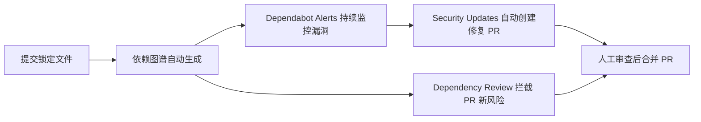

## 0. 先来一个生活场景：家庭安防系统

假设你家装了一套安防系统，它由四道防线组成：

1. **监控摄像头（看清家里有什么）**：进门先知道家里有哪些物品、哪些是别人送的。
2. **烟雾报警器（发现隐患）**：一旦检测到起火苗头，立刻拉响警报。
3. **自动灭火器（快速处置）**：警报响的同时，自动喷淋灭火，不用等你手动操作。
4. **门禁检查（防止带危险品进门）**：每次有人进门，先检查他带进来的东西是否安全。

现代软件的"家"也一样。你写的代码很少是 100% 原创——npm、pip、Maven 等包管理器会帮你引入几百甚至上千个**依赖包**。GitHub 工程师曾做过一个实验：一个只有 **21 个直接依赖**的项目，展开传递依赖后竟有 **1000 个依赖**。你的程序里 95%~97% 的代码其实是别人的代码。

问题来了：**如果某个依赖包被植入恶意代码，或者被发现存在安全漏洞，你的项目就跟着遭殃**。这种攻击方式叫**供应链攻击（Supply Chain Attack）**——攻击者不打你的房子，而是打你"进货的渠道"。

GitHub 为此提供了一整套"家庭安防系统"。本文按**原理驱动**的结构讲解：先讲清供应链攻击为什么可怕（原理），再讲 GitHub 的四道防线如何协同工作（组合），最后给出手把手的配置操作。

## 1. 原理：为什么"别人的代码"会威胁到你

### 1.1 直观理解：什么是依赖

```json
// package.json 中声明的依赖
{
  "dependencies": {
    "express": "^4.18.0",   // 直接依赖：你直接引用的框架
    "lodash": "^4.17.21"
  }
}
```

- **直接依赖**：你在清单文件里明确写下的包（如 express）。
- **传递依赖（间接依赖）**：express 自己依赖的包、那些包再依赖的包……形成一个依赖树。

GitHub 官方将你的项目及其所有依赖的集合称为**软件供应链（Software Supply Chain）**。

### 1.2 原理：供应链攻击的三条路径

| 攻击路径 | 攻击手法 | 典型后果 |
| :--- | :--- | :--- |
| **漏洞利用** | 依赖包存在已知安全漏洞（CVE），攻击者利用它入侵你的应用 | 数据泄露、服务器被控制 |
| **恶意包投毒** | 攻击者发布名称相似（typosquatting）或已被攻陷的恶意包，诱导你安装 | 植入木马、窃取环境变量中的密钥 |
| **维护者失守** | 依赖包的维护者账号被盗，往正规包里注入后门 | 下游所有使用者中招 |

三条路径的共性：**问题出在你的供应链上，而不是你的代码里**。这也是"依赖安全"与"代码安全"的本质区别——你无法审查每一个依赖的每一行代码，必须依靠工具来持续监控。

### 1.3 直观理解：Log4j 事件

2021 年底爆发的 Log4Shell 漏洞（CVE-2021-44228）是教科书级案例：Java 日志库 Log4j 的一个功能存在远程代码执行漏洞，攻击者只需发送一段特殊字符串即可控制服务器。全球无数 Java 应用因传递依赖引入了 Log4j 而中招，修复工作持续了数月。它的教训是：**你甚至可能不知道自己用了 Log4j**——它可能是某个依赖的依赖的依赖。

## 2. GitHub 依赖安全功能矩阵：四道防线

| 功能 | 对应"安防系统" | 作用 | 免费可用范围 |
| :--- | :--- | :--- | :--- |
| **Dependency Graph（依赖图谱）** | 监控摄像头 | 看清全部直接/传递依赖及漏洞信息 | 所有仓库 |
| **Dependabot Alerts（漏洞告警）** | 烟雾报警器 | 发现依赖漏洞后自动告警 | 所有仓库 |
| **Dependabot Security Updates（安全更新）** | 自动灭火器 | 针对漏洞自动创建修复 PR | 所有仓库 |
| **Dependency Review（依赖审查）** | 门禁检查 | 在 PR 合并前检查新增依赖的安全性 | 组织仓库（启用后） |

四道防线的**依赖关系**：依赖图谱是地基，其他三个功能都依赖它提供的数据。GitHub 官方供应链安全文档明确：Dependency review 与 Dependabot alerts 都使用依赖图谱的信息进行交叉比对。

## 3. 第一道防线：依赖图谱（Dependency Graph）

### 3.1 原理：它是怎么"看清"你的依赖的

依赖图谱自动解析仓库中的**清单文件（manifest）**与**锁定文件（lockfile）**，构建出依赖关系图：

- 清单文件：`package.json`、`requirements.txt`、`pom.xml`、`go.mod` 等（声明直接依赖）。
- 锁定文件：`package-lock.json`、`Pipfile.lock`、`go.sum` 等（锁定精确版本，含传递依赖）。

当你在默认分支推送修改清单/锁定文件的提交时，依赖图谱自动更新。

### 3.2 支持的主要生态系统

| 生态系统 | 清单文件 | 锁定文件 |
| :--- | :--- | :--- |
| npm / yarn | `package.json` | `package-lock.json` / `yarn.lock` |
| pip | `requirements.txt` / `Pipfile` | `Pipfile.lock` |
| Maven | `pom.xml` | — |
| Gradle | `build.gradle` | — |
| Go | `go.mod` | `go.sum` |
| Cargo | `Cargo.toml` | `Cargo.lock` |
| NuGet | `*.csproj` / `packages.config` | — |
| GitHub Actions | 工作流文件 | — |
| Docker | `Dockerfile` | — |

### 3.3 操作：查看与启用依赖图谱

```
仓库 → Insights（洞察）→ Dependency graph
```

- 公开仓库默认启用。
- 私有仓库可在 Settings → Code security and analysis 中启用。
- 图谱页面会显示：直接依赖、传递依赖、每个依赖的版本、已知漏洞标记（红色徽章）。

### 3.4 最佳实践：提交锁定文件

```bash
# npm 项目：务必提交 package-lock.json
git add package-lock.json && git commit -m "chore: 提交锁定文件"

# 好处：依赖图谱能精确解析版本；Dependabot 能精确定位受影响的依赖
```

不提交锁定文件是新手最常见的错误——依赖图谱无法确定实际安装版本，告警也会失去精确性。

## 4. 第二道防线：Dependabot Alerts（漏洞告警）

### 4.1 原理：告警是怎么产生的

```
GitHub Advisory Database（漏洞数据库）
        ↓ 与依赖图谱中的依赖交叉比对
发现：你的依赖 X 的版本 v1.2.0 存在 CVE-2024-xxxxx
        ↓
生成 Dependabot Alert（在 Security 选项卡显示）
```

Dependabot 持续监控 GitHub Advisory Database 和其他漏洞源。**触发告警的时机**：

- 新漏洞被披露并进入数据库时。
- 漏洞信息更新（严重性、受影响版本范围变化）时。
- 依赖图谱变化导致新引入漏洞时。

### 4.2 告警内容示例

Dependabot Alert 页面会展示：

- 受影响的依赖名称与版本范围。
- 漏洞描述与 CVSS 严重性评分（如 7.2 High）。
- 受影响的路径（哪个直接依赖带入了它）。
- 修复建议：升级到哪个版本。

### 4.3 操作：启用与查看

1. 仓库 Settings → Code security and analysis。
2. 找到 Dependabot alerts，点击 Enable。
3. 查看：仓库 → Security → Dependabot。

### 4.4 设置通知

告警默认通过邮件/网页通知。可在 Settings → Notifications 中调整接收方式与频率。

## 5. 第三道防线：Dependabot Security Updates（自动安全更新）

### 5.1 原理：从"发现"到"修复"的自动化

发现漏洞后，Dependabot 不会只报警，它会直接创建一个 **Pull Request** 把依赖升级到安全版本：

```markdown
# Dependabot 自动创建的 PR 标题与说明示例

## Bump lodash from 4.17.15 to 4.17.21

修复以下漏洞：
- CVE-2021-23337: Command injection（命令注入）
- CVE-2020-28500: ReDoS vulnerability（正则拒绝服务）

CVSS Score: 7.2 (High)
```

你只需要审查并合并这个 PR，无需手动改版本号。

### 5.2 操作：启用安全更新

1. 仓库 Settings → Code security and analysis。
2. 找到 Dependabot security updates，点击 Enable。
3. 之后每个相关漏洞都会自动生成修复 PR。

### 5.3 使用配置文件微调（dependabot.yml）

```yaml
# .github/dependabot.yml
version: 2
updates:
  - package-ecosystem: 'npm'
    directory: '/'
    schedule:
      interval: 'weekly'
    open-pull-requests-limit: 10      # 同时最多打开的 PR 数量
    reviewers:
      - 'security-team'              # 自动指派审查人
    labels:
      - 'security'
      - 'dependencies'
    ignore:
      - dependency-name: 'lodash'
        versions: ['4.x']            # 忽略指定版本的更新
```

## 6. 第四道防线：Dependency Review（依赖审查）

### 6.1 原理：在"进门"前检查

Dependabot 解决的是"家里已有隐患"；Dependency Review 解决的是"**别把新隐患带进门**"。每当 PR 修改了清单/锁定文件，Dependency Review 会在 PR 的 "Files Changed" 选项卡中展示依赖变更的**富文本差异**：

- 新增/删除/更新的依赖及发布日期。
- 这些依赖的已知漏洞数据。
- 被多少项目使用。
- 许可证信息。

### 6.2 操作：作为 GitHub Actions 强制检查（推荐）

```yaml
# .github/workflows/dependency-review.yml
name: Dependency Review
on: [pull_request]                     # 每个 PR 都检查

permissions:
  contents: read

jobs:
  dependency-review:
    runs-on: ubuntu-latest
    steps:
      - uses: actions/checkout@v6
      - uses: actions/dependency-review-action@v4
        with:
          # 严重级别达到 moderate 及以上则让检查失败
          fail-on-severity: moderate
          # 禁止引入以下许可证的依赖
          deny-licenses: GPL-3.0, AGPL-3.0
```

合并此工作流后，任何引入中危以上漏洞依赖的 PR 都会被 CI 拦截，直到依赖被替换或升级。

### 6.3 与许可证检查配合

Dependency Review 同时输出许可证信息，可用于合规管理（例如禁止引入 AGPL 依赖到企业闭源项目）。这正好与本模块 009 文档的许可证知识衔接。

## 7. 组合拳：一个完整的依赖安全基线

把四道防线串起来，就是生产环境的最低安全基线：



**日常动作清单**：

1. 提交所有锁定文件（图谱精度的前提）。
2. 启用 Dependabot alerts 与 security updates。
3. 提交 dependency-review 工作流到仓库。
4. 定期查看 Security 选项卡的告警面板。
5. 审查 Dependabot 创建的 PR（含 CI 通过）后再合并。

## 8. 常见错误与对策

| 错误现象 | 报错/表现 | 原因 | 解决办法 |
| :--- | :--- | :--- | :--- |
| 依赖图谱里看不到依赖 | Insights 中没有 Dependency graph 数据 | 清单/锁定文件未提交，或位于默认分支 | 提交锁定文件；确认清单在默认分支 |
| 有漏洞但没收到告警 | 邮件无通知 | Dependabot alerts 未启用，或通知被关闭 | Settings → Code security and analysis 启用；检查通知设置 |
| Dependabot 不创建安全更新 PR | 有告警无 PR | Security updates 未启用，或目标版本不存在安全版本 | 启用 Security updates；手动升级到修复版本 |
| Dependency Review 不生效 | PR 中看不到依赖差异 | 依赖图谱未启用，或仓库非组织所有 | 启用依赖图谱；确认组织已启用相应功能 |
| `dependabot.yml` 配置报错 | `Dependabot couldn't parse the config file` | YAML 缩进错误或键名拼写错误 | 使用官方配置选项参考逐项核对；`version` 必须为 2 |
| 升级依赖后应用崩溃 | 合并 PR 后线上故障 | 依赖大版本升级存在破坏性变更 | 为 Dependabot PR 配置 CI 测试；用 `ignore` 限制大版本升级 |

## 10. 一句话记忆

> **依赖安全是一套"家庭安防系统"：依赖图谱看清家底、Dependabot alerts 报警、安全更新自动灭火、Dependency Review 在 PR 门口检查危险品——四道防线缺一不可。**

### 官方文档

- GitHub 供应链安全概念（官方）：https://docs.github.com/zh/code-security/supply-chain-security
- 依赖图谱：https://docs.github.com/zh/code-security/supply-chain-security/understanding-your-software-supply-chain/about-the-dependency-graph
- Dependabot alerts：https://docs.github.com/zh/code-security/dependabot/dependabot-alerts/about-dependabot-alerts
- Dependabot 配置选项参考：https://docs.github.com/zh/code-security/dependabot/dependabot-version-updates/configuration-options-for-the-dependabot.yml-file

### 延伸阅读
- Dependabot 深度专题（配置与自动合并），见 004-github 模块 016 文档。
- 开源许可证选择（许可证合规是依赖审查的一部分），见 004-github 模块 009 文档。
- Gitignore 配置（提交锁定文件与忽略敏感文件），见 004-github 模块 008 文档。
- GitHub Actions CI/CD（Dependency Review 的载体），见 004-github 模块 029 文档。
