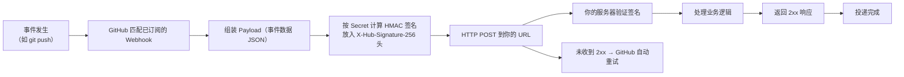

## 0. 先来一个生活场景：订杂志与门铃

你订了一份杂志。杂志社有两种送刊方式：

**方式一：你自己去报摊问（轮询）**

你每天跑去报摊问："出新刊了吗？""出新刊了吗？"——多数时候得到的答案是"没有"，时间和精力全浪费在路上。

**方式二：订阅杂志（Webhook）**

你在杂志社填一张订阅单：留下地址（接收 URL）、说明只订技术类（选择事件）、约定取件暗号（Secret）。从此，杂志**一出刊就自动送到你家门口**，你什么都不用做。

**Webhook 就是 GitHub 的"杂志订阅服务"**。它与"轮询 API"（自己去问"有没有新事件"）的本质区别：

| 方式 | 方向 | 实时性 | 资源消耗 |
| :--- | :--- | :--- | :--- |
| API 轮询 | 你 → GitHub（主动问） | 有延迟（取决于轮询间隔） | 高（浪费配额，见 021 文档） |
| **Webhook** | GitHub → 你（主动推） | 即时 | 低（只在你关心的时刻触发） |

GitHub 官方定义：**Webhook 允许你在 GitHub 上发生特定事件时收到通知**——GitHub 向指定的 URL 发送 HTTP POST 请求，请求体（Payload）包含事件的全部数据。你只需要在自己的服务器上开一个"门"，等 GitHub 按门铃。

本文按**流程驱动**的结构展开，完整走一遍"事件 → Webhook → Payload → 响应"的生命周期，然后讲安全验证（防伪造）与服务器实现。

## 1. 完整流程总览：一扇"门铃"的一生



五个环节缺一不可：

1. **事件（Event）**：仓库里发生了什么（push、PR、Issue 等）。
2. **订阅（Webhook）**：你告诉 GitHub"我对哪些事件感兴趣、推到哪个 URL"。
3. **负载（Payload）**：GitHub 组装的事件数据 JSON。
4. **投递（Delivery）**：GitHub 发送 HTTP POST，失败自动重试。
5. **响应（Response）**：你的服务器验证并处理，返回 2xx 确认。

## 2. 第一步：创建 Webhook（填写订阅单）

### 2.1 通过网页界面创建

```
仓库 → Settings → Webhooks → Add webhook
```

需要填写的**五个核心配置项**：

| 配置项 | 说明 | 建议 |
| :--- | :--- | :--- |
| **Payload URL** | 接收 POST 请求的公网地址 | 必须公网可达，如 `https://api.example.com/github/webhook` |
| **Content type** | 负载编码格式 | 选 `application/json`（解析最简单，官方推荐） |
| **Secret** | 订阅暗号，用于签名验证 | 必填，随机长字符串（至少 32 位） |
| **Events** | 订阅哪些事件 | 只勾选需要的，不要选 "Send me everything" |
| **Active** | 是否启用 | 默认启用；维护时先关闭 |

### 2.2 通过 API 创建（gh api）

```bash
gh api repos/octocat/Hello-World/hooks \
  -f name=web \
  -f active=true \
  -f "events[]=push" \
  -f "events[]=pull_request" \
  -f "config[url]=https://api.example.com/github/webhook" \
  -f "config[content_type]=json" \
  -f "config[secret]=my-secret-key-1234567890abcdef"
```

### 2.3 两种 Webhook 类型

| 类型 | 作用范围 | 适用场景 |
| :--- | :--- | :--- |
| **仓库级 Webhook** | 单个仓库的事件 | 个人项目、单仓库 CI 触发 |
| **组织级 Webhook** | 组织内所有仓库的事件 | 统一审计、全仓库合规监控 |

## 3. 第二步：选择事件（勾选订阅内容）

### 3.1 常用事件速查

| 事件 | 触发时机 | 典型用途 |
| :--- | :--- | :--- |
| `push` | 代码推送到分支 | 触发构建/部署 |
| `pull_request` | PR 创建/更新/关闭/合并 | 触发测试、通知审查者 |
| `issues` | Issue 创建/更新/关闭 | 同步到项目管理工具 |
| `issue_comment` | Issue 或 PR 评论 | 客服机器人、自动回复 |
| `pull_request_review` | PR 审查提交 | 审查状态看板 |
| `release` | Release 发布 | 自动打包镜像、发公告 |
| `star` | 仓库被标星 | 感谢自动化、数据统计 |
| `workflow_run` | Actions 工作流完成 | 工作流间联动 |
| `ping` | Webhook 创建/更新时 | 连通性测试（GitHub 自动发） |

### 3.2 选择原则

- **只订阅需要的**：每多一个事件就多一批请求，噪音会淹没真实信号。
- **`*`（所有事件）不推荐**：除非做全量审计，否则会造成大量无效投递。
- **先小后大**：先用 `push` 跑通全流程，再逐步加事件。

## 4. 第三步：查看 Payload（读懂门铃传来的信息）

每个事件的 Payload 是结构化 JSON，包含 `repository`、`sender`、事件专属字段等。以下是一个 `push` 事件的实际负载（已注释）：

```json
{
  "ref": "refs/heads/main",
  "before": "7d8f1a2b3c4d5e6f708192a3b4c5d6e7f8a9b0c1",
  "after": "8e9f0a1b2c3d4e5f60718293a4b5c6d7e8f9a0b2",
  "repository": {
    "id": 123456789,
    "name": "my-repo",
    "full_name": "octocat/my-repo",
    "private": false,
    "html_url": "https://github.com/octocat/my-repo"
  },
  "sender": {
    "login": "octocat",
    "id": 583231,
    "type": "User"
  },
  "commits": [
    {
      "id": "8e9f0a1b2c3d4e5f60718293a4b5c6d7e8f9a0b2",
      "message": "feat: 添加登录功能",
      "author": {
        "name": "octocat",
        "email": "octocat@users.noreply.github.com"
      },
      "url": "https://github.com/octocat/my-repo/commit/8e9f0a..."
    }
  ],
  "head_commit": {
    "message": "feat: 添加登录功能"
  }
}
```

**Payload 里的关键信息**：ref（分支）、before/after（提交前后 SHA）、commits（提交列表）、sender（触发者）、repository（仓库信息）。你的业务逻辑主要消费这些字段。

### 4.1 投递头（Delivery Headers）

每次投递还带有 HTTP 头，比 Payload 更先到：

| 请求头 | 含义 |
| :--- | :--- |
| `X-GitHub-Event` | 事件名称（如 `push`、`issues`） |
| `X-GitHub-Delivery` | 投递唯一 ID（用于排查） |
| `X-Hub-Signature-256` | HMAC-SHA256 签名（验证身份用） |
| `User-Agent` | `GitHub-Hookshot/*`（GitHub 官方标识） |

**最佳实践**：先看 `X-GitHub-Event` 头决定处理分支，再解析 Body；而不是先解析 Body 再猜事件。

## 5. 第四步：安全验证（防伪门铃）

任何人都可能向你的 URL 发 POST 请求（伪造"门铃"）。**Secret + 签名验证**是唯一可靠的身份校验方式。

### 5.1 签名原理

```
GitHub 端：
  签名 = HMAC-SHA256(secret, 原始请求体)
  放入请求头 X-Hub-Signature-256: sha256=签名值

你的服务器端：
  用同样的 secret 对收到的原始请求体计算签名
  与请求头中的签名比对
  一致 → 确认真实来自 GitHub；不一致 → 拒绝（401）
```

### 5.2 关键细节（GitHub 官方强调）

- 签名**永远以 `sha256=` 开头**。
- 必须使用**原始请求体**（未做任何格式化）计算，否则签名对不上。
- 比对用**恒定时间比较**（`crypto.timingSafeEqual`），防止时序攻击，不要用 `==`。
- Payload 可能包含 Unicode 字符，注意 UTF-8 处理。

### 5.3 Node.js 验证示例（带注释）

```javascript
const crypto = require('crypto');

/**
 * 验证 GitHub Webhook 签名
 * @param {Buffer|string} payload 原始请求体
 * @param {string} signature 请求头 X-Hub-Signature-256
 * @param {string} secret 创建 Webhook 时填写的 Secret
 * @returns {boolean} 签名是否有效
 */
function verifyWebhook(payload, signature, secret) {
  // GitHub 发送的签名格式：sha256=十六进制摘要
  const expected = 'sha256=' +
    crypto.createHmac('sha256', secret).update(payload).digest('hex');
  // 恒定时间比较，防时序攻击
  return crypto.timingSafeEqual(
    Buffer.from(signature),
    Buffer.from(expected)
  );
}
```

### 5.4 安全基线清单

1. **Secret 必须设置**（测试环境也一样）。
2. 端点**必须 HTTPS**。
3. 验证签名**通过后才处理业务**。
4. 可选：校验 `User-Agent` 是否以 `GitHub-Hookshot` 开头。
5. 处理逻辑**必须幂等**（同一事件可能重试多次）。

## 6. 第五步：响应与服务器实现（开门迎客）

### 6.1 响应约定

- 收到请求后**尽快返回 2xx**（如 `200 OK`），确认收到。
- 返回非 2xx（如 500、超时）时，GitHub 会按策略**自动重试**，重试时间逐渐拉长。
- 建议先返回 200，再异步处理耗时逻辑（避免 GitHub 等待超时）。

### 6.2 Express 完整示例（带注释）

```javascript
const express = require('express');
const app = express();

// 用 raw body 接收，保证签名验证时用的是原始字节
app.post('/webhook', express.raw({ type: 'application/json' }), (req, res) => {
  // 1. 取签名头
  const signature = req.headers['x-hub-signature-256'];
  const event = req.headers['x-github-event'];

  // 2. 先验签：失败直接拒绝，不做任何业务处理
  if (!signature ||
      !verifyWebhook(req.body, signature, process.env.WEBHOOK_SECRET)) {
    return res.status(401).send('Invalid signature');
  }

  // 3. 解析事件类型（用请求头，而不是猜）
  switch (event) {
    case 'push':
      const push = JSON.parse(req.body);
      console.log(`[push] ${push.repository.full_name}: ${push.ref}`);
      break;
    case 'pull_request':
      const pr = JSON.parse(req.body);
      console.log(`[PR] #${pr.number} ${pr.action} by ${pr.sender.login}`);
      break;
    case 'ping':
      console.log('[ping] Webhook 配置成功');
      break;
    default:
      console.log(`[${event}] 未处理的事件`);
  }

  // 4. 先回 2xx，再处理耗时逻辑（如有）
  res.status(200).send('OK');
});

app.listen(3000, () => console.log('Webhook 服务运行在 3000 端口'));
```

### 6.3 本地调试：内网穿透

服务器在本地（如 `localhost:3000`）时，GitHub 无法访问。可用内网穿透工具暴露公网地址：

```bash
# 示例：使用 cloudflared 免费隧道
cloudflared tunnel --url http://localhost:3000
# 输出一个 https://xxx.trycloudflare.com 公网地址，填入 Payload URL 即可
```

### 6.4 查看投递记录与排查

```
仓库 → Settings → Webhooks → 点击 Webhook → Recent deliveries
```

每次投递都有：请求/响应头、Payload 体、响应状态码、耗时。排查流程：

1. 看最近一次投递的状态码（200 成功；4xx/5xx 失败）。
2. 点开 "Redeliver" 重新投递（修复代码后重放同一次投递）。
3. 对比 `X-GitHub-Delivery` 与服务器日志，定位丢失的投递。

## 7. 常见错误与对策

| 错误现象 | 报错/表现 | 原因 | 解决办法 |
| :--- | :--- | :--- | :--- |
| 投递显示失败 | `Response code: 404` | Payload URL 路径写错，或服务器未监听该路径 | 检查 URL 与 Express 路由是否一致；先 curl 本地验证 |
| 签名验证不通过 | `Invalid signature`，投递 401 | 用格式化后的 body 算签名，或 Secret 不一致 | 用 `express.raw()` 接收原始字节；核对 Secret |
| 收不到任何投递 | Recent deliveries 为空 | 未选择事件，或 Webhook 未启用（Active 关闭） | 检查 Events 配置；确认 Active 为启用状态 |
| 重复处理同一次事件 | 业务重复执行 | GitHub 对失败投递自动重试；或订阅了重复事件 | 业务逻辑做到**幂等**（按 delivery ID 去重） |
| 订阅了全部事件导致刷屏 | 大量无关投递 | 事件选择过宽（`*`） | 改为只勾选需要的具体事件 |
| 本地调试收不到 | 投递全部超时 | GitHub 无法访问 localhost | 用内网穿透暴露公网 URL |
| 请求被伪造 | 恶意 POST 触发了部署 | 未设置 Secret 或未验证签名 | 设置强随机 Secret；验证 X-Hub-Signature-256 后再处理 |

## 9. 一句话记忆

> **Webhook 是 GitHub 的"杂志订阅"——你填好地址（URL）、选好刊物（事件）、约定暗号（Secret），GitHub 出刊即送（事件即推）；收到后先验暗号（签名），再拆信（Payload），最后回执（2xx），全程无需轮询。**

### 官方文档

- 关于 Webhooks（GitHub 官方中文文档）：https://docs.github.com/zh/webhooks/about-webhooks
- Webhook 事件与负载（全量事件清单与 Payload 结构）：https://docs.github.com/zh/webhooks/webhook-events-and-payloads
- 验证 Webhook 投递（签名验证详解）：https://docs.github.com/zh/webhooks/using-webhooks/validating-webhook-deliveries
- 创建 Webhooks：https://docs.github.com/zh/webhooks/using-webhooks/creating-webhooks

### 延伸阅读
- REST 与 GraphQL API（Webhook 的"反面"——主动拉取），见 004-github 模块 021 文档。
- GitHub Actions（工作流 `workflow_run` 事件与 Webhook 联动），见 004-github 模块 029 文档。
- GitHub CLI（用 gh api 管理 Webhook），见 004-github 模块 020 文档。
