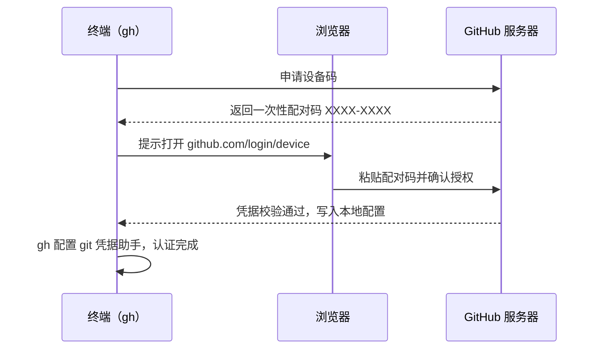

## 0. 开始之前：给终端配一把"万能门禁卡"

想象你住进一栋需要门禁的公寓：浏览器访问 GitHub 就像每次都要在前台登记身份；而 `gh`（GitHub CLI）认证，就是物业发给你的一张**门禁卡**——刷一下（一条命令）就能进仓库、提 PR、发 Release，全程不用打开浏览器。

本篇解决三个问题：

1. 怎么装上 `gh`；
2. 怎么让 `gh` 知道"你是谁"（认证），以及认证凭据放在哪、有多大的权限；
3. 本地、多账户、CI 三种环境下分别怎么配。

前置知识：本篇默认你已了解 [GitHub CLI 总览](github/440-GitHubCLI) 中 `gh` 的定位与基本命令结构。

## 1. 安装 gh

三大主流平台各有一条安装命令，装完用 `gh --version` 验证：

```bash
# Windows：通过系统自带包管理器安装
winget install GitHub.cli

# macOS：通过 Homebrew 安装
brew install gh

# Ubuntu / Debian：通过 apt 安装
sudo apt install gh

# 验证安装（输出形如 gh version 2.x.x）
gh --version

# 后续升级
winget upgrade GitHub.cli   # Windows
brew upgrade gh             # macOS
sudo apt update && sudo apt upgrade gh   # Ubuntu
```

> 类比：包管理器就像手机上的应用商店，`winget`/`brew`/`apt` 分别是 Windows、macOS、Ubuntu 的"商店入口"，用它们安装能顺带处理升级与卸载。

## 2. 第一次登录：交互式认证（推荐）

`gh auth login` 是最常用的登录方式，全程向导式问答。下面是一次完整的会话走读：

```bash
gh auth login
```

命令启动后依次回答四个问题（`?` 开头的行是 gh 的提问，`>` 后是你按提示的选择）：

```text
? What account do you want to log into?        # 登录哪个平台
> GitHub.com                                   #   绝大多数人选这个；企业版选 Other
? What is your preferred protocol for Git operations on this host?
> HTTPS                                        #   Git 推拉代码走 HTTPS（由 gh 代管凭据）
? Authenticate Git with your GitHub credentials? (Y/n)
> Y                                            #   让 gh 顺便配置好 git 的凭据助手
? Press Enter to open github.com in your browser...
```

随后终端会显示一个**一次性配对码**（形如 `XXXX-XXXX`），浏览器打开 https://github.com/login/device 后粘贴该码、授权即可。整个流程的时序如下：



认证成功后，gh 做了三件事：把凭据存入系统安全存储（keyring）；为 git 配置 HTTPS 凭据助手；把请求的权限范围（scopes）记录下来。此时再执行 `git push` 等远程操作也不会再要密码。

如果你选择 SSH 协议且本地还没有密钥，gh 会引导生成并上传；也可以事后用 `gh auth login` 重跑一次，或直接跳到第 6 节的 `gh ssh-key` 命令。

## 3. Token 方式登录：脚本与自动化的选择

交互式登录适合人；**脚本、容器、CI 环境**里更常用 Token 登录。共有三种形态：

### 3.1 通过 stdin 传入 Token 文件

```bash
# 从文件读入 token（文件内容只需 token 一行，适合初始化脚本）
gh auth login --with-token < token.txt

# 用完即删，避免令牌残留在磁盘
rm token.txt
```

### 3.2 通过环境变量（推荐给 CI）

```bash
# 设置环境变量后 gh 自动识别，无需登录动作
export GH_TOKEN=ghp_xxxxxxxxxxxxxxxxxxxx
gh repo list
```

- gh 识别的环境变量优先级：`GH_TOKEN` > `GH_ENTERPRISE_TOKEN`（企业版）> 本地已存储凭据。也就是说**设置了 `GH_TOKEN` 后，`gh auth status` 看到的就是环境变量里的身份**，这既方便切换，也是新手最常见的"明明登录了却没权限"的原因之一。
- 在 GitHub Actions 里，`GITHUB_TOKEN` 同样被 gh 识别，可以直接使用（见第 8 节）。

### 3.3 Token 从哪里来、要什么权限

| Token 类型 | 创建入口 | gh 所需权限（scopes） |
| --- | --- | --- |
| Classic PAT | Settings → Developer settings → Personal access tokens → Tokens (classic) | `repo`、`read:org`、`gist`、`workflow` |
| Fine-grained PAT | Settings → Developer settings → Fine-grained tokens | 按需授予目标仓库的 Contents / Issues / Pull requests 等读写权限 |
| GitHub App / Actions `GITHUB_TOKEN` | 无需手工创建 | 由工作流 `permissions` 块决定 |

两种 PAT 的取舍：classic PAT 按用户全局生效、权限粒度粗但兼容性最好；fine-grained PAT 只作用于选定仓库、更安全，是官方推荐方向，但部分组织级功能（如企业管理 API）支持有限。日常给 `gh` 用，选其一即可。

> 陷阱：token 只在**创建时完整显示一次**，退出页面就再也看不到。丢了只能重新生成。

## 4. 查看与管理认证状态

```bash
# 查看当前登录账户、协议、token 权限范围
gh auth status

# 连 token 本身一起显示（仅用于自查，切勿贴到公开场合）
gh auth status --show-token

# 单独输出当前 token（供其他工具脚本引用）
gh auth token

# 给现有凭据追加权限范围（例如要让 gh 修改 workflow 文件）
gh auth refresh -s workflow

# 一次添加多个 scope
gh auth refresh -s repo,workflow
```

`gh auth status` 的典型输出与读法：

```text
github.com
  Logged in to github.com account alice (keyring)        # 登录账户与凭据存储位置
  - Active account: true                                 # 是否为当前激活账户
  - Git operations protocol: https                       # Git 操作使用的协议
  - Token: gho_************                              # token（已脱敏）
  - Token scopes: 'gist', 'read:org', 'repo', 'workflow' # 权限范围
```

**`gh auth refresh` 什么时候用**：交互式登录默认申请的 scopes 已覆盖绝大多数场景，但遇到需要改动工作流文件（`workflow`）或访问企业信息（`admin:org` 等）的操作时，运行一次 `gh auth refresh -s <scope>` 并按浏览器提示重新授权即可，**不需要**退出重登。

## 5. 多账户管理：switch 与 logout

一台机器上同时维护公司账号和个人账号是常态。gh 支持同时登录多个账户并在其间切换：

```bash
# 交互式切换到另一个已登录账户
gh auth switch

# 直接切换到指定账户
gh auth switch --user bob

# 登出当前账户
gh auth logout

# 登出指定账户
gh auth logout --user bob
```

原理上，gh 把每个主机（github.com 或企业实例）下的多个账户都存进本地配置，`switch` 只是更换"激活账户"标记；没有激活的账户凭据保留在 keyring 里，随时可以切回。切换只影响 gh 自己的 API 调用与代管的 git 凭据，不会动你 `~/.ssh` 里的密钥。

## 6. SSH 密钥管理

用 SSH 协议时，需要把公钥上传到 GitHub 账户。gh 把"生成密钥之外的搬运工作"做成了命令：

```bash
# 上传公钥到 GitHub 账户（自动读取 .pub 文件）
gh ssh-key add ~/.ssh/id_ed25519.pub

# 上传并设置标题（便于在 Settings → SSH keys 里辨认）
gh ssh-key add ~/.ssh/id_ed25519.pub --title "我的笔记本"

# 列出账户里所有 SSH 密钥
gh ssh-key list

# 按列表中的 ID 删除指定密钥（电脑丢了第一时间用）
gh ssh-key delete 12345
```

如果本地还没有密钥对，先用 `ssh-keygen -t ed25519 -C "你的邮箱"` 生成，再执行上面的上传命令。上传后 `ssh -T git@github.com` 应返回 "Hi <用户名>!" 即表示打通。

## 7. 配置管理：把 gh 调成顺手的样子

```bash
# 设置默认编辑器（gh 会用它打开交互式输入，如 PR 描述）
gh config set editor "code --wait"

# 设置 Git 操作的默认协议（https 或 ssh）
gh config set git_protocol ssh

# 设置打开链接用的浏览器
gh config set browser firefox

# 查看/列出配置
gh config get editor
gh config list
```

常用配置项一览：

| 配置项 | 可选值 | 说明 |
| --- | --- | --- |
| `editor` | 任意编辑器命令 | 交互式文本输入用哪个编辑器 |
| `git_protocol` | `https` / `ssh` | gh 为 git 代管凭据时使用的协议 |
| `prompt` | `enabled` / `disabled` | 关闭交互式提问（脚本环境常用） |
| `pager` | 分页器命令 | 长输出走分页（设为 `cat` 可关掉） |
| `browser` | 浏览器命令 | `--web` 类命令打开的浏览器 |

## 8. 在 CI 里使用 gh：GITHUB_TOKEN 模式

GitHub Actions 的每个运行中都自带 `GITHUB_TOKEN`，gh 会被自动识别，无需登录：

```yaml
# .github/workflows/release.yml（节选）
jobs:
  release:
    runs-on: ubuntu-latest
    permissions:            # 最小权限：声明工作流需要什么
      contents: write       # 创建 Release 需要写 contents
    steps:
      - uses: actions/checkout@v6
      - name: 用 gh 创建 Release
        env:                # GH_TOKEN 指向内置 token，gh 即完成认证
          GH_TOKEN: ${{ github.token }}
        run: gh release create v1.0.0 --generate-notes
```

三个要点：`permissions` 决定 token 上限（默认只读）；token 随运行结束自动失效，无需回收；若需要操作其他仓库，再考虑用 PAT 存入仓库 Secrets。

## 9. 常见错误与对策

| 常见错误 | 报错/现象 | 原因 | 解决办法 |
| --- | --- | --- | --- |
| 登录成功但没权限 | `resource not accessible by integration` 或 403 | `GH_TOKEN` 仍指向旧值/权限不足 | `unset GH_TOKEN` 后重试；或 `gh auth refresh -s` 补权限 |
| 命令卡在交互提问 | 脚本里命令挂起等待输入 | 交互式提问在无终端环境无法进行 | 加 `--yes`/非交互参数，或 `gh config set prompt disabled` |
| token 失效 | `HTTP 401: Bad credentials` | PAT 过期或被撤销 | 重新生成并 `gh auth login`（或刷新 `GH_TOKEN`） |
| push 仍提示输入密码 | git 报 `Authentication failed` | 未选 "Authenticate Git with your GitHub credentials" | 重跑 `gh auth login` 并选 Y，或手动配 git 凭据助手 |
| 多账户串号 | 操作的是另一个账号的仓库 | 激活账户不是预期账户 | `gh auth status` 确认，`gh auth switch --user` 切换 |
| 企业版命令打到 github.com | 找不到仓库/404 | 未指定主机 | 命令加 `-h github.example.com`，或 `gh config set host` 后使用 |

## 10. 安全注意事项

- **最小权限**：token 只给当前需要的 scopes，缺了再 `refresh`，不要一上来全勾。
- **不落盘、不入库**：token 不写进代码、截图、日志；`token.txt` 用完即删；`.gitignore` 中排除一切凭据文件（详见 github/070-GitignoreConfig）。
- **`--show-token` 输出即泄露面**：截屏、录屏、结对演示前先确认没有带 token 的输出。
- **离职/换机处理**：在 GitHub Settings 里删除旧设备对应的 token 与 SSH key（或用 `gh ssh-key delete`），再为新设备重新认证。

## 11. 小结

**初学者要点**

- 装好 gh 后第一件事：`gh auth login` 走一遍交互式登录，选择 HTTPS 并让 gh 代管 git 凭据。
- `gh auth status` 是排查一切认证问题的起点；`gh auth refresh -s <scope>` 用于追加权限。
- 脚本环境用 `GH_TOKEN` 环境变量；Actions 里直接用内置 `GITHUB_TOKEN` 并配 `permissions`。

**进阶注意**

- `GH_TOKEN` 优先级高于 keyring 中的凭据，忘记 unset 会导致"以为什么都没变，身份却换了"。
- 多账户用 `gh auth switch` 管理；激活账户只影响 gh 与其代管的 git 凭据，不影响 SSH 密钥。
- fine-grained PAT 更安全但功能覆盖与 classic 有差异；组织级操作受限时回退 classic PAT。

### 延伸阅读

- gh 命令体系总览与日常高频用法，见 github/440-GitHubCLI。
- 仓库管理命令（`gh repo`），见 github/480-GhRepoManage。
- 工作流管理命令（`gh workflow` / `gh run`），见 github/500-GhWorkflow。
- 在 Actions 工作流中调用 gh 的实战，见 github/370-GitHubActionsCICD。
