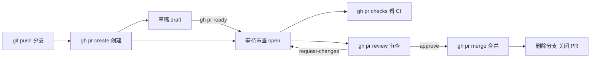

## 0. 开始之前：把 PR 流程装进终端

网页上提交一个 PR 需要：切页面、选分支、填标题、点按钮；审查一个 PR 又要：看 diff、点 Approve、盯 CI 绿灯。这些动作的共同点是——**都不需要鼠标**。`gh pr` 系列命令把 PR 的整个生命周期搬进终端，让你在写代码的同一个窗口里完成创建、审查、合并，就像把"请假单的递交流程"从跑各个办公室签字简化成在公司群里发一条消息。

前置知识：需要先完成 gh 认证（见 github/450-GhCliAuth）；PR 的协作机制（review 类型、合并方式）见 github/180-PullRequestCompleteCollaborationFlow。本篇聚焦"怎么用命令做"。

PR 的生命周期与各阶段对应的 gh 命令：



## 1. 创建 PR：gh pr create

### 1.1 交互式创建（首次推荐）

```bash
# 1. 从 main 拉出功能分支并提交代码
git checkout -b feature/oauth-login
git add .
git commit -m "feat: 实现 OAuth 登录流程"
git push -u origin feature/oauth-login

# 2. 交互式创建 PR：依次询问目标仓库、base 分支、标题、正文
gh pr create
```

gh 会根据你当前推送的分支自动推断 `head`，你只需确认 `base`（通常是 main）并填写标题描述。若分支还没有远程对应，gh 会在创建 PR 时顺带推送。

### 1.2 一步到位的完整参数版

```bash
# 指定标题、正文、目标分支与来源分支，一次创建
gh pr create \
  --title "feat: 添加用户认证" \
  --body "实现 OAuth 登录流程，关联 #42" \
  --base main \
  --head feature/oauth-login

# 常用附加参数：审查人、经办人、标签、里程碑
gh pr create \
  --title "feat: 添加用户认证" \
  --body "实现 OAuth 登录流程" \
  --reviewer alice,bob \
  --assignee @me \
  --label enhancement \
  --milestone "v2.0"
```

`@me` 是 gh 内置的"当前登录用户"占位符，在所有 gh 命令中通用。`--body` 里写 `#42` 会自动把 Issue 42 关联到这个 PR。

### 1.3 快捷方式

```bash
# 用提交信息自动填充标题与正文
gh pr create --fill

# 创建草稿 PR：代码还没写完，先挂出来收集意见
gh pr create --draft --title "WIP: 重构认证模块"

# 打开浏览器进入 compare 页面（想用网页 UI 时）
gh pr create --web
```

`--fill` 的取材规则：标题取提交主题行，正文取提交正文并附上提交清单。团队约定"一个分支一个干净的提交"时非常好用。

## 2. 查看 PR：list、view、status

```bash
# 列出当前仓库的开放 PR（默认按创建时间倒序）
gh pr list

# 按状态/作者/标签过滤
gh pr list --state open --author @me
gh pr list --state merged --limit 10
gh pr list --label "needs-review"

# 结构化输出：JSON + jq 过滤（脚本友好）
gh pr list --json number,title,author --jq '.[] | "\(.number) \(.title)"'

# 查看单个 PR 详情（含审查状态、CI 概览、描述）
gh pr view 42

# 带评论区一起看
gh pr view 42 --comments

# 在浏览器打开（补充网页操作时）
gh pr view 42 --web

# 一条命令总览"与我相关"的三类 PR：等待我审查 / 我创建的 / 提到我的
gh pr status
```

日常节奏建议：早上 `gh pr status` 扫一眼需要自己处理的 PR，工作中 `gh pr checks` 盯 CI，下班前 `gh pr list --author @me` 收尾。

## 3. 审查前功课：checkout 与 diff

审查别人的 PR 时，先在本地把代码拉下来跑一跑，比只看网页 diff 靠谱得多：

```bash
# 把 PR #42 的代码检出到本地同名分支（并自动关联远程分支）
gh pr checkout 42

# 本地跑测试验证
npm test

# 只看改动的文件清单
gh pr diff 42 --name-only

# 查看完整 diff（相当于 git diff base...head）
gh pr diff 42
```

`gh pr checkout` 是审查工作流的关键一步：检出的分支在审查过程中若被作者更新，`git pull` 一下即可同步。

## 4. CI 检查：gh pr checks

```bash
# 查看 PR 的所有 CI 检查状态
gh pr checks 42

# 持续等待直到所有检查结束（失败时命令以非零码退出）
gh pr checks 42 --watch
```

典型输出：

```text
test    CI / test (ubuntu-latest)    pass   2m40s   https://...
lint    CI / lint                    pass   45s     https://...
build   CI / build                   fail   1m12s   https://...
```

所有检查通过后才能走合并（若仓库配置了分支保护/规则集，这是硬性要求）。`--watch` 适合"提交完就等结果"的场景，失败会立即以非零退出码返回，方便接到脚本里。

## 5. 提交审查结论：gh pr review

```bash
# 批准并附一句评语
gh pr review 42 --approve --body "逻辑清晰，测试覆盖到位"

# 请求修改（阻塞合并，直到作者重新提交）
gh pr review 42 --request-changes --body "第 3 处未处理空指针"

# 只留评论（不表态）
gh pr review 42 --comment --body "有个小问题先讨论一下"
```

三种结论对应网页端的 Approve / Request changes / Comment。**request-changes 是阻塞式审查**：作者修改并推送后，原审查人需要重新提交 review（或撤销 request-changes）才能解除阻塞。

## 6. 合并：gh pr merge

```bash
# 三种合并策略：保留全部提交 / 压成一个提交 / 变基追加
gh pr merge 42 --merge            # 创建一个 merge commit
gh pr merge 42 --squash           # 压缩为一个提交（保持主线整洁）
gh pr merge 42 --rebase           # 将提交变基后直接追加到 base

# 合并并删除远程与本地功能分支（最常用的收尾组合）
gh pr merge 42 --squash --delete-branch

# 自动合并：条件满足（审查通过 + CI 绿灯）后由 GitHub 代为执行
gh pr merge 42 --auto --squash
```

三种策略的选择经验：开源项目偏好 `--squash`（一个 PR 一个提交，历史干净）；强调过程可追溯的团队用 `--merge`；`--rebase` 适合线性历史且提交本身质量高的场景。**`--auto` 的价值**在于"先挂上，条件满足自动合"，避免人肉盯 CI。

> 注意：合并按钮是否可用由仓库的分支保护/规则集决定（见 github/170-BranchModelBranchRule）。若仓库启用了 merge queue（合并队列），`--auto` 会把 PR 排入队列由队列统一调度。

## 7. 生命周期收尾：ready、edit、close、reopen

```bash
# 草稿转正（ready 后才能被合并）
gh pr ready 42

# 修改标题/描述、追加审查人、补标签
gh pr edit 42 --title "feat: 添加用户认证（含单测）"
gh pr edit 42 --add-reviewer carol --add-label "priority:high"

# 关闭与重开（附一条说明）
gh pr close 42 --comment "方案调整，由 #57 代替"
gh pr reopen 42
```

## 8. 常见错误与对策

| 常见错误 | 报错/现象 | 原因 | 解决办法 |
| --- | --- | --- | --- |
| base 分支选错 | PR 显示要合到 develop | 分支推断或手误 | `gh pr edit 42 --base main` 改目标分支 |
| 创建/操作失败 | `GraphQL: Could not resolve to a PullRequest` | 编号/仓库不对，或不在仓库目录内 | `cd` 到仓库目录；`gh pr list` 确认编号 |
| 无法合并 | merge blocked 提示 | 分支保护要求审查/CI 未满足 | `gh pr checks` 与 review 状态逐一核对 |
| 草稿无法合并 | 提示 draft 不可 merge | 草稿状态 PR 禁止合并 | `gh pr ready` 转正后再合 |
| --auto 无效 | 提示 auto-merge not allowed | 仓库未开启 auto-merge 功能 | 仓库设置中允许 auto-merge，或改手动合并 |
| 权限不足 | `resource not accessible` | token 缺 `repo` scope 或非仓库成员 | 补授权（`gh auth refresh -s repo`）或联系管理员 |
| PR 太旧无法合并 | base 已大幅变动 | 落后太多需要更新 | `gh pr checkout` 后 `git fetch && git rebase` 再 push |

## 9. 实战场景：一天的高频命令串

```bash
# 早晨：看看有哪些 PR 在等我
gh pr status

# 审查同事的 PR：本地跑一遍
gh pr checkout 42 && npm test
gh pr review 42 --approve -b "LGTM"

# 自己的 PR：挂自动合并然后继续写代码
gh pr merge 55 --auto --squash --delete-branch
gh pr checks 55 --watch   # 想立刻确认结果时
```

## 10. 小结

**初学者要点**

- 标准四步：`git push` → `gh pr create --fill`（或交互式）→ `gh pr checks` → `gh pr merge --squash --delete-branch`。
- `gh pr status` 与 `gh pr list` 是入口；`@me` 代指当前登录用户。
- 审查三态：`--approve`（通过）、`--request-changes`（阻塞）、`--comment`（仅评论）。

**进阶注意**

- `--auto` 依赖仓库开启 auto-merge；启用 merge queue 的仓库由队列调度合并时机。
- 合并策略影响主历史形态，团队应统一约定（squash 最常见）。
- 脚本中用 `--json ... --jq` 做结构化过滤，避免解析人类可读输出。

### 延伸阅读

- PR 协作机制、review 语义与合并策略详解，见 github/180-PullRequestCompleteCollaborationFlow。
- gh 认证与环境变量，见 github/450-GhCliAuth。
- Issue 的命令行管理，见 github/470-GhIssueManage。
