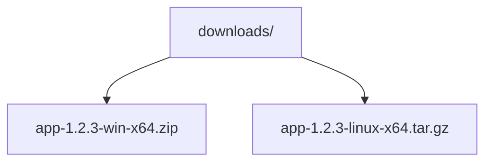

## 开篇：把发布当成一场新专辑发布会

想象你是一位歌手，写完了整张专辑的歌曲（代码写完了），现在准备正式发行。发行不是把歌往网上一扔就完事，而是一场"发布会"：

- 你要起一个版本号（比如"第三张专辑"），对应代码里的**标签（tag）**；
- 你要写一段"专辑介绍"（发布说明 Release Notes），告诉大家这版有哪些新歌、修了哪些问题；
- 你要把实体唱片和周边（**构建产物**，如安装包、压缩包）摆上货架；
- 粉丝（用户）来下载、反馈，必要时你还要发"加印版"（补传文件）甚至"召回"（删除发布）。

GitHub 的 **Release（发布）** 就是软件世界的"新专辑发布会"。`gh release` 系列命令，就是让你**不开网页、只敲键盘**就能完成整场发布会。

---

## 旅程地图：从代码到正式发布的 6 站

把发布看成一段旅程，`gh release` 的每个子命令对应一站：

| 站点 | 做什么 | 对应命令 |
| --- | --- | --- |
| 第 1 站 | 打版本号（标签）+ 写发布会文案 + 创建发布 | `gh release create` |
| 第 2 站 | 看看历史上有过哪些发布、详情如何 | `gh release list` / `gh release view` |
| 第 3 站 | 把安装包、压缩包等产物上传或下载 | `gh release upload` / `gh release download` |
| 第 4 站 | 补充说明、修正标题、撤回草稿 | `gh release edit` |
| 第 5 站 | 删除发布（可连标签一起删） | `gh release delete` |
| 第 6 站 | 用 JSON 输出对接脚本自动化 | 各命令的 `--json` / `--jq` 选项 |

下面我们一站一站走完这段旅程。**强烈建议**你先在终端执行 `gh auth login` 完成登录（见《GhCliAuth》文档），并在一个你自己的仓库里实际演练。

---

## 原理先讲清：Release 与 Tag 是什么关系

很多初学者把 Release 和 Tag 混为一谈，先厘清概念：

- **Tag（标签）**：Git 里的一个"书签"，标记某一次提交（commit）。它轻量、只是代码层面的记号。你可以用 `git tag v1.0.0` 打标签。
- **Release（发布）**：GitHub 在 Tag 基础上包装出来的一层"展示与分发"功能。它包含发布标题、说明文字、附件（二进制文件），还会生成一个下载页面。

用专辑类比：Tag 相当于"这张专辑的母带编号"，Release 相当于"摆在商店里的正式商品（含封面、内页文案、周边）"。

`gh release create` 有一个贴心行为：**如果指定的 Tag 还不存在，它会自动帮你从默认分支的最新状态创建这个 Tag**。如果你想从别的分支或某次具体提交发布，用 `--target` 指定。

发布创建成功后，本地仓库可能还没有这个新 Tag，需要执行 `git fetch --tags origin` 把它拉下来。

---

## 第 1 站：创建发布（gh release create）

`gh release create` 是最核心的命令，基本格式：

```bash
gh release create [<标签>] [<文件>... | <模式>...]
```

### 1.1 最简方式：交互式创建

```bash
# 不带任何参数，gh 会像向导一样一步步问你：选哪个标签、写什么说明
gh release create
```

### 1.2 非交互式：一步到位

```bash
# 用 v1.2.3 作为标签，附上发布说明
gh release create v1.2.3 --notes "bugfix release"

# 用 GitHub 的 Release Notes API 自动生成更新日志（自动对比上次发布以来的提交）
gh release create v1.2.3 --generate-notes

# 从文件读取发布说明（适合说明很长、提前写好的场景）
gh release create v1.2.3 -F release-notes.md

# 从标签注解或对应提交信息读取发布说明
gh release create v1.2.3 --notes-from-tag
```

### 1.3 控制发布属性

```bash
# 标记为预发布（测试版，页面上会特殊提示）
gh release create v1.3.0-beta.1 --prerelease --notes "测试版本"

# 先存为草稿，不对外可见，确认无误后再编辑发布
gh release create v1.2.3 --draft

# 明确指定本次发布不作为 "Latest（最新版）"
gh release create v1.2.3 --latest=false

# 指定从 develop 分支（或某次提交 SHA）创建自动 Tag
gh release create v1.2.3 --target develop --notes "从 develop 分支发布"

# 校验 Tag 必须已存在于远端，否则中止（防止误建新 Tag）
gh release create v1.2.3 --verify-tag --notes "已打好的标签"

# 只有自上次发布以来有新提交才创建，否则报错退出（避免重复发布）
gh release create v1.2.3 --fail-on-no-commits
```

### 1.4 顺便上传构建产物

创建发布时可以**同时**上传产物（相当于发布会现场直接摆货）：

```bash
# 把 dist 目录下所有 tgz 包作为附件上传
gh release create v1.2.3 ./dist/*.tgz

# 给附件起一个"显示名"，用 # 分隔（下载页会显示这个友好名称）
gh release create v1.2.3 '/path/to/asset.zip#Windows 安装包'

# 发布的同时在仓库讨论区开一个新话题
gh release create v1.2.3 --discussion-category "General"
```

创建成功后，终端会打印类似输出：

```text
Created release v1.2.3 on owner/repo
https://github.com/owner/repo/releases/tag/v1.2.3
```

---

## 第 2 站：查看发布（gh release list / view）

发布完要检查成果，发布会也要让观众"回头翻录像"。

```bash
# 列出仓库所有发布（默认最新在前）
gh release list

# 只显示最近 5 条
gh release list --limit 5

# 查看某个具体发布的详情（说明文字、附件清单、发布时间等）
gh release view v1.2.3

# 不写标签名，默认查看"最新发布"
gh release view

# 在浏览器中打开发布页面
gh release view v1.2.3 --web

# 输出 JSON 供脚本处理（字段有 tagName、name、isDraft、assets 等）
gh release view v1.2.3 --json tagName,isDraft,assets

# 用 jq 语法只取附件名
gh release view v1.2.3 --jq '.assets[].name'
```

`gh release list` 的典型输出：

```text
TITLE           TAG       PRERELEASE  CREATED_AT
v1.2.3 正式版   v1.2.3                about 2 minutes ago
v1.2.2          v1.2.2                about 3 days ago
v1.3.0 测试版   v1.3.0-beta.1  是     about 1 week ago
```

---

## 第 3 站：上传与下载产物（gh release upload / download）

软件的"货"（安装包、文档包）往往是在发布之后才构建出来的，因此需要**补货**和**取货**。

### 3.1 上传（补货）

```bash
# 给已存在的 v1.2.3 发布追加一个文件
gh release upload v1.2.3 ./build/app.exe

# 上传多个文件（支持通配符）
gh release upload v1.2.3 ./build/*.dmg ./build/*.deb

# 同名文件已存在时，先覆盖再上传（--clobber 意为"覆盖"）
gh release upload v1.2.3 ./app.zip --clobber
```

### 3.2 下载（取货）

```bash
# 下载该发布的所有附件到当前目录
gh release download v1.2.3

# 只下载 zip 文件（--pattern 支持通配符）
gh release download v1.2.3 --pattern "*.zip"

# 下载到指定目录
gh release download v1.2.3 --dir ./downloads

# 下载"最新发布"的附件
gh release download --pattern "*.dmg"
```

下载完成后目录里会出现对应的文件，例如：



---

## 第 4 站：编辑发布（gh release edit）

发布会开完了，发现介绍里有个错别字，或者想把"测试版"转正：

```bash
# 修改标题与说明
gh release edit v1.2.3 --title "v1.2.3 正式版" --notes "更新说明：修复登录闪退"

# 从文件读取新的说明
gh release edit v1.2.3 -F new-notes.md

# 把已发布的版本收回为草稿（相当于"暂时下架"）
gh release edit v1.2.3 --draft

# 去掉预发布标记，正式转正
gh release edit v1.3.0-beta.1 --prerelease=false

# 改为最新发布
gh release edit v1.2.2 --latest
```

---

## 第 5 站：删除发布（gh release delete）

```bash
# 删除发布（--yes 跳过二次确认；注意：默认不会删除 Tag）
gh release delete v1.2.3 --yes

# 删除发布的同时清理对应的 Tag（--cleanup-tag）
gh release delete v1.2.3 --cleanup-tag --yes
```

> 注意：删除 Release 并不会自动删除 Git 标签，代码历史依然保留。是否连标签一起删，取决于你是否还想保留这个"版本记号"。

---

## 完整旅程串联：一次真实的发布脚本

把 6 站连起来，就是一个可复制的小脚本（以发布 Windows 版本为例）：

```bash
# 第 0 步：确认登录状态
gh auth status

# 第 1 步：构建产物
npm run build

# 第 2 步：自动创建发布 + 自动生成说明 + 上传安装包
gh release create v2.0.0 \
  --generate-notes \
  --title "v2.0.0 全新界面" \
  ./dist/app-win-x64.zip \
  ./dist/app-linux-x64.tar.gz

# 第 3 步：验证创建结果
gh release view v2.0.0 --json tagName,name,assets

# 第 4 步：补充漏传的说明文档
gh release upload v2.0.0 ./CHANGELOG.md --clobber

# 第 5 步：本地同步新标签
git fetch --tags origin
```

---

## 常见错误与对策

| 新手常见错误 | 报错/现象 | 原因 | 解决办法 |
| --- | --- | --- | --- |
| 未登录就创建发布 | `To get started with GitHub CLI, please run: gh auth login` | 操作需要身份认证 | 先执行 `gh auth login` 完成登录 |
| 在错误目录执行 | `could not determine current repo` | gh 找不到当前仓库 | 先 `cd` 到仓库目录，或加 `-R owner/repo` 指定仓库 |
| 附件文件名含空格 | 报 `unexpected argument` 或上传失败 | 文件名被 shell 拆成多个参数 | 用引号包裹：`gh release upload v1.0.0 "my app.zip"` |
| 重复上传同名附件 | `failed to upload asset: already exists` | 附件已存在且未被覆盖 | 加 `--clobber` 覆盖，或先下载删除再传 |
| 想从非默认分支发布 | 自动创建的 Tag 指向 main | 忘了指定目标分支 | 加 `--target <branch>` 或指定提交 SHA |
| 发布后发现 Tag 不存在 | `release created but tag not found locally` | 新 Tag 只存在于远端 | 执行 `git fetch --tags origin` |
| 误删发布 | 页面找不到该版本 | `delete` 默认只删发布不删 Tag | 保留 Tag 可随时用 `gh release create <tag>` 重建发布；如已 `--cleanup-tag`，需用 `git push origin --tags` 重新推送标签 |

---

## 一句话记忆

**Release = 带说明、带附件的"货架商品"，`gh release create` 一键上架，`upload/download` 负责补货取货，`edit/delete` 负责售后。**
