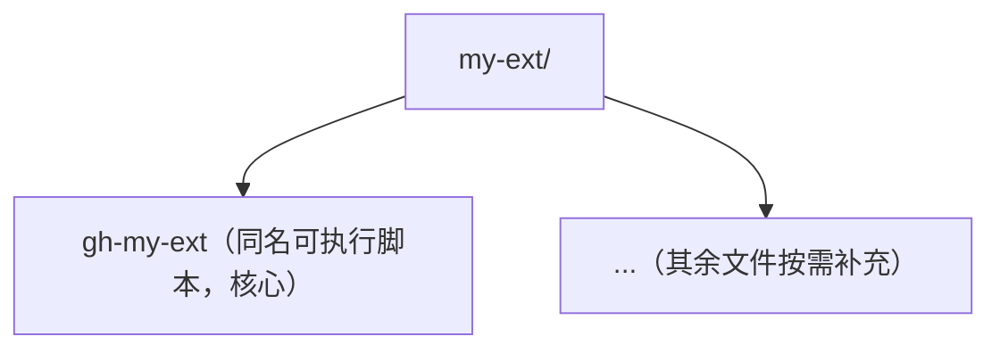

## 开篇：把扩展想成手机 App 应用商店

你的手机出厂时只带系统应用（打电话、发短信、拍照）。但真正让它"强大"的，是你从**应用商店**里安装的各种 App：记账的、修图的、看天气的。每一个 App 都是第三方开发者做好、上传到商店的，你一键安装即可使用，不满意就卸载，更新了版本就升级。

**gh（GitHub CLI）扩展（Extension）** 完全同理：gh 出厂时只有一套内置命令（`gh repo`、`gh issue`、`gh pr` 等），但这套"系统"开放了一个**扩展机制**——任何人都能开发一个小工具，把它做成仓库发布到 GitHub，其他人就能像装 App 一样安装它，获得一个全新的 `gh xxx` 子命令。

本文以"逛商店 → 安装 → 管理 → 开发"的 App 使用动线为线索，带你玩转 `gh extension`。

---

## 原理先讲清：扩展到底是什么

### 2.1 命名规则与工作机制

一个扩展本质上是一个 **GitHub 仓库**，有两个硬性要求：

- 仓库名必须以 `gh-` 开头（如 `gh-dash`）；
- 仓库内必须有一个**与仓库同名的可执行文件**（如 `gh-dash` 这个脚本或编译产物）。

安装后，你在终端敲 `gh dash`，gh 会找到名为 `gh-dash` 的可执行文件，并把**后续的所有参数原样转发**给它。整个过程就像：你的"系统"（gh）多了一个新按钮，按下后由"App"（扩展）处理。

### 2.2 两种扩展形态

| 形态 | 说明 | 例子 |
| --- | --- | --- |
| 脚本扩展（script extension） | 仓库根目录放一个同名可执行脚本（Bash、Python 等），gh 直接把仓库克隆下来用 | 大多数社区小工具 |
| 预编译扩展（precompiled extension） | 发布时把编译好的二进制作为 Release 附件上传，gh 优先下载 Release 附件，速度更快 | 大型 Go 编写的工具 |

gh 安装远端仓库时会先检查：有没有 Release 二进制？有，按预编译扩展处理；没有，就克隆仓库当脚本扩展处理。

### 2.3 安全提示（必须知道）

- **扩展不是 GitHub 官方验证、签名或背书的**。安装和升级扩展，等于信任它的发布者。
- 官方文档明确提示：安装前应自己审查扩展的源码和来源（`gh extension browse <名字>` 直接看仓库）。
- 扩展会定期（每 24 小时）检查新版本并提示升级，可通过环境变量关闭提示（详见 `gh help environment`）。
- 扩展**不能覆盖** gh 的内置命令；若名字与内置命令冲突，可用 `gh extension exec <名字>` 强制调用。

扩展生态的官方发现入口：https://github.com/topics/gh-extension

---

## 第 1 步：逛商店（gh extension search / browse）

装 App 前先逛逛商店，看看有什么好东西。

```bash
# 按关键词搜索扩展
gh extension search notify

# 搜索 dash（仪表盘类工具）
gh extension search dashboard

# 在浏览器中打开扩展仓库主页（浏览源码、看说明、看 star 数）
gh extension browse gh-dash

# browse 也接受完整的 owner/repo 格式
gh extension browse dlvhdr/gh-dash
```

`gh extension search` 会返回扩展名与描述，例如：

```text
dlvhdr/gh-dash
A beautiful CLI dashboard for GitHub
github.com/nektos/gh-act  (这类工具常被社区扩展化)
...
```

> 提示：`gh extension search` 并非搜索所有 GitHub 仓库，而是基于 GitHub 搜索过滤"扩展类"仓库；更全面的发现方式是在网页端搜索 `topic:gh-extension`。

---

## 第 2 步：安装（gh extension install）

```bash
# 最常用：按 owner/repo 格式安装
gh extension install dlvhdr/gh-dash

# 支持完整 URL（尤其当仓库不在 github.com 上时）
gh extension install https://ghe.example.com/owner/gh-extension

# 固定版本安装（--pin 指定标签或提交；脚本扩展用 commit SHA，预编译扩展用 Release tag）
gh extension install dlvhdr/gh-dash --pin v2.0.0

# 强制升级已安装的扩展（相当于"重新安装最新版"）
gh extension install dlvhdr/gh-dash --force

# 从本地目录安装（开发扩展时用，详见第 5 步）
gh extension install .
```

安装成功后的提示与验证：

```bash
# 查看是否安装成功
gh extension list

# 直接调用这个新命令
gh dash
```

---

## 第 3 步：管理已安装的扩展（list / upgrade / remove）

App 装多了要管理：看装了哪些、升级、卸载。

### 3.1 列出已安装扩展

```bash
# 列出所有已安装扩展
gh extension list
```

典型输出：

```text
gh dash  dlvhdr/gh-dash  v2.0.0
gh act   nektos/gh-act   v0.2.50
```

### 3.2 升级扩展

```bash
# 升级所有已安装扩展
gh extension upgrade --all

# 只升级某一个
gh extension upgrade gh-dash

# 升级时强制覆盖（--force 可用于跳过"已是最新"的判定）
gh extension upgrade gh-dash --force
```

### 3.3 移除扩展

```bash
# 卸载某个扩展
gh extension remove gh-dash

# 卸载后确认
gh extension list
```

---

## 第 4 步：在浏览器里继续"逛"与评估

```bash
# 打开扩展的 GitHub 仓库主页
gh extension browse gh-dash

# 查看它的 star、Issues、最近提交，判断是否活跃维护
gh repo view dlvhdr/gh-dash
```

评估一个扩展是否可信、值得装的几个要点：

1. **star 数与活跃度**：star 太少、长期不更新（最后一次提交在一年前）的慎用；
2. **代码审查**：重点看它执行了什么命令、是否会上传数据；
3. **许可证**：确认有开源许可证（如 MIT、Apache-2.0）；
4. **作者声誉**：知名开发者/组织的扩展通常更可靠。

---

## 第 5 步：自己开发一个扩展（create / 本地安装）

gh 提供的扩展机制让"自己做一个 App"非常简单，不需要任何审核。

### 5.1 生成脚手架

```bash
# 交互式创建（会问你扩展名等）
gh extension create

# 创建一个脚本扩展（默认生成一个同名可执行脚本模板）
gh extension create my-ext

# 创建 Go 语言的预编译扩展
gh extension create --precompiled=go my-ext

# 创建非 Go 的预编译扩展（如 Rust 等）
gh extension create --precompiled=other my-ext
```

以脚本扩展为例，生成的结构大致是：



### 5.2 本地开发调试

```bash
# 进入生成的扩展目录，以"本地安装"方式挂载（符号链接方式，改代码即时生效）
cd my-ext
gh extension install .
```

之后你就能在终端里敲 `gh my-ext` 调试它。每次改完代码直接再执行一次即可，无需重新安装。

> 注意：预编译扩展需要手动构建，并把编译产物放到仓库根目录，命名为与仓库同名的可执行文件，否则运行时会报"找不到可执行文件"。

### 5.3 发布扩展

把仓库推送到 GitHub 即可（仓库名保持 `gh-` 开头）。若做预编译扩展，还需要打 Release 并上传各平台的二进制附件。发布后别人就能 `gh extension install 你的名字/gh-my-ext`。

---

## 一张动线图：App 商店与 gh extension 一一对应

| 手机 App 商店 | gh extension | 对应命令 |
| --- | --- | --- |
| 逛商店搜 App | 搜索扩展 | `gh extension search` |
| 查看 App 详情 | 浏览扩展仓库 | `gh extension browse` |
| 安装 App | 安装扩展 | `gh extension install` |
| 看已装 App | 列出扩展 | `gh extension list` |
| 更新 App | 升级扩展 | `gh extension upgrade` |
| 卸载 App | 移除扩展 | `gh extension remove` |
| 开发者上传 App | 创建并发布扩展 | `gh extension create` + 推送仓库 |

---

## 常见错误与对策

| 新手常见错误 | 报错/现象 | 原因 | 解决办法 |
| --- | --- | --- | --- |
| 仓库名不以 gh- 开头 | 安装成功但命令无法识别 | 扩展命名不符合规范 | 仓库名必须是 `gh-xxx` 形式 |
| 缺少同名可执行文件 | 运行时报 `command not found` 或执行失败 | 仓库根目录没有 `gh-xxx` 可执行文件 | 确认可执行文件存在且具可执行权限（Unix 用 `chmod +x`）；预编译扩展需先构建 |
| 与内置命令同名 | 敲的命令仍是内置行为 | 扩展不能覆盖内置命令 | 用 `gh extension exec <名字>` 强制调用扩展 |
| 安装时网络/版本问题 | `--pin` 的 tag 不存在 | 指定的 Release 标签或 commit 写错 | 到仓库 Releases 页核对标签名 |
| 装到可疑扩展 | 行为异常、疑似窃取数据 | 扩展来自不可信发布者 | 安装前用 `browse` 审查源码；如已装，`remove` 卸载并改密相关令牌 |
| 本地开发找不到可执行文件 | `no executable file found` | 预编译扩展未构建产物 | 先手动构建，将产物放到仓库根目录再 `install .` |
| 升级报错 | `failed to upgrade` | 网络或仓库已被删除/改名 | 检查仓库是否仍存在；必要时 `remove` 后重新 `install` |

---

## 一句话记忆

**扩展就是 gh 的"App 商店"：`search/browse` 逛商店，`install` 安装，`list/upgrade/remove` 管理，`create` 自己做 App——安装前务必审查源码，因为 GitHub 不为扩展背书。**
