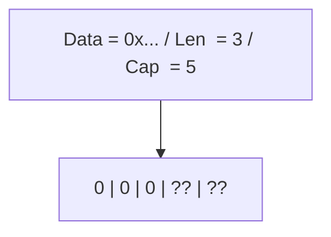

# Go 切片原理：从 SliceHeader 到扩容算法的深度剖析

## 前置知识

- [Go Web 开发与微服务](/go/012-GoWebDevelopmentMicroservice)：建议先完成前一篇的学习

## 学习目标

- 掌握「1. 历史动机与发展脉络」的核心机制、典型用法与常见陷阱
- 掌握「2. 形式化定义」的核心机制、典型用法与常见陷阱
- 掌握「3. 理论推导与原理解析」的核心机制、典型用法与常见陷阱
- 掌握「4. 代码示例」的核心机制、典型用法与常见陷阱
- 掌握「5. 对比分析」的核心机制、典型用法与常见陷阱


> 本文以 Go 1.22 为基准版本，覆盖 Go 1.0 至 Go 1.24 的切片实现演进，包括 `SliceHeader` 结构、`growslice` 扩容算法、内存对齐与逃逸分析、`copy` 与 `append` 的语义差异、子切片内存泄漏、切片技巧（slice tricks）与生产级最佳实践。适用于已掌握 Go 基础语法、希望深入理解切片底层实现的工程师。

---

## 1. 历史动机与发展脉络

### 1.1 切片的诞生背景（2007-2009）

Go 语言的设计目标之一是简化 C 语言中数组指针操作的复杂性。在 C 语言中，动态数组需要开发者手动管理 `malloc`/`realloc`/`free`，且长度信息需要额外传递。Go 的设计者 Robert Griesemer、Rob Pike、Ken Thompson 在 2007 年的设计草案中提出了切片（slice）的概念，作为对数组的轻量级引用封装。

**设计动机**：

1. **安全替代裸指针**：切片将指针、长度、容量三者封装在一个结构体中，避免了 C 语言中常见的越界访问与缓冲区溢出。
2. **动态扩容抽象**：开发者无需关心 `realloc` 的细节，`append` 函数自动处理扩容。
3. **零成本抽象**：切片本身只是一个 24 字节（64 位系统）的 struct，传递切片是值拷贝但共享底层数组，兼顾安全与性能。
4. **GC 友好**：切片的底层数组由 Go runtime 分配，GC 可自动追踪与回收。

### 1.2 Go 1.0 至 Go 1.17 的扩容算法

Go 1.0（2012 年）确立了 `growslice` 的基本算法：

```go
// Go 1.0 - 1.17 的扩容算法（简化版）
newcap := old.cap
doublecap := newcap + newcap
if cap > doublecap {
    newcap = cap
} else {
    if old.len < 1024 {
        newcap = doublecap
    } else {
        for newcap < cap {
            newcap += newcap / 4
        }
    }
}
```

**特点**：
- `cap < 1024` 时双倍扩容（2x）。
- `cap >= 1024` 时按 1.25x 扩容。
- 阈值 1024 是经验值，在小切片上双倍扩容的内存浪费可接受，在大切片上需要更保守的策略。

**问题**：
- 阈值 1024 导致扩容曲线在 1023 → 1024 处出现不连续跳变。
- 对于 1000-2000 元素的切片，扩容策略不够平滑。

### 1.3 Go 1.18 的扩容算法重构

Go 1.18（2022 年 3 月）对 `growslice` 进行了重大重构，引入平滑过渡公式：

```go
// Go 1.18+ 的扩容算法（简化版）
const threshold = 256

newcap := old.cap
doublecap := newcap + newcap
if cap > doublecap {
    newcap = cap
} else {
    if old.cap < threshold {
        newcap = doublecap
        return
    }
    for 0 < newcap && newcap < cap {
        // 平滑过渡：从 2x 逐渐过渡到 1.25x
        newcap += (newcap + 3*threshold) / 4
    }
    if newcap <= 0 {
        newcap = cap
    }
}
```

**改进点**：
1. 阈值从 1024 降至 256，更早开始平滑过渡。
2. 使用 `(newcap + 3*threshold) / 4` 公式，使增长率从 2x 平滑过渡到 1.25x。
3. 消除了 1023 → 1024 处的跳变，扩容曲线连续可微。

数学上，增长率 $g(n)$ 在 $n \to \infty$ 时趋近于 1.25：

$$
g(n) = 1 + \frac{1}{4} + \frac{3 \times 256}{4n} \xrightarrow{n \to \infty} 1.25
$$

### 1.4 Go 1.21 的 SSA 优化与切片操作

Go 1.21 进一步优化了切片操作的 SSA 中间表示：

- `slice := arr[low:high]` 在编译期被识别为"切片操作"，避免冗余的 bounds check。
- `append` 的快速路径（`len < cap`）被内联为几条机器指令。
- `copy` 对 `[]byte` 与 `string` 的互转使用 `runtime.memmove`，无 GC 写屏障开销。

### 1.5 Go 1.22+ 的迭代器协议

Go 1.23 引入的 range-over-func 机制与切片迭代器的标准化，使 `slices.Collect`、`slices.AppendSeq` 等泛型函数可以零成本与切片交互。切片作为 Go 中最核心的容器，其迭代语义从 `for i, v := range s` 扩展到 `for v := range slices.Values(s)`，为函数式编程风格提供了基础。

---

## 2. 形式化定义

### 2.1 SliceHeader 的形式化定义

切片在运行时由 `runtime.slice` 结构表示，在 `reflect` 包中暴露为 `SliceHeader`：

```go
type SliceHeader struct {
    Data uintptr  // 指向底层数组的指针
    Len  int      // 当前长度
    Cap  int      // 容量
}
```

形式化地，一个切片 $s$ 可以表示为三元组：

$$
s = \langle p, n, c \rangle
$$

其中：
- $p \in \mathbb{N}$ 是指向底层数组首元素的内存地址（virtual address）。
- $n \in \mathbb{N}_0$ 是当前长度，$n \geq 0$。
- $c \in \mathbb{N}_0$ 是容量，$c \geq n$。
- 底层数组的元素为 $a[0], a[1], \ldots, a[c-1]$，其中 $a[0..n-1]$ 可访问，$a[n..c-1]$ 为预留空间。

### 2.2 切片操作的形式化语义

切片表达式 `s[low:high]` 的形式化定义：

$$
\text{slice}(s, \text{low}, \text{high}) = \langle p + \text{low} \times \text{sizeof}(T),\ \text{high} - \text{low},\ c - \text{low} \rangle
$$

约束条件：
- $0 \leq \text{low} \leq \text{high} \leq c$
- 若 `low` 省略，默认为 0。
- 若 `high` 省略，默认为 $n$。

三索引切片 `s[low:high:max]`：

$$
\text{slice3}(s, \text{low}, \text{high}, \text{max}) = \langle p + \text{low} \times \text{sizeof}(T),\ \text{high} - \text{low},\ \text{max} - \text{low} \rangle
$$

约束条件：
- $0 \leq \text{low} \leq \text{high} \leq \text{max} \leq c$

### 2.3 append 操作的形式化语义

`append(s, x)` 的形式化定义：

$$
\text{append}(s, x) = \begin{cases}
\langle p, n+1, c \rangle & \text{if } n < c \quad \text{(原地追加)} \\
\langle p', n+1, c' \rangle & \text{if } n = c \quad \text{(扩容)}
\end{cases}
$$

其中扩容时：
- $p'$ 是新分配的内存地址。
- $c' = \text{growslice}(c)$ 是新容量（由扩容算法决定）。
- 新底层数组的前 $n$ 个元素从 $p$ 拷贝而来，第 $n+1$ 个元素为 $x$。

### 2.4 copy 操作的形式化语义

`copy(dst, src)` 的形式化定义：

$$
\text{copy}(dst, src) = \min(dst.n, src.n)
$$

返回值为实际拷贝的元素数量，逐元素从 `src.Data` 拷贝到 `dst.Data`。

---

## 3. 理论推导与原理解析

### 3.1 内存布局深度剖析

在 64 位系统上，`SliceHeader` 占用 24 字节：

```
偏移量   字段      大小      说明
0        Data      8 字节    底层数组指针
8        Len       8 字节    当前长度
16       Cap       8 字节    容量
```

切片变量的内存布局示意（以 `s := make([]int, 3, 5)` 为例，`int` 为 8 字节）：



**关键点**：
1. `SliceHeader` 本身在栈上（若未逃逸），底层数组在堆上。
2. `Data` 指针指向堆内存，GC 通过该指针追踪底层数组。
3. `Len` 与 `Cap` 之间的元素（如上图 `?? ??`）是预留空间，内存已分配但未初始化。

### 3.2 扩容算法的完整推导

Go 1.18+ 的 `growslice` 算法（`src/runtime/slice.go`）核心逻辑：

```go
// 简化版，省略内存对齐处理
func growslice(old slice, cap int) slice {
    newcap := old.cap
    doublecap := newcap + newcap
    if cap > doublecap {
        newcap = cap
    } else {
        const threshold = 256
        if old.cap < threshold {
            newcap = doublecap
        } else {
            for 0 < newcap && newcap < cap {
                newcap += (newcap + 3*threshold) / 4
            }
            if newcap <= 0 {
                newcap = cap
            }
        }
    }
    // ... 内存对齐与分配
}
```

**扩容曲线对比**（Go 1.17 vs Go 1.18）：

| oldcap | Go 1.17 newcap | Go 1.18 newcap | 增长率 1.17 | 增长率 1.18 |
|--------|----------------|----------------|-------------|-------------|
| 1      | 2              | 2              | 2.00x       | 2.00x       |
| 100    | 200            | 200            | 2.00x       | 2.00x       |
| 255    | 510            | 510            | 2.00x       | 2.00x       |
| 256    | 512            | 512            | 2.00x       | 2.00x       |
| 257    | 514            | 448            | 2.00x       | 1.74x       |
| 512    | 1024           | 832            | 2.00x       | 1.63x       |
| 1024   | 1280           | 1472           | 1.25x       | 1.44x       |
| 2048   | 2560           | 2752           | 1.25x       | 1.34x       |
| 4096   | 5120           | 5312           | 1.25x       | 1.30x       |
| 65536  | 81920          | 83712          | 1.25x       | 1.28x       |

**数学推导**：

Go 1.18 的增长率公式：

$$
g(n) = \frac{n + \frac{n + 3 \times 256}{4}}{n} = 1 + \frac{1}{4} + \frac{192}{n}
$$

当 $n \to \infty$ 时，$g(n) \to 1.25$。在 $n = 256$ 时，$g(256) = 1.25 + 0.75 = 2.00$，与双倍扩容衔接。

### 3.3 内存对齐与实际分配

扩容算法计算出的 `newcap` 是逻辑容量，实际分配的内存需要考虑内存对齐。Go runtime 使用 `roundupsize` 函数将容量向上取整到最近的大小类别（size class）：

```go
// 内存对齐后的实际分配
var overflow bool
var lenmem, capmem uintptr
switch {
case et.size == 1:
    lenmem = uintptr(old.len)
    capmem = roundupsize(uintptr(newcap))
    overflow = uintptr(newcap) > maxAlloc
    newcap = int(capmem)
case et.size == goarch.PtrSize:
    lenmem = uintptr(old.len) * goarch.PtrSize
    capmem = roundupsize(uintptr(newcap) * goarch.PtrSize)
    overflow = uintptr(newcap) > maxAlloc/goarch.PtrSize
    newcap = int(capmem / goarch.PtrSize)
// ... 其他类型
}
```

`roundupsize` 根据 `mallocgc` 的 size class 表对齐：

- 小对象（< 32KB）：对齐到 `runtime.class_to_size` 中的最近类别。
- 大对象（>= 32KB）：对齐到 page size（8KB）。

**示例**：`make([]int, 0, 5)` 的 `newcap = 5`，但 `int` 占 8 字节，总内存 40 字节，对齐到 48 字节（size class 5），实际 `cap = 6`。

### 3.4 append 的完整调用链

`append(s, x)` 的完整执行流程：

1. **编译期**：编译器将 `append` 转换为 `runtime.growslice` 或内联的快速路径。
2. **快速路径**（`len < cap`）：直接写入 `Data[len]`，`Len++`，无需分配。
3. **慢速路径**（`len == cap`）：
   - 调用 `runtime.growslice` 计算新容量。
   - 调用 `runtime.mallocgc` 分配新底层数组。
   - 调用 `runtime.typedslicecopy`（或 `runtime.memmove`）拷贝旧元素。
   - 写入新元素，更新 `Data`、`Len`、`Cap`。

**SSA 优化**：Go 1.21+ 的 SSA 后端会将快速路径优化为：

```asm
; s := append(s, x) 的快速路径（伪汇编）
MOVQ  s.Data, AX       ; 加载 Data 指针
MOVQ  s.Len, BX        ; 加载 Len
MOVQ  s.Cap, CX        ; 加载 Cap
CMPQ  BX, CX           ; 比较 Len 与 Cap
JEQ   slow_path        ; Len == Cap，跳转到慢速路径
MOVQ  x, (AX)(BX*8)    ; Data[Len] = x
INCQ  BX               ; Len++
MOVQ  BX, s.Len        ; 写回 Len
```

### 3.5 切片的 GC 行为

切片的底层数组由 GC 追踪与回收。关键点：

1. **可达性分析**：GC 从根集出发，追踪 `SliceHeader.Data` 指针，标记底层数组为存活。
2. **写屏障**：当 `Data` 指针被修改时（如 `append` 扩容），触发写屏障确保并发标记的正确性。
3. **子切片引用**：即使只保留子切片 `s[1000:]`，整个底层数组（包括 `s[0:1000]`）也不会被回收，因为 `Data` 指针仍指向数组头部。

**内存泄漏示例**：

```go
func leak() {
    big := make([]byte, 1<<20)  // 1MB
    small := big[0:1]            // 只保留 1 字节
    _ = small                    // 但 big 的 1MB 不会被回收
}
```

**解决方案**：使用 `copy` 创建独立底层数组：

```go
func noLeak() {
    big := make([]byte, 1<<20)
    small := make([]byte, 1)
    copy(small, big[0:1])
    _ = small  // big 的 1MB 可被回收
}
```

### 3.6 切片与逃逸分析

切片的分配位置（栈 vs 堆）由逃逸分析决定：

```go
func stackAlloc() {
    s := make([]int, 10)  // 栈分配（未逃逸）
    _ = s
}

func heapAlloc() []int {
    s := make([]int, 10)  // 堆分配（返回值逃逸）
    return s
}
```

**逃逸规则**：
1. 切片作为返回值返回 → 堆分配。
2. 切片被存入全局变量或接口 → 堆分配。
3. 切片大小在编译期不可确定（如 `make([]int, n)`，`n` 为变量）→ 堆分配。
4. 切片大小为常量且未逃逸 → 栈分配。

使用 `go build -gcflags="-m"` 查看逃逸分析结果：

```
./main.go:3: make([]int, 10) does not escape
./main.go:7: make([]int, 10) escapes to heap
```

---

## 4. 代码示例

### 4.1 切片的基础操作

```go
package main

import "fmt"

func main() {
    // 1. 三种构造方式
    var s1 []int              // nil 切片，len=0, cap=0, s1 == nil
    s2 := []int{}             // 空切片，len=0, cap=0, s2 != nil
    s3 := make([]int, 0, 5)   // 预分配切片，len=0, cap=5

    fmt.Println(s1 == nil, s2 == nil, s3 == nil) // true false false

    // 2. append 操作
    s := make([]int, 0, 3)
    s = append(s, 1, 2, 3) // len=3, cap=3
    s = append(s, 4)       // len=4, cap=6（扩容，新底层数组）

    // 3. 切片表达式
    sub := s[1:3] // sub = [2, 3]，与 s 共享底层数组
    sub[0] = 20   // 修改 sub 会影响 s
    fmt.Println(s[1]) // 输出 20

    // 4. 三索引切片
    s4 := make([]int, 5, 10)
    sub4 := s4[1:3:3] // len=2, cap=2，限制容量
    // sub4 = append(sub4, 100) // 不会影响 s4，因为 cap 不足会扩容
}
```

### 4.2 切片技巧：插入、删除、过滤

```go
package main

// Insert 在索引 i 处插入元素
func Insert[T any](s []T, i int, v T) []T {
    if i < 0 || i > len(s) {
        panic("index out of range")
    }
    s = append(s, v) // 预留一个位置
    copy(s[i+1:], s[i:])
    s[i] = v
    return s
}

// Remove 删除索引 i 处的元素
func Remove[T any](s []T, i int) []T {
    if i < 0 || i >= len(s) {
        panic("index out of range")
    }
    return append(s[:i], s[i+1:]...)
}

// Filter 过滤元素（原地修改，不保留顺序）
func Filter[T any](s []T, keep func(T) bool) []T {
    n := 0
    for _, v := range s {
        if keep(v) {
            s[n] = v
            n++
        }
    }
    return s[:n]
}

// Reverse 反转切片（原地修改）
func Reverse[T any](s []T) {
    for i, j := 0, len(s)-1; i < j; i, j = i+1, j-1 {
        s[i], s[j] = s[j], s[i]
    }
}

// CopySlice 创建切片的深拷贝
func CopySlice[T any](s []T) []T {
    dst := make([]T, len(s))
    copy(dst, s)
    return dst
}
```

### 4.3 防止内存泄漏的子切片处理

```go
package main

// 安全截取：避免内存泄漏
func SafeSlice(s []byte, start, end int) []byte {
    if start < 0 || end > len(s) || start > end {
        panic("invalid slice bounds")
    }
    result := make([]byte, end-start)
    copy(result, s[start:end])
    return result
}

// 切断与底层数组的引用
func Detach(s []byte) []byte {
    s = append(s[:0:0], s...) // 强制创建新底层数组
    return s
}

// 释放未使用容量
func TrimToLen(s []T) []T {
    return append(make([]T, 0, len(s)), s...)
}
```

### 4.4 使用 sync.Pool 复用字节切片

```go
package main

import "sync"

var bufPool = sync.Pool{
    New: func() interface{} {
        b := make([]byte, 0, 4096)
        return &b
    },
}

func Process(data []byte) string {
    bufPtr := bufPool.Get().(*[]byte)
    buf := *bufPtr
    defer func() {
        *bufPtr = buf[:0] // 重置长度但保留容量
        bufPool.Put(bufPtr)
    }()

    buf = append(buf, data...)
    // 处理 buf...
    return string(buf)
}
```

### 4.5 使用 unsafe 操作 SliceHeader

```go
package main

import (
    "fmt"
    "reflect"
    "unsafe"
)

// 直接读取切片头部信息
func InspectSlice(s []int) {
    hdr := (*reflect.SliceHeader)(unsafe.Pointer(&s))
    fmt.Printf("Data=%p Len=%d Cap=%d\n",
        unsafe.Pointer(hdr.Data), hdr.Len, hdr.Cap)
}

// 将 []byte 转为 string（零拷贝，不安全）
func BytesToString(b []byte) string {
    return unsafe.String(&b[0], len(b))
}

// 将 string 转为 []byte（零拷贝，不安全）
func StringToBytes(s string) []byte {
    return unsafe.Slice(unsafe.StringData(s), len(s))
}
```

### 4.6 泛型切片操作（Go 1.18+）

```go
package main

import "constraints"

// Map 对切片每个元素应用函数
func Map[T, U any](s []T, f func(T) U) []U {
    result := make([]U, len(s))
    for i, v := range s {
        result[i] = f(v)
    }
    return result
}

// Reduce 将切片归约为单个值
func Reduce[T, U any](s []T, initial U, f func(U, T) U) U {
    result := initial
    for _, v := range s {
        result = f(result, v)
    }
    return result
}

// Contains 检查切片是否包含元素
func Contains[T comparable](s []T, v T) bool {
    for _, x := range s {
        if x == v {
            return true
        }
    }
    return false
}

// Chunk 将切片分块
func Chunk[T any](s []T, size int) [][]T {
    if size <= 0 {
        panic("chunk size must be positive")
    }
    var chunks [][]T
    for i := 0; i < len(s); i += size {
        end := i + size
        if end > len(s) {
            end = len(s)
        }
        chunks = append(chunks, s[i:end])
    }
    return chunks
}
```

---

## 5. 对比分析

### 5.1 Go 切片 vs C++ std::vector

| 维度          | Go 切片                    | C++ std::vector                |
|---------------|----------------------------|--------------------------------|
| 内存所有权    | 引用语义，多切片共享底层数组 | 值语义，独占底层数组           |
| 扩容策略      | Go 1.18+ 平滑过渡（2x→1.25x）| 通常 2x（GCC libstdc++）       |
| 迭代器失效    | 无迭代器概念，扩容后旧切片仍有效 | 扩容后所有迭代器、引用失效     |
| 内存管理      | GC 自动回收                | RAII，析构时自动释放           |
| 传递成本      | 24 字节值拷贝，O(1)        | 通常传引用或移动，O(1)         |
| 越界检查      | 运行时 panic               | `at()` 运行时抛异常，`[]` 不检查 |
| 多线程安全    | 非线程安全                 | 非线程安全                     |

**关键差异**：Go 切片的引用语义意味着 `s2 := s` 后 `s` 与 `s2` 共享底层数组，修改一个会影响另一个。C++ `vector` 的拷贝是深拷贝，两个 vector 相互独立。

### 5.2 Go 切片 vs Rust Vec<T> 与 &[T]

| 维度          | Go 切片              | Rust Vec<T>           | Rust &[T]              |
|---------------|----------------------|-----------------------|------------------------|
| 所有权        | 共享引用             | 独占所有权             | 借用，无所有权          |
| 可变性        | 任意切片可修改       | 只有 &mut Vec 可修改  | 不可变借用              |
| 借用检查      | 无                   | 编译期借用检查         | 编译期借用检查          |
| 扩容          | append 自动扩容      | push 自动扩容          | 不可扩容                |
| 内存安全      | 运行时 panic         | 编译期保证无 UB        | 编译期保证无 UB         |

**关键差异**：Rust 通过借用检查器在编译期保证内存安全，Go 依赖运行时 bounds check。Rust 的 `&[T]` 是真正的只读切片视图，Go 切片始终可变。

### 5.3 Go 切片 vs Python list

| 维度          | Go 切片              | Python list                |
|---------------|----------------------|----------------------------|
| 元素类型      | 同质（同类型）       | 异质（任意类型）           |
| 内存布局      | 连续内存             | 指针数组（ PyObject* ）    |
| 缓存友好性    | 高                   | 低                         |
| 扩容策略      | Go 1.18+ 平滑过渡    | 约 1.125x（CPython）       |
| 切片语法      | `s[1:3]` 共享内存    | `s[1:3]` 创建新 list       |

**关键差异**：Python 的切片总是创建新对象（深拷贝引用），Go 的切片是视图（共享底层数组）。这使得 Go 切片在性能上更优，但需要开发者注意别名问题。

### 5.4 Go 切片 vs Java ArrayList

| 维度          | Go 切片              | Java ArrayList              |
|---------------|----------------------|------------------------------|
| 泛型          | Go 1.18+ 类型参数    | Java 5+ 类型擦除             |
| 装箱          | 无（值类型直接存储） | 有（基本类型需装箱为 Integer）|
| 初始容量      | 可指定               | 默认 10                      |
| 扩容策略      | Go 1.18+ 平滑过渡    | 1.5x                         |
| 内存连续性    | 连续                 | 连续（但存储的是引用）        |

**关键差异**：Java `ArrayList<int>` 不存在，必须使用 `ArrayList<Integer>`，导致装箱开销。Go `[]int` 直接存储值，内存连续且无装箱。

---

## 6. 常见陷阱与最佳实践

### 6.1 陷阱一：append 后忘记接收返回值

**错误代码**：

```go
func bad() {
    s := make([]int, 0, 3)
    append(s, 1) // 错误！忘记接收返回值
    fmt.Println(s) // 输出 []
}
```

**原因**：`append` 可能返回新切片（当 `cap` 不足时），必须接收返回值。

**正确代码**：

```go
func good() {
    s := make([]int, 0, 3)
    s = append(s, 1) // 正确！
    fmt.Println(s) // 输出 [1]
}
```

### 6.2 陷阱二：子切片导致内存泄漏

**错误代码**：

```go
func loadFile() []byte {
    data := readFile("large.dat") // 假设 1GB
    return data[0:100] // 只返回前 100 字节，但 1GB 不会被回收
}
```

**原因**：返回的子切片仍引用整个底层数组。

**正确代码**：

```go
func loadFile() []byte {
    data := readFile("large.dat")
    result := make([]byte, 100)
    copy(result, data[0:100])
    return result // 1GB 可被回收
}
```

### 6.3 陷阱三：for range 中的迭代变量复用

**错误代码**：

```go
func bad() {
    s := []int{1, 2, 3}
    var ptrs []*int
    for _, v := range s {
        ptrs = append(ptrs, &v) // 所有指针都指向同一个 v
    }
    fmt.Println(*ptrs[0], *ptrs[1], *ptrs[2]) // 3 3 3
}
```

**原因**：Go 1.21 及之前，`for range` 的迭代变量 `v` 在整个循环中只声明一次，每次迭代复用同一地址。Go 1.22 修复了此问题（每次迭代新变量）。

**兼容写法**（适用于所有版本）：

```go
func good() {
    s := []int{1, 2, 3}
    var ptrs []*int
    for _, v := range s {
        v := v // 创建局部副本
        ptrs = append(ptrs, &v)
    }
    fmt.Println(*ptrs[0], *ptrs[1], *ptrs[2]) // 1 2 3
}
```

### 6.4 陷阱四：多维切片的初始化

**错误代码**：

```go
func bad() {
    // 错误：make 创建的是 [][]int，但内部 []int 都是 nil
    matrix := make([][]int, 3)
    matrix[0][0] = 1 // panic: runtime error: index out of range
}
```

**正确代码**：

```go
func good() {
    matrix := make([][]int, 3)
    for i := range matrix {
        matrix[i] = make([]int, 3)
    }
    matrix[0][0] = 1 // 正常
}
```

### 6.5 陷阱五：并发修改切片

**错误代码**：

```go
func bad() {
    s := make([]int, 0)
    var wg sync.WaitGroup
    for i := 0; i < 100; i++ {
        wg.Add(1)
        go func(i int) {
            defer wg.Done()
            s = append(s, i) // 数据竞争
        }(i)
    }
    wg.Wait()
    fmt.Println(len(s)) // 结果不确定，可能丢失数据
}
```

**正确代码**：

```go
func good() {
    var mu sync.Mutex
    s := make([]int, 0)
    var wg sync.WaitGroup
    for i := 0; i < 100; i++ {
        wg.Add(1)
        go func(i int) {
            defer wg.Done()
            mu.Lock()
            s = append(s, i)
            mu.Unlock()
        }(i)
    }
    wg.Wait()
    fmt.Println(len(s)) // 100
}
```

### 6.6 最佳实践一：预分配容量

```go
// 反例：未预分配，多次扩容
func bad(items []Item) []Result {
    var results []Result
    for _, item := range items {
        results = append(results, process(item))
    }
    return results
}

// 正例：预分配，减少扩容
func good(items []Item) []Result {
    results := make([]Result, 0, len(items))
    for _, item := range items {
        results = append(results, process(item))
    }
    return results
}
```

### 6.7 最佳实践二：使用三索引切片限制容量

```go
// 防止 append 意外修改原切片
func safe(s []int) []int {
    sub := s[1:3:3] // cap = 3，append 会扩容到新数组
    return append(sub, 100) // 不影响 s
}
```

### 6.8 最佳实践三：使用 copy 而非 append 创建独立副本

```go
// 反例：append 创建副本，性能略差
func bad(s []int) []int {
    return append([]int(nil), s...)
}

// 正例：copy 更清晰
func good(s []int) []int {
    dst := make([]int, len(s))
    copy(dst, s)
    return dst
}
```

---

## 7. 工程实践

### 7.1 高性能字节处理：使用 bytes.Buffer vs []byte

```go
package main

import (
    "bytes"
    "strings"
    "testing"
)

// 场景：拼接大量字符串

// 方案一：使用 += 拼接（低效，每次创建新字符串）
func concatPlus(strs []string) string {
    var s string
    for _, str := range strs {
        s += str
    }
    return s
}

// 方案二：使用 strings.Join（高效，预分配）
func concatJoin(strs []string) string {
    return strings.Join(strs, "")
}

// 方案三：使用 bytes.Buffer（高效，可复用）
func concatBuffer(strs []string) string {
    var buf bytes.Buffer
    for _, str := range strs {
        buf.WriteString(str)
    }
    return buf.String()
}

// 方案四：使用 []byte 预分配（最高效）
func concatByteSlice(strs []string) string {
    // 第一次遍历计算总长度
    total := 0
    for _, s := range strs {
        total += len(s)
    }
    // 预分配并拷贝
    buf := make([]byte, 0, total)
    for _, s := range strs {
        buf = append(buf, s...)
    }
    return string(buf)
}
```

**性能对比**（拼接 10000 个长度为 10 的字符串）：

| 方案                | 耗时         | 内存分配次数 |
|---------------------|--------------|--------------|
| `+=` 拼接           | ~50ms        | 10000        |
| `strings.Join`      | ~0.1ms       | 1            |
| `bytes.Buffer`      | ~0.15ms      | 2-3          |
| `[]byte` 预分配      | ~0.08ms      | 1            |

### 7.2 使用 sync.Pool 复用大切片

```go
package main

import "sync"

// 全局池，复用 4KB 字节切片
var bufPool = sync.Pool{
    New: func() interface{} {
        b := make([]byte, 0, 4096)
        return &b
    },
}

func ProcessRequest(data []byte) []byte {
    // 从池中获取
    bufPtr := bufPool.Get().(*[]byte)
    buf := *bufPtr

    // 确保归还
    defer func() {
        *bufPtr = buf[:0] // 重置长度，保留容量
        bufPool.Put(bufPtr)
    }()

    // 处理逻辑
    buf = append(buf, data...)
    // ... 转换、过滤等
    return append([]byte(nil), buf...) // 返回独立副本
}
```

**注意事项**：
1. 池中的对象可能在任意时刻被 GC 回收，不能用于存储关键状态。
2. 归还时必须重置 `Len` 但保留 `Cap`，避免下次获取时触发扩容。
3. 返回结果应创建独立副本，避免与池中的对象共享底层数组。

### 7.3 切片与 JSON 序列化优化

```go
package main

import (
    "encoding/json"
    "github.com/valyala/fastjson"
)

// 场景：序列化大量结构体

type Record struct {
    ID    int    `json:"id"`
    Name  string `json:"name"`
    Value float64 `json:"value"`
}

// 方案一：encoding/json（标准库）
func encodeStd(records []Record) ([]byte, error) {
    return json.Marshal(records)
}

// 方案二：使用 fastjson（高性能）
func encodeFast(records []Record) ([]byte, error) {
    var arena fastjson.Arena
    arr := arena.NewArray()
    for i, r := range records {
        obj := arena.NewObject()
        obj.Set("id", arena.NewNumberInt(r.ID))
        obj.Set("name", arena.NewString(r.Name))
        obj.Set("value", arena.NewNumberFloat64(r.Value))
        arr.SetArrayItem(i, obj)
    }
    return arr.MarshalTo(nil), nil
}

// 方案三：手动拼接（极致性能，适用于简单结构）
func encodeManual(records []Record) []byte {
    // 预估容量：每条记录约 50 字节
    buf := make([]byte, 0, len(records)*50)
    buf = append(buf, '[')
    for i, r := range records {
        if i > 0 {
            buf = append(buf, ',')
        }
        buf = append(buf, `{"id":`...)
        buf = strconv.AppendInt(buf, int64(r.ID), 10)
        buf = append(buf, `,"name":"`...)
        buf = append(buf, r.Name...)
        buf = append(buf, `","value":`...)
        buf = strconv.AppendFloat(buf, r.Value, 'f', -1, 64)
        buf = append(buf, '}')
    }
    buf = append(buf, ']')
    return buf
}
```

### 7.4 切片在数据库批量插入中的应用

```go
package main

import (
    "database/sql"
    "strings"
)

// 场景：批量插入大量记录

// 方案一：单条插入（低效）
func insertOne(db *sql.DB, records []Record) error {
    for _, r := range records {
        _, err := db.Exec("INSERT INTO records (id, name, value) VALUES (?, ?, ?)",
            r.ID, r.Name, r.Value)
        if err != nil {
            return err
        }
    }
    return nil
}

// 方案二：分批批量插入（推荐）
func insertBatch(db *sql.DB, records []Record, batchSize int) error {
    for i := 0; i < len(records); i += batchSize {
        end := i + batchSize
        if end > len(records) {
            end = len(records)
        }
        batch := records[i:end]

        // 构建占位符：(?,?,?),(?,?,?),...
        placeholders := make([]string, len(batch))
        args := make([]interface{}, 0, len(batch)*3)
        for j, r := range batch {
            placeholders[j] = "(?,?,?)"
            args = append(args, r.ID, r.Name, r.Value)
        }
        query := "INSERT INTO records (id, name, value) VALUES " +
            strings.Join(placeholders, ",")
        if _, err := db.Exec(query, args...); err != nil {
            return err
        }
    }
    return nil
}
```

---

## 8. 案例研究

### 8.1 案例一：日志收集系统的环形缓冲区

某日志收集系统需要缓存最近 N 条日志，超过 N 条后丢弃最旧的。使用切片实现环形缓冲区：

```go
package main

import "sync"

// RingBuffer 环形缓冲区，基于切片实现
type RingBuffer struct {
    mu    sync.Mutex
    buf   []LogEntry
    size  int
    start int
    count int
}

type LogEntry struct {
    Time    int64
    Level   string
    Message string
}

func NewRingBuffer(size int) *RingBuffer {
    return &RingBuffer{
        buf:  make([]LogEntry, size),
        size: size,
    }
}

func (r *RingBuffer) Push(entry LogEntry) {
    r.mu.Lock()
    defer r.mu.Unlock()
    idx := (r.start + r.count) % r.size
    r.buf[idx] = entry
    if r.count < r.size {
        r.count++
    } else {
        r.start = (r.start + 1) % r.size
    }
}

func (r *RingBuffer) All() []LogEntry {
    r.mu.Lock()
    defer r.mu.Unlock()
    result := make([]LogEntry, r.count)
    for i := 0; i < r.count; i++ {
        result[i] = r.buf[(r.start+i)%r.size]
    }
    return result
}
```

**性能分析**：
- `Push`：O(1)，无内存分配。
- `All`：O(n)，需要拷贝。
- 内存占用：固定 N 条记录，无扩容。

**对比方案**：若使用普通切片 + `append` + 移位，`Push` 为 O(n)，性能差。

### 8.2 案例二：大数据处理的分块读取

某 ETL 系统需要处理 10GB 的 CSV 文件，使用固定大小分块读取：

```go
package main

import (
    "bufio"
    "os"
)

func ProcessLargeFile(path string, chunkSize int) error {
    file, err := os.Open(path)
    if err != nil {
        return err
    }
    defer file.Close()

    scanner := bufio.NewScanner(file)
    // 设置缓冲区大小，避免长行报错
    buf := make([]byte, 0, 64*1024)
    scanner.Buffer(buf, 1024*1024) // 最大 1MB 行

    chunk := make([]string, 0, chunkSize)
    for scanner.Scan() {
        chunk = append(chunk, scanner.Text())
        if len(chunk) >= chunkSize {
            processChunk(chunk)
            chunk = chunk[:0] // 重置长度，保留容量
        }
    }
    // 处理剩余
    if len(chunk) > 0 {
        processChunk(chunk)
    }
    return scanner.Err()
}

func processChunk(chunk []string) {
    // 处理逻辑...
}
```

**关键点**：
1. 使用 `chunk[:0]` 重置长度而非 `chunk = nil`，复用底层数组。
2. `scanner.Buffer` 设置足够大的缓冲区，避免长行触发 `bufio.ErrTooLong`。
3. 分块大小需平衡内存占用与处理开销，通常 1000-10000 行为宜。

### 8.3 案例三：高并发场景的切片池化

某 API 网关需要处理大量请求，每个请求需要临时切片做数据转换：

```go
package main

import (
    "sync"
    "sync/atomic"
)

type SlicePool struct {
    pools sync.Map // 按 cap 分级池化
    stats Stats
}

type Stats struct {
    Gets    int64
    Puts    int64
    Hits    int64
    Misses  int64
}

// 根据所需容量选择合适的池
func (sp *SlicePool) Get(capacity int) *[]byte {
    atomic.AddInt64(&sp.stats.Gets, 1)
    sizeClass := roundUpClass(capacity)
    if v, ok := sp.pools.Load(sizeClass); ok {
        pool := v.(*sync.Pool)
        if buf := pool.Get(); buf != nil {
            atomic.AddInt64(&sp.stats.Hits, 1)
            b := buf.(*[]byte)
            return b
        }
    }
    atomic.AddInt64(&sp.stats.Misses, 1)
    b := make([]byte, 0, sizeClass)
    return &b
}

func (sp *SlicePool) Put(buf *[]byte) {
    atomic.AddInt64(&sp.stats.Puts, 1)
    sizeClass := roundUpClass(cap(*buf))
    pool, _ := sp.pools.LoadOrStore(sizeClass, &sync.Pool{})
    *buf = (*buf)[:0] // 重置长度
    pool.(*sync.Pool).Put(buf)
}

func roundUpClass(cap int) int {
    // 按 2 的幂次向上取整
    class := 1
    for class < cap {
        class <<= 1
    }
    return class
}
```

**分级池化的优势**：
1. 避免大切片池中存储小切片，造成内存浪费。
2. 按需分配，命中率更高。
3. 统计信息可用于调优池大小。

---

### 9.1 基础题

**题目 1**：以下代码的输出是什么？解释原因。

```go
s := []int{1, 2, 3}
t := append(s, 4)
u := append(t, 5)
s[0] = 100
fmt.Println(s, t, u)
```

**解析讲解**：`[100 2 3] [1 2 3 4] [1 2 3 4 5]`。`s` 的 cap 为 3，`append(s, 4)` 触发扩容，`t` 指向新数组。`t` 的 cap 为 6（或更高），`append(t, 5)` 原地追加，`u` 与 `t` 共享底层数组。修改 `s[0]` 只影响 `s`。

**题目 2**：以下代码是否存在内存泄漏？如何修复？

```go
func parse(data []byte) []byte {
    return data[10:20]
}
```

**解析讲解**：存在内存泄漏。返回的子切片引用 `data` 的整个底层数组。修复：

```go
func parse(data []byte) []byte {
    result := make([]byte, 10)
    copy(result, data[10:20])
    return result
}
```

### 9.2 进阶题

**题目 3**：实现一个函数 `Compact[T comparable](s []T) []T`，去除连续重复元素。

```go
func Compact[T comparable](s []T) []T {
    if len(s) == 0 {
        return s
    }
    n := 1
    for i := 1; i < len(s); i++ {
        if s[i] != s[i-1] {
            s[n] = s[i]
            n++
        }
    }
    return s[:n]
}
```

**题目 4**：实现一个函数 `Flat[T any](s [][]T) []T`，将二维切片展平。

```go
func Flat[T any](s [][]T) []T {
    total := 0
    for _, sub := range s {
        total += len(sub)
    }
    result := make([]T, 0, total)
    for _, sub := range s {
        result = append(result, sub...)
    }
    return result
}
```

### 11.2 进阶主题

- **`unsafe.Pointer` 与切片**: https://pkg.go.dev/unsafe - 零拷贝 `[]byte` 与 `string` 互转的技术细节。
- **`reflect.SliceHeader`**: https://pkg.go.dev/reflect#SliceHeader - 运行时切片头部的反射表示。
- **`runtime.MemStats`: https://pkg.go.dev/runtime#MemStats - 切片对 GC 统计指标的影响。
- **Escape Analysis in Go**: https://go.dev/doc/gc-guide - 逃逸分析如何决定切片分配在栈还是堆。

### 11.3 相关主题

- **Map 原理**: Go map 的底层实现同样涉及内存分配与扩容，与本主题密切相关。
- **Channel 原理**: Channel 的底层缓冲区是切片的变体，理解切片有助于理解 channel。
- **内存逃逸分析**: 决定切片分配位置的关键分析机制。
- **内存对齐**: 切片元素的内存对齐影响 `Data` 指针的步长与缓存行利用率。
- **垃圾回收与 GC 调优**: 切片的底层数组是 GC 的主要回收对象，影响 GC 频率与停顿时间。

### 11.5 学术论文

- **"The Go Programming Language and Environment"** (Donovan, 2020) - Go 语言设计与切片语义的学术视角。
- **"Go at Google: Language Design in the Service of Software Engineering"** (Pike, 2012) - 切片设计的服务于工程实践理念。
- **"Escape Analysis for Go"** (Choi et al., 2019) - 逃逸分析算法的学术形式化。
- **"Getting to Go: The Story of Three Gophers"** (Cox, 2019) - 切片与泛型设计的权衡考量。

### 11.7 实战项目

- **`github.com/golang/go` runtime 源码**: 阅读 `src/runtime/slice.go`、`src/runtime/slice.go` 中的 `growslice`、`makeslice`、`typedslicecopy` 函数。
- **`github.com/avelino/awesome-go`**: 切片相关的开源库与工具集合。
- **`github.com/golang/go/wiki/SliceTricks`**: 切片技巧的完整实现与基准测试。
- **`golang.org/x/exp/slices`**: Go 实验性泛型切片库的演进版本，已并入标准库 `slices` 包。

### 11.8 工具链

- **`go build -gcflags="-m"`**: 查看逃逸分析结果。
- **`go build -gcflags="-m -m"`**: 查看更详细的逃逸分析决策过程。
- **`go tool compile -S`**: 查看汇编代码，理解 `append` 与 `copy` 的底层实现。
- **`go tool pprof`**: 性能分析切片操作的热点。
- **`go vet`**: 静态检查切片的常见错误（如 `append` 未接收返回值）。
- **`go test -bench`**: 基准测试切片操作的性能。
- **`go test -race`**: 检测切片的并发访问竞争。

### 11.9 未来演进方向

- **泛型切片的进一步优化**: Go 团队正在探索对泛型切片操作的更激进优化，如编译期单态化（monomorphization）以减少泛型开销。
- **`slices` 包的扩展**: Go 1.23+ 可能引入更多切片工具函数，如 `slices.SortStable`、`slices.BinarySearchFunc` 的变体。
- **迭代器与切片**: range-over-func 机制与切片迭代器的深度集成，为函数式切片操作提供语法糖。
- **GC 与切片的协同**: 未来的 GC 改进可能更好地处理大切片的标记与回收，减少停顿时间。
- **向量化指令**: Go 编译器可能利用 SIMD 指令优化切片的批量操作（如 `copy`、`equal`）。

### 11.10 常见问题 FAQ

**Q1: nil 切片与空切片有何区别？**

A: `var s []int` 是 nil 切片（`s == nil` 为 true），`s := []int{}` 是空切片（`s == nil` 为 false）。两者 `len` 与 `cap` 都为 0，对 `append` 与 `range` 行为一致。JSON 序列化时，nil 切片编码为 `null`，空切片编码为 `[]`。

**Q2: 切片能比较相等吗？**

A: 切片只能与 `nil` 比较。两个非 nil 切片不能使用 `==` 比较（编译错误），需要使用 `slices.Equal`（Go 1.21+）或逐元素比较。`[]byte` 是特例，可直接用 `bytes.Equal` 或 `bytes.Compare`。

**Q3: `append` 后原切片的 cap 会变吗？**

A: 不会。`append` 返回新切片，原切片的 `Len` 与 `Cap` 不变。但若 `cap` 足够，`append` 会修改原底层数组的内容（`Data[Len]` 位置被写入）。

**Q4: 如何判断两个切片是否共享底层数组？**

A: 使用 `unsafe.Pointer` 比较 `SliceHeader.Data`：

```go
func sharesBacking(s1, s2 []int) bool {
    h1 := (*reflect.SliceHeader)(unsafe.Pointer(&s1))
    h2 := (*reflect.SliceHeader)(unsafe.Pointer(&s2))
    return h1.Data == h2.Data
}
```

**Q5: 切片的最大长度是多少？**

A: 理论上 `int` 的最大值（64 位系统为 $2^{63}-1$），实际受限于可用内存。Go runtime 中 `maxAlloc` 限制了单次分配的上限（通常为 $2^{48}-1$ 字节）。对于 `[]byte`，最大长度约为 $2^{48}/1 \approx 256$ TB；对于 `[]int64`，最大长度约为 $2^{48}/8 = 32$ TB。

---

## 附录 A：切片操作的时间复杂度速查表

| 操作                    | 时间复杂度  | 空间复杂度 | 说明                          |
|-------------------------|-------------|------------|-------------------------------|
| `s[i]`                  | O(1)        | O(1)       | 索引访问                      |
| `len(s)` / `cap(s)`     | O(1)        | O(1)       | 直接读取字段                  |
| `s[low:high]`           | O(1)        | O(1)       | 创建 SliceHeader              |
| `append(s, x)`          | 均摊 O(1)   | O(1)       | 扩容时 O(n)                   |
| `append(s, s1...)`      | O(len(s1))  | O(1)       | 可能扩容                      |
| `copy(dst, src)`        | O(min(m,n)) | O(1)       | 逐元素拷贝                    |
| `slices.Equal(s1, s2)`  | O(n)        | O(1)       | 逐元素比较                    |
| `slices.Sort(s)`        | O(n log n)  | O(log n)   | pdqsort                       |
| `slices.Contains(s, v)` | O(n)        | O(1)       | 线性搜索                      |
| `make([]T, n)`          | O(n)        | O(n)       | 分配并清零                    |
| `make([]T, n, c)`       | O(c)        | O(c)       | 分配 c 容量                   |
| `range s`               | O(n)        | O(1)       | 迭代                          |

## 附录 B：Go 版本变更速查

| Go 版本 | 切片相关变更                                              |
|---------|----------------------------------------------------------|
| 1.0     | 引入切片与 `append`                                        |
| 1.2     | 三索引切片 `s[low:high:max]`                              |
| 1.5     | `append` 的 SSA 优化                                       |
| 1.7     | `bytes.Buffer.Grow` 与切片的协同                           |
| 1.11    | `append` 的编译期内联优化                                  |
| 1.17    | 最后一个使用旧扩容算法（1024 阈值）的版本                  |
| 1.18    | 新扩容算法（256 阈值，平滑过渡）；泛型支持                 |
| 1.20    | `unsafe.String`、`unsafe.StringData`、`unsafe.Slice`      |
| 1.21    | `slices`、`maps` 标准库包；`min`、`max`、`clear` 内置函数  |
| 1.22    | `for range` 迭代变量每次迭代新创建                         |
| 1.23    | range-over-func 迭代器协议；`slices.Collect`、`slices.AppendSeq` |

## 附录 C：切片陷阱速查

| 陷阱                          | 后果             | 解决方案                        |
|-------------------------------|------------------|---------------------------------|
| `append` 未接收返回值         | 数据丢失         | 始终 `s = append(s, x)`         |
| 子切片引用大底层数组          | 内存泄漏         | 使用 `copy` 创建独立副本         |
| `for range` 取地址（Go <1.22）| 所有指针相同     | `v := v` 创建局部副本            |
| 多维切片未初始化内层          | panic            | 循环 `make` 初始化               |
| 并发 `append`                 | 数据竞争         | `sync.Mutex` 或 channel          |
| `s = nil` 后底层数组不立即回收| 可能延迟回收     | 使用 `s = s[:0:0]` 切断引用       |
| `[]byte` 与 `string` 互转     | 内存拷贝         | `unsafe` 零拷贝（需谨慎）        |
| 大切片扩容                    | 内存峰值翻倍     | 预分配 `cap` 或分批处理          |

---

> 本文档基于 Go 1.22 编写，部分内容涉及 Go 1.23+ 的实验性特性。实际使用时请参考官方最新文档与版本变更日志。
