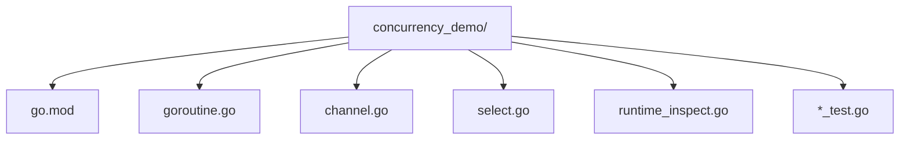

## 前置知识

- [Go 与限流](/go/052-Go)：建议先完成前一篇的学习

## 学习目标

- 掌握「1. 历史动机与发展脉络」的核心机制、典型用法与常见陷阱
- 掌握「1. 形式化定义」的核心机制、典型用法与常见陷阱
- 掌握「2. 理论推导与原理解析」的核心机制、典型用法与常见陷阱
- 掌握「3. 代码示例」的核心机制、典型用法与常见陷阱
- 掌握「4. 对比分析」的核心机制、典型用法与常见陷阱


## 1. 历史动机与发展脉络

### 1.1 CSP 设计哲学

Go 语言的并发设计源自 Communicating Sequential Processes(CSP),由 Tony Hoare 在 1978 年提出。CSP 是一种形式化语言,用于描述并发系统的通信模式:

> "Do not communicate by sharing memory; instead, share memory by communicating."——Effective Go

Go 团队(Rob Pike 是 CSP 的早期拥护者)将 CSP 的 channel 概念具象化为语言一等公民。这与传统 POSIX 线程 + 共享内存 + 锁的模型形成鲜明对比。

CSP 的形式化语义:设进程 $P_1, P_2, \ldots, P_n$ 通过 channel $c_1, c_2, \ldots, c_m$ 通信。$P_i$ 可执行:

- 发送:$c_j!v$(向 $c_j$ 发送值 $v$)
- 接收:$c_j?x$(从 $c_j$ 接收值到 $x$)
- 并行组合:$P_1 \| P_2 \| \ldots \| P_n$
- 选择:$[P_1 \square P_2 \square \ldots \square P_n]$(任一就绪即执行)

### 1.2 关键版本演进

| Go 版本 | 发布日期 | 并发相关核心特性 |
|---------|---------|----------------|
| Go 1.0 | 2012-03 | goroutine、channel、select、GMP 调度器雏形 |
| Go 1.1 | 2013-05 | `GOMAXPROCS` 默认值改为 CPU 核数,调度器优化 |
| Go 1.2 | 2013-12 | preemptive 调度雏形,GC 与调度协同 |
| Go 1.3 | 2014-06 | 栈管理从 segmented stack 改为 continuous stack |
| Go 1.4 | 2014-12 | runtime 改用 Go 实现(此前部分 C),调度器全 Go |
| Go 1.5 | 2015-08 | **GMP 调度器大重构**(Dmitry Vyukov 设计),work-stealing |
| Go 1.6 | 2016-02 | 调度器在阻塞 IO 时更高效地复用 M |
| Go 1.7 | 2016-08 | `context` 包纳入标准库,标准化取消/超时 |
| Go 1.8 | 2017-02 | GC STW 缩短至 100μs 内,减少调度阻塞 |
| Go 1.9 | 2017-08 | `time.Ticker` 优化,goroutine 与 timer 协同 |
| Go 1.10 | 2018-02 | `lock` 自旋优化,channel 锁竞争减少 |
| Go 1.12 | 2019-02 | timer 与调度器集成优化 |
| Go 1.13 | 2019-09 | error wrapping 与 channel 错误传播配合 |
| Go 1.14 | 2020-02 | **异步抢占**(基于信号 SIGURG),消除长循环导致的调度饥饿 |
| Go 1.15 | 2020-08 | timer 调度优化,channel 锁改进 |
| Go 1.16 | 2021-02 | `runtime/cgo` 优化,goroutine 与 C 调用协同 |
| Go 1.17 | 2021-08 | 寄存器 ABI,channel 传递结构体更高效 |
| Go 1.18 | 2022-03 | 泛型引入,channel 类型参数化 |
| Go 1.19 | 2022-08 | `runtime.GCMEMLIMIT`,内存限制与调度协同 |
| Go 1.20 | 2023-02 | channel 锁粒度优化,减少高并发竞争 |
| Go 1.21 | 2023-08 | `log/slog`、`context.WithoutCancel`,channel 与结构化日志协同 |
| Go 1.22 | 2024-02 | 循环变量语义变更,消除并发测试陷阱,`sync.OnceFunc` 等 |

### 1.3 与其他语言并发模型对比

| 维度 | Go goroutine+channel | Rust async/await | Java virtual thread(JDK 21) | Erlang process | Python asyncio |
|------|---------------------|-------------------|------------------------------|----------------|----------------|
| 调度单元 | goroutine(2KB) | Future(无栈) | virtual thread(几 KB) | process(300B) | coroutine(无栈) |
| 调度方式 | 抢占式 + 协作式 | 协作式(poll) | 抢占式(JVM 调度) | 抢占式(reduction 计数) | 协作式(await) |
| 通信原语 | channel | channel(tokio)、mutex | BlockingQueue | ! / receive mailbox | asyncio.Queue |
| 内存模型 | happens-before | Send/Sync trait | JMM | 无共享 | 单线程默认 |
| 抢占 | Go 1.14+ 信号抢占 | 无(需主动 await) | JVM safepoint | reduction 抢占 | 无 |
| 调度开销 | ~200ns | ~50ns(无栈) | ~1μs | ~1μs | ~100ns |
| 数量上限 | 百万级 | 百万级 | 百万级 | 千万级 | 万级 |

---

## 1. 形式化定义

### 1.1 goroutine 的运行时表示

依据 `runtime/runtime2.go`,goroutine 在运行时由 `g` 结构体表示:

```go
type g struct {
    stack       stack       // 栈范围 [lo, hi]
    stackguard0 uintptr     // 栈溢出检查点
    stackguard1 uintptr     // C 栈溢出检查点
    _panic      *_panic     // panic 链
    _defer      *_defer     // defer 链
    m           *m          // 当前绑定的 M
    sched       gobuf       // 调度上下文(PC、SP)
    syscallsp   uintptr     // 系统调用时的 SP
    syscallpc   uintptr     // 系统调用时的 PC
    stktopsp    uintptr     // 栈顶 SP
    param       unsafe.Pointer // 唤醒时传递的参数
    atomicstatus uint32     // G 状态
    goid        int64       // goroutine ID
    waitsince   int64       // 阻塞起始时间
    waitreason  waitReason  // 阻塞原因
    schedlink   *g          // 调度队列链
    lockedm     *m          // 锁定的 M
    timer       *timer      // 关联的 timer
}

type gobuf struct {
    sp   uintptr  // 栈指针
    pc   uintptr  // 程序计数器
    g    guintptr // 关联的 G
    ret  uintptr  // 返回值
    lr   uintptr  // 链接寄存器(ARM)
    bp   uintptr  // 基址指针
}

type stack struct {
    lo uintptr  // 栈底(低地址)
    hi uintptr  // 栈顶(高地址)
}
```

### 1.2 GMP 调度模型

GMP 由 Dmitry Vyukov 在 "Scalable Go Scheduler Design Doc"(2014)中提出:

- **G(Goroutine)**:用户态协程,封装计算任务。
- **M(Machine)**:OS 线程,执行 G。数量上限默认 10000。
- **P(Processor)**:逻辑处理器,持有可运行 G 的本地队列。数量等于 `GOMAXPROCS`。

```go
type p struct {
    id          int32
    status      uint32          // _Pidle, _Prunning, _Psyscall, _Pgcstop, _Pdead
    link        *p              // 空闲 P 链表
    m           *m              // 绑定的 M
    runqhead    uint32          // 本地运行队列头
    runqtail    uint32          // 本地运行队列尾
    runq        [256]guintptr   // 本地运行队列(环形,256 容量)
    runnext     guintptr        // 下一个运行的 G(优先级最高)
    gFree       struct {        // 空闲 G 缓存
        gList
        n int32
    }
    sudogcache  []*sudog        // sudog 缓存(channel 复用)
    deferpool   [5][]*_defer    // defer 缓存
    mcache      *mcache         // 内存分配缓存
    timer       *timer          // 关联的 timer
    gcBgMarkWorker goroutine    // GC 后台标记 worker
    gcw         gcWork          // GC 工作缓存
}

type m struct {
    g0          *g              // 调度专用 G(执行 runtime 代码)
    curg        *g              // 当前用户 G
    p           puintptr        // 绑定的 P
    nextp       puintptr        // 下一个 P
    oldp        puintptr        // 系统调用前的 P
    spinning    bool            // 正在寻找工作(work-stealing)
    syscall     bool            // 处于系统调用
    lockedg     *g              // 锁定的 G
    tls         [6]uintptr      // 线程局部存储
    mstartfn    func()
}
```

### 1.3 channel 的运行时结构

channel 在运行时由 `hchan` 结构体表示(`runtime/chan.go`):

```go
type hchan struct {
    qcount   uint           // 当前队列中元素数
    dataqsiz uint           // 缓冲区大小
    buf      unsafe.Pointer // 环形缓冲区指针
    elemsize uint16         // 元素大小
    closed   uint32         // 是否已关闭
    elemtype *_type         // 元素类型
    sendx    uint           // 发送索引
    recvx    uint           // 接收索引
    recvq    waitq          // 等待接收的 G 队列
    sendq    waitq          // 等待发送的 G 队列
    lock     mutex          // 互斥锁
}

type waitq struct {
    first *sudog  // 队首
    last  *sudog  // 队尾
}

type sudog struct {
    g          *g           // 等待的 G
    next       *sudog       // 链表
    prev       *sudog
    elem       unsafe.Pointer // 数据指针
    acquiretime int64
    releasetime int64
    ticket     uint32
    parent     *sudog
    waitlink   *sudog
    waittail   *sudog
    c          *hchan       // 关联的 channel
    isSelect   bool         // 是否在 select 中
}
```

### 1.4 G 的状态机

goroutine 状态转换图:

```
_Gidle -> _Grunnable -> _Grunning -> _Gsyscall -> _Grunnable
                         |     ^
                         v     |
                       _Gwaiting
                         |
                         v
                       _Gdead
```

状态定义:

- `_Gidle`:刚创建,未初始化。
- `_Grunnable`:可运行,在 P 的本地队列或全局队列。
- `_Grunning`:正在 M 上执行。
- `_Gsyscall`:正在执行系统调用。
- `_Gwaiting`:阻塞(channel、lock、timer)。
- `_Gdead`:已退出,可被复用。

---

## 2. 理论推导与原理解析

### 2.1 goroutine 创建成本的形式化推导

设 OS 线程创建成本为 $C_t$,包括:

- 内核态分配 `task_struct`:约 4KB-8KB。
- 分配栈空间:默认 1-8MB。
- 内核调度器入队:O(1)。

goroutine 创建成本 $C_g$:

- 堆分配 `g` 结构:约 2KB。
- 分配初始栈:2KB(可增长)。
- runtime 调度器入队:O(1)。

实测对比(64 核 Linux):

$$
C_t \approx 10\text{-}50\mu s, \quad C_g \approx 0.3\text{-}1\mu s
$$

goroutine 创建成本约为 OS 线程的 $1/20$。

### 2.2 栈增长的形式化算法

Go 1.3+ 采用连续栈(continuous stack)策略:

1. 初始栈 2KB。
2. 每次函数调用前,检查 `stackguard0`。
3. 若当前 SP $\leq$ `stackguard0`,触发 `morestack`。
4. 分配新栈(大小为 $2 \times \text{old size}$)。
5. 拷贝旧栈内容到新栈。
6. 调整所有指向旧栈的指针(通过栈帧回溯)。

栈大小序列:

$$
S_n = 2 \text{KB} \cdot 2^n, \quad n = 0, 1, 2, \ldots
$$

即 2KB, 4KB, 8KB, 16KB, ..., 1GB(上限)。

栈拷贝的成本:

$$
C_{\text{copy}}(n) = O(S_n) = O(2^n)
$$

虽然单次拷贝成本翻倍,但均摊成本(amortized cost)为 $O(1)$:

$$
\bar{C} = \frac{\sum_{i=0}^{n} C_{\text{copy}}(i)}{\sum_{i=0}^{n} S_i} = \frac{O(2^{n+1})}{O(2^{n+1})} = O(1)
$$

### 2.3 channel 发送/接收状态机

#### 2.3.1 发送(`chansend`)

```
chansend(c, v):
    lock(c.lock)
    if c.closed:
        panic("send on closed channel")
    if c.recvq not empty:  // 有等待接收者
        sg = dequeue(c.recvq)
        copy(v, sg.elem)    // 直接拷贝到接收者
        goready(sg.g)        // 唤醒接收者
        unlock(c.lock)
        return
    if c.qcount < c.dataqsiz:  // 缓冲区未满
        c.buf[c.sendx] = v
        c.sendx = (c.sendx + 1) % c.dataqsiz
        c.qcount++
        unlock(c.lock)
        return
    // 缓冲区满,阻塞当前 G
    sg = acquireSudog()
    sg.elem = &v
    enqueue(c.sendq, sg)
    gopark(chanpark, c, waitReasonChanSend)
    // 唤醒后继续
```

#### 2.3.2 接收(`chanrecv`)

```
chanrecv(c, &v):
    lock(c.lock)
    if c.sendq not empty and c.qcount == 0:  // 无缓冲且有等待发送者
        sg = dequeue(c.sendq)
        copy(v, sg.elem)        // 直接从发送者拷贝
        goready(sg.g)
        unlock(c.lock)
        return
    if c.qcount > 0:  // 缓冲区有数据
        v = c.buf[c.recvx]
        c.recvx = (c.recvx + 1) % c.dataqsiz
        c.qcount--
        if c.sendq not empty:  // 有等待发送者,唤醒并填入空位
            sg = dequeue(c.sendq)
            c.buf[c.sendx] = sg.elem
            c.sendx = (c.sendx + 1) % c.dataqsiz
            goready(sg.g)
        unlock(c.lock)
        return
    if c.closed:
        unlock(c.lock)
        return  // 返回零值
    // 缓冲区空且未关闭,阻塞
    sg = acquireSudog()
    sg.elem = &v
    enqueue(c.recvq, sg)
    gopark(chanpark, c, waitReasonChanRecv)
```

### 2.4 happens-before 关系

Go 内存模型定义以下 happens-before 关系(参考 Go Memory Model):

1. `go f()` 语句的执行 happens-before f 的第一行。
2. channel 的发送 happens-before 对应的接收完成。
3. channel 的关闭 happens-before 接收返回零值。
4. 无缓冲 channel 的接收 happens-before 发送完成。
5. `sync.Mutex.Unlock` happens-before 下一次 `Lock`。
6. `sync.RWMutex.RUnlock` happens-before 下一次 `Lock`。
7. `sync.Once` 的 `Do(f)` 调用中,f 的执行 happens-before 任何 `Do` 返回。

形式化地,若事件 $A$ happens-before $B$,记 $A \xrightarrow{hb} B$。传递性:

$$
A \xrightarrow{hb} B \land B \xrightarrow{hb} C \Rightarrow A \xrightarrow{hb} C
$$

### 2.5 work-stealing 调度算法

当 P 的本地队列为空时,执行 work-stealing:

1. 检查全局运行队列(每 61 次调度检查一次)。
2. 检查 netpoller。
3. 随机选择一个 P,偷取其本地队列的一半。
4. 若失败,重试(最多尝试 4 次)。
5. 若仍失败,P 进入 `_Pidle`,M 进入自旋或休眠。

偷取的负载均衡性:设 $n$ 个 P,每个 P 队列长度 $Q_i$。期望偷取后:

$$
Q_i' \approx \frac{\sum_j Q_j}{n}
$$

work-stealing 的复杂度:$O(\log n)$ 平均(随机化)。

### 2.6 异步抢占(Go 1.14+)

Go 1.14 引入基于信号的异步抢占,解决长循环导致的调度饥饿:

1. `sysmon` 检测 G 运行超过 10ms。
2. 向对应 M 发送 `SIGURG` 信号。
3. 信号处理器修改 G 的 PC,插入抢占调用。
4. G 被迫让出 P,进入 `_Grunnable`。

形式化地,设 $T_{\text{slice}}$ 为时间片(10ms),$T_{\text{run}}$ 为 G 已运行时间。抢占条件:

$$
T_{\text{run}} > T_{\text{slice}} \Rightarrow \text{preempt}(G)
$$

注意:异步抢占不适用于:
- 持有锁的 G(避免死锁)。
- 正在执行内存分配的 G(避免 mcache 状态不一致)。
- 即将完成的 G(开销不值得)。

---

## 3. 代码示例

### 3.1 项目结构



`go.mod`:

```go
module github.com/fandex/concurrency_demo

go 1.22

require (
    golang.org/x/sync v0.7.0
)
```

### 3.2 goroutine 基础

```go
// goroutine.go
package concurrency

import (
    "context"
    "fmt"
    "runtime"
    "sync"
    "sync/atomic"
    "time"
)

// LaunchBasic 演示基本 goroutine 启动
func LaunchBasic() {
    // 启动一个 goroutine
    go func() {
        fmt.Println("hello from goroutine")
    }()

    // 主 goroutine 等待,确保子 goroutine 有机会执行
    time.Sleep(time.Millisecond * 100)
}

// LaunchWithWaitGroup 使用 WaitGroup 同步
func LaunchWithWaitGroup() {
    var wg sync.WaitGroup
    for i := 0; i < 10; i++ {
        wg.Add(1)
        i := i  // Go 1.21 及以下需要 shadow
        go func() {
            defer wg.Done()
            fmt.Printf("goroutine %d\n", i)
        }()
    }
    wg.Wait()
}

// LaunchWithClosure 演示闭包捕获
func LaunchWithClosure() {
    var wg sync.WaitGroup
    for i := 0; i < 5; i++ {
        wg.Add(1)
        // 通过参数传递,避免闭包陷阱
        go func(n int) {
            defer wg.Done()
            fmt.Printf("n = %d\n", n)
        }(i)
    }
    wg.Wait()
}

// CounterRace 危险:data race 示例
func CounterRace() {
    var counter int
    var wg sync.WaitGroup
    for i := 0; i < 1000; i++ {
        wg.Add(1)
        go func() {
            defer wg.Done()
            counter++  // data race!
        }()
    }
    wg.Wait()
    fmt.Printf("counter = %d (expected 1000, but race)\n", counter)
}

// CounterSafe 使用 atomic
func CounterSafe() int64 {
    var counter atomic.Int64
    var wg sync.WaitGroup
    for i := 0; i < 1000; i++ {
        wg.Add(1)
        go func() {
            defer wg.Done()
            counter.Add(1)
        }()
    }
    wg.Wait()
    return counter.Load()
}

// CounterMutex 使用 mutex
func CounterMutex() int {
    var mu sync.Mutex
    counter := 0
    var wg sync.WaitGroup
    for i := 0; i < 1000; i++ {
        wg.Add(1)
        go func() {
            defer wg.Done()
            mu.Lock()
            counter++
            mu.Unlock()
        }()
    }
    wg.Wait()
    return counter
}

// CancellableGoroutine 演示 context 取消
func CancellableGoroutine(ctx context.Context) {
    go func() {
        for {
            select {
            case <-ctx.Done():
                fmt.Println("goroutine cancelled")
                return
            default:
                time.Sleep(100 * time.Millisecond)
                fmt.Println("working...")
            }
        }
    }()
}

// InspectGoroutines 查看 goroutine 数量
func InspectGoroutines() {
    before := runtime.NumGoroutine()
    fmt.Printf("before: %d goroutines\n", before)

    var wg sync.WaitGroup
    for i := 0; i < 100; i++ {
        wg.Add(1)
        go func() {
            defer wg.Done()
            time.Sleep(50 * time.Millisecond)
        }()
    }
    during := runtime.NumGoroutine()
    fmt.Printf("during: %d goroutines\n", during)

    wg.Wait()
    after := runtime.NumGoroutine()
    fmt.Printf("after: %d goroutines\n", after)
}
```

### 3.3 channel 基础

```go
// channel.go
package concurrency

import (
    "fmt"
    "sync"
    "time"
)

// UnbufferedChannel 演示无缓冲 channel(同步)
func UnbufferedChannel() {
    ch := make(chan string)

    go func() {
        fmt.Println("sender: preparing...")
        time.Sleep(100 * time.Millisecond)
        ch <- "hello"  // 阻塞直到接收方就绪
        fmt.Println("sender: sent")
    }()

    fmt.Println("receiver: waiting...")
    msg := <-ch  // 阻塞直到有数据
    fmt.Printf("receiver: got %q\n", msg)
}

// BufferedChannel 演示有缓冲 channel(异步)
func BufferedChannel() {
    ch := make(chan int, 3)

    go func() {
        for i := 0; i < 5; i++ {
            ch <- i
            fmt.Printf("sent %d\n", i)
        }
        close(ch)
    }()

    for v := range ch {
        fmt.Printf("received %d\n", v)
    }
}

// ChannelDirection 演示方向限制
func ChannelDirection() {
    ch := make(chan int, 1)

    // 只发送
    go func(out chan<- int) {
        out <- 42
        close(out)
    }(ch)

    // 只接收
    consumer := func(in <-chan int) int {
        return <-in
    }

    fmt.Println(consumer(ch))
}

// ChannelClose 演示关闭语义
func ChannelClose() {
    ch := make(chan int, 5)
    for i := 0; i < 5; i++ {
        ch <- i
    }
    close(ch)

    // 接收所有剩余元素
    for v := range ch {
        fmt.Println(v)
    }

    // 多次接收返回零值
    v, ok := <-ch
    fmt.Printf("after close: v=%d, ok=%v\n", v, ok)
}

// ChannelSelectState 演示 nil channel 的妙用
func ChannelSelectState() {
    var ch1, ch2 chan int  // nil channel

    // nil channel 在 select 中永远阻塞,可动态启用/禁用 case
    select {
    case v := <-ch1:  // ch1 为 nil,此 case 永不就绪
        fmt.Println("ch1:", v)
    case v := <-ch2:  // ch2 为 nil,此 case 永不就绪
        fmt.Println("ch2:", v)
    default:
        fmt.Println("no channel ready (both nil)")
    }

    // 动态启用
    ch1 = make(chan int, 1)
    ch1 <- 10
    select {
    case v := <-ch1:
        fmt.Println("ch1 now active:", v)
    }
}

// Pipeline 演示 channel 管道
func Pipeline() {
    // 阶段 1:生成
    gen := func(nums ...int) <-chan int {
        out := make(chan int)
        go func() {
            defer close(out)
            for _, n := range nums {
                out <- n
            }
        }()
        return out
    }

    // 阶段 2:平方
    sq := func(in <-chan int) <-chan int {
        out := make(chan int)
        go func() {
            defer close(out)
            for n := range in {
                out <- n * n
            }
        }()
        return out
    }

    // 阶段 3:打印
    print := func(in <-chan int) {
        for v := range in {
            fmt.Println(v)
        }
    }

    // 组合管道
    c := gen(2, 3, 4)
    out := sq(c)
    print(out)
}

// FanOutFanIn 扇出扇入
func FanOutFanIn() {
    // 生成输入
    input := func() <-chan int {
        out := make(chan int)
        go func() {
            defer close(out)
            for i := 1; i <= 10; i++ {
                out <- i
            }
        }()
        return out
    }

    // worker:处理一个输入
    worker := func(id int, in <-chan int) <-chan int {
        out := make(chan int)
        go func() {
            defer close(out)
            for n := range in {
                out <- n * n  // 平方
            }
        }()
        return out
    }

    // 扇入:合并多个 channel
    fanIn := func(channels ...<-chan int) <-chan int {
        var wg sync.WaitGroup
        out := make(chan int)
        multiplex := func(c <-chan int) {
            defer wg.Done()
            for v := range c {
                out <- v
            }
        }
        wg.Add(len(channels))
        for _, c := range channels {
            go multiplex(c)
        }
        go func() {
            wg.Wait()
            close(out)
        }()
        return out
    }

    // 启动 3 个 worker
    in := input()
    out1 := worker(1, in)
    out2 := worker(2, in)
    out3 := worker(3, in)
    // 注意:上面写法 in 已被消费,正确做法见并发模式章节

    // 扇入
    merged := fanIn(out1, out2, out3)
    for v := range merged {
        fmt.Println(v)
    }
}
```

### 3.4 select 多路复用

```go
// select.go
package concurrency

import (
    "fmt"
    "time"
)

// SelectBasic 基本 select
func SelectBasic() {
    ch1 := make(chan string)
    ch2 := make(chan string)

    go func() {
        time.Sleep(100 * time.Millisecond)
        ch1 <- "from ch1"
    }()
    go func() {
        time.Sleep(200 * time.Millisecond)
        ch2 <- "from ch2"
    }()

    select {
    case msg := <-ch1:
        fmt.Println(msg)
    case msg := <-ch2:
        fmt.Println(msg)
    }
}

// SelectTimeout 超时控制
func SelectTimeout() {
    ch := make(chan string)
    go func() {
        time.Sleep(2 * time.Second)
        ch <- "slow operation"
    }()

    select {
    case msg := <-ch:
        fmt.Println(msg)
    case <-time.After(500 * time.Millisecond):
        fmt.Println("timeout!")
    }
}

// SelectNonBlocking 非阻塞 select
func SelectNonBlocking() {
    ch := make(chan int, 1)

    select {
    case v := <-ch:
        fmt.Println("received:", v)
    default:
        fmt.Println("no data, non-blocking")
    }
}

// SelectDefaultLoop 轮询模式
func SelectDefaultLoop() {
    ch := make(chan int, 10)

    go func() {
        for i := 0; i < 5; i++ {
            ch <- i
            time.Sleep(100 * time.Millisecond)
        }
        close(ch)
    }()

    for {
        select {
        case v, ok := <-ch:
            if !ok {
                fmt.Println("channel closed")
                return
            }
            fmt.Println("got:", v)
        default:
            // 没有数据时执行其他工作
            time.Sleep(50 * time.Millisecond)
            fmt.Print(".")
        }
    }
}

// SelectDone 使用 done channel 退出
func SelectDone() {
    done := make(chan struct{})
    ch := make(chan int)

    go func() {
        defer close(ch)
        for i := 0; ; i++ {
            select {
            case <-done:
                return
            case ch <- i:
                time.Sleep(100 * time.Millisecond)
            }
        }
    }()

    // 消费前 5 个
    for i := 0; i < 5; i++ {
        fmt.Println(<-ch)
    }
    close(done)
    time.Sleep(200 * time.Millisecond)  // 等待 goroutine 退出
}

// SelectRandom 演示 select 的随机选择
func SelectRandom() {
    ch1 := make(chan int, 1)
    ch2 := make(chan int, 1)
    ch1 <- 1
    ch2 <- 2

    // 当多个 case 同时就绪,select 随机选择
    for i := 0; i < 10; i++ {
        select {
        case v := <-ch1:
            fmt.Printf("ch1: %d\n", v)
            ch1 <- v  // 重新填入
        case v := <-ch2:
            fmt.Printf("ch2: %d\n", v)
            ch2 <- v
        }
    }
}

// SelectTee 演示 tee 模式(分流)
func SelectTee() {
    // 将一个输入分到两个输出
    tee := func(in <-chan int) (<-chan int, <-chan int) {
        out1 := make(chan int)
        out2 := make(chan int)
        go func() {
            defer close(out1)
            defer close(out2)
            for v := range in {
                // 使用 select 避免某个输出阻塞
                out1 := out1  // 复制为局部变量
                out2 := out2
                for i := 0; i < 2; i++ {
                    select {
                    case out1 <- v:
                        out1 = nil  // 置 nil,此 case 不再就绪
                    case out2 <- v:
                        out2 = nil
                    }
                }
            }
        }()
        return out1, out2
    }

    in := make(chan int)
    out1, out2 := tee(in)

    go func() {
        defer close(in)
        for i := 0; i < 3; i++ {
            in <- i
        }
    }()

    var wg sync.WaitGroup
    wg.Add(2)
    go func() {
        defer wg.Done()
        for v := range out1 {
            fmt.Printf("out1: %d\n", v)
        }
    }()
    go func() {
        defer wg.Done()
        for v := range out2 {
            fmt.Printf("out2: %d\n", v)
        }
    }()
    wg.Wait()
}
```

### 3.5 运行时观测

```go
// runtime_inspect.go
package concurrency

import (
    "fmt"
    "runtime"
    "runtime/debug"
    "time"
)

// InspectGOMAXPROCS 查看 GOMAXPROCS
func InspectGOMAXPROCS() {
    fmt.Printf("GOMAXPROCS = %d\n", runtime.GOMAXPROCS(0))
    fmt.Printf("NumCPU = %d\n", runtime.NumCPU())
    fmt.Printf("NumGoroutine = %d\n", runtime.NumGoroutine())
}

// SetGOMAXPROCS 设置并行度
func SetGOMAXPROCS(n int) {
    old := runtime.GOMAXPROCS(n)
    fmt.Printf("GOMAXPROCS: %d -> %d\n", old, n)
}

// StackTrace 获取所有 goroutine 栈
func StackTrace() {
    // 启动一些 goroutine
    for i := 0; i < 3; i++ {
        go func(n int) {
            time.Sleep(time.Hour)
        }(i)
    }

    // 获取所有 goroutine 的栈
    buf := make([]byte, 1<<16)
    n := runtime.Stack(buf, true)  // true = 所有 goroutine
    fmt.Printf("%s\n", buf[:n])
}

// GoroutineLeak 检测 goroutine 泄漏
func GoroutineLeak() {
    before := runtime.NumGoroutine()

    // 危险:goroutine 永远阻塞,泄漏
    leak := make(chan struct{})
    go func() {
        <-leak  // 永远阻塞,因为没有人 close(leak) 或发送
    }()

    time.Sleep(100 * time.Millisecond)
    after := runtime.NumGoroutine()
    fmt.Printf("leaked goroutines: %d\n", after-before)
}

// ForceGC 强制 GC
func ForceGC() {
    var stats debug.GCStats
    stats.PauseQuantiles = make([]time.Duration, 5)
    debug.ReadGCStats(&stats)
    fmt.Printf("GC count: %d\n", stats.NumGC)
    fmt.Printf("Total pause: %v\n", stats.PauseTotal)
}

// SetGCPercent 调整 GC 阈值
func SetGCPercent() {
    old := debug.SetGCPercent(50)  // 默认 100
    fmt.Printf("GCPercent: %d -> 50\n", old)
    defer debug.SetGCPercent(old)
}
```

### 3.6 完整示例:并发爬虫

```go
// crawler.go
package concurrency

import (
    "context"
    "fmt"
    "net/http"
    "sync"
    "time"
)

// Crawler 并发爬虫
type Crawler struct {
    workerNum  int
    timeout    time.Duration
    httpClient *http.Client
}

func NewCrawler(workers int, timeout time.Duration) *Crawler {
    return &Crawler{
        workerNum: workers,
        timeout:   timeout,
        httpClient: &http.Client{
            Timeout: timeout,
        },
    }
}

// Result 表示爬取结果
type Result struct {
    URL    string
    Status int
    Body   []byte
    Err    error
    Time   time.Duration
}

// Crawl 并发爬取多个 URL
func (c *Crawler) Crawl(ctx context.Context, urls []string) []Result {
    // 工作队列
    jobs := make(chan string, len(urls))
    results := make(chan Result, len(urls))

    // 启动 worker
    var wg sync.WaitGroup
    for i := 0; i < c.workerNum; i++ {
        wg.Add(1)
        go c.worker(ctx, &wg, i, jobs, results)
    }

    // 提交任务
    for _, url := range urls {
        jobs <- url
    }
    close(jobs)

    // 等待所有 worker 完成
    go func() {
        wg.Wait()
        close(results)
    }()

    // 收集结果
    var allResults []Result
    for r := range results {
        allResults = append(allResults, r)
    }
    return allResults
}

func (c *Crawler) worker(ctx context.Context, wg *sync.WaitGroup, id int, jobs <-chan string, results chan<- Result) {
    defer wg.Done()
    for url := range jobs {
        select {
        case <-ctx.Done():
            results <- Result{URL: url, Err: ctx.Err()}
            return
        default:
        }
        r := c.fetch(ctx, url)
        results <- r
    }
}

func (c *Crawler) fetch(ctx context.Context, url string) Result {
    start := time.Now()
    req, err := http.NewRequestWithContext(ctx, "GET", url, nil)
    if err != nil {
        return Result{URL: url, Err: err, Time: time.Since(start)}
    }
    resp, err := c.httpClient.Do(req)
    if err != nil {
        return Result{URL: url, Err: err, Time: time.Since(start)}
    }
    defer resp.Body.Close()
    return Result{
        URL:    url,
        Status: resp.StatusCode,
        Time:   time.Since(start),
    }
}
```

### 3.7 errgroup 示例

```go
// errgroup_demo.go
package concurrency

import (
    "context"
    "errors"
    "fmt"
    "time"

    "golang.org/x/sync/errgroup"
)

// ErrGroupBasic 基本 errgroup
func ErrGroupBasic() error {
    g, ctx := errgroup.WithContext(context.Background())

    urls := []string{
        "https://example.com",
        "https://golang.org",
        "https://github.com",
    }

    for _, url := range urls {
        url := url
        g.Go(func() error {
            return fetchURL(ctx, url)
        })
    }

    // 等待所有完成,返回第一个错误
    if err := g.Wait(); err != nil {
        return fmt.Errorf("errgroup failed: %w", err)
    }
    return nil
}

// ErrGroupWithLimit 限制并发数
func ErrGroupWithLimit() error {
    g, ctx := errgroup.WithContext(context.Background())
    g.SetLimit(3)  // 最大并发 3

    for i := 0; i < 10; i++ {
        i := i
        g.Go(func() error {
            select {
            case <-ctx.Done():
                return ctx.Err()
            default:
                time.Sleep(100 * time.Millisecond)
                fmt.Printf("task %d done\n", i)
                return nil
            }
        })
    }
    return g.Wait()
}

// ErrGroupPipeline errgroup + pipeline
func ErrGroupPipeline() error {
    g, ctx := errgroup.WithContext(context.Background())

    // 生成
    gen := make(chan int)
    g.Go(func() error {
        defer close(gen)
        for i := 0; i < 5; i++ {
            select {
            case gen <- i:
            case <-ctx.Done():
                return ctx.Err()
            }
        }
        return nil
    })

    // 处理
    proc := make(chan int)
    g.Go(func() error {
        defer close(proc)
        for n := range gen {
            select {
            case proc <- n * n:
            case <-ctx.Done():
                return ctx.Err()
            }
        }
        return nil
    })

    // 消费
    g.Go(func() error {
        for n := range proc {
            fmt.Println(n)
        }
        return nil
    })

    return g.Wait()
}

func fetchURL(ctx context.Context, url string) error {
    if url == "" {
        return errors.New("empty url")
    }
    time.Sleep(100 * time.Millisecond)
    return nil
}
```

---

## 4. 对比分析

### 4.1 并发原语对比

| 原语 | Go | Rust | Java | Python | C++ |
|------|-----|------|------|--------|-----|
| 协程 | goroutine | async fn | virtual thread | asyncio coroutine | C++20 coroutine |
| 通道 | channel | mpsc/mpsc | BlockingQueue | asyncio.Queue | 无标准库 |
| 锁 | sync.Mutex | std::sync::Mutex | ReentrantLock | threading.Lock | std::mutex |
| 读写锁 | sync.RWMutex | std::sync::RwLock | ReentrantReadWriteLock | 无标准 | std::shared_mutex |
| 等待组 | sync.WaitGroup | 无(用 Arc<AtomicUsize>) | CountDownLatch | 无标准 | 无标准 |
| 原子操作 | sync/atomic | std::sync::atomic | java.util.concurrent.atomic | 无标准 | std::atomic |
| 条件变量 | sync.Cond | std::sync::Condvar | Object.wait/notify | threading.Condition | std::condition_variable |
| 一次性执行 | sync.Once | std::sync::Once | 无标准 | 无标准 | std::call_once |

### 4.2 channel vs mutex 取舍

```go
// 方案 A:channel 模式
type Counter struct {
    c chan int
    r chan int
}
func (c *Counter) Start() {
    go func() {
        var n int
        for {
            select {
            case c.c <- 0:  // 增量请求(此处简化)
            case n = <-c.c:  // 直接设置
            case c.r <- n:  // 读取请求
            }
        }
    }()
}

// 方案 B:mutex 模式
type CounterMutex struct {
    mu sync.Mutex
    n  int
}
func (c *CounterMutex) Add() {
    c.mu.Lock()
    c.n++
    c.mu.Unlock()
}
func (c *CounterMutex) Get() int {
    c.mu.Lock()
    defer c.mu.Unlock()
    return c.n
}
```

| 维度 | channel | mutex |
|------|---------|-------|
| 语义清晰度 | 高(通信模型) | 中(共享状态) |
| 性能 | 较低(200-500ns) | 较高(20-50ns) |
| 组合性 | 高(可串联、扇出) | 中(易嵌套死锁) |
| 调试难度 | 高(阻塞难追踪) | 低(锁竞争可测) |
| 适用场景 | 数据流、生产者-消费者 | 短临界区、计数器 |

经验法则:

- 数据所有权转移:用 channel。
- 共享状态保护:用 mutex。
- 多生产者-多消费者:用 channel。
- 简单计数器:用 atomic。
- 复杂状态机:用 mutex + 条件变量。

### 4.3 CSP vs Actor 对比

| 维度 | Go CSP | Erlang Actor | Akka Actor |
|------|--------|--------------|------------|
| 通信媒介 | channel(命名) | mailbox(进程绑定) | mailbox(actor 绑定) |
| 寻址 | channel 引用 | PID | ActorRef |
| 顺序保证 | 单 channel FIFO | 单 mailbox FIFO | 单 mailbox FIFO |
| 容错 | panic + recover | let it crash | supervisor |
| 分布式 | 需第三方(nats) | 原生支持(distributed) | 原生支持 |
| 状态隔离 | 共享内存(需锁) | 进程隔离 | actor 隔离 |

---

## 5. 常见陷阱与最佳实践

### 5.1 陷阱一:goroutine 泄漏

```go
// 泄漏:goroutine 永远阻塞
func Leak() {
    ch := make(chan int)
    go func() {
        val := <-ch  // 永远阻塞,无人发送
        fmt.Println(val)
    }()
    // 函数返回,ch 不可达,但 goroutine 仍在
}

// 修复 1:使用 context
func NoLeak(ctx context.Context) {
    ch := make(chan int, 1)
    go func() {
        select {
        case ch <- compute():
        case <-ctx.Done():
            return
        }
    }()
}

// 修复 2:确保 close
func NoLeakClose() {
    ch := make(chan int)
    go func() {
        defer close(ch)
        // ...
    }()
    <-ch  // 等待关闭
}
```

### 5.2 陷阱二:向已关闭 channel 发送

```go
// panic: send on closed channel
func PanicOnClosed() {
    ch := make(chan int)
    close(ch)
    ch <- 1  // panic!
}

// 修复:发送方负责关闭,且关闭前确保无发送
func SafeClose() {
    ch := make(chan int, 1)
    done := make(chan struct{})
    go func() {
        defer close(done)
        for i := 0; i < 10; i++ {
            ch <- i
        }
    }()
    go func() {
        <-done
        close(ch)  // 由发送方关闭
    }()
}
```

### 5.3 陷阱三:循环变量捕获

```go
// Go 1.21 及以下:所有 goroutine 共享 i
func LoopVarTrap() {
    for i := 0; i < 5; i++ {
        go func() {
            fmt.Println(i)  // 可能都打印 5
        }()
    }
}

// 修复:参数传递
func LoopVarFix() {
    for i := 0; i < 5; i++ {
        go func(n int) {
            fmt.Println(n)
        }(i)
    }
}
```

### 5.4 陷阱四:无缓冲 channel 的 happens-before 误解

```go
// 错误:认为无缓冲 channel 一定同步
func Misunderstand() {
    ch := make(chan int)
    go func() {
        // 此处 happens-before ch <- 1
        ch <- 1
        // 此处不保证 happens-before 接收完成
    }()
    <-ch
    // 此处 happens-after 发送完成
}
```

### 5.5 陷阱五:select 中的 nil channel

```go
// 陷阱:nil channel 让 select 永远阻塞
func NilChannelTrap() {
    var ch chan int  // nil
    select {
    case v := <-ch:  // 永不就绪
        fmt.Println(v)
    case <-time.After(time.Second):
        fmt.Println("timeout")
    }
}

// 利用:动态启用 case
func NilChannelTrick(done chan struct{}) {
    ch := make(chan int)
    go func() {
        for {
            select {
            case <-done:
                return
            case ch <- 1:
            }
        }
    }()

    // 消费后置 nil,停止接收
    v := <-ch
    fmt.Println(v)
    ch = nil  // 此后 select 不再考虑 ch
}
```

### 5.6 最佳实践清单

1. **发送方关闭 channel**:接收方关闭可能导致发送方 panic。
2. **避免 goroutine 泄漏**:每个 goroutine 都有明确退出路径(context、done channel、close)。
3. **使用 errgroup 管理并发**:统一错误传播与取消。
4. **channel 大小选择**:无缓冲=同步语义;有缓冲=解耦,但不要过大(内存压力)。
5. **select + context 取消**:goroutine 应响应 context.Done。
6. **避免在锁中发送/接收 channel**:可能死锁。
7. **使用 sync.Pool 复用对象**:减少 GC 压力。
8. **GOMAXPROCS 默认即可**:仅在特定场景(如容器 CPU 限制)调整。
9. **使用 -race 检测**:CI 中默认开启。
10. **goroutine 命名**:通过 context 携带 trace ID,便于排查。

---

## 6. 工程实践

### 6.1 调试 goroutine

```bash
# 查看所有 goroutine 栈
kill -USR1 <pid>  # 发送 SIGUSR1,触发 runtime 打印

# 使用 pprof
go tool pprof http://localhost:6060/debug/pprof/goroutine

# 查看调度器状态
GODEBUG=schedtrace=1000 ./program

# 详细调度信息
GODEBUG=schedtrace=1000,scheddetail=1 ./program

# 查看阻塞时间
GODEBUG=schedtrace=1000 ./program 2>&1 | grep "runqueue"
```

### 6.2 pprof 集成

```go
package main

import (
    "log"
    "net/http"
    _ "net/http/pprof"
)

func main() {
    go func() {
        log.Println(http.ListenAndServe("localhost:6060", nil))
    }()
    // 业务代码
}
```

### 6.3 goroutine 泄漏检测

```go
package main

import (
    "testing"

    "go.uber.org/goleak"
)

func TestMain(m *testing.M) int {
    defer goleak.VerifyNone(m)
    return m.Run()
}

// 或在单个测试中
func TestNoLeak(t *testing.T) {
    defer goleak.VerifyNone(t)
    // 测试逻辑
}
```

### 6.4 GODEBUG 调度追踪

```bash
# 基本调度追踪
GODEBUG=schedtrace=1000 ./program

# 输出示例:
# SCHED 0ms: gomaxprocs=8 idleprocs=5 threads=10 spinningthreads=0 idlethreads=4 runqueue=0 [0 0 0 0 0 0 0 0]
# 字段说明:
#   gomaxprocs: P 数量
#   idleprocs: 空闲 P
#   threads: M 总数
#   spinningthreads: 自旋 M(寻找工作)
#   runqueue: 全局运行队列长度
#   [0 0 ...]: 各 P 本地队列长度

# 详细追踪(包含 G 状态)
GODEBUG=schedtrace=1000,scheddetail=1 ./program

# 执行追踪
go test -trace=trace.out ./...
go tool trace trace.out
```

### 6.5 执行追踪(go tool trace)

```go
package main

import (
    "os"
    "runtime/trace"
)

func main() {
    f, _ := os.Create("trace.out")
    defer f.Close()
    trace.Start(f)
    defer trace.Stop()

    // 业务代码
    // ...
}
```

```bash
# 可视化追踪
go tool trace trace.out

# 追踪文件可分析:
# - goroutine 创建、阻塞、唤醒时间线
# - channel 操作
# - syscall 阻塞
# - GC 暂停
# - 调度延迟
```

### 6.6 GOMAXPROCS 调优

```go
// 在容器环境中,GOMAXPROCS 可能不正确
// 使用 automaxprocs 自动调整
import _ "go.uber.org/automaxprocs"

// 或手动设置
func init() {
    // 从 cgroup 读取 CPU 限制
    cpuLimit := readCgroupCPULimit()
    if cpuLimit > 0 {
        runtime.GOMAXPROCS(cpuLimit)
    }
}
```

---

## 7. 案例研究

### 7.1 Kubernetes 中的 goroutine

Kubernetes 大量使用 goroutine 与 channel:

- **informer**:监听 API server 变更,通过 channel 分发给多个 worker。
- **workqueue**:带去重、延迟、限速的队列,基于 channel 实现。
- **controller**:每个 controller 是独立 goroutine,通过 channel 协调。

```go
// k8s workqueue 简化示例
type DelayingQueue interface {
    Interface
    AddAfter(item interface{}, duration time.Duration)
}

type delayingType struct {
    Interface
    waitingForAddCh chan *waitFor
    heartbeatCh     <-chan time.Time
    stopCh          chan struct{}
}

func (q *delayingType) waitingLoop() {
    for {
        select {
        case <-q.stopCh:
            return
        case <-q.heartbeatCh:
            // 处理到期 item
        case wait := <-q.waitingForAddCh:
            // 加入延迟队列
        }
    }
}
```

### 7.2 Docker 中的并发

Docker daemon 使用 goroutine 处理:

- **container lifecycle**:每个容器一个 goroutine 监控状态。
- **stream pipe**:stdout/stderr 通过 goroutine 转发。
- **health check**:定时执行健康检查的 goroutine。

### 7.3 TiDB 中的并发

TiDB 利用 goroutine 实现:

- **coprocessor**:并行执行 SQL 下推到 TiKV。
- **pipeline**:SQL 执行计划通过 channel 串联。
- **scheduler**:每个 region 一个 goroutine 处理请求。

### 7.4 Prometheus 中的并发

Prometheus 的 scrape、ingest、query 都基于 goroutine:

- **scrape pool**:每个 target 一个 goroutine 周期抓取。
- **ingest pipeline**:通过 channel 串联多个阶段(sample appender、head append、WAL)。
- **query engine**:并行执行 vector 运算。

---

### 填空题知识点讲解

**题目 1**:Go 的 GMP 模型中,G 代表 _________,M 代表 _________,P 代表 _________。

goroutine、Machine(OS 线程)、Processor(逻辑处理器)

**题目 2**:channel 底层的 `hchan` 结构体中,`recvq` 存储 _________,`sendq` 存储 _________。

等待接收的 goroutine 队列、等待发送的 goroutine 队列

**题目 3**:goroutine 的初始栈大小为 _________ KB,最大可增长到 _________。

2、1GB

**题目 4**:Go 1.14 引入的 _________ 抢占机制,通过 _________ 信号实现。

异步、SIGURG

**题目 5**:work-stealing 算法中,当 P 的本地队列为空时,会先检查 _________,再从其他 P 偷取 _________ 个 G。

全局运行队列、一半

### 编程题知识点讲解

**题目 1**:实现一个 worker pool,接收 jobs channel,处理后将结果发送到 results channel:

```go
package main

import (
    "fmt"
    "sync"
)

func worker(id int, jobs <-chan int, results chan<- int) {
    for j := range jobs {
        fmt.Printf("worker %d processing job %d\n", id, j)
        results <- j * j
    }
}

func main() {
    jobs := make(chan int, 100)
    results := make(chan int, 100)

    // 启动 3 个 worker
    var wg sync.WaitGroup
    for w := 1; w <= 3; w++ {
        wg.Add(1)
        go func(id int) {
            defer wg.Done()
            worker(id, jobs, results)
        }(w)
    }

    // 提交 5 个 job
    for j := 1; j <= 5; j++ {
        jobs <- j
    }
    close(jobs)

    // 等待 worker 完成
    go func() {
        wg.Wait()
        close(results)
    }()

    // 收集结果
    for r := range results {
        fmt.Println("result:", r)
    }
}
```

**题目 2**:实现一个 rate limiter,每秒最多处理 N 个请求:

```go
package main

import (
    "fmt"
    "time"
)

func rateLimiter(rate int, requests <-chan int) <-chan int {
    out := make(chan int)
    ticker := time.NewTicker(time.Second / time.Duration(rate))
    go func() {
        defer close(out)
        defer ticker.Stop()
        for req := range requests {
            <-ticker.C  // 等待 token
            out <- req
        }
    }()
    return out
}

func main() {
    requests := make(chan int)
    go func() {
        for i := 1; i <= 10; i++ {
            requests <- i
        }
        close(requests)
    }()

    limited := rateLimiter(2, requests)  // 每秒 2 个
    for r := range limited {
        fmt.Printf("%v: processed %d\n", time.Now().Format("15:04:05"), r)
    }
}
```

### 10.1 书籍

- Cox-Buday, K. (2016). *Concurrency in Go*. O'Reilly Media.
- Donovan, A. A., & Kernighan, B. W. (2015). *The Go Programming Language*. Addison-Wesley.
- Herlihy, M., & Shavit, N. (2012). *The Art of Multiprocessor Programming*. Morgan Kaufmann.
- Kleppmann, M. (2017). *Designing Data-Intensive Applications*. O'Reilly Media.
- Armstrong, J. (2003). *Making Reliable Distributed Systems in the Presence of Software Errors*. PhD Thesis, KTH.

### 10.2 论文

- Hoare, C. A. R. (1978). "Communicating Sequential Processes." *CACM*.
- Vyukov, D. (2014). "Scalable Go Scheduler Design Doc."
- Chase, D., & Lev, Y. (2005). "Dynamic Circular Work-Stealing Deque." *SPAA*. https://doi.org/10.1145/1073970.1073974
- Clements, A. T., et al. (2013). "RadixVM: Scalable address space management for multicores." *SOCC*.

### 10.5 工具一览

| 工具 | 用途 | 链接 |
|------|------|------|
| `runtime` | 调度器与 goroutine 管理 | 标准库 |
| `context` | 取消与超时传播 | 标准库 |
| `golang.org/x/sync/errgroup` | 错误传播的并发组 | golang.org/x/sync |
| `go.uber.org/goleak` | goroutine 泄漏检测 | github.com/uber-go/goleak |
| `go.uber.org/automaxprocs` | 容器 CPU 自动调整 | github.com/uber-go/automaxprocs |
| `go tool trace` | 执行追踪可视化 | Go 工具链 |
| `go tool pprof` | 性能分析 | Go 工具链 |
| `GODEBUG` | 调度追踪环境变量 | Go 运行时 |

---

## 11. 总结

本篇系统阐述了 Go goroutine 与 channel 的完整原理:

1. **历史脉络**:从 CSP 理论到 Go 1.22 的演进。
2. **形式化定义**:`g`、`m`、`p`、`hchan`、`sudog` 结构体。
3. **理论推导**:栈增长算法、happens-before 关系、work-stealing、异步抢占。
4. **代码示例**:goroutine 创建、channel 操作、select、errgroup、并发爬虫。
5. **对比分析**:与 Rust、Java、Erlang 并发模型对比。
6. **常见陷阱**:goroutine 泄漏、向已关闭 channel 发送、循环变量捕获。
7. **工程实践**:pprof、GODEBUG、go tool trace、goleak。
8. **案例研究**:Kubernetes、Docker、TiDB、Prometheus。
9. **习题**:覆盖记忆、理解、应用、分析、评价、创造。

理解 GMP 调度器与 channel 的状态机,是编写高性能、可维护并发程序的基础。Go 的 CSP 哲学虽然简洁,但背后有深厚的形式化理论与工程积累。掌握这些原理,才能在 goroutine 泄漏、调度饥饿、data race 等问题面前游刃有余。

未来,随着 Go 语言的演进(如可能的泛型 channel 优化、更精细的调度器 NUMA 感知),并发编程的体验将持续提升。建议读者持续关注 Go runtime 的 release notes,并通过阅读源码加深理解。
## goroutine 创建

**基本写法：启动 goroutine**
`go <函数调用>`
```go
// 使用 go 关键字启动并发协程
go doWork()
```

**基本写法：匿名函数 goroutine**
`go func() { ... }()`
```go
// 立即执行的匿名 goroutine
go func(msg string) {
    fmt.Println(msg)
}("hello")
```

**基本写法：WaitGroup 等待协程**
`var wg sync.WaitGroup`
```go
// 使用 WaitGroup 等待一组协程完成
var wg sync.WaitGroup
for i := 0; i < 3; i++ {
    wg.Add(1)
    go func(n int) {
        defer wg.Done()
        fmt.Println(n)
    }(i)
}
wg.Wait()
```

**基本写法：Go 1.22+ 循环变量安全**
`for i := range <n> { go func() { ... }() }`
```go
// Go 1.22+ 每次迭代变量地址独立，无需手动拷贝
var wg sync.WaitGroup
for i := range 3 {
    wg.Add(1)
    go func() {
        defer wg.Done()
        fmt.Println(i)
    }()
}
wg.Wait()
```

---

## channel 创建

**基本写法：无缓冲通道**
`make(chan <类型>)`
```go
// 无缓冲通道：发送和接收同步
ch := make(chan int)
```

**基本写法：带缓冲通道**
`make(chan <类型>, <容量>)`
```go
// 带缓冲通道：缓冲区满前发送不阻塞
ch := make(chan string, 3)
```

**基本写法：单向发送通道**
`chan<- <类型>`
```go
// 只能发送的通道类型
var sendOnly chan<- int = make(chan int)
```

**基本写法：单向接收通道**
`<-chan <类型>`
```go
// 只能接收的通道类型
var recvOnly <-chan int = make(chan int)
```

**基本写法：关闭通道**
`close(<通道>)`
```go
// 关闭通道，通知接收方不再有数据
ch := make(chan int, 2)
ch <- 1
ch <- 2
close(ch)
```

---

## channel 收发

**基本写法：发送数据**
`<通道> <- <值>`
```go
// 向通道发送数据
ch := make(chan int, 1)
ch <- 42
```

**基本写法：接收数据**
`<-<通道>`
```go
// 从通道接收数据
v := <-ch
```

**基本写法：接收数据并判断是否关闭**
`v, ok := <-<通道>`
```go
// ok 为 false 表示通道已关闭且无数据
v, ok := <-ch
if !ok {
    fmt.Println("通道已关闭")
}
```

**基本写法：range 遍历通道**
`for v := range <通道> { ... }`
```go
// 持续接收直到通道关闭
for v := range ch {
    fmt.Println(v)
}
```

**基本写法：select 多路复用**
`select { case ... : }`
```go
// select 随机选择一个就绪的 case 执行
select {
case v := <-ch1:
    fmt.Println("ch1:", v)
case v := <-ch2:
    fmt.Println("ch2:", v)
}
```

**基本写法：select 超时控制**
`select { case ... : case <-time.After(<时长>): }`
```go
// 使用 time.After 实现超时
select {
case v := <-ch:
    fmt.Println(v)
case <-time.After(2 * time.Second):
    fmt.Println("超时")
}
```

**基本写法：select 非阻塞**
`select { case ...: default: }`
```go
// default 使 select 非阻塞
select {
case v := <-ch:
    fmt.Println(v)
default:
    fmt.Println("无数据")
}
```

---

## 通道容量与长度

**基本写法：获取通道缓冲区容量**
`cap(<通道>)`
```go
// 返回通道缓冲区大小
ch := make(chan int, 5)
fmt.Println(cap(ch)) // 5
```

**基本写法：获取通道中元素个数**
`len(<通道>)`
```go
// 返回通道中当前排队元素数
ch := make(chan int, 3)
ch <- 1
ch <- 2
fmt.Println(len(ch)) // 2
```

---

## 常用并发模式

**换行写法：Worker Pool 工作池**
`func worker(id int, jobs <-chan int, results chan<- int)`
```go
// 固定数量 worker 消费任务队列
func worker(id int, jobs <-chan int, results chan<- int) {
    for j := range jobs {
        results <- j * 2
    }
}
jobs := make(chan int, 10)
results := make(chan int, 10)
for w := 1; w <= 3; w++ {
    go worker(w, jobs, results)
}
for j := 1; j <= 5; j++ {
    jobs <- j
}
close(jobs)
```

**换行写法：扇入合并多通道**
`func fanIn(<通道1>, <通道2> <-chan <类型>) <-chan <类型>`
```go
// 将多个通道合并为一个
func fanIn(ch1, ch2 <-chan int) <-chan int {
    out := make(chan int)
    go func() { for v := range ch1 { out <- v } }()
    go func() { for v := range ch2 { out <- v } }()
    return out
}
```

**换行写法：信号量限制并发数**
`sem := make(chan struct{}, <最大并发>)`
```go
// 使用带缓冲通道作为信号量控制并发
sem := make(chan struct{}, 3)
var wg sync.WaitGroup
for i := 0; i < 10; i++ {
    wg.Add(1)
    sem <- struct{}{}
    go func(n int) {
        defer wg.Done()
        defer func() { <-sem }()
        doWork(n)
    }(i)
}
wg.Wait()
```

**换行写法：通知退出信号**
`quit := make(chan struct{})`
```go
// 使用空结构体通道作为退出信号
quit := make(chan struct{})
go func() {
    for {
        select {
        case <-quit:
            return
        default:
            doWork()
        }
    }
}()
close(quit)
```

---

## Mutex 互斥锁

**基本写法：互斥锁**
`var mu sync.Mutex`
```go
// 互斥锁保护共享资源
var mu sync.Mutex
count := 0
mu.Lock()
count++
mu.Unlock()
```

**基本写法：读写锁**
`var rw sync.RWMutex`
```go
// 读写锁：允许多读单写
var rw sync.RWMutex
rw.RLock()
v := readData()
rw.RUnlock()
```

**换行写法：使用 defer 解锁**
`mu.Lock(); defer mu.Unlock()`
```go
// defer 确保锁一定被释放
func update() {
    mu.Lock()
    defer mu.Unlock()
    doUpdate()
}
```

**基本写法：tryLock 非阻塞加锁**
`mu.TryLock()`
```go
// 尝试加锁，失败返回 false
if mu.TryLock() {
    defer mu.Unlock()
    doWork()
} else {
    fmt.Println("加锁失败")
}
```

---

## Once 单次执行

**基本写法：sync.Once 确保只执行一次**
`var once sync.Once`
```go
// 单例模式初始化
var (
    instance *Config
    once     sync.Once
)
func GetConfig() *Config {
    once.Do(func() {
        instance = loadConfig()
    })
    return instance
}
```

---

## atomic 原子操作

**基本写法：原子加法**
`atomic.AddInt64(&<变量>, <值>)`
```go
// 原子整数加法
var count int64
atomic.AddInt64(&count, 1)
```

**基本写法：原子读取**
`atomic.LoadInt64(&<变量>)`
```go
// 原子读取值
v := atomic.LoadInt64(&count)
```

**基本写法：原子存储**
`atomic.StoreInt64(&<变量>, <值>)`
```go
// 原子存储值
atomic.StoreInt64(&count, 100)
```

**基本写法：原子比较交换**
`atomic.CompareAndSwapInt64(&<变量>, <旧值>, <新值>)`
```go
// CAS 操作：值匹配旧值才更新
ok := atomic.CompareAndSwapInt64(&count, 10, 20)
```

**基本写法：Go 1.19+ 原子类型**
`var <变量> atomic.Int64`
```go
// 使用类型安全的原子类型
var n atomic.Int64
n.Add(1)
n.Store(100)
fmt.Println(n.Load())
```

**基本写法：原子指针**
`atomic.Pointer[<类型>]`
```go
// Go 1.19+ 泛型原子指针
var p atomic.Pointer[Config]
p.Store(&Config{Name: "default"})
cfg := p.Load()
```

---

## Go 1.23+ Timer 通道变更

**基本写法：Go 1.23+ Timer 可被 GC 回收**
`t := time.NewTimer(<时长>)`
```go
// Go 1.23+ 未 Stop 的 Timer 可被垃圾回收
t := time.NewTimer(time.Second)
// 即使不调用 t.Stop()，失去引用后也会被 GC 回收
```

**基本写法：Go 1.23+ Timer 通道无缓冲**
`cap(t.C) == 0`
```go
// Go 1.23+ Timer 通道容量为 0，使用非阻塞 select 轮询
t := time.NewTimer(time.Second)
select {
case <-t.C:
    fmt.Println("超时")
default:
    fmt.Println("未超时")
}
```
