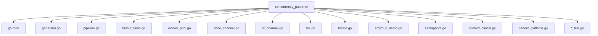

## 前置知识

- [GMP 调度模型](/go/054-GMPModel)：建议先完成前一篇的学习

## 学习目标

- 掌握「1. 历史动机与发展脉络」的核心机制、典型用法与常见陷阱
- 掌握「1. 形式化定义」的核心机制、典型用法与常见陷阱
- 掌握「2. 理论推导与原理解析」的核心机制、典型用法与常见陷阱
- 掌握「3. 代码示例」的核心机制、典型用法与常见陷阱
- 掌握「4. 对比分析」的核心机制、典型用法与常见陷阱


## 1. 历史动机与发展脉络

### 1.1 CSP 哲学的工程化落地

Go 的并发模式源自 Communicating Sequential Processes(CSP),由 Tony Hoare 于 1978 年提出。CSP 的核心思想是:并发进程通过通道传递消息进行通信,而非通过共享内存。Go 团队(Rob Pike 是 CSP 的早期拥护者)将 CSP 的 channel 概念具象化为语言一等公民,催生了一系列标准的并发模式。

> "Do not communicate by sharing memory; instead, share memory by communicating."——Effective Go

这一设计哲学直接决定了 Go 并发模式的形态:几乎所有并发问题都可以通过 channel + goroutine 的组合解决,而非引入显式锁。这一选择带来了以下工程红利:

- **可组合性**:channel 是一等公民,可作为参数传递、作为返回值、存入数据结构,使并发模式天然可组合。
- **取消传播**:关闭一个 channel 即可广播取消信号,所有监听者同步退出。
- **数据流清晰**:pipeline 模式让数据流向显式可见,便于调试与观测。
- **避免数据竞争**:channel 自带 happens-before 保证,降低了 data race 风险。

### 1.2 关键版本演进

| Go 版本 | 发布日期 | 并发模式相关核心特性 |
|---------|---------|----------------|
| Go 1.0 | 2012-03 | goroutine、channel、select,基础 pipeline 模式可行 |
| Go 1.1 | 2013-05 | `GOMAXPROCS` 默认改为 CPU 核数,worker pool 模式并行度提升 |
| Go 1.3 | 2014-06 | 连续栈(continuous stack),pipeline 深度不再受栈大小限制 |
| Go 1.5 | 2015-08 | GMP 调度器重构,work-stealing 让 fan-out 模式更高效 |
| Go 1.7 | 2016-08 | `context` 包纳入标准库,取消传播标准化 |
| Go 1.9 | 2017-08 | `sync.Map` 引入,简化并发 map 场景(部分替代 fan-in) |
| Go 1.13 | 2019-09 | `errors.Is/As` 配合 errgroup 错误传播 |
| Go 1.14 | 2020-02 | 异步抢占(SIGURG),长循环 worker 不再阻塞调度 |
| Go 1.16 | 2021-02 | `io/fs` 与 `embed` 改变 pipeline 数据源加载方式 |
| Go 1.18 | 2022-03 | **泛型引入**,并发模式可类型参数化;`sync/atomic` 新增 `Pointer[T]` |
| Go 1.20 | 2023-02 | `errors.Join` 配合 errgroup 多错误聚合 |
| Go 1.21 | 2023-08 | `context.WithoutCancel`,衍生 context 不继承取消 |
| Go 1.22 | 2024-02 | 循环变量语义变更,消除 fan-out 闭包陷阱;`sync.OnceFunc`、`sync.OnceValue` |

### 1.3 Go 1.22 循环变量与并发模式

Go 1.22 之前,`for i := range slice` 中 `i` 在整个循环中是同一变量,导致 fan-out 模式踩坑:

```go
// Go 1.21 及之前版本 - 危险
for _, url := range urls {
    go func() {
        fetch(url)  // 所有 goroutine 共享 url,最终都请求最后一个 URL
    }()
}
```

Go 1.22 起,每次迭代创建新变量,上述代码安全。但生产环境多数项目仍需兼容旧版本,推荐显式参数传递:

```go
// 兼容所有 Go 版本 - 推荐
for _, url := range urls {
    url := url  // 显式 shadow
    go func() {
        fetch(url)
    }()
}

// 或通过参数传递 - 更显式
for _, url := range urls {
    go func(url string) {
        fetch(url)
    }(url)
}
```

### 1.4 与其他语言并发模式对比

| 维度 | Go | Rust | Java | Python(asyncio) | Kotlin(Coroutine) |
|------|-----|------|------|-------------------|---------------------|
| 通信原语 | channel | channel(tokio)、mpsc | BlockingQueue、CompletableFuture | asyncio.Queue | Channel(Select) |
| 取消机制 | context.Context | CancellationToken | Future.cancel() | asyncio.Task.cancel() | CoroutineContext.Job |
| 错误聚合 | errgroup | joinset(Go 1.20 类比) | CompletableFuture.allOf | asyncio.gather | awaitAll |
| 并发限制 | semaphore(channel) | Semaphore | Semaphore | asyncio.Semaphore | Mutex/Semaphore |
| Pipeline | channel 串联 | Stream + mpsc | Stream(JDK 9+) | async generator | Flow |
| 模式成熟度 | 高(标准库 + 社区共识) | 中(生态碎片化) | 中(CompletableFuture 受限) | 中(单线程约束) | 高(语言一等公民) |

---

## 1. 形式化定义

### 1.1 并发模式的核心抽象

并发模式可形式化为一个三元组 $\mathcal{M} = (P, C, S)$,其中:

- $P = \{p_1, p_2, \ldots, p_n\}$ 是 goroutine 集合(producer/consumer/worker)。
- $C = \{c_1, c_2, \ldots, c_m\}$ 是 channel 集合。
- $S \subseteq P \times C \times \{\text{send}, \text{recv}\}$ 是通信关系集合。

每个 goroutine $p_i$ 可表示为一个状态机:

$$
p_i = (Q_i, \Sigma_i, \delta_i, q_0, F_i)
$$

其中 $Q_i$ 是状态集,$\Sigma_i$ 是输入字母表(channel 操作),$\delta_i$ 是转移函数,$q_0$ 是初始状态,$F_i$ 是终止状态集。

### 1.2 Pipeline 的形式化定义

Pipeline 是一系列 stage 的线性组合,每个 stage $f_i$ 是一个从输入 channel 到输出 channel 的函数:

$$
f_i : \text{chan } T_{i-1} \to \text{chan } T_i
$$

整个 pipeline 的语义为:

$$
\text{pipeline} = f_n \circ f_{n-1} \circ \cdots \circ f_1 : \text{chan } T_0 \to \text{chan } T_n
$$

其中 $\circ$ 表示 goroutine 级别的组合,即每个 $f_i$ 在独立的 goroutine 中执行。

### 1.3 Fan-out/Fan-in 的形式化定义

**Fan-out**:将一个输入 channel $c_{\text{in}}$ 分发给 $k$ 个 worker:

$$
\text{fan-out}(c_{\text{in}}, k) = \{w_1, w_2, \ldots, w_k\}, \quad w_i : c_{\text{in}} \to c_{\text{out}}^{(i)}
$$

**Fan-in**:将 $k$ 个输入 channel 合并为一个输出 channel:

$$
\text{fan-in}(c_{\text{out}}^{(1)}, c_{\text{out}}^{(2)}, \ldots, c_{\text{out}}^{(k)}) = c_{\text{merged}}
$$

完整的 fan-out/fan-in 模式:

$$
c_{\text{merged}} = \text{fan-in}(\text{fan-out}(c_{\text{in}}, k))
$$

### 1.4 Worker Pool 的形式化定义

Worker pool 由三部分组成:

- 任务队列 $Q_{\text{task}}$(通常是带缓冲 channel)。
- 结果队列 $Q_{\text{result}}$(通常是带缓冲 channel)。
- worker 集合 $W = \{w_1, w_2, \ldots, w_k\}$,每个 worker 执行:

$$
w_i : \text{loop}\{ t = \text{recv}(Q_{\text{task}}); r = \text{process}(t); \text{send}(Q_{\text{result}}, r) \}
$$

### 1.5 context.Context 的接口定义

依据 `context/context.go`:

```go
type Context interface {
    // Deadline 返回 context 的取消时间,ok=false 表示无截止时间
    Deadline() (deadline time.Time, ok bool)

    // Done 返回一个 channel,context 取消时关闭
    Done() <-chan struct{}

    // Err 返回取消原因(Canceled 或 DeadlineExceeded)
    Err() error

    // Value 返回 key 对应的值,用于请求作用域数据传递
    Value(key any) any
}
```

`Done()` 返回的 channel 关闭即代表取消信号,这是所有取消模式的统一基础:

```go
select {
case <-ctx.Done():
    return ctx.Err()
case v := <-input:
    // process v
}
```

### 1.6 errgroup.Group 的结构

依据 `golang.org/x/sync/errgroup`:

```go
type Group struct {
    cancel  func(error)      // 取消函数(若 WithContext 创建)
    wg      sync.WaitGroup   // 等待所有 goroutine
    errOnce sync.Once        // 确保只记录第一个错误
    err     error            // 第一个错误
    sem     chan token       // 并发限制信号量(Go 1.18+ SetLimit)
}
```

`Go` 方法的核心逻辑:

```go
func (g *Group) Go(f func() error) {
    if g.sem != nil {
        g.sem <- token{}  // 获取信号量
    }
    g.wg.Add(1)
    go func() {
        defer g.done()
        if err := f(); err != nil {
            g.errOnce.Do(func() {
                g.err = err
                if g.cancel != nil {
                    g.cancel(err)  // 取消整个 group
                }
            })
        }
    }()
}
```

---

## 2. 理论推导与原理解析

### 2.1 Little's Law 在并发模式中的应用

Little's Law 是排队论的基本定理,描述了稳定系统中吞吐量、并发数、响应时间的关系:

$$
L = \lambda \cdot W
$$

其中:
- $L$ 是系统中平均并发数(并发 goroutine 数)。
- $\lambda$ 是到达率(任务提交速率,任务/秒)。
- $W$ 是平均响应时间(任务处理时间,秒)。

在 worker pool 中,设 worker 数为 $k$,每个 worker 处理时间为 $W$,则系统最大吞吐量:

$$
\lambda_{\max} = \frac{k}{W}
$$

若任务到达率 $\lambda > \lambda_{\max}$,任务队列长度将无限增长,最终 OOM。设计时需:

$$
k \geq \lambda \cdot W
$$

例如:HTTP 请求到达率 1000 QPS,平均处理时间 50ms,则 $k \geq 1000 \times 0.05 = 50$ 个 worker。

### 2.2 Pipeline 吞吐量的形式化分析

设 pipeline 有 $n$ 个 stage,每个 stage 处理时间为 $t_i$($i = 1, 2, \ldots, n$)。pipeline 的吞吐量受最慢的 stage 限制:

$$
\lambda_{\text{pipeline}} = \min_{i=1}^{n} \frac{1}{t_i}
$$

这是经典的"木桶效应"。为提升吞吐量,可对最慢的 stage 并行化:

设 stage $i$ 的并行度为 $k_i$,则其有效处理时间:

$$
t_i' = \frac{t_i}{k_i}
$$

优化后 pipeline 吞吐量:

$$
\lambda_{\text{pipeline}}' = \min_{i=1}^{n} \frac{k_i}{t_i}
$$

最优并行度分配(在总资源 $\sum k_i = K$ 约束下):

$$
k_i^* = \frac{t_i}{\sum_j t_j} \cdot K
$$

即按处理时间比例分配并行度,使所有 stage 的有效处理时间相等:

$$
\frac{t_i}{k_i^*} = \frac{\sum_j t_j}{K}, \quad \forall i
$$

### 2.3 Channel 缓冲区大小的形式化分析

设生产者速率 $\lambda_p$,消费者速率 $\lambda_c$($\lambda_p > \lambda_c$),缓冲区大小 $B$。队列填满时间:

$$
T_{\text{full}} = \frac{B}{\lambda_p - \lambda_c}
$$

缓冲区的权衡:
- $B$ 过小:生产者频繁阻塞,吞吐量下降。
- $B$ 过大:内存占用高,延迟增加(数据在队列中等待)。

最优缓冲区大小需平衡吞吐量与延迟。设可接受的最大延迟 $L_{\max}$:

$$
B \leq \lambda_c \cdot L_{\max}
$$

实践中,常取 $B = \min(\lambda_c \cdot L_{\max}, \text{memory\_limit} / \text{element\_size})$。

### 2.4 取消传播的 happens-before 保证

Go 内存模型规定,channel 的关闭 happens-before 任何对该 channel 的接收返回。形式化地:

$$
\text{close}(ch) \xrightarrow{hb} \text{recv}(ch) \text{ returns}
$$

这意味着取消信号能可靠传播。对于 `context.Context`:

```go
ctx, cancel := context.WithCancel(context.Background())
go func() {
    select {
    case <-ctx.Done():  // cancel() 调用后,这里必然返回
        return
    case v := <-input:
        // ...
    }
}()
cancel()  // 触发取消
```

`cancel()` 内部调用 `close(ctx.done)`,依据 happens-before,goroutine 中的 `<-ctx.Done()` 必然能感知到取消。

### 2.5 errgroup 并发限制的实现原理

`errgroup.SetLimit(n)` 内部使用一个带缓冲 channel 作为信号量:

```go
func (g *Group) SetLimit(n int) {
    if n < 0 {
        g.sem = nil
        return
    }
    g.sem = make(chan token, n)
}
```

`Go` 方法在启动 goroutine 前需获取信号量:

$$
\text{Go}(f): \quad \text{sem} \leftarrow \text{token}; \quad \text{go } f(); \quad \text{defer } \text{sem} \rightarrow \text{token}
$$

这保证了同时运行的 goroutine 数不超过 $n$。注意:`Go` 方法会阻塞,直到信号量可用。若需非阻塞语义,使用 `TryGo`:

```go
if !g.TryGo(f) {
    // 达到并发上限,未启动
}
```

### 2.6 or-channel 递归取消的复杂度分析

or-channel 模式通过递归 select 实现多路复用取消:

```go
func or(channels ...<-chan struct{}) <-chan struct{} {
    switch len(channels) {
    case 0:
        return nil
    case 1:
        return channels[0]
    }
    orDone := make(chan struct{})
    go func() {
        defer close(orDone)
        switch len(channels) {
        case 2:
            select {
            case <-channels[0]:
            case <-channels[1]:
            }
        default:
            select {
            case <-channels[0]:
            case <-channels[1]:
            case <-channels[2]:
            case <-or(append(channels[3:], orDone)...):
            }
        }
    }()
    return orDone
}
```

每个 goroutine 监听 4 个 channel(3 个输入 + 1 个 orDone),总 goroutine 数:

$$
G(n) = \left\lceil \frac{n - 3}{3} \right\rceil + 1
$$

复杂度 $O(n/3) = O(n)$。任一输入 channel 关闭,递归链上的所有 goroutine 通过 `orDone` 链式退出。

---

## 3. 代码示例

### 3.1 项目结构



`go.mod`:

```go
module github.com/fandex/concurrency_patterns

go 1.22

require (
    golang.org/x/sync v0.7.0
    golang.org/x/time v0.5.0
)
```

### 3.2 Generator 模式

Generator 是将普通数据流转换为 channel 的工厂函数,是 pipeline 的起点。

```go
// generator.go
package concurrency

import (
    "context"
)

// Generator 将不定数量输入转换为 channel
// 这是 pipeline 的起点,负责产生数据流
func Generator(ctx context.Context, values ...int) <-chan int {
    out := make(chan int)
    go func() {
        defer close(out)
        for _, v := range values {
            select {
            case <-ctx.Done():
                return
            case out <- v:
            }
        }
    }()
    return out
}

// GeneratorFunc 从函数生成数据流,直到函数返回 false 或 ctx 取消
func GeneratorFunc(ctx context.Context, fn func() (int, bool)) <-chan int {
    out := make(chan int)
    go func() {
        defer close(out)
        for {
            select {
            case <-ctx.Done():
                return
            default:
                if v, ok := fn(); ok {
                    select {
                    case <-ctx.Done():
                        return
                    case out <- v:
                    }
                } else {
                    return
                }
            }
        }
    }()
    return out
}
```

### 3.3 Pipeline 模式

Pipeline 将多个 stage 串联,每个 stage 是一个 goroutine,通过 channel 传递数据。

```go
// pipeline.go
package concurrency

import (
    "context"
)

// Stage 定义 pipeline 阶段的通用类型
type Stage func(ctx context.Context, in <-chan int) <-chan int

// Square 平方 stage
func Square(ctx context.Context, in <-chan int) <-chan int {
    out := make(chan int)
    go func() {
        defer close(out)
        for v := range in {
            select {
            case <-ctx.Done():
                return
            case out <- v * v:
            }
        }
    }()
    return out
}

// Filter 过滤 stage,只保留满足条件的值
func Filter(ctx context.Context, in <-chan int, predicate func(int) bool) <-chan int {
    out := make(chan int)
    go func() {
        defer close(out)
        for v := range in {
            if predicate(v) {
                select {
                case <-ctx.Done():
                    return
                case out <- v:
                }
            }
        }
    }()
    return out
}

// Pipeline 组合多个 stage
// 注意:stage 之间通过 channel 解耦,可独立扩展并发度
func Pipeline(ctx context.Context, source <-chan int, stages ...Stage) <-chan int {
    out := source
    for _, stage := range stages {
        out = stage(ctx, out)
    }
    return out
}
```

使用示例:

```go
ctx, cancel := context.WithCancel(context.Background())
defer cancel()

source := Generator(ctx, 1, 2, 3, 4, 5, 6, 7, 8, 9, 10)
result := Pipeline(ctx, source,
    func(ctx context.Context, in <-chan int) <-chan int {
        return Square(ctx, in)
    },
    func(ctx context.Context, in <-chan int) <-chan int {
        return Filter(ctx, in, func(v int) bool { return v > 50 })
    },
)

for v := range result {
    println(v) // 64, 81, 100
}
```

### 3.4 Fan-out/Fan-in 模式

Fan-out 将一个输入分发给多个 worker 并行处理,Fan-in 将多个 worker 的输出合并。

```go
// fanout_fanin.go
package concurrency

import (
    "context"
    "sync"
)

// FanOut 将输入分发给 k 个 worker 并行处理
// 每个 worker 独立处理,提升吞吐量
func FanOut(ctx context.Context, in <-chan int, k int, process func(int) int) []<-chan int {
    outs := make([]<-chan int, k)
    for i := 0; i < k; i++ {
        outs[i] = worker(ctx, in, process)
    }
    return outs
}

func worker(ctx context.Context, in <-chan int, process func(int) int) <-chan int {
    out := make(chan int)
    go func() {
        defer close(out)
        for v := range in {
            select {
            case <-ctx.Done():
                return
            case out <- process(v):
            }
        }
    }()
    return out
}

// FanIn 合并多个输入 channel 为一个输出 channel
// 使用 sync.WaitGroup 等待所有输入关闭后关闭输出
func FanIn(ctx context.Context, channels ...<-chan int) <-chan int {
    out := make(chan int)
    var wg sync.WaitGroup
    wg.Add(len(channels))

    for _, ch := range channels {
        go func(c <-chan int) {
            defer wg.Done()
            for v := range c {
                select {
                case <-ctx.Done():
                    return
                case out <- v:
                }
            }
        }(ch)
    }

    go func() {
        wg.Wait()
        close(out)
    }()
    return out
}

// FanInSelect 使用 select 实现轻量级 fan-in
// 仅适用于 channel 数量固定的场景(避免动态 select 复杂度)
func FanInSelect(ctx context.Context, ch1, ch2 <-chan int) <-chan int {
    out := make(chan int)
    go func() {
        defer close(out)
        for ch1 != nil || ch2 != nil {
            select {
            case <-ctx.Done():
                return
            case v, ok := <-ch1:
                if !ok {
                    ch1 = nil
                    continue
                }
                out <- v
            case v, ok := <-ch2:
                if !ok {
                    ch2 = nil
                    continue
                }
                out <- v
            }
        }
    }()
    return out
}
```

### 3.5 Worker Pool 模式

Worker pool 是 Go 中最经典的并发模式,预创建固定数量的 worker,通过任务队列分发任务。

```go
// worker_pool.go
package concurrency

import (
    "context"
    "sync"
)

// Job 定义任务接口
type Job interface {
    Execute() error
}

// Result 定义结果结构
type Result struct {
    Job    Job
    Error  error
}

// WorkerPool 工作池
type WorkerPool struct {
    jobQueue    chan Job
    resultQueue chan Result
    workerCount int
    wg          sync.WaitGroup
}

// NewWorkerPool 创建工作池
// jobQueueSize: 任务队列容量(缓冲越大,抗突发能力越强,但内存占用越高)
// workerCount: worker 数量(通常等于 CPU 核数 * 某个系数)
func NewWorkerPool(jobQueueSize, workerCount int) *WorkerPool {
    return &WorkerPool{
        jobQueue:    make(chan Job, jobQueueSize),
        resultQueue: make(chan Result, jobQueueSize),
        workerCount: workerCount,
    }
}

// Start 启动工作池
func (p *WorkerPool) Start(ctx context.Context) {
    for i := 0; i < p.workerCount; i++ {
        p.wg.Add(1)
        go p.worker(ctx, i)
    }
    go func() {
        p.wg.Wait()
        close(p.resultQueue)
    }()
}

// worker 单个 worker 的执行循环
func (p *WorkerPool) worker(ctx context.Context, id int) {
    defer p.wg.Done()
    for {
        select {
        case <-ctx.Done():
            return
        case job, ok := <-p.jobQueue:
            if !ok {
                return
            }
            err := job.Execute()
            select {
            case <-ctx.Done():
                return
            case p.resultQueue <- Result{Job: job, Error: err}:
            }
        }
    }
}

// Submit 提交任务(阻塞,直到队列有空位)
func (p *WorkerPool) Submit(job Job) error {
    p.jobQueue <- job
    return nil
}

// Results 返回结果 channel
func (p *WorkerPool) Results() <-chan Result {
    return p.resultQueue
}

// Shutdown 优雅关闭:关闭任务队列,等待所有 worker 完成
func (p *WorkerPool) Shutdown() {
    close(p.jobQueue)
    p.wg.Wait()
}
```

使用示例:

```go
type FetchJob struct {
    URL string
}

func (j *FetchJob) Execute() error {
    // 模拟 HTTP 请求
    time.Sleep(100 * time.Millisecond)
    return nil
}

func main() {
    ctx, cancel := context.WithTimeout(context.Background(), 30*time.Second)
    defer cancel()

    pool := NewWorkerPool(100, 10)  // 10 个 worker,队列容量 100
    pool.Start(ctx)

    // 提交任务
    for i := 0; i < 1000; i++ {
        pool.Submit(&FetchJob{URL: fmt.Sprintf("https://example.com/%d", i)})
    }

    // 收集结果
    go func() {
        for result := range pool.Results() {
            if result.Error != nil {
                log.Printf("job failed: %v", result.Error)
            }
        }
    }()

    pool.Shutdown()
}
```

### 3.6 Done Channel 模式

Done channel 是最早的取消模式,通过关闭一个 channel 广播取消信号。

```go
// done_channel.go
package concurrency

import (
    "fmt"
    "time"
)

// DoneChannel 演示 done channel 模式
// 关闭 done channel 后,所有 <-done 立即返回零值,触发 goroutine 退出
func DoneChannel() {
    done := make(chan struct{})

    // 启动多个 worker,监听 done
    for i := 0; i < 3; i++ {
        go func(id int) {
            for {
                select {
                case <-done:
                    fmt.Printf("worker %d exiting\n", id)
                    return
                default:
                    fmt.Printf("worker %d working\n", id)
                    time.Sleep(500 * time.Millisecond)
                }
            }
        }(i)
    }

    time.Sleep(2 * time.Second)
    close(done)  // 广播取消信号
    time.Sleep(100 * time.Millisecond)
}
```

### 3.7 Or-Channel 模式

Or-channel 将多个取消信号合并为一个,任一信号触发即取消。

```go
// or_channel.go
package concurrency

// Or 合并多个 channel,任一关闭即返回
// 适用于多路取消信号合并的场景
func Or(channels ...<-chan struct{}) <-chan struct{} {
    switch len(channels) {
    case 0:
        return nil
    case 1:
        return channels[0]
    }

    orDone := make(chan struct{})
    go func() {
        defer close(orDone)
        switch len(channels) {
        case 2:
            select {
            case <-channels[0]:
            case <-channels[1]:
            }
        default:
            // 递归合并剩余 channel
            select {
            case <-channels[0]:
            case <-channels[1]:
            case <-channels[2]:
            case <-Or(append(channels[3:], orDone)...):
            }
        }
    }()
    return orDone
}
```

使用示例:

```go
// 多个超时信号,任一触发即取消
sig1 := make(chan struct{})
sig2 := make(chan struct{})
sig3 := make(chan struct{})

go func() {
    time.Sleep(1 * time.Second)
    close(sig1)
}()
go func() {
    time.Sleep(2 * time.Second)
    close(sig2)
}()
go func() {
    time.Sleep(3 * time.Second)
    close(sig3)
}()

<-Or(sig1, sig2, sig3)  // 1 秒后返回
```

### 3.8 Tee 模式

Tee 模式将一个输入 channel 分流为两个输出 channel,类似 Unix 的 `tee` 命令。

```go
// tee.go
package concurrency

// Tee 将一个输入 channel 分流为两个输出 channel
// 两个输出接收相同的值
func Tee[T any](ctx context.Context, in <-chan T) (<-chan T, <-chan T) {
    out1 := make(chan T)
    out2 := make(chan T)
    go func() {
        defer close(out1)
        defer close(out2)
        for v := range in {
            select {
            case <-ctx.Done():
                return
            case out1 <- v:
                // 等待 out1 接收后再写 out2,保证顺序
                select {
                case <-ctx.Done():
                case out2 <- v:
                }
            case out2 <- v:
                select {
                case <-ctx.Done():
                case out1 <- v:
                }
            }
        }
    }()
    return out1, out2
}
```

### 3.9 Bridge Channel 模式

Bridge channel 将 `chan chan T` 展平为 `chan T`,处理动态生成的 channel 序列。

```go
// bridge.go
package concurrency

// Bridge 将 chan chan T 展平为 chan T
// 适用于动态生成 channel 的场景(如分页拉取数据)
func Bridge[T any](ctx context.Context, chanStream <-chan <-chan T) <-chan T {
    out := make(chan T)
    go func() {
        defer close(out)
        for {
            var ch <-chan T
            select {
            case <-ctx.Done():
                return
            case ch = <-chanStream:
            }
            for v := range ch {
                select {
                case <-ctx.Done():
                    return
                case out <- v:
                }
            }
        }
    }()
    return out
}
```

使用示例(分页拉取):

```go
// 模拟分页拉取,每次返回一个 channel
func paginatedFetch(ctx context.Context, totalPages int) <-chan <-chan int {
    chanStream := make(chan chan int)
    go func() {
        defer close(chanStream)
        for page := 0; page < totalPages; page++ {
            pageData := make(chan int)
            go func(p int) {
                defer close(pageData)
                for i := 0; i < 10; i++ {
                    pageData <- p*10 + i
                }
            }(page)
            chanStream <- pageData
        }
    }()
    return chanStream
}

// 使用 bridge 展平
ctx := context.Background()
for v := range Bridge(ctx, paginatedFetch(ctx, 5)) {
    fmt.Println(v)  // 0, 1, 2, ..., 49
}
```

### 3.10 errgroup 模式

`errgroup` 是 Go 官方推荐的并发错误处理模式,封装了 WaitGroup + 错误传播 + 取消传播。

```go
// errgroup_demo.go
package concurrency

import (
    "context"
    "errors"
    "fmt"
    "net/http"
    "time"

    "golang.org/x/sync/errgroup"
)

// FetchAll 并发请求多个 URL,任一失败即取消其他
func FetchAll(ctx context.Context, urls []string) ([][]byte, error) {
    g, ctx := errgroup.WithContext(ctx)
    results := make([][]byte, len(urls))

    // 设置并发上限,避免同时发起过多请求
    g.SetLimit(10)

    for i, url := range urls {
        i, url := i, url  // 兼容 Go 1.21 及以下
        g.Go(func() error {
            req, err := http.NewRequestWithContext(ctx, "GET", url, nil)
            if err != nil {
                return err
            }
            resp, err := http.DefaultClient.Do(req)
            if err != nil {
                return err
            }
            defer resp.Body.Close()
            if resp.StatusCode != http.StatusOK {
                return fmt.Errorf("status %d: %s", resp.StatusCode, url)
            }
            // 读取 body...
            results[i] = []byte("...")  // 简化
            return nil
        })
    }

    if err := g.Wait(); err != nil {
        return nil, err
    }
    return results, nil
}

// PipelineWithErrgroup 使用 errgroup 实现 pipeline 各 stage 并发
func PipelineWithErrgroup(ctx context.Context, input <-chan int) <-chan int {
    out := make(chan int, 10)
    g, ctx := errgroup.WithContext(ctx)

    // 启动多个 processor
    for i := 0; i < 5; i++ {
        g.Go(func() error {
            for v := range input {
                select {
                case <-ctx.Done():
                    return ctx.Err()
                case out <- v * v:
                }
            }
            return nil
        })
    }

    // 等待所有 processor 完成后关闭 out
    go func() {
        _ = g.Wait()
        close(out)
    }()

    return out
}
```

### 3.11 Semaphore 模式

Semaphore 用于限制并发数,有两种实现:基于 channel 和基于 `golang.org/x/sync/semaphore`。

```go
// semaphore.go
package concurrency

import (
    "context"

    "golang.org/x/sync/semaphore"
)

// ChannelSemaphore 基于 channel 的信号量
type ChannelSemaphore chan struct{}

func NewChannelSemaphore(n int) ChannelSemaphore {
    return make(ChannelSemaphore, n)
}

// Acquire 获取信号量(阻塞)
func (s ChannelSemaphore) Acquire() {
    s <- struct{}{}
}

// Release 释放信号量
func (s ChannelSemaphore) Release() {
    <-s
}

// WeightedSemaphore 基于 golang.org/x/sync/semaphore 的加权信号量
// 支持不同权重的请求,适用于资源敏感场景(如内存限制)
type WeightedSemaphore struct {
    sem *semaphore.Weighted
}

func NewWeightedSemaphore(n int64) *WeightedSemaphore {
    return &WeightedSemaphore{sem: semaphore.NewWeighted(n)}
}

// Acquire 获取指定权重(阻塞,支持 ctx 取消)
func (s *WeightedSemaphore) Acquire(ctx context.Context, weight int64) error {
    return s.sem.Acquire(ctx, weight)
}

// Release 释放指定权重
func (s *WeightedSemaphore) Release(weight int64) {
    s.sem.Release(weight)
}
```

使用示例(限制并发 HTTP 请求):

```go
func fetchWithLimit(ctx context.Context, urls []string, maxConcurrency int) error {
    sem := NewWeightedSemaphore(int64(maxConcurrency))
    var wg sync.WaitGroup
    errs := make([]error, len(urls))

    for i, url := range urls {
        i, url := i, url
        wg.Add(1)
        go func() {
            defer wg.Done()
            if err := sem.Acquire(ctx, 1); err != nil {
                errs[i] = err
                return
            }
            defer sem.Release(1)
            // 执行请求...
            errs[i] = fetch(ctx, url)
        }()
    }
    wg.Wait()
    return errors.Join(errs...)  // Go 1.20+
}
```

### 3.12 Context 取消模式

Context 是 Go 标准的取消机制,所有并发模式都应集成 context。

```go
// context_cancel.go
package concurrency

import (
    "context"
    "fmt"
    "time"
)

// ContextCancel 演示 context 取消的传播
func ContextCancel() {
    // WithCancel:手动取消
    ctx, cancel := context.WithCancel(context.Background())
    go worker(ctx, "worker-1")

    // WithTimeout:超时自动取消
    ctx2, cancel2 := context.WithTimeout(context.Background(), 2*time.Second)
    defer cancel2()
    go worker(ctx2, "worker-2")

    // WithDeadline:指定截止时间
    ctx3, cancel3 := context.WithDeadline(context.Background(), time.Now().Add(5*time.Second))
    defer cancel3()
    go worker(ctx3, "worker-3")

    time.Sleep(1 * time.Second)
    cancel()  // 取消 worker-1

    time.Sleep(3 * time.Second)
    // worker-2 在 2 秒后自动取消
    // worker-3 在 5 秒后自动取消
}

func worker(ctx context.Context, name string) {
    for {
        select {
        case <-ctx.Done():
            fmt.Printf("%s canceled: %v\n", name, ctx.Err())
            return
        default:
            fmt.Printf("%s working\n", name)
            time.Sleep(500 * time.Millisecond)
        }
    }
}

// PropagateCancel 演示 context 在 goroutine 链中的传播
func PropagateCancel(ctx context.Context) {
    ctx, cancel := context.WithCancel(ctx)
    defer cancel()

    results := make(chan int)
    go func() {
        // 这个 goroutine 会随父 ctx 取消而退出
        for i := 0; ; i++ {
            select {
            case <-ctx.Done():
                close(results)
                return
            case results <- i:
            }
        }
    }()

    for v := range results {
        fmt.Println(v)
        if v >= 10 {
            cancel()  // 取消后,results channel 会被关闭
            break
        }
    }
}
```

### 3.13 泛型并发模式(Go 1.18+)

Go 1.18 引入泛型后,并发模式可类型参数化,提升复用性。

```go
// generic_patterns.go
package concurrency

import (
    "context"
    "sync"
)

// Map 并发 map:对输入 channel 的每个元素应用函数
func Map[T, U any](ctx context.Context, in <-chan T, fn func(T) U) <-chan U {
    out := make(chan U)
    go func() {
        defer close(out)
        for v := range in {
            select {
            case <-ctx.Done():
                return
            case out <- fn(v):
            }
        }
    }()
    return out
}

// Filter 并发 filter:只保留满足条件的元素
func Filter[T any](ctx context.Context, in <-chan T, predicate func(T) bool) <-chan T {
    out := make(chan T)
    go func() {
        defer close(out)
        for v := range in {
            if predicate(v) {
                select {
                case <-ctx.Done():
                    return
                case out <- v:
                }
            }
        }
    }()
    return out
}

// Reduce 并发 reduce:将 channel 元素聚合为单个值
// 注意:reduce 本身是顺序的,这里只是与 Map/Filter 风格统一
func Reduce[T, U any](ctx context.Context, in <-chan T, init U, fn func(U, T) U) U {
    acc := init
    for v := range in {
        select {
        case <-ctx.Done():
            return acc
        default:
            acc = fn(acc, v)
        }
    }
    return acc
}

// FanOutGeneric 泛型 fan-out
func FanOutGeneric[T, U any](ctx context.Context, in <-chan T, k int, fn func(T) U) []<-chan U {
    outs := make([]<-chan U, k)
    for i := 0; i < k; i++ {
        outs[i] = func(in <-chan T) <-chan U {
            out := make(chan U)
            go func() {
                defer close(out)
                for v := range in {
                    select {
                    case <-ctx.Done():
                        return
                    case out <- fn(v):
                    }
                }
            }()
            return out
        }(in)
    }
    return outs
}

// FanInGeneric 泛型 fan-in
func FanInGeneric[T any](ctx context.Context, channels ...<-chan T) <-chan T {
    out := make(chan T)
    var wg sync.WaitGroup
    wg.Add(len(channels))
    for _, ch := range channels {
        go func(c <-chan T) {
            defer wg.Done()
            for v := range c {
                select {
                case <-ctx.Done():
                    return
                case out <- v:
                }
            }
        }(ch)
    }
    go func() {
        wg.Wait()
        close(out)
    }()
    return out
}
```

---

## 4. 对比分析

### 4.1 并发模式对比表

| 模式 | 适用场景 | 优点 | 缺点 | 典型应用 |
|------|---------|------|------|---------|
| Generator | 数据源生成 | 封装数据来源,解耦生产与消费 | 单 goroutine,可能成为瓶颈 | 文件读取、API 分页 |
| Pipeline | 多阶段数据处理 | stage 解耦,可独立扩展 | 最慢 stage 决定吞吐量 | ETL、流处理 |
| Fan-out/Fan-in | CPU 密集型并行 | 提升 CPU 利用率 | 需注意 goroutine 生命周期 | 图像处理、批量计算 |
| Worker Pool | 控制并发度 | 防止 goroutine 爆炸 | worker 数需调优 | HTTP 服务、任务队列 |
| Done Channel | 取消广播 | 简单直观 | 不支持错误传播 | 早期 Go 代码 |
| Or-Channel | 多路取消合并 | 递归优雅 | goroutine 开销 | 多超时合并 |
| Tee | 数据分流 | 避免重复计算 | 两个消费者需同步 | 日志分发、缓存+持久化 |
| Bridge | 动态 channel 展平 | 处理分页/分块 | 实现复杂 | 数据库分页、文件分块 |
| errgroup | 错误传播 | 标准化错误处理 | 仅第一个错误被保留 | 并发请求、批量任务 |
| Semaphore | 资源限制 | 精确控制并发度 | 需正确释放 | DB 连接池、API 限流 |
| Context | 取消传播 | 标准化、可嵌套 | 不支持错误传递 | 所有现代 Go 代码 |

### 4.2 errgroup vs sync.WaitGroup

| 维度 | errgroup | sync.WaitGroup |
|------|----------|----------------|
| 错误处理 | 自动捕获第一个错误 | 需手动管理 |
| 取消传播 | WithContext 自动取消 | 需手动集成 context |
| 并发限制 | 内置 SetLimit | 需配合 semaphore |
| API 简洁性 | `g.Go(func() error)` | `wg.Add/Done/Wait` |
| 适用场景 | 需要错误传播的并发任务 | 简单等待,无错误需求 |
| 学习成本 | 低 | 极低 |
| 标准库 | 第三方(golang.org/x/sync) | 标准库 |

### 4.3 channel-based semaphore vs golang.org/x/sync/semaphore

| 维度 | channel-based | x/sync/semaphore |
|------|---------------|-------------------|
| 实现复杂度 | 极简(一行) | 较复杂(加权) |
| 权重支持 | 否 | 是 |
| context 集成 | 需手动 | 原生支持 |
| 性能 | 接近 | 接近 |
| 可观测性 | 无 | 有(metrics) |
| 适用场景 | 简单等权限制 | 复杂资源管理 |

### 4.4 CSP vs Actor 模型

| 维度 | Go CSP | Erlang/Akka Actor |
|------|--------|-------------------|
| 通信原语 | channel(同步/异步) | mailbox(异步) |
| 进程隔离 | goroutine 共享地址空间 | process 独立堆 |
| 容错 | 共享内存,需 panic/recover | supervisor 树 |
| 分布式 | 需额外库(nats、grpc) | 原生分布式 |
| 性能 | goroutine 轻量(2KB) | process 更轻(300B) |
| 编程模型 | 显式 channel 传递 | 隐式 mailbox 接收 |

---

## 5. 常见陷阱与最佳实践

### 5.1 goroutine 泄漏

**陷阱**:goroutine 阻塞在 channel 发送/接收,无人唤醒。

```go
// 泄漏示例:发送方阻塞,无接收者
func leak() {
    ch := make(chan int)
    go func() {
        ch <- 42  // 永远阻塞,无接收者
    }()
    // 函数返回,ch 无人引用,goroutine 泄漏
}
```

**修复**:使用 context 或 done channel。

```go
func noLeak(ctx context.Context) {
    ch := make(chan int, 1)  // 带缓冲
    go func() {
        select {
        case <-ctx.Done():
            return
        case ch <- 42:
        }
    }()
}
```

### 5.2 向已关闭 channel 发送

**陷阱**:向已关闭 channel 发送会 panic。

```go
ch := make(chan int)
close(ch)
ch <- 42  // panic: send on closed channel
```

**最佳实践**:由发送方关闭 channel,接收方从不关闭。

```go
// 发送方关闭
go func() {
    defer close(out)  // 发送完毕后关闭
    for _, v := range data {
        out <- v
    }
}()

// 接收方只读取
for v := range out {
    // ...
}
```

### 5.3 循环变量捕获

**陷阱**:Go 1.22 之前,循环变量在整个循环中是同一变量。

```go
// Go 1.21 及之前 - 危险
for i := 0; i < 5; i++ {
    go func() {
        fmt.Println(i)  // 可能全部打印 5
    }()
}
```

**修复**:显式 shadow 或参数传递(Go 1.22 已修复,但兼容旧版本需注意)。

```go
// 方式 1:shadow
for i := 0; i < 5; i++ {
    i := i
    go func() { fmt.Println(i) }()
}

// 方式 2:参数传递
for i := 0; i < 5; i++ {
    go func(i int) { fmt.Println(i) }(i)
}
```

### 5.4 nil channel 的妙用

**陷阱**:对 nil channel 的发送/接收会永久阻塞。

```go
var ch chan int  // nil
ch <- 1  // 永久阻塞
```

**最佳实践**:利用 nil channel 在 select 中禁用某个分支。

```go
var ch1, ch2 <-chan int = producer1(), producer2()

// 当 ch1 关闭后,将其置为 nil,select 不再选中该分支
for ch1 != nil || ch2 != nil {
    select {
    case v, ok := <-ch1:
        if !ok {
            ch1 = nil  // 禁用该分支
            continue
        }
        // process v
    case v, ok := <-ch2:
        if !ok {
            ch2 = nil
            continue
        }
        // process v
    }
}
```

### 5.5 channel 关闭的重复关闭

**陷阱**:重复关闭 channel 会 panic。

```go
ch := make(chan int)
close(ch)
close(ch)  // panic: close of closed channel
```

**最佳实践**:使用 `sync.Once` 确保只关闭一次。

```go
type SafeChannel struct {
    ch   chan int
    once sync.Once
}

func (s *SafeChannel) Close() {
    s.once.Do(func() {
        close(s.ch)
    })
}
```

### 5.6 数据竞争(Data Race)

**陷阱**:多个 goroutine 并发读写同一变量,无同步。

```go
var counter int
for i := 0; i < 1000; i++ {
    go func() {
        counter++  // data race
    }()
}
```

**修复**:使用 `sync/atomic` 或 `sync.Mutex`。

```go
// 方式 1:atomic
var counter int64
for i := 0; i < 1000; i++ {
    go func() {
        atomic.AddInt64(&counter, 1)
    }()
}

// 方式 2:Mutex
var mu sync.Mutex
counter := 0
for i := 0; i < 1000; i++ {
    go func() {
        mu.Lock()
        defer mu.Unlock()
        counter++
    }()
}

// 方式 3:channel(推荐)
counter := make(chan int, 1000)
for i := 0; i < 1000; i++ {
    go func() { counter <- 1 }()
}
total := 0
for i := 0; i < 1000; i++ {
    total += <-counter
}
```

### 5.7 errgroup 错误仅保留第一个

**陷阱**:`errgroup.Group` 仅保留第一个错误,后续错误被丢弃。

```go
g, ctx := errgroup.WithContext(ctx)
for _, url := range urls {
    g.Go(func() error { return fetch(url) })
}
err := g.Wait()  // 仅第一个错误
```

**修复**:Go 1.20+ 使用 `errors.Join` 聚合所有错误。

```go
var mu sync.Mutex
var allErrs []error
g, ctx := errgroup.WithContext(ctx)
for _, url := range urls {
    url := url
    g.Go(func() error {
        if err := fetch(ctx, url); err != nil {
            mu.Lock()
            allErrs = append(allErrs, fmt.Errorf("%s: %w", url, err))
            mu.Unlock()
            return err  // 触发取消
        }
        return nil
    })
}
_ = g.Wait()
return errors.Join(allErrs...)
```

### 5.8 context.Value 滥用

**陷阱**:将 context.Value 用于业务参数传递,导致隐式依赖。

```go
// 反模式
ctx = context.WithValue(ctx, "userID", 123)
ctx = context.WithValue(ctx, "db", db)
// 函数签名看不出依赖,难以测试
func handler(ctx context.Context) {
    userID := ctx.Value("userID").(int)
    db := ctx.Value("db").(*sql.DB)
}
```

**最佳实践**:context.Value 仅用于请求作用域的元数据(trace ID、认证信息)。

```go
// 推荐:显式参数
func handler(ctx context.Context, userID int, db *sql.DB) {
    // ...
}

// context.Value 仅用于横切关注点
type ctxKey string
const traceIDKey ctxKey = "traceID"

func withTraceID(ctx context.Context, id string) context.Context {
    return context.WithValue(ctx, traceIDKey, id)
}

func traceID(ctx context.Context) string {
    if v, ok := ctx.Value(traceIDKey).(string); ok {
        return v
    }
    return ""
}
```

---

## 6. 工程实践

### 6.1 goroutine 泄漏检测

使用 `go.uber.org/goleak` 在测试中检测 goroutine 泄漏。

```go
import "go.uber.org/goleak"

func TestMain(m *testing.M) {
    goleak.VerifyTestMain(m)
}

func TestWorker(t *testing.T) {
    defer goleak.VerifyNone(t)
    // 测试代码...
}
```

### 6.2 竞态检测

使用 `-race` 标志在测试时检测数据竞争。

```bash
go test -race ./...
go run -race main.go
```

### 6.3 pprof 诊断 goroutine

```bash
# 启动 pprof
go tool pprof http://localhost:6060/debug/pprof/goroutine

# 查看 goroutine 堆栈
(pprof) top
(pprof) traces

# Web UI
go tool pprof -http=:8080 http://localhost:6060/debug/pprof/goroutine
```

### 6.4 集成 OpenTelemetry

为并发模式集成 tracing,观测每个 stage 的延迟。

```go
import (
    "go.opentelemetry.io/otel"
    "go.opentelemetry.io/otel/trace"
)

func TracedStage(ctx context.Context, in <-chan int) <-chan int {
    out := make(chan int)
    go func() {
        defer close(out)
        tracer := otel.Tracer("pipeline")
        for v := range in {
            ctx, span := tracer.Start(ctx, "stage.process")
            // 处理...
            span.SetAttributes(attribute.Int("input", v))
            select {
            case <-ctx.Done():
                span.End()
                return
            case out <- v * v:
                span.End()
            }
        }
    }()
    return out
}
```

### 6.5 automaxprocs

在容器环境中,`GOMAXPROCS` 默认为宿主机 CPU 数,可能导致 goroutine 过度调度。使用 `go.uber.org/automaxprocs` 自动调整。

```go
import _ "go.uber.org/automaxprocs"

func main() {
    // GOMAXPROCS 自动根据 cgroup limit 设置
    // ...
}
```

### 6.6 优雅关闭

实现优雅关闭,确保所有 goroutine 完成后再退出。

```go
func main() {
    ctx, stop := signal.NotifyContext(context.Background(), syscall.SIGINT, syscall.SIGTERM)
    defer stop()

    g, ctx := errgroup.WithContext(ctx)

    // HTTP server
    server := &http.Server{Addr: ":8080"}
    g.Go(func() error {
        <-ctx.Done()
        shutdownCtx, cancel := context.WithTimeout(context.Background(), 10*time.Second)
        defer cancel()
        return server.Shutdown(shutdownCtx)
    })
    g.Go(func() error {
        return server.ListenAndServe()
    })

    // Worker pool
    pool := NewWorkerPool(100, 10)
    pool.Start(ctx)
    g.Go(func() error {
        <-ctx.Done()
        pool.Shutdown()
        return nil
    })

    if err := g.Wait(); err != nil {
        log.Fatal(err)
    }
}
```

### 6.7 benchstat 性能对比

使用 `benchstat` 对比不同并发模式的性能。

```go
func BenchmarkPipeline(b *testing.B) {
    for i := 0; i < b.N; i++ {
        ctx := context.Background()
        source := Generator(ctx, 1, 2, 3, 4, 5)
        out := Pipeline(ctx, source, Square, Filter)
        for range out {
        }
    }
}

func BenchmarkFanOutFanIn(b *testing.B) {
    for i := 0; i < b.N; i++ {
        ctx := context.Background()
        source := Generator(ctx, 1, 2, 3, 4, 5)
        outs := FanOut(ctx, source, 3, func(v int) int { return v * v })
        out := FanIn(ctx, outs...)
        for range out {
        }
    }
}
```

```bash
go test -bench=. -count=10 | benchstat old.txt new.txt
```

---

## 7. 案例研究

### 7.1 Kubernetes:informer 机制

Kubernetes 的 informer 是典型的 fan-out + worker pool 模式:

- **Fan-out**:informer 从 API Server watch 资源,分发给多个 indexer/handler。
- **Worker pool**:`Delta FIFO` 队列 + 固定 worker 数处理事件。
- **Context 取消**:informer 通过 `stopCh` 传播关闭信号。

源码简化(`client-go/tools/cache/controller.go`):

```go
type Controller struct {
    config         Config
    reflector      *Reflector
    queue          *DeltaFIFO
    processor      *sharedProcessor
}

func (c *Controller) Run(stopCh <-chan struct{}) {
    defer c.queue.Close()
    // 启动 reflector(watcher)
    go c.reflector.Run(c.config.Queue)
    // 启动 worker
    for i := 0; i < c.config.NumWorkers; i++ {
        go wait.Until(c.processLoop, time.Second, stopCh)
    }
    <-stopCh
}

func (c *Controller) processLoop() {
    for {
        obj, err := c.queue.Pop()
        if err != nil {
            return
        }
        c.processor.distribute(obj)  // fan-out 到所有 handler
    }
}
```

### 7.2 Docker:daemon 并发处理

Docker daemon 使用 worker pool 处理容器操作请求:

- **任务队列**:gRPC 请求进入任务队列。
- **Worker pool**:固定 worker 处理容器生命周期操作。
- **Mutex**:容器状态变更使用 `sync.Mutex` 保护(因临界区小,优于 channel)。

### 7.3 TiDB:并发执行器

TiDB 的 SQL 执行器是典型的 pipeline + fan-out/fan-in 模式:

- **Pipeline**:SQL 查询计划被分解为多个 operator(Source、Selection、Projection、Aggregation),通过 channel 串联。
- **Fan-out**:Aggregation operator 按 key 分区,多个 goroutine 并行聚合。
- **Fan-in**:合并各分区结果。
- **Context 取消**:查询超时或客户端断开时,通过 context 取消整个 pipeline。

简化示例:

```go
type Executor interface {
    Open(ctx context.Context) error
    Next(ctx context.Context) (Row, error)
    Close() error
}

type Pipeline struct {
    stages []Executor
}

func (p *Pipeline) Execute(ctx context.Context) ([]Row, error) {
    for _, stage := range p.stages {
        if err := stage.Open(ctx); err != nil {
            return nil, err
        }
        defer stage.Close()
    }
    var results []Row
    for {
        row, err := p.stages[len(p.stages)-1].Next(ctx)
        if err == io.EOF {
            break
        }
        if err != nil {
            return nil, err
        }
        results = append(results, row)
    }
    return results, nil
}
```

### 7.4 Prometheus:scrape 并发

Prometheus 的 scrape manager 使用 worker pool + context:

- **Worker pool**:每个 target 一个 scraper goroutine,通过 semaphore 限制并发。
- **Context 取消**:scrape 超时通过 context 传播。
- **Fan-in**:所有 scrape 结果汇聚到 storage pipeline。

```go
type scrapePool struct {
    ctx    context.Context
    cancel context.CancelFunc
    sem    chan struct{}
    active map[string]*scrapeLoop
}

func (p *scrapePool) sync(targets []Target) {
    for _, t := range targets {
        if _, ok := p.active[t.Name]; !ok {
            ctx, cancel := context.WithCancel(p.ctx)
            loop := &scrapeLoop{ctx: ctx, cancel: cancel}
            p.active[t.Name] = loop
            go loop.run(t, p.sem)
        }
    }
}
```

---

### 填空题知识点讲解

**1. Little's Law 的公式是 `______`,其中 L 表示 `______`,λ 表示 `______`,W 表示 `______`。**

公式:$L = \lambda \cdot W$
- L:系统中平均并发数
- λ:到达率(任务/秒)
- W:平均响应时间(秒)

**2. Go 1.14 引入的 `______` 机制解决了长循环 goroutine 导致的调度饥饿问题。**

异步抢占(基于 SIGURG 信号的异步抢占)

**3. errgroup 设置并发上限的方法是 `______`,非阻塞启动的方法是 `______`。**

- `SetLimit(n int)`
- `TryGo(f func() error) bool`

**4. 在 select 语句中,向 nil channel 发送或接收会 `______`,利用此特性可以 `______`。**

- 永久阻塞
- 在 select 中动态禁用某个分支(将 channel 置为 nil)

**5. context 包提供了四种派生 context 的方法:`______`、`______`、`______`、`______`。**

- `WithCancel(parent Context) (Context, CancelFunc)`
- `WithTimeout(parent Context, timeout time.Duration) (Context, CancelFunc)`
- `WithDeadline(parent Context, deadline time.Time) (Context, CancelFunc)`
- `WithValue(parent Context, key, val any) Context`

### 编程题知识点讲解

**1. 实现一个支持优先级的 fan-in 模式:高优先级 channel 的数据优先被消费。**

```go
package main

import (
    "context"
    "time"
)

// PriorityFanIn 优先级 fan-in
// 优先级高的 channel 数据优先消费,但低优先级不会饥饿(加权轮询)
func PriorityFanIn[T any](ctx context.Context, high, low <-chan T) <-chan T {
    out := make(chan T)
    go func() {
        defer close(out)
        // 初始化为 nil,禁用分支
        var lowCh <-chan T = low
        var highCh <-chan T = high
        for highCh != nil || lowCh != nil {
            select {
            case <-ctx.Done():
                return
            case v, ok := <-highCh:
                if !ok {
                    highCh = nil
                    continue
                }
                select {
                case <-ctx.Done():
                    return
                case out <- v:
                }
            case v, ok := <-lowCh:
                if !ok {
                    lowCh = nil
                    continue
                }
                // 低优先级数据消费时,检查高优先级是否有数据
                select {
                case <-ctx.Done():
                    return
                case hv, hok := <-highCh:
                    if hok {
                        // 高优先级有数据,先输出高优先级
                        select {
                        case <-ctx.Done():
                            return
                        case out <- hv:
                        }
                        // 低优先级数据放回(简化:直接输出)
                    } else {
                        highCh = nil
                    }
                    select {
                    case <-ctx.Done():
                    case out <- v:
                    }
                default:
                    // 高优先级无数据,输出低优先级
                    select {
                    case <-ctx.Done():
                    case out <- v:
                    }
                }
            }
        }
    }()
    return out
}

// 简化版:严格优先级(可能导致低优先级饥饿)
func StrictPriorityFanIn[T any](ctx context.Context, high, low <-chan T) <-chan T {
    out := make(chan T)
    go func() {
        defer close(out)
        for high != nil || low != nil {
            select {
            case <-ctx.Done():
                return
            case v, ok := <-high:
                if !ok {
                    high = nil
                    continue
                }
                out <- v
            default:
                // 高优先级无数据时,才检查低优先级
                select {
                case <-ctx.Done():
                    return
                case v, ok := <-high:
                    if !ok {
                        high = nil
                    } else {
                        out <- v
                    }
                case v, ok := <-low:
                    if !ok {
                        low = nil
                        continue
                    }
                    out <- v
                }
            }
        }
    }()
    return out
}
```

**2. 实现一个动态扩缩容的 worker pool:根据队列长度自动调整 worker 数量。**

```go
package main

import (
    "context"
    "log"
    "sync"
    "time"
)

// DynamicWorkerPool 动态扩缩容工作池
type DynamicWorkerPool struct {
    taskQueue    chan func()
    minWorkers   int
    maxWorkers   int
    current      int
    mu           sync.Mutex
    wg           sync.WaitGroup
    ctx          context.Context
    scaleInterval time.Duration
}

// NewDynamicWorkerPool 创建动态工作池
// minWorkers: 最小 worker 数(常驻)
// maxWorkers: 最大 worker 数(上限)
func NewDynamicWorkerPool(ctx context.Context, min, max, queueSize int) *DynamicWorkerPool {
    p := &DynamicWorkerPool{
        taskQueue:     make(chan func(), queueSize),
        minWorkers:    min,
        maxWorkers:    max,
        current:       0,
        ctx:           ctx,
        scaleInterval: 1 * time.Second,
    }
    // 启动初始 worker
    for i := 0; i < min; i++ {
        p.spawnWorker()
    }
    // 启动监控 goroutine
    go p.monitor()
    return p
}

// spawnWorker 启动一个 worker
func (p *DynamicWorkerPool) spawnWorker() {
    p.mu.Lock()
    if p.current >= p.maxWorkers {
        p.mu.Unlock()
        return
    }
    p.current++
    p.mu.Unlock()

    p.wg.Add(1)
    go func() {
        defer p.wg.Done()
        defer func() {
            p.mu.Lock()
            p.current--
            p.mu.Unlock()
        }()
        for {
            select {
            case <-p.ctx.Done():
                return
            case task, ok := <-p.taskQueue:
                if !ok {
                    return
                }
                task()
            }
        }
    }()
}

// monitor 监控队列长度,动态扩容
func (p *DynamicWorkerPool) monitor() {
    ticker := time.NewTicker(p.scaleInterval)
    defer ticker.Stop()
    for {
        select {
        case <-p.ctx.Done():
            return
        case <-ticker.C:
            queueLen := len(p.taskQueue)
            p.mu.Lock()
            current := p.current
            p.mu.Unlock()
            // 队列积压超过阈值且未达上限,扩容
            if queueLen > current*2 && current < p.maxWorkers {
                log.Printf("scaling up: queue=%d, current=%d", queueLen, current)
                p.spawnWorker()
            }
        }
    }
}

// Submit 提交任务
func (p *DynamicWorkerPool) Submit(task func()) {
    p.taskQueue <- task
}

// Shutdown 关闭
func (p *DynamicWorkerPool) Shutdown() {
    close(p.taskQueue)
    p.wg.Wait()
}
```

### 10.1 书籍

- **Concurrency in Go**(Katherine Cox-Buday, O'Reilly, 2016):Go 并发编程权威指南,深入讲解各种模式与陷阱。
- **Go in Action**(William Kennedy, Brian Ketelsen, Erik St. Martin, Manning, 2016):第 6 章详述 goroutine 与 channel。
- **Go in Practice**(Matt Butcher, Matt Farina, Manning, 2016):第 4 章涵盖并发模式实战。
- **Programming Go**(Jon Bodner, O'Reilly, 2022):第 10-12 章覆盖并发、channel、context。
- **Learning Go**(Jon Bodner, O'Reilly, 2021):第 5 章"Functions"与第 8 章"Concurrency"。

### 10.2 论文与技术文档

- **Communicating Sequential Processes**(Tony Hoare, 1978):CSP 原始论文,Go 并发哲学源头。
- **Scalable Go Scheduler Design Doc**(Dmitry Vyukov, 2014):GMP 调度器设计文档。
- **The Go Memory Model**:Go 内存模型,理解 happens-before 的基础。
- **Go Concurrency Patterns: Pipelines and cancellation**:Go 官方博客,经典 pipeline 文章。
- **Go Concurrency Patterns: Context**:Go 官方博客,context 设计动机。

### 10.4 视频与演讲

- **Advanced Go Concurrency Patterns**(Sameer Ajmani, GopherCon 2014):Google 工程师讲解高级模式。
- **Rethinking Classical Concurrency Patterns**(Bryan C. Mills, GopherCon 2018):重新审视经典模式。
- **Understanding Channels**(Kavya Joshi, GopherCon 2017):channel 底层实现剖析。
- **Concurrency Tools**(Eben Freeman, GopherCon 2021):新型并发工具与模式。

### 10.5 工具一览

| 工具 | 用途 | 链接 |
|------|------|------|
| `go test -race` | 竞态检测 | https://go.dev/doc/articles/race_detector |
| `go.uber.org/goleak` | goroutine 泄漏检测 | https://github.com/uber-go/goleak |
| `go.uber.org/automaxprocs` | 自动 GOMAXPROCS | https://github.com/uber-go/automaxprocs |
| `golang.org/x/sync/errgroup` | 并发错误处理 | https://pkg.go.dev/golang.org/x/sync/errgroup |
| `golang.org/x/sync/semaphore` | 加权信号量 | https://pkg.go.dev/golang.org/x/sync/semaphore |
| `golang.org/x/sync/singleflight` | 去重并发请求 | https://pkg.go.dev/golang.org/x/sync/singleflight |
| `go tool pprof` | 性能分析 | https://go.dev/blog/pprof |
| `go tool trace` | 调度追踪 | https://go.dev/blog/go-tool-trace |
| `benchstat` | 基准对比 | https://pkg.go.dev/golang.org/x/perf/cmd/benchstat |

---

## 11. 总结

本篇系统梳理了 Go 的标准并发模式,涵盖从基础的 generator、pipeline 到高级的 errgroup、semaphore、context 取消。核心要点回顾:

1. **CSP 哲学**:Go 推崇"通过通信共享内存",channel 是并发的一等公民。
2. **Little's Law**:$L = \lambda \cdot W$ 是并发系统设计的数学基础,指导 worker 数量与队列容量的权衡。
3. **模式组合**:复杂系统通常由多种模式组合而成,如 pipeline + fan-out/fan-in + errgroup。
4. **取消传播**:context 是 Go 标准的取消机制,所有并发代码都应集成。
5. **错误处理**:errgroup 是官方推荐的错误聚合工具,Go 1.20+ 配合 `errors.Join` 更强大。
6. **资源限制**:semaphore 模式用于控制并发度,避免 OOM 和资源耗尽。
7. **泛型化**:Go 1.18+ 的泛型让并发模式可类型参数化,提升复用性。
8. **工程实践**:`-race`、`goleak`、`pprof`、`automaxprocs` 是生产环境必备工具。
9. **案例研究**:Kubernetes、Docker、TiDB、Prometheus 等开源项目展示了模式的实战应用。
10. **演进趋势**:Go 1.22 循环变量修复、Go 1.21 `context.WithoutCancel` 等持续优化并发体验。

掌握这些模式后,读者应能在生产环境中设计高吞吐、低延迟、可观测的并发系统,并避免常见的 goroutine 泄漏、数据竞争、资源耗尽等陷阱。后续可深入学习 `singleflight`、`bounded parallelism`、`scatter-gather` 等进阶模式,以及 OpenTelemetry 在并发系统中的集成。
