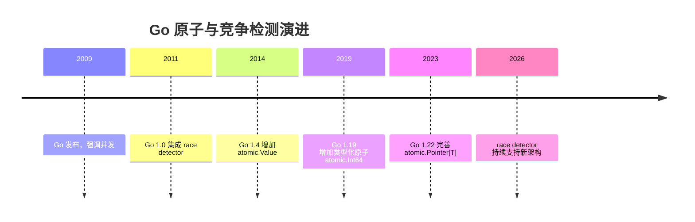
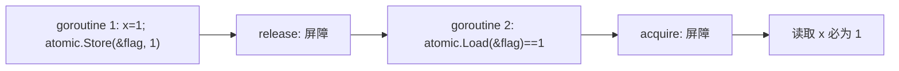

## 前置知识

- [单元测试与基准测试](/go/060-UnitTestBenchmark)：建议先完成前一篇的学习

## 学习目标

- 掌握「1. 历史动机与发展脉络」的核心机制、典型用法与常见陷阱
- 掌握「2. 形式化定义」的核心机制、典型用法与常见陷阱
- 掌握「3. 理论推导与原理解析」的核心机制、典型用法与常见陷阱
- 掌握「4. 代码示例（带详尽注释）」的核心机制、典型用法与常见陷阱
- 掌握「5. 对比分析」的核心机制、典型用法与常见陷阱


## 1. 历史动机与发展脉络

Go 以 goroutine 与 channel 闻名，但共享内存并发同样存在。2009 年 Go 发布时，团队就意识到数据竞争是并发 bug 的主要来源；2011 年 Go 1.0 前，Go 团队把 ThreadSanitizer（TSan）移植进工具链，`go test -race` 成为内置的竞争检测器。这一决策让 Go 在“并发正确性工具”上领先同期语言。

`sync/atomic` 自 Go 1.0 起提供基础的原子整数函数；Go 1.4 引入 `atomic.Value`（无锁读写任意类型）；Go 1.19 增加 `atomic.Int64`、`atomic.Bool` 等类型化封装，消除了“函数 + 指针”的易错写法；Go 1.22/1.23 继续完善类型化原子（`atomic.Pointer[T]`）与文档。硬件层面，x86 的 `LOCK` 前缀与 ARM 的 `LDXR/STXR` 指令是原子操作的实现基础，Go 运行时据此生成平台相关代码。



## 2. 形式化定义

### 2.1 数据竞争

当两个或多个 goroutine 同时访问同一内存位置，且至少一个访问是写操作、访问之间没有同步关系（happens-before 链）时，构成数据竞争。数据竞争是未定义行为：读取到的值可能是旧值、新值或撕裂值。

### 2.2 原子操作

原子操作是不可分割（indivisible）的机器级操作：执行期间其他 goroutine 无法观察到中间状态。Go 的原子函数分为五类：

加法：`AddInt32/AddInt64/AddUint32/AddUint64`；

加载：`LoadInt32/LoadInt64/LoadUintptr/LoadPointer`；

存储：`StoreInt32/StoreInt64/...`；

交换：`SwapInt32/SwapInt64/...`（返回旧值）；

比较交换：`CompareAndSwapInt32/CompareAndSwapInt64/...`（CAS，成功返回 true）。

`atomic.Value`：存储任意类型值的无锁容器，要求存入类型一致，首次 `Store` 决定类型。

类型化原子（Go 1.19+）：`atomic.Int64`、`atomic.Bool`、`atomic.Pointer[T]` 等，方法为 `Add/Load/Store/Swap/CompareAndSwap`。

### 2.3 内存序保证

Go 内存模型规定：原子操作形成同步边（synchronizes-with）。原子读 A 观察到原子写 B 的值时，B 之前的普通写入对 A 之后的读可见。`atomic.Load`/`Store` 提供 acquire/release 语义，配合编译器屏障与 CPU 屏障实现。



## 3. 理论推导与原理解析

### 3.1 竞争检测器原理

Go race detector 基于 ThreadSanitizer：编译期对每个内存访问插入检测代码；运行时维护每个 goroutine 的向量时钟（vector clock）与阴影内存（shadow memory）记录访问历史。当检测到两次无 happens-before 关系的访问且至少一次为写时，报告竞争，并打印两个 goroutine 的调用栈。

因此 `go test -race` 只能检测“执行路径上真实发生的竞争”，不能证明无竞争。覆盖率取决于测试是否并发触达所有路径。

### 3.2 CAS 循环与 ABA

`CompareAndSwap` 实现无锁更新的标准模式：循环读取旧值、计算新值、CAS 提交，失败则重试。ABA 问题：值从 A 变为 B 再变回 A，CAS 误以为未变化。Go 中指针 CAS 常见 ABA 场景可通过 `atomic.Pointer` + 版本号或 hazard pointer 解决；简单计数场景 ABA 通常无害。

### 3.3 伪共享

CPU 缓存行（通常 64 字节）是同步粒度。两个 goroutine 分别更新同一缓存行内的不同变量时，缓存一致性协议（MESI）导致缓存行在核心间乒乓传递，性能骤降。Go 中可通过填充（padding）让热点变量独占缓存行；`atomic` 类型本身不保证填充。

### 3.4 原子 vs 互斥锁

互斥锁提供临界区互斥，适合复合操作；原子操作无阻塞，适合单指令更新。锁会引发 goroutine 调度与上下文切换；原子在无竞争时是几条指令。但错误使用原子（复合逻辑）可能引入比锁更隐蔽的 bug，因此经验法则是“默认用锁，测量后再优化为原子”。

## 4. 代码示例（带详尽注释）

### 4.1 未加锁的计数器（演示竞争）

```go
package main

import (
	"fmt"
	"sync"
)

func main() {
	var counter int
	var wg sync.WaitGroup

	// 100 个 goroutine 并发递增
	for i := 0; i < 100; i++ {
		wg.Add(1)
		go func() {
			defer wg.Done()
			for j := 0; j < 1000; j++ {
				counter++ // 数据竞争：读-改-写不是原子的
			}
		}()
	}
	wg.Wait()
	fmt.Println("counter =", counter) // 通常小于 100000
}
```

讲解：`counter++` 在机器层面是 load、add、store 三步，多个 goroutine 交错执行时丢更新。用 `go run -race main.go` 会立即报告竞争；`go test -race` 是 CI 标准做法。运行结果往往小于 100000，且每次不同。

### 4.2 原子计数器

```go
package main

import (
	"fmt"
	"sync"
	"sync/atomic"
)

func main() {
	// 类型化原子：Go 1.19+ 推荐
	var counter atomic.Int64
	var wg sync.WaitGroup

	for i := 0; i < 100; i++ {
		wg.Add(1)
		go func() {
			defer wg.Done()
			for j := 0; j < 1000; j++ {
				counter.Add(1) // 单指令原子递增
			}
		}()
	}
	wg.Wait()
	fmt.Println("counter =", counter.Load())
}
```

讲解：`atomic.Int64.Add(1)` 在 x86 上编译为 `LOCK XADD`，100 个 goroutine 并发递增结果恒为 100000。`Load` 原子读取避免读到撕裂值。类型化 API 不需要传指针，且自带零值可用语义。

### 4.3 原子标志与配置快照

```go
package main

import (
	"fmt"
	"sync"
	"sync/atomic"
)

// 全局服务开关：只允许 0/1 两个状态
var running atomic.Bool

// 配置快照：原子指针指向不可变配置对象
type Config struct {
	Mode string
	Port int
}

var config atomic.Pointer[Config]

func main() {
	// 初始配置
	config.Store(&Config{Mode: "prod", Port: 8080})
	running.Store(true)

	var wg sync.WaitGroup
	for i := 0; i < 10; i++ {
		wg.Add(1)
		go func() {
			defer wg.Done()
			// 读者：一次 Load 获得一致快照
			c := config.Load()
			fmt.Println(c.Mode, c.Port, running.Load())
		}()
	}

	// 写者：整体替换配置对象
	config.Store(&Config{Mode: "canary", Port: 9090})
	wg.Wait()
}
```

讲解：`atomic.Pointer[Config]` 实现无锁“配置热更新”：写者构造新对象后 Store，读者 Load 拿到的是完整一致的旧对象或新对象，绝不可能读到“Mode 是新的但 Port 是旧的”的中间状态。这是 Go 1.22 起推荐的快照模式。

### 4.4 CAS 循环实现无锁更新

```go
package main

import (
	"fmt"
	"sync/atomic"
)

// 基于旧值计算新值的复合更新：CAS 循环
func bumpIfBelow(value *atomic.Int64, limit int64) bool {
	for {
		old := value.Load()
		if old >= limit {
			return false // 已达上限，放弃
		}
		// 尝试提交；失败说明其他 goroutine 已更新，重试
		if value.CompareAndSwap(old, old+1) {
			return true
		}
	}
}

func main() {
	var n atomic.Int64
	fmt.Println(bumpIfBelow(&n, 5)) // true
	fmt.Println(bumpIfBelow(&n, 5)) // true
}
```

讲解：CAS 循环解决“读-算-写”复合操作的原子性。`CompareAndSwap(old, new)` 只在当前值仍为 old 时写入 new，否则返回 false 并重试。无竞争时通常一次成功；高竞争时重试次数增加，但不会死锁。

### 4.5 atomic.Value 的兼容用法

```go
package main

import (
	"fmt"
	"sync/atomic"
)

func main() {
	var v atomic.Value
	// 首次 Store 决定类型：后续必须同类型
	v.Store("hello")

	// Load 返回 any，需要类型断言
	s := v.Load().(string)
	fmt.Println(s)
}
```

讲解：`atomic.Value` 是泛型前的通用方案，类型化原子出现后多数场景可替换为 `atomic.Pointer[T]`。若误存不同类型，Store 会 panic。

### 4.6 互斥锁版本（对比）

```go
package main

import (
	"fmt"
	"sync"
)

// 需要多步复合逻辑时，互斥锁更简单清晰
type Balance struct {
	mu    sync.Mutex
	value int64
}

func (b *Balance) Deposit(amount int64) {
	b.mu.Lock()
	defer b.mu.Unlock()
	// 临界区内的复合逻辑可以安全地多次读改
	if amount > 0 {
		b.value += amount
	}
}

func main() {
	var b Balance
	b.Deposit(100)
	fmt.Println(b.value)
}
```

讲解：锁适合复合业务逻辑（校验 + 更新 + 通知）。`defer b.mu.Unlock()` 保证 panic 时也解锁。原子与锁的选择：单指令更新用原子，多步逻辑用锁。

## 5. 对比分析

### 5.1 并发原语对比

| 原语 | 阻塞 | 适用场景 | 风险 |
| --- | --- | --- | --- |
| sync.Mutex | 阻塞 | 临界区复合逻辑 | 死锁、锁竞争 |
| sync/atomic | 无阻塞 | 计数器、标志、快照 | 复合逻辑易错 |
| channel | 阻塞/缓冲 | 任务分发、结果收集 | 死锁、goroutine 泄漏 |
| 单 goroutine 串行 | 无 | 状态机、事件循环 | 吞吐上限 |

### 5.2 原子与锁的性能

无竞争时原子操作约几十纳秒，锁约几百纳秒（含 futex 路径）；高竞争时两者都退化，锁可能触发内核调度。基准测试（`testing.B`）应覆盖低竞争与高竞争两种场景再下结论。

### 5.3 类型化原子与函数式原子

`atomic.AddInt64(&x, 1)` 需要取地址且类型由函数名体现；`atomic.Int64` 类型化后方法名简短、零值可用、误用减少。Go 1.19+ 新代码优先类型化 API。

## 6. 常见陷阱与最佳实践

陷阱一：只用 `go run` 而不加 `-race`。竞争检测必须显式开启，CI 中应固定 `go test -race ./...`。

陷阱二：把原子用于复合逻辑（如先 Load 再决定 Store）。应使用 CAS 循环或锁。

陷阱三：误用 `atomic.Value` 存不同类型导致 panic。改用 `atomic.Pointer[T]`。

陷阱四：忽略 32 位平台的 64 位对齐要求。旧版函数式 API 要求 64 位值 8 字节对齐，类型化原子内部处理该约束。

陷阱五：把原子当作内存屏障的万能替代。需要复杂内存序时，理解 Go 内存模型或改用同步原语。

陷阱六：对非热点路径使用原子造成可读性损失。先写正确清晰的锁版本，基准测试证明瓶颈后再无锁化。

最佳实践：默认 `sync` 原语；热点单计数器用 `atomic.Int64`；配置/快照用 `atomic.Pointer[T]`；每次提交前跑 `go test -race`；性能结论以基准测试为准。

## 7. 工程实践

### 7.1 CI 竞争检测

```yaml
# GitHub Actions 片段：所有测试启用竞争检测
steps:
  - uses: actions/setup-go@v5
    with:
      go-version: "1.24"
  - run: go build ./...
  - run: go test -race -count=1 ./...
  - run: go vet ./...
```

讲解：`-count=1` 禁用测试缓存保证真实执行；`-race` 会让测试运行变慢（约 5-20 倍），因此 CI 与本地开发都应开启，但可对压力测试任务单独配置。

### 7.2 原子计数器基准

```go
package bench

import (
	"sync"
	"sync/atomic"
	"testing"
)

func BenchmarkAtomic(b *testing.B) {
	var n atomic.Int64
	b.RunParallel(func(pb *testing.PB) {
		for pb.Next() {
			n.Add(1)
		}
	})
}

func BenchmarkMutex(b *testing.B) {
	var mu sync.Mutex
	var n int64
	b.RunParallel(func(pb *testing.PB) {
		for pb.Next() {
			mu.Lock()
			n++
			mu.Unlock()
		}
	})
}
```

讲解：`RunParallel` 模拟多 goroutine 竞争。用 `go test -bench=. -benchmem` 对比，数据驱动“用原子还是用锁”的决策。

## 8. 案例研究：无锁请求计数与限流

需求：HTTP 服务统计总请求数与并发峰值，并按窗口限流。

```go
package main

import (
	"fmt"
	"net/http"
	"sync/atomic"
	"time"
)

// 统计器：全部使用类型化原子
type Stats struct {
	total       atomic.Int64 // 总请求
	active      atomic.Int64 // 当前并发
	peak        atomic.Int64 // 并发峰值
	maxRequests atomic.Int64 // 限流阈值
}

func (s *Stats) Middleware(next http.Handler) http.Handler {
	return http.HandlerFunc(func(w http.ResponseWriter, r *http.Request) {
		// 限流检查：超过阈值直接拒绝
		if s.active.Load() >= s.maxRequests.Load() {
			http.Error(w, "too many requests", http.StatusTooManyRequests)
			return
		}

		s.total.Add(1)
		cur := s.active.Add(1)
		// CAS 循环更新峰值
		for {
			peak := s.peak.Load()
			if cur <= peak || s.peak.CompareAndSwap(peak, cur) {
				break
			}
		}

		defer s.active.Add(-1)
		next.ServeHTTP(w, r)
	})
}

func main() {
	var stats Stats
	stats.maxRequests.Store(1000)
	http.ListenAndServe(":8080", stats.Middleware(http.DefaultServeMux))
	_ = time.Now
	_ = fmt.Println
}
```

讲解：`active.Add(1)` 原子递增并返回新值，配合 CAS 更新峰值；限流检查与递增之间是竞态窗口（可能略微超限），但作为近似限流可接受。要精确限流，使用 token bucket 加锁实现。该模式在生产埋点系统中非常常见。

## 9. 知识要点总结与深入讲解

数据竞争的本质是“无同步的并发读写”。`-race` 检测器是 Go 工程化的基石：它把隐蔽的并发错误转化为可复现的报告，代价是测试变慢，但收益远大于成本。

原子操作解决“单点更新”，CAS 解决“条件更新”，锁解决“复合逻辑”。三者的选择不取决于性能直觉，而取决于操作的结构。Go 的并发哲学鼓励“通过通信共享内存”，但共享内存场景下原子与锁仍是必需品。

内存模型是原子语义的底层契约：原子操作提供 happens-before 边界，保证周边普通读写的可见性。理解这一契约，才能写出既正确又高效的并发代码。

### 概述

并发编程中，多个 goroutine 同时访问共享数据可能导致数据竞争（data race），产生难以复现和调试的问题。Go 提供了内置的竞态检测器（race detector）和 atomic 包来帮助发现和解决竞态问题。竞态检测器可以在运行时发现数据竞争，原子操作则提供了无锁的并发安全原语。

### 基础概念

#### 什么是数据竞争

数据竞争发生在以下条件同时满足时：

1. 两个或多个 goroutine 同时访问同一内存
2. 至少一个访问是写操作
3. 没有使用同步机制保护访问

```go
// 数据竞争示例
var counter int

func main() {
    go func() { counter++ }()  // goroutine 1 写
    counter++                   // goroutine 0 写
    // 两个 goroutine 同时写 counter，存在数据竞争
}
```

#### 竞态检测器的工作原理

Go 的竞态检测器基于 ThreadSanitizer（TSan）实现，在编译时插入额外的指令来追踪内存访问。它会在运行时检测到数据竞争并报告。

### 快速上手

#### 启用竞态检测

```bash
# 测试时启用
go test -race ./...

# 构建时启用
go build -race -o myapp .

# 运行时启用
go run -race main.go
```

#### 修复数据竞争

```go
// 有竞态的代码
var counter int

func unsafeIncrement() {
    go func() { counter++ }()
    counter++
}

// 修复方式一：使用互斥锁
var (
    counter2 int
    mu       sync.Mutex
)

func safeIncrement() {
    mu.Lock()
    counter2++
    mu.Unlock()
}

// 修复方式二：使用原子操作
var counter3 int64

func atomicIncrement() {
    atomic.AddInt64(&counter3, 1)
}

// 修复方式三：使用 channel
func channelIncrement(ch chan int) {
    ch <- 1
}
```

### 详细用法

#### 竞态检测报告解读

```bash
==================
WARNING: DATA RACE
Write at 0x00c0000b2008 by goroutine 7:
  main.increment()
      /path/main.go:10 +0x3a

Previous write at 0x00c0000b2008 by goroutine 6:
  main.increment()
      /path/main.go:10 +0x3a

Goroutine 7 (running) created at:
  main.main()
      /path/main.go:15 +0x85
==================
```

报告包含以下信息：

- 冲突类型（Read/Write）
- 内存地址
- 冲突的两个 goroutine
- 代码位置（文件名和行号）
- goroutine 的创建位置

#### atomic 操作详解

##### 基本原子操作

```go
var value int64

// 加载：原子读取
v := atomic.LoadInt64(&value)

// 存储：原子写入
atomic.StoreInt64(&value, 42)

// 加减：原子增减
atomic.AddInt64(&value, 1)   // 加 1
atomic.AddInt64(&value, -1)  // 减 1

// 比较并交换（CAS）：如果当前值等于 old，则设为 new
swapped := atomic.CompareAndSwapInt64(&value, 0, 1)
// 如果 value == 0，则设为 1，返回 true
// 否则不做任何操作，返回 false

// 交换：原子替换并返回旧值
old := atomic.SwapInt64(&value, 100)
// value 被设为 100，old 是之前的值
```

##### atomic.Value

atomic.Value 可以原子地存储和加载任意类型的值：

```go
var config atomic.Value

type Config struct {
    Timeout time.Duration
    MaxConn int
}

// 存储
config.Store(Config{Timeout: 30 * time.Second, MaxConn: 100})

// 加载
c := config.Load().(Config)  // 需要类型断言
fmt.Println(c.Timeout, c.MaxConn)

// 安全地更新配置
func updateConfig(timeout time.Duration, maxConn int) {
    config.Store(Config{Timeout: timeout, MaxConn: maxConn})
}
```

##### atomic.Pointer（Go 1.19+）

Go 1.19 引入了类型安全的原子指针：

```go
var ptr atomic.Pointer[Config]

// 存储
ptr.Store(&Config{Timeout: 30 * time.Second})

// 加载
c := ptr.Load()
if c != nil {
    fmt.Println(c.Timeout)
}
```

#### 常见竞态模式

##### 初始化竞态

```go
// 有竞态：延迟初始化
var instance *Service

func GetService() *Service {
    if instance == nil {          // 多个 goroutine 可能同时通过此检查
        instance = &Service{}     // 多次初始化
    }
    return instance
}

// 修复方式一：sync.Once（推荐）
var (
    instance2 *Service
    once      sync.Once
)

func GetServiceSafe() *Service {
    once.Do(func() {
        instance2 = &Service{}
    })
    return instance2
}

// 修复方式二：包级初始化
var instance3 = &Service{}  // 在包初始化时创建
```

##### 切片竞态

```go
// 有竞态：并发 append
var items []int

// 修复：使用互斥锁
var (
    items2 []int
    mu     sync.Mutex
)

func appendItem(item int) {
    mu.Lock()
    items2 = append(items2, item)
    mu.Unlock()
}

// 修复：使用 channel 收集
func collectItems(ch <-chan int) []int {
    var items []int
    for item := range ch {
        items = append(items, item)
    }
    return items
}
```

##### Map 竞态

```go
// 有竞态：并发读写 map
var cache = make(map[string]string)

// 修复方式一：sync.RWMutex
var (
    cache2 = make(map[string]string)
    rwm    sync.RWMutex
)

func get(key string) string {
    rwm.RLock()
    defer rwm.RUnlock()
    return cache2[key]
}

func set(key, value string) {
    rwm.Lock()
    defer rwm.Unlock()
    cache2[key] = value
}

// 修复方式二：sync.Map（适合读多写少）
var cache3 sync.Map

func get3(key string) (string, bool) {
    v, ok := cache3.Load(key)
    if !ok {
        return "", false
    }
    return v.(string), true
}

func set3(key, value string) {
    cache3.Store(key, value)
}
```

### 常见场景

#### 场景一：并发计数器

```go
// 使用原子操作实现高性能计数器
type AtomicCounter struct {
    value int64
}

func (c *AtomicCounter) Inc() {
    atomic.AddInt64(&c.value, 1)
}

func (c *AtomicCounter) Dec() {
    atomic.AddInt64(&c.value, -1)
}

func (c *AtomicCounter) Get() int64 {
    return atomic.LoadInt64(&c.value)
}

func (c *AtomicCounter) Reset() int64 {
    return atomic.SwapInt64(&c.value, 0)
}
```

#### 场景二：无锁状态标志

```go
// 使用 CAS 实现无锁状态切换
type State int32

const (
    StateIdle State = iota
    StateRunning
    StateStopped
)

var state int32 = int32(StateIdle)

func start() bool {
    // 只有在 Idle 状态才能启动
    return atomic.CompareAndSwapInt32(&state, int32(StateIdle), int32(StateRunning))
}

func stop() bool {
    // 只有在 Running 状态才能停止
    return atomic.CompareAndSwapInt32(&state, int32(StateRunning), int32(StateStopped))
}
```

#### 场景三：并发安全的配置热更新

```go
var currentConfig atomic.Value

func init() {
    currentConfig.Store(Config{
        Timeout: 30 * time.Second,
        MaxConn: 100,
    })
}

// 读取配置（无锁，高性能）
func getConfig() Config {
    return currentConfig.Load().(Config)
}

// 更新配置（原子替换）
func updateConfig(newCfg Config) {
    currentConfig.Store(newCfg)
}
```

### 注意事项

- 竞态检测有性能开销（约 5-10 倍），不要在生产环境长期开启
- 竞态检测只能发现实际执行到的代码路径，无法保证发现所有竞态
- 原子操作只保证单个操作的原子性，复合操作仍需加锁
- atomic.Value 存储的值每次都应该是新的，不要修改已存储的对象
- 使用 `-race` 运行测试时，确保覆盖足够的并发场景
- 性能对比参考：Mutex 约 20ns/op，atomic 约 5ns/op，无同步约 1ns/op（但不安全）

### 进阶用法

#### 自旋锁

使用 CAS 实现简单的自旋锁：

```go
type SpinLock struct {
    state int32
}

func (l *SpinLock) Lock() {
    // 自旋等待，直到成功将 state 从 0 改为 1
    for !atomic.CompareAndSwapInt32(&l.state, 0, 1) {
        runtime.Gosched()  // 让出 CPU
    }
}

func (l *SpinLock) Unlock() {
    atomic.StoreInt32(&l.state, 0)
}
```

#### 无锁队列

```go
// 简化的无锁队列（使用 CAS）
type Node struct {
    value int
    next  *Node
}

type LockFreeQueue struct {
    head *Node
    tail *Node
}

func (q *LockFreeQueue) Enqueue(value int) {
    newNode := &Node{value: value}
    for {
        tail := q.tail
        if atomic.CompareAndSwapPointer((*unsafe.Pointer)(unsafe.Pointer(&q.tail)),
            unsafe.Pointer(tail), unsafe.Pointer(newNode)) {
            tail.next = newNode
            return
        }
    }
}
```

#### 使用竞态检测的 CI 集成

```yaml
# GitHub Actions 中集成竞态检测
- name: Race Test
  run: go test -race -count=1 ./...

- name: Race Test with timeout
  run: go test -race -timeout 5m -count=1 ./...
```

#### 运行时分析竞态

```go
import "runtime"

func debugRace() {
    // 设置 GOMAXPROCS 增加并发度，更容易触发竞态
    runtime.GOMAXPROCS(runtime.NumCPU())

    // 使用 -race 标志编译后运行
    // 增加测试迭代次数提高检测概率
}
```
