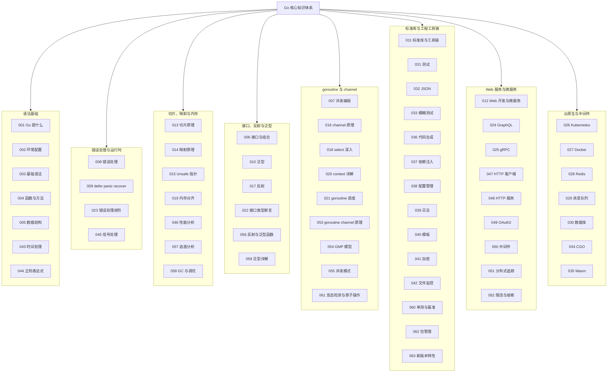

本文是对 Go 模块全部 63 篇文档的收束与回顾。我们用一个贯穿始终的"虚拟歌手音乐平台"案例——P 主（producer）制作歌曲、歌姬（virtual singer）登台演唱、粉丝团统计应援数据——把语法、并发、抽象与工程化四大主线串成一张可以反复查阅的知识网。读完本文，你应该能凭记忆定位任何一个主题对应的模块文档。

## 前置知识

- [Go 是什么：为大规模工程而生的简洁语言](/go/001-WhatIsGo)：理解 Go 的语言定位与"一种写法"哲学。
- [Go 基础语法](/go/003-GoBasicSyntax)：变量声明、零值、指针与 defer 等基本语言设施。
- [Go 并发编程](/go/007-GoConcurrentProgramming)：goroutine、channel、sync 与 context 的全景图。

## 学习目标

1. 串联模块全部 63 篇文档，形成"语法基础、并发编程、接口与泛型、工程与工具链"四层知识骨架，做到看到任何主题能立刻定位对应文档。
2. 用统一的"虚拟歌手音乐平台"案例复述 Go 的核心写法：多返回值、错误接口、隐式接口实现、类型参数与 CSP 并发。
3. 辨析 goroutine 与 OS 线程、数组与切片、nil 接口与 nil 指针等易混淆概念。
4. 掌握竞态检测、切片共享底层数组、map 并发写等典型陷阱的成因与排查手段。
5. 明确进阶方向：Web 与微服务、性能剖析、GC 调优与云原生。

## 知识地图

模块 63 篇文档按主题分为八组，每组内的编号即学习顺序：



## 核心概念回顾

### 1. 语法基础：短声明、零值与方法

Go 刻意把关键词压到 25 个：函数内用 `:=` 短声明，未初始化的变量保证得到零值（数字为 0、字符串为空串、布尔为 false），没有"未定义行为式的脏数据"。方法就是带接收者的函数，值接收者适合只读场景，指针接收者用于修改字段或避免大结构体拷贝。这套极简设计换来的是"一万个人写出同一模子"的团队协作效率。

```go
package main

import "fmt"

// 1. 定义 P 主结构体：名字与应援色两个字段
type Producer struct {
	Name  string
	Color string
}

// 2. 值接收者方法：只读不改，返回自我介绍
func (p Producer) Introduce() string {
	return "我是 P 主 " + p.Name + "，应援色是 " + p.Color
}

func main() {
	// 3. 短变量声明创建实例；未赋值的 Color 自动为零值空串
	p := Producer{Name: "星轨"}
	fmt.Println(p.Introduce())
}
```

### 2. 切片与映射：动态集合的双子星

切片是 24 字节的"指针 + 长度 + 容量"三元组，传递时拷贝头但共享底层数组，`append` 在容量不足时按扩容算法新开数组；映射则是哈希表，读取不存在的键返回零值而非报错，这让 `counter[key]++` 的累加写法天然安全。两者的底层实现分别见[切片原理](/go/013-SlicePrinciple)与[映射原理](/go/014-MapPrinciple)。

```go
package main

import "fmt"

func main() {
	// 1. 切片收集歌单，append 容量不足时自动扩容
	playlist := []string{"星屑", "回声"}
	playlist = append(playlist, "极光")

	// 2. 映射统计播放量：键不存在时取零值 0，可直接累加
	plays := map[string]int{}
	for _, song := range playlist {
		plays[song] += 100
	}

	// 3. 遍历映射的顺序随机，业务逻辑绝不能依赖它
	for song, n := range plays {
		fmt.Printf("%s 播放 %d 次\n", song, n)
	}
}
```

### 3. 多返回值与错误处理

Go 没有 try/catch，`error` 就是一个只含 `Error() string` 方法的接口，与结果值并列返回，调用方必须显式检查。`fmt.Errorf` 的 `%w` 动词可以包装底层错误，再用 `errors.Is` 与 `errors.As` 沿包装链判断与解包，进阶写法见[错误处理进阶](/go/023-ErrorHandlingAdvanced)。"错误是值"意味着错误可以被存储、传递与组合，这是 Go 错误处理哲学的根基。

```go
package main

import (
	"errors"
	"fmt"
)

// 1. 定义哨兵错误：查询的歌曲不存在
var errSongNotFound = errors.New("歌曲不存在")

// 2. 多返回值：结果与错误并列给出，签名即契约
func findSong(id int) (string, error) {
	if id != 1 {
		return "", fmt.Errorf("查询失败: %w", errSongNotFound)
	}
	return "星屑", nil
}

func main() {
	// 3. 调用方必须显式处理错误，编译器不做任何兜底
	name, err := findSong(2)
	if err != nil {
		fmt.Println("出错了:", errors.Is(err, errSongNotFound)) // true
		return
	}
	fmt.Println("找到歌曲:", name)
}
```

### 4. 接口与组合：隐式实现的面向抽象

Go 的接口是方法签名的集合，类型实现接口不需要任何声明语句，"实现了方法就算实现"。接口值在运行时由"类型指针 + 数据指针"两部分组成，这也是 nil 接口陷阱的根源。组合优于继承：小接口（如 `io.Reader` 的单方法接口）通过嵌入拼装成大接口，函数参数尽量声明为最小接口以获得最大复用。

```go
package main

import "fmt"

// 1. 定义歌姬接口：能唱歌、能报应援色
type Singer interface {
	Sing(song string) string
	Color() string
}

// 2. 虚拟歌姬结构体隐式实现接口，无需 implements 声明
type VirtualSinger struct{ Name string }

func (s VirtualSinger) Sing(song string) string { return s.Name + " 演唱《" + song + "》" }
func (s VirtualSinger) Color() string           { return "星空蓝" }

func main() {
	// 3. 面向接口编程：变量类型是 Singer，任何实现者都能登台
	var s Singer = VirtualSinger{Name: "初霜"}
	fmt.Println(s.Sing("极光"), "应援色", s.Color())
}
```

### 5. 泛型：类型参数与约束

Go 1.18 引入泛型后，"为每种类型抄一遍函数"或"用 any 再断言"的历史结束了。类型参数写在方括号里，约束（constraint）限定该类型必须支持的操作，标准库的 `cmp.Ordered` 覆盖了所有可排序类型。泛型在编译期实例化，没有运行时装箱开销；深度内容见[泛型详解](/go/059-GenericDetailed)。

```go
package main

import (
	"cmp"
	"fmt"
)

// 1. 约束 cmp.Ordered：类型参数 T 必须支持大小比较
// 2. 泛型函数：在任意可比较的列表中找最大值
func top[T cmp.Ordered](list []T) T {
	max := list[0]
	for _, v := range list[1:] {
		if v > max {
			max = v
		}
	}
	return max
}

func main() {
	// 3. 同一函数适配不同类型：找人气最高的票数与歌名
	fmt.Println(top([]int{520, 1314, 999}))          // 1314
	fmt.Println(top([]string{"星屑", "极光", "回声"})) // 极光
}
```

### 6. goroutine 与 channel：CSP 并发

`go` 关键字以微秒级成本启动一个初始栈仅 2KB 的 goroutine，由运行时按 GMP 模型调度到少量 OS 线程上；channel 则在 goroutine 之间传递数据，"不要通过共享内存来通信，而要通过通信来共享内存"。带缓冲的 channel 可以解耦生产与消费速度，channel 的关闭语义与底层实现见[channel 原理](/go/016-ChannelPrinciple)。

```go
package main

import "fmt"

func main() {
	// 1. 带缓冲的 channel 汇总三场演唱会的售票结果
	results := make(chan int, 3)

	// 2. go 关键字并发执行匿名函数，i 作为参数传入避免共享循环变量
	for i := 1; i <= 3; i++ {
		go func(id int) {
			results <- id * 1000 // 模拟每场售出 1000*id 张票
		}(i)
	}

	// 3. 主 goroutine 收集结果，channel 收发天然同步，无需加锁
	total := 0
	for i := 0; i < 3; i++ {
		total += <-results
	}
	fmt.Println("三场演唱会共售票", total)
}
```

### 7. select 与 context：并发控制双子

`select` 让一个 goroutine 同时等待多个 channel 操作，是超时、取消与多路分发的语法基石；`context` 则沿调用树传递取消信号与截止时间，是微服务链路上每个阻塞调用都应携带的第一个参数。两者配合可以实现"要么拿到数据、要么按时放弃"的确定性控制，调度层面的 GMP 细节见[Goroutine 调度](/go/021-GoroutineSchedule)。

```go
package main

import (
	"context"
	"fmt"
	"time"
)

func main() {
	// 1. 创建 2 秒超时的 context，控制演唱会直播推流
	ctx, cancel := context.WithTimeout(context.Background(), 2*time.Second)
	defer cancel() // 及时释放资源，防止 context 泄漏

	// 2. 模拟推流 goroutine：3 秒后才产出画面帧
	stream := make(chan string)
	go func() {
		time.Sleep(3 * time.Second)
		stream <- "歌姬画面"
	}()

	// 3. select 同时监听数据与超时，谁先就绪走谁
	select {
	case frame := <-stream:
		fmt.Println("收到", frame)
	case <-ctx.Done():
		fmt.Println("推流超时:", ctx.Err()) // 本例走这条分支
	}
}
```

### 8. defer、panic 与 recover

`defer` 注册的调用在函数返回前按后进先出执行，是"打开/关闭、加锁/解锁"这类成对操作的保障；`panic` 用于不可恢复的程序级故障，`recover` 只有在 defer 函数中调用才生效，可以把 panic 转回普通错误。规则要记牢：业务失败用 error，panic 只留给"程序已无法继续"的场景，深挖见[defer panic recover 深入](/go/009-DeferPanicRecoverDeepDive)。

```go
package main

import "fmt"

// 1. recover 必须写在 defer 函数里，否则无法捕获 panic
func safeStage() {
	defer func() {
		if r := recover(); r != nil {
			fmt.Println("舞台事故已处理:", r)
		}
	}()
	panic("歌姬设备故障")
}

func main() {
	// 2. defer 按后进先出顺序执行：先注册的后执行
	defer fmt.Println("1. 清扫舞台")
	defer fmt.Println("2. 关闭灯光")
	safeStage()
	fmt.Println("3. 演出继续")
}
```

### 9. 测试与工程工具链

Go 把测试做进工具链：`go test` 运行 `_test.go` 中的测试，表格驱动是社区公认的惯用写法；`go vet` 静态检查可疑代码，`go test -race` 检测数据竞争，`go mod` 管理依赖版本。模糊测试（fuzzing）、基准测试与代码生成详见[测试](/go/031-GoTest)、[单测与基准](/go/060-UnitTestBenchmark)与[代码生成](/go/036-GoCodeGeneration)。

```go
package stage

import "testing"

// 1. 被测函数：根据点赞与转发计算歌曲应援指数
func SupportIndex(likes, shares int) int {
	return likes*2 + shares*3
}

// 2. 表格驱动测试：用例是数据，循环逐行验证
func TestSupportIndex(t *testing.T) {
	cases := []struct {
		name          string
		likes, shares int
		want          int
	}{
		{"只有点赞", 10, 0, 20},
		{"只有转发", 0, 5, 15},
		{"混合计入", 1, 1, 5},
	}
	for _, c := range cases {
		if got := SupportIndex(c.likes, c.shares); got != c.want {
			t.Errorf("%s: got %d, want %d", c.name, got, c.want)
		}
	}
}
```

## 易混淆概念对比

goroutine 与 OS 线程是理解 Go 并发成本模型的第一道分水岭：

| 对比维度 | goroutine | OS 线程 |
| --- | --- | --- |
| 初始栈大小 | 2KB，可动态伸缩 | 1-8MB，固定分配 |
| 创建销毁成本 | 微秒级，完全由运行时管理 | 毫秒级，需内核参与 |
| 调度方式 | Go 运行时 M:N 调度（GMP 模型） | 操作系统内核 1:1 调度 |
| 上下文切换 | 用户态完成，约百纳秒 | 内核态切换，约 1-10 微秒 |
| 可行数量级 | 单进程百万级 | 单进程千级 |
| 推荐通信方式 | channel 与 context | 共享内存加锁 |

数组与切片则是数据结构层面最容易写错的一对：

| 对比维度 | 数组 `[N]T` | 切片 `[]T` |
| --- | --- | --- |
| 长度 | 编译期固定，是类型的一部分 | 运行时可变（len 与 cap 分离） |
| 类型身份 | `[3]int` 与 `[5]int` 是不同类型 | 所有 `[]T` 同类型 |
| 赋值与传参 | 整体拷贝（值类型） | 拷贝切片头，共享底层数组 |
| 字面量写法 | `[3]int{...}` 或 `[...]int{...}` | `[]T{...}` |
| 典型用途 | 固定尺寸矩阵、作为 map 键 | 几乎所有动态集合场景 |

## 常见误区与排查

**误区一：goroutine 闭包捕获循环变量。** Go 1.22 之前循环变量在所有迭代间共享，goroutine 实际执行时读到的是最终值。

```go
// 错误：三个 goroutine 打印的可能全是 3
for i := 0; i < 3; i++ {
    go func() { fmt.Println(i) }()
}
```

```go
// 修正：把变量作为参数传入，形成每次迭代独立的副本
for i := 0; i < 3; i++ {
    go func(id int) { fmt.Println(id) }(i)
}
```

**误区二：切片共享底层数组导致 append 覆盖。** 子切片的容量延伸到原数组末尾，对其 append 会直接写进原切片的元素。

```go
// 错误：s2 与 s1 共享底层数组，append 悄悄覆盖了 s1 的第三个元素
s1 := []string{"星屑", "回声", "极光"}
s2 := s1[:2]
s2 = append(s2, "夜航")
fmt.Println(s1) // [星屑 回声 夜航]
```

```go
// 修正：完整切片表达式把容量限制为 2，append 必然新开数组
s2 := s1[:2:2]
s2 = append(s2, "夜航")
```

**误区三：nil 接口陷阱。** 接口值等于"类型指针 + 数据指针"，装了一个 nil 指针的接口不是 nil 接口。

```go
// 错误：返回了类型为 *VirtualSinger 的 nil，接口本身不等于 nil
func getSinger() Singer {
    var p *VirtualSinger
    return p
}
fmt.Println(getSinger() == nil) // false
```

```go
// 修正：判空后显式返回真正的 nil 接口
func getSinger() Singer {
    var p *VirtualSinger
    if p == nil {
        return nil
    }
    return p
}
```

**误区四：重复关闭 channel 或向已关闭 channel 发送。** 两者都会直接 panic，且关闭必须是发送方的责任。

```go
// 错误：重复 close 触发 panic: close of closed channel
ch := make(chan int)
close(ch)
close(ch)
```

```go
// 修正：由唯一的发送出口负责关闭，用 defer 保证恰好一次
ch := make(chan int)
go func() {
    defer close(ch)
    ch <- 1
}()
fmt.Println(<-ch)
```

**误区五：map 并发读写。** map 不是并发安全的，多 goroutine 同时写入会触发运行时致命错误，`-race` 可以提前捕获。

```go
// 错误：并发写 map，运行时抛 fatal error: concurrent map writes
plays := map[string]int{}
for i := 0; i < 10; i++ {
    go func() { plays["星屑"]++ }()
}
```

```go
// 修正：用互斥锁保护，或改用分片映射、sync.Map
var mu sync.Mutex
plays := map[string]int{}
for i := 0; i < 10; i++ {
    go func() {
        mu.Lock()
        defer mu.Unlock()
        plays["星屑"]++
    }()
}
```

**误区六：main 退出不等待子 goroutine。** main 返回意味着整个进程结束，未完成的 goroutine 全部被丢弃。

```go
// 错误：main 先退出，这行输出大概率永远看不到
func main() {
    go fmt.Println("这段话大概率不会出现")
}
```

```go
// 修正：用 channel 或 sync.WaitGroup 等待子任务完成
func main() {
    done := make(chan struct{})
    go func() {
        fmt.Println("这次一定执行")
        close(done)
    }()
    <-done
}
```

## 自检清单

- [ ] 能说出 Go 刻意保持 25 个关键词的工程动机，以及"一种写法"对团队协作的意义
- [ ] 能默写切片头的三要素（指针、长度、容量），并解释 append 的扩容策略
- [ ] 能解释接口值的"类型指针 + 数据指针"结构，并复现 nil 接口陷阱
- [ ] 能用类型参数与 `cmp.Ordered` 约束写出一个泛型函数
- [ ] 能说清 GMP 模型中 G、M、P 各自的职责与工作窃取机制
- [ ] 能用 channel、select 与 context 组合实现可超时取消的并发任务
- [ ] 能正确使用 `errors.Is`、`errors.As` 与 `%w` 完成错误包装与判断
- [ ] 能解释 defer 的后进先出顺序与 recover 的生效条件
- [ ] 会用 `go test`、`go vet`、`go test -race` 完成日常质量检查
- [ ] 理解 go mod 的依赖声明与最小版本选择（MVS）规则

## 后续学习路径

1. [Go Web 开发与微服务](/go/012-GoWebDevelopmentMicroservice)：把语言能力落到 HTTP 服务与微服务架构。
2. [Go gRPC](/go/025-GoGRPC)：学习跨语言的高性能 RPC 服务定义与实现。
3. [Go 性能分析](/go/046-GoPerformanceAnalysis)：用 pprof 定位 CPU 与内存热点。
4. [GC 与调优](/go/058-GCAndTuning)：理解垃圾回收机制并掌握生产环境调优手段。
5. [Go Kubernetes](/go/026-GoKubernetes)：进入云原生领域，读懂并用 Go 扩展 Kubernetes。
6. [Go 新版本特性](/go/063-GoLatestFeatures)：跟进语言与工具链的最新演进。
