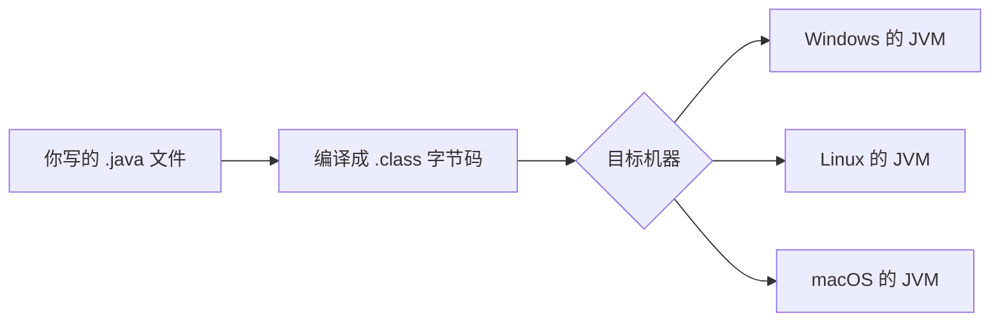

## Java 在技术版图中的位置

打开你手机里的银行、外卖、政务类 App，它们的后台大概率跑着 Java。**企业级服务端是 Java 的绝对主场**：银行系统、电商平台、大数据基础设施（Hadoop、Kafka 皆为 Java 系），二十余年积累的企业生态无可替代。

## 一次编写、到处运行的秘密

Java 代码不直接编译成某台机器的指令，而是编译成**字节码**，由**Java 虚拟机（JVM）**负责在不同操作系统上执行：



同一份字节码在任何装了 JVM 的机器上都能运行——这就是"一次编写、到处运行"。JVM 还附带自动内存管理（垃圾回收）：不再使用的内存会被自动回收，初学者不必像 C 语言那样手动管理。

## 第一个类

Java 的代码必须写在**类**里——这是它与 Python、JavaScript 最直观的差异：强制的面向对象结构。先混个眼熟：

```java
public class Hello {
    public static void main(String[] args) {
        System.out.println("你好，Java");
    }
}
```

`Hello` 是类名（必须与文件名一致）；`main` 方法是程序入口——JVM 从这里开始执行；`System.out.println` 向控制台打印一行。每个词的含义在本模块第二篇起逐一拆解，现在先让这段代码跑起来。

## 动手环节：编译并运行

安装 JDK 后（步骤见 [Java JDK 配置](/getting-started/024-JavaJdkConfig)），保存文件 `Hello.java`，在终端执行：

```bash
javac Hello.java   # 编译：生成 Hello.class 字节码
java Hello         # 运行：JVM 执行字节码，输出"你好，Java"
```

编译与运行分离，正是前面流程图的两步。真实项目会使用构建工具管理这套流程，本模块后续章节会讲 Maven 与 Gradle。

## 动手环节二：体验强类型

把 `main` 方法里加一行 `int x = 'abc';` 保存重新编译——编译器直接拒绝，报"类型不兼容"。**Java 的错误绝大多数在编译期就被拦下**，这与脚本语言"跑起来才炸"形成鲜明对比：上手稍繁琐，工程更可靠。

## 常见困惑

**"JDK、JRE、JVM 是什么关系？"**——JVM 是执行字节码的引擎；JRE = JVM + 运行所需类库；JDK = JRE + 编译器等开发工具。**写代码装 JDK 即可。**

**"Java 和 JavaScript 有关系吗？"**——几乎没有，名字相似纯属历史营销。JavaScript 最初叫 LiveScript。

## 下一步

进入 [Java 概述与开发环境](/java/002-JavaOverviewDevEnv) 系统学习；本仓库另有 kotlin 模块——它与 Java 运行于同一个 JVM，语法更现代，学完 Java 基础后交叉阅读收益极大。
