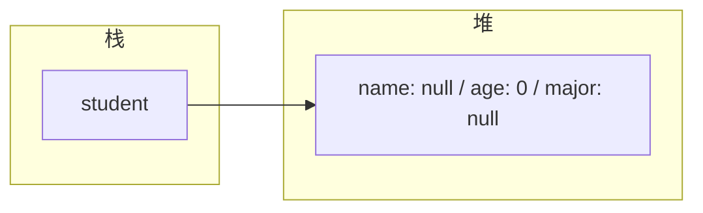

## 前置知识

- [Java String.format/printf/MessageFormat 语法速查手册](/java/014-JavaStringFormat)：建议先完成前一篇的学习

## 学习目标

- 掌握「0. 本节阅读指引（先读这一节）」的核心机制、典型用法与常见陷阱
- 掌握「1. 类与对象 (Class & Object)」的核心机制、典型用法与常见陷阱
- 掌握「2. 封装 (Encapsulation)」的核心机制、典型用法与常见陷阱
- 掌握「3. 继承 (Inheritance)」的核心机制、典型用法与常见陷阱
- 掌握「4. 多态 (Polymorphism)」的核心机制、典型用法与常见陷阱


## 0. 本节阅读指引（先读这一节）

本篇是「面向对象编程」，全模块核心。目标：理解类与对象、封装、继承、多态四大概念。

零基础第一遍只读：

1. 第 1 节 类与对象、2. 封装、3. 继承、4. 多态、5. this 关键字；
2. 每段代码亲手敲一遍。

可跳过：6-7 节（设计原则与实际应用案例）浏览；8. 常见陷阱与文末速查小节第二遍细读。

> 记住：类是模板、对象是实例；继承表达 is-a 关系，多态靠父类引用调用子类实现。


## 1. 类与对象 (Class & Object)

### 1.1 类的定义

类是对象的模板，定义了对象的属性和行为。

```java
 public class Student {
  // 属性 (成员变量)
  private String name;
  private int age;
  private String major;
  // 行为 (方法)
  public void study() {
  System.out.println(name + " is studying.");
  }
  public void introduce() {
  System.out.println("I'm " + name + ", " + age + " years old, major in " + major);
  }
 }
```

### 1.2 类的结构

- **成员变量** (Fields): 类的属性，存储对象的状态
- **方法** (Methods): 类的行为，定义对象的操作
- **构造器** (Constructors): 用于创建对象的特殊方法
- **代码块** (Blocks): 静态代码块和实例代码块
- **内部类** (Inner Classes): 类中定义的类

### 1.3 对象的创建与使用

#### 1.3.1 对象的创建

使用 `new` 关键字创建对象。



#### 1.3.2 对象的内存布局

- **栈 (Stack)**: 存放对象引用变量
- **堆 (Heap)**: 存放对象的实际数据


### 1.4 构造器 (Constructors)

构造器用于初始化对象，与类同名，无返回值。

#### 1.4.1 默认构造器

如果类中没有定义构造器，编译器会自动生成一个无参构造器。

```java
 public class Student {
  // 默认构造器（由编译器生成）
  public Student() {
  }
 }
```

#### 1.4.2 自定义构造器

可以定义多个构造器，实现方法重载。

```java
 public class Student {
  private String name;
  private int age;
  private String major;
  // 无参构造器
  public Student() {
  }
  // 带参数的构造器
  public Student(String name, int age) {
  this.name = name;
  this.age = age;
  }
  // 全参构造器
  public Student(String name, int age, String major) {
  this.name = name;
  this.age = age;
  this.major = major;
  }
 }
```

#### 1.4.3 构造器的调用

```java
 // 使用无参构造器
 Student student1 = new Student();
 // 使用带参数的构造器
 Student student2 = new Student("Bob", 21);
 // 使用全参构造器
 Student student3 = new Student("Charlie", 22, "Software Engineering");
```

## 2. 封装 (Encapsulation)

### 2.1 封装的概念

封装是指将对象的状态和行为封装起来，只暴露必要的接口，隐藏实现细节。

### 2.2 访问修饰符

| 修饰符      | 类内 | 同包 | 子类 | 任意位置 |
| ----------- | ---- | ---- | ---- | -------- |
| `private`   |      |      |      |          |
| `default`   |      |      |      |          |
| `protected` |      |      |      |          |
| `public`    |      |      |      |          |

### 2.3 封装的实现

使用 `private` 修饰符隐藏属性，通过 getter/setter 方法暴露接口。

```java
 public class Student {
  // 私有属性
  private String name;
  private int age;
  private String major;
  // Getter 方法
  public String getName() {
  return name;
  }
  public int getAge() {
  return age;
  }
  public String getMajor() {
  return major;
  }
  // Setter 方法
  public void setName(String name) {
  this.name = name;
  }
  public void setAge(int age) {
  if (age >= 0 && age <= 150) {
  this.age = age;
  } else {
  System.out.println("Invalid age");
  }
  }
  public void setMajor(String major) {
  this.major = major;
  }
 }
```

### 2.4 封装的优点

- **安全性**: 防止外部直接修改对象状态
- **可维护性**: 内部实现可以自由修改，不影响外部使用
- **可读性**: 明确对象的接口和职责
- **灵活性**: 可以在 setter 中添加验证逻辑

## 3. 继承 (Inheritance)

### 3.1 继承的概念

继承是指一个类（子类）继承另一个类（父类）的属性和方法，实现代码复用。

### 3.2 继承的语法

使用 `extends` 关键字。

```java
 // 父类
 public class Animal {
  protected String name;
  public void eat() {
  System.out.println(name + " is eating.");
  }
  public void sleep() {
  System.out.println(name + " is sleeping.");
  }
 }
 // 子类
 public class Dog extends Animal {
  public void bark() {
  System.out.println(name + " is barking.");
  }
 }
```

### 3.3 继承的特性

- **单继承**: Java 只支持单继承，一个类只能有一个直接父类
- **传递性**: 如果 A 继承 B，B 继承 C，则 A 间接继承 C
- **方法重写**: 子类可以重写父类的方法
- **super 关键字**: 用于访问父类的成员和构造器

### 3.4 super 关键字的使用

#### 3.4.1 访问父类的成员变量

```java
 public class Dog extends Animal {
  private String breed;
  public Dog(String name, String breed) {
  super.name = name; // 访问父类的成员变量
  this.breed = breed;
  }
 }
```

#### 3.4.2 调用父类的方法

```java
 public class Dog extends Animal {
  @Override
  public void eat() {
  super.eat(); // 调用父类的 eat 方法
  System.out.println("Dog eats bones.");
  }
 }
```

#### 3.4.3 调用父类的构造器

```java
 public class Animal {
  protected String name;
  public Animal(String name) {
  this.name = name;
  }
 }
 public class Dog extends Animal {
  private String breed;
  public Dog(String name, String breed) {
  super(name); // 调用父类的构造器
  this.breed = breed;
  }
 }
```

### 3.5 方法重写 (Override)

#### 3.5.1 方法重写的规则

- **方法名相同**
- **参数列表相同**
- **返回类型相同或为子类类型** (协变返回类型)
- **访问修饰符不能更严格**
- **不能抛出比父类方法更多的异常**

#### 3.5.2 方法重写的示例

```java
 public class Animal {
  public void makeSound() {
  System.out.println("Animal makes sound.");
  }
 }
 public class Cat extends Animal {
  @Override
  public void makeSound() {
  System.out.println("Cat meows.");
  }
 }
 public class Dog extends Animal {
  @Override
  public void makeSound() {
  System.out.println("Dog barks.");
  }
 }
```

## 4. 多态 (Polymorphism)

### 4.1 多态的概念

多态是指同一行为在不同对象上有不同的表现形式。

### 4.2 多态的必要条件

1. **继承关系**
2. **方法重写**
3. **父类引用指向子类对象**

### 4.3 多态的示例

```java
 // 父类引用指向子类对象
 Animal animal1 = new Cat();
 animal1.makeSound(); // 输出: Cat meows.
 Animal animal2 = new Dog();
 animal2.makeSound(); // 输出: Dog barks.
```

### 4.4 多态的原理

- **编译时类型**: 变量声明的类型（父类类型）
- **运行时类型**: 变量实际指向的对象类型（子类类型）
- **方法调用**: 编译时检查父类是否有该方法，运行时执行子类重写的方法

### 4.5 多态的优点

- **可扩展性**: 新增子类不影响现有代码
- **代码复用**: 统一使用父类引用处理不同子类对象
- **灵活性**: 运行时动态绑定方法实现

## 5. this 关键字

### 5.1 this 关键字的作用

- **指向当前对象**
- **区分成员变量和局部变量**
- **调用本类的其他构造器**
- **返回当前对象**

### 5.2 this 关键字的使用

#### 5.2.1 区分成员变量和局部变量

```java
 public class Student {
  private String name;
  public void setName(String name) {
  this.name = name; // this.name 指成员变量，name 指局部变量
  }
 }
```

#### 5.2.2 调用本类的其他构造器

```java
 public class Student {
  private String name;
  private int age;
  public Student() {
  this("Unknown", 0); // 调用带两个参数的构造器
  }
  public Student(String name) {
  this(name, 0); // 调用带两个参数的构造器
  }
  public Student(String name, int age) {
  this.name = name;
  this.age = age;
  }
 }
```

#### 5.2.3 返回当前对象

```java
 public class Student {
  private String name;
  private int age;
  public Student setName(String name) {
  this.name = name;
  return this; // 返回当前对象，支持链式调用
  }
  public Student setAge(int age) {
  this.age = age;
  return this; // 返回当前对象，支持链式调用
  }
 }
 // 链式调用
 Student student = new Student().setName("Alice").setAge(20);
```

## 6. 面向对象的设计原则

### 6.1 单一职责原则 (SRP)

一个类应该只负责一项职责。

### 6.2 开放-封闭原则 (OCP)

软件实体应该对扩展开放，对修改封闭。

### 6.3 里氏替换原则 (LSP)

子类应该能够替换父类而不影响程序的正确性。

### 6.4 依赖倒置原则 (DIP)

高层模块不应该依赖低层模块，两者都应该依赖抽象。

### 6.5 接口隔离原则 (ISP)

客户端不应该依赖它不需要的接口。

## 7. 实际应用案例

### 7.1 简单的学生管理系统

```java
 // 基类
 public class Person {
  private String name;
  private int age;
  // 构造器、getter/setter 方法
 }
 // 子类
 public class Student extends Person {
  private String studentId;
  private String major;
  // 构造器、getter/setter 方法
  public void study() {
  System.out.println(getName() + " is studying " + major);
  }
 }
 // 子类
 public class Teacher extends Person {
  private String teacherId;
  private String subject;
  // 构造器、getter/setter 方法
  public void teach() {
  System.out.println(getName() + " is teaching " + subject);
  }
 }
 // 测试
 public class Test {
  public static void main(String[] args) {
  Student student = new Student();
  student.setName("Alice");
  student.setAge(20);
  student.setStudentId("S12345");
  student.setMajor("Computer Science");
  student.study();
  Teacher teacher = new Teacher();
  teacher.setName("Mr. Smith");
  teacher.setAge(35);
  teacher.setTeacherId("T67890");
  teacher.setSubject("Java Programming");
  teacher.teach();
  }
 }
```

### 7.2 形状类的多态示例

```java
 // 抽象基类
 public abstract class Shape {
  public abstract double calculateArea();
  public abstract double calculatePerimeter();
 }
 // 子类
 public class Circle extends Shape {
  private double radius;
  public Circle(double radius) {
  this.radius = radius;
  }
  @Override
  public double calculateArea() {
  return Math.PI * radius * radius;
  }
  @Override
  public double calculatePerimeter() {
  return 2 * Math.PI * radius;
  }
 }
 // 子类
 public class Rectangle extends Shape {
  private double width;
  private double height;
  public Rectangle(double width, double height) {
  this.width = width;
  this.height = height;
  }
  @Override
  public double calculateArea() {
  return width * height;
  }
  @Override
  public double calculatePerimeter() {
  return 2 * (width + height);
  }
 }
 // 测试
 public class Test {
  public static void main(String[] args) {
  Shape[] shapes = new Shape[2];
  shapes[0] = new Circle(5);
  shapes[1] = new Rectangle(4, 6);
  for (Shape shape : shapes) {
  System.out.println("Area: " + shape.calculateArea());
  System.out.println("Perimeter: " + shape.calculatePerimeter());
  System.out.println();
  }
  }
 }
```

## 8. 常见陷阱

### 8.1 构造器调用顺序

- 父类构造器总是在子类构造器之前执行
- 如果子类构造器没有显式调用父类构造器，会自动调用父类的无参构造器
- 如果父类没有无参构造器，子类必须显式调用父类的有参构造器

### 8.2 方法重写与方法重载的区别

- **方法重写**：发生在父子类之间，方法名、参数列表相同
- **方法重载**：发生在同一类中，方法名相同，参数列表不同

### 8.3 多态的局限性

- 多态只适用于方法，不适用于属性
- 父类引用不能直接调用子类特有的方法，需要强制类型转换

### 8.4 继承的滥用

- 不要为了代码复用而滥用继承
- 优先考虑组合关系而不是继承关系
- 遵循里氏替换原则

---

## 类定义

**基本写法：类定义**
`<修饰符> class <类名> { }`
```java
// 定义一个公开类
public class Person {
}
```

---

**换行写法：多字段类定义**
`<修饰符> class <类名> { <字段1> <字段2> <方法> }`
```java
// 定义包含多个字段的类
public class Person {
    private String name;
    private int age;
    private String address;
}
```

---

## 成员变量

**基本写法：实例变量声明**
`<修饰符> <类型> <变量名>;`
```java
// 声明实例变量
private String name;
```

---

**基本写法：实例变量初始化**
`<修饰符> <类型> <变量名> = <值>;`
```java
// 声明并初始化实例变量
private int age = 18;
```

---

**基本写法：静态变量声明**
`<修饰符> static <类型> <变量名>;`
```java
// 声明静态变量
private static int count;
```

---

## 构造方法

**基本写法：无参构造方法**
`<修饰符> <类名>() { }`
```java
// 定义无参构造方法
public Person() {
}
```

---

**基本写法：有参构造方法**
`<修饰符> <类名>(<参数列表>) { }`
```java
// 定义有参构造方法
public Person(String name, int age) {
    this.name = name;
    this.age = age;
}
```

---

**基本写法：构造方法重载**
`<修饰符> <类名>(<参数列表>) { this(<参数>); }`
```java
// 构造方法调用另一个构造方法
public Person() {
    this("Unknown", 0);
}
```

---

## 方法

**基本写法：实例方法**
`<修饰符> <返回类型> <方法名>(<参数>) { }`
```java
// 定义实例方法
public String getName() {
    return name;
}
```

---

**基本写法：静态方法**
`<修饰符> static <返回类型> <方法名>(<参数>) { }`
```java
// 定义静态方法
public static int getCount() {
    return count;
}
```

---

## 对象创建与使用

**基本写法：创建对象**
`<类名> <变量名> = new <类名>(<参数>);`
```java
// 创建 Person 对象
Person p = new Person("Alice", 25);
```

---

**基本写法：调用实例方法**
`<对象>.<方法名>(<参数>);`
```java
// 调用对象的方法
String name = p.getName();
```

---

**基本写法：访问实例变量**
`<对象>.<变量名>`
```java
// 访问对象的公开变量
String name = p.name;
```

---

## 封装

**基本写法：私有字段**
`private <类型> <变量名>;`
```java
// 使用 private 修饰字段
private String password;
```

---

**基本写法：getter 方法**
`public <类型> get<字段名>() { return <字段>; }`
```java
// 提供字段的读取方法
public String getPassword() {
    return password;
}
```

---

**基本写法：setter 方法**
`public void set<字段名>(<类型> <参数>) { <字段> = <参数>; }`
```java
// 提供字段的设置方法
public void setPassword(String password) {
    this.password = password;
}
```

---

## 继承

**基本写法：类继承**
`<修饰符> class <子类> extends <父类> { }`
```java
// Student 类继承 Person 类
public class Student extends Person {
}
```

---

**基本写法：调用父类构造方法**
`super(<参数>);`
```java
// 在子类构造方法中调用父类构造方法
public Student(String name, int age, String studentId) {
    super(name, age);
    this.studentId = studentId;
}
```

---

**基本写法：调用父类方法**
`super.<方法名>(<参数>);`
```java
// 调用父类的方法
super.display();
```

---

**基本写法：方法重写**
`@Override <修饰符> <返回类型> <方法名>(<参数>) { }`
```java
// 重写父类方法
@Override
public String toString() {
    return "Student: " + getName();
}
```

---

## 多态

**基本写法：父类引用指向子类对象**
`<父类> <变量> = new <子类>();`
```java
// 父类引用指向子类对象
Person p = new Student();
```

---

**基本写法：instanceof 检查**
`<对象> instanceof <类>`
```java
// 检查对象是否为特定类型
if (p instanceof Student) {
    Student s = (Student) p;
}
```

---

**基本写法：Java 16+ instanceof 模式匹配**
`if (<对象> instanceof <类型> <变量名>) { }`
```java
// 模式匹配直接绑定变量
if (p instanceof Student s) {
    s.getStudentId();
}
```

---

## final 关键字

**基本写法：final 类**
`final class <类名> { }`
```java
// final 类不能被继承
public final class String {
}
```

---

**基本写法：final 方法**
`<修饰符> final <返回类型> <方法名>() { }`
```java
// final 方法不能被重写
public final void secureMethod() {
}
```

---

**基本写法：final 变量**
`final <类型> <变量名> = <值>;`
```java
// final 变量只能赋值一次
final int MAX_VALUE = 100;
```

---

## static 关键字

**基本写法：静态代码块**
`static { }`
```java
// 类加载时执行的静态代码块
static {
    count = 0;
}
```

---

**基本写法：实例代码块**
`{ }`
```java
// 每次创建对象时执行的代码块
{
    count++;
}
```

---

## 内部类

**基本写法：成员内部类**
`<修饰符> class <外部类> { <修饰符> class <内部类> { } }`
```java
// 定义成员内部类
public class Outer {
    public class Inner {
    }
}
```

---

**基本写法：创建内部类实例**
`<外部类>.<内部类> <变量> = <外部类实例>.new <内部类>();`
```java
// 创建成员内部类对象
Outer.Inner inner = outer.new Inner();
```

---

**基本写法：静态内部类**
`<修饰符> static class <静态内部类> { }`
```java
// 定义静态内部类
public class Outer {
    public static class StaticInner {
    }
}
```

---

**基本写法：创建静态内部类实例**
`<外部类>.<静态内部类> <变量> = new <外部类>.<静态内部类>();`
```java
// 创建静态内部类对象
Outer.StaticInner inner = new Outer.StaticInner();
```

---

**基本写法：匿名内部类**
`new <类名|接口>() { <方法实现> }`
```java
// 匿名实现接口
Runnable r = new Runnable() {
    @Override
    public void run() {
    }
};
```

---

## 抽象类

**基本写法：抽象类定义**
`abstract class <类名> { }`
```java
// 定义抽象类
public abstract class Animal {
}
```

---

**基本写法：抽象方法**
`abstract <返回类型> <方法名>(<参数>);`
```java
// 定义抽象方法
public abstract void makeSound();
```

---

## 接口

**基本写法：接口定义**
`interface <接口名> { }`
```java
// 定义接口
public interface Comparable {
}
```

---

**基本写法：接口默认方法**
`default <返回类型> <方法名>(<参数>) { }`
```java
// 接口中的默认方法
default void printInfo() {
}
```

---

**基本写法：接口静态方法**
`static <返回类型> <方法名>(<参数>) { }`
```java
// 接口中的静态方法
static Comparable getDefault() {
    return null;
}
```

---

**基本写法：接口私有方法**
`private <返回类型> <方法名>(<参数>) { }`
```java
// 接口中的私有方法 Java 9+
private void helperMethod() {
}
```

---

**基本写法：实现接口**
`<修饰符> class <类名> implements <接口> { }`
```java
// 类实现接口
public class Student implements Comparable {
}
```

---

**基本写法：接口继承**
`interface <接口> extends <父接口1>, <父接口2> { }`
```java
// 接口继承多个接口
public interface AdvancedList extends List, RandomAccess {
}
```

---

## this 关键字

**基本写法：this 引用当前对象**
`this.<字段名>`
```java
// 区分成员变量和参数
this.name = name;
```

---

**基本写法：this 调用构造方法**
`this(<参数>);`
```java
// 在构造方法中调用另一个构造方法
public Person() {
    this("Unknown");
}
```

---

**基本写法：this 作为参数传递**
`method(this);`
```java
// 将当前对象作为参数传递
someMethod(this);
```

---

**基本写法：this 作为返回值**
`return this;`
```java
// 返回当前对象实现链式调用
public Builder setName(String name) {
    this.name = name;
    return this;
}
```
