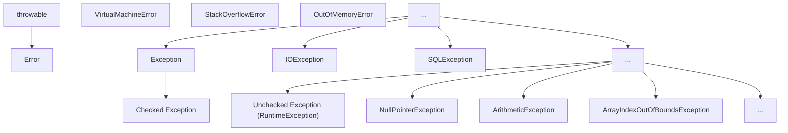

## 前置知识

- [Java 内部类详解](/java/017-JavaInnerClass)：建议先完成前一篇的学习

## 学习目标

- 掌握「0. 本节阅读指引（先读这一节）」的核心机制、典型用法与常见陷阱
- 掌握「1. 异常体系 (Exception Hierarchy)」的核心机制、典型用法与常见陷阱
- 掌握「2. 异常处理 (Try-Catch-Finally)」的核心机制、典型用法与常见陷阱
- 掌握「3. 抛出异常 (Throw & Throws)」的核心机制、典型用法与常见陷阱
- 掌握「4. 自定义异常 (Custom Exception)」的核心机制、典型用法与常见陷阱


## 0. 本节阅读指引（先读这一节）

本篇是「异常处理机制」，目标：看懂异常体系，会写 try-catch-finally、throw/throws 与自定义异常。

零基础第一遍只读：

1. 第 1 节 异常体系、2. try-catch-finally、3. throw 与 throws；
2. 第 4 节 自定义异常、5. try-with-resources。

可跳过：6-8 节（实际应用、最佳实践、常见陷阱）第一遍浏览；9. 异常处理的性能考虑第二遍再看。

> 记住：受检异常必须处理或声明；finally 中不要写 return。


## 1. 异常体系 (Exception Hierarchy)

### 1.1 异常的层次结构

Java 中的异常体系以 `Throwable` 为顶级父类，分为两大类：



### 1.2 异常的分类

- **Error**: 严重错误，如 `StackOverflowError`、`OutOfMemoryError`，程序无法恢复
- **Exception**: 应用程序可捕获并处理的异常
- **检查型异常 (Checked Exception)**: 编译时强制要求处理，如 `IOException`、`SQLException`
- **运行时异常 (Runtime / Unchecked Exception)**: 逻辑错误，不强制要求捕获，如 `NullPointerException`、`ArithmeticException`

### 1.3 常见异常类型

#### 1.3.1 运行时异常

- **NullPointerException**: 空指针异常
- **ArithmeticException**: 算术异常（如除零）
- **ArrayIndexOutOfBoundsException**: 数组下标越界异常
- **ClassCastException**: 类型转换异常
- **IllegalArgumentException**: 非法参数异常
- **IllegalStateException**: 非法状态异常

#### 1.3.2 检查型异常

- **IOException**: IO 操作异常
- **SQLException**: 数据库操作异常
- **ClassNotFoundException**: 类未找到异常
- **InterruptedException**: 线程中断异常

## 2. 异常处理 (Try-Catch-Finally)

### 2.1 基本语法

```java
 try {
  // 可能抛出异常的代码
 }
  // 处理特定异常
 }
  // 处理另一种异常
 }
  // 捕获所有其他异常
 }
  // 无论是否发生异常，都会执行的代码
 }
```

### 2.2 异常处理的执行流程

1. 执行 try 块中的代码
2. 如果发生异常，寻找匹配的 catch 块
3. 执行匹配的 catch 块
4. 执行 finally 块
5. 继续执行后续代码

### 2.3 异常对象的常用方法

- **getMessage()**: 获取异常信息
- **printStackTrace()**: 打印异常堆栈信息
- **getCause()**: 获取导致当前异常的原因
- **getStackTrace()**: 获取异常堆栈跟踪信息

### 2.4 异常捕获的顺序

- 先捕获具体的异常，再捕获通用的异常
- 如果先捕获通用异常，后面的具体异常捕获块永远不会执行

```java
 // 正确的顺序
 try {
  // 可能抛出异常的代码
 }
  // 处理算术异常
 }
  // 处理其他异常
 }
 // 错误的顺序（ArithmeticException 捕获块永远不会执行）
 try {
  // 可能抛出异常的代码
 }
  // 处理所有异常
 }
  // 永远不会执行
 }
```

## 3. 抛出异常 (Throw & Throws)

### 3.1 throw 关键字

用于在方法体内抛出一个具体的异常对象。

```java
 public void validateAge(int age) {
  if (age < 0) {
  throw new IllegalArgumentException("Age cannot be negative");
  }
  if (age > 150) {
  throw new IllegalArgumentException("Age cannot be greater than 150");
  }
 }
```

### 3.2 throws 关键字

用于在方法签名处声明该方法可能抛出的异常类型。

```java
 public void readFile(String path) throws IOException, FileNotFoundException {
  if (path == null) {
  throw new NullPointerException("Path cannot be null");
  }
  // 可能抛出 IOException 的代码
 }
```

### 3.3 throw 与 throws 的区别

| 特性     | throw                  | throws                        |
| -------- | ---------------------- | ----------------------------- |
| **位置** | 方法体内               | 方法签名处                    |
| **作用** | 抛出具体异常对象       | 声明方法可能抛出的异常类型    |
| **数量** | 一次只能抛出一个异常   | 可以声明多个异常              |
| **语法** | throw new Exception(); | throws Exception1, Exception2 |

## 4. 自定义异常 (Custom Exception)

### 4.1 自定义异常的创建

继承 `Exception` (检查型) 或 `RuntimeException` (非检查型)。

#### 4.1.1 自定义检查型异常

```java
 public class BusinessException extends Exception {
  private int errorCode;
  public BusinessException() {
  super();
  }
  public BusinessException(String message) {
  super(message);
  }
  public BusinessException(String message, int errorCode) {
  super(message);
  this.errorCode = errorCode;
  }
  public BusinessException(String message, Throwable cause) {
  super(message, cause);
  }
  public int getErrorCode() {
  return errorCode;
  }
 }
```

#### 4.1.2 自定义运行时异常

```java
 public class ValidationException extends RuntimeException {
  private String fieldName;
  public ValidationException(String message) {
  super(message);
  }
  public ValidationException(String message, String fieldName) {
  super(message);
  this.fieldName = fieldName;
  }
  public String getFieldName() {
  return fieldName;
  }
 }
```

### 4.2 自定义异常的使用

```java
 public void registerUser(String username, String password) throws BusinessException {
  if (username == null || username.isEmpty()) {
  throw new BusinessException("Username cannot be empty", 400);
  }
  if (password == null || password.length() < 6) {
  throw new BusinessException("Password must be at least 6 characters", 400);
  }
  // 注册用户的逻辑
 }
 // 使用自定义异常
 try {
  registerUser("", "123");
 }
  System.out.println("Error code: " + e.getErrorCode());
  System.out.println("Error message: " + e.getMessage());
 }
```

## 5. Try-with-resources (Java 7+)

### 5.1 基本语法

自动管理实现了 `AutoCloseable` 接口的资源，无需手动关闭。

```java
 try (BufferedReader br = new BufferedReader(new FileReader("file.txt"));
  BufferedWriter bw = new BufferedWriter(new FileWriter("output.txt"))) {
  // 使用资源
  String line;
  while ((line = br.readLine()) != null) {
  bw.write(line);
  bw.newLine();
  }
 }
  // 处理异常
  e.printStackTrace();
 }
```

### 5.2 实现 AutoCloseable 接口

```java
 public class CustomResource implements AutoCloseable {
  public CustomResource() {
  System.out.println("Resource created");
  }
  public void use() {
  System.out.println("Resource used");
  }
  @Override
  public void close() throws Exception {
  System.out.println("Resource closed");
  }
 }
 // 使用自定义资源
 try (CustomResource resource = new CustomResource()) {
  resource.use();
 }
  e.printStackTrace();
 }
```

### 5.3 Try-with-resources 的优势

- **自动关闭资源**: 无需在 finally 块中手动关闭资源
- **异常抑制**: 如果关闭资源时发生异常，会被抑制，不会影响原始异常
- **代码简洁**: 减少样板代码，提高可读性

## 6. 异常处理的实际应用

### 6.1 分层异常处理

#### 6.1.1 数据访问层

```java
 public class UserDao {
  public User findById(int id) throws SQLException {
  try (Connection conn = getConnection();
  PreparedStatement stmt = conn.prepareStatement("SELECT * FROM users WHERE id = ?")) {
  stmt.setInt(1, id);
  try (ResultSet rs = stmt.executeQuery()) {
  if (rs.next()) {
  return new User(rs.getInt("id"), rs.getString("name"));
  }
  return null;
  }
  }
  }
 }
```

#### 6.1.2 业务逻辑层

```java
 public class UserService {
  private UserDao userDao = new UserDao();
  public User getUser(int id) throws BusinessException {
  try {
  User user = userDao.findById(id);
  if (user == null) {
  throw new BusinessException("User not found", 404);
  }
  return user;
  } catch (SQLException e) {
  throw new BusinessException("Database error", 500, e);
  }
  }
 }
```

#### 6.1.3 表现层

```java
 public class UserController {
  private UserService userService = new UserService();
  public void handleGetUser(int id) {
  try {
  User user = userService.getUser(id);
  System.out.println("User found: " + user);
  } catch (BusinessException e) {
  System.out.println("Error: " + e.getMessage());
  // 可以根据错误码进行不同的处理
  }
  }
 }
```

### 6.2 异常链

将底层异常包装为上层异常，保留原始异常信息。

```java
 try {
  // 可能抛出 SQLException 的代码
 }
  // 包装为业务异常，保留原始异常
  throw new BusinessException("Database operation failed", e);
 }
```

## 7. 异常处理的最佳实践

### 7.1 基本原则

- **不要捕获所有异常**: 应该捕获具体的异常类型
- **不要忽略异常**: 至少应该记录异常信息
- **不要在 finally 中抛出异常**: 会覆盖原始异常
- **使用 try-with-resources 管理资源**: 避免资源泄漏
- **合理使用自定义异常**: 提供更具体的错误信息

### 7.2 异常处理的最佳实践

1. **只捕获可以处理的异常**
2. **对不同的异常进行不同的处理**
3. **记录异常信息**
4. **向上层传递不能处理的异常**
5. **使用 finally 块释放资源**
6. **使用 try-with-resources 管理资源**
7. **合理设计异常层次结构**
8. **在合适的层次处理异常**

### 7.3 异常处理的反模式

- **空 catch 块**: 捕获异常但不做任何处理
- **过度使用异常**: 用异常控制流程
- **捕获并重新抛出相同的异常**: 没有添加任何信息
- **抛出异常过于宽泛**: 如直接抛出 Exception
- **在 finally 块中修改返回值**: 会覆盖 try 或 catch 中的返回值

## 8. 常见陷阱

### 8.1 异常捕获顺序错误

```java
 // 错误的顺序
 try {
  // 代码
 }
  // 处理所有异常
 }
  // 永远不会执行
 }
```

### 8.2 资源泄漏

```java
 // 错误：没有关闭资源
 BufferedReader br = null;
 try {
  br = new BufferedReader(new FileReader("file.txt"));
  // 使用 br
 }
  e.printStackTrace();
 }
 // 正确：使用 try-with-resources
 try (BufferedReader br = new BufferedReader(new FileReader("file.txt"))) {
  // 使用 br
 }
  e.printStackTrace();
 }
```

### 8.3 异常信息不完整

```java
 // 错误：没有传递原始异常
 catch (SQLException e) {
  throw new BusinessException("Database error");
 }
 // 正确：传递原始异常
 catch (SQLException e) {
  throw new BusinessException("Database error", e);
 }
```

### 8.4 过度使用异常

```java
 // 错误：用异常控制流程
 public int divide(int a, int b) {
  try {
  return a / b;
  } catch (ArithmeticException e) {
  return 0;
  }
 }
 // 正确：先检查
 public int divide(int a, int b) {
  if (b == 0) {
  return 0;
  }
  return a / b;
 }
```

## 9. 异常处理的性能考虑

### 9.1 异常的性能开销

- **创建异常对象**: 会捕获当前堆栈信息，开销较大
- **抛出异常**: 会中断正常的执行流程
- **异常处理**: 会影响代码的执行效率

### 9.2 性能优化建议

- **只在真正异常的情况下使用异常**
- **避免在循环中抛出异常**
- **使用检查型异常处理可恢复的错误**
- **使用运行时异常处理编程错误**
- **合理设计异常层次结构**

---

## 异常体系

**基本写法：Throwable 体系**
`Throwable -> Error | Exception`
```java
// 异常体系根类
Throwable
```

---

**基本写法：Error 不可恢复**
`class <错误类> extends Error`
```java
// 严重错误程序无法处理
OutOfMemoryError
```

---

**基本写法：Exception 可恢复**
`class <异常类> extends Exception`
```java
// 可检查异常必须处理
IOException
```

---

**基本写法：RuntimeException 运行时异常**
`class <异常类> extends RuntimeException`
```java
// 运行时异常可不处理
NullPointerException
```

---

## try-catch

**基本写法：单 catch**
`try { } catch (<异常类型> <变量>) { }`
```java
// 捕获单个异常
try {
    int result = 10 / 0;
} catch (ArithmeticException e) {
}
```

---

**基本写法：多 catch**
`try { } catch (<异常1> <变量>) { } catch (<异常2> <变量>) { }`
```java
// 捕获多种异常分别处理
try {
} catch (ArithmeticException e) {
} catch (NullPointerException e) {
}
```

---

**基本写法：Java 7+ 多异常合并**
`try { } catch (<异常1> | <异常2> <变量>) { }`
```java
// 多种异常合并捕获
try {
} catch (IOException | SQLException e) {
}
```

---

**基本写法：try-catch-finally**
`try { } catch (<异常> <变量>) { } finally { }`
```java
// finally 块无论是否异常都执行
try {
} catch (Exception e) {
} finally {
}
```

---

**基本写法：try-finally**
`try { } finally { }`
```java
// 无 catch 仅 finally
try {
} finally {
}
```

---

## try-with-resources

**基本写法：自动资源管理**
`try (<资源声明>) { }`
```java
// 自动关闭实现 AutoCloseable 的资源
try (FileReader fr = new FileReader("file.txt")) {
}
```

---

**换行写法：多个资源**
`try (<资源1>; <资源2>) { }`
```java
// 管理多个资源按声明逆序关闭
try (
    FileReader fr = new FileReader("input.txt");
    FileWriter fw = new FileWriter("output.txt")
) {
}
```

---

**基本写法：try-with-resources 异常处理**
`try (<资源>) { } catch (<异常> <变量>) { }`
```java
// 自动关闭资源并捕获异常
try (FileReader fr = new FileReader("file.txt")) {
} catch (IOException e) {
}
```

---

## throw 抛出异常

**基本写法：抛出异常**
`throw new <异常类>("<消息>");`
```java
// 手动抛出异常
throw new IllegalArgumentException("Invalid parameter");
```

---

**基本写法：抛出已存在异常**
`throw <异常变量>;`
```java
// 重新抛出捕获的异常
throw e;
```

---

**基本写法：抛出带原因的异常**
`throw new <异常类>("<消息>", <原因>);`
```java
// 抛出异常并附带原因
throw new RuntimeException("Operation failed", cause);
```

---

## throws 声明异常

**基本写法：声明单个异常**
`<方法签名> throws <异常类型>`
```java
// 方法声明可能抛出的异常
public void readFile() throws IOException {
}
```

---

**单行写法：声明多个异常**
`<方法签名> throws <异常1>, <异常2>`
```java
// 方法声明抛出多种异常
public void process() throws IOException, SQLException {
}
```

---

**换行写法：声明多个异常**
`<方法签名> throws <异常1>, <异常2>, <异常3>`
```java
// 换行声明抛出多种异常
public void process()
        throws IOException,
        SQLException,
        ClassNotFoundException {
}
```

---

## 自定义异常

**基本写法：自定义检查异常**
`class <异常名> extends Exception { }`
```java
// 继承 Exception 定义检查异常
public class BusinessException extends Exception {
    public BusinessException(String message) {
        super(message);
    }
}
```

---

**基本写法：自定义运行时异常**
`class <异常名> extends RuntimeException { }`
```java
// 继承 RuntimeException 定义运行时异常
public class ValidationException extends RuntimeException {
    public ValidationException(String message) {
        super(message);
    }
}
```

---

**换行写法：带属性的自定义异常**
`class <异常名> extends Exception { private <字段>; <构造方法> <getter> }`
```java
// 自定义异常带额外属性
public class BusinessException extends Exception {
    private int errorCode;

    public BusinessException(int errorCode, String message) {
        super(message);
        this.errorCode = errorCode;
    }

    public int getErrorCode() {
        return errorCode;
    }
}
```

---

## 异常链

**基本写法：保留原始异常**
`throw new <异常类>("<消息>", <原始异常>);`
```java
// 抛出新异常并保留原始异常
try {
} catch (IOException e) {
    throw new BusinessException("File operation failed", e);
}
```

---

**基本写法：initCause 设置原因**
`<异常>.initCause(<原因>)`
```java
// 使用 initCause 设置异常原因
BusinessException be = new BusinessException("Error");
be.initCause(originalException);
throw be;
```

---

**基本写法：获取原始异常**
`<异常>.getCause()`
```java
// 获取异常的根本原因
Throwable cause = e.getCause();
```

---

## 异常信息获取

**基本写法：获取消息**
`<异常>.getMessage()`
```java
// 获取异常的详细消息
String message = e.getMessage();
```

---

**基本写法：获取堆栈**
`<异常>.getStackTrace()`
```java
// 获取异常的堆栈跟踪数组
StackTraceElement[] stack = e.getStackTrace();
```

---

**基本写法：打印堆栈**
`<异常>.printStackTrace()`
```java
// 打印异常堆栈到标准错误流
e.printStackTrace();
```

---

**基本写法：获取所有异常**
`<异常>.getSuppressed()`
```java
// 获取 try-with-resources 中被抑制的异常
Throwable[] suppressed = e.getSuppressed();
```

---

## 异常处理最佳实践

**基本写法：捕获具体异常**
`catch (<具体异常类型> <变量>)`
```java
// 捕获具体的异常类型而非通用 Exception
try {
} catch (FileNotFoundException e) {
}
```

---

**基本写法：异常不忽略**
`catch (<异常> <变量>) { <处理逻辑> }`
```java
// catch 块中必须有处理逻辑
try {
} catch (Exception e) {
    log.error("Error occurred", e);
}
```

---

**基本写法：finally 不 return**
`finally { <清理逻辑> }`
```java
// finally 块只做资源清理不返回值
try {
} finally {
    resource.close();
}
```

---

## 常见运行时异常

**基本写法：空指针异常**
`throw new NullPointerException("<消息>");`
```java
// 抛出空指针异常
throw new NullPointerException("Object is null");
```

---

**基本写法：数组越界异常**
`throw new ArrayIndexOutOfBoundsException(<索引>);`
```java
// 抛出数组越界异常
throw new ArrayIndexOutOfBoundsException(10);
```

---

**基本写法：类型转换异常**
`throw new ClassCastException("<消息>");`
```java
// 抛出类型转换异常
throw new ClassCastException("Cannot cast to String");
```

---

**基本写法：非法参数异常**
`throw new IllegalArgumentException("<消息>");`
```java
// 抛出非法参数异常
throw new IllegalArgumentException("Age must be positive");
```

---

**基本写法：非法状态异常**
`throw new IllegalStateException("<消息>");`
```java
// 抛出非法状态异常
throw new IllegalStateException("Connection is closed");
```

---

**基本写法：不支持操作异常**
`throw new UnsupportedOperationException();`
```java
// 抛出不支持操作异常
throw new UnsupportedOperationException();
```
