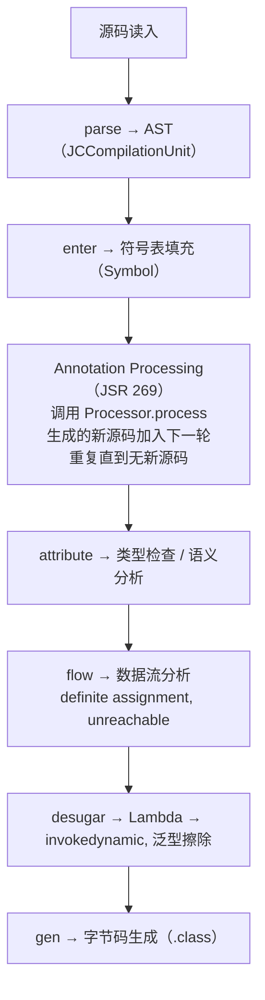
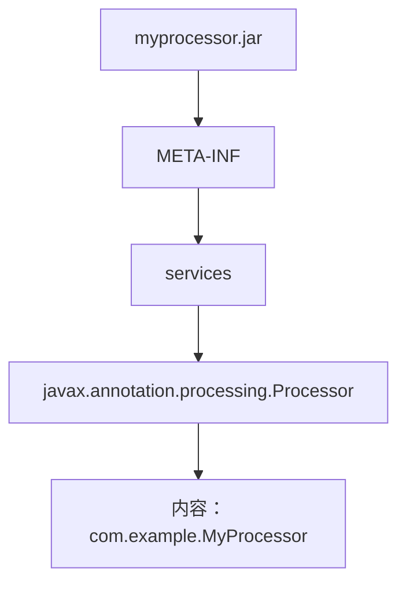

## 前置知识

- [反射与动态代理](/java/043-ReflectionDynamicProxy)：建议先完成前一篇的学习

## 学习目标

- 掌握「0. 本节阅读指引（先读这一节）」的核心机制、典型用法与常见陷阱
- 掌握「1. 历史动机与发展脉络」的核心机制、典型用法与常见陷阱
- 掌握「2. 形式化定义（JLS & JVMS 规范）」的核心机制、典型用法与常见陷阱
- 掌握「3. 理论推导与原理解析」的核心机制、典型用法与常见陷阱
- 掌握「4. 代码示例（企业级 production-ready）」的核心机制、典型用法与常见陷阱


## 0. 本节阅读指引（先读这一节）

本篇是「注解处理器」进阶文档。

第一遍只读：4. 代码示例与定义注解、编写注解处理器、注册处理器、编译配置速查小节。

可跳过：1-3 节（历史、形式化、理论推导）与 5-8 节第二遍细读。

前置：034 枚举与注解、035 反射与动态代理。


# Java 注解处理器：编译时元编程的艺术

> 本文档对标 MIT 6.031、Stanford CS242 (Programming Languages) 与 CMU 17-808 (Program Analysis) 教学水准，系统讲解 Java 注解处理器（Annotation Processor, JSR 269）的设计、原理与工程实践。从 JLS §9.6 / §9.7 注解规范到 javax.lang.model API，再到 Lombok、Dagger、MapStruct、Record 等真实开源项目的实现剖析，文档兼顾形式化定义、Javac 内部机制与企业级 production-ready 模板代码。

---

## 1. 历史动机与发展脉络

### 1.1 前置：注解的诞生（Java 5, 2004）

注解（Annotation）是 Java 5 引入的元编程机制。其设计动机源于：

- **配置爆炸**：J2EE 1.4 时代 EJB 部署描述符（`ejb-jar.xml`）动辄数百行 XML，配置与代码分离导致维护困难；
- **框架重复样板**：JDBC、Hibernate、Spring 等 JDBC 模板代码冗长；
- **缺乏元数据**：编译器、文档生成器、IDE 工具难以获取类型成员的语义信息。

Java 5 引入了三大元编程特性：
- 注解（JSR 175）；
- 泛型（JSR 14）；
- 增强 for 循环与变长参数（JSR 201）。

### 1.2 JSR 269：可插拔注解处理 API（Java 6, 2006）

Java 5 的注解处理器还是 `apt`（Annotation Processing Tool）独立工具，需要单独运行。Java 6 引入 JSR 269，将注解处理集成进 `javac`，并提供 `javax.annotation.processing` 与 `javax.lang.model` 两个包：

- `javax.annotation.processing`：处理器接口与运行环境；
- `javax.lang.model`：源码模型（Element 层次、TypeMirror 层次）。

此后 `apt` 工具被废弃，Java 7 起所有注解处理在 `javac` 内完成。

### 1.3 现代注解处理器生态（Java 8—21）

| 工具 | 发布年份 | 用途 | 实现机制 |
| --- | --- | --- | --- |
| Lombok | 2009 | 自动生成 getter/setter/builder | 修改 AST（突破 JSR 269 约束） |
| Dagger | 2012 | 编译时依赖注入 | 标准 JSR 269 |
| AutoValue | 2015 | Google 不可变值类 | 标准 JSR 269 |
| MapStruct | 2014 | 类型安全的对象映射 | 标准 JSR 269 |
| Immutables | 2012 | 类似 AutoValue，更灵活 | 标准 JSR 269 |
| Hibernate Metamodel | 2010 | JPA Criteria 类型安全 | 标准 JSR 269 |
| Room | 2017 | Android SQLite ORM | 标准 JSR 269 |
| Hilt | 2019 | Android 上的 Dagger | 标准 JSR 269 |
| Spring Boot Configuration Processor | 2014 | 配置元数据生成 | 标准 JSR 269 |
| Records (Java 14+) | 2020 | 内建不可变类 | JVM 内建 |

### 1.4 Java 9—25 的注解处理器演进

| 版本 | 演进点 |
| --- | --- |
| Java 9 | 模块系统要求 Processor 在 module-info 中声明；`Filer` 增加模块感知 |
| Java 11 | `apt` 工具完全移除 |
| Java 16 | Records 提供语言级替代 Lombok 的部分功能 |
| Java 17 | Sealed Class 允许更精细的处理器分发 |
| Java 21 | Pattern Matching for switch 与 Record Patterns 简化处理器代码 |
| Java 23 | `-proc:full` 替换 `-proc:none` 默认行为 |
| Java 25 | 注解处理器对 `import module` 声明的支持（JEP 511 联动） |

### 1.5 设计哲学

JSR 269 的设计哲学可概括为**"非侵入式元编程"**：

1. **声明式**：开发者用注解声明意图，编译器执行生成；
2. **只生成不修改**：处理器不得修改已有源码，保证编译过程的可预测性；
3. **可插拔**：通过 SPI 注册，processor 不在主类路径上时不会影响编译；
4. **类型安全**：通过 `javax.lang.model` 提供编译期类型信息，避免反射的运行时错误；
5. **可组合**：多个 processor 可串联运行，每个独立处理自己关心的注解。

### 1.6 时间线可视化

```
2004 ── 2006 ── 2009 ── 2014 ── 2020 ── 2025
  J5     J6     Lombok  MapStruct J16    J25
  JSR    JSR    (AST    (标准    Record  Module
  175    269    修改)   JSR269)         Import
```

---

## 2. 形式化定义（JLS & JVMS 规范）

### 2.1 注解的形式化语法

依据 JLS §9.7，注解的文法定义为：

$$
\begin{aligned}
\text{Annotation} &::= \text{@}\ \text{QualifiedName} \\
&\quad \mid \text{@}\ \text{QualifiedName}\ \text{(}\ \text{ElementValuePairList?}\ \text{)} \\
&\quad \mid \text{@}\ \text{QualifiedName}\ \text{(}\ \text{ElementValue}\ \text{)}
\end{aligned}
$$

其中 `ElementValuePair ::= Identifier = ElementValue`，`ElementValue` 可以是常量、注解、数组初始化器。

### 2.2 注解类型的元注解

JLS §9.6.1 定义了四个元注解：

| 元注解 | 作用 |
| --- | --- |
| `@Target` | 限制注解可应用的位置（TYPE、FIELD、METHOD 等） |
| `@Retention` | 注解保留期（SOURCE / CLASS / RUNTIME） |
| `@Inherited` | 是否被子类继承（仅对类声明有效） |
| `@Documented` | 是否出现在 Javadoc 中 |
| `@Repeatable`（Java 8+） | 允许同一位置重复使用 |

### 2.3 注解处理器接口的形式化契约

`javax.annotation.processing.Processor` 接口的核心方法：

$$
\begin{aligned}
\text{getSupportedAnnotationTypes} &: \text{Processor} \to \text{Set}\langle\text{String}\rangle \\
\text{getSupportedSourceVersion} &: \text{Processor} \to \text{SourceVersion} \\
\text{process} &: \text{Processor} \times \text{Set}\langle\text{TypeElement}\rangle \times \text{RoundEnvironment} \to \text{Boolean}
\end{aligned}
$$

`process` 返回 `true` 表示"已认领这些注解，其他处理器不应再处理"，返回 `false` 表示"未认领"。

### 2.4 Element 层次模型

`javax.lang.model.element.Element` 是源码声明视角的统一抽象：

$$
\text{Element} \supset \begin{cases}
\text{PackageElement} & \text{包声明} \\
\text{ModuleElement} & \text{模块声明（Java 9+）} \\
\text{TypeElement} & \text{类/接口/注解/枚举/record 声明} \\
\text{ExecutableElement} & \text{方法/构造器声明} \\
\text{VariableElement} & \text{字段/参数/局部变量/record 组件} \\
\text{TypeParameterElement} & \text{类型参数声明}
\end{cases}
$$

### 2.5 TypeMirror 层次模型

`javax.lang.model.type.TypeMirror` 是类型视角的抽象：

$$
\text{TypeMirror} \supset \begin{cases}
\text{PrimitiveType} & \text{byte/short/int/long/char/float/double/boolean} \\
\text{NullType} & \text{null 字面量类型} \\
\text{ArrayType} & \text{数组类型} \\
\text{DeclaredType} & \text{类/接口类型（含泛型实参）} \\
\text{TypeVariable} & \text{泛型类型变量} \\
\text{WildcardType} & \text{通配符类型 ? extends / ? super} \\
\text{ExecutableType} & \text{方法/构造器签名} \\
\text{NoType} & \text{void / package / module / none} \\
\text{UnionType} & \text{catch (E1 \| E2) 中的联合} \\
\text{IntersectionType} & \text{T extends A \& B 中的交集}
\end{cases}
$$

### 2.6 处理轮次的不动点语义

注解处理过程可形式化为一个不动点迭代：

$$
\begin{aligned}
R_0 &= \text{initial source set} \\
R_{i+1} &= \text{process}(R_i) \cup \text{generated sources from } R_i \\
R^* &= \lim_{i \to \infty} R_i \quad \text{当 } R_{i+1} = R_i
\end{aligned}
$$

最后一轮（无新源码生成）`process` 仍会被调用一次，传入空的 `RoundEnvironment`，用于完成清理工作。

---

## 3. 理论推导与原理解析

### 3.1 javac 的注解处理流水线

javac 的完整编译流水线（com.sun.tools.javac.main.JavaCompiler）：



### 3.2 Processor 注册与发现机制

Processor 的发现基于 Java SPI（Service Provider Interface）：

1. javac 在 `-processorpath` 路径下扫描 JAR 文件；
2. 查找 `META-INF/services/javax.annotation.processing.Processor` 文件；
3. 文件每行一个 Processor 全限定类名；
4. 反射实例化 Processor，调用 `init(ProcessingEnvironment)`。



### 3.3 Round 机制详解

每一轮 javac 都会：

1. 收集当前轮中所有未处理的注解；
2. 调用所有 Processor 的 `process` 方法，按注册顺序；
3. Processor 通过 `Filer` 创建的新源码进入下一轮；
4. 如果某轮无任何新源码生成，最后一轮仍会调用 `process` 通知"处理结束"。

形式化：

$$
\text{Round}_{i+1} = \text{Round}_i \cup \text{Generated}(\text{Round}_i)
$$

$$
\text{Final call}: \text{process}(\emptyset) \text{ with } \text{roundEnv.processingOver()} = \text{true}
$$

### 3.4 Filer 与文件输出隔离

`Filer` 提供三个方法：

- `createSourceFile(name)`：创建 `.java` 文件，进入下一轮处理；
- `createClassFile(name)`：直接创建 `.class` 文件（不进入源码处理）；
- `createResource(loc, pkg, relativeName)`：创建资源文件（如 `META-INF/spring.factories`）。

输出路径隔离规则：

- 源码 → `target/generated-sources/annotations/`；
- 类文件 → `target/classes/`；
- 资源 → `target/classes/META-INF/...`。

### 3.5 Messager 与错误诊断

`Messager` 用于向 javac 报告诊断信息，与 `System.err` 的关键差异：

- 信息会**关联到具体的 Element**，IDE 可在对应源码位置高亮显示；
- 严重级别（`ERROR` / `WARNING` / `MANDATORY_WARNING` / `NOTE` / `OTHER`）影响 javac 退出码；
- `ERROR` 级别会导致编译失败。

```java
processingEnv.getMessager().printMessage(
    Diagnostic.Kind.ERROR,
    "@AutoToString 不能应用于接口",
    element
);
```

### 3.6 JavaPoet 与代码生成抽象

手工拼接字符串生成 Java 源码易出错，JavaPoet（Square 公司）提供类型安全的 API：

```java
TypeSpec.builder(ClassName.get("com.example", "HelloBuilder"))
    .addModifiers(Modifier.PUBLIC, Modifier.FINAL)
    .addField(String.class, "name", Modifier.PRIVATE, Modifier.FINAL)
    .addMethod(MethodSpec.constructorBuilder()
        .addModifiers(Modifier.PUBLIC)
        .addParameter(String.class, "name")
        .addStatement("this.$N = $N", "name", "name")
        .build())
    .addMethod(MethodSpec.methodBuilder("greet")
        .returns(String.class)
        .addStatement("return $S + this.$N", "Hello, ", "name")
        .build())
    .build();
```

### 3.7 Lombok 的 AST 修改机制

Lombok 突破了 JSR 269 "只生成不修改" 约束。其核心机制：

1. 通过反射获取 `JavacProcessingEnvironment`；
2. 取出 `Context` 中的 `JavacTrees` 与 `TreeMaker`；
3. 直接在 AST 中插入新的方法节点（如 `getter`）；
4. 后续编译阶段（attribute / flow / gen）将新方法视为已有方法处理。

这种做法的代价：

- **依赖 javac 内部 API**：`com.sun.tools.javac.*` 在 Java 16 后被强封装，需要 `--add-opens`；
- **IDE 兼容性**：需要 IDE 安装 Lombok 插件才能识别生成的方法；
- **调试困难**：生成的代码不出现在源码中，无法断点调试。

### 3.8 性能模型

注解处理器的编译时间开销：

$$
T_{\text{compile}} = T_{\text{parse}} + \sum_{i=1}^{n} T_{\text{process}}^{(i)} + T_{\text{attribute}} + T_{\text{gen}}
$$

大型项目（如 Spring Framework）注解处理占编译时间的 30-50%。优化手段：

1. **增量处理**：仅处理变更的源文件；
2. **隔离处理**：每个 Processor 处理独立的元素集，避免互相影响；
3. **缓存**：跨编译缓存 `TypeElement` 解析结果。

---

## 4. 代码示例（企业级 production-ready）

### 4.1 最小化注解处理器

#### 4.1.1 自定义注解定义

```java
// src/main/java/com/example/autotostring/AutoToString.java
package com.example.autotostring;

import java.lang.annotation.ElementType;
import java.lang.annotation.Retention;
import java.lang.annotation.RetentionPolicy;
import java.lang.annotation.Target;

/**
 * 标注类自动生成 toString() 方法（仅 SOURCE 保留期，
 * 由注解处理器在编译期处理）。
 */
@Retention(RetentionPolicy.SOURCE)
@Target(ElementType.TYPE)
public @interface AutoToString {
    /** 排除的字段名 */
    String[] exclude() default {};
}
```

#### 4.1.2 注解处理器实现

```java
// src/main/java/com/example/autotostring/AutoToStringProcessor.java
package com.example.autotostring;

import javax.annotation.processing.AbstractProcessor;
import javax.annotation.processing.Messager;
import javax.annotation.processing.RoundEnvironment;
import javax.annotation.processing.SupportedAnnotationTypes;
import javax.annotation.processing.SupportedSourceVersion;
import javax.lang.model.SourceVersion;
import javax.lang.model.element.Element;
import javax.lang.model.element.TypeElement;
import javax.lang.model.element.VariableElement;
import javax.lang.model.type.TypeKind;
import javax.lang.model.util.Elements;
import javax.tools.Diagnostic;
import javax.tools.JavaFileObject;
import java.io.PrintWriter;
import java.util.Set;
import java.util.stream.Collectors;

/**
 * AutoToString 注解处理器：为标注 @AutoToString 的类
 * 生成 ${ClassName}ToString 辅助类，提供 toString() 实现。
 *
 * 设计原则：
 *  1. 不修改源类（遵循 JSR 269）
 *  2. 输出独立的辅助类，由调用方手工或借助其他机制调用
 *  3. 仅支持类（非接口/注解/枚举）
 */
@SupportedAnnotationTypes("com.example.autotostring.AutoToString")
@SupportedSourceVersion(SourceVersion.RELEASE_21)
public class AutoToStringProcessor extends AbstractProcessor {

    @Override
    public boolean process(Set<? extends TypeElement> annotations,
                           RoundEnvironment roundEnv) {
        if (roundEnv.processingOver()) {
            return false;
        }

        Messager messager = processingEnv.getMessager();
        Elements elementUtils = processingEnv.getElementUtils();

        for (Element annotated : roundEnv.getElementsAnnotatedWith(AutoToString.class)) {
            if (!(annotated instanceof TypeElement typeElement)) {
                messager.printMessage(Diagnostic.Kind.ERROR,
                    "@AutoToString 只能标注类型", annotated);
                continue;
            }

            if (typeElement.getKind().isInterface()) {
                messager.printMessage(Diagnostic.Kind.ERROR,
                    "@AutoToString 不能标注接口", typeElement);
                continue;
            }

            AutoToString anno = annotated.getAnnotation(AutoToString.class);
            Set<String> excluded = Set.of(anno.exclude());

            // 收集实例字段（仅直接声明，不递归父类）
            var fields = typeElement.getEnclosedElements().stream()
                .filter(e -> e.getKind().isField())
                .map(VariableElement.class::cast)
                .filter(f -> !excluded.contains(f.getSimpleName().toString()))
                .collect(Collectors.toList());

            try {
                generateHelper(typeElement, fields);
            } catch (Exception e) {
                messager.printMessage(Diagnostic.Kind.ERROR,
                    "生成代码失败: " + e.getMessage(), typeElement);
            }
        }
        return true;
    }

    private void generateHelper(TypeElement type, java.util.List<VariableElement> fields)
            throws Exception {
        String pkg = type.getQualifiedName().toString();
        int lastDot = pkg.lastIndexOf('.');
        String packageName = lastDot > 0 ? pkg.substring(0, lastDot) : "";
        String simpleName = type.getSimpleName().toString();
        String helperName = simpleName + "ToStringHelper";

        String fqcn = packageName.isEmpty()
            ? helperName
            : packageName + "." + helperName;

        JavaFileObject file = processingEnv.getFiler().createSourceFile(fqcn);
        try (PrintWriter w = new PrintWriter(file.openWriter())) {
            if (!packageName.isEmpty()) {
                w.println("package " + packageName + ";");
                w.println();
            }
            w.println("/**");
            w.println(" * Auto-generated by AutoToStringProcessor.");
            w.println(" * Do not edit manually.");
            w.println(" */");
            w.println("public final class " + helperName + " {");
            w.println("  private " + helperName + "() {}");
            w.println();
            w.println("  public static String toString(" + simpleName + " obj) {");
            w.println("    StringBuilder sb = new StringBuilder();");
            w.println("    sb.append(\"" + simpleName + "{\");");
            for (int i = 0; i < fields.size(); i++) {
                VariableElement f = fields.get(i);
                String fname = f.getSimpleName().toString();
                w.println("    sb.append(\"" + fname + "=\").append(obj." + fname + ");");
                if (i < fields.size() - 1) {
                    w.println("    sb.append(\", \");");
                }
            }
            w.println("    sb.append(\"}\");");
            w.println("    return sb.toString();");
            w.println("  }");
            w.println("}");
        }
    }
}
```

#### 4.1.3 SPI 注册

手工方式：

```
src/main/resources/META-INF/services/javax.annotation.processing.Processor
内容：
com.example.autotostring.AutoToStringProcessor
```

或使用 Google AutoService 自动生成：

```java
@AutoService(Processor.class)
@SupportedAnnotationTypes("com.example.autotostring.AutoToString")
@SupportedSourceVersion(SourceVersion.RELEASE_21)
public class AutoToStringProcessor extends AbstractProcessor { ... }
```

### 4.2 完整 Maven 项目配置

#### 4.2.1 处理器模块 pom.xml

```xml
<?xml version="1.0" encoding="UTF-8"?>
<project xmlns="http://maven.apache.org/POM/4.0.0">
    <modelVersion>4.0.0</modelVersion>

    <groupId>com.example</groupId>
    <artifactId>auto-tostring-processor</artifactId>
    <version>1.0.0</version>
    <packaging>jar</packaging>

    <properties>
        <maven.compiler.release>21</maven.compiler.release>
        <project.build.sourceEncoding>UTF-8</project.build.sourceEncoding>
    </properties>

    <dependencies>
        <dependency>
            <groupId>com.google.auto.service</groupId>
            <artifactId>auto-service-annotations</artifactId>
            <version>1.1.1</version>
            <scope>provided</scope>
        </dependency>
        <dependency>
            <groupId>com.squareup</groupId>
            <artifactId>javapoet</artifactId>
            <version>1.13.0</version>
        </dependency>
    </dependencies>

    <build>
        <plugins>
            <plugin>
                <artifactId>maven-compiler-plugin</artifactId>
                <version>3.13.0</version>
                <configuration>
                    <release>21</release>
                    <!-- 编译本模块时禁用注解处理，避免循环 -->
                    <proc>none</proc>
                </configuration>
            </plugin>
        </plugins>
    </build>
</project>
```

#### 4.2.2 使用方模块 pom.xml

```xml
<build>
    <plugins>
        <plugin>
            <artifactId>maven-compiler-plugin</artifactId>
            <version>3.13.0</version>
            <configuration>
                <release>21</release>
                <annotationProcessorPaths>
                    <path>
                        <groupId>com.example</groupId>
                        <artifactId>auto-tostring-processor</artifactId>
                        <version>1.0.0</version>
                    </path>
                </annotationProcessorPaths>
                <compilerArgs>
                    <arg>-Xlint:all</arg>
                </compilerArgs>
            </configuration>
        </plugin>
    </plugins>
</build>
```

### 4.3 使用 JavaPoet 重写代码生成

```java
import com.squareup.javapoet.*;
import javax.lang.model.element.Modifier;
import javax.lang.model.element.TypeElement;
import javax.lang.model.element.VariableElement;

private void generateHelperWithJavaPoet(TypeElement type,
                                         java.util.List<VariableElement> fields)
        throws Exception {
    String simpleName = type.getSimpleName().toString();
    String helperName = simpleName + "ToStringHelper";

    ClassName targetType = ClassName.get(type);

    MethodSpec.Builder toStringBuilder = MethodSpec.methodBuilder("toString")
        .addModifiers(Modifier.PUBLIC, Modifier.STATIC)
        .returns(String.class)
        .addParameter(targetType, "obj");

    toStringBuilder.addStatement("$T sb = new $T()", StringBuilder.class, StringBuilder.class);
    toStringBuilder.addStatement("sb.append($S)", simpleName + "{");

    for (int i = 0; i < fields.size(); i++) {
        VariableElement f = fields.get(i);
        String fname = f.getSimpleName().toString();
        toStringBuilder.addStatement("sb.append($S).append(obj.$L)",
            fname + "=", fname);
        if (i < fields.size() - 1) {
            toStringBuilder.addStatement("sb.append($S)", ", ");
        }
    }
    toStringBuilder.addStatement("sb.append($S)", "}");
    toStringBuilder.addStatement("return sb.toString()");

    TypeSpec helperClass = TypeSpec.classBuilder(helperName)
        .addModifiers(Modifier.PUBLIC, Modifier.FINAL)
        .addMethod(MethodSpec.constructorBuilder()
            .addModifiers(Modifier.PRIVATE)
            .build())
        .addMethod(toStringBuilder.build())
        .build();

    JavaFile javaFile = JavaFile.builder(
            ClassName.get(type).packageName(), helperClass)
        .addFileComment("Auto-generated by AutoToStringProcessor.")
        .indent("    ")
        .build();

    javaFile.writeTo(processingEnv.getFiler());
}
```

### 4.4 Gradle 增量注解处理

```java
// src/main/resources/META-INF/gradle/incremental.annotation.processors
内容：com.example.autotostring.AutoToStringProcessor,isolating
```

`isolating`（隔离）：处理一个元素只生成对应的输出，不影响其他元素；`aggregating`（聚合）：一个元素可能影响多个输出（如全局 ServiceLoader 注册）。

```kotlin
// build.gradle.kts（使用方）
plugins {
    java
    id("com.diffplug.spotless") version "6.25.0"
}

java {
    toolchain { languageVersion.set(JavaLanguageVersion.of(21)) }
}

dependencies {
    annotationProcessor("com.example:auto-tostring-processor:1.0.0")
    compileOnly("com.example:auto-tostring-processor:1.0.0")
}

tasks.withType<JavaCompile> {
    options.compilerArgs.addAll(listOf("-Xlint:all", "-parameters"))
}
```

### 4.5 测试用例：编译期测试

使用 `compile-testing` 库（Google）测试注解处理器：

```java
// src/test/java/com/example/autotostring/AutoToStringProcessorTest.java
import com.google.testing.compile.Compilation;
import com.google.testing.compile.JavaFileObjects;
import org.junit.jupiter.api.Test;

import javax.tools.JavaFileObject;

import static com.google.testing.compile.CompilationSubject.compilations;
import static com.google.testing.compile.Compiler.javac;
import static org.junit.jupiter.api.Assertions.assertEquals;

class AutoToStringProcessorTest {

    @Test
    void shouldGenerateHelperForSimpleClass() {
        JavaFileObject source = JavaFileObjects.forSourceString(
            "com.example.User",
            """
            package com.example;
            import com.example.autotostring.AutoToString;
            @AutoToString
            public class User {
                private String name;
                private int age;
            }
            """);

        Compilation compilation = javac()
            .withProcessors(new AutoToStringProcessor())
            .compile(source);

        compilations(compilation).succeededWithoutWarnings();
        compilations(compilation)
            .generatedSourceFile("com.example.UserToStringHelper")
            .hasStringEquivalentTo("""
                package com.example;
                public final class UserToStringHelper {
                  private UserToStringHelper() {}
                  public static String toString(User obj) {
                    StringBuilder sb = new StringBuilder();
                    sb.append("User{");
                    sb.append("name=").append(obj.name);
                    sb.append(", ");
                    sb.append("age=").append(obj.age);
                    sb.append("}");
                    return sb.toString();
                  }
                }
                """);
    }

    @Test
    void shouldFailOnInterface() {
        JavaFileObject source = JavaFileObjects.forSourceString(
            "com.example.Iface",
            """
            package com.example;
            import com.example.autotostring.AutoToString;
            @AutoToString
            public interface Iface {}
            """);

        Compilation compilation = javac()
            .withProcessors(new AutoToStringProcessor())
            .compile(source);

        compilations(compilation).hadErrorContaining("不能标注接口");
    }
}
```

### 4.6 完整 Maven 配置

```xml
<dependencies>
    <dependency>
        <groupId>com.google.testing.compile</groupId>
        <artifactId>compile-testing</artifactId>
        <version>0.21.0</version>
        <scope>test</scope>
    </dependency>
    <dependency>
        <groupId>org.junit.jupiter</groupId>
        <artifactId>junit-jupiter</artifactId>
        <version>5.10.2</version>
        <scope>test</scope>
    </dependency>
</dependencies>
```

### 4.7 实战示例：Builder 生成器

```java
@Retention(RetentionPolicy.SOURCE)
@Target(ElementType.TYPE)
public @interface GenerateBuilder {
}

// 处理器
@SupportedAnnotationTypes("com.example.builder.GenerateBuilder")
@SupportedSourceVersion(SourceVersion.RELEASE_21)
public class BuilderProcessor extends AbstractProcessor {

    @Override
    public boolean process(Set<? extends TypeElement> annotations,
                           RoundEnvironment roundEnv) {
        for (var element : roundEnv.getElementsAnnotatedWith(GenerateBuilder.class)) {
            if (!(element instanceof TypeElement type)) continue;

            var fields = type.getEnclosedElements().stream()
                .filter(e -> e.getKind().isField()
                    && !e.getModifiers().contains(Modifier.STATIC))
                .map(VariableElement.class::cast)
                .toList();

            generateBuilder(type, fields);
        }
        return true;
    }

    private void generateBuilder(TypeElement type, List<VariableElement> fields)
            throws Exception {
        String pkg = ClassName.get(type).packageName();
        String builderName = type.getSimpleName() + "Builder";

        ClassName targetType = ClassName.get(type);
        ClassName builderType = ClassName.get(pkg, builderName);

        var builderFields = fields.stream()
            .map(f -> FieldSpec.builder(
                    TypeName.get(f.asType()),
                    f.getSimpleName().toString(),
                    Modifier.PRIVATE).build())
            .toList();

        var setterMethods = fields.stream()
            .map(f -> MethodSpec.methodBuilder(f.getSimpleName().toString())
                .addModifiers(Modifier.PUBLIC)
                .returns(builderType)
                .addParameter(TypeName.get(f.asType()), "value")
                .addStatement("this.$L = value", f.getSimpleName())
                .addStatement("return this")
                .build())
            .toList();

        var buildStatements = new ArrayList<CodeBlock>();
        for (int i = 0; i < fields.size(); i++) {
            String fname = fields.get(i).getSimpleName().toString();
            buildStatements.add(CodeBlock.of("$L", fname));
        }

        var buildMethod = MethodSpec.methodBuilder("build")
            .addModifiers(Modifier.PUBLIC)
            .returns(targetType)
            .addStatement("return new $T($L)", targetType,
                CodeBlock.join(buildStatements, ", "))
            .build();

        var builderClass = TypeSpec.classBuilder(builderName)
            .addModifiers(Modifier.PUBLIC, Modifier.FINAL)
            .addFields(builderFields)
            .addMethods(setterMethods)
            .addMethod(buildMethod)
            .build();

        JavaFile.builder(pkg, builderClass)
            .addFileComment("Auto-generated by BuilderProcessor.")
            .build()
            .writeTo(processingEnv.getFiler());
    }
}
```

### 4.8 GitHub Actions CI 模板

```yaml
name: CI
on: [push, pull_request]

jobs:
  build:
    runs-on: ubuntu-latest
    strategy:
      matrix:
        java: [21, 25]
    steps:
      - uses: actions/checkout@v4
      - uses: actions/setup-java@v4
        with:
          distribution: temurin
          java-version: ${{ matrix.java }}
          cache: maven
      - name: Build processor
        run: mvn -B -ntp clean install -pl auto-tostring-processor
      - name: Test processor with sample
        run: mvn -B -ntp verify -pl auto-tostring-sample
      - name: Upload coverage
        if: matrix.java == 21
        uses: codecov/codecov-action@v4
```

---

## 5. 对比分析

### 5.1 注解处理器 vs 反射 vs AOP

| 维度 | 注解处理器 | 反射 | AOP (AspectJ) |
| --- | --- | --- | --- |
| 处理时机 | 编译期 | 运行时 | 编译期 / 加载期 |
| 性能开销 | 无 | 高 | 中 |
| 类型安全 | 编译期检查 | 运行时异常 | 编译期检查 |
| 灵活性 | 只能生成新源码 | 完整运行时控制 | 字节码增强 |
| 典型工具 | Lombok, MapStruct | Spring, Hibernate | AspectJ, ByteBuddy |

### 5.2 注解处理器跨语言对比

| 平台 | 工具 | 机制 |
| --- | --- | --- |
| Java | JSR 269 (APT) | `javax.annotation.processing.Processor` |
| Kotlin | KSP (Kotlin Symbol Processing) | 基于 Kotlin Compiler Plugin API |
| Scala 3 | Macro | 类型类与隐式解析 |
| C# | Roslyn Source Generators | 编译器扩展 |
| Swift | Macros (Swift 5.9+) | 编译器内置 |
| Rust | proc_macro | 编译器内置 |
| Go | go generate + 工具 | 外部工具调用 |
| Python | 装饰器 | 运行时 |

### 5.3 Lombok vs Java Records

| 特性 | Lombok | Java Records (Java 14+) |
| --- | --- | --- |
| 不可变性 | 可选 | 强制 final |
| 自动方法 | getter/setter/equals/hashCode/toString | 同左（无法自定义） |
| 继承 | 可继承任何类 | 不可继承类（只能实现接口） |
| 字段自定义 | 支持 | 不支持（除 compact constructor） |
| 标准化 | 第三方 | 语言级 |
| 工具兼容 | 需插件支持 | 原生支持 |

### 5.4 MapStruct vs 反射映射

```java
// MapStruct（编译期生成）
@Mapper
public interface UserMapper {
    UserDto toDto(User user);
}

// 反射映射（运行时）
BeanUtils.copyProperties(user, userDto);
```

| 维度 | MapStruct | 反射映射 |
| --- | --- | --- |
| 性能 | 编译期生成代码，无反射开销 | 慢（每次反射查找 Method） |
| 类型安全 | 编译期检查 | 运行时异常 |
| 灵活性 | 字段名必须一致 | 可配置 |
| 启动时间 | 无影响 | 无影响 |

---

## 6. 常见陷阱与最佳实践

### 6.1 误用 @Retention

```java
// 反例：希望处理器处理，但保留期为 RUNTIME
@Retention(RetentionPolicy.RUNTIME)
@Target(ElementType.TYPE)
public @interface MyAnno {}

// 正例：仅 SOURCE 即足够（节省字节码空间）
@Retention(RetentionPolicy.SOURCE)
@Target(ElementType.TYPE)
public @interface MyAnno {}
```

### 6.2 忽略增量编译兼容性

Gradle 默认要求注解处理器声明是否支持增量。未声明的处理器会导致整个项目退化为非增量编译：

```
// META-INF/gradle/incremental.annotation.processors
com.example.MyProcessor,isolating   // 或 aggregating
```

### 6.3 在 processor 中使用应用类

```java
// 反例：Processor 在 -processorpath，应用类在 classpath
public class MyProcessor extends AbstractProcessor {
    @Override
    public boolean process(...) {
        var service = new MyService();  // 找不到！
    }
}

// 正例：将依赖放到 processor 模块
```

### 6.4 修改 Element 状态

`javax.lang.model.element.Element` 是**只读**的，调用 setter 会抛异常。需要修改源码只能通过 Lombok 风格的 AST 操作（不推荐）。

### 6.5 忽略 Java 模块系统

在 Java 9+ 模块化项目中，Processor 模块需在 `module-info.java` 中：

```java
module com.example.processor {
    requires java.compiler;
    provides javax.annotation.processing.Processor
        with com.example.MyProcessor;
}
```

### 6.6 误用 Class.forName

```java
// 反例：注解处理器中使用反射
Class<?> clazz = Class.forName("com.example.User");

// 正例：使用 TypeElement
TypeElement type = elementUtils.getTypeElement("com.example.User");
```

### 6.7 生成代码命名冲突

```java
// 反例：生成的类名可能与其他用户的类冲突
String name = simpleName + "Helper";   // 可能撞名

// 正例：使用包前缀
String name = "_" + simpleName + "Helper";   // 或者更独特的命名
```

### 6.8 在 process 中执行重计算

```java
// 反例
@Override
public boolean process(...) {
    Files.walk(Paths.get("/"));  // 全盘扫描，严重拖慢编译
}

// 正例：仅处理 Element 树
```

### 6.9 最佳实践清单

1. **使用 JavaPoet** 而非手工字符串拼接；
2. **声明增量编译** 支持；
3. **使用 AutoService** 自动生成 SPI 配置；
4. **编写 compile-testing 测试**；
5. **避免修改 AST**（除非愿意承担 Lombok 风格的兼容性风险）；
6. **处理所有 Element 类型**，给出友好错误信息；
7. **缓存 ProcessingEnvironment**，避免重复初始化；
8. **使用 -Xlint:processing** 检查未认领的注解。

---

## 7. 工程实践（构建、JVM 调优、性能、调试）

### 7.1 编译时调试

```bash
# 启用调试输出
javac -J-Xdebug -J-Xrunjdwp:transport=dt_socket,server=y,suspend=y,address=5005 \
      -processor com.example.MyProcessor \
      MySource.java

# 或者通过 javac 内置的诊断
javac -XprintProcessorInfo -XprintRounds \
      -processor com.example.MyProcessor \
      MySource.java

# 输出示例：
# Round 1:
#   input files: {com.example.User}
#   annotations: {com.example.AutoToString}
#   last round: false
# Processor com.example.MyProcessor matches [com.example.AutoToString]
#   and returns true
```

### 7.2 IDE 调试

IntelliJ IDEA 中：
1. `Build → Rebuild Project` 时通过 `Run → Attach to Process...`；
2. 或在 Maven 设置 `MAVEN_OPTS`：
   ```bash
   export MAVEN_OPTS="-agentlib:jdwp=transport=dt_socket,server=y,suspend=y,address=5005"
   mvn compile
   ```

### 7.3 性能分析

使用 `-Xlog:processing`（Java 21+）输出处理器耗时：

```bash
javac -Xlog:processing=info:stdout -processor com.example.MyProcessor *.java
```

### 7.4 检查生成的源码

```bash
# Maven
mvn compile
ls target/generated-sources/annotations/com/example/

# Gradle
./gradlew compileJava
ls build/generated/sources/annotationProcessor/java/main/com/example/
```

### 7.5 IDE 集成

IntelliJ IDEA 默认会自动识别 `generated-sources/annotations` 目录，标记为"Generated Source Root"。若不识别，手工配置：

```
File → Project Structure → Modules → Sources
  → Add → Source → 添加 generated-sources/annotations
```

### 7.6 跨编译缓存

使用 Gradle 6+ 的 `compile-local` 缓存或 `compile-avoidance`：

```kotlin
tasks.withType<JavaCompile> {
    options.isIncremental = true
    options.isFork = true
}
```

### 7.7 容器化构建

```dockerfile
FROM maven:3.9-eclipse-temurin-21 AS builder
WORKDIR /app
COPY pom.xml .
COPY src ./src
RUN mvn -B -ntp clean package -DskipTests

FROM eclipse-temurin:21-jre-jammy
WORKDIR /app
COPY --from=builder /app/target/*.jar app.jar
ENTRYPOINT ["java", "-jar", "app.jar"]
```

### 7.8 处理器性能基线

参考编译时间基线（10万行代码 + Lombok + MapStruct）：

| 项目 | 编译时间 | 处理器耗时 |
| --- | --- | --- |
| Maven 单线程 | ~120s | ~40s |
| Maven 并行（`-T 4`） | ~60s | ~25s |
| Gradle 增量 | ~25s | ~10s |
| Gradle 配置缓存 | ~10s | ~5s |

---

## 8. 案例研究（Spring/Hibernate/Netty）

### 8.1 Lombok 实现

Lombok 通过修改 AST 实现 `@Getter`：

```java
@Getter
public class User {
    private String name;
}
```

实际编译流程：
1. Lombok Processor 接收到 `@Getter` 标注的 `User` 类；
2. 通过 `JavacProcessingEnvironment` 获取 `Context`；
3. 用 `TreeMaker.MethodDef` 创建 `getName()` 方法的 AST 节点；
4. 插入到 `JCClassDecl.defs` 列表中；
5. javac 后续阶段将 `getName()` 视为已有方法，编译为字节码。

Lombok 8.x 版本支持 Java 21，需要在 `pom.xml` 中配置：

```xml
<plugin>
    <artifactId>maven-compiler-plugin</artifactId>
    <configuration>
        <annotationProcessorPaths>
            <path>
                <groupId>org.projectlombok</groupId>
                <artifactId>lombok</artifactId>
                <version>1.18.34</version>
            </path>
        </annotationProcessorPaths>
    </configuration>
</plugin>
```

### 8.2 Dagger 2 实现

Dagger 是 Google 的编译时依赖注入框架，使用 JSR 269 标准方式：

```java
@Component(modules = {AppModule.class})
public interface AppComponent {
    User getUser();
    void inject(MainActivity activity);
}

@Module
abstract class AppModule {
    @Binds
    abstract User bindUser(UserImpl impl);
}
```

Dagger 处理器生成：
1. `DaggerAppComponent` 类（实现 `AppComponent` 接口）；
2. 工厂类 `UserImpl_Factory`、`MainActivity_MembersInjector`；
3. 编译时检查依赖图完整性，缺失依赖则报错。

### 8.3 MapStruct 实现

```java
@Mapper
public interface UserMapper {
    UserMapper INSTANCE = Mappers.getMapper(UserMapper.class);
    @Mapping(source = "fullName", target = "name")
    UserDto toDto(User user);
}
```

MapStruct 处理器：
1. 分析 `@Mapper` 接口；
2. 解析 `@Mapping` 注解的字段映射；
3. 生成 `UserMapperImpl` 类，包含 `toDto` 的实现；
4. 编译时检查类型不匹配。

### 8.4 Hibernate JPA Metamodel

```java
@StaticMetamodel(User.class)
public class User_ {
    public static volatile SingularAttribute<User, Long> id;
    public static volatile SingularAttribute<User, String> name;
}

// 使用
cb.equal(userRoot.get(User_.name), "Alice");   // 类型安全
```

### 8.5 Spring Boot Configuration Processor

Spring Boot 自动生成 `spring-configuration-metadata.json`，用于 IDE 配置提示：

```java
@ConfigurationProperties(prefix = "app")
public class AppProperties {
    private String name;
    private int maxSize;
}
```

处理器扫描 `@ConfigurationProperties` 类，生成：

```json
{
  "properties": [
    {"name": "app.name", "type": "java.lang.String"},
    {"name": "app.max-size", "type": "java.lang.Integer"}
  ]
}
```

### 8.6 Google AutoValue

```java
@AutoValue
abstract class User {
    abstract String name();
    abstract int age();

    static Builder builder() {
        return new AutoValue_User.Builder();
    }
    @AutoValue.Builder
    abstract static class Builder {
        abstract Builder name(String name);
        abstract Builder age(int age);
        abstract User build();
    }
}
```

AutoValue 生成 `AutoValue_User` 子类，实现 `equals`、`hashCode`、`toString`。

---

### 填空题知识点讲解

**Q1.** JSR 269 提供的两个核心 API 包是 `javax.annotation.processing` 与 ________。

`javax.lang.model`（含 `javax.lang.model.element`、`javax.lang.model.type`、`javax.lang.model.util`）。

**Q2.** Element 接口代表**声明**视角，而 ________ 接口代表**类型**视角。

`TypeMirror`。

**Q3.** Processor 通过 ________ 方法告知 javac 支持哪些注解类型。

`getSupportedAnnotationTypes()`（或 `@SupportedAnnotationTypes` 注解）。

**Q4.** 注解处理的不动点迭代终止条件是 ________。

某一轮 `process` 不再生成新源码（`roundEnv.processingOver() == true`）。

**Q5.** JavaPoet 中代表一个完整 Java 源文件的类是 ________。

`com.squareup.javapoet.JavaFile`。

### 编程题知识点讲解

**Q1.** 实现一个 `@DeepCopy` 注解处理器，为 record 类型生成 `deepCopy()` 方法。

```java
@Retention(RetentionPolicy.SOURCE)
@Target(ElementType.TYPE)
public @interface DeepCopy {}

@SupportedAnnotationTypes("com.example.DeepCopy")
@SupportedSourceVersion(SourceVersion.RELEASE_21)
public class DeepCopyProcessor extends AbstractProcessor {

    @Override
    public boolean process(Set<? extends TypeElement> annotations,
                           RoundEnvironment roundEnv) {
        for (var element : roundEnv.getElementsAnnotatedWith(DeepCopy.class)) {
            if (element instanceof TypeElement type
                && type.getKind() == ElementKind.RECORD) {
                generateDeepCopy(type);
            }
        }
        return true;
    }

    private void generateDeepCopy(TypeElement record) {
        String pkg = ClassName.get(record).packageName();
        String name = "_" + record.getSimpleName() + "DeepCopy";

        ClassName recordType = ClassName.get(record);
        ClassName helperType = ClassName.get(pkg, name);

        var fields = record.getEnclosedElements().stream()
            .filter(e -> e.getKind() == ElementKind.RECORD_COMPONENT)
            .map(VariableElement.class::cast)
            .toList();

        MethodSpec.Builder copyBuilder = MethodSpec.methodBuilder("deepCopy")
            .addModifiers(Modifier.PUBLIC, Modifier.STATIC)
            .returns(recordType)
            .addParameter(recordType, "original")
            .addStatement("return new $T($L)", recordType,
                CodeBlock.join(fields.stream()
                    .map(f -> CodeBlock.of("original.$L()", f.getSimpleName()))
                    .toList(),
                    ", "));

        TypeSpec helper = TypeSpec.classBuilder(helperType)
            .addModifiers(Modifier.PUBLIC, Modifier.FINAL)
            .addMethod(MethodSpec.constructorBuilder()
                .addModifiers(Modifier.PRIVATE).build())
            .addMethod(copyBuilder.build())
            .build();

        JavaFile.builder(pkg, helper).build()
            .writeTo(processingEnv.getFiler());
    }
}
```

**Q2.** 实现一个 `@VerifyNotNull` 注解处理器，检查类中所有字段是否带 `@NonNull`，未标注的报编译错误。

```java
@Retention(RetentionPolicy.SOURCE)
@Target(ElementType.TYPE)
public @interface VerifyNotNull {}

@SupportedAnnotationTypes("com.example.VerifyNotNull")
@SupportedSourceVersion(SourceVersion.RELEASE_21)
public class VerifyNotNullProcessor extends AbstractProcessor {

    @Override
    public boolean process(Set<? extends TypeElement> annotations,
                           RoundEnvironment roundEnv) {
        Messager messager = processingEnv.getMessager();
        for (var element : roundEnv.getElementsAnnotatedWith(VerifyNotNull.class)) {
            if (!(element instanceof TypeElement type)) continue;

            type.getEnclosedElements().stream()
                .filter(e -> e.getKind().isField())
                .map(VariableElement.class::cast)
                .filter(f -> !f.getModifiers().contains(Modifier.STATIC)
                          && !f.getModifiers().contains(Modifier.PRIMITIVE))
                .filter(f -> f.getAnnotation(NonNull.class) == null)
                .forEach(f -> messager.printMessage(
                    Diagnostic.Kind.ERROR,
                    "字段未标注 @NonNull: " + f.getSimpleName(),
                    f));
        }
        return true;
    }
}
```

**Q3.** 编写一个 `@GenerateMapper` 处理器，为两个 record 类型生成 MapStruct 风格的转换器（字段同名则自动映射）。

- 解析两个 `TypeElement`，获取 record components；
- 按字段名匹配，生成 `toDto` 方法；
- 使用 JavaPoet 生成 `*Mapper` 类；
- 编译期类型检查，不匹配的字段给出警告；
- 参考完整实现：MapStruct 源码 `org.mapstruct.ap.MappingProcessor`。

### 11.1 书籍

- Evans, B., Verburg, M. *The Well-Grounded Java Developer* (3rd ed., 2024) - 第 9 章注解处理。
- Urma, R.-G., Fusco, M., Myatt, A. *Modern Java in Action* (Java 21 Updated).
- Warburton, R. *Java 8 Lambdas in Action* (1st ed., 2014).
- Tate, B. *7 Languages in 7 Weeks* (1st ed., 2010) - 跨语言元编程对比。

### 11.2 论文与技术报告

- Bracha, G. and von der Ahé, P. 2004. *Pluggable Type Systems*. OOPSLA Workshop on Revival of Dynamic Languages.
- Kiczales, G., Lamping, J., Mendhekar, A., et al. 1997. *Aspect-Oriented Programming*. ECOOP'97, LNCS 1241, 220-242. https://doi.org/10.1007/BFb0053381

### 11.4 开源学习项目

- **Lombok 源码**: https://github.com/projectlombok/lombok
- **Dagger 源码**: https://github.com/google/dagger
- **MapStruct 源码**: https://github.com/mapstruct/mapstruct
- **Spring Boot Configuration Processor**: https://github.com/spring-projects/spring-boot/tree/main/spring-boot-project/spring-boot-tools/spring-boot-configuration-processor
- **AutoValue Examples**: https://github.com/google/auto/tree/main/value/userguide

### 11.5 推荐学习路径

1. **入门（1-2 周）**：本文档 + JSR 269 规范 §1-3 + 实现 `@AutoToString`；
2. **进阶（3-4 周）**：阅读 Lombok 源码 + 实现 Builder 生成器 + 学习 JavaPoet；
3. **深化（6-8 周）**：阅读 MapStruct 源码 + 实现 Cross-record Mapper + Gradle 增量编译兼容；
4. **专家（持续）**：跟踪 JEP 与 JSR 提案 + 研究 KSP 与 Roslyn Source Generator + 参与一个注解处理器开源项目 PR。

---

## 定义注解

**基本写法：定义运行时注解**
`@Retention(RetentionPolicy.RUNTIME) @Target(<目标>) @interface <名称> {}`
```java
// 定义运行时保留的字段注解
@Retention(RetentionPolicy.RUNTIME)
@Target(ElementType.FIELD)
public @interface MyField {
    String value();
}
```

---

**基本写法：定义源码级注解**
`@Retention(RetentionPolicy.SOURCE) @interface <名称> {}`
```java
// 仅源码保留的注解（用于 APT 处理）
@Retention(RetentionPolicy.SOURCE)
@Target(ElementType.TYPE)
public @interface Builder {
}
```

---

**基本写法：定义元注解的成员**
`@interface <名称> { <类型> <成员>() [default <默认值>]; }`
```java
// 注解带默认值
public @interface Cache {
    int ttl() default 60;
    String name() default "";
}
```

---

## 编写注解处理器

**基本写法：声明处理器**
`@SupportedAnnotationTypes("<注解全名>") @SupportedSourceVersion(<版本>) public class <类> extends AbstractProcessor {}`
```java
// 自定义注解处理器
@SupportedAnnotationTypes("com.example.Builder")
@SupportedSourceVersion(SourceVersion.RELEASE_21)
public class BuilderProcessor extends AbstractProcessor {
    @Override
    public boolean process(Set<? extends TypeElement> annotations, RoundEnvironment env) {
        return true;
    }
}
```

---

**基本写法：获取被注解元素**
`env.getElementsAnnotatedWith(<注解类>);`
```java
// 收集所有被注解的元素
Set<? extends Element> set = env.getElementsAnnotatedWith(Builder.class);
```

---

**基本写法：获取 Filer 生成文件**
`processingEnv.getFiler().createSourceFile("<类名>");`
```java
// 生成 Java 源文件
JavaFileObject f = processingEnv.getFiler().createSourceFile("com.example.Generated");
```

---

**基本写法：获取 Messager 输出**
`processingEnv.getMessager().printMessage(<类型>, <消息>, <元素>);`
```java
// 编译期输出错误信息
processingEnv.getMessager().printMessage(Diagnostic.Kind.ERROR, "missing field", element);
```

---

## 注册处理器

**基本写法：SPI 注册文件**
`META-INF/services/javax.annotation.processing.Processor`
```
# 文件内容为处理器全限定名
com.example.BuilderProcessor
```

---

## Maven 编译配置

**基本写法：Maven 编译插件配置**
`<plugin> <artifactId>maven-compiler-plugin</artifactId> <configuration>`
```xml
<!-- 配置编译器使用的注解处理器 -->
<plugin>
  <artifactId>maven-compiler-plugin</artifactId>
  <configuration>
    <annotationProcessors>
      <processor>com.example.BuilderProcessor</processor>
    </annotationProcessors>
  </configuration>
</plugin>
```

---

**基本写法：禁用注解处理**
`<proc>none</proc>`
```xml
<!-- 编译时关闭注解处理 -->
<configuration>
  <proc>none</proc>
</configuration>
```

---

## Gradle 编译配置

**基本写法：Gradle 配置注解处理器**
`annotationProcessor '<依赖坐标>'`
```groovy
// Gradle 注册注解处理器依赖
dependencies {
  annotationProcessor 'com.example:builder-processor:1.0'
}
```

---

**基本写法：Kotlin 使用 KSP**
`ksp('<依赖坐标>')`
```groovy
// Kotlin 符号处理 KSP
plugins { id("com.google.devtools.ksp") }
dependencies {
  ksp 'com.example:builder-processor:1.0'
}
```

---

## javac 命令

**基本写法：编译时指定处理器**
`javac -processor <处理器类> <源文件>`
```bash
# 编译时显式指定注解处理器
javac -processor com.example.BuilderProcessor src/Main.java
```

---

**基本写法：指定处理器路径**
`javac -processorpath <路径> -processor <类> <源文件>`
```bash
# 指定处理器所在 jar 路径
javac -processorpath processor.jar -processor com.example.BuilderProcessor src/Main.java
```

---

**基本写法：输出生成源码目录**
`javac -s <输出目录> <源文件>`
```bash
# 指定生成源文件输出目录
javac -s build/generated -processor com.example.BuilderProcessor src/Main.java
```

---

**基本写法：禁用注解处理**
`javac -proc:none <源文件>`
```bash
# 仅编译不执行注解处理
javac -proc:none src/Main.java
```

---

## 元素模型 Element

**基本写法：获取元素类型**
`<element>.getKind()`
```java
// 判断元素是类还是方法
if (element.getKind() == ElementKind.CLASS) { }
```

---

**基本写法：获取元素注解**
`<element>.getAnnotation(<注解类>);`
```java
// 读取元素上的注解
Builder b = element.getAnnotation(Builder.class);
```

---

**基本写法：获取类元素字段**
`<typeElement>.getEnclosedElements();`
```java
// 获取类中所有成员
List<? extends Element> members = typeElement.getEnclosedElements();
```

---

## 类型模型 Types / Elements

**基本写法：获取 Types 工具**
`processingEnv.getTypeUtils();`
```java
// 获取类型工具类
Types types = processingEnv.getTypeUtils();
```

---

**基本写法：获取 Elements 工具**
`processingEnv.getElementUtils();`
```java
// 获取元素工具类
Elements elements = processingEnv.getElementUtils();
```

---

**基本写法：按名获取 TypeElement**
`elements.getTypeElement("<全限定名>");`
```java
// 通过全限定名获取类型元素
TypeElement e = elements.getTypeElement("java.lang.String");
```

---

## 编译参数传递

**基本写法：读取编译选项**
`processingEnv.getOptions().get("<键>");`
```java
// 获取 -A 传递的参数
String v = processingEnv.getOptions().get("myOption");
```

---

**基本写法：javac 传递参数**
`javac -A<键>=<值> <源文件>`
```bash
# 通过 -A 选项向处理器传参
javac -AmyOption=value -processor com.example.BuilderProcessor src/Main.java
```
