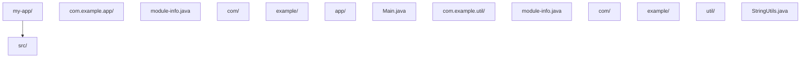
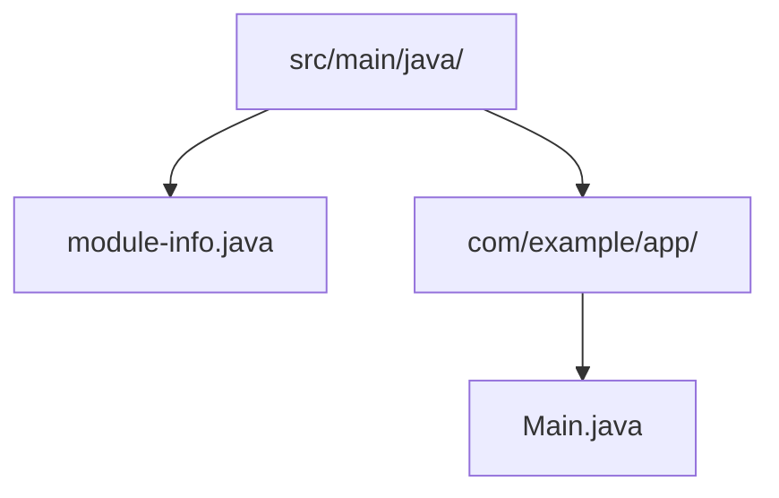

## 前置知识

- [Java 文本块](/java/046-JavaTextBlock)：建议先完成前一篇的学习

## 学习目标

- 掌握「0. 本节阅读指引（先读这一节）」的核心机制、典型用法与常见陷阱
- 掌握「概述」的核心机制、典型用法与常见陷阱
- 掌握「基础概念」的核心机制、典型用法与常见陷阱
- 掌握「快速上手」的核心机制、典型用法与常见陷阱
- 掌握「详细用法」的核心机制、典型用法与常见陷阱


## 0. 本节阅读指引（先读这一节）

本篇是「模块系统（JPMS）」进阶文档。

第一遍只读：概述、基础概念、快速上手，以及 module-info.java 声明、java 命令运行模块、javac 编译模块三个核心小节；会建模块、会编译运行即可。

可跳过：详细用法、进阶用法与文末 API 速查按需查阅。

遇到 `ModuleNotFoundException` 或 `java -cp` 突然失效时，直接看「注意事项与常见错误 → 零基础高频：为什么 java -cp 突然不好使了」小节。

前置：001 Java 概述与开发环境、068 Java 构建工具。


## 概述

Java 模块系统（Java Platform Module System，简称 JPMS）是 Java 9 引入的重要特性，它为 Java 提供了原生的模块化支持。在模块系统出现之前，Java 只有包（package）这一层组织结构，无法控制包之间的访问权限，也无法声明依赖关系。模块系统解决了这些问题，让大型应用的代码组织更清晰、依赖管理更明确。

模块系统的核心思想是"显式声明"：每个模块必须明确声明自己依赖什么、暴露什么。这和以前只要 classpath 上有 jar 就能随意访问的做法完全不同。虽然模块系统在应用开发中还不够普及，但 Java 标准库本身已经完全模块化，理解模块系统对排查依赖冲突和理解 JDK 结构很有帮助。

## 基础概念

### 什么是模块

模块是一组包的集合，加上一个模块描述文件 module-info.java。模块比 jar 更严格：jar 只是代码的打包方式，而模块还定义了访问边界。一个模块由以下要素组成：

- **名称**：模块的唯一标识，通常使用反向域名（如 com.example.app）
- **requires**：声明依赖的其他模块
- **exports**：声明对外暴露的包
- **opens**：声明允许反射访问的包
- **uses / provides**：声明服务提供与消费

### 模块与 Jar 的关系

模块是 jar 的升级。一个模块化 jar 和普通 jar 的区别在于是否包含 module-info.class。包含模块描述的 jar 既是模块也是 jar（可以放在 classpath 上以非模块方式使用），不包含的 jar 被称为"自动模块"。

### 为什么需要模块系统

没有模块系统时，Java 面临几个问题：classpath 上的所有类互相可见，无法隐藏内部实现；jar 地狱（同一个库的不同版本冲突）；JDK 本身过于庞大，即使只用几个功能也要加载整个 rt.jar。模块系统通过显式声明依赖和访问控制来解决这些问题。

## 快速上手

### 创建第一个模块

假设项目结构如下：



### 编写模块描述文件

工具模块的 module-info.java：

```java
// com.example.util 模块
module com.example.util {
    // 暴露 com.example.util 包，其他模块可以使用其中的类
    exports com.example.util;

    // 依赖 JDK 的 SQL 模块
    requires java.sql;
}
```

应用模块的 module-info.java：

```java
// com.example.app 模块
module com.example.app {
    // 依赖工具模块
    requires com.example.util;

    // transitive 表示依赖此模块的模块也会自动依赖 com.example.util
    requires transitive com.example.util;

    // 暴露服务包
    exports com.example.app.service;

    // 允许 Jackson 通过反射访问 model 包中的类
    opens com.example.app.model to com.fasterxml.jackson.databind;
}
```

### 编写模块代码

StringUtils.java（工具模块中的公开类）：

```java
package com.example.util;

// 这个类所在的包被 exports，所以其他模块可以访问
public class StringUtils {
    public static boolean isEmpty(String str) {
        return str == null || str.isEmpty();
    }
}
```

Main.java（应用模块中使用工具模块）：

```java
package com.example.app;

import com.example.util.StringUtils;

public class Main {
    public static void main(String[] args) {
        // 因为 com.example.app requires com.example.util，所以可以使用
        boolean result = StringUtils.isEmpty("");
        System.out.println("空字符串检查: " + result);
    }
}
```

### 编译和运行模块

```bash
# 编译工具模块
javac -d out/com.example.util \
  src/com.example.util/module-info.java \
  src/com.example.util/com/example/util/StringUtils.java

# 编译应用模块（指定模块路径）
javac --module-path out -d out/com.example.app \
  src/com.example.app/module-info.java \
  src/com.example.app/com/example/app/Main.java

# 运行应用模块
java --module-path out --module com.example.app/com.example.app.Main
```

## 详细用法

### 1. requires 指令详解

requires 声明模块依赖，有几种变体：

```java
module com.example.app {
    // 基本依赖：本模块需要使用 java.sql
    requires java.sql;

    // 传递依赖：依赖本模块的其他模块也会自动依赖 com.example.api
    requires transitive com.example.api;

    // 静态依赖：编译时需要，运行时可选
    requires static com.example.optional;
}
```

requires transitive 是最需要理解的变体。假设模块 A requires transitive 模块 B，那么依赖模块 A 的模块 C 可以直接使用模块 B 中的类，不需要再写 requires B。这通常用于 API 模块：如果你的公开方法返回了另一个模块的类型，就应该用 requires transitive。

### 2. exports 指令详解

exports 控制哪些包对外可见，可以限制只对特定模块暴露：

```java
module com.example.service {
    // 对所有模块暴露
    exports com.example.service.api;

    // 只对特定模块暴露（其他模块看不到这个包）
    exports com.example.service.internal to com.example.app;
}
```

限定导出（qualified export）适合内部模块之间的通信，防止外部模块依赖你的内部实现。

### 3. opens 指令与反射

exports 允许编译时访问，但反射默认只能访问 exports 的包。如果框架（如 Spring、Jackson）需要通过反射访问你的类，需要用 opens：

```java
module com.example.app {
    // 允许所有模块通过反射访问 model 包
    opens com.example.app.model;

    // 只允许 Jackson 通过反射访问 model 包
    opens com.example.app.model to com.fasterxml.jackson.databind;

    // 打开整个模块用于反射
    opens com.example.app.model;
    opens com.example.app.dto;
}
```

opens 和 exports 的区别：exports 是编译时和运行时都允许正常访问，opens 是允许反射访问但不允许编译时的正常访问（即不能 import）。所以如果你希望框架能通过反射设置私有字段，用 opens；如果希望其他模块直接调用你的类，用 exports。

### 4. 服务机制 uses 和 provides

模块系统内置了服务发现机制，解耦接口与实现：

```java
// 服务接口模块
module com.example.service.api {
    exports com.example.service.api;
}

// 服务实现模块
module com.example.service.impl {
    requires com.example.service.api;

    // 声明提供的服务实现
    provides com.example.service.api.GreetingService
        with com.example.service.impl.ChineseGreeting;
}

// 服务消费模块
module com.example.app {
    requires com.example.service.api;

    // 声明需要使用这个服务
    uses com.example.service.api.GreetingService;
}
```

消费方通过 ServiceLoader 发现实现：

```java
import com.example.service.api.GreetingService;
import java.util.ServiceLoader;

public class App {
    public static void main(String[] args) {
        // 自动发现所有 GreetingService 实现
        ServiceLoader<GreetingService> loader = ServiceLoader.load(GreetingService.class);
        for (GreetingService service : loader) {
            System.out.println(service.greet("World"));
        }
    }
}
```

### 5. 模块与 Maven/Gradle

在 Maven 项目中，module-info.java 放在 src/main/java 目录下即可。Maven 编译时会自动识别模块描述文件：



Gradle 项目同样如此，module-info.java 放在标准源码目录中。

## 常见场景

### 场景一：Spring Boot 应用的模块化

Spring Boot 3.x 已经支持模块化，但需要正确配置 opens 以允许 Spring 访问你的类：

```java
module com.example.myapp {
    requires spring.boot;
    requires spring.boot.autoconfigure;
    requires spring.context;
    requires spring.beans;
    requires spring.web;
    requires java.sql;

    // Spring 需要通过反射创建和注入 Bean
    opens com.example.myapp.controller to spring.web;
    opens com.example.myapp.service to spring.beans;
    opens com.example.myapp.model to com.fasterxml.jackson.databind;
    opens com.example.myapp.repository to spring.beans;
}
```

### 场景二：库的模块化

如果你在开发一个供他人使用的库，模块化可以让使用者只看到你暴露的 API，不会意外依赖内部实现：

```java
module com.example.mylib {
    // 只暴露 API 包
    exports com.example.mylib.api;

    // 内部实现包不暴露，外部无法直接使用
    // com.example.mylib.internal 不在 exports 中
}
```

## 注意事项与常见错误

### 未导出包的类不可访问

如果一个包没有被 exports，其他模块完全无法访问其中的类，即使类是 public 的：

```java
module com.example.util {
    exports com.example.util; // 只暴露了这个包
    // com.example.util.internal 没有暴露
}
```

其他模块尝试 import com.example.util.internal.SomeClass 会编译失败。

### 反射访问被拒绝

Spring、Hibernate、Jackson 等框架大量使用反射。如果你的模块没有 opens 对应的包，运行时会抛出 InaccessibleObjectException：

```
java.lang.reflect.InaccessibleObjectException: Unable to make field private java.lang.String com.example.app.model.User.name accessible
```

解决方法是添加 opens 声明，或者在启动时添加 JVM 参数临时打开：

```bash
java --add-opens com.example.app/com.example.app.model=ALL-UNNAMED -jar app.jar
```

### 依赖分裂包（Split Packages）

两个不同的模块不能包含相同的包名，否则会报错。这是模块系统最严格的限制之一。如果第三方库存在分裂包问题，可以将它们合并为同一个自动模块，或者使用 --patch-module 参数。

### 自动模块与命名模块混用

classpath 上的 jar 会被当作"未命名模块"，模块路径上的无 module-info 的 jar 会被当作"自动模块"。自动模块可以读取所有其他模块，但命名模块需要显式 requires 才能读取自动模块。过渡期间，可以先用自动模块，逐步迁移到命名模块。

### 零基础高频：为什么 java -cp 突然不好使了（ModuleNotFoundException）

现象：Java 8 时代 `java -cp lib/*.jar -jar app.jar` 一直能跑，升级 Java 17+ 或引入带 `module-info.class` 的库之后，突然报 `ModuleNotFoundException` 或 `Package ... is not visible`。

原因：Java 9+ 的模块系统只在"模块路径（module-path）"上生效。classpath 上的 jar 属于"未命名模块"，规则与旧版一致；一旦项目里出现 `module-info.java`（命名模块），依赖就必须显式 `requires`，而库未导出的包对模块化代码不可见。

零基础三条对策：

1. **没写 `module-info.java`，就别碰 module-path**：继续用 classpath（`java -cp` 或 IDEA 默认运行），不要手动加 `--module-path`；
2. **写了 `module-info.java`**：在文件里 `requires` 对应模块，运行命令改为 `java --module-path <目录> --module <模块名>/<主类>`；
3. **只想快速跑通第三方库**：优先把库放在 classpath 上运行，或在 `module-info.java` 里补 `requires` 后重新编译；不要 classpath 与 module-path 混着猜。

报错速查：

| 报错 | 含义 | 对策 |
| --- | --- | --- |
| `ModuleNotFoundException: xxx` | 依赖模块找不到，或漏写 `requires` | 确认 jar 在 module-path 上，并在 `module-info.java` 里 `requires xxx` |
| `Package xxx is not visible` | 依赖模块没有 `exports` 该包 | 改用对方导出的包；临时调试可用 `--add-exports` |
| `InvalidModuleDescriptorException` | jar 的 module-info 损坏或冲突 | 换库版本，或把该 jar 放 classpath 不用 module-path |
| `ClassNotFoundException` | classpath 上找不到类 | 与模块无关，先检查依赖是否引入、坐标是否写对 |

> 一句话：没写 `module-info.java` 的项目，`java -cp` 永远有效；报模块相关错误时，先分清你的 jar 在 classpath 还是 module-path 上。

## 进阶用法

### jlink 定制运行时

jlink 工具可以根据模块依赖生成精简的 JRE，只包含你的应用需要的模块：

```bash
# 生成只包含 java.base 和 java.sql 的精简运行时
jlink --module-path out --add-modules com.example.app --output custom-jre

# 使用精简运行时启动应用
custom-jre/bin/java --module com.example.app/com.example.app.Main
```

这可以将 JRE 从几百 MB 缩减到几十 MB，适合容器化部署和嵌入式场景。

### 层（Layer）与模块动态加载

模块系统支持创建新的模块层（ModuleLayer），可以在运行时动态加载模块，实现插件架构：

```java
// 创建新的模块层，动态加载插件
ModuleLayer parentLayer = ModuleLayer.boot();
Configuration parentConfig = parentLayer.configuration();

// 从指定路径查找并加载插件模块
ModuleFinder finder = ModuleFinder.of(Paths.get("plugins"));
Configuration config = parentConfig.resolve(finder, ModuleFinder.of(), Set.of("com.example.plugin"));

ModuleLayer layer = parentLayer.defineModulesWithOneLoader(config, ClassLoader.getSystemClassLoader());

// 使用插件
layer.findLoader("com.example.plugin").loadClass("com.example.plugin.MyPlugin");
```

### 迁移策略

对于现有项目，不建议一步到位迁移到完整模块系统。推荐的渐进式迁移策略是：

1. 先在项目根目录创建 module-info.java，用 requires 和 exports 声明核心依赖
2. 对于尚未模块化的第三方库，使用 requires 自动模块名
3. 使用 --add-opens 和 --add-reads 处理反射和访问问题
4. 逐步将自动模块替换为命名模块
5. 最终去掉所有临时性的 JVM 参数
## module-info.java 声明

**基本写法：声明模块**
`module <模块名> {}`
```java
// 定义模块 com.example.app
module com.example.app {
}
```

---

**基本写法：导出包**
`exports <包名>;`
```java
// 导出包供其他模块使用
module com.example.app {
    exports com.example.api;
}
```

---

**基本写法：导出到指定模块**
`exports <包名> to <模块名>;`
```java
// 仅向指定模块导出
module com.example.app {
    exports com.example.internal to com.example.other;
}
```

---

**基本写法：依赖模块**
`requires <模块名>;`
```java
// 声明依赖模块
module com.example.app {
    requires java.net.http;
}
```

---

**基本写法：传递依赖**
`requires transitive <模块名>;`
```java
// 依赖可传递给下游模块
module com.example.app {
    requires transitive java.sql;
}
```

---

**基本写法：静态依赖**
`requires static <模块名>;`
```java
// 仅编译期需要的依赖
module com.example.app {
    requires static java.annotation;
}
```

---

## 服务声明与使用

**基本写法：提供服务**
`provides <服务接口> with <实现类>;`
```java
// 声明模块提供的服务实现
module com.example.app {
    provides com.example.Service with com.example.ServiceImpl;
}
```

---

**基本写法：使用服务**
`uses <服务接口>;`
```java
// 声明模块使用 ServiceLoader 加载的服务
module com.example.app {
    uses com.example.Service;
}
```

---

**基本写法：打开包用于反射**
`opens <包名>;`
```java
// 允许其他模块反射访问
module com.example.app {
    opens com.example.entity;
}
```

---

**基本写法：打开包到指定模块**
`opens <包名> to <模块名>;`
```java
// 仅对指定模块开放反射
module com.example.app {
    opens com.example.entity to com.fasterxml.jackson.databind;
}
```

---

## java 命令运行模块

**基本写法：运行模块主类**
`java -m <模块>/<主类>`
```bash
# 运行模块化应用
java -m com.example.app/com.example.app.Main
```

---

**基本写法：指定模块路径**
`java --module-path <路径> -m <模块>/<主类>`
```bash
# 指定模块路径运行
java --module-path mods -m com.example.app/com.example.app.Main
```

---

**基本写法：升级模块路径**
`java --upgrade-module-path <路径> -m <模块>/<主类>`
```bash
# 替换可升级模块
java --upgrade-module-path upgrades -m com.example.app/com.example.app.Main
```

---

**基本写法：限制模块**
`java --limit-modules <模块1>,<模块2> -m <模块>/<主类>`
```bash
# 限制可观察的模块集合
java --limit-modules java.base,com.example.app -m com.example.app/com.example.app.Main
```

---

## javac 编译模块

**基本写法：编译模块源码**
`javac -d <输出> --module-source-path <路径> --module <模块>`
```bash
# 编译指定模块
javac -d out --module-source-path src --module com.example.app
```

---

**基本写法：编译所有模块**
`javac -d <输出> --module-source-path <路径> --module-source-path <路径> *`
```bash
# 编译源码路径下所有模块
javac -d out --module-source-path src --module *
```

---

## 打包模块 jar

**基本写法：打包模块 jar**
`jar --create --file=<jar> --module-version=<版本> -C <类目录> .`
```bash
# 创建带版本的模块 jar
jar --create --file=mods/com.example.app.jar --module-version=1.0 -C out/com.example.app .
```

---

**基本写法：jar 包含 module-info**
`jar --create --file=<jar> --main-class=<主类> -C <目录> .`
```bash
# 创建可执行模块 jar
jar --create --file=app.jar --main-class=com.example.app.Main -C out .
```

---

## jlink 创建运行时镜像

**基本写法：创建自定义 JRE**
`jlink --module-path <路径> --add-modules <模块> --output <目录>`
```bash
# 生成仅含所需模块的运行时镜像
jlink --module-path mods --add-modules com.example.app --output myimage
```

---

**基本写法：指定启动器**
`jlink --launcher <名称>=<模块>/<主类> --add-modules <模块> --output <目录>`
```bash
# 生成带启动脚本的可执行镜像
jlink --launcher app=com.example.app/com.example.app.Main --module-path mods --add-modules com.example.app --output myimage
```

---

**基本写法：压缩镜像**
`jlink --compress=<级别> --add-modules <模块> --output <目录>`
```bash
# 压缩级别 0-2 减小镜像体积
jlink --compress=2 --module-path mods --add-modules com.example.app --output myimage
```

---

## 模块相关 API

**基本写法：获取模块**
`<类>.class.getModule();`
```java
// 获取类所属模块
Module m = String.class.getModule();
```

---

**基本写法：获取模块名**
`<module>.getName();`
```java
// 获取模块名称
String name = m.getName();
```

---

**基本写法：加载类**
`<module>.getClassLoader().loadClass("<类名>");`
```java
// 通过模块的类加载器加载类
Class<?> c = m.getClassLoader().loadClass("com.example.App");
```

---

## jdeps 依赖分析

**基本写法：分析模块依赖**
`jdeps --module-path <路径> -m <模块>`
```bash
# 分析模块的依赖关系
jdeps --module-path mods -m com.example.app
```

---

**基本写法：生成 module-info**
`jdeps --generate-module-info <输出目录> <jar>`
```bash
# 为已有 jar 生成模块描述
jdeps --generate-module-info out lib.jar
```

---

**基本写法：列出依赖**
`jdeps -s <jar>`
```bash
# 简洁列出 jar 包依赖
jdeps -s app.jar
```
