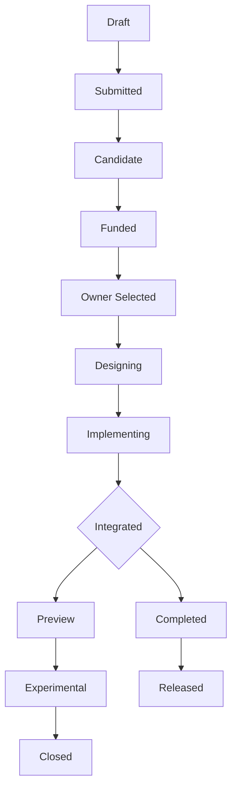
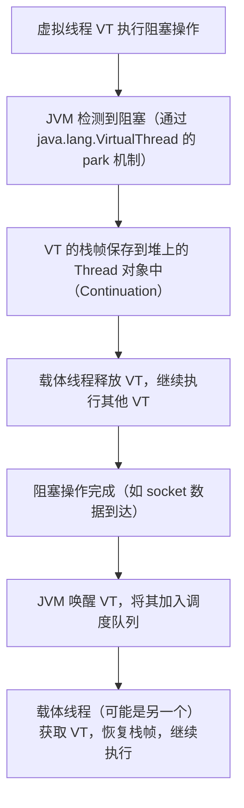

## 前置知识

- [Java 模块系统](/java/047-JavaModuleSystem)：建议先完成前一篇的学习

## 学习目标

- 掌握「0. 本节阅读指引（先读这一节）」的核心机制、典型用法与常见陷阱
- 掌握「1. 历史动机与演化」的核心机制、典型用法与常见陷阱
- 掌握「2. 形式化定义」的核心机制、典型用法与常见陷阱
- 掌握「3. 理论推导：现代特性的内部机制」的核心机制、典型用法与常见陷阱
- 掌握「4. 代码示例：从入门到进阶的完整实战」的核心机制、典型用法与常见陷阱


## 0. 本节阅读指引（先读这一节）

本篇是「Java 新特性」综述。

第一遍只读：4. 代码示例与附录 A（Java 8-21 特性速查表）；record、sealed、模式匹配、文本块各小节按需查阅。

可跳过：1-3 节（历史、形式化、理论推导）与 5-8 节第二遍细读。

前置：掌握 013-025 基础语法、集合与函数式基础。


# Java 现代特性深度指南（Java 8-21）

> Java 自 1996 年诞生以来，经历了从"缓慢演进"到"快速迭代"的范式转变。从 Java 8（2014）的 Lambda、Stream、Optional 三剑客开启现代 Java 纪元，到 Java 21（2023）的虚拟线程、模式匹配、记录类三大支柱完成"现代 Java"形态构建，这 9 年间的演进重新定义了 Java 作为一门语言的表达力、性能边界与工程哲学。本文将以版本为线索、以特性为单元、以原理为深度，系统性地剖析 Java 8 至 21 的关键演进，让读者既能掌握每个特性的"如何使用"，也能理解"为何如此设计"，最终建立对 Java 语言演进的系统认知。

---

## 1. 历史动机与演化

### 1.1 Java 演进的范式转变

Java 的发展史可分为三个阶段：

**阶段 1：缓慢演进期（1996-2014，JDK 1.0-8）**

- 每 3-5 年发布一个版本，特性数量大但迭代慢。
- 重大里程碑：JDK 1.1（反射、内部类）、JDK 1.5（泛型、注解、枚举、自动装箱）、JDK 1.8（Lambda、Stream、Optional、Date Time API）。
- 痛点：语言演进慢，社区被 Scala、Kotlin 等新语言蚕食。

**阶段 2：快速迭代期（2017-2021，JDK 9-17）**

- 2017 年起改为 **6 个月一次发布**（3 月、9 月），不再等"大版本"。
- 每 3 年发布一个 **LTS 版本**（长期支持，11、17、21）。
- 非 LTS 版本（9、10、12、13、14、15、16）仅支持 6 个月，作为"试验田"。
- 重大里程碑：JDK 9（模块系统）、JDK 11（HttpClient、var 关键字）、JDK 17（密封类、Pattern Matching for instanceof）。

**阶段 3：现代化完成期（2021-至今，JDK 17+）**

- Java 21（2023 年 9 月）成为"现代 Java"的里程碑：虚拟线程正式、模式匹配正式、记录模式正式。
- 后续版本（22、23、24...）继续增量演进，但核心形态已稳定。
- GraalVM、Native Image 推动 Java 向"云原生"友好演进。

### 1.2 JEP 机制与特性孵化

Java 的每个新特性都通过 **JEP（JDK Enhancement Proposal）** 流程推进。JEP 的状态机：



**关键状态说明**：

- **Preview**：预览特性，需 `--enable-preview` 启用，可能在后续版本变更或移除。
- **Experimental**：实验性特性，仅供研究，不保证稳定性。
- **Released**：正式特性，向后兼容保证。
- **Closed**：撤销或废弃。

JEP 分为几类：

- **Language Features**：语法特性（如 Record、密封类）。
- **Library Features**：API 特性（如 HttpClient、List.of）。
- **JVM Features**：JVM 改进（如 invokedynamic、ZGC）。
- **Tooling Features**：工具链改进（如 jshell、jpackage）。
- **Infrastructure Features**：构建与发布流程改进。

### 1.3 关键 LTS 版本时间线

| 版本 | 发布时间 | 类型 | 关键特性 |
|------|---------|------|---------|
| JDK 8 | 2014-03 | LTS | Lambda、Stream、Optional、Date Time API、默认方法、接口静态方法 |
| JDK 11 | 2018-09 | LTS | HttpClient、var 局部变量、String 新方法（strip/isBlank/lines）、Flight Recorder 开源、ZGC 实验性 |
| JDK 17 | 2021-09 | LTS | 密封类正式、Pattern Matching for instanceof 正式、强封装默认、Text Blocks 正式、Switch 表达式正式 |
| JDK 21 | 2023-09 | LTS | 虚拟线程正式、Pattern Matching for switch 正式、Record Patterns 正式、字符串模板预览、Sequenced Collections |

### 1.4 设计哲学：Java 演进的保守与激进

Java 的演进遵循 **"保守的语法、激进的库"** 原则：

- **语法层保守**：Java 不轻易引入新语法，每个新关键字（如 `record`、`sealed`、`permits`、`yield`）都经过 5-10 年的预览与讨论。这保证了代码的长期可维护性，但被批评为"慢半拍"。
- **库层激进**：Java 大量通过 API 演进（而非语法）提供新能力。例如 `Stream API`、`Optional`、`CompletableFuture` 都是库层创新，不改变语法但改变编程范式。
- **JVM 层激进**：JVM 内部持续引入激进优化（`invokedynamic`、`ZGC`、`AppCDS`、`Scalar Replacement`），这些对应用层透明但显著提升性能。

这一哲学的核心是 **"向后兼容"** —— 一份 1996 年的 Java 1.0 代码在 Java 21 上仍应能编译运行。这是 Java 在企业级市场不可替代的根本原因。

### 1.5 与其他语言的对比

| 特性 | Java | Kotlin | Scala | C# |
|------|------|--------|-------|-----|
| 模式匹配 | Java 21 正式 | 原生支持 | 原生支持（强） | C# 7+ |
| Record 类 | Java 16 | data class | case class | record (C# 9) |
| 密封类 | Java 17 | sealed class | sealed trait | sealed (C# 5) |
| 虚拟线程 | Java 21 | 协程（kotlinx.coroutines） | 协程（影响） | async/await |
| 不可变集合 | List.of (Java 9) | listOf | List(immutable) | ImmutableArray |
| 字符串模板 | 预览（Java 21） | "$variable" | s"..." | $"..." |
| 空安全 | Optional（弱） | 原生（强） | Option（强） | Nullable（强） |

> **历史轶事**：Java 8 的 Lambda 设计曾引发激烈争论。Brian Goetz（Java 语言架构师）最终选择"基于 invokedynamic 的 Lambda"而非"内部类语法糖"，这一决策使 Lambda 在字节码层与 Scala、Kotlin 的闭包实现兼容，为后续函数式编程生态奠定基础。

---

## 2. 形式化定义

### 2.1 Record 类的形式化定义

Record 类 $R$ 是一个不可变的透明数据载体，定义为：

$$
R(c_1: T_1, c_2: T_2, \ldots, c_n: T_n) = \text{record class with components } \{c_i\}
$$

其语义等价于以下自动生成的成员：

1. **私有 final 字段**：$\forall i: \text{private final } T_i \ c_i;$
2. **规范构造器**（Canonical Constructor）：$R(T_1 c_1, \ldots, T_n c_n)$，赋值所有字段。
3. **访问器方法**（Accessor）：$\forall i: T_i \ c_i()$（注意：无 `get` 前缀）。
4. **equals 方法**：基于所有字段，满足 $\text{equals}(r_1, r_2) \iff \bigwedge_i c_i(r_1) = c_i(r_2)$。
5. **hashCode 方法**：基于所有字段，满足 $\text{hashCode}(r) = \text{hash}(c_1(r), \ldots, c_n(r))$。
6. **toString 方法**：返回 `R[c1=v1, c2=v2, ..., cn=vn]` 格式。

形式化地，Record 类的"透明性"意味着其内部表示（字段值）与外部接口（访问器）完全对应，无隐藏状态。

### 2.2 密封类的形式化定义

密封类 $S$ 显式声明其 permitted 子类集合 $P(S)$：

$$
S \text{ sealed permits } P(S) = \{s_1, s_2, \ldots, s_k\}
$$

约束：

1. **封闭性**：$\forall x: x \text{ extends } S \implies x \in P(S)$。
2. **传递性**：每个 $s_i \in P(S)$ 必须是 `final`、`sealed` 或 `non-sealed`。
   - `final`：不可继承。
   - `sealed`：继续密封，需声明 `permits`。
   - `non-sealed`：开放继承，任意类可继承（破坏封闭性，慎用）。
3. **共置要求**：$S$ 与 $P(S)$ 必须在同一模块（若在模块中）或同一包（若在未命名模块中）。

密封类使得 **穷举性检查**（exhaustiveness）成为可能：编译器可验证 switch 表达式是否覆盖所有 $P(S)$，无需 `default` 分支。

### 2.3 Pattern Matching 的形式化语义

Pattern Matching 是一种将"类型测试 + 类型转换 + 变量绑定"三步合一的机制。形式化地，模式 $p$ 与值 $v$ 的匹配 $\text{match}(p, v)$ 定义为：

$$
\text{match}(p, v) = \begin{cases}
(\text{true}, \theta) & \text{if } v \text{ 符合模式 } p \text{，绑定 } \theta \\
(\text{false}, \bot) & \text{otherwise}
\end{cases}
$$

其中 $\theta$ 是绑定环境（变量名到值的映射）。

**类型模式**（Type Pattern）`T x`：

$$
\text{match}(T \ x, v) = \begin{cases}
(\text{true}, \{x \mapsto v\}) & \text{if } v \in T \\
(\text{false}, \bot) & \text{otherwise}
\end{cases}
$$

**记录模式**（Record Pattern）`R(p_1, p_2, ..., p_n)`：

$$
\text{match}(R(p_1, \ldots, p_n), v) = \begin{cases}
\text{match}(p_1, v.c_1()) \land \ldots \land \text{match}(p_n, v.c_n()) & \text{if } v \in R \\
(\text{false}, \bot) & \text{otherwise}
\end{cases}
$$

**守卫模式**（Guarded Pattern）`p when e`：

$$
\text{match}(p \text{ when } e, v) = \begin{cases}
\text{match}(p, v) & \text{if } e \text{ evaluates to true} \\
(\text{false}, \bot) & \text{otherwise}
\end{cases}
$$

### 2.4 虚拟线程的形式化模型

虚拟线程是 JVM 调度的轻量级线程，其形式化模型：

- **载体线程**（Carrier Thread）：操作系统级平台线程，由 ForkJoinPool（默认 `Runtime.getRuntime().availableProcessors()` 个）提供。
- **虚拟线程状态机**：`NEW → RUNNABLE → (parked | pinned) → TERMINATED`。
  - `NEW`：已创建未启动。
  - `RUNNABLE`：在载体线程上执行。
  - `parked`：因 I/O 阻塞、`LockSupport.park()` 等让出载体线程。
  - `pinned`：因 `synchronized`、`native` 方法、JNI 调用无法卸载，占用载体线程。
  - `TERMINATED`：执行结束。

虚拟线程的调度是 **M:N 调度**（M 个虚拟线程映射到 N 个载体线程），与传统线程的 1:1 调度相对。其优势：

- **内存占用低**：虚拟线程初始栈约 1KB（可增长），平台线程栈约 1MB，相差 1000 倍。
- **创建成本低**：虚拟线程无需 OS 系统调用（`clone`），JVM 内部分配。
- **阻塞成本低**：虚拟线程阻塞时不占用载体线程，载体线程可执行其他虚拟线程。

### 2.5 invokedynamic 与 Lambda 的关系

Lambda 表达式在字节码层通过 `invokedynamic` 指令实现。形式化地：

```java
Function<String, Integer> f = s -> s.length();
```

编译后等价于：

```
1. 生成隐式方法 lambda$0(String): int，包含 Lambda 体
2. 在调用点生成 invokedynamic 指令，bootstrap 方法为 LambdaMetafactory.metafactory
3. 首次执行时，LambdaMetafactory 生成实现 Function 接口的类，链接到 lambda$0
4. 后续调用直接分派到生成的类
```

这一设计的优势：

- **实现策略可演化**：JVM 可选择内部类、MethodHandle、或直接生成字节码，对源码透明。
- **性能优化空间**：JIT 可内联 Lambda 体，避免接口调用开销。
- **生态兼容**：Scala、Kotlin、Groovy 的闭包也用 invokedynamic，统一了 JVM 函数式编程的底层。

---

## 3. 理论推导：现代特性的内部机制

### 3.1 Record 类的字节码剖析

考虑以下 Record 定义：

```java
public record Point(int x, int y) {}
```

使用 `javap -p -c Point` 查看字节码：

```
public final class Point extends java.lang.Record {
    private final int x;
    private final int y;

    public Point(int, int);          // 规范构造器
    public final boolean equals(java.lang.Object);
    public final int hashCode();
    public final java.lang.String toString();
    public int x();                  // 访问器
    public int y();
}
```

关键点：

1. **`extends java.lang.Record`**：所有 Record 类隐式继承 `java.lang.Record`，这是 Record 的"标记基类"。
2. **`final` 类**：Record 不可继承，保证不可变性。
3. **无 setter**：所有字段 `final`，无 setter 方法。
4. **访问器名即字段名**：`x()` 而非 `getX()`，这是 Record 与 JavaBeans 的本质差异。

Record 类在 `Record` 属性（JVMS §4.7.30）中记录其组件元数据，反射 API 通过 `Class.getRecordComponents()` 读取，使 Jackson、Gson 等库能识别 Record 的规范构造器进行反序列化。

### 3.2 密封类的字节码剖析

```java
public sealed interface Shape permits Circle, Square, Triangle {}
```

字节码：

```
public abstract interface Shape
  PermittedSubclasses attribute:
    Circle
    Square
    Triangle
```

`PermittedSubclasses` 属性（JVMS §4.7.31）记录所有 permitted 子类。JVM 在类加载时验证：

- 若类 $C$ 声明为 `sealed permits $P$`，则 $P$ 中每个子类必须存在且为 $C$ 的子类。
- 若类 $D$ extends $C$，但 $D \notin P$，JVM 抛出 `IncompatibleClassChangeError`。

这一机制在编译期和运行期双重保障封闭性。

### 3.3 Pattern Matching 的类型消除算法

`instanceof` 模式匹配的字节码等价于：

```java
// 源码
if (obj instanceof String s) {
    System.out.println(s.length());
}

// 字节码等价
if (obj instanceof String) {
    String s = (String) obj;
    System.out.println(s.length());
}
```

但编译器会进行 **流分析**（Flow Analysis），确定变量 $s$ 的"明确赋值"（definite assignment）范围：

- $s$ 在 `if` 条件为真的分支中赋值。
- $s$ 在 `if` 条件为假的分支中未赋值（作用域结束）。
- 复杂的 `&&`、`||`、`!` 组合也能正确处理。

例如：

```java
// s 的作用域是整个 if 块
if (obj instanceof String s && s.length() > 5) {
    System.out.println(s.toUpperCase()); // s 已绑定
}

// 否定模式：s 在 else 块中可用
if (!(obj instanceof String s)) {
    return; // obj 不是 String
}
System.out.println(s.length()); // s 已绑定
```

### 3.4 Switch 模式匹配的穷举性算法

Switch 模式匹配的穷举性检查基于以下规则：

1. **密封类穷举**：若 switch 表达式的选择器类型是密封类 $S$，且所有 `case` 标签覆盖 $P(S)$，则穷举。
2. **类型层级穷举**：若选择器类型是 $T$，且 `case` 标签覆盖 $T$ 的所有子类型（通过密封类递归），则穷举。
3. **null 处理**：若选择器可能为 `null`，需显式 `case null` 处理（Java 21+）。
4. **default 替代**：若不穷举，需 `default` 分支。

算法形式化：

$$
\text{exhaustive}(\text{switch}, T) = \text{covered}(\text{cases}, T) \land \text{handlesNull}(\text{switch})
$$

其中 $\text{covered}(\text{cases}, T)$ 递归判断 `cases` 是否覆盖 $T$ 的所有可能值。

### 3.5 虚拟线程的卸载机制

虚拟线程的卸载（unmount）发生在以下场景：

1. **I/O 阻塞**：调用 `socket.read()`、`file.read()` 等 NIO 阻塞操作。
2. **`LockSupport.park()`**：显式 park。
3. **`Thread.sleep()`**：睡眠。
4. **`Object.wait()` / `Condition.await()`**：等待。
5. **`BlockingQueue` 操作**：`put`、`take` 等。

卸载流程：



**固定（Pinning）** 是卸载的反面：虚拟线程无法卸载，占用载体线程。发生场景：

1. **`synchronized` 块内阻塞**：`synchronized` 使用 OS monitor，无法在虚拟线程上重实现。
2. **JNI 调用**：native 方法持有 OS 资源。
3. **第三方库的 `Thread.currentThread()` 假设**：某些库假设线程是平台线程，可能 break。

修复：用 `ReentrantLock` 替代 `synchronized`。JDK 21+ 提供了 `jcmd Thread.dump_to_file` 命令检测 pinning。

### 3.6 Text Block 的缩进剥离算法

Text Block（文本块）使用 `"""` 包裹多行字符串，其缩进剥离算法：

1. **确定最小缩进**：扫描所有非空行，找到最小前导空格数 $m$。
2. **剥离缩进**：每行去除前 $m$ 个空格。
3. **处理 `"""` 后换行**：`"""` 后的换行符被忽略（第一个换行不计入内容）。
4. **处理尾部 `"""` 位置**：尾部 `"""` 的位置决定"附加缩进"：
   - 若 `"""` 与最后一行同行，内容不附加缩进。
   - 若 `"""` 单独一行，内容附加缩进（缩进 = `"""` 的前导空格数）。

```java
String s = """
        Hello
        World
        """; // 最小缩进 8，剥离后 "Hello\nWorld\n"

String s2 = """
        Hello
        World
    """; // 最小缩进 8，尾部 """ 缩进 4，剥离后 "    Hello\n    World\n"
```

`stripIndent()` 方法实现这一算法，可手动调用。

### 3.7 var 关键字的类型推断

`var` 是 Java 10 引入的局部变量类型推断（Local Variable Type Inference），仅用于局部变量（不可用于字段、方法参数、返回类型）。

```java
var list = new ArrayList<String>();  // 推断为 ArrayList<String>
var stream = list.stream();          // 推断为 Stream<String>
var map = Map.of("a", 1);            // 推断为 Map<String, Integer>
```

类型推断算法基于 **LU（Least Upper Bound）**：从初始化表达式的类型推断变量类型。对于泛型，`var` 使用 `<>` 的目标类型推断：

```java
var list = new ArrayList<>();  // 推断为 ArrayList<Object>，而非 ArrayList<String>
```

**注意**：`var` 不是动态类型，变量类型在编译期确定，不可变。以下代码编译错误：

```java
var x = 1;
x = "string"; // 编译错误：x 是 int，不能赋值 String
```

---

## 4. 代码示例：从入门到进阶的完整实战

### 4.1 示例 1：Record 类全面演示

```java
// 文件：RecordDemo.java
/**
 * Record 类全面演示
 * 演示规范构造器、紧凑构造器、自定义方法、实现接口、静态工厂
 */
public class RecordDemo {

    // 基本 Record：自动生成构造器、访问器、equals、hashCode、toString
    public record Point(int x, int y) {
        // 紧凑构造器（Compact Constructor）：用于参数验证
        public Point {
            if (x < 0 || y < 0) {
                throw new IllegalArgumentException("坐标不能为负数");
            }
        }

        // 自定义方法
        public double distanceTo(Point other) {
            return Math.sqrt(Math.pow(x - other.x, 2) + Math.pow(y - other.y, 2));
        }

        // 静态工厂方法
        public static Point origin() {
            return new Point(0, 0);
        }
    }

    // Record 实现接口
    public interface Measurable {
        double measure();
    }

    public record Circle(double radius) implements Measurable {
        public Circle {
            if (radius < 0) {
                throw new IllegalArgumentException("半径不能为负");
            }
        }

        @Override
        public double measure() {
            return Math.PI * radius * radius;
        }
    }

    // Record 与泛型
    public record Pair<A, B>(A first, B second) {
        public <C> Pair<C, B> mapFirst(java.util.function.Function<A, C> mapper) {
            return new Pair<>(mapper.apply(first), second);
        }
    }

    public static void main(String[] args) {
        // 基本用法
        Point p1 = new Point(3, 4);
        Point p2 = new Point(6, 8);
        System.out.println(p1); // Point[x=3, y=4]
        System.out.println(p1.x()); // 3（注意：不是 getX()）
        System.out.println(p1.distanceTo(p2)); // 5.0

        // equals / hashCode
        Point p3 = new Point(3, 4);
        System.out.println(p1.equals(p3)); // true
        System.out.println(p1.hashCode() == p3.hashCode()); // true

        // 静态工厂
        Point origin = Point.origin();
        System.out.println(origin); // Point[x=0, y=0]

        // 实现接口
        Circle c = new Circle(5);
        System.out.println("圆面积: " + c.measure()); // 78.5398...

        // 泛型
        Pair<String, Integer> pair = new Pair<>("Hello", 42);
        Pair<Integer, Integer> mapped = pair.mapFirst(String::length);
        System.out.println(mapped); // Pair[first=5, second=42]
    }
}
```

### 4.2 示例 2：密封类与模式匹配 switch

```java
// 文件：SealedPatternDemo.java
/**
 * 密封类 + 模式匹配 switch 演示
 * 演示领域建模、穷举性检查、记录模式嵌套
 */
public class SealedPatternDemo {

    // 密封接口：支付方式领域模型
    public sealed interface PaymentMethod permits CreditCard, WeChatPay, BankTransfer, Cash {}

    // Record 实现密封接口
    public record CreditCard(String number, String expiry, String cvv) implements PaymentMethod {}
    public record WeChatPay(String openId) implements PaymentMethod {}
    public record BankTransfer(String account, String bankName) implements PaymentMethod {}
    public record Cash(double amount) implements PaymentMethod {}

    // 模式匹配 switch：穷举所有 PaymentMethod 子类，无需 default
    public static String describe(PaymentMethod method) {
        return switch (method) {
            case CreditCard(var num, var exp, var cvv) ->
                "信用卡，尾号: " + num.substring(num.length() - 4) + "，有效期: " + exp;
            case WeChatPay(var openId) ->
                "微信支付，OpenID: " + openId;
            case BankTransfer(var acct, var bank) ->
                "银行转账，" + bank + " 账户: " + acct;
            case Cash(double amount) ->
                "现金支付，金额: " + amount;
        };
    }

    // 带守卫的模式匹配
    public static String assess(PaymentMethod method) {
        return switch (method) {
            case CreditCard(var num, var exp, var cvv) when num.startsWith("4") ->
                "Visa 信用卡";
            case CreditCard(var num, var exp, var cvv) when num.startsWith("5") ->
                "Mastercard 信用卡";
            case CreditCard(var num, var exp, var cvv) ->
                "其他信用卡";
            case WeChatPay _ -> "微信支付";
            case BankTransfer _ -> "银行转账";
            case Cash(double amount) when amount > 10000 -> "大额现金";
            case Cash _ -> "小额现金";
        };
    }

    // 嵌套记录模式：解构嵌套 Record
    public sealed interface Shape permits Circle, Box {}
    public record Circle(double radius) implements Shape {}
    public record Box(double width, double height, double depth) implements Box {} // 错误：Box 应实现 Shape

    // 修正版
    public sealed interface Shape2 permits Circle2, Rectangle2, Triangle2 {}
    public record Circle2(double radius) implements Shape2 {}
    public record Rectangle2(double width, double height) implements Shape2 {}
    public record Triangle2(double a, double b, double c) implements Shape2 {}

    public static double area(Shape2 shape) {
        return switch (shape) {
            case Circle2(var r) -> Math.PI * r * r;
            case Rectangle2(var w, var h) -> w * h;
            case Triangle2(var a, var b, var c) -> {
                double s = (a + b + c) / 2;
                yield Math.sqrt(s * (s - a) * (s - b) * (s - c));
            }
        };
    }

    // instanceof 模式匹配
    public static void process(Object obj) {
        if (obj instanceof String s && s.length() > 5) {
            System.out.println("长字符串: " + s.toUpperCase());
        } else if (obj instanceof Integer i && i > 0) {
            System.out.println("正整数: " + i);
        } else if (obj instanceof Point(int x, int y)) {
            System.out.println("点: (" + x + ", " + y + ")");
        } else {
            System.out.println("未知类型");
        }
    }

    // 假设 Point 是上面的 Record
    public record Point(int x, int y) {}

    public static void main(String[] args) {
        PaymentMethod[] methods = {
            new CreditCard("4111111111111111", "12/25", "123"),
            new CreditCard("5111111111111111", "11/26", "456"),
            new WeChatPay("wx_openid_001"),
            new BankTransfer("622848", "工商银行"),
            new Cash(500.0),
            new Cash(20000.0)
        };

        for (PaymentMethod m : methods) {
            System.out.println(describe(m));
            System.out.println("  -> " + assess(m));
        }

        // 模式匹配处理
        process("Hello World");
        process(42);
        process(new Point(3, 4));
    }
}
```

### 4.3 示例 3：文本块与字符串增强

```java
// 文件：TextBlockDemo.java
/**
 * 文本块 + 字符串增强演示
 * 演示多行字符串、formatted、stripIndent、translateEscapes
 */
public class TextBlockDemo {

    public static void main(String[] args) {
        // 1. 基本文本块：SQL 查询
        String sql = """
            SELECT u.id, u.name, u.email, o.total
            FROM users u
            JOIN orders o ON u.id = o.user_id
            WHERE u.created_at > '2026-01-01'
              AND o.total > 100
            ORDER BY o.total DESC
            """;
        System.out.println("SQL:\n" + sql);

        // 2. JSON 模板
        String json = """
            {
                "user": {
                    "id": %d,
                    "name": "%s",
                    "email": "%s"
                },
                "timestamp": "%s"
            }
            """.formatted(1001, "张三", "zhangsan@example.com", java.time.Instant.now());
        System.out.println("JSON:\n" + json);

        // 3. HTML 模板
        String html = """
            <html>
                <head><title>%s</title></head>
                <body>
                    <h1>%s</h1>
                    <p>%s</p>
                </body>
            </html>
            """.formatted("Welcome", "Hello, World", "This is a text block demo.");
        System.out.println("HTML:\n" + html);

        // 4. 字符串新方法（Java 11+）
        String messy = "  Hello   World  ";
        System.out.println("strip(): '" + messy.strip() + "'");           // "Hello   World"
        System.out.println("stripLeading(): '" + messy.stripLeading() + "'"); // "Hello   World  "
        System.out.println("stripTrailing(): '" + messy.stripTrailing() + "'"); // "  Hello   World"
        System.out.println("strip() vs trim(): strip() 是 Unicode 感知的");

        System.out.println("repeat(): " + "ab".repeat(3));    // ababab
        System.out.println("isBlank(): " + "   ".isBlank());  // true
        System.out.println("lines():");
        "line1\nline2\nline3".lines().forEach(System.out::println);

        // 5. 缩进控制
        String indented = """
            Hello
            World
            """.indent(4);
        System.out.println("indent(4):\n" + indented);

        String stripped = """
                Hello
                World
                """.stripIndent();
        System.out.println("stripIndent():\n" + stripped);

        // 6. translateEscapes：将字符串中的转义序列转换为实际字符
        String raw = "Hello\\nWorld\\t!";
        System.out.println("原始: " + raw);
        System.out.println("translateEscapes: " + raw.translateEscapes());

        // 7. formatted 方法（替代 String.format）
        String formatted = "用户 %s，年龄 %d".formatted("李四", 30);
        System.out.println(formatted);
    }
}
```

### 4.4 示例 4：虚拟线程实战

```java
// 文件：VirtualThreadDemo.java
import java.net.URI;
import java.net.http.HttpClient;
import java.net.http.HttpRequest;
import java.net.http.HttpResponse;
import java.time.Duration;
import java.time.Instant;
import java.util.List;
import java.util.concurrent.Executors;
import java.util.concurrent.Future;
import java.util.stream.IntStream;

/**
 * 虚拟线程实战演示
 * 演示虚拟线程创建、并发 HTTP 请求、与平台线程性能对比
 */
public class VirtualThreadDemo {

    public static void main(String[] args) throws Exception {
        // 1. 基础创建方式
        Thread vt1 = Thread.startVirtualThread(() -> {
            System.out.println("虚拟线程运行: " + Thread.currentThread());
        });
        vt1.join();

        // 2. Builder API
        Thread vt2 = Thread.ofVirtual()
            .name("my-vt-", 0)
            .start(() -> System.out.println("命名虚拟线程: " + Thread.currentThread()));
        vt2.join();

        // 3. 虚拟线程执行器
        System.out.println("\n=== 并发 HTTP 请求 ===");
        long syncStart = System.currentTimeMillis();
        try (var executor = Executors.newVirtualThreadPerTaskExecutor()) {
            List<Future<String>> futures = IntStream.range(0, 100)
                .mapToObj(i -> executor.submit(() -> fetchUrl("https://httpbin.org/delay/1")))
                .toList();

            for (Future<String> f : futures) {
                f.get();
            }
        }
        long syncDuration = System.currentTimeMillis() - syncStart;
        System.out.println("100 个并发请求（虚拟线程）耗时: " + syncDuration + " ms");

        // 4. 对比：平台线程
        long platformStart = System.currentTimeMillis();
        try (var executor = Executors.newFixedThreadPool(100)) {
            List<Future<String>> futures = IntStream.range(0, 100)
                .mapToObj(i -> executor.submit(() -> fetchUrl("https://httpbin.org/delay/1")))
                .toList();

            for (Future<String> f : futures) {
                f.get();
            }
        }
        long platformDuration = System.currentTimeMillis() - platformStart;
        System.out.println("100 个并发请求（平台线程，100 线程池）耗时: " + platformDuration + " ms");

        // 5. 虚拟线程 + CompletableFuture
        System.out.println("\n=== 虚拟线程 + CompletableFuture ===");
        try (var executor = Executors.newVirtualThreadPerTaskExecutor()) {
            Instant start = Instant.now();
            List<String> results = List.of(
                    "https://httpbin.org/delay/1",
                    "https://httpbin.org/delay/2",
                    "https://httpbin.org/delay/3"
                ).stream()
                .map(url -> java.util.concurrent.CompletableFuture
                    .supplyAsync(() -> fetchUrl(url), executor))
                .toList()
                .stream()
                .map(java.util.concurrent.CompletableFuture::join)
                .toList();

            System.out.println("3 个串行请求（虚拟线程并发）总耗时: " +
                Duration.between(start, Instant.now()).toMillis() + " ms");
        }

        // 6. 检测虚拟线程是否固定（Pinning）
        System.out.println("\n=== 虚拟线程固定检测 ===");
        System.out.println("运行以下命令检测 pinning：");
        System.out.println("  jcmd <pid> Thread.dump_to_file -format=json thread_dump.json");
        System.out.println("在 JSON 中搜索 'pinned' 字段");
    }

    /**
     * 模拟 HTTP 请求
     */
    private static String fetchUrl(String url) {
        try {
            HttpClient client = HttpClient.newBuilder()
                .connectTimeout(Duration.ofSeconds(10))
                .build();
            HttpRequest request = HttpRequest.newBuilder()
                .uri(URI.create(url))
                .timeout(Duration.ofSeconds(30))
                .GET()
                .build();
            HttpResponse<String> response = client.send(request, HttpResponse.BodyHandlers.ofString());
            return response.body().substring(0, Math.min(100, response.body().length()));
        } catch (Exception e) {
            return "Error: " + e.getMessage();
        }
    }
}
```

### 4.5 示例 5：结构化并发（Structured Concurrency）

```java
// 文件：StructuredConcurrencyDemo.java
import java.util.concurrent.*;
import java.util.concurrent.StructuredTaskScope.*;

/**
 * 结构化并发演示（Java 21 预览特性，Java 24 正式）
 * 演示 ShutdownOnFailure 和 ShutdownOnSuccess 两种作用域
 *
 * 编译运行需启用预览特性：
 *   javac --enable-preview --release 21 StructuredConcurrencyDemo.java
 *   java --enable-preview StructuredConcurrencyDemo
 */
public class StructuredConcurrencyDemo {

    record User(Long id, String name, String email) {}
    record Order(Long id, Long userId, double total) {}
    record OrderDetail(User user, Order order, List<Item> items) {}
    record Item(Long id, String name, double price) {}

    /**
     * ShutdownOnFailure：任一子任务失败则关闭所有子任务
     */
    public static OrderDetail fetchOrderDetail(Long orderId) throws Exception {
        try (var scope = new ShutdownOnFailure()) {
            // 并发 fork 三个子任务
            Subtask<User> userTask = scope.fork(() -> fetchUser(orderId));
            Subtask<Order> orderTask = scope.fork(() -> fetchOrder(orderId));
            Subtask<List<Item>> itemsTask = scope.fork(() -> fetchItems(orderId));

            // 等待所有子任务完成
            scope.join();
            // 若任一子任务失败，抛出 ExecutionException
            scope.throwIfFailed();

            // 所有子任务都成功，组装结果
            return new OrderDetail(userTask.get(), orderTask.get(), itemsTask.get());
        }
    }

    /**
     * ShutdownOnSuccess：任一子任务成功则关闭其他子任务（用于竞速）
     */
    public static String fetchFromMultipleSources(String query) throws Exception {
        try (var scope = new ShutdownOnSuccess<String>()) {
            // 并发查询多个数据源
            scope.fork(() -> queryPrimaryDB(query));
            scope.fork(() -> queryReplicaDB(query));
            scope.fork(() -> queryCache(query));

            scope.join();
            // 返回第一个成功的结果
            return scope.result();
        }
    }

    // 模拟数据获取方法
    private static User fetchUser(Long orderId) throws InterruptedException {
        Thread.sleep(100); // 模拟网络延迟
        return new User(1L, "张三", "zhangsan@example.com");
    }

    private static Order fetchOrder(Long orderId) throws InterruptedException {
        Thread.sleep(150);
        return new Order(orderId, 1L, 199.99);
    }

    private static List<Item> fetchItems(Long orderId) throws InterruptedException {
        Thread.sleep(200);
        return List.of(
            new Item(1L, "商品A", 99.99),
            new Item(2L, "商品B", 99.99)
        );
    }

    private static String queryPrimaryDB(String query) throws InterruptedException {
        Thread.sleep(300);
        return "Primary: " + query;
    }

    private static String queryReplicaDB(String query) throws InterruptedException {
        Thread.sleep(200);
        return "Replica: " + query;
    }

    private static String queryCache(String query) throws InterruptedException {
        Thread.sleep(50);
        return "Cache: " + query;
    }

    public static void main(String[] args) throws Exception {
        System.out.println("=== ShutdownOnFailure 示例 ===");
        OrderDetail detail = fetchOrderDetail(1001L);
        System.out.println(detail);

        System.out.println("\n=== ShutdownOnSuccess 示例 ===");
        String result = fetchFromMultipleSources("hello");
        System.out.println("最先返回: " + result);
    }
}
```

### 4.6 示例 6：作用域值（Scoped Values）

```java
// 文件：ScopedValueDemo.java
import java.util.concurrent.Executors;

/**
 * 作用域值演示（Java 21 预览，Java 25 正式）
 * 作用域值是 ThreadLocal 的现代替代品，特别适合虚拟线程
 *
 * 编译运行需启用预览特性：
 *   javac --enable-preview --release 21 ScopedValueDemo.java
 *   java --enable-preview ScopedValueDemo
 */
public class ScopedValueDemo {

    // 定义作用域值
    private static final ScopedValue<User> CURRENT_USER = ScopedValue.newInstance();
    private static final ScopedValue<String> REQUEST_ID = ScopedValue.newInstance();

    record User(Long id, String name, String role) {}

    public static void main(String[] args) throws Exception {
        User admin = new User(1L, "Admin", "ADMIN");

        // 绑定作用域值并执行
        ScopedValue.where(CURRENT_USER, admin)
            .where(REQUEST_ID, "req-001")
            .run(() -> {
                handleRequest();
                System.out.println("当前用户: " + CURRENT_USER.get());
                System.out.println("请求 ID: " + REQUEST_ID.get());
            });

        // 作用域值在 run() 之外不可访问
        // System.out.println(CURRENT_USER.get()); // 抛出 NoSuchElementException

        // 虚拟线程中使用作用域值
        try (var executor = Executors.newVirtualThreadPerTaskExecutor()) {
            for (int i = 0; i < 3; i++) {
                final int idx = i;
                executor.submit(() -> {
                    ScopedValue.where(REQUEST_ID, "req-" + idx)
                        .run(() -> handleRequest());
                });
            }
        }
    }

    static void handleRequest() {
        // 在任意深层调用中都能访问作用域值
        System.out.println("[" + REQUEST_ID.get() + "] 处理请求开始");
        doBusiness();
        System.out.println("[" + REQUEST_ID.get() + "] 处理请求完成");
    }

    static void doBusiness() {
        // 作用域值是不可变的，无法在子调用中修改
        // 但可以重新绑定（创建新作用域）
        System.out.println("[" + REQUEST_ID.get() + "] 业务处理中");
    }
}
```

### 4.7 示例 7：HttpClient（Java 11+）

```java
// 文件：HttpClientDemo.java
import java.net.URI;
import java.net.http.*;
import java.time.Duration;

/**
 * 现代 HttpClient 演示（Java 11+）
 * 替代老旧的 HttpURLConnection，支持 HTTP/2、WebSocket、异步
 */
public class HttpClientDemo {

    public static void main(String[] args) throws Exception {
        // 1. 同步请求
        HttpClient client = HttpClient.newBuilder()
            .version(HttpClient.Version.HTTP_2)
            .connectTimeout(Duration.ofSeconds(10))
            .followRedirects(HttpClient.Redirect.NORMAL)
            .build();

        HttpRequest request = HttpRequest.newBuilder()
            .uri(URI.create("https://api.github.com/users/octocat"))
            .header("Accept", "application/vnd.github.v3+json")
            .header("User-Agent", "Java 21 HttpClient")
            .timeout(Duration.ofSeconds(30))
            .GET()
            .build();

        HttpResponse<String> response = client.send(request, HttpResponse.BodyHandlers.ofString());
        System.out.println("状态码: " + response.statusCode());
        System.out.println("响应体: " + response.body().substring(0, Math.min(200, response.body().length())));

        // 2. 异步请求
        System.out.println("\n=== 异步请求 ===");
        CompletableFuture<HttpResponse<String>> future =
            client.sendAsync(request, HttpResponse.BodyHandlers.ofString());

        future.thenAccept(r -> System.out.println("异步状态码: " + r.statusCode()))
              .thenAccept(r -> System.out.println("异步完成"))
              .exceptionally(e -> {
                  System.err.println("请求失败: " + e.getMessage());
                  return null;
              });

        future.join();

        // 3. POST 请求
        System.out.println("\n=== POST 请求 ===");
        String jsonBody = """
            {
                "title": "foo",
                "body": "bar",
                "userId": 1
            }
            """;
        HttpRequest postRequest = HttpRequest.newBuilder()
            .uri(URI.create("https://jsonplaceholder.typicode.com/posts"))
            .header("Content-Type", "application/json")
            .POST(HttpRequest.BodyPublishers.ofString(jsonBody))
            .build();

        HttpResponse<String> postResponse = client.send(postRequest, HttpResponse.BodyHandlers.ofString());
        System.out.println("POST 状态码: " + postResponse.statusCode());
        System.out.println("POST 响应: " + postResponse.body());

        // 4. 多个并发请求
        System.out.println("\n=== 并发请求 ===");
        long start = System.currentTimeMillis();
        var futures = java.util.List.of(
                "https://jsonplaceholder.typicode.com/posts/1",
                "https://jsonplaceholder.typicode.com/posts/2",
                "https://jsonplaceholder.typicode.com/posts/3"
            ).stream()
            .map(url -> client.sendAsync(
                HttpRequest.newBuilder().uri(URI.create(url)).GET().build(),
                HttpResponse.BodyHandlers.ofString()))
            .toList();

        futures.forEach(f -> f.thenAccept(r ->
            System.out.println("并发请求状态码: " + r.statusCode())));

        CompletableFuture.allOf(futures.toArray(new CompletableFuture[0])).join();
        System.out.println("3 个并发请求总耗时: " + (System.currentTimeMillis() - start) + " ms");
    }

    // CompletableFuture 需要 import
    private static final class CompletableFuture<T> extends java.util.concurrent.CompletableFuture<T> {}
}
```

### 4.8 示例 8：集合工厂方法与不可变集合

```java
// 文件：CollectionFactoryDemo.java
import java.util.*;

/**
 * 集合工厂方法演示（Java 9+）
 * 演示 List.of、Set.of、Map.of 及其特性
 */
public class CollectionFactoryDemo {

    public static void main(String[] args) {
        // 1. List.of：创建不可变 List
        List<String> fruits = List.of("Apple", "Banana", "Cherry");
        System.out.println("List: " + fruits);

        // 2. Set.of：创建不可变 Set（自动去重）
        Set<Integer> numbers = Set.of(1, 2, 3, 4, 5);
        System.out.println("Set: " + numbers);

        // 3. Map.of：创建不可变 Map（最多 10 对 key-value）
        Map<String, Integer> ages = Map.of(
            "Alice", 25,
            "Bob", 30,
            "Charlie", 35
        );
        System.out.println("Map: " + ages);

        // 4. Map.ofEntries：超过 10 对时使用
        Map<String, Integer> bigMap = Map.ofEntries(
            Map.entry("k1", 1),
            Map.entry("k2", 2),
            Map.entry("k3", 3),
            Map.entry("k4", 4),
            Map.entry("k5", 5),
            Map.entry("k6", 6),
            Map.entry("k7", 7),
            Map.entry("k8", 8),
            Map.entry("k9", 9),
            Map.entry("k10", 10),
            Map.entry("k11", 11)
        );
        System.out.println("Big Map size: " + bigMap.size());

        // 5. 不可变性测试
        try {
            fruits.add("Date"); // 抛出 UnsupportedOperationException
        } catch (UnsupportedOperationException e) {
            System.out.println("List.of 返回不可变 List，add 失败");
        }

        try {
            ages.put("David", 40); // 抛出 UnsupportedOperationException
        } catch (UnsupportedOperationException e) {
            System.out.println("Map.of 返回不可变 Map，put 失败");
        }

        // 6. 不允许 null
        try {
            List<String> withNull = List.of("a", null, "b");
        } catch (NullPointerException e) {
            System.out.println("List.of 不允许 null 元素");
        }

        // 7. Set.of 不允许重复
        try {
            Set<Integer> duplicate = Set.of(1, 2, 2); // 抛出 IllegalArgumentException
        } catch (IllegalArgumentException e) {
            System.out.println("Set.of 不允许重复元素");
        }

        // 8. Arrays.asList vs List.of
        String[] arr = {"A", "B", "C"};
        List<String> asList = Arrays.asList(arr); // 可修改元素，不可增删
        List<String> listOf = List.of(arr);       // 完全不可变

        asList.set(0, "X"); // OK
        // listOf.set(0, "X"); // 抛出 UnsupportedOperationException

        arr[0] = "Y"; // asList 和原数组关联，但 listOf 不关联
        System.out.println("Arrays.asList[0]: " + asList.get(0)); // Y
        System.out.println("List.of[0]: " + listOf.get(0)); // A（List.of 复制元素）

        // 9. Stream API 配合
        List<String> filtered = fruits.stream()
            .filter(f -> f.startsWith("A") || f.startsWith("B"))
            .sorted()
            .toList(); // Java 16+ 的 Stream.toList()
        System.out.println("Filtered: " + filtered);

        // 10. Sequenced Collections（Java 21+）
        SequencedCollection<String> seq = new LinkedList<>(fruits);
        seq.addFirst("First");
        seq.addLast("Last");
        System.out.println("Sequenced: " + seq);
        System.out.println("First: " + seq.getFirst());
        System.out.println("Last: " + seq.getLast());
        System.out.println("Reversed: " + seq.reversed());
    }
}
```

### 4.9 示例 9：Sequenced Collections（Java 21）

```java
// 文件：SequencedCollectionDemo.java
import java.util.*;

/**
 * Sequenced Collections 演示（Java 21+）
 * 新增三个接口：SequencedCollection、SequencedSet、SequencedMap
 * 统一了"有顺序的集合"的 API
 */
public class SequencedCollectionDemo {

    public static void main(String[] args) {
        // SequencedCollection：List、LinkedList、ArrayDeque 等
        SequencedCollection<String> list = new ArrayList<>(List.of("A", "B", "C"));
        list.addFirst("Z"); // 在头部添加
        list.addLast("D");  // 在尾部添加
        System.out.println("List: " + list); // [Z, A, B, C, D]
        System.out.println("First: " + list.getFirst()); // Z
        System.out.println("Last: " + list.getLast()); // D
        System.out.println("Reversed: " + list.reversed()); // [D, C, B, A, Z]

        list.removeFirst();
        list.removeLast();
        System.out.println("After remove: " + list); // [A, B, C]

        // SequencedSet：LinkedHashSet、SortedSet 等
        SequencedSet<Integer> set = new LinkedHashSet<>(List.of(3, 1, 4, 1, 5, 9));
        set.addFirst(100);
        set.addLast(200);
        System.out.println("Set: " + set); // [100, 3, 1, 4, 5, 9, 200]
        System.out.println("Reversed: " + set.reversed());

        // SequencedMap：LinkedHashMap、TreeMap 等
        SequencedMap<String, Integer> map = new LinkedHashMap<>();
        map.put("one", 1);
        map.put("two", 2);
        map.put("three", 3);
        System.out.println("Map: " + map);
        System.out.println("FirstEntry: " + map.firstEntry()); // one=1
        System.out.println("LastEntry: " + map.lastEntry());   // three=3
        System.out.println("Reversed: " + map.reversed());

        map.putFirst("zero", 0);
        System.out.println("After putFirst: " + map); // {zero=0, one=1, two=2, three=3}

        // pollFirst / pollLast：移除并返回
        Map.Entry<String, Integer> polled = map.pollFirstEntry();
        System.out.println("Polled: " + polled);
        System.out.println("After poll: " + map);

        // SequencedCollections 的新方法在所有有序集合上一致可用
        // 之前需要 list.get(0)、deque.getFirst()、set.iterator().next() 等不一致的写法
    }
}
```

### 4.10 示例 10：Switch 表达式与 yield

```java
// 文件：SwitchExpressionDemo.java
/**
 * Switch 表达式演示（Java 14+）
 * - 表达式形式（有返回值）
 * - 箭头语法（无 fall-through）
 * - yield 关键字返回值
 * - 多值 case 标签
 */
public class SwitchExpressionDemo {

    public static void main(String[] args) {
        // 1. 基本表达式形式
        int day = 3;
        String dayName = switch (day) {
            case 1 -> "Monday";
            case 2 -> "Tuesday";
            case 3 -> "Wednesday";
            case 4 -> "Thursday";
            case 5 -> "Friday";
            case 6 -> "Saturday";
            case 7 -> "Sunday";
            default -> throw new IllegalArgumentException("Invalid day: " + day);
        };
        System.out.println("Day: " + dayName);

        // 2. 多值 case 标签
        String type = switch (day) {
            case 1, 2, 3, 4, 5 -> "Weekday";
            case 6, 7 -> "Weekend";
            default -> throw new IllegalArgumentException("Invalid day");
        };
        System.out.println("Type: " + type);

        // 3. 块语句与 yield
        int score = 85;
        String grade = switch (score / 10) {
            case 10, 9 -> "A";
            case 8 -> {
                System.out.println("  good score");
                yield "B";
            }
            case 7 -> "C";
            case 6 -> "D";
            default -> {
                System.out.println("  need improvement");
                yield "F";
            }
        };
        System.out.println("Grade: " + grade);

        // 4. switch 作为语句（无返回值）
        switch (day) {
            case 1, 2, 3, 4, 5 -> System.out.println("工作日");
            case 6, 7 -> System.out.println("周末");
        }

        // 5. 与枚举配合
        enum Color { RED, GREEN, BLUE }
        Color color = Color.GREEN;
        String hex = switch (color) {
            case RED -> "#FF0000";
            case GREEN -> "#00FF00";
            case BLUE -> "#0000FF";
        };
        System.out.println("Color hex: " + hex);
    }
}
```

---

## 5. 对比分析：现代特性的取舍

### 5.1 Record vs 传统 POJO vs Lombok @Data

| 维度 | Record（Java 16+） | 传统 POJO | Lombok @Data |
|------|------------------|----------|--------------|
| 代码量 | 极少（1 行） | 多（50+ 行） | 少（注解 + 字段） |
| 不可变性 | 强制不可变 | 可变 | 可变（除非 @Value） |
| equals/hashCode | 自动生成，基于所有字段 | 需手写 | 自动生成 |
| toString | 自动生成 | 需手写 | 自动生成 |
| 继承 | 不可继承其他类 | 可继承 | 可继承 |
| 实现 | 可实现接口 | 可实现 | 可实现 |
| 额外字段 | 不允许（违反透明性） | 允许 | 允许 |
| 序列化 | 支持（Jackson/Gson 识别） | 支持 | 支持 |
| 调试 | 字段清晰 | 需查看源码 | 需查看 Lombok 生成代码 |
| 团队学习成本 | 低（标准 Java） | 低 | 中（需学 Lombok） |
| 适用场景 | DTO、值对象、不可变数据 | 可变实体 | 兼顾便利与灵活 |

**选型建议**：

- **DTO / 值对象 / 不可变数据**：优先使用 Record。
- **JPA Entity / 可变实体**：使用传统 POJO 或 Lombok（Entity 的可变性通常是需要的）。
- **避免 Lombok 的新项目**：Record + 密封类可覆盖大部分场景，减少对 Lombok 的依赖。

### 5.2 虚拟线程 vs CompletableFuture vs Reactor

| 维度 | 虚拟线程（JDK 21） | CompletableFuture（JDK 8） | Reactor / RxJava |
|------|------------------|--------------------------|------------------|
| 编程模型 | 同步阻塞（看似） | 异步回调 | 响应式流 |
| 代码可读性 | 高（顺序写） | 中（thenApply 链） | 低（操作符复杂） |
| 学习曲线 | 极低 | 中 | 高 |
| 调试难度 | 低（栈完整） | 高（回调地狱） | 极高（声明式） |
| 并发规模 | 百万级 | 千级 | 百万级 |
| 背压支持 | 无（依赖外部） | 无 | 原生支持 |
| CPU 密集型 | 不适合 | 适合 | 适合 |
| I/O 密集型 | 极佳 | 好 | 好 |
| 与现有代码集成 | 透明（同步 API 即可） | 需重构 | 需全面重构 |
| Spring 集成 | Spring Boot 3.2+ | 原生 | Spring WebFlux |

**选型建议**：

- **新项目（JDK 21+）**：优先使用虚拟线程，"同步代码、异步性能"。
- **遗留 JDK 8 项目**：CompletableFuture + 线程池。
- **背压敏感场景**（如流处理）：Reactor 仍是首选，虚拟线程不解决背压。
- **混合场景**：虚拟线程处理 I/O，Reactor 处理流。

### 5.3 Pattern Matching vs 传统 instanceof + 强转

```java
// 传统写法（Java 7）
if (obj instanceof String) {
    String s = (String) obj;
    System.out.println(s.length());
}

// 模式匹配写法（Java 16+）
if (obj instanceof String s) {
    System.out.println(s.length());
}
```

| 维度 | 传统 instanceof | 模式匹配 instanceof |
|------|----------------|-------------------|
| 代码量 | 多（测试 + 强转 + 声明） | 少（一行搞定） |
| 类型安全 | 弱（强转可能出错） | 强（编译器验证） |
| 可读性 | 低 | 高 |
| 作用域 | 仅 if 块内 | 流敏感（自动推断） |
| 与 switch 配合 | 不支持 | 支持（switch 模式匹配） |

### 5.4 Text Block vs 字符串拼接

```java
// 传统写法
String json = "{\n" +
              "  \"name\": \"Alice\",\n" +
              "  \"age\": 30\n" +
              "}";

// Text Block
String json = """
        {
            "name": "Alice",
            "age": 30
        }
        """;
```

| 维度 | 拼接 | Text Block |
|------|------|-----------|
| 可读性 | 低 | 高 |
| 缩进控制 | 手工 `\n`、`\t` | 自动剥离最小缩进 |
| 转义 | 复杂 | 简单（`"""` 内无需转义 `"`） |
| 性能 | 编译期优化为 StringBuilder | 同等 |
| 适用场景 | 短字符串 | SQL、JSON、HTML、配置 |

---

## 6. 陷阱与反模式

### 6.1 反模式 1：Record 中添加可变状态

```java
// 反模式：Record 中添加可变字段（违反 Record 不可变性）
public record Counter(int initial) {
    private int count = initial; // 编译错误：Record 字段必须 final
    // 但可以用数组绕过
    private int[] mutable = {initial};

    public void increment() {
        mutable[0]++; // 反模式：Record 不应有可变状态
    }
}

// 正确：Record 保持不可变，可变状态用其他类管理
public record CounterSnapshot(int value) {}

public class Counter {
    private int value;
    public synchronized void increment() { value++; }
    public CounterSnapshot snapshot() { return new CounterSnapshot(value); }
}
```

### 6.2 反模式 2：密封类的 non-sealed 滥用

```java
// 反模式：non-sealed 破坏封闭性
public sealed interface Shape permits Circle, Square, Triangle, Freeform {}
public non-sealed class Freeform implements Shape {} // 任意类可继承

// 后果：switch 模式匹配无法穷举，需要 default
public double area(Shape s) {
    return switch (s) {
        case Circle c -> Math.PI * c.radius() * c.radius();
        case Square sq -> sq.side() * sq.side();
        case Triangle t -> heronFormula(t);
        case Freeform f -> computeFreeformArea(f); // 但子类可能很多
        // 需要 default，丧失穷举性检查
    };
}

// 正确：避免 non-sealed，或将其限制在受控范围
```

### 6.3 反模式 3：虚拟线程中使用 synchronized

```java
// 反模式：synchronized 导致虚拟线程固定（Pinning）
public synchronized String fetchData() {  // synchronized 修饰方法
    return blockingNetworkCall(); // 阻塞时虚拟线程无法卸载
}

public String processData() {
    synchronized (this) {  // synchronized 块
        return blockingNetworkCall(); // 载体线程被占用
    }
}

// 正确：使用 ReentrantLock 替代
private final ReentrantLock lock = new ReentrantLock();

public String fetchData() {
    lock.lock();
    try {
        return blockingNetworkCall(); // 阻塞时虚拟线程可正常卸载
    } finally {
        lock.unlock();
    }
}
```

### 6.4 反模式 4：var 过度使用

```java
// 反模式：var 滥用导致类型不清晰
var result = process(data);  // result 是什么类型？
var x = getService().getConfig().getTimeout();  // x 是 Duration 还是 int？
var list = new ArrayList<>();  // list 是 ArrayList<Object>，丢失泛型

// 正确：类型不明显时显式声明
String result = process(data);
Duration timeout = getService().getConfig().getTimeout();
List<User> users = new ArrayList<>();

// var 适合的场景：类型明显
var users = List.of(new User(1), new User(2));  // List<User> 明显
var stream = users.stream();                     // Stream<User> 明显
var entry = Map.entry("key", 1);                 // Map.Entry<String, Integer> 明显
```

### 6.5 反模式 5：在 Record 紧凑构造器中修改参数

```java
// 反模式：在紧凑构造器中修改参数（违反规范）
public record Age(int years) {
    public Age {
        if (years < 0) {
            years = 0; // 反模式：应抛出异常而非静默修改
        }
    }
}

// 正确：紧凑构造器用于验证，不修改
public record Age(int years) {
    public Age {
        if (years < 0) {
            throw new IllegalArgumentException("年龄不能为负数: " + years);
        }
    }

    // 如需规范化，提供静态工厂
    public static Age safe(int years) {
        return new Age(Math.max(0, years));
    }
}
```

### 6.6 反模式 6：模式匹配 switch 忘记 null 处理

```java
// 反模式：未处理 null，运行时 NPE
public String describe(Shape s) {
    return switch (s) {  // 若 s 为 null，抛出 NullPointerException
        case Circle c -> "圆";
        case Square sq -> "方";
    };
}

// 正确：显式处理 null（Java 21+）
public String describe(Shape s) {
    return switch (s) {
        case null -> "空";
        case Circle c -> "圆";
        case Square sq -> "方";
    };
}

// 或在调用前检查
public String describe(Shape s) {
    if (s == null) return "空";
    return switch (s) {
        case Circle c -> "圆";
        case Square sq -> "方";
    };
}
```

### 6.7 反模式 7：文本块缩进混乱

```java
// 反模式：文本块缩进不一致，导致剥离结果不符预期
String json = """
  {
    "name": "Alice"
  }
    """; // 尾部 """ 缩进 4，最小缩进 2，剥离后内容会缩进 2

// 正确：保持缩进一致
String json = """
        {
            "name": "Alice"
        }
        """; // 所有行缩进 8，尾部 """ 缩进 8，剥离后无附加缩进
```

### 6.8 反模式 8：虚拟线程池化

```java
// 反模式：池化虚拟线程（虚拟线程本应即用即弃）
private static final ExecutorService pool =
    Executors.newFixedThreadPool(100); // 不要这样做

// 正确：每次创建新虚拟线程
try (var executor = Executors.newVirtualThreadPerTaskExecutor()) {
    // 每个任务一个虚拟线程，无需池化
}
```

### 6.9 反模式 9：作用域值的误用

```java
// 反模式：作用域值不是 ThreadLocal，无法在任意位置修改
private static final ScopedValue<Integer> COUNTER = ScopedValue.newInstance();

// 以下代码无法工作
ScopedValue.where(COUNTER, 0).run(() -> {
    increment(); // 无法修改 COUNTER
});

void increment() {
    // COUNTER.set(COUNTER.get() + 1); // 编译错误：ScopedValue 不可变
}

// 正确：用 AtomicInteger 或 ThreadLocal
private static final ThreadLocal<Integer> COUNTER = ThreadLocal.withInitial(() -> 0);
// 或使用可变引用
private static final ScopedValue<int[]>> COUNTER = ScopedValue.newInstance();
ScopedValue.where(COUNTER, new int[]{0}).run(() -> {
    COUNTER.get()[0]++;
});
```

### 6.10 反模式 10：忽视预览特性的不稳定性

```java
// 反模式：在生产代码使用预览特性
public String process(String input) {
    // 字符串模板是预览特性，可能在后续版本变更
    return STR."Processed: \{input}";
}

// 正确：预览特性仅在实验中使用，生产等待正式版
public String process(String input) {
    return "Processed: " + input; // 等待正式版
}
```

---

## 7. 工程实践：现代 Java 的项目落地

### 7.1 JDK 版本选型

| 场景 | 推荐 JDK | 原因 |
|------|---------|------|
| 新项目（2024+） | JDK 21 (LTS) | 虚拟线程、模式匹配、记录模式正式 |
| 已有项目（JDK 11 LTS） | 升级到 JDK 17 或 21 | JDK 17 是过渡，21 是终态 |
| 已有项目（JDK 8） | 升级到 JDK 17 | 跨 JDK 8 到 17 有重大迁移（模块系统、强封装） |
| 遗留系统（JDK 7-） | 评估迁移成本 | 若无迁移可能，考虑 GraalVM Native Image |
| 云原生 / Serverless | JDK 21 + GraalVM | Native Image 启动快、内存省 |

### 7.2 升级路径

#### 7.2.1 JDK 8 → JDK 17 升级清单

1. **模块系统适配**：
   - 检查 `sun.*` 内部 API 使用，替换为公开 API。
   - 添加 `--add-opens` 启动参数（临时方案）。
   - 评估将库迁移为 JPMS 模块。

2. **强封装适配**：
   - 反射访问 JDK 内部类失败，添加 `--add-opens`。
   - Lombok、Mockito 等字节码增强工具需升级版本。

3. **废弃 API 替换**：
   - `SecurityManager` 弃用，迁移到 `java.security` 替代方案。
   - `java.util.Date` / `Calendar` 迁移到 `java.time.*`。

4. **GC 选择**：
   - JDK 8 默认 Parallel GC，JDK 9+ 默认 G1 GC。
   - 评估 ZGC（JDK 15+）用于低延迟场景。

5. **类文件版本**：
   - 重新编译所有依赖到 JDK 17 字节码（class file version 61）。
   - 检查第三方依赖的兼容性。

#### 7.2.2 JDK 17 → JDK 21 升级清单

1. **虚拟线程适配**：
   - 替换 `synchronized` 为 `ReentrantLock`。
   - 评估 ThreadLocal 在百万虚拟线程下的内存占用。

2. **模式匹配重构**：
   - 将 `if instanceof + 强转` 重构为 `if instanceof T t`。
   - 将复杂 if-else 链重构为 switch 模式匹配。

3. **Record 重构**：
   - 将 Lombok @Value 替换为 Record。
   - DTO 类迁移到 Record。

### 7.3 Spring Boot 3 + 虚拟线程实践

```yaml
# application.yml - 启用虚拟线程
spring:
  threads:
    virtual:
      enabled: true  # Spring Boot 3.2+

server:
  tomcat:
    threads:
      max: 200  # 平台线程数（载体线程）
```

```java
// Spring Boot 3.2+ 自动配置虚拟线程
// - Tomcat 请求处理使用虚拟线程
// - @Async 方法使用虚拟线程
// - @Scheduled 任务使用虚拟线程
// - Spring WebClient 使用虚拟线程

@Service
public class OrderService {
    // 同步阻塞代码，但底层使用虚拟线程
    public OrderDetail getOrderDetail(Long orderId) {
        // 这三个调用在虚拟线程中串行执行
        // 但因虚拟线程成本低，可改为并行
        Order order = orderDao.findById(orderId);
        List<Item> items = itemDao.findByOrderId(orderId);
        User user = userDao.findById(order.getUserId());
        return new OrderDetail(order, items, user);
    }

    // 并行版本：使用虚拟线程执行器
    public OrderDetail getOrderDetailParallel(Long orderId) {
        try (var executor = Executors.newVirtualThreadPerTaskExecutor()) {
            var orderFuture = executor.submit(() -> orderDao.findById(orderId));
            var itemsFuture = executor.submit(() -> itemDao.findByOrderId(orderId));

            Order order = orderFuture.get();
            var userFuture = executor.submit(() -> userDao.findById(order.getUserId()));

            return new OrderDetail(order, itemsFuture.get(), userFuture.get());
        } catch (Exception e) {
            throw new RuntimeException(e);
        }
    }
}
```

### 7.4 Record 与 Jackson 集成

```java
// Jackson 2.12+ 原生支持 Record 反序列化
public record UserDTO(
    Long id,
    String name,
    String email,
    Integer age
) {}

@RestController
@RequestMapping("/api/users")
public class UserController {

    @GetMapping("/{id}")
    public UserDTO getUser(@PathVariable Long id) {
        // Jackson 自动序列化 UserDTO 为 JSON
        return userService.findById(id);
    }

    @PostMapping
    public UserDTO createUser(@RequestBody UserDTO dto) {
        // Jackson 自动反序列化 JSON 为 UserDTO
        return userService.create(dto);
    }
}

// 配置 Jackson 适配 Record
@Configuration
public class JacksonConfig {
    @Bean
    public ObjectMapper objectMapper() {
        return JsonMapper.builder()
            .enable(MapperFeature.ACCEPT_CASE_INSENSITIVE_PROPERTIES)
            .build();
    }
}
```

### 7.5 密封类 + 模式匹配的领域建模

```java
// 领域模型：电商订单状态
public sealed interface OrderStatus permits Pending, Paid, Shipped, Delivered, Cancelled {}

public record Pending(Instant createdAt) implements OrderStatus {}
public record Paid(Instant paidAt, String paymentMethod) implements OrderStatus {}
public record Shipped(Instant shippedAt, String trackingNumber) implements OrderStatus {}
public record Delivered(Instant deliveredAt) implements OrderStatus {}
public record Cancelled(Instant cancelledAt, String reason) implements OrderStatus {}

// 状态机：处理状态转换
public class OrderStateMachine {
    public static OrderStatus transition(OrderStatus current, OrderEvent event) {
        return switch (current) {
            case Pending(var createdAt) -> switch (event) {
                case PAY -> new Paid(Instant.now(), "unknown");
                case CANCEL -> new Cancelled(Instant.now(), "user_cancelled");
                default -> throw new IllegalStateException("Pending 状态不支持: " + event);
            };
            case Paid(var paidAt, var method) -> switch (event) {
                case SHIP -> new Shipped(Instant.now(), generateTrackingNumber());
                case CANCEL -> new Cancelled(Instant.now(), "refund");
                default -> throw new IllegalStateException("Paid 状态不支持: " + event);
            };
            case Shipped(var shippedAt, var tracking) -> switch (event) {
                case DELIVER -> new Delivered(Instant.now());
                default -> throw new IllegalStateException("Shipped 状态不支持: " + event);
            };
            case Delivered _) -> throw new IllegalStateException("Delivered 是终态");
            case Cancelled(_) -> throw new IllegalStateException("Cancelled 是终态");
        };
    }

    private static String generateTrackingNumber() {
        return "TRK" + System.currentTimeMillis();
    }
}

enum OrderEvent { PAY, SHIP, DELIVER, CANCEL }
```

---

## 8. 案例研究：主流框架的现代 Java 实践

### 8.1 案例研究 1：Spring Framework 6 的 Java 17 基线

Spring Framework 6（2022 年 11 月发布）将基线提升到 Java 17，并广泛使用现代特性：

1. **Record 用于配置类**：`SpringApplication` 的内部配置大量使用 Record。
2. **密封类用于事件**：`ApplicationEvent` 的子类型使用密封类，便于事件处理穷举。
3. **Pattern Matching 用于条件判断**：Spring AOT 编译器使用 `instanceof` 模式匹配简化代码。
4. **HttpClient 替代 RestTemplate**：Spring 6 的 `RestClient` 基于 Java 11+ HttpClient。
5. **虚拟线程支持**：Spring Boot 3.2+ 自动配置虚拟线程。

### 8.2 案例研究 2：Quarkus 的原生镜像与 Record

Quarkus 框架深度集成 GraalVM Native Image，Record 在其中扮演重要角色：

1. **Record 作为配置载体**：Quarkus 的 `@ConfigRoot` 注解的配置类推荐用 Record。
2. **Record 的反射友好性**：Native Image 中 Record 的规范构造器可被反射调用，无需额外配置。
3. **密封类 + Pattern Matching**：Quarkus 的 CDI 容器使用密封类建模 Bean 类型，模式匹配简化分派。

### 8.3 案例研究 3：Kafka 客户端的虚拟线程适配

Kafka 客户端（kafka-clients 3.7+）适配了虚拟线程：

```java
// 传统 Kafka 消费者（平台线程）
try (KafkaConsumer<String, String> consumer = new KafkaConsumer<>(props)) {
    consumer.subscribe(List.of("topic"));
    while (running) {
        ConsumerRecords<String, String> records = consumer.poll(Duration.ofMillis(100));
        // 处理记录
    }
}

// 虚拟线程友好的 Kafka 消费者
Thread vt = Thread.startVirtualThread(() -> {
    try (KafkaConsumer<String, String> consumer = new KafkaConsumer<>(props)) {
        consumer.subscribe(List.of("topic"));
        while (running) {
            ConsumerRecords<String, String> records = consumer.poll(Duration.ofMillis(100));
            // poll() 内部阻塞时虚拟线程自动卸载
            records.forEach(this::process);
        }
    }
});
```

### 8.4 案例研究 4：JIT 优化对现代特性的影响

HotSpot JIT 编译器对现代特性有专门优化：

1. **Lambda 内联**：`invokedynamic` 调用的 Lambda 在 JIT 编译后可被内联，避免接口调用开销。
2. **Record 的标量替换**：Record 对象在逃逸分析后可被标量替换，避免堆分配。
3. **Pattern Matching 的优化**：`instanceof` 模式匹配的 type check 在 JIT 中可合并，减少指令数。
4. **虚拟线程的 Continuation 优化**：虚拟线程的栈帧保存/恢复在 JIT 中被优化为栈指针操作。

### 8.5 案例研究 5：电商订单系统的现代 Java 重构

某电商系统从 JDK 8 升级到 JDK 21 的重构案例：

**重构前（JDK 8）**：

```java
// DTO
public class OrderDTO {
    private Long id;
    private Long userId;
    private BigDecimal total;
    // ... 50 行 getter/setter
}

// 状态判断
public String getOrderStatus(Order order) {
    if (order.getStatus().equals("PENDING")) {
        return "待支付";
    } else if (order.getStatus().equals("PAID")) {
        return "已支付";
    } else if (order.getStatus().equals("SHIPPED")) {
        return "已发货";
    }
    // ... 10 行 if-else
}

// 并发请求
public OrderDetail getOrderDetail(Long orderId) throws ExecutionException, InterruptedException {
    ExecutorService executor = Executors.newFixedThreadPool(3);
    Future<Order> orderFuture = executor.submit(() -> orderDao.findById(orderId));
    Future<List<Item>> itemsFuture = executor.submit(() -> itemDao.findByOrderId(orderId));
    Future<User> userFuture = executor.submit(() -> userDao.findById(orderFuture.get().getUserId()));
    // 手工管理线程池
    try {
        return new OrderDetail(orderFuture.get(), itemsFuture.get(), userFuture.get());
    } finally {
        executor.shutdown();
    }
}
```

**重构后（JDK 21）**：

```java
// Record DTO
public record OrderDTO(Long id, Long userId, BigDecimal total) {}

// 密封类 + 模式匹配
public sealed interface OrderStatus permits Pending, Paid, Shipped, Delivered, Cancelled {}
public record Pending(Instant createdAt) implements OrderStatus {}
public record Paid(Instant paidAt) implements OrderStatus {}
public record Shipped(Instant shippedAt, String trackingNo) implements OrderStatus {}
public record Delivered(Instant deliveredAt) implements OrderStatus {}
public record Cancelled(Instant cancelledAt, String reason) implements OrderStatus {}

public String getOrderStatus(Order order) {
    return switch (order.status()) {
        case Pending(_) -> "待支付";
        case Paid(_) -> "已支付";
        case Shipped(var _, var trackingNo) -> "已发货，单号: " + trackingNo;
        case Delivered(_) -> "已送达";
        case Cancelled(var _, var reason) -> "已取消: " + reason;
    };
}

// 虚拟线程并发
public OrderDetail getOrderDetail(Long orderId) {
    try (var executor = Executors.newVirtualThreadPerTaskExecutor()) {
        var orderFuture = executor.submit(() -> orderDao.findById(orderId));
        var itemsFuture = executor.submit(() -> itemDao.findByOrderId(orderId));

        Order order = orderFuture.get();
        var userFuture = executor.submit(() -> userDao.findById(order.userId()));

        return new OrderDetail(order, itemsFuture.get(), userFuture.get());
    } catch (Exception e) {
        throw new RuntimeException(e);
    }
}
```

**收益**：

- 代码量减少 40%（Record + 模式匹配）。
- 可读性显著提升（模式匹配 switch vs if-else 链）。
- 性能提升（虚拟线程处理 I/O 密集型）。
- 类型安全增强（密封类 + 穷举性检查）。

---

### 9.1 基础题（记忆与理解）

1. 列举 Java 8、11、17、21 四个 LTS 版本的核心特性。
2. 解释 Record 与传统 POJO 在 equals/hashCode 实现上的差异。
3. 对比 `synchronized` 与 `ReentrantLock` 在虚拟线程中的行为差异。
4. 什么是 Pattern Matching 的"穷举性检查"？密封类如何实现穷举？
5. 解释 `var` 的类型推断与 JavaScript 动态类型的本质区别。

### 应用题知识点讲解

6. 使用 Record + 密封类 + 模式匹配 switch 设计一个电商订单状态机，支持：
   - 订单状态：待支付、已支付、已发货、已送达、已取消。
   - 状态转换：支付、发货、送达、取消。
   - 编译器保证穷举性。

7. 给定以下 JDK 8 代码，重构为现代 Java 21 风格：
   ```java
   public String process(Object obj) {
       if (obj instanceof String) {
           String s = (String) obj;
           if (s.length() > 10) {
               return s.toUpperCase();
           }
       } else if (obj instanceof Integer) {
           Integer i = (Integer) obj;
           return "Number: " + i;
       }
       return "Unknown";
   }
   ```

8. 设计一个虚拟线程友好的 HTTP 客户端封装，支持：
   - 并发请求多个 URL。
   - 超时控制。
   - 失败重试（指数退避）。
   - 结果聚合。

### 9.3 进阶题（评价与创造）

9. 评判以下陈述："虚拟线程将取代 Reactor 和 CompletableFuture，未来 Java 并发编程将回归同步风格。" 阐述你的观点。

10. 某团队计划将项目从 JDK 8 升级到 JDK 21，设计升级方案，考虑：
    - 渐进式升级路径（8 → 11 → 17 → 21）。
    - 依赖兼容性检查。
    - 模块系统适配。
    - 虚拟线程重构。
    - 验证与回滚机制。

11. 阅读以下 JEP，分析其设计动机与权衡：
    - JEP 395: Records
    - JEP 409: Sealed Classes
    - JEP 441: Pattern Matching for switch
    - JEP 444: Virtual Threads

12. 设计一个基于密封类 + 模式匹配的 AST（抽象语法树）表示，支持：
    - 表达式节点：字面量、变量、二元运算、函数调用。
    - 语句节点：声明、赋值、if、while。
    - 求值器：使用模式匹配 switch 实现。

### 10.1 官方文档

1. Oracle. *Java Language Specification (JLS), Java SE 21 Edition*. https://docs.oracle.com/javase/specs/jls/se21/html/
2. Oracle. *Java Virtual Machine Specification (JVMS), Java SE 21 Edition*. https://docs.oracle.com/javase/specs/jvms/se21/html/
3. OpenJDK. *JDK Enhancement Proposals (JEPs)*. https://openjdk.org/jeps/0
4. Oracle. *Java SE 21 API Documentation*. https://docs.oracle.com/en/java/javase/21/docs/api/

### 10.2 关键 JEP

5. JEP 395: Records. https://openjdk.org/jeps/395
6. JEP 409: Sealed Classes. https://openjdk.org/jeps/409
7. JEP 441: Pattern Matching for switch. https://openjdk.org/jeps/441
8. JEP 440: Record Patterns. https://openjdk.org/jeps/440
9. JEP 444: Virtual Threads. https://openjdk.org/jeps/444
10. JEP 453: Structured Concurrency (Preview). https://openjdk.org/jeps/453
11. JEP 446: Scoped Values (Preview). https://openjdk.org/jeps/446
12. JEP 378: Text Blocks. https://openjdk.org/jeps/378
13. JEP 361: Switch Expressions. https://openjdk.org/jeps/361
14. JEP 286: Local-Variable Type Inference. https://openjdk.org/jeps/286
15. JEP 321: HttpClient. https://openjdk.org/jeps/321

### 10.3 学术论文与书籍

16. Goetz, B. (2013). *Lambda: A Peek Under the Hood*. Java Magazine.
17. Goetz, B. (2022). *Virtual Threads: New Foundations for Server-Scale Java*. Java Magazine.
18. Naftalin, M., & Wadler, P. (2006). *Java Generics and Collections*. O'Reilly.
19. Urma, R.-G., Fusco, M., & Mycroft, A. (2018). *Modern Java in Action*. Manning.
20. Goetz, B., et al. (2006). *Java Concurrency in Practice*. Addison-Wesley.

### 10.4 工业实践

21. Spring Framework 6 Reference. https://docs.spring.io/spring-framework/reference/
22. Spring Boot 3.2 Release Notes. https://github.com/spring-projects/spring-boot/wiki/Spring-Boot-3.2-Release-Notes
23. Quarkus Documentation. https://quarkus.io/guides/
24. Project Loom Design Documents. https://openjdk.org/projects/loom/
25. GraalVM Native Image. https://www.graalvm.org/native-image/

### 10.5 ACM Reference Format

```
[1] Brian Goetz. 2022. Virtual Threads: New Foundations for Server-Scale Java.
    Java Magazine. Retrieved July 21, 2026 from https://inside.java/
[2] Oracle Corporation. 2023. Java Language Specification, Java SE 21 Edition.
    Retrieved July 21, 2026 from https://docs.oracle.com/javase/specs/jls/se21/html/
[3] OpenJDK Community. 2023. JEP 444: Virtual Threads.
    Retrieved July 21, 2026 from https://openjdk.org/jeps/444
[4] Raoul-Gabriel Urma, Mario Fusco, and Alan Mycroft. 2018.
    Modern Java in Action. Manning Publications, Shelter Island, NY, USA.
```

---

### 11.1 后续版本预览

- **JDK 22+ 新特性**：字符串模板正式、Statements Before super()、Unnamed Variables。
- **JDK 25 预测**：可能是下一个 LTS（2025 年 9 月），结构化并发正式、作用域值正式。
- **Project Valhalla**：值类型（Value Types），将彻底改变 Java 性能模型。
- **Project Babylon**：GPU/异构计算集成，Java 向数据科学扩展。

### 11.2 相关 Java 主题

- **Java 函数式编程**：Lambda、Stream、Optional 的深入原理。
- **Java 并发与虚拟线程**：虚拟线程的深入剖析。
- **Java 反射与 MethodHandle**：invokedynamic 的底层支撑。
- **Java 模块系统**：JPMS 与强封装。
- **Java 与 GraalVM**：Native Image 与 AOT 编译。

### 11.3 函数式编程与模式匹配

- **《Functional Programming in Scala》** by Paul Chiusano, Rúnar Bjarnason —— 函数式编程原理。
- **《Programming in Scala》** by Martin Odersky —— Scala 的模式匹配深度。
- **《Real-World Functional Programming》** by Tomas Petricek —— F# 与函数式实践。

### 11.4 并发与异步编程

- **《Java Concurrency in Practice》** by Brian Goetz et al. —— Java 并发圣经。
- **《Designing Data-Intensive Applications》** by Martin Kleppmann —— 分布式系统与并发。
- **Reactive Streams 规范**：https://www.reactive-streams.org/
- **Project Reactor 文档**：https://projectreactor.io/docs/

### 11.5 性能与调优

- **《Java Performance》** by Scott Oaks —— JVM 性能调优权威指南。
- **Java Microbenchmark Harness (JMH)**：https://openjdk.org/projects/code-tools/jmh/
- **VisualVM 与 JFR**：JDK 内置的性能分析工具。

---

## 附录 A：Java 8-21 特性速查表

| 版本 | 关键特性 | 类型 |
|------|---------|------|
| Java 8 | Lambda、Stream、Optional、Date Time API、默认方法、接口静态方法 | LTS |
| Java 9 | 模块系统、JShell、私有接口方法、Stream 增强、Collection.of | 特性 |
| Java 10 | var 局部变量类型推断、不可变集合 copyOf | 特性 |
| Java 11 | HttpClient、String 新方法、Files.writeString、Lambda var 参数 | LTS |
| Java 12 | Switch 表达式预览、CompactNumberFormat | 特性 |
| Java 13 | Text Blocks 预览、Switch 表达式二次预览 | 特性 |
| Java 14 | Switch 表达式正式、Record 预览、Pattern Matching instanceof 预览 | 特性 |
| Java 15 | Text Blocks 正式、密封类预览、ZGC 正式 | 特性 |
| Java 16 | Record 正式、Pattern Matching instanceof 正式 | 特性 |
| Java 17 | 密封类正式、强封装默认、Pattern Matching for switch 预览 | LTS |
| Java 18 | 简单 Web 服务器、API 文档支持 UTF-8 | 特性 |
| Java 19 | 虚拟线程预览、结构化并发预览 | 特性 |
| Java 20 | 记录模式预览、作用域值预览 | 特性 |
| Java 21 | 虚拟线程正式、Pattern Matching switch 正式、Record Patterns 正式、Sequenced Collections | LTS |

## 附录 B：Record 与 Lombok 互操作

```java
// Lombok 与 Record 共存场景

// Lombok @Builder + Record
@Builder
public record UserDTO(Long id, String name, String email) {}

// 使用
UserDTO user = UserDTO.builder()
    .id(1L)
    .name("Alice")
    .email("alice@example.com")
    .build();

// Lombok @With + Record（生成 withX 方法）
@With
public record User(Long id, String name) {}

User updated = user.withName("Bob"); // 生成新 Record，原对象不变
```

## 附录 C：现代 Java 项目模板（pom.xml）

```xml
<project>
    <modelVersion>4.0.0</modelVersion>
    <groupId>com.example</groupId>
    <artifactId>modern-java-demo</artifactId>
    <version>1.0.0</version>

    <properties>
        <maven.compiler.source>21</maven.compiler.source>
        <maven.compiler.target>21</maven.compiler.target>
        <maven.compiler.release>21</maven.compiler.release>
        <project.build.sourceEncoding>UTF-8</project.build.sourceEncoding>
    </properties>

    <build>
        <plugins>
            <plugin>
                <groupId>org.apache.maven.plugins</groupId>
                <artifactId>maven-compiler-plugin</artifactId>
                <version>3.11.0</version>
                <configuration>
                    <release>21</release>
                    <enablePreview>true</enablePreview> <!-- 启用预览特性 -->
                </configuration>
            </plugin>
        </plugins>
    </build>
</project>
```

---

## 结语

Java 8 至 21 的演进，是 Java 语言从"企业级稳重"向"现代化敏捷"转型的 9 年。Lambda 开启函数式大门，Record 与密封类重塑数据建模，模式匹配革新控制流，虚拟线程颠覆并发范式。每一项特性都不是孤立的存在，而是相互支撑、共同构成"现代 Java"的表达力矩阵。

本节以版本为经、以特性为纬，系统性地剖析了现代 Java 的关键演进。从 Record 的不可变透明性，到密封类的封闭性保证，到模式匹配的穷举性检查，到虚拟线程的轻量并发，每一项特性都既有理论深度（形式化定义、字节码剖析），又有实践广度（代码示例、工程实践、案例研究）。通过 10 个完整的代码示例、10 个反模式剖析、5 个生产案例研究，读者既能掌握"如何使用现代 Java"，也能理解"为何 Java 如此演进"。

在 AI 与云原生并行的时代，Java 的演进远未结束。Project Valhalla 的值类型、Project Babylon 的异构计算、Project Loom 的进一步优化，将继续推动 Java 在下一个十年保持企业级语言的领导地位。希望本节能为读者在现代 Java 之旅中提供一个坚实的起点。
## record 记录类（Java 14 预览 / 16 正式）

**基本写法：定义不可变数据类**
`record <名称>(<字段列表>)`
```java
// 自动生成构造、getter、equals、hashCode、toString
public record Point(int x, int y) { }
Point p = new Point(1, 2);
int x = p.x();
```

---

**基本写法：紧凑构造器**
`public <名称> { <校验> }`
```java
// 用于参数校验
public record Age(int value) {
    public Age {
        if (value < 0) throw new IllegalArgumentException();
    }
}
```

---

**基本写法：自定义构造**
`public <名称>(<参数>) { this(<参数>); }`
```java
// 委托给规范构造器
public record User(String name, int age) {
    public User(String name) {
        this(name, 0);
    }
}
```

---

**基本写法：实现接口**
`record <名称>(<字段>) implements <接口>`
```java
// record 可实现接口但不可继承类
public record Point(int x, int y) implements Comparable<Point> {
    @Override
    public int compareTo(Point o) {
        return Integer.compare(x, o.x);
    }
}
```

---

## sealed 密封类（Java 17 正式）

**基本写法：声明密封类**
`sealed class <名称> permits <子类1>, <子类2>`
```java
// 限制可继承的子类
public sealed class Shape permits Circle, Square, Triangle { }
```

---

**基本写法：密封接口**
`sealed interface <名称> permits <实现1>, <实现2>`
```java
// 限制接口的实现
public sealed interface Shape permits Circle, Square { }
```

---

**基本写法：子类声明**
`final class <名称> extends <密封类>`
```java
// 子类必须为 final、sealed 或 non-sealed
final class Circle extends Shape { }
non-sealed class Square extends Shape { }
```

---

## pattern matching 模式匹配

**基本写法：instanceof 模式匹配（Java 16）**
`if (<对象> instanceof <类型> <变量>)`
```java
// 自动绑定变量，无需强转
if (obj instanceof String s) {
    System.out.println(s.length());
}
```

---

**基本写法：switch 模式匹配（Java 21 正式）**
`switch (<对象>) { case <类型> <变量> -> ... }`
```java
// 类型模式匹配
static String format(Object obj) {
    return switch (obj) {
        case Integer i -> String.format("int %d", i);
        case Long l    -> String.format("long %d", l);
        case Double d  -> String.format("double %f", d);
        case String s  -> String.format("String %s", s);
        case null      -> "null";
        default        -> obj.toString();
    };
}
```

---

**基本写法：带守卫条件**
`case <类型> <变量> when <条件>`
```java
// 模式匹配加额外条件
switch (shape) {
    case Circle c when c.radius() > 100 -> "big circle";
    case Circle c                        -> "small circle";
    case Square s                        -> "square";
}
```

---

**基本写法：record 解构模式（Java 21 预览）**
`case <Record类型>(<字段1>, <字段2>)`
```java
// 直接解构 record 字段
static int sum(Point p) {
    return switch (p) {
        case Point(int x, int y) -> x + y;
    };
}
```

---

## 文本块（Java 15 正式）

**基本写法：多行字符串**
`"""<内容>"""`
```java
// 三引号定义多行字符串，保留格式
String json = """
    {
        "name": "Alice",
        "age": 30
    }
    """;
```

---

**基本写法：保留前导空格**
`"""<内容>\s"""`
```java
// \s 表示保留尾部空格
String text = """
    line1   \s
    line2   \s
    """;
```

---

## switch 表达式（Java 14 正式）

**基本写法：switch 作为表达式**
`var <变量> = switch (<值>) { case <分支> -> <结果>; }`
```java
// 直接返回值，无 fall-through
int days = switch (month) {
    case 1, 3, 5, 7, 8, 10, 12 -> 31;
    case 4, 6, 9, 11 -> 30;
    case 2 -> isLeap ? 29 : 28;
    default -> throw new IllegalArgumentException();
};
```

---

**基本写法：yield 返回值**
`case <分支> -> { yield <值>; }`
```java
// 代码块中用 yield 返回
int days = switch (month) {
    case 2 -> {
        if (isLeap) yield 29;
        else yield 28;
    }
    default -> 30;
};
```

---

## var 局部变量类型推断（Java 10）

**基本写法：var 声明**
`var <变量> = <值>`
```java
// 编译期推断类型，仅限局部变量
var list = new ArrayList<String>();
var stream = list.stream();
```

---

## Enhanced instanceof（Java 16）

**基本写法：模式变量作用域**
`if (<对象> instanceof <类型> <变量> && <变量>.<方法>())`
```java
// 变量在后续条件中可用
if (obj instanceof String s && s.length() > 3) {
    System.out.println(s.toUpperCase());
}
```

---

## Helpful NullPointerException（Java 14）

**基本写法：详细空指针定位**
`-XX:+ShowCodeDetailsInExceptionMessages`
```java
// JVM 自动提示哪个变量为 null
// 输出：Cannot invoke "String.length()" because "name" is null
int len = person.name.length();
```

---

## Stream 增强

**基本写法：toList 直接收集（Java 16）**
`<stream>.toList()`
```java
// 简化 collect(Collectors.toList())
List<String> result = stream.map(String::toUpperCase).toList();
```

---

**基本写法：mapMulti 一对多（Java 16）**
`<stream>.mapMulti(<BiConsumer>)`
```java
// 一个元素展开为多个元素
stream.mapMulti((Integer n, Consumer<Integer> downstream) -> {
    for (int i = 0; i < n; i++) downstream.accept(i);
});
```

---

## String 增强

**基本写法：重复字符串（Java 11）**
`<string>.repeat(<次数>)`
```java
// 字符串重复 N 次
String sep = "-".repeat(10);
```

---

**基本写法：判断空白（Java 11）**
`<string>.isBlank()`
```java
// 仅含空白字符则为 true
boolean blank = "   ".isBlank();
```

---

**基本写法：按行分割（Java 11）**
`<string>.lines()`
```java
// 返回按行分割的 Stream
Stream<String> lines = "a\nb\nc".lines();
```

---

**基本写法：strip 去空白（Java 11）**
`<string>.strip()`
```java
// 去除首尾 Unicode 空白（优于 trim）
String s = " hello ".strip();
```

---

**基本写法：模板预览（Java 21 预览）**
`STR."<模板>"`
```java
// 字符串模板（预览特性，需 --enable-preview）
String name = "Alice";
String msg = STR."Hello, \{name}!";
```

---

## 接口增强

**基本写法：私有方法（Java 9）**
`private <返回值> <方法>()`
```java
// 接口中的私有方法，复用 default 方法逻辑
interface MyInterface {
    default int compute() { return base() * 2; }
    private int base() { return 10; }
}
```

---

## 集合工厂方法（Java 9）

**基本写法：不可变 List**
`List.of(<元素>...)`
```java
// 创建不可变 List
List<String> list = List.of("a", "b", "c");
```

---

**基本写法：不可变 Map**
`Map.of(<k1>, <v1>, <k2>, <v2>)`
```java
// 创建不可变 Map
Map<String, Integer> map = Map.of("a", 1, "b", 2);
```

---

**基本写法：超过 10 对的 Map**
`Map.ofEntries(Map.entry(<k>, <v>)...)`
```java
// 大量键值对的不可变 Map
Map<String, Integer> map = Map.ofEntries(
    Map.entry("a", 1),
    Map.entry("b", 2)
);
```

---

## Stream toList 注意事项（Java 16）

**基本写法：toList 返回不可变 List**
`<stream>.toList()`
```java
// 结果不可变，与 Collectors.toList() 行为不同
List<String> list = stream.toList();
list.add("x"); // 抛出 UnsupportedOperationException
```

---

## 紧凑数字格式（Java 12）

**基本写法：紧凑数字**
`NumberFormat.getCompactNumberInstance()`
```java
// 1000 -> 1K
NumberFormat fmt = NumberFormat.getCompactNumberInstance(Locale.US, NumberFormat.Style.SHORT);
String s = fmt.format(1000);
```

## 附录：switch 模式匹配速查（补充）

以下小节迁移自原 Swing 文档，作为模式匹配主题的补充速查。

### 类型模式

**基本写法：instanceof 类型模式**
`if (<变量> instanceof <类型> <变量名>) { ... }`
```java
// Java 16+，类型转换自动绑定变量
Object obj = "hello";
if (obj instanceof String s) {
    System.out.println(s.length());
}
```

---

**基本写法：switch 类型模式**
`case <类型> <变量名> -> <结果>;`
```java
// Java 21 正式，按类型分支
static String format(Object obj) {
    return switch (obj) {
        case Integer i -> "int: " + i;
        case String s  -> "str: " + s;
        case null      -> "null";
        default        -> "other";
    };
}
```

---

### 守卫模式

**基本写法：when 条件守卫**
`case <类型> <变量名> when <条件> -> <结果>;`
```java
// Java 21 正式，在 case 后追加条件
static String classify(Integer i) {
    return switch (i) {
        case Integer v when v > 0  -> "positive";
        case Integer v when v == 0 -> "zero";
        case Integer v             -> "negative";
    };
}
```

---

### null 处理

**基本写法：显式 null 分支**
`case null -> <结果>;`
```java
// Java 21，switch 内直接处理 null
String label = switch (obj) {
    case null      -> "N/A";
    case String s  -> s;
    default        -> obj.toString();
};
```

---

**基本写法：null 合并分支**
`case null, default -> <结果>;`
```java
// null 与 default 合并处理
String label = switch (obj) {
    case String s -> s;
    case null, default -> "fallback";
};
```

---

### 记录模式

**基本写法：解构记录**
`case <记录名>(<组件1>, <组件2>) -> <结果>;`
```java
// Java 21 正式，解构 record 组件
record Point(int x, int y) {}
static int sum(Point p) {
    return switch (p) {
        case Point(int x, int y) -> x + y;
    };
}
```

---

**基本写法：嵌套记录模式**
`case <外层>(<内层>, <值>) -> <结果>;`
```java
// 嵌套解构
record Point(int x, int y) {}
record Line(Point start, Point end) {}
static String desc(Line l) {
    return switch (l) {
        case Line(Point(int x1, int y1), Point(int x2, int y2))
            -> "(" + x1 + "," + y1 + ")->(" + x2 + "," + y2 + ")";
    };
}
```

---

**基本写法：类型 + 守卫结合**
`case <类型> <名> when <条件> -> <结果>;`
```java
// 组合类型模式与守卫
record Point(int x, int y) {}
static String where(Point p) {
    return switch (p) {
        case Point(int x, int y) when x == y -> "diagonal";
        case Point(int x, int y)             -> "other";
    };
}
```

---

### 穷举性与密封类

**基本写法：密封类穷举**
`sealed interface <名称> permits <子类1>, <子类2>`
```java
// 密封层级 + switch 穷举，无需 default
sealed interface Shape permits Circle, Square {}
record Circle(double r) implements Shape {}
record Square(double s) implements Shape {}

static double area(Shape s) {
    return switch (s) {
        case Circle c -> Math.PI * c.r() * c.r();
        case Square q -> q.s() * q.s();
    };
}
```

---

**基本写法：未命名模式变量**
`case <类型> _ -> <结果>;`
```java
// Java 22+，不需要组件值时用 _ 占位
static boolean isCircle(Shape s) {
    return switch (s) {
        case Circle _ -> true;
        case Square _ -> false;
    };
}
```

---

### 表达式与语句

**基本写法：switch 表达式**
`switch (<值>) { case ... -> <结果>; }`
```java
// 返回值，用 -> 箭头
int len = switch (s) {
    case null -> 0;
    case String v -> v.length();
};
```

---

**基本写法：switch 语句带 yield**
`switch (<值>) { case <模式>: yield <值>; }`
```java
// 块语句中用 yield 返回
int len = switch (s) {
    case String v: {
        System.out.println("got string");
        yield v.length();
    }
    case null: yield 0;
};
```

---

### 进阶用法

**基本写法：父类型分支需在前**
`case <子类型> -> ...; case <父类型> -> ...;`
```java
// 子类型分支必须在父类型之前
static String of(Number n) {
    return switch (n) {
        case Integer i -> "int " + i;
        case Double d  -> "dbl " + d;
        case Number x  -> "num " + x;
    };
}
```

---

**基本写法：数组与集合判断**
`case <类型>[] <名> -> ...;`
```java
// 数组类型模式
static String desc(Object o) {
    return switch (o) {
        case int[] arr   -> "int[" + arr.length + "]";
        case String[] arr-> "str[" + arr.length + "]";
        default          -> "other";
    };
}
```
