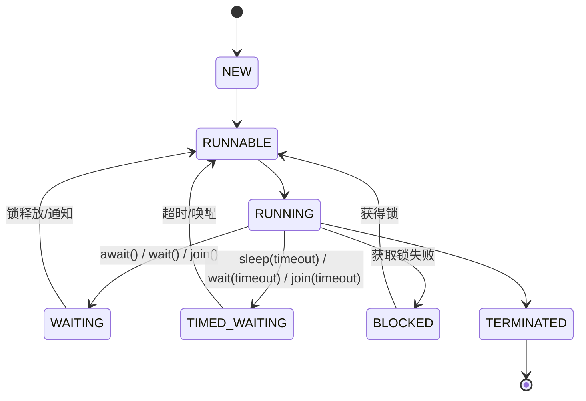

## 前置知识

- [Java 新特性与生态](/java/049-JavaNewFeaturesEcosystem)：建议先完成前一篇的学习

## 学习目标

- 掌握「0. 本节阅读指引（先读这一节）」的核心机制、典型用法与常见陷阱
- 掌握「1. 线程概念 (Threads)」的核心机制、典型用法与常见陷阱
- 掌握「2. 线程创建方式 (Creation)」的核心机制、典型用法与常见陷阱
- 掌握「3. 线程生命周期 (Lifecycle)」的核心机制、典型用法与常见陷阱
- 掌握「4. 线程同步 (Synchronization)」的核心机制、典型用法与常见陷阱


## 0. 本节阅读指引（先读这一节）

本篇是「多线程基础」。

零基础第一遍只读：

1. 第 1 节 线程概念、2. 线程创建方式、3. 线程生命周期；
2. 第 4 节 线程同步、5. 线程池，每段代码亲手敲一遍。

可跳过：6-12 节（并发工具类、线程安全集合、线程间通信、案例、安全问题、最佳实践、陷阱）第二遍细读。

> 记住：多线程是为了并发利用 CPU；共享可变数据必须同步。


## 1. 线程概念 (Threads)

### 1.1 进程与线程

- **进程**: 操作系统分配资源的最小单位，拥有独立的内存空间
- **线程**: 进程内部的执行流，共享进程的内存空间，是 CPU 调度的最小单位
- **多线程的优势**: 提高程序响应速度，充分利用 CPU 资源，简化程序结构

### 1.2 Java 中的线程

- **Thread 类**: 表示线程的类
- **Runnable 接口**: 定义线程执行体的接口
- **Callable 接口**: 可以返回结果和抛出异常的接口

## 2. 线程创建方式 (Creation)

### 2.1 继承 Thread 类

```java
 class MyThread extends Thread {
  @Override
  public void run() {
  for (int i = 0; i < 10; i++) {
  System.out.println(Thread.currentThread().getName() + ": " + i);
  try {
  Thread.sleep(100);
  } catch (InterruptedException e) {
  e.printStackTrace();
  }
  }
  }
 }
 // 使用
 MyThread thread1 = new MyThread();
 MyThread thread2 = new MyThread();
 thread1.start();
 thread2.start();
```

### 2.2 实现 Runnable 接口

```java
 class MyRunnable implements Runnable {
  @Override
  public void run() {
  for (int i = 0; i < 10; i++) {
  System.out.println(Thread.currentThread().getName() + ": " + i);
  try {
  Thread.sleep(100);
  } catch (InterruptedException e) {
  e.printStackTrace();
  }
  }
  }
 }
 // 使用
 Runnable runnable = new MyRunnable();
 Thread thread1 = new Thread(runnable, "Thread-1");
 Thread thread2 = new Thread(runnable, "Thread-2");
 thread1.start();
 thread2.start();
```

### 2.3 实现 Callable 接口

```java
 class MyCallable implements Callable<Integer> {
  @Override
  public Integer call() throws Exception {
  int sum = 0;
  for (int i = 1; i <= 100; i++) {
  sum += i;
  }
  return sum;
  }
 }
 // 使用
 Callable<Integer> callable = new MyCallable();
 FutureTask<Integer> futureTask = new FutureTask<>(callable);
 Thread thread = new Thread(futureTask);
 thread.start();
 try {
  // 获取结果
  Integer result = futureTask.get();
  System.out.println("Sum: " + result);
 }
  e.printStackTrace();
 }
```

### 2.4 使用 Lambda 表达式

```java
 // 使用 Lambda 表达式创建线程
 Thread thread1 = new Thread(() -> {
  for (int i = 0; i < 10; i++) {
  System.out.println(Thread.currentThread().getName() + ": " + i);
  try {
  Thread.sleep(100);
  } catch (InterruptedException e) {
  e.printStackTrace();
  }
  }
 }
 thread1.start();
```

## 3. 线程生命周期 (Lifecycle)

### 3.1 线程状态

Java 线程有 6 种状态，定义在 `Thread.State` 枚举中：

1. **新建 (NEW)**: 线程被创建但尚未启动
2. **可运行 (RUNNABLE)**: 线程正在 JVM 中运行或等待 CPU 执行权
3. **阻塞 (BLOCKED)**: 线程等待获取锁
4. **等待 (WAITING)**: 线程无限期等待其他线程的通知
5. **超时等待 (TIMED_WAITING)**: 线程在指定时间内等待
6. **终止 (TERMINATED)**: 线程执行完成

### 3.2 状态转换图



### 3.3 状态转换方法

- **NEW → RUNNABLE**: `start()`
- **RUNNABLE → BLOCKED**: 获取锁失败
- **RUNNABLE → WAITING**: `wait()`, `join()`, `LockSupport.park()`
- **RUNNABLE → TIMED_WAITING**: `sleep(time)`, `wait(time)`, `join(time)`, `LockSupport.parkNanos()`, `LockSupport.parkUntil()`
- **BLOCKED → RUNNABLE**: 获取锁成功
- **WAITING → RUNNABLE**: 被其他线程唤醒
- **TIMED_WAITING → RUNNABLE**: 超时或被其他线程唤醒
- **RUNNABLE → TERMINATED**: `run()` 方法执行完成

## 4. 线程同步 (Synchronization)

### 4.1 线程安全问题

- **并发访问共享资源**时可能导致的数据不一致问题
- **示例**: 多线程同时操作同一个计数器

### 4.2 synchronized 关键字

#### 4.2.1 同步方法

```java
 public synchronized void increment() {
  count++;
 }
```

#### 4.2.2 同步代码块

```java
 synchronized (this) {
  count++;
 }
```

#### 4.2.3 静态同步方法

```java
 public static synchronized void increment() {
  staticCount++;
 }
```

### 4.3 volatile 关键字

- **保证可见性**: 一个线程对变量的修改对其他线程立即可见
- **保证有序性**: 禁止指令重排序
- **不保证原子性**: 适合于状态标记或双重检查锁定

```java
 private volatile boolean flag = false;
 public void setFlag(boolean flag) {
  this.flag = flag; // 对其他线程可见
 }
 public boolean getFlag() {
  return flag; // 读取最新值
 }
```

### 4.4 Lock 接口

#### 4.4.1 ReentrantLock

```java
 private final Lock lock = new ReentrantLock();
 public void increment() {
  lock.lock();
  try {
  count++;
  } finally {
  lock.unlock(); // 必须在 finally 中释放锁
  }
 }
```

#### 4.4.2 ReentrantReadWriteLock

- **读锁**: 多个线程可以同时获取
- **写锁**: 只能有一个线程获取

```java
 private final ReadWriteLock rwLock = new ReentrantReadWriteLock();
 private final Lock readLock = rwLock.readLock();
 private final Lock writeLock = rwLock.writeLock();
 public void read() {
  readLock.lock();
  try {
  // 读取操作
  } finally {
  readLock.unlock();
  }
 }
 public void write() {
  writeLock.lock();
  try {
  // 写入操作
  } finally {
  writeLock.unlock();
  }
 }
```

### 4.5 原子类

- **java.util.concurrent.atomic 包**提供的原子操作类
- **保证原子性**，无需使用锁

```java
 private AtomicInteger count = new AtomicInteger(0);
 public void increment() {
  count.incrementAndGet(); // 原子操作
 }
 public int getCount() {
  return count.get();
 }
```

## 5. 线程池 (Thread Pools)

### 5.1 线程池的优势

- **减少线程创建和销毁的开销**
- **控制最大并发数**，避免资源耗尽
- **提高线程的可管理性**
- **提供任务队列**，实现任务的缓冲

### 5.2 Executor 框架

- **Executor**: 执行任务的接口
- **ExecutorService**: 扩展了 Executor，提供了生命周期管理
- **ScheduledExecutorService**: 支持定时和周期性任务

### 5.3 线程池的创建

#### 5.3.1 使用 Executors 工厂方法

- **newFixedThreadPool(int nThreads)**: 创建固定大小的线程池
- **newCachedThreadPool()**: 创建可缓存的线程池
- **newSingleThreadExecutor()**: 创建单线程的线程池
- **newScheduledThreadPool(int corePoolSize)**: 创建支持定时和周期性任务的线程池

```java
 // 创建固定大小的线程池
 ExecutorService executorService = Executors.newFixedThreadPool(5);
 // 提交任务
 for (int i = 0; i < 10; i++) {
  final int taskId = i;
  executorService.submit(() -> {
  System.out.println("Task " + taskId + " executed by " + Thread.currentThread().getName());
  try {
  Thread.sleep(1000);
  } catch (InterruptedException e) {
  e.printStackTrace();
  }
  });
 }
 // 关闭线程池
 executorService.shutdown();
```

#### 5.3.2 自定义线程池

使用 `ThreadPoolExecutor` 构造函数自定义线程池参数。

```java
 ThreadPoolExecutor executor = new ThreadPoolExecutor(
  5, // 核心线程数
  10, // 最大线程数
  60L, // 空闲线程存活时间
  TimeUnit.SECONDS, // 时间单位
  new LinkedBlockingQueue<>(100), // 工作队列
  Executors.defaultThreadFactory(), // 线程工厂
  new ThreadPoolExecutor.AbortPolicy() // 拒绝策略
 )
```

### 5.4 线程池的参数

- **corePoolSize**: 核心线程数
- **maximumPoolSize**: 最大线程数
- **keepAliveTime**: 空闲线程存活时间
- **unit**: 时间单位
- **workQueue**: 工作队列
- **threadFactory**: 线程工厂
- **handler**: 拒绝策略

### 5.5 拒绝策略

- **AbortPolicy**: 直接抛出异常
- **CallerRunsPolicy**: 由调用线程执行任务
- **DiscardPolicy**: 丢弃任务
- **DiscardOldestPolicy**: 丢弃最旧的任务

## 6. 并发工具类

### 6.1 CountDownLatch

- **倒计时门闩**，等待一组线程完成

```java
 CountDownLatch latch = new CountDownLatch(3);
 for (int i = 0; i < 3; i++) {
  new Thread(() -> {
  System.out.println(Thread.currentThread().getName() + " is working");
  try {
  Thread.sleep(1000);
  } catch (InterruptedException e) {
  e.printStackTrace();
  }
  latch.countDown(); // 倒计时减1
  System.out.println(Thread.currentThread().getName() + " finished");
  }).start();
 }
 System.out.println("Waiting for all threads to finish...");
 latch.await(); // 等待倒计时为0
 System.out.println("All threads have finished");
```

### 6.2 CyclicBarrier

- **循环栅栏**，等待一组线程达到屏障

```java
 CyclicBarrier barrier = new CyclicBarrier(3, () -> {
  System.out.println("All threads have reached the barrier");
 }
 for (int i = 0; i < 3; i++) {
  new Thread(() -> {
  System.out.println(Thread.currentThread().getName() + " is working");
  try {
  Thread.sleep(1000);
  System.out.println(Thread.currentThread().getName() + " is waiting at the barrier");
  barrier.await(); // 等待其他线程
  System.out.println(Thread.currentThread().getName() + " continues");
  } catch (Exception e) {
  e.printStackTrace();
  }
  }).start();
 }
```

### 6.3 Semaphore

- **信号量**，控制同时访问资源的线程数

```java
 Semaphore semaphore = new Semaphore(2); // 最多2个线程同时访问
 for (int i = 0; i < 5; i++) {
  new Thread(() -> {
  try {
  semaphore.acquire(); // 获取许可
  System.out.println(Thread.currentThread().getName() + " acquired the semaphore");
  Thread.sleep(2000);
  } catch (InterruptedException e) {
  e.printStackTrace();
  } finally {
  semaphore.release(); // 释放许可
  System.out.println(Thread.currentThread().getName() + " released the semaphore");
  }
  }).start();
 }
```

### 6.4 Future 和 CompletableFuture

- **Future**: 表示异步计算的结果
- **CompletableFuture**: 提供了更丰富的异步操作 API

```java
 // 使用 CompletableFuture
 CompletableFuture.supplyAsync(() -> {
  System.out.println("Task executed in thread: " + Thread.currentThread().getName());
  try {
  Thread.sleep(1000);
  } catch (InterruptedException e) {
  e.printStackTrace();
  }
  return "Hello, CompletableFuture!";
 }
  System.out.println("Result: " + result);
 }
  ex.printStackTrace();
  return "Error occurred";
 }
 System.out.println("Main thread continues");
 // 等待异步任务完成
 try {
  Thread.sleep(2000);
 }
  e.printStackTrace();
 }
```

## 7. 线程安全集合

### 7.1 并发集合

- **ConcurrentHashMap**: 线程安全的 HashMap
- **CopyOnWriteArrayList**: 读多写少场景的线程安全列表
- **CopyOnWriteArraySet**: 基于 CopyOnWriteArrayList 的线程安全集合
- **ConcurrentLinkedQueue**: 无界线程安全队列
- **BlockingQueue**: 阻塞队列接口，如 ArrayBlockingQueue, LinkedBlockingQueue

### 7.2 同步集合

- 通过 `Collections.synchronizedXXX()` 创建的线程安全集合
- 方法级同步，性能较低

## 8. 线程间通信

### 8.1 wait() 和 notify()/notifyAll()

```java
 class SharedResource {
  private boolean available = false;
  private int data;
  public synchronized void produce(int value) {
  while (available) {
  try {
  wait(); // 等待消费者消费
  } catch (InterruptedException e) {
  e.printStackTrace();
  }
  }
  data = value;
  available = true;
  System.out.println("Produced: " + data);
  notifyAll(); // 通知消费者
  }
  public synchronized int consume() {
  while (!available) {
  try {
  wait(); // 等待生产者生产
  } catch (InterruptedException e) {
  e.printStackTrace();
  }
  }
  available = false;
  System.out.println("Consumed: " + data);
  notifyAll(); // 通知生产者
  return data;
  }
 }
```

### 8.2 Condition

- **更灵活的线程间通信方式**
- **与 Lock 配合使用**

```java
 class BoundedBuffer {
  private final Lock lock = new ReentrantLock();
  private final Condition notFull = lock.newCondition();
  private final Condition notEmpty = lock.newCondition();
  private final Object[] buffer;
  private int count, putIndex, takeIndex;
  public BoundedBuffer(int size) {
  buffer = new Object[size];
  }
  public void put(Object item) throws InterruptedException {
  lock.lock();
  try {
  while (count == buffer.length) {
  notFull.await(); // 缓冲区满，等待
  }
  buffer[putIndex] = item;
  if (++putIndex == buffer.length) putIndex = 0;
  count++;
  notEmpty.signal(); // 通知消费者
  } finally {
  lock.unlock();
  }
  }
  public Object take() throws InterruptedException {
  lock.lock();
  try {
  while (count == 0) {
  notEmpty.await(); // 缓冲区空，等待
  }
  Object item = buffer[takeIndex];
  if (++takeIndex == buffer.length) takeIndex = 0;
  count--;
  notFull.signal(); // 通知生产者
  return item;
  } finally {
  lock.unlock();
  }
  }
 }
```

## 9. 实际应用案例

### 9.1 生产者-消费者模式

```java
 public class ProducerConsumerExample {
  public static void main(String[] args) {
  BlockingQueue<Integer> queue = new ArrayBlockingQueue<>(10);
  // 生产者线程
  Runnable producer = () -> {
  try {
  for (int i = 0; i < 20; i++) {
  queue.put(i);
  System.out.println("Produced: " + i);
  Thread.sleep(100);
  }
  } catch (InterruptedException e) {
  e.printStackTrace();
  }
  };
  // 消费者线程
  Runnable consumer = () -> {
  try {
  for (int i = 0; i < 20; i++) {
  int value = queue.take();
  System.out.println("Consumed: " + value);
  Thread.sleep(200);
  }
  } catch (InterruptedException e) {
  e.printStackTrace();
  }
  };
  new Thread(producer).start();
  new Thread(consumer).start();
  }
 }
```

### 9.2 线程池的使用

```java
 public class ThreadPoolExample {
  public static void main(String[] args) {
  // 创建线程池
  ExecutorService executorService = Executors.newFixedThreadPool(5);
  // 提交任务
  List<Future<Integer>> futures = new ArrayList<>();
  for (int i = 0; i < 10; i++) {
  final int taskId = i;
  Future<Integer> future = executorService.submit(() -> {
  System.out.println("Task " + taskId + " started");
  Thread.sleep(1000);
  System.out.println("Task " + taskId + " completed");
  return taskId * 10;
  });
  futures.add(future);
  }
  // 获取结果
  for (int i = 0; i < futures.size(); i++) {
  try {
  Integer result = futures.get(i).get();
  System.out.println("Result of task " + i + ": " + result);
  } catch (Exception e) {
  e.printStackTrace();
  }
  }
  // 关闭线程池
  executorService.shutdown();
  }
 }
```

### 9.3 并行计算

```java
 public class ParallelComputationExample {
  public static void main(String[] args) {
  int[] numbers = new int[1000000];
  for (int i = 0; i < numbers.length; i++) {
  numbers[i] = i + 1;
  }
  // 并行计算总和
  long startTime = System.currentTimeMillis();
  int sum = Arrays.stream(numbers).parallel().sum();
  long endTime = System.currentTimeMillis();
  System.out.println("Sum: " + sum);
  System.out.println("Time taken: " + (endTime - startTime) + " ms");
  }
 }
```

## 10. 线程安全问题

### 10.1 常见的线程安全问题

- **竞态条件**: 多个线程同时访问共享资源导致数据不一致
- **死锁**: 两个或多个线程互相等待对方释放资源
- **活锁**: 线程不断尝试但始终无法获得资源
- **饥饿**: 某些线程长期无法获得 CPU 执行权

### 10.2 死锁示例

```java
 class DeadlockExample {
  private static final Object lock1 = new Object();
  private static final Object lock2 = new Object();
  public static void main(String[] args) {
  // 线程1: 先获取 lock1，再获取 lock2
  new Thread(() -> {
  synchronized (lock1) {
  System.out.println("Thread 1 acquired lock1");
  try {
  Thread.sleep(100);
  } catch (InterruptedException e) {
  e.printStackTrace();
  }
  synchronized (lock2) {
  System.out.println("Thread 1 acquired lock2");
  }
  }
  }).start();
  // 线程2: 先获取 lock2，再获取 lock1
  new Thread(() -> {
  synchronized (lock2) {
  System.out.println("Thread 2 acquired lock2");
  try {
  Thread.sleep(100);
  } catch (InterruptedException e) {
  e.printStackTrace();
  }
  synchronized (lock1) {
  System.out.println("Thread 2 acquired lock1");
  }
  }
  }).start();
  }
 }
```

### 10.3 避免死锁的方法

- **按顺序获取锁**
- **使用定时锁** (`tryLock()`)
- **使用 Lock 替代 synchronized**
- **减少锁的范围**
- **使用无锁数据结构**

## 11. 最佳实践

### 11.1 线程创建与管理

- **优先使用线程池**而非直接创建线程
- **合理设置线程池参数**
- **使用 ExecutorService 管理线程生命周期**
- **避免创建过多线程**

### 11.2 线程同步

- **优先使用 synchronized** 关键字，简单易用
- **复杂场景使用 Lock** 接口
- **使用原子类**处理简单的原子操作
- **最小化同步范围**
- **避免在同步块中执行耗时操作**

### 11.3 线程安全

- **使用线程安全的集合**
- **避免共享可变状态**
- **使用不可变对象**
- **合理使用 volatile**
- **考虑使用并发工具类**

### 11.4 性能优化

- **减少线程上下文切换**
- **避免线程阻塞**
- **使用适当的并发级别**
- **考虑使用无锁算法**
- **合理使用缓存**

## 12. 常见陷阱

### 12.1 线程启动错误

- **调用 run() 而不是 start()**
- **多次调用 start()**

### 12.2 线程安全陷阱

- **忘记释放锁**
- **死锁**
- **过度同步**
- **不正确的 volatile 使用**

### 12.3 线程池陷阱

- **线程池参数设置不合理**
- **忘记关闭线程池**
- **任务队列过大**
- **拒绝策略选择不当**

### 12.4 内存可见性问题

- **共享变量未使用 volatile**
- **非线程安全的单例模式**

---

## 创建线程

**基本写法：继承 Thread**
`class <类> extends Thread { public void run() {} }`
```java
// 继承 Thread 创建线程
class MyThread extends Thread {
    public void run() { System.out.println("running"); }
}
new MyThread().start();
```

---

**基本写法：实现 Runnable**
`new Thread(<Runnable>).start();`
```java
// 实现 Runnable 接口
new Thread(() -> System.out.println("running")).start();
```

---

**基本写法：实现 Callable**
`class <类> implements Callable<<类型>> { public <类型> call() {} }`
```java
// 带返回值的任务
Callable<Integer> task = () -> 42;
Future<Integer> f = Executors.newSingleThreadExecutor().submit(task);
```

---

## 线程基本操作

**基本写法：启动线程**
`<thread>.start();`
```java
// 启动线程执行 run
thread.start();
```

---

**基本写法：等待线程结束**
`<thread>.join();`
```java
// 阻塞当前线程直到目标结束
thread.join();
```

---

**基本写法：超时等待**
`<thread>.join(<毫秒>);`
```java
// 最多等待 1000 毫秒
thread.join(1000);
```

---

**基本写法：休眠**
`Thread.sleep(<毫秒>);`
```java
// 当前线程休眠 500 毫秒
Thread.sleep(500);
```

---

**基本写法：让出 CPU**
`Thread.yield();`
```java
// 提示调度器让出 CPU
Thread.yield();
```

---

## 线程状态

**基本写法：获取状态**
`<thread>.getState();`
```java
// 获取线程状态枚举
Thread.State s = thread.getState();
```

---

**基本写法：判断存活**
`<thread>.isAlive();`
```java
// 判断线程是否存活
boolean alive = thread.isAlive();
```

---

**基本写法：判断中断**
`<thread>.isInterrupted();`
```java
// 判断线程是否被中断
boolean i = thread.isInterrupted();
```

---

## 中断机制

**基本写法：请求中断**
`<thread>.interrupt();`
```java
// 设置线程中断标志
thread.interrupt();
```

---

**基本写法：检测中断并清除标志**
`Thread.interrupted();`
```java
// 静态方法检测并清除当前线程中断
boolean i = Thread.interrupted();
```

---

**基本写法：响应中断**
`if (Thread.currentThread().isInterrupted()) break;`
```java
// 循环中检测中断
while (!Thread.currentThread().isInterrupted()) {
    doWork();
}
```

---

## synchronized 同步

**基本写法：同步方法**
`public synchronized <返回> <方法>() {}`
```java
// 整个方法同步
public synchronized void inc() { count++; }
```

---

**基本写法：同步代码块**
`synchronized (<对象>) { }`
```java
// 同步代码块减少锁范围
synchronized (this) { count++; }
```

---

**基本写法：同步静态方法**
`public static synchronized <返回> <方法>() {}`
```java
// 静态方法锁 Class 对象
public static synchronized void inc() { total++; }
```

---

**基本写法：同步任意锁对象**
`private final Object <锁> = new Object();`
```java
// 使用私有锁对象
private final Object lock = new Object();
synchronized (lock) { count++; }
```

---

## volatile 关键字

**基本写法：声明 volatile 字段**
`private volatile <类型> <字段>;`
```java
// 保证可见性但不保证原子性
private volatile boolean running = true;
```

---

## wait / notify

**基本写法：等待**
`<对象>.wait();`
```java
// 释放锁并等待通知
synchronized (lock) {
    while (!ready) lock.wait();
}
```

---

**基本写法：通知一个**
`<对象>.notify();`
```java
// 唤醒一个等待线程
synchronized (lock) {
    ready = true;
    lock.notify();
}
```

---

**基本写法：通知所有**
`<对象>.notifyAll();`
```java
// 唤醒所有等待线程
synchronized (lock) {
    lock.notifyAll();
}
```

---

**基本写法：超时等待**
`<对象>.wait(<毫秒>);`
```java
// 最多等待 1000 毫秒
lock.wait(1000);
```

---

## 线程优先级

**基本写法：设置优先级**
`<thread>.setPriority(<级别>);`
```java
// 设置线程优先级 1-10
thread.setPriority(Thread.MAX_PRIORITY);
```

---

**基本写法：守护线程**
`<thread>.setDaemon(true);`
```java
// 设置为守护线程（主线程退出即结束）
thread.setDaemon(true);
thread.start();
```

---

## 线程异常处理

**基本写法：设置未捕获异常处理器**
`<thread>.setUncaughtExceptionHandler(<处理器>);`
```java
// 设置线程异常处理器
thread.setUncaughtExceptionHandler((t, e) -> {
    System.out.println(t.getName() + " " + e);
});
```

---

**基本写法：全局默认处理器**
`Thread.setDefaultUncaughtExceptionHandler(<处理器>);`
```java
// 设置全局默认异常处理器
Thread.setDefaultUncaughtExceptionHandler((t, e) -> log.error(e));
```

---

## 线程工厂

**基本写法：自定义线程工厂**
`new ThreadFactory() { public Thread newThread(Runnable r) {} }`
```java
// 自定义线程创建
ThreadFactory factory = r -> {
    Thread t = new Thread(r);
    t.setName("worker-" + t.getId());
    t.setDaemon(true);
    return t;
};
```

---

## 线程局部变量（简化版）

**基本写法：使用 ThreadLocal**
`ThreadLocal.<类型>withInitial(() -> <值>);`
```java
// 线程私有计数器
ThreadLocal<Integer> tl = ThreadLocal.withInitial(() -> 0);
```

---

## Thread 类静态方法

**基本写法：获取当前线程**
`Thread.currentThread();`
```java
// 获取当前执行线程
Thread t = Thread.currentThread();
```

---

**基本写法：获取所有栈帧**
`Thread.getAllStackTraces();`
```java
// 获取所有活动线程的栈帧
Map<Thread, StackTraceElement[]> m = Thread.getAllStackTraces();
```

---

**基本写法：onSpinWait 提示**
`Thread.onSpinWait();`
```java
// Java 9+ 自旋等待提示优化
while (!ready) Thread.onSpinWait();
```
