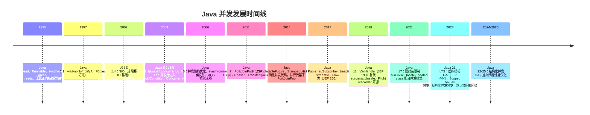
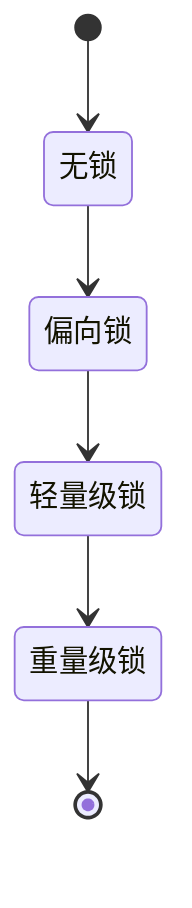
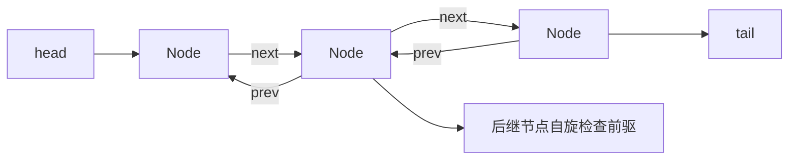
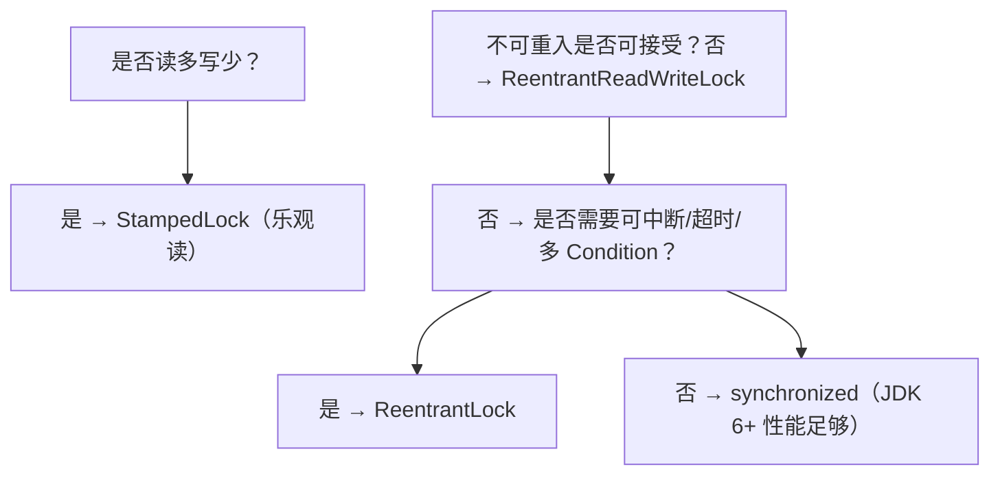

## 前置知识

- [JUC 并发包](/java/052-JUCConcurrency)：建议先完成前一篇的学习

## 学习目标

- 掌握「0. 本节阅读指引（先读这一节）」的核心机制、典型用法与常见陷阱
- 掌握「1. 历史动机与发展脉络」的核心机制、典型用法与常见陷阱
- 掌握「2. 形式化定义与规范基础」的核心机制、典型用法与常见陷阱
- 掌握「3. 理论推导与原理解析」的核心机制、典型用法与常见陷阱
- 掌握「4. synchronized 与锁升级」的核心机制、典型用法与常见陷阱


## 0. 本节阅读指引（先读这一节）

本篇是「并发编程详解」进阶文档。

第一遍只读：4. synchronized 与锁升级、5. Lock 接口与 AQS、6. 原子类与 CAS、7. 线程池工程实践；8-9 节（CompletableFuture、虚拟线程）了解结论。

可跳过：1-3 节（历史、形式化、理论推导）与 10-13 节第二遍细读。

前置：047 多线程基础、043 并发编程基础。


## 1. 历史动机与发展脉络

### 1.1 Java 并发演进时间线



### 1.2 三大设计哲学

Java 并发的演进反映三种哲学的交替：

1. **共享可变 + 锁（1995—2004）**：synchronized + wait/notify，开发简单但易出错。
2. **高层抽象 + 工具（2004—2014）**：j.u.c. 提供 Executor、Lock、Atomic、ConcurrentHashMap，避免直接操作锁。
3. **异步 + 轻量并发（2014—至今）**：CompletableFuture、虚拟线程，回归"同步代码风格 + 异步执行"。

### 1.3 Doug Lea 与 JSR 166

`java.util.concurrent` 的设计源于 Doug Lea 的 `util.concurrent` 库（1998—2003）。2003 年 JSR 166 将其纳入 JDK 1.5，后续由 JSR 166y、166z 持续扩展。Doug Lea 的设计哲学是"提供比 synchronized 更细粒度、更高性能的并发原语"，其核心贡献包括：

- **AQS（AbstractQueuedSynchronizer）**：所有 Lock、Semaphore、CountDownLatch 的基础
- **ConcurrentHashMap**：分段锁 → CAS + synchronized
- **ForkJoinPool**：work-stealing 调度
- **Flow API**：Reactive Streams 标准化

---

## 2. 形式化定义与规范基础

### 2.1 JLS §17：Java 内存模型（JMM）

JLS §17 定义了 Java 内存模型，规定了线程间共享变量的可见性、有序性与原子性规则。JMM 的形式化由 Manson、Pugh、Adve 在 2005 年的论文《The Java Memory Model》中给出。

### 2.2 共享变量的形式化模型

设 $V$ 为共享变量集合，$T$ 为线程集合，$A$ 为所有内存操作的序列。每个操作 $a \in A$ 形式化为：

$$
a = (\text{thread}(a), \text{var}(a), \text{kind}(a) \in \{\text{read}, \text{write}\}, \text{value}(a), \text{order}(a))
$$

JMM 通过 **happens-before** 偏序关系 $\xrightarrow{hb}$ 定义合法执行：

$$
\text{Legal}(A) \iff \forall \text{read } r \in A: \text{value}(r) = \text{value}(w_r)
$$

其中 $w_r$ 是 $r$ 可见的写操作，满足 $w_r \xrightarrow{hb} r$ 且不存在中间写。

### 2.3 happens-before 八条规则

JLS §17.4.5 定义的 happens-before 规则：

1. **程序次序规则**：同一线程中，按代码顺序 $a$ 先于 $b$，则 $a \xrightarrow{hb} b$
2. **监视器锁规则**：unlock 操作 $\xrightarrow{hb}$ 同一锁的后续 lock
3. **volatile 规则**：volatile 写 $\xrightarrow{hb}$ 同一变量的后续读
4. **线程启动规则**：`Thread.start()` $\xrightarrow{hb}$ 线程内任意操作
5. **线程终止规则**：线程内任意操作 $\xrightarrow{hb}$ `Thread.join()` 返回
6. **中断规则**：`Thread.interrupt()` $\xrightarrow{hb}$ 被中断线程检测到中断
7. **对象终结规则**：构造函数结束 $\xrightarrow{hb}$ finalizer 开始
8. **传递性**：$a \xrightarrow{hb} b \wedge b \xrightarrow{hb} c \Rightarrow a \xrightarrow{hb} c$

### 2.4 CAS 的形式化定义

Compare-And-Swap 是无锁同步的基础，形式化为：

$$
\text{CAS}(\text{addr}, \text{expected}, \text{new}) = \begin{cases}
\text{true} & \text{if } \text{mem}[\text{addr}] = \text{expected} \text{ and } \text{mem}[\text{addr}] \leftarrow \text{new} \\
\text{false} & \text{otherwise}
\end{cases}
$$

CAS 必须由硬件提供原子保证，x86 上对应 `lock cmpxchg` 指令，ARM 上对应 `ldaxr+stlxr` 独占加载存储对。

### 2.5 线程池的形式化模型

线程池可形式化为五元组：

$$
\text{ThreadPool} = (N_{\text{core}}, N_{\text{max}}, Q, T_{\text{keepAlive}}, R)
$$

- $N_{\text{core}}$：核心线程数（预热后保持的最小线程数）
- $N_{\text{max}}$：最大线程数
- $Q$：阻塞队列（有界或无界）
- $T_{\text{keepAlive}}$：非核心线程空闲存活时间
- $R$：拒绝策略（CallerRuns / Abort / Discard / DiscardOldest）

任务提交流程形式化：

```
submit(task):
  if 当前线程数 < N_core:
    创建新线程执行 task
  else if Q.offer(task) 成功:
    入队等待
  else if 当前线程数 < N_max:
    创建新线程执行 task
  else:
    执行拒绝策略 R(task)
```

---

## 3. 理论推导与原理解析

### 3.1 对象头与 Mark Word

HotSpot 对象头（Object Header）由三部分构成：


Mark Word 在不同锁状态下的位布局（64 位 JVM）：

```mermaid
flowchart TD
    MW[Mark Word（64 bits）]
    MW --> U[无锁：hash(25) / age(4) / 0 / 01]
    MW --> B[偏向锁：thread(54) / epoch(2) / 1 / 01]
    MW --> L[轻量锁：ptr_to_lock_record(62) / 00]
    MW --> H[重量锁：ptr_to_heavy_monitor(62) / 10]
    MW --> G[GC 标记：- / 11]
```

### 3.2 锁升级过程

synchronized 锁状态按竞争程度单调升级（不可降级，但偏向锁可被批量撤销）：



#### 3.2.1 偏向锁（Biased Locking）

- **触发**：首次进入同步块时，CAS 将线程 ID 写入 Mark Word
- **重入**：同一线程再次进入时，仅比对 thread ID，无需 CAS
- **撤销**：出现第二个线程竞争时，等待全局安全点撤销偏向，升级为轻量锁
- **JDK 15+ 弃用**：JEP 374 标记为废弃，JDK 18+ 默认禁用

> **设计原因**：早期 HotSpot 实测，90% 的 synchronized 块由同一线程进入，偏向锁可消除无竞争场景下的 CAS 开销。但现代应用多线程访问更普遍，偏向锁的撤销成本（STW）反而成为负担。

#### 3.2.2 轻量级锁

- **加锁**：在线程栈分配 Lock Record，CAS 将对象头指向 Lock Record
- **重入**：Lock Record 计数 +1
- **解锁**：CAS 恢复对象头，若失败说明有竞争，升级为重量锁
- **适用**：两个线程交替进入，无真并发

#### 3.2.3 重量级锁

- **加锁**：通过 `ObjectMonitor`（基于 AQS 思想）维护 entry list、wait set
- **阻塞**：调用 `pthread_mutex_lock` 进入内核态
- **唤醒**：`pthread_cond_signal` 唤醒一个等待线程
- **适用**：多线程真并发竞争

### 3.3 AQS 原理深度解析

AbstractQueuedSynchronizer 是 j.u.c. 的基石，其核心：

```java
public abstract class AbstractQueuedSynchronizer
    extends AbstractOwnableSynchronizer {

    // 同步状态，volatile 保证可见性
    private volatile int state;

    // CLH 等待队列（FIFO）
    private transient volatile Node head;
    private transient volatile Node tail;
}
```

#### 3.3.1 state 的语义

不同同步器赋予 state 不同语义：

| 同步器 | state 语义 |
| ------ | ---------- |
| ReentrantLock | 0=未锁定，>0=重入次数 |
| ReentrantReadWriteLock | 高 16 位=读锁数，低 16 位=写锁数 |
| Semaphore | 剩余许可数 |
| CountDownLatch | 剩余计数 |
| CyclicBarrier（内部 Generation） | 不可重用，依赖 lock + condition |

#### 3.3.2 CLH 队列

AQS 使用 CLH（Craig, Landin, Hagersten）队列变种：



每个 Node 维护一个 waitStatus：

- `SIGNAL (-1)`：后继需要被唤醒
- `CANCELLED (1)`：节点已取消
- `CONDITION (-2)`：在 Condition 等待队列
- `PROPAGATE (-3)`：共享模式下传播唤醒

#### 3.3.3 独占模式获取锁流程

```java
// 简化版 AQS 独占获取
public final void acquire(int arg) {
    if (!tryAcquire(arg) &&
        acquireQueued(addWaiter(Node.EXCLUSIVE), arg))
        selfInterrupt();
}

final boolean acquireQueued(Node node, int arg) {
    boolean failed = true;
    try {
        boolean interrupted = false;
        for (;;) {
            final Node p = node.predecessor();
            // 前驱是 head 且获取成功
            if (p == head && tryAcquire(arg)) {
                setHead(node);
                p.next = null;
                failed = false;
                return interrupted;
            }
            // 应该 park 吗？检查前驱 waitStatus
            if (shouldParkAfterFailedAcquire(p, node) &&
                parkAndCheckInterrupt())
                interrupted = true;
        }
    } finally {
        if (failed) cancelAcquire(node);
    }
}
```

#### 3.3.4 公平与非公平

- **公平锁**：`tryAcquire` 前先检查 `hasQueuedPredecessors()`
- **非公平锁**：直接 CAS 尝试，允许"插队"
- **性能差异**：非公平吞吐高 5—20%，但可能导致队列饥饿

### 3.4 CAS 与 ABA 问题

#### 3.4.1 ABA 问题

CAS 仅比对值，无法识别"A→B→A"的中间变化：

```java
// 初始值 A
AtomicReference<String> ref = new AtomicReference<>("A");

// 线程 1：读 A
String v1 = ref.get();

// 线程 2：A → B → A
ref.set("B");
ref.set("A");

// 线程 1：CAS(A, C) 成功！但其实值已被改过
ref.compareAndSet(v1, "C");
```

#### 3.4.2 解决方案

- **AtomicStampedReference**：附加版本号
- **AtomicMarkableReference**：附加 boolean 标记

```java
AtomicStampedReference<String> ref =
    new AtomicStampedReference<>("A", 0);

int[] stamp = new int[1];
String v1 = ref.get(stamp);  // v1="A", stamp[0]=0

ref.set("B", 1);
ref.set("A", 2);

// CAS 失败，stamp 不匹配
ref.compareAndSet(v1, "C", stamp[0], 3);  // false
```

### 3.5 内存屏障与 volatile

volatile 通过内存屏障实现可见性与有序性：

| 屏障类型 | 指令 | 作用 |
| -------- | ---- | ---- |
| LoadLoad | `lfence`（x86） | Load1; LoadLoad; Load2 → Load1 必须先完成 |
| StoreStore | `sfence` | Store1; StoreStore; Store2 → Store1 必须先刷新 |
| LoadStore | - | Load1; LoadStore; Store2 → Load1 必须先完成 |
| StoreLoad | `mfence` | Store1; StoreLoad; Load2 → 全局排序，开销最大 |

HotSpot 对 volatile 写插入 `StoreStore + StoreLoad`，对 volatile 读插入 `LoadLoad + LoadStore`。

> **x86 特例**：x86 是强内存模型，仅 volatile 写需要 `lock addl` 作为 StoreLoad 屏障。ARM 是弱内存模型，所有四种屏障都需显式指令。

---

## 4. synchronized 与锁升级

### 4.1 synchronized 三种用法

```java
public class SyncExample {
    private final Object lock = new Object();
    private int count = 0;

    // 1. 修饰实例方法：锁当前对象 this
    public synchronized void instanceMethod() {
        count++;
    }

    // 2. 修饰静态方法：锁 Class 对象
    public static synchronized void staticMethod() {
        // 类级别互斥
    }

    // 3. 修饰代码块：锁指定对象
    public void blockMethod() {
        synchronized (lock) {
            count++;
        }
    }
}
```

### 4.2 字节码层面

```java
public void blockMethod();
    Code:
       0: aload_0
       1: getfield      #2  // Field lock
       4: dup
       5: astore_1
       6: monitorenter            // ← 进入监视器
       7: aload_0
       8: dup
       9: getfield      #3  // Field count
      12: iconst_1
      13: iadd
      14: putfield      #3
      17: aload_1
      18: monitorexit             // ← 正常退出监视器
      19: goto          27
      22: astore_2
      23: aload_1
      24: monitorexit             // ← 异常退出监视器
      25: aload_2
      26: athrow
      27: return
    Exception table:
       from   to  target type
           7   19    22   any         // 异常处理：确保 monitorexit
```

### 4.3 synchronized vs ReentrantLock

| 维度 | synchronized | ReentrantLock |
| ---- | ------------ | ------------- |
| **语法** | 关键字，自动释放 | API，需手动 unlock |
| **可中断** | 不可中断 | `lockInterruptibly()` 可中断 |
| **超时** | 不支持 | `tryLock(timeout)` 支持 |
| **公平** | 仅非公平 | 支持公平/非公平 |
| **条件** | 单条件（wait/notify） | 多 Condition |
| **锁升级** | 偏向→轻量→重量 | 直接基于 AQS |
| **性能** | JDK 6+ 接近 ReentrantLock | 略优，但差距小 |
| **可读性** | 简洁 | 需 try-finally |

**选型建议**：

- 简单互斥 → synchronized（JDK 6+ 性能已与 Lock 持平，且无需手动释放）
- 需要可中断、超时、多 Condition、公平 → ReentrantLock
- 读多写少 → ReentrantReadWriteLock 或 StampedLock

### 4.4 wait / notify 机制

```java
public class BoundedBuffer<T> {
    private final Queue<T> queue = new LinkedList<>();
    private final int capacity;
    private final Object lock = new Object();

    public BoundedBuffer(int capacity) {
        this.capacity = capacity;
    }

    public void put(T item) throws InterruptedException {
        synchronized (lock) {
            // 必须用 while，防止虚假唤醒
            while (queue.size() == capacity) {
                lock.wait();
            }
            queue.offer(item);
            lock.notifyAll();  // 唤醒所有等待者
        }
    }

    public T take() throws InterruptedException {
        synchronized (lock) {
            while (queue.isEmpty()) {
                lock.wait();
            }
            T item = queue.poll();
            lock.notifyAll();
            return item;
        }
    }
}
```

> **关键点**：
> 1. `wait()` 会释放锁并阻塞，被唤醒后需重新竞争锁
> 2. 必须在 `synchronized` 块内调用，否则抛 `IllegalMonitorStateException`
> 3. 使用 `while` 而非 `if` 检查条件，防止虚假唤醒（spurious wakeup）

---

## 5. Lock 接口与 AQS

### 5.1 ReentrantLock 基础用法

```java
import java.util.concurrent.locks.ReentrantLock;
import java.util.concurrent.TimeUnit;

public class ReentrantLockExample {
    private final ReentrantLock lock = new ReentrantLock(true); // 公平锁
    private int count = 0;

    public void increment() {
        lock.lock();
        try {
            count++;
        } finally {
            lock.unlock();  // 必须在 finally 释放
        }
    }

    // 可中断获取
    public void interruptibleOp() throws InterruptedException {
        lock.lockInterruptibly();
        try {
            // 业务逻辑
        } finally {
            lock.unlock();
        }
    }

    // 超时获取
    public boolean tryOpWithTimeout() throws InterruptedException {
        if (lock.tryLock(1, TimeUnit.SECONDS)) {
            try {
                // 业务逻辑
                return true;
            } finally {
                lock.unlock();
            }
        }
        return false;  // 超时未获取
    }
}
```

### 5.2 Condition 多条件变量

```java
import java.util.concurrent.locks.Condition;
import java.util.concurrent.locks.ReentrantLock;

public class BoundedBufferWithCondition<T> {
    private final Object[] items;
    private int putIdx, takeIdx, count;
    private final ReentrantLock lock = new ReentrantLock();
    private final Condition notFull = lock.newCondition();
    private final Condition notEmpty = lock.newCondition();

    public BoundedBufferWithCondition(int capacity) {
        items = new Object[capacity];
    }

    @SuppressWarnings("unchecked")
    public T take() throws InterruptedException {
        lock.lock();
        try {
            while (count == 0) {
                notEmpty.await();  // 等待非空
            }
            T item = (T) items[takeIdx];
            items[takeIdx] = null;
            if (++takeIdx == items.length) takeIdx = 0;
            count--;
            notFull.signal();  // 通知非满
            return item;
        } finally {
            lock.unlock();
        }
    }

    public void put(T item) throws InterruptedException {
        lock.lock();
        try {
            while (count == items.length) {
                notFull.await();
            }
            items[putIdx] = item;
            if (++putIdx == items.length) putIdx = 0;
            count++;
            notEmpty.signal();
        } finally {
            lock.unlock();
        }
    }
}
```

### 5.3 ReentrantReadWriteLock

```java
import java.util.concurrent.locks.ReentrantReadWriteLock;

public class ThreadSafeCache<K, V> {
    private final ReentrantReadWriteLock rwLock = new ReentrantReadWriteLock();
    private final ReentrantReadWriteLock.ReadLock readLock = rwLock.readLock();
    private final ReentrantReadWriteLock.WriteLock writeLock = rwLock.writeLock();
    private final java.util.Map<K, V> map = new java.util.HashMap<>();

    public V get(K key) {
        readLock.lock();
        try {
            return map.get(key);
        } finally {
            readLock.unlock();
        }
    }

    public V put(K key, V value) {
        writeLock.lock();
        try {
            return map.put(key, value);
        } finally {
            writeLock.unlock();
        }
    }
}
```

### 5.4 StampedLock（Java 8+）

```java
import java.util.concurrent.locks.StampedLock;

public class Point {
    private final StampedLock sl = new StampedLock();
    private double x, y;

    // 写锁
    public void move(double deltaX, double deltaY) {
        long stamp = sl.writeLock();
        try {
            x += deltaX;
            y += deltaY;
        } finally {
            sl.unlockWrite(stamp);
        }
    }

    // 乐观读：先乐观读，校验失败再升级为悲观读
    public double distanceFromOrigin() {
        long stamp = sl.tryOptimisticRead();  // 乐观读
        double currentX = x, currentY = y;
        if (!sl.validate(stamp)) {             // 校验期间是否发生写
            stamp = sl.readLock();             // 升级为悲观读锁
            try {
                currentX = x;
                currentY = y;
            } finally {
                sl.unlockRead(stamp);
            }
        }
        return Math.sqrt(currentX * currentX + currentY * currentY);
    }
}
```

> **注意**：StampedLock 不可重入，不适合嵌套调用。乐观读适用于读多写少且能容忍短暂不一致的场景。

### 5.5 自定义同步器：TwinsLock

实现一个允许至多 2 个线程同时获取的同步器：

```java
import java.util.concurrent.locks.AbstractQueuedSynchronizer;

public class TwinsLock {
    private final Sync sync = new Sync(2);

    private static final class Sync extends AbstractQueuedSynchronizer {
        Sync(int count) {
            setState(count);
        }

        @Override
        protected int tryAcquireShared(int reduce) {
            for (;;) {
                int current = getState();
                int newCount = current - reduce;
                if (newCount < 0 || compareAndSetState(current, newCount)) {
                    return newCount;
                }
            }
        }

        @Override
        protected boolean tryReleaseShared(int increase) {
            for (;;) {
                int current = getState();
                int newCount = current + increase;
                if (compareAndSetState(current, newCount)) {
                    return true;
                }
            }
        }
    }

    public void lock()   { sync.acquireShared(1); }
    public void unlock() { sync.releaseShared(1); }
}
```

---

## 6. 原子类与 CAS

### 6.1 基本原子类

```java
import java.util.concurrent.atomic.*;

public class AtomicExample {
    // 基本类型
    private final AtomicInteger atomicInt = new AtomicInteger(0);
    private final AtomicLong atomicLong = new AtomicLong(0);
    private final AtomicBoolean atomicBool = new AtomicBoolean(false);

    // 引用类型
    private final AtomicReference<String> ref = new AtomicReference<>("init");
    private final AtomicReferenceArray<Integer> array =
        new AtomicReferenceArray<>(10);

    // 字段更新器（反射方式，性能优于 synchronized）
    private volatile int counter = 0;
    private final AtomicIntegerFieldUpdater<AtomicExample> updater =
        AtomicIntegerFieldUpdater.newUpdater(AtomicExample.class, "counter");

    public void increment() {
        // 自增
        atomicInt.incrementAndGet();      // ++i
        atomicInt.getAndIncrement();      // i++
        atomicInt.addAndGet(5);           // i += 5

        // CAS
        boolean success = atomicInt.compareAndSet(0, 1);

        // Java 9+ 原子操作
        atomicInt.getAndAccumulate(5, Integer::sum);     // i = i + 5
        atomicInt.getAndUpdate(x -> x * 2);              // i = i * 2
    }
}
```

### 6.2 LongAdder（高并发计数）

`LongAdder` 在 `AtomicLong` 基础上分段累加，降低 CAS 竞争：

```java
import java.util.concurrent.atomic.LongAdder;

public class Statistics {
    private final LongAdder visits = new LongAdder();

    public void visit() {
        visits.increment();  // 分段 Cell 内 CAS
    }

    public long total() {
        return visits.sum();  // base + 所有 Cell
    }
}
```

**原理**：维护 base + Cell[] 数组，不同线程 hash 到不同 Cell 上累加，`sum()` 时合并。竞争越激烈，Cell 数量越多（最大为 CPU 核数）。

性能对比（16 核机器，10 线程各累加 1000 万次）：

| 类 | 耗时 | 吞吐 |
| -- | ---- | ---- |
| AtomicLong | 4.2s | 23M ops/s |
| LongAdder | 0.18s | 555M ops/s |
| synchronized | 8.5s | 11M ops/s |

### 6.3 LongAccumulator

```java
import java.util.concurrent.atomic.LongAccumulator;
import java.util.function.LongBinaryOperator;

// 自定义累积函数
LongAccumulator maxAccum = new LongAccumulator(Long::max, Long.MIN_VALUE);
maxAccum.accumulate(42);
maxAccum.accumulate(100);
long max = maxAccum.get();  // 100
```

### 6.4 VarHandle（Java 9+）

VarHandle 替代 `sun.misc.Unsafe`，提供细粒度内存访问：

```java
import java.lang.invoke.MethodHandles;
import java.lang.invoke.VarHandle;

public class VarHandleExample {
    private int value = 0;
    private static final VarHandle VALUE;

    static {
        try {
            VALUE = MethodHandles.lookup().findVarHandle(
                VarHandleExample.class, "value", int.class);
        } catch (ReflectiveOperationException e) {
            throw new RuntimeException(e);
        }
    }

    public void cas(int expected, int newVal) {
        VALUE.compareAndSet(this, expected, newVal);
    }

    public void weakCas(int expected, int newVal) {
        // weakCas 允许伪失败，性能更高
        VALUE.weakCompareAndSet(this, expected, newVal);
    }

    public void setRelease(int v) {
        // Release 写：之前的写不会被重排到其后
        VALUE.setRelease(this, v);
    }

    public int getAcquire() {
        // Acquire 读：之后的读不会被重排到其前
        return (int) VALUE.getAcquire(this);
    }
}
```

---

## 7. 线程池工程实践

### 7.1 ThreadPoolExecutor 七参数

```java
import java.util.concurrent.*;

public class ThreadPoolExample {
    public static void main(String[] args) {
        ThreadPoolExecutor pool = new ThreadPoolExecutor(
            4,                                              // corePoolSize
            8,                                              // maximumPoolSize
            60L, TimeUnit.SECONDS,                          // keepAliveTime
            new LinkedBlockingQueue<>(100),                 // workQueue
            new ThreadFactoryBuilder().setNameFormat("biz-%d").build(),  // threadFactory
            new ThreadPoolExecutor.CallerRunsPolicy()       // handler
        );
    }
}
```

> **建议**：生产环境避免使用 `Executors.newFixedThreadPool` / `newCachedThreadPool`，前者用无界队列易 OOM，后者无最大线程限制也易 OOM。阿里规约强制使用 `ThreadPoolExecutor` 显式构造。

### 7.2 线程池参数调优

#### 7.2.1 CPU 密集型

```
N_threads = N_cpu + 1
```

+1 是为了在某个线程偶发页缺失中断时，CPU 不至于空闲。

#### 7.2.2 IO 密集型

Brian Goetz 公式：

$$
N_{\text{threads}} = N_{\text{cpu}} \times U_{\text{cpu}} \times \left(1 + \frac{W}{C}\right)
$$

- $U_{\text{cpu}}$：目标 CPU 利用率（0—1）
- $W/C$：等待时间/计算时间比

例：8 核 CPU，目标利用率 0.8，IO 等待时间与计算时间比 5，则：

$$
N = 8 \times 0.8 \times (1 + 5) = 38.4 \approx 40
$$

#### 7.2.3 队列选择

| 队列 | 特性 | 适用 |
| ---- | ---- | ---- |
| `LinkedBlockingQueue`（无界） | 无界，易 OOM | 不推荐 |
| `LinkedBlockingQueue`（有界） | FIFO，需指定容量 | 通用推荐 |
| `ArrayBlockingQueue`（有界） | FIFO，数组实现 | 公平性较好 |
| `SynchronousQueue` | 直接交付，无存储 | cached 风格 |
| `PriorityBlockingQueue` | 优先级队列 | 任务有优先级 |
| `DelayQueue` | 延迟队列 | 定时任务 |

#### 7.2.4 拒绝策略

| 策略 | 行为 | 适用 |
| ---- | ---- | ---- |
| `AbortPolicy`（默认） | 抛 `RejectedExecutionException` | 严格场景，不可丢任务 |
| `CallerRunsPolicy` | 调用者线程执行 | 自动限流 |
| `DiscardPolicy` | 静默丢弃 | 可容忍丢失 |
| `DiscardOldestPolicy` | 丢弃队列最老任务 | 仅最新任务重要 |
| 自定义 | 实现 `RejectedExecutionHandler` | 写日志、告警、持久化 |

### 7.3 自定义拒绝策略：写日志并降级

```java
import java.util.concurrent.RejectedExecutionHandler;
import java.util.concurrent.ThreadPoolExecutor;
import java.util.concurrent.atomic.AtomicLong;
import org.slf4j.Logger;
import org.slf4j.LoggerFactory;

public class LoggingRejectedHandler implements RejectedExecutionHandler {
    private static final Logger log = LoggerFactory.getLogger(LoggingRejectedHandler.class);
    private final AtomicLong rejectedCount = new AtomicLong();
    private final String bizName;

    public LoggingRejectedHandler(String bizName) {
        this.bizName = bizName;
    }

    @Override
    public void rejectedExecution(Runnable r, ThreadPoolExecutor executor) {
        long count = rejectedCount.incrementAndGet();
        log.warn("[{}] 任务被拒绝，第 {} 次，活跃={}, 队列={}, 已完成={}",
            bizName, count, executor.getActiveCount(),
            executor.getQueue().size(), executor.getCompletedTaskCount());

        // 降级：写入死信队列，由后台线程异步重试
        DeadLetterQueue.offer(bizName, r);

        // 或：当前线程执行（CallerRuns 风格）
        // r.run();
    }
}
```

### 7.4 线程池监控

```java
import java.util.concurrent.*;

public class PoolMonitor {
    private final ThreadPoolExecutor pool;
    private final ScheduledExecutorService scheduler =
        Executors.newSingleThreadScheduledExecutor();

    public PoolMonitor(ThreadPoolExecutor pool) {
        this.pool = pool;
    }

    public void start() {
        scheduler.scheduleAtFixedRate(this::report, 10, 10, TimeUnit.SECONDS);
    }

    private void report() {
        System.out.printf(
            "[Pool] active=%d, poolSize=%d, queue=%d, completed=%d, " +
            "largest=%d, task=%d%n",
            pool.getActiveCount(),
            pool.getPoolSize(),
            pool.getQueue().size(),
            pool.getCompletedTaskCount(),
            pool.getLargestPoolSize(),
            pool.getTaskCount()
        );
    }
}
```

### 7.5 ForkJoinPool

ForkJoinPool 采用 work-stealing 调度，每个线程有自己的双端队列：

```java
import java.util.concurrent.*;

public class FibonacciTask extends RecursiveTask<Long> {
    private final long n;

    public FibonacciTask(long n) { this.n = n; }

    @Override
    protected Long compute() {
        if (n <= 1) return n;
        FibonacciTask f1 = new FibonacciTask(n - 1);
        f1.fork();  // 异步执行
        FibonacciTask f2 = new FibonacciTask(n - 2);
        return f2.compute() + f1.join();  // join 等待 fork 结果
    }

    public static void main(String[] args) {
        ForkJoinPool pool = new ForkJoinPool();
        long result = pool.invoke(new FibonacciTask(40));
        System.out.println("Fib(40) = " + result);
    }
}
```

**适用**：分治任务（如归并排序、矩阵乘法、大数组求和）。`parallelStream()` 默认使用 `ForkJoinPool.commonPool()`。

### 7.6 ScheduledExecutorService

```java
import java.util.concurrent.*;

public class ScheduledExample {
    public static void main(String[] args) throws Exception {
        ScheduledExecutorService ses = Executors.newScheduledThreadPool(2);

        // 固定延迟：上次结束 → 下次开始
        ses.scheduleWithFixedDelay(() -> System.out.println("FixedDelay"),
            0, 1, TimeUnit.SECONDS);

        // 固定频率：理论固定周期（任务过长会"合并"）
        ses.scheduleAtFixedRate(() -> System.out.println("FixedRate"),
            0, 1, TimeUnit.SECONDS);

        // 一次性延迟
        ScheduledFuture<?> f = ses.schedule(() -> "Hello", 5, TimeUnit.SECONDS);
        System.out.println(f.get());  // 阻塞 5s 后输出
    }
}
```

> **关键差异**：
> - `scheduleWithFixedDelay`：上一次任务**结束**到下一次任务**开始**的间隔固定
> - `scheduleAtFixedRate`：两次任务**开始**的时间间隔固定，若任务执行超过周期，会"串行追赶"

### 7.7 优雅关闭

```java
public void gracefulShutdown(ThreadPoolExecutor pool) {
    // 1. 拒绝新任务
    pool.shutdown();
    try {
        // 2. 等待已提交任务完成
        if (!pool.awaitTermination(60, TimeUnit.SECONDS)) {
            // 3. 取消正在执行的任务
            List<Runnable> dropped = pool.shutdownNow();
            log.warn("强制关闭，丢弃 {} 个任务", dropped.size());
            // 4. 再等待
            if (!pool.awaitTermination(30, TimeUnit.SECONDS)) {
                log.error("线程池未完全关闭");
            }
        }
    } catch (InterruptedException e) {
        pool.shutdownNow();
        Thread.currentThread().interrupt();
    }
}
```

---

## 8. CompletableFuture 异步编排

### 8.1 创建与基本操作

```java
import java.util.concurrent.*;

public class CFExample {
    public static void main(String[] args) throws Exception {
        // 1. 异步执行
        CompletableFuture<String> cf = CompletableFuture.supplyAsync(() -> {
            sleep(100);
            return "Hello";
        });

        // 2. 链式转换
        CompletableFuture<String> cf2 = cf.thenApply(s -> s + " World");

        // 3. 消费结果
        cf2.thenAccept(System.out::println);  // "Hello World"

        // 4. 异常处理
        CompletableFuture<String> safe = cf2.exceptionally(ex -> "fallback");

        // 5. 阻塞获取
        System.out.println(safe.get());

        // 6. 组合两个 future
        CompletableFuture<String> f1 = CompletableFuture.supplyAsync(() -> "A");
        CompletableFuture<String> f2 = CompletableFuture.supplyAsync(() -> "B");
        CompletableFuture<String> combined = f1.thenCombine(f2, (a, b) -> a + b);
    }

    static void sleep(long ms) {
        try { Thread.sleep(ms); } catch (InterruptedException e) {}
    }
}
```

### 8.2 异步任务 DAG

构造一个典型电商场景：并行查询用户、商品、库存，再合并计算。

```java
import java.util.concurrent.*;

public class OrderService {
    private final Executor pool = Executors.newFixedThreadPool(8);

    public CompletableFuture<OrderResult> buildOrder(String userId, String sku) {
        // 并行查询
        CompletableFuture<User> userFuture =
            CompletableFuture.supplyAsync(() -> queryUser(userId), pool);

        CompletableFuture<Product> productFuture =
            CompletableFuture.supplyAsync(() -> queryProduct(sku), pool);

        CompletableFuture<Integer> stockFuture =
            CompletableFuture.supplyAsync(() -> queryStock(sku), pool);

        // 三者都完成后再合并
        return CompletableFuture.allOf(userFuture, productFuture, stockFuture)
            .thenApply(v -> {
                User user = userFuture.join();
                Product product = productFuture.join();
                int stock = stockFuture.join();
                return new OrderResult(user, product, stock);
            })
            .exceptionally(ex -> {
                log.error("订单构建失败", ex);
                return OrderResult.FAILED;
            });
    }

    // ... 查询方法省略
    static class User {}
    static class Product {}
    static class OrderResult {
        static final OrderResult FAILED = new OrderResult();
        OrderResult() {}
        OrderResult(User u, Product p, int s) {}
    }
}
```

### 8.3 任一完成（race）

```java
// 哪个先返回就用哪个
CompletableFuture<String> primary = CompletableFuture.supplyAsync(() -> {
    sleep(200);
    return "primary";
});

CompletableFuture<String> fallback = CompletableFuture.supplyAsync(() -> {
    sleep(100);
    return "fallback";
});

Object firstResult = CompletableFuture.anyOf(primary, fallback).get();
System.out.println(firstResult);  // "fallback"
```

### 8.4 超时控制（Java 9+）

```java
// Java 9+ 原生超时
CompletableFuture<String> slow = CompletableFuture.supplyAsync(() -> {
    sleep(5000);
    return "slow";
});

CompletableFuture<String> withTimeout = slow.orTimeout(1, TimeUnit.SECONDS);
try {
    withTimeout.get();
} catch (ExecutionException e) {
    System.out.println("超时：" + e.getCause());  // TimeoutException
}

// 完成时填充默认值
CompletableFuture<String> withDefault = slow.completeOnTimeout("default", 1, TimeUnit.SECONDS);
System.out.println(withDefault.get());  // "default"
```

### 8.5 自定义线程池

> **重要**：`supplyAsync` 不传 Executor 时使用 `ForkJoinPool.commonPool()`，其大小为 `CPU核数 - 1`，不适合 IO 密集任务。生产环境必须显式传入自定义线程池。

```java
Executor ioPool = new ThreadPoolExecutor(
    20, 50, 60, TimeUnit.SECONDS,
    new LinkedBlockingQueue<>(1000),
    new ThreadFactoryBuilder().setNameFormat("io-%d").build(),
    new ThreadPoolExecutor.CallerRunsPolicy()
);

CompletableFuture.supplyAsync(() -> queryFromDb(), ioPool)
    .thenApplyAsync(this::transform, ioPool)  // 指定下一步线程池
    .thenAcceptAsync(this::save, ioPool);
```

---

## 9. 虚拟线程（Java 21+）

### 9.1 虚拟线程 vs 平台线程

| 维度 | 平台线程 | 虚拟线程 |
| ---- | -------- | -------- |
| **底层** | 1:1 映射内核线程 | N:M 映射，由载体线程调度 |
| **内存** | ~1MB 栈 | ~几 KB 栈 |
| **数量** | 几千上限 | 数百万 |
| **阻塞成本** | 高（占用内核线程） | 低（卸载载体线程） |
| **CPU 密集** | 适合 | 不优（调度开销） |
| **IO 密集** | 不适合（数量受限） | 极适合 |

### 9.2 创建虚拟线程

```java
import java.time.Duration;
import java.util.concurrent.*;

public class VirtualThreadExample {
    public static void main(String[] args) throws Exception {
        // 1. 直接启动
        Thread vt = Thread.ofVirtual().name("vt-1").start(() -> {
            System.out.println("Hello from " + Thread.currentThread());
        });
        vt.join();

        // 2. 通过 Executors
        try (ExecutorService es = Executors.newVirtualThreadPerTaskExecutor()) {
            // 提交 1 万个任务
            var futures = new java.util.ArrayList<Future<Integer>>();
            for (int i = 0; i < 10_000; i++) {
                final int idx = i;
                futures.add(es.submit(() -> {
                    Thread.sleep(Duration.ofMillis(100));
                    return idx;
                }));
            }
            int sum = 0;
            for (var f : futures) sum += f.get();
            System.out.println("Sum = " + sum);
        }
    }
}
```

### 9.3 虚拟线程的"Continuation"

虚拟线程的核心是 `Continuation`（续体）——一种可挂起/恢复的执行上下文。当虚拟线程执行阻塞 IO（如 `socket.read()`）时，JVM 将其栈帧保存到堆上，释放载体线程；IO 完成后，调度器将其栈帧恢复到任意载体线程继续执行。

```java
// 简化的 Continuation 模型（仅供理解，实际为 JVM 内部）
class Continuation {
    Object[] stackFrames;  // 栈帧存储
    boolean yield() {
        // 保存栈帧到堆
        // 标记当前 Continuation 为挂起
        return true;
    }
    void run() {
        // 恢复栈帧到载体线程
        // 从挂起点继续执行
    }
}
```

### 9.4 虚拟线程的"陷阱"

#### 9.4.1 synchronized 阻塞载体线程

JDK 21 中，虚拟线程内调用 `synchronized` 会**钉住（pin）**载体线程，使其无法被其他虚拟线程使用。解决：

```java
// 错误：synchronized 在虚拟线程中钉住载体
public synchronized String readData() {
    return db.query("...");  // 阻塞 IO 期间载体被钉住
}

// 正确：改用 ReentrantLock
private final ReentrantLock lock = new ReentrantLock();
public String readData() {
    lock.lock();
    try {
        return db.query("...");
    } finally {
        lock.unlock();
    }
}
```

> JDK 24+（JEP 491）已优化此问题，`synchronized` 不再钉住载体线程。

#### 9.4.2 ThreadLocal 内存爆炸

虚拟线程数量可达百万，每个 ThreadLocal 都会占用一份内存。Java 21 引入 **Scoped Values**（预览）作为更轻量的替代：

```java
import java.lang.ScopedValue;

public class ScopedValueExample {
    static final ScopedValue<String> USER_ID = ScopedValue.newInstance();

    public void handle() {
        ScopedValue.where(USER_ID, "user-123").run(() -> {
            // 任意深度的调用栈内可读取 USER_ID
            process();
        });
    }

    void process() {
        String uid = USER_ID.get();
        // ...
    }
}
```

#### 9.4.3 CPU 密集任务不优

虚拟线程适合 IO 阻塞任务。CPU 密集任务（如加密、压缩、数值计算）应使用平台线程或 ForkJoinPool。

### 9.5 结构化并发（预览，Java 21+）

```java
import java.util.concurrent.*;

public class StructuredConcurrency {
    public OrderResult handleOrder(String userId, String sku)
            throws InterruptedException, ExecutionException {
        try (var scope = new StructuredTaskScope.ShutdownOnFailure()) {
            Subtask<User> user = scope.fork(() -> queryUser(userId));
            Subtask<Product> product = scope.fork(() -> queryProduct(sku));
            Subtask<Integer> stock = scope.fork(() -> queryStock(sku));

            scope.join();           // 等待全部完成
            scope.throwIfFailed();  // 任一失败则抛异常

            return new OrderResult(user.get(), product.get(), stock.get());
        }
    }
}
```

结构化并发保证：父任务结束时所有子任务都已完成或取消，避免线程泄漏。

---

## 10. 对比分析

### 10.1 Java vs Go vs Rust 并发模型

| 维度 | Java | Go | Rust |
| ---- | ---- | ---- | ---- |
| **基础单位** | 平台线程 / 虚拟线程 | Goroutine | async task / thread |
| **通信方式** | 共享内存 + 锁 | CSP（Channel） | 共享内存 / Channel |
| **调度** | 抢占式 | 抢占式（1.14+） | 协作式（async） |
| **内存安全** | 运行时 GC | 运行时 GC | 编译期所有权 |
| **数据竞争** | 运行时检测 | 运行时检测 | 编译期禁止 |
| **生态** | j.u.c. 成熟 | 内置简洁 | tokio 生态 |

### 10.2 锁选择决策树



### 10.3 异步模型对比

| 模型 | 代表 | 优点 | 缺点 |
| ---- | ---- | ---- | ---- |
| Future / Callable | Java 5 | 简单 | 阻塞 get、不可链式 |
| CompletableFuture | Java 8 | 链式、组合 | 回调地狱、调试难 |
| Reactive Streams | Java 9 (Flow) | 背压、流式 | 学习曲线陡 |
| Virtual Thread | Java 21 | 同步代码风格 | 仍需注意 pinning |

---

## 11. 常见陷阱与最佳实践

### 11.1 死锁的四个必要条件

1. **互斥**：资源不可共享
2. **持有并等待**：持锁线程可申请新锁
3. **不可剥夺**：锁不能被强制剥夺
4. **循环等待**：存在线程循环等待链

#### 死锁示例

```java
public class DeadlockDemo {
    private final Object lock1 = new Object();
    private final Object lock2 = new Object();

    public void method1() {
        synchronized (lock1) {
            synchronized (lock2) {
                // ...
            }
        }
    }

    public void method2() {
        synchronized (lock2) {
            synchronized (lock1) {
                // ...
            }
        }
    }
}
```

#### 死锁诊断

```bash
# jstack 输出
jstack <pid> | grep -A 20 "Found .* deadlock"

# 输出形如：
# "Thread-1" prio=5 ... waiting to lock <0x000000076b6f0238>
# "Thread-2" prio=5 ... waiting to lock <0x000000076b6f0228>

# JDK 8+ jcmd
jcmd <pid> Thread.print
```

#### 死锁预防

- **固定锁顺序**：所有线程按相同顺序获取锁
- **尝试超时**：`tryLock(timeout)` 失败则回退
- **避免嵌套锁**：重构代码使临界区不重叠

### 11.2 活锁与饥饿

```java
// 活锁：两个线程互相退让，永远无法前进
public void tryLock(Object a, Object b) {
    long backoff = 10;
    while (true) {
        if (a.tryLock()) {
            try {
                if (b.tryLock()) {
                    try {
                        // 成功
                        return;
                    } finally { b.unlock(); }
                }
            } finally { a.unlock(); }
        }
        // 退避时间随机化，避免同步重试
        Thread.sleep(ThreadLocalRandom.current().nextLong(backoff));
        backoff = Math.min(backoff * 2, 1000);
    }
}
```

### 11.3 ThreadLocal 内存泄漏

ThreadLocalMap 的 Entry 是 WeakReference<ThreadLocal>，但 value 是强引用。若 ThreadLocal 实例被回收，key 变为 null，但 value 仍被 Entry 引用，导致泄漏（尤其在线程池中线程长期存活）。

```java
// 错误：未 remove
public class WrongUsage {
    private static final ThreadLocal<HeavyObject> TL = new ThreadLocal<>();

    public void process() {
        TL.set(new HeavyObject());  // 线程池线程长期持有 value
        // 业务...
        // 忘记 TL.remove()
    }
}

// 正确：try-finally 移除
public class CorrectUsage {
    private static final ThreadLocal<HeavyObject> TL = new ThreadLocal<>();

    public void process() {
        TL.set(new HeavyObject());
        try {
            // 业务...
        } finally {
            TL.remove();  // 关键！
        }
    }
}
```

### 11.4 双重检查锁定（DCL）的陷阱

```java
// 错误：未 volatile，指令重排导致部分构造
public class WrongSingleton {
    private static WrongSingleton instance;
    public static WrongSingleton getInstance() {
        if (instance == null) {
            synchronized (WrongSingleton.class) {
                if (instance == null) {
                    instance = new WrongSingleton();  // 可能重排
                }
            }
        }
        return instance;
    }
}
```

`instance = new WrongSingleton()` 实际分三步：
1. 分配内存
2. 初始化对象
3. 将引用指向内存

若无 volatile，编译器可能重排为 1→3→2，其他线程在 3 完成但 2 未完成时看到非 null 引用，得到部分构造的对象。

```java
// 正确：volatile 禁止重排
public class CorrectSingleton {
    private static volatile CorrectSingleton instance;
    public static CorrectSingleton getInstance() {
        if (instance == null) {
            synchronized (CorrectSingleton.class) {
                if (instance == null) {
                    instance = new CorrectSingleton();
                }
            }
        }
        return instance;
    }
}
```

### 11.5 更优的单例实现

```java
// 1. 静态内部类（推荐，无需 volatile）
public class HolderSingleton {
    private HolderSingleton() {}
    private static class Holder {
        static final HolderSingleton INSTANCE = new HolderSingleton();
    }
    public static HolderSingleton getInstance() {
        return Holder.INSTANCE;
    }
}

// 2. 枚举（Effective Java 推荐，天然防反射）
public enum EnumSingleton {
    INSTANCE;
    public void doSomething() {}
}
```

### 11.6 并发集合选择

| 集合 | 适用 | 注意 |
| ---- | ---- | ---- |
| `ConcurrentHashMap` | 高并发读写 | 不允许 null key/value |
| `CopyOnWriteArrayList` | 读远多于写 | 写时复制，写性能差 |
| `CopyOnWriteArraySet` | 读多写少 Set | 同上 |
| `ConcurrentLinkedQueue` | 无界非阻塞队列 | 无界可能 OOM |
| `LinkedBlockingQueue` | 有界阻塞队列 | 通用推荐 |
| `ArrayBlockingQueue` | 有界阻塞队列 | 公平性较好 |
| `SynchronousQueue` | 直接交付 | cached 风格 |
| `PriorityBlockingQueue` | 优先级 | 任务需 Comparable |
| `DelayQueue` | 延迟任务 | 任务需实现 Delayed |

### 11.7 不要在共享 Executor 中执行长任务

```java
// 错误：长任务占用 commonPool 线程，影响其他 parallelStream
CompletableFuture.runAsync(() -> {
    Thread.sleep(60_000);  // 长任务
});  // 默认 commonPool

// 正确：独立线程池
CompletableFuture.runAsync(() -> {
    Thread.sleep(60_000);
}, longTaskPool);
```

---

## 12. 工程实践

### 12.1 Spring Boot 中正确使用 @Async

```java
import org.springframework.scheduling.annotation.Async;
import org.springframework.scheduling.annotation.EnableAsync;
import org.springframework.context.annotation.Configuration;
import java.util.concurrent.*;

@Configuration
@EnableAsync
public class AsyncConfig {

    // 自定义线程池，避免默认 SimpleAsyncTaskExecutor（每次新建线程）
    @Bean("taskExecutor")
    public Executor taskExecutor() {
        return new ThreadPoolExecutor(
            8, 32, 60, TimeUnit.SECONDS,
            new LinkedBlockingQueue<>(200),
            new ThreadFactoryBuilder().setNameFormat("async-%d").build(),
            new ThreadPoolExecutor.CallerRunsPolicy()
        );
    }
}

@Service
public class OrderService {
    @Async("taskExecutor")  // 指定线程池
    public CompletableFuture<Void> sendNotification(String orderId) {
        // 异步发邮件/短信
        return CompletableFuture.completedFuture(null);
    }
}
```

### 12.2 Micrometer 监控线程池

```java
import io.micrometer.core.instrument.MeterRegistry;
import io.micrometer.core.instrument.binder.jvm.ExecutorServiceMetrics;
import java.util.concurrent.*;

public class MonitoredPool {
    public ExecutorService create(MeterRegistry registry) {
        ThreadPoolExecutor pool = new ThreadPoolExecutor(
            8, 32, 60, TimeUnit.SECONDS,
            new LinkedBlockingQueue<>(200),
            new ThreadFactoryBuilder().setNameFormat("biz-%d").build()
        );
        // 自动暴露：active, queued, completed, pool.size 等指标
        new ExecutorServiceMetrics(pool, "biz-pool", java.util.List.of())
            .bindTo(registry);
        return pool;
    }
}
```

Prometheus 指标示例：

```
executor_active_threads{pool="biz-pool"} 12
executor_queued_tasks{pool="biz-pool"} 5
executor_completed_tasks_total{pool="biz-pool"} 12345
```

### 12.3 LMAX Disruptor 无锁队列

```java
import com.lmax.disruptor.*;

public class DisruptorExample {
    static class Event {
        long value;
    }

    static class EventHandler implements EventHandler<Event> {
        @Override
        public void onEvent(Event event, long sequence, boolean endOfBatch) {
            System.out.println("Consumed: " + event.value);
        }
    }

    public static void main(String[] args) {
        RingBuffer<Event> ringBuffer = RingBuffer.createSingleProducer(
            Event::new, 1024, new BlockingWaitStrategy());

        SequenceBarrier barrier = ringBuffer.newBarrier();
        BatchEventProcessor<Event> processor = new BatchEventProcessor<>(
            ringBuffer, barrier, new EventHandler());

        ringBuffer.addGatingSequences(processor.getSequence());

        ExecutorService exec = Executors.newSingleThreadExecutor();
        exec.submit(processor);

        // 生产
        for (long i = 0; i < 10; i++) {
            long seq = ringBuffer.next();
            try {
                Event e = ringBuffer.get(seq);
                e.value = i;
            } finally {
                ringBuffer.publish(seq);
            }
        }
    }
}
```

**适用**：单生产者-单消费者高吞吐场景（百万 ops/s）。LMAX 交易系统核心组件。

### 12.4 Resilience4j 限流

```java
import io.github.resilience4j.ratelimiter.*;

public class RateLimitService {
    private final RateLimiter limiter;

    public RateLimitService() {
        RateLimiterConfig config = RateLimiterConfig.custom()
            .limitForPeriod(100)              // 每周期 100 次
            .limitRefreshPeriod(Duration.ofSeconds(1))
            .timeoutDuration(Duration.ofMillis(500))
            .build();
        this.limiter = RateLimiter.of("api", config);
    }

    public String call() {
        return RateLimiter.decorateSupplier(limiter, () -> {
            return expensiveCall();
        }).get();
    }
}
```

### 12.5 Maven 依赖

```xml
<dependencies>
    <dependency>
        <groupId>org.springframework.boot</groupId>
        <artifactId>spring-boot-starter</artifactId>
    </dependency>
    <dependency>
        <groupId>io.micrometer</groupId>
        <artifactId>micrometer-registry-prometheus</artifactId>
    </dependency>
    <dependency>
        <groupId>com.lmax</groupId>
        <artifactId>disruptor</artifactId>
        <version>4.0.0</version>
    </dependency>
    <dependency>
        <groupId>io.github.resilience4j</groupId>
        <artifactId>resilience4j-ratelimiter</artifactId>
        <version>2.2.0</version>
    </dependency>
</dependencies>
```

---

## 13. 案例研究

### 13.1 案例：线程池耗尽导致服务雪崩

**场景**：电商系统订单服务在促销期间响应超时，下游服务级联失败。

**诊断**：
1. `jstack` 显示 200 个线程全部阻塞在 `httpclient.execute()`
2. 监控显示线程池活跃 100%，队列堆积 5000
3. 下游 HTTP 调用平均耗时 8s（正常 200ms），导致线程被全部占用

**根因**：
- 使用 `Executors.newFixedThreadPool(200)`，队列无界
- 下游超时未配置，线程长时间阻塞
- 无熔断机制，故障级联

**修复**：
```java
ThreadPoolExecutor pool = new ThreadPoolExecutor(
    50, 100, 60, TimeUnit.SECONDS,
    new ArrayBlockingQueue<>(200),       // 有界队列
    new ThreadFactoryBuilder().setNameFormat("order-%d").build(),
    new ThreadPoolExecutor.CallerRunsPolicy()
);

// HTTP 客户端超时
RequestConfig config = RequestConfig.custom()
    .setConnectTimeout(1000)
    .setSocketTimeout(3000)
    .build();

// 熔断器
CircuitBreaker breaker = CircuitBreaker.ofDefaults("order");
```

### 13.2 案例：ThreadLocal 泄漏导致 OOM

**场景**：内部审计系统运行 30 天后 OOM，堆 dump 显示 10 万个 `UserContext` 实例。

**诊断**：
1. MAT 显示 `ThreadLocalMap$Entry[]` 占用 1.2GB
2. 线程池 50 个线程，每个 ThreadLocalMap 中有 2000 个 Entry，其中 1900 个 key=null（已回收）但 value 强引用

**根因**：
- ThreadLocal 用于传递用户上下文，未 remove
- 用户对象含大对象（权限树），平均 200KB
- 50 线程 × 2000 泄漏 entry × 200KB ≈ 20GB（远超堆大小）

**修复**：

```java
public class UserContextFilter implements Filter {
    @Override
    public void doFilter(ServletRequest req, ServletResponse resp, FilterChain chain)
            throws IOException, ServletException {
        UserContext.set(extractUser(req));
        try {
            chain.doFilter(req, resp);
        } finally {
            UserContext.clear();  // 必须 remove
        }
    }
}

public class UserContext {
    private static final ThreadLocal<User> CTX = new ThreadLocal<>();
    public static void set(User u) { CTX.set(u); }
    public static User get() { return CTX.get(); }
    public static void clear() { CTX.remove(); }
}
```

### 13.3 案例：ConcurrentHashMap size 不准

**场景**：日志统计模块用 `ConcurrentHashMap` 累加计数，结果与实际有差异。

**诊断**：
- 多线程并发 `put` 后调用 `size()`，但 `size()` 是弱一致性的估算
- `size()` 内部对 segments 求和，期间并发修改会导致结果不准

**修复**：

```java
// 错误：size() 不精确
ConcurrentHashMap<String, Integer> map = new ConcurrentHashMap<>();
map.put("a", 1);
map.put("b", 2);
System.out.println(map.size());  // 可能不准

// 正确：用 LongAdder
ConcurrentHashMap<String, LongAdder> counters = new ConcurrentHashMap<>();
counters.computeIfAbsent("a", k -> new LongAdder()).increment();

// 或：AtomicLong 单独维护总数
AtomicLong total = new AtomicLong();
map.forEach((k, v) -> total.addAndGet(v));
```

### 13.4 案例：CompletableFuture 链式异常丢失

**场景**：异步任务链中某个环节抛异常，但 `get()` 抛出的异常栈信息丢失了原始定位。

**诊断**：

```java
CompletableFuture.supplyAsync(() -> queryDb())         // 异常 A
    .thenApply(this::transform)                         // 异常 B
    .thenAccept(this::save);                            // 异常 C

// get() 抛 ExecutionException，cause 是 C，但 A/B 的栈信息丢失
```

**修复**：

```java
// 1. exceptionally 捕获并打日志
.exceptionally(ex -> {
    log.error("链式调用失败", ex);
    return null;
})

// 2. handle 同时处理正常与异常
.handle((result, ex) -> {
    if (ex != null) {
        log.error("失败", ex);
        return fallback();
    }
    return result;
})

// 3. 使用 origin tracking（Java 9+）
.whenComplete((r, ex) -> {
    if (ex != null) log.error("来源追踪", ex);
});
```

### 13.5 案例：虚拟线程 + 数据库连接池瓶颈

**场景**：Java 21 服务使用虚拟线程，QPS 提升 10 倍，但数据库连接池被打满，请求大量超时。

**诊断**：
- 虚拟线程并发数从 200 提升到 10000+
- HikariCP 默认连接池大小 10
- 大量虚拟线程阻塞在 `getConnection()`，载体线程被钉住

**修复**：

```java
// 1. 连接池扩容（但受数据库限制）
HikariConfig config = new HikariConfig();
config.setMaximumPoolSize(50);  // 通常 (core_count * 2 + effective_spindle_count)

// 2. 限制虚拟线程并发（Semaphore）
Semaphore dbSemaphore = new Semaphore(50);
public <T> CompletableFuture<T> withDbLimit(Supplier<T> supplier) {
    return CompletableFuture.supplyAsync(() -> {
        try {
            dbSemaphore.acquire();
            return supplier.get();
        } catch (InterruptedException e) {
            throw new RuntimeException(e);
        } finally {
            dbSemaphore.release();
        }
    }, virtualThreadExecutor);
}
```

---

### 16.1 经典书籍

- Brian Goetz 等. *Java Concurrency in Practice*（Java 并发实战，Java 并发领域必读）
- Doug Lea. *Concurrent Programming in Java*（第二版，j.u.c. 设计者亲述）
- Maurice Herlihy, Nir Shavit. *The Art of Multiprocessor Programming*（多处理器编程艺术）
- Jeff Richter. *CLR via C#*（虽是 .NET，但并发原语章节值得参考）
- Bjarne Stroustrup. *The C++ Programming Language* 第四版（与 Java 并发对比）

### 16.2 重要论文

- Dijkstra, E. W. (1965). *Solution of a problem in concurrent programming control*. Communications of the ACM.
- Hoare, C. A. R. (1978). *Communicating Sequential Processes*. Communications of the ACM.
- Lamport, L. (1979). *How to Make a Multiprocessor Computer That Correctly Executes Multiprocess Programs*. IEEE Transactions on Computers.

### 16.4 视频课程

- MIT 6.005 *Software Construction*（软件构造，含并发章节）：https://ocw.mit.edu/courses/6-005-software-construction-spring-2016/
- Stanford CS 140 *Operating Systems*：https://cs140.stanford.edu/
- CMU 15-440 *Distributed Systems*：https://www.cs.cmu.edu/~dga/15-440/F12/
- Heinz Kabutz *Java Specialists Superpack*：https://www.javaspecialists.eu/
## Lock 锁机制

**基本写法：使用 ReentrantLock**
`ReentrantLock <lock> = new ReentrantLock()`
```java
// 显式加锁与释放锁（必须在 finally 中释放）
ReentrantLock lock = new ReentrantLock();
lock.lock();
try {
    // 临界区代码
} finally {
    lock.unlock();
}
```

---

**基本写法：可中断锁获取**
`<lock>.lockInterruptibly()`
```java
// 等待锁过程中可被中断
lock.lockInterruptibly();
try {
    // 临界区代码
} catch (InterruptedException e) {
    Thread.currentThread().interrupt();
} finally {
    lock.unlock();
}
```

---

**基本写法：尝试获取锁**
`<lock>.tryLock(<超时>, <单位>)`
```java
// 尝试在 3 秒内获取锁，失败则跳过
if (lock.tryLock(3, TimeUnit.SECONDS)) {
    try {
        // 获取锁成功
    } finally {
        lock.unlock();
    }
}
```

---

**基本写法：读写锁**
`ReentrantReadWriteLock`
```java
// 读多写少场景提升并发度
ReentrantReadWriteLock rwLock = new ReentrantReadWriteLock();
rwLock.readLock().lock();
try { /* 读操作 */ } finally { rwLock.readLock().unlock(); }
rwLock.writeLock().lock();
try { /* 写操作 */ } finally { rwLock.writeLock().unlock(); }
```

---

**基本写法：Condition 条件变量**
`<lock>.newCondition()`
```java
// 配合 Lock 实现等待/通知
Condition notEmpty = lock.newCondition();
lock.lock();
try {
    while (queue.isEmpty()) {
        notEmpty.await();
    }
    // 消费元素
} finally {
    lock.unlock();
}
```

---

## CountDownLatch 倒计时门闩

**基本写法：等待 N 个线程完成**
`CountDownLatch <latch> = new CountDownLatch(<count>)`
```java
// 主线程等待所有工作线程完成
CountDownLatch latch = new CountDownLatch(3);
for (int i = 0; i < 3; i++) {
    new Thread(() -> {
        try { doWork(); } finally { latch.countDown(); }
    }).start();
}
latch.await();
```

---

**基本写法：带超时等待**
`<latch>.await(<超时>, <单位>)`
```java
// 最多等待 5 秒
boolean done = latch.await(5, TimeUnit.SECONDS);
if (!done) { /* 超时处理 */ }
```

---

**基本写法：递减计数**
`<latch>.countDown()`
```java
// 计数减 1，归零时唤醒 await 的线程
latch.countDown();
```

---

## CyclicBarrier 循环屏障

**基本写法：N 个线程到达屏障后统一放行**
`CyclicBarrier <barrier> = new CyclicBarrier(<count>)`
```java
// 3 个线程都到达后才继续执行
CyclicBarrier barrier = new CyclicBarrier(3);
new Thread(() -> {
    barrier.await(); // 等待其他线程
}).start();
```

---

**基本写法：屏障动作**
`new CyclicBarrier(<count>, <Runnable>)`
```java
// 所有线程到达后执行一次动作
CyclicBarrier barrier = new CyclicBarrier(3, () -> {
    System.out.println("所有线程到达屏障");
});
barrier.await();
```

---

## Semaphore 信号量

**基本写法：限流并发访问**
`Semaphore <sem> = new Semaphore(<许可数>)`
```java
// 同时只允许 5 个线程访问资源
Semaphore sem = new Semaphore(5);
sem.acquire();
try {
    // 访问受限资源
} finally {
    sem.release();
}
```

---

**基本写法：批量获取许可**
`<sem>.acquire(<数量>)`
```java
// 一次获取 3 个许可
sem.acquire(3);
try { /* 资源使用 */ } finally { sem.release(3); }
```

---

## ConcurrentHashMap

**基本写法：创建并发 Map**
`new ConcurrentHashMap<K, V>()`
```java
// 线程安全的 HashMap
ConcurrentHashMap<String, Integer> map = new ConcurrentHashMap<>();
map.put("a", 1);
```

---

**基本写法：原子更新**
`<map>.compute(<key>, <BiFunction>)`
```java
// 原子地更新指定 key 的值
map.compute("a", (k, v) -> v == null ? 1 : v + 1);
```

---

**基本写法：不存在时放入**
`<map>.putIfAbsent(<key>, <value>)`
```java
// 仅当 key 不存在时才放入
map.putIfAbsent("b", 100);
```

---

**基本写法：合并值**
`<map>.merge(<key>, <默认值>, <BiFunction>)`
```java
// 统计词频的惯用写法
map.merge(word, 1, Integer::sum);
```

---

**基本写法：原子替换**
`<map>.replace(<key>, <旧值>, <新值>)`
```java
// CAS 替换，旧值匹配才更新
boolean ok = map.replace("a", 1, 2);
```

---

## 原子类

**基本写法：原子整数**
`AtomicInteger <ai> = new AtomicInteger(<初始值>)`
```java
// 无锁线程安全的整数
AtomicInteger counter = new AtomicInteger(0);
counter.incrementAndGet();
int now = counter.get();
```

---

**基本写法：CAS 更新**
`<ai>.compareAndSet(<期望值>, <新值>)`
```java
// 期望值匹配才更新
boolean updated = counter.compareAndSet(0, 1);
```

---

**基本写法：累加器（高并发更优）**
`LongAdder <adder> = new LongAdder()`
```java
// 高并发计数性能优于 AtomicLong
LongAdder adder = new LongAdder();
adder.increment();
long sum = adder.sum();
```

---

**基本写法：原子引用**
`AtomicReference<T> <ref> = new AtomicReference<>(<初始值>)`
```java
// 引用类型的原子更新
AtomicReference<String> ref = new AtomicReference<>("init");
ref.compareAndSet("init", "updated");
```

---

**基本写法：字段原子更新器**
`AtomicIntegerFieldUpdater.newUpdater(<类>.class, "<字段名>")`
```java
// 对 volatile 字段进行原子更新
class Account {
    volatile int balance;
}
AtomicIntegerFieldUpdater<Account> u =
    AtomicIntegerFieldUpdater.newUpdater(Account.class, "balance");
u.incrementAndGet(account);
```

---

## 并发集合

**基本写法：阻塞队列**
`ArrayBlockingQueue<E> <q> = new ArrayBlockingQueue<>(<容量>)`
```java
// 生产者-消费者模式
ArrayBlockingQueue<String> q = new ArrayBlockingQueue<>(100);
q.put("task");          // 队列满则阻塞
String task = q.take(); // 队列空则阻塞
```

---

**基本写法：并发链表队列**
`ConcurrentLinkedQueue<E>`
```java
// 无界非阻塞队列（基于 CAS）
ConcurrentLinkedQueue<Integer> q = new ConcurrentLinkedQueue<>();
q.offer(1);
Integer head = q.poll();
```

---

**基本写法：并发跳表 Map**
`ConcurrentSkipListMap<K, V>`
```java
// 线程安全的有序 Map
ConcurrentSkipListMap<String, Integer> map = new ConcurrentSkipListMap<>();
map.put("b", 2);
map.put("a", 1);
```

---

## 线程池

**基本写法：固定大小线程池**
`Executors.newFixedThreadPool(<大小>)`
```java
// 固定线程数的线程池
ExecutorService pool = Executors.newFixedThreadPool(4);
pool.submit(() -> System.out.println("task"));
pool.shutdown();
```

---

**基本写法：自定义线程池**
`new ThreadPoolExecutor(...)`
```java
// 推荐方式，参数可控
ThreadPoolExecutor executor = new ThreadPoolExecutor(
    2, 4, 60L, TimeUnit.SECONDS,
    new LinkedBlockingQueue<>(1000),
    Executors.defaultThreadFactory(),
    new ThreadPoolExecutor.CallerRunsPolicy()
);
```

---

**基本写法：定时任务线程池**
`Executors.newScheduledThreadPool(<大小>)`
```java
// 延迟或周期执行任务
ScheduledExecutorService scheduler = Executors.newScheduledThreadPool(2);
scheduler.scheduleAtFixedRate(() -> doWork(), 0, 1, TimeUnit.SECONDS);
```

---

**基本写法：优雅关闭**
`<pool>.shutdown()` + `<pool>.awaitTermination(...)`
```java
// 优雅关闭线程池
pool.shutdown();
if (!pool.awaitTermination(60, TimeUnit.SECONDS)) {
    pool.shutdownNow();
}
```

---

## 同步工具

**基本写法：交换器**
`Exchanger<T>`
```java
// 两个线程交换数据
Exchanger<String> exchanger = new Exchanger<>();
String received = exchanger.exchange("data");
```

---

**基本写法：同步队列**
`SynchronousQueue<E>`
```java
// 无容量，put 必须等待 take
SynchronousQueue<String> q = new SynchronousQueue<>();
new Thread(() -> q.put("hello")).start();
String data = q.take();
```

---

## CompletableFuture 并发

**基本写法：异步执行任务**
`CompletableFuture.supplyAsync(<Supplier>)`
```java
// 异步执行有返回值的任务
CompletableFuture<String> future = CompletableFuture.supplyAsync(() -> {
    return fetchData();
});
String result = future.get();
```

---

**基本写法：链式转换**
`<future>.thenApply(<Function>)`
```java
// 任务完成后转换结果
CompletableFuture<Integer> f = future.thenApply(String::length);
```

---

**基本写法：组合两个任务**
`<future1>.thenCombine(<future2>, <BiFunction>)`
```java
// 等两个任务都完成后合并结果
CompletableFuture<Integer> combined = f1.thenCombine(f2, (a, b) -> a + b);
```

---

**基本写法：等待全部完成**
`CompletableFuture.allOf(<future>...)`
```java
// 等待所有任务完成
CompletableFuture.allOf(f1, f2, f3).join();
```

---

## ThreadLocal

**基本写法：线程本地变量**
`ThreadLocal<T> <tl> = new ThreadLocal<>()`
```java
// 每个线程独立副本
ThreadLocal<SimpleDateFormat> tl =
    ThreadLocal.withInitial(() -> new SimpleDateFormat("yyyy-MM-dd"));
String date = tl.get().format(new Date());
tl.remove(); // 用完清理避免内存泄漏
```
