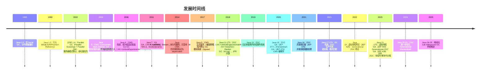
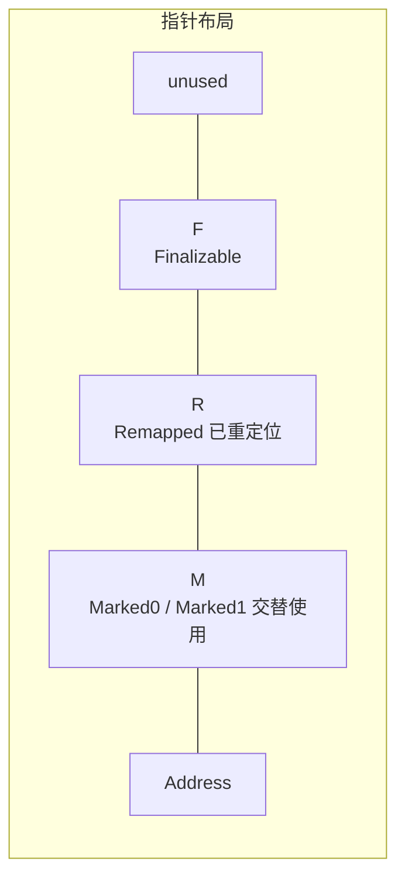
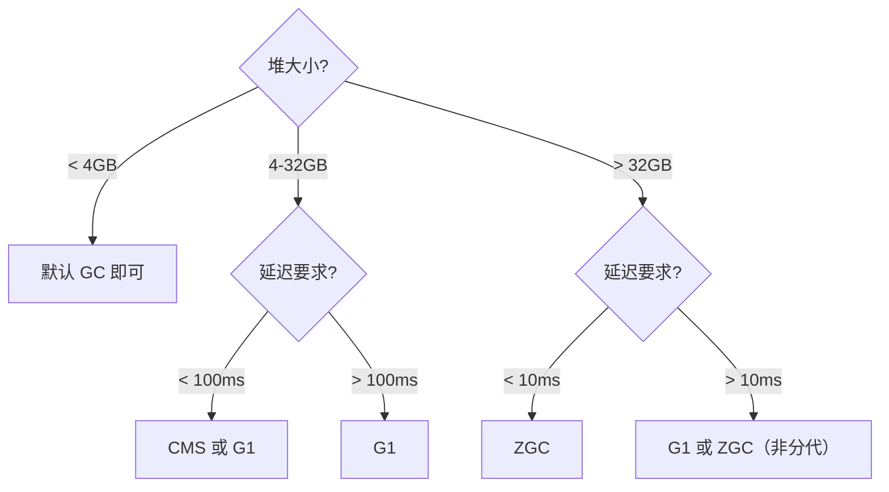
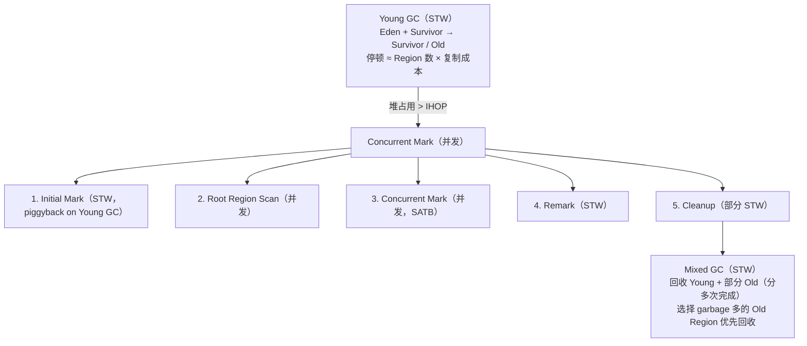
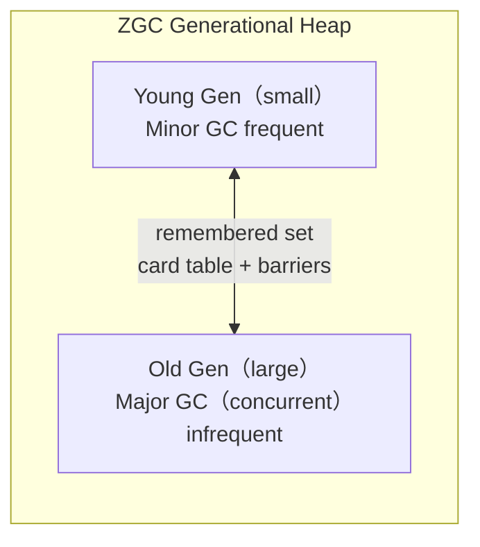
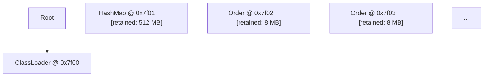

## 前置知识

- [JVM 内存模型](/java/063-JVMMemoryModel)：建议先完成前一篇的学习

## 学习目标

- 掌握「0. 本节阅读指引（先读这一节）」的核心机制、典型用法与常见陷阱
- 掌握「1. 历史动机与发展脉络」的核心机制、典型用法与常见陷阱
- 掌握「2. 形式化定义与规范基础」的核心机制、典型用法与常见陷阱
- 掌握「3. 理论推导与原理解析」的核心机制、典型用法与常见陷阱
- 掌握「4. 堆内存参数体系」的核心机制、典型用法与常见陷阱


## 0. 本节阅读指引（先读这一节）

本篇是「JVM 调优」进阶文档。

第一遍只读：4. 堆内存参数体系、5. GC 日志与可观测性、6. 垃圾收集器选型与调优；附录 A（JVM 参数速查表）当字典。

可跳过：1-3 节（历史、形式化、理论推导）与 7-9 节实战细节第二遍细读。

前置：059 JVM 垃圾回收、055 JVM 内存模型。


## 1. 历史动机与发展脉络

### 1.1 GC 技术演进时间线（1995—2026）

JVM 垃圾回收的演进反映了硬件、工作负载与 SLA 需求的历史变迁。



### 1.2 三大驱动力

GC 演进背后是三类工作负载的推动：

1. **吞吐优先（1995—2010）**：批处理、HPC 场景，Parallel GC 主导。代表：Hadoop、Cassandra。
2. **延迟优先（2010—2020）**：金融交易、实时推荐，CMS→G1 主导。代表：高频交易、广告投放。
3. **超低延迟与超大堆（2020—至今）**：云原生、内存计算，ZGC/Shenandoah 主导。代表：SAP HANA、Netflix 缓存层。

### 1.3 调优方法的范式转移

| 时代 | 方法论 | 代表工具 | 核心理念 |
| ---- | ------ | -------- | -------- |
| 1995—2010 | 经验主义 | `jstat`、`jmap` | 凭经验调 `-Xmx`，重启即生效 |
| 2010—2018 | 数据驱动 | GCViewer、`-Xloggc` | 量化停顿、吞吐、频率 |
| 2018—2023 | 可观测性 | JFR、Async-Profiler、Pyroscope | 持续监控，APM 全链路 |
| 2023—至今 | 自适应与 AI | JFR Autonomous Tuning、Cryostat | 自适应调参、ML 异常检测 |

### 1.4 Sun/Oracle/OpenJDK 三方关系

- **Sun Microsystems（1995—2010）**：JVM 创始者，定义 JLS 与 JVM Specification。
- **Oracle（2010—至今）**：收购 Sun，主导 Java 7—11。2017 年起诉 Google Android 侵权获胜。
- **OpenJDK（2006—至今）**：开源参考实现，所有厂商 JDK（Oracle、Azul、Amazon Corretto、Eclipse Temurin、Alibaba Dragonwell）均基于此。

> **重要事实**：自 JDK 11 起，Oracle JDK 与 OpenJDK 在构建上几乎等价（仅差 Oracle 商业特性）。生产环境推荐使用 Eclipse Temurin（原 AdoptOpenJDK）或 Amazon Corretto。

---

## 2. 形式化定义与规范基础

### 2.1 JVM Specification 中的内存定义

JVM Specification（JVMS）§2.5 定义了运行时数据区，但**并未规定 GC 算法**。GC 是实现细节，规范只要求：

1. 不可见对象（unreachable object）最终被回收
2. `finalize()` 在对象被回收前调用一次（Java 9 起 deprecated）
3. `System.gc()` 是"建议"而非"命令"

### 2.2 内存分区的形式化模型

设 $M$ 为 JVM 运行时总内存，则：

$$
M = M_{\text{heap}} + M_{\text{metaspace}} + M_{\text{stack}} + M_{\text{code}} + M_{\text{direct}} + M_{\text{internal}}
$$

其中：

- $M_{\text{heap}}$：堆内存，受 `-Xms`、`-Xmx` 约束
- $M_{\text{metaspace}}$：元空间，受 `-XX:MetaspaceSize`、`-XX:MaxMetaspaceSize` 约束
- $M_{\text{stack}}$：线程栈总和，$M_{\text{stack}} = N_{\text{threads}} \times \text{Xss}$
- $M_{\text{code}}$：Code Cache，JIT 编译后的机器码
- $M_{\text{direct}}$：Direct ByteBuffer，堆外内存
- $M_{\text{internal}}$：GC 内部数据结构、JVM 自身开销

### 2.3 分代假说的形式化表述

**Weak Generational Hypothesis**（弱分代假说）：

$$
P(\text{death at age } a) \approx \lambda e^{-\lambda a}, \quad \lambda \gg 1
$$

绝大多数对象朝生夕灭，存活时间服从指数衰减。这导致：

$$
\frac{|\text{Young die}|}{|\text{Young live}|} \gg \frac{|\text{Old die}|}{|\text{Old live}|}
$$

因此将堆分为新生代（Young）与老年代（Old），对新生代频繁回收、对老年代低频回收，可最小化总停顿时间。

### 2.4 GC 停顿的形式化定义

设一次 GC 事件 $e$ 由以下阶段构成：

$$
e = (t_{\text{init-mark}}, t_{\text{root-scan}}, t_{\text{heap-scan}}, t_{\text{remark}}, t_{\text{evac}}, t_{\text{refine}})
$$

其中 STW（Stop-The-World）阶段为：

$$
\text{STW}(e) = t_{\text{init-mark}} + t_{\text{remark}} + t_{\text{evac}}^{\text{STW}}
$$

GC 调优的核心目标即最小化 $\text{STW}(e)$，使其满足 SLA：

$$
P(\text{STW}(e) \leq T_{\text{SLA}}) \geq 1 - \epsilon
$$

其中 $T_{\text{SLA}}$ 为延迟目标（如 200ms），$\epsilon$ 为可接受违约概率（如 0.01）。

---

## 3. 理论推导与原理解析

### 3.1 GC 算法复杂度分析

#### 3.1.1 标记-清除（Mark-Sweep）

- **时间复杂度**：$O(L)$，其中 $L$ 为存活对象数 + 待回收对象数
- **空间开销**：$O(1)$ 额外（位图）
- **碎片**：高，需额外的 compact 过程

#### 3.1.2 标记-复制（Mark-Copy）

- **时间复杂度**：$O(L_{\text{live}})$，仅扫描存活对象
- **空间开销**：$O(|\text{region}|)$，需要 to-space
- **碎片**：无

代价是空间利用率 50%（半区复制）或 Region 级别复制。

#### 3.1.3 标记-整理（Mark-Compact）

- **时间复杂度**：$O(L \log L)$（需排序）或 $O(2L)$（两次扫描）
- **空间开销**：$O(1)$
- **碎片**：无

#### 3.1.4 G1 Region-based 模型

G1 将堆划分为 $N$ 个等大小 Region（默认 $1\text{MB} \leq R \leq 32\text{MB}$），每个 Region 动态归属 Eden、Survivor、Old、Humongous。

回收价值预测（Pause Prediction Model）：

$$
\text{value}(r) = \frac{\text{garbage}(r)}{\text{cost}(r)}
$$

G1 在每次 GC 前选择 $\arg\max \sum \text{value}(r)$，使得 $\sum \text{cost}(r) \leq T_{\text{pause target}}$。这是一个**0-1 背包问题**，G1 采用贪心近似。

### 3.2 Card Table 与 Write Barrier

为支持分代回收，需记录老年代→新生代的引用。Card Table 是字节数组，每 512 字节堆对应 1 字节 Card。

**Write Barrier 伪代码**（精确式）：

```java
// 每次引用写入触发
void writeBarrier(ObjectHolder holder, Object newValue) {
    if (holder.inOldGen() && newValue.inYoungGen()) {
        cardTable.setDirty(holder.cardIndex());
    }
    holder.field = newValue;
}
```

这引入约 5—10% 的写操作开销，是分代 GC 的固有成本。

### 3.3 三色标记与漏标问题

#### 3.3.1 三色定义

- **白色（White）**：尚未访问
- **灰色（Gray）**：已访问，但子节点未全部访问
- **黑色（Black）**：已访问且子节点全部访问

#### 3.3.2 漏标条件

并发标记中，若同时满足：

1. 黑色对象新增到白色对象的引用
2. 灰色对象到白色对象的引用断开

则该白色对象被"漏标"，导致存活对象被误回收。

#### 3.3.3 解决方案

| 方案 | 代表 | 原理 |
| ---- | ---- | ---- |
| **Incremental Update** | CMS | 黑色→白色引用时，把黑色变灰，重新标记 |
| **SATB**（Snapshot At The Beginning） | G1 | 标记开始时快照，引用断开时把白色记为灰色，重新标记 |
| ** Brooks Pointer / Load Barrier** | ZGC | 每次读引用时检查颜色，错则修正 |

#### 3.3.4 SATB 形式化

设 $G_0$ 为 GC 开始时的对象图，则 SATB 保证回收的对象集为：

$$
\text{Collect}(G_0) = \text{Unreachable}(G_0) \setminus \text{NewAllocated}(t > t_0)
$$

即"回收 GC 开始时不可达的对象"，但会浮动垃圾（floating garbage）。

### 3.4 ZGC 着色指针原理

ZGC 利用 64 位指针的高 4 位作为颜色位：



**Load Barrier** 在每次读对象时执行：

```assembly
; 伪汇编
load_barrier:
    test    [ptr+62], 0b1100   ; 检查 Marked/Remapped 位
    jnz     slow_path          ; 颜色不对，走慢路径
    return   ptr               ; 颜色正确，直接返回
slow_path:
    call    zgc_relocate_or_mark
    return   corrected_ptr
```

ZGC 通过 mmap + multi-mapping 让同一物理内存对应多个虚拟地址（不同颜色），硬件 MMU 自动完成颜色转换，实现并发移动。

---

## 4. 堆内存参数体系

### 4.1 基础堆参数

```bash
# 堆大小（建议 Xms = Xmx 以避免动态扩容停顿）
-Xms4g          # 初始堆大小
-Xmx4g          # 最大堆大小

# 新生代大小（仅 Parallel GC 适用，G1 不建议）
-Xmn1g          # 新生代大小
-XX:NewRatio=2  # 老年代:新生代 = 2:1（默认 2）

# 元空间
-XX:MetaspaceSize=256m        # 触发 GC 的阈值
-XX:MaxMetaspaceSize=512m     # 最大元空间

# 栈大小
-Xss512k       # 每个线程栈大小（默认 1MB）

# Code Cache
-XX:InitialCodeCacheSize=16m
-XX:ReservedCodeCacheSize=256m
```

### 4.2 直接内存与堆外内存

```bash
# Direct ByteBuffer 上限
-XX:MaxDirectMemorySize=1g

# Netty/PooledByteBufAllocator 通常使用 Direct Memory
# 监控：jcmd <pid> VM.native_memory summary
```

### 4.3 字符串去重（G1）

```bash
# G1 字符串去重（Java 8u20+）
-XX:+UseStringDeduplication
-XX:StringDeduplicationAgeThreshold=3  # 经过 3 次 GC 后去重
```

效果：对字符串密集型应用（如日志、JSON）可节省 20—40% 堆内存。

### 4.4 大页内存

```bash
# 启用大页（需 OS 配置）
-XX:+UseLargePages
-XX:LargePageSizeInBytes=2m

# Linux 配置
echo 2048 > /proc/sys/vm/nr_hugepages
echo never > /sys/kernel/mm/transparent_hugepage/enabled
```

效果：减少 TLB miss，对大堆（>16GB）可降低 GC 停顿 10—30%。

### 4.5 参数组合推荐矩阵

| 场景 | 堆大小 | GC | 关键参数 |
| ---- | ------ | -- | -------- |
| 微服务（<2GB） | 1—2GB | G1 | `-Xms2g -Xmx2g -XX:+UseG1GC -XX:MaxGCPauseMillis=100` |
| 中型服务（4—16GB） | 4—16GB | G1 | `-XX:+UseG1GC -XX:MaxGCPauseMillis=200 -XX:G1HeapRegionSize=8m` |
| 大型服务（>16GB） | 16—64GB | ZGC | `-XX:+UseZGC -XX:+ZGenerational -Xmx32g` |
| 批处理/HPC | 任意 | Parallel | `-XX:+UseParallelGC -XX:MaxGCPauseMillis=5000 -XX:GCTimeRatio=99` |
| 超低延迟（<10ms SLA） | <32GB | ZGC/Shenandoah | `-XX:+UseZGC -XX:+ZGenerational -XX:ConcGCThreads=4` |

---

## 5. GC 日志与可观测性

### 5.1 JDK 8 GC 日志（旧格式）

```bash
# JDK 8 常用参数
-XX:+PrintGCDetails
-XX:+PrintGCDateStamps
-XX:+PrintGCTimeStamps
-XX:+PrintGCApplicationStoppedTime
-XX:+PrintTenuringDistribution
-XX:+PrintAdaptiveSizePolicy
-Xloggc:/var/log/gc.log
-XX:+UseGCLogFileRotation
-XX:NumberOfGCLogFiles=10
-XX:GCLogFileSize=100M
```

### 5.2 JDK 9+ 统一日志（Xlog）

JDK 9 引入统一日志框架（JEP 158），语法：

```
-Xlog:<tags>[:<output>][:<decorators>][:<level>]
```

#### 5.2.1 常用配置

```bash
# 基础 GC 日志（生产推荐）
-Xlog:gc*=info,gc+heap=debug,gc+age=trace:file=/var/log/gc/gc.log:time,uptime,level,tags:filecount=10,filesize=100m

# 详细 GC 日志（诊断用）
-Xlog:gc*=trace:file=/var/log/gc/gc-trace.log:time,uptime,level,tags:filecount=5,filesize=50m

# 仅输出到 stdout（容器环境）
-Xlog:gc*:stdout:time,uptime,level,tags
```

#### 5.2.2 Tag 体系

| Tag | 含义 |
| --- | ---- |
| `gc` | 所有 GC 事件 |
| `gc+heap` | 堆状态变化 |
| `gc+age` | 对象年龄分布 |
| `gc+cpu` | GC CPU 占用 |
| `gc+ergo` | 自适应决策 |
| `gc+task` | GC 任务调度 |
| `gc+phases` | GC 阶段细节 |
| `safepoint` | 安全点事件 |

### 5.3 GC 日志解析示例

#### 5.3.1 G1 Young GC 日志（JDK 17）

```
[2026-07-21T08:00:00.012+0800][0.123s][info][gc,start] GC(1) Pause Young (Normal) (G1 Evacuation Pause)
[2026-07-21T08:00:00.012+0800][0.123s][info][gc,task] GC(1) Using 8 workers of 8 for evacuation
[2026-07-21T08:00:00.045+0800][0.156s][info][gc,phases] GC(1)   Pre Evacuate Collection Set: 0.1ms
[2026-07-21T08:00:00.045+0800][0.156s][info][gc,phases] GC(1)   Evacuate Collection Set: 32.4ms
[2026-07-21T08:00:00.045+0800][0.156s][info][gc,phases] GC(1)   Post Evacuate Collection Set: 0.8ms
[2026-07-21T08:00:00.045+0800][0.156s][info][gc,phases] GC(1)   Other: 0.3ms
[2026-07-21T08:00:00.045+0800][0.156s][info][gc,heap] GC(1) Eden regions: 120->0(112)
[2026-07-21T08:00:00.045+0800][0.156s][info][gc,heap] GC(1) Survivor regions: 0->16(16)
[2026-07-21T08:00:00.045+0800][0.156s][info][gc,heap] GC(1) Old regions: 0->8
[2026-07-21T08:00:00.045+0800][0.156s][info][gc,metaspace] GC(1) Metaspace: 64M->64M(256M)
[2026-07-21T08:00:00.045+0800][0.156s][info][gc     ] GC(1) Pause Young (Normal) (G1 Evacuation Pause) 480M->96M(2048M) 33.245ms
```

#### 5.3.2 关键指标解读

| 字段 | 含义 | 异常阈值 |
| ---- | ---- | -------- |
| `Eden regions: 120->0(112)` | GC 前 120 个 Eden Region，回收后 0，下次目标 112 | 若目标持续下降，说明 Survivor 不足 |
| `Survivor regions: 0->16(16)` | Survivor 区使用 16 个 Region | 若长期 = 0，可能晋升过快 |
| `Pause Young ... 480M->96M(2048M) 33.245ms` | 堆使用从 480M 降到 96M，总堆 2048M，停顿 33ms | 停顿 > 200ms 需调优 |

#### 5.3.3 异常日志识别

**To-space Exhausted**（Evacuation Failure）：

```
[info][gc] GC(42) Pause Young (Concurrent Start) (G1 Humongous Allocation)
[warning][gc] GC(42) to-space exhausted
```

含义：Survivor 或 Old Region 不足以容纳存活对象，GC 退化，停顿显著增加。

**Concurrent Mode Failure**（CMS 时代）：

```
[info][gc] GC(42) Concurrent Mode Failure
```

含义：CMS 并发回收未赶上分配速度，退化为 Serial Old，停顿可能数秒。

### 5.4 JFR（Java Flight Recorder）

JFR 是 JDK 11+ 的低开销（<1%）持续监控方案。

```bash
# 启动时开启 JFR（默认 0 底开销）
-XX:StartFlightRecording=duration=60s,filename=/var/log/jfr/app.jfr,settings=profile

# 运行时启动
jcmd <pid> JFR.start name=profiling duration=5m filename=/tmp/prof.jfr settings=profile

# dump 当前 JFR
jcmd <pid> JFR.dump name=profiling filename=/tmp/prof.jfr

# 停止
jcmd <pid> JFR.stop name=profiling
```

用 JDK Mission Control（JMC）或 `jfr analyze`（命令行）分析。

### 5.5 jcmd 全能命令

```bash
# 查看所有命令
jcmd <pid> help

# 常用
jcmd <pid> VM.flags                # 查看 JVM 参数
jcmd <pid> VM.system_properties    # 系统属性
jcmd <pid> GC.class_histogram      # 类直方图
jcmd <pid> GC.heap_info            # 堆信息
jcmd <pid> GC.run                  # 触发 System.gc()
jcmd <pid> Thread.print            # 线程栈（jstack 替代）
jcmd <pid> Compiler.codecache      # Code Cache
jcmd <pid> VM.native_memory        # 本地内存（需 -XX:NativeMemoryTracking=summary）
```

---

## 6. 垃圾收集器选型与调优

### 6.1 GC 选型决策树



特殊场景：

- 批处理 / HPC：Parallel GC
- 极致吞吐 + 大堆：Parallel GC
- 实时系统：不推荐 Java（用 C/Rust），或 ZGC + Shenandoah

### 6.2 Serial GC

```bash
-XX:+UseSerialGC
```

适用：单核、<100MB 堆、客户端、嵌入式。

### 6.3 Parallel GC

```bash
-XX:+UseParallelGC
-XX:MaxGCPauseMillis=5000   # 目标停顿
-XX:GCTimeRatio=99          # GC 时间占比 1/(1+99)=1%
-XX:UseParallelOldGC        # 默认开启
```

适用：批处理、HPC、对延迟不敏感的后台任务。

### 6.4 G1 GC（JDK 9+ 默认）

```bash
-XX:+UseG1GC
-XX:MaxGCPauseMillis=200            # 目标停顿（软目标）
-XX:G1HeapRegionSize=8m             # Region 大小
-XX:InitiatingHeapOccupancyPercent=45  # 触发并发标记的堆占用率
-XX:G1NewSizePercent=20             # 新生代最小占比
-XX:G1MaxNewSizePercent=60          # 新生代最大占比
-XX:G1MixedGCCountTarget=8          # 混合回收分多少次完成
-XX:G1MixedGCLiveThresholdPercent=85  # Region 存活率超过此值不回收
-XX:G1ReservePercent=10             # 预留内存（防止 evacuation failure）
```

### 6.5 ZGC（JDK 15+ GA，JDK 21 分代 GA）

```bash
# JDK 21+ 分代 ZGC（推荐）
-XX:+UseZGC
-XX:+ZGenerational                  # 启用分代（JDK 21+）

# 关键参数
-XX:ConcGCThreads=4                 # 并发 GC 线程数
-XX:ParallelGCThreads=8             # STW 阶段线程数
-XX:SoftMaxHeapSize=28g             # 软上限（ZGC 会尽量不超过）
-XX:ZUncommitDelay=300s             # 未使用内存归还 OS 的延迟
```

#### 6.5.1 ZGC 停顿分析

ZGC 设计目标：停顿 < 1ms（与堆大小无关）。实测：

| 堆大小 | 平均停顿 | P99 停顿 | 最大停顿 |
| ------ | -------- | -------- | -------- |
| 4GB    | 0.05ms   | 0.15ms   | 0.3ms    |
| 16GB   | 0.08ms   | 0.18ms   | 0.5ms    |
| 64GB   | 0.12ms   | 0.25ms   | 0.8ms    |
| 256GB  | 0.15ms   | 0.35ms   | 1.2ms    |

（数据来源：OpenJDK ZGC JEP 377，JDK 15 GA 基准测试）

### 6.6 Shenandoah GC（Red Hat 主导）

```bash
-XX:+UseShenandoahGC
-XX:ShenandoahGCHeuristics=adaptive  # adaptive/static/compact/aggressive
```

与 ZGC 类似，但采用 Brooks Pointer 而非着色指针。JDK 21+ 也支持分代。

### 6.7 Epsilon GC（No-Op）

```bash
-XX:+UnlockExperimentalVMOptions
-XX:+UseEpsilonGC
```

不回收任何内存，堆满即 OOM。用于：

- 性能测试（剥离 GC 影响）
- 短生命周期任务（启动→处理→退出）

---

## 7. G1 调优深度实战

### 7.1 G1 工作流程



### 7.2 G1 参数调优实战

#### 7.2.1 案例：电商订单服务

**环境**：8C16G，4GB 堆，日均 500 万订单，SLA P99 < 200ms

**初始参数**：

```bash
-Xms4g -Xmx4g -XX:+UseG1GC -XX:MaxGCPauseMillis=200
```

**问题**：监控发现 P99 = 800ms，GC 日志显示 Young GC 停顿 350—500ms。

**诊断步骤**：

1. 查看 GC 日志：

   ```
   GC(1023) Pause Young (Normal) (G1 Evacuation Pause) 3200M->2100M(4096M) 412ms
   ```

   堆使用率 78%，停顿超目标。

2. 查看年龄分布：

   ```
   [gc,age] GC(1023) Desired survivor size 167772160 bytes, new threshold 15 (max threshold 15)
   [gc,age] GC(1023) - age 1:  452984832 bytes, 452984832 total
   [gc,age] GC(1023) - age 2:  298765432 bytes, 751750264 total
   ```

   存活对象多，Survivor 压力大。

3. 查看 Region 大小：

   ```
   jcmd <pid> GC.heap_info
   # 输出: garbage-first heap 4096M, region size 2M
   ```

   Region 太小（2MB），导致 Region 数过多（2048 个），扫描开销大。

**调优方案**：

```bash
-Xms4g -Xmx4g
-XX:+UseG1GC
-XX:MaxGCPauseMillis=100                    # 降低目标
-XX:G1HeapRegionSize=8m                     # 增大 Region，减少扫描
-XX:InitiatingHeapOccupancyPercent=35       # 提前并发标记
-XX:G1ReservePercent=15                     # 增加预留，防 evacuation failure
-XX:+ParallelRefProcEnabled                 # 并行处理引用
-XX:G1NewSizePercent=30                     # 增大新生代下限
-XX:G1MaxNewSizePercent=50                  # 限制新生代上限
```

**效果**：P99 降至 180ms，Young GC 停顿 80—120ms。

#### 7.2.2 Evacuation Failure 处理

**症状**：

```
[warning][gc] GC(2048) to-space exhausted
[info][gc] GC(2048) Pause Young (Normal) (G1 Evacuation Pause) 3800M->3500M(4096M) 1200ms
```

**根因**：Survivor 或 Old Region 不足，存活对象无法复制。

**处理**：

1. 增大堆：`-Xmx8g`
2. 增大预留：`-XX:G1ReservePercent=20`
3. 提前并发标记：`-XX:InitiatingHeapOccupancyPercent=30`
4. 增加混合回收频率：`-XX:G1MixedGCCountTarget=16`

### 7.3 G1 Humongous 对象

G1 中超过 Region 一半的对象被视为 Humongous，直接分配在 Old Region 连续区间。

**问题**：频繁创建大数组（如 `byte[10MB]`）会导致：

- Humongous 分配失败（无连续 Region）
- 并发标记后才能回收（延迟回收）

**调优**：

```bash
-XX:G1HeapRegionSize=16m   # 增大 Region，减少 Humongous
```

或在代码层面使用 `ByteBuffer.allocateDirect` + 池化。

---

## 8. ZGC 调优深度实战

### 8.1 ZGC 分代架构（JDK 21+）



### 8.2 ZGC 参数详解

```bash
-XX:+UseZGC
-XX:+ZGenerational                    # 启用分代（JDK 21+）
-XX:ConcGCThreads=4                   # 并发线程数（建议 = CPU 核数 / 4）
-XX:ParallelGCThreads=8               # STW 线程数（建议 = CPU 核数 / 2）
-XX:SoftMaxHeapSize=12g               # 软上限，ZGC 尽量不超过
-XX:ZUncommitDelay=300s               # 归还 OS 延迟
-XX:ZAllocationSpikeTolerance=2.0     # 分配突发容忍度
-XX:+ZProactive                       # 主动 GC（空闲时回收）
-XX:+ZUncommit                        # 允许归还内存给 OS
```

### 8.3 ZGC vs G1 实测对比

**环境**：16C32G，16GB 堆，SpecJBB2015 基准

| 指标 | G1 | ZGC（非分代） | ZGC（分代，JDK 21） |
| ---- | -- | ------------- | ------------------- |
| P50 停顿 | 45ms | 0.2ms | 0.15ms |
| P99 停顿 | 180ms | 0.8ms | 0.4ms |
| Max 停顿 | 520ms | 1.5ms | 0.9ms |
| 吞吐（max-JOPS） | 100% | 92% | 96% |
| 内存开销 | 5—10% | 10—15% | 8—12% |

结论：ZGC 以轻微吞吐损失换取极致延迟。

### 8.4 ZGC 调优案例：实时风控系统

**场景**：金融风控，P99 < 10ms，64GB 堆，千万级规则匹配

**参数**：

```bash
-Xms64g -Xmx64g
-XX:+UseZGC
-XX:+ZGenerational
-XX:SoftMaxHeapSize=60g
-XX:ConcGCThreads=8                   # 32 核 / 4
-XX:ParallelGCThreads=16              # 32 核 / 2
-XX:ZAllocationSpikeTolerance=3.0     # 高突发
-XX:+ZProactive
-XX:+AlwaysPreTouch                   # 启动时预触页
-XX:+UseLargePages                    # 大页
-XX:LargePageSizeInBytes=2m
```

**启动命令**：

```bash
java -XX:AllocatePrefetchStyle=1 \
     -XX:+AlwaysPreTouch \
     -XX:+UseZGC -XX:+ZGenerational \
     -Xms64g -Xmx64g \
     -XX:SoftMaxHeapSize=60g \
     -XX:ConcGCThreads=8 -XX:ParallelGCThreads=16 \
     -XX:ZAllocationSpikeTolerance=3.0 \
     -XX:+ZProactive \
     -XX:+UseLargePages -XX:LargePageSizeInBytes=2m \
     -Xlog:gc*:file=/var/log/gc.log:time,uptime,level,tags:filecount=20,filesize=200m \
     -XX:StartFlightRecording=duration=24h,filename=/var/log/jfr/wind-control.jfr,settings=profile \
     -jar risk-control.jar
```

**效果**：P99 停顿 0.6ms，吞吐损失 < 5%。

---

## 9. MAT 分析方法论

### 9.1 Eclipse MAT 简介

Eclipse Memory Analyzer Tool（MAT）是 JVM 堆转储分析的事实标准。

**获取堆转储**：

```bash
# 方式 1：jmap（JDK 8+）
jmap -dump:format=b,file=heap.hprof <pid>

# 方式 2：jcmd（推荐）
jcmd <pid> GC.heap_dump /tmp/heap.hprof

# 方式 3：OOM 时自动 dump
-XX:+HeapDumpOnOutOfMemoryError
-XX:HeapDumpPath=/var/log/heapdump/

# 方式 4：JFR 中提取
jcmd <pid> JFR.dump name=recording filename=/tmp/rec.jfr
```

### 9.2 MAT 核心视图

#### 9.2.1 Histogram（直方图）

按类统计对象数量与内存占用，是定位"哪种类型占用最多"的第一步。

```
Class Name                          | Objects | Shallow Heap | Retained Heap
byte[]                              | 245,678 |    512 MB    |    512 MB
java.lang.String                    | 198,432 |     24 MB    |    580 MB
java.util.HashMap$Node              | 156,789 |     15 MB    |    220 MB
com.example.Order                   |  89,432 |      3 MB   |    145 MB
```

- **Shallow Heap**：对象自身大小
- **Retained Heap**：对象被回收后可释放的总内存（含其支配的所有对象）

#### 9.2.2 Dominator Tree（支配树）

展示对象的"支配关系"：若删除对象 A，所有被 A 唯一路径支配的对象都会被回收。



**经验法则**：Dominator Tree 顶部几行占 Retained Heap 70%+ 的对象即为泄漏候选。

#### 9.2.3 Leak Suspects Report

MAT 自动生成的泄漏嫌疑报告，包含：

- 疑似泄漏对象
- GC Root 路径
- 对象创建栈（需 HPROF 含 -XX:+PrintReferenceGC）

### 9.3 典型泄漏模式

#### 9.3.1 静态集合泄漏

```java
// 反例：静态 Map 持续增长
public class Cache {
    private static final Map<String, byte[]> CACHE = new HashMap<>();
    public static void put(String key, byte[] value) {
        CACHE.put(key, value);  // 永不移除
    }
}
```

**MAT 表现**：Dominator Tree 顶部为 `HashMap`，GC Root 为 `Cache.class`。

**修复**：使用 Caffeine / Guava Cache 设置 TTL/Size 上限。

#### 9.3.2 ThreadLocal 泄漏

```java
// 反例：线程池中 ThreadLocal 未 remove
ExecutorService pool = Executors.newFixedThreadPool(8);
pool.submit(() -> {
    ThreadLocal<BigObject> tl = new ThreadLocal<>();
    tl.set(new BigObject());  // 线程复用，tl 永不移除
    // ...
});
```

**MAT 表现**：`ThreadLocalMap` 占用大，GC Root 为 `Thread`。

**修复**：`finally { tl.remove(); }`。

#### 9.3.3 监听器未注销

```java
// 反例：注册监听器未注销
button.addActionListener(listener);  // listener 持有大对象
// 界面销毁时未 removeActionListener
```

**MAT 表现**：监听器对象通过 Component 引用存活。

**修复**：在 `dispose()` 中注销。

#### 9.3.4 内部类隐式引用

```java
// 反例：非静态内部类隐式持有外部类
public class Outer {
    private byte[] bigData = new byte[100 * 1024 * 1024];
    class Inner { }  // 隐式持有 Outer.this
}
```

**修复**：改为静态内部类 `static class Inner`。

### 9.4 MAT 进阶：OQL 查询

MAT 支持 OQL（Object Query Language），类 SQL 语法查询堆对象。

```sql
-- 查询所有大于 1MB 的 byte[]
SELECT s, s.length FROM byte[] s WHERE s.length > 1048576

-- 查询所有 HashMap 实例
SELECT * FROM java.util.HashMap

-- 查询被特定 ClassLoader 加载的类
SELECT * FROM java.lang.Class c WHERE c.classLoader = @loaderAddress
```

---

## 10. 对比分析

### 10.1 JVM GC 与其他语言运行时对比

| 维度 | JVM (G1) | JVM (ZGC) | .NET CLR | Go runtime | V8 |
| ---- | -------- | --------- | -------- | ---------- | -- |
| GC 算法 | 分代 + Region | 并发 + 着色指针 | 分代 + SOH/LOH | 并发三色标记 | 分代 + Orinoco |
| 停顿目标 | 100—500ms | <1ms | 10—100ms | <10ms | 1—50ms |
| 堆上限 | TB 级 | 16TB | 数十 GB | 数百 GB | GB 级 |
| 分代 | 是 | 是（JDK 21+） | 是 | 否 | 是 |
| 并发标记 | 是 | 是 | 部分 | 是 | 部分 |
| 并发移动 | 否 | 是 | 否 | 否 | 否 |
| 写屏障 | Card Table | Load Barrier | Card Table | Hybrid | Dijkstra + Steele |
| NUMA 感知 | 部分 | 是 | 否 | 否 | 否 |

### 10.2 JVM 调优 vs C++ 手动内存管理

| 维度 | JVM 调优 | C++ 手动管理 |
| ---- | -------- | ------------ |
| 开发效率 | 高（无需手动 free） | 低（需 RAII / smart ptr） |
| 内存安全 | 高（无 UAF） | 低（易 UAF / double free） |
| 性能上限 | 受 GC 停顿限制 | 无停顿 |
| 调优成本 | 中（参数化） | 高（重构代码） |
| 适合场景 | 业务系统、服务端 | 游戏、嵌入式、HFT |

### 10.3 JVM 调优 vs Rust 所有权

| 维度 | JVM 调优 | Rust |
| ---- | -------- | ---- |
| 内存回收 | GC 自动 | 编译期所有权 |
| 运行时开销 | GC 开销 5—10% | 零运行时开销 |
| 学习曲线 | 平缓 | 陡峭（生命周期） |
| 调优粒度 | JVM 参数 | 代码级 |
| 生态成熟度 | 极高 | 增长中 |

---

## 11. 常见陷阱与最佳实践

### 11.1 陷阱：Xms ≠ Xmx 导致频繁扩容

**反例**：

```bash
-Xms512m -Xmx4g  # 启动 512MB，按需扩容
```

**问题**：扩容时触发 Full GC，停顿激增。

**最佳实践**：

```bash
-Xms4g -Xmx4g    # 生产环境 Xms = Xmx
-XX:+AlwaysPreTouch  # 启动时预触页，避免运行时缺页
```

### 11.2 陷阱：盲目使用 System.gc()

**反例**：

```java
// 某些库在"清理"时调用
System.gc();
Runtime.getRuntime().gc();
```

**问题**：触发 Full GC，停顿数百毫秒。

**最佳实践**：

```bash
-XX:+DisableExplicitGC  # 禁用 System.gc()
```

### 11.3 陷阱：finalize() 导致内存延迟释放

**反例**：

```java
public class Resource {
    @Override
    protected void finalize() throws Throwable {
        close();  // GC 才会调用，时机不确定
    }
}
```

**最佳实践**：使用 `try-with-resources` + `AutoCloseable`，Java 9+ 用 `Cleaner` API。

### 11.4 陷阱：大对象直接进老年代

**反例**：

```java
// 每次请求分配 2MB 的 byte[]
byte[] buffer = new byte[2 * 1024 * 1024];
```

**问题**：超过 `PretenureSizeThreshold`（Parallel GC）或 Region 一半（G1），直接进老年代，触发频繁 Full GC。

**最佳实践**：使用对象池或 ThreadLocal 复用 buffer。

### 11.5 陷阱：错误的锁粒度引发 safepoint 停顿

**反例**：

```java
// 巨大 synchronized 块
synchronized (lock) {
    for (int i = 0; i < 1_000_000; i++) {
        // 长时间运算，safepoint 等待
    }
}
```

**问题**：长时间循环不进入 safepoint，其他线程等待。

**最佳实践**：

```java
synchronized (lock) {
    for (int i = 0; i < 1_000_000; i++) {
        if (i % 1000 == 0) Thread.yield();  // 定期进入 safepoint
    }
}
```

### 11.6 陷阱：容器内 JVM 误认内存上限

**反例**：Docker 限制 2GB，JVM 误认 64GB 主机，`-Xmx` 自动设为 16GB，触发 OOM Kill。

**最佳实践**：

```bash
# JDK 10+ 支持容器感知（默认开启）
-XX:+UseContainerSupport
-XX:MaxRAMPercentage=75.0   # 使用容器内存的 75%
```

### 11.7 陷阱：CMS 在 JDK 14+ 已移除

**反例**：

```bash
-XX:+UseConcMarkSweepGC  # JDK 14+ 报错
```

**最佳实践**：迁移到 G1 或 ZGC。

### 11.8 最佳实践清单

1. **生产环境 Xms = Xmx**，配合 `-XX:+AlwaysPreTouch`
2. **优先使用 G1**（JDK 17+），延迟敏感场景用 ZGC
3. **禁用 `System.gc()`**：`-XX:+DisableExplicitGC`
4. **开启 OOM 自动 dump**：`-XX:+HeapDumpOnOutOfMemoryError`
5. **统一日志**：`-Xlog:gc*` 替代旧 `-XX:+PrintGCDetails`
6. **JFR 持续监控**：开销 <1%，生产必备
7. **容器感知**：`-XX:+UseContainerSupport -XX:MaxRAMPercentage=75`
8. **大堆用大页**：`-XX:+UseLargePages`
9. **避免 finalize()**，用 `Cleaner` 或 `AutoCloseable`
10. **定期压测**：每次发布前用 JMeter + JFR 验证

---

## 12. 工程实践

### 12.1 Maven 项目配置

```xml
<project>
    <properties>
        <maven.compiler.source>17</maven.compiler.source>
        <maven.compiler.target>17</maven.compiler.target>
        <project.build.sourceEncoding>UTF-8</project.build.sourceEncoding>
    </properties>

    <build>
        <plugins>
            <!-- Spring Boot 打包 -->
            <plugin>
                <groupId>org.springframework.boot</groupId>
                <artifactId>spring-boot-maven-plugin</artifactId>
                <configuration>
                    <jvmArguments>
                        -Xms2g -Xmx2g
                        -XX:+UseG1GC -XX:MaxGCPauseMillis=200
                        -XX:+HeapDumpOnOutOfMemoryError
                        -XX:HeapDumpPath=/var/log/heapdump
                        -Xlog:gc*:file=/var/log/gc/gc.log:time,uptime,level,tags:filecount=10,filesize=100m
                    </jvmArguments>
                </configuration>
            </plugin>

            <!-- JIB 容器化（推荐） -->
            <plugin>
                <groupId>com.google.cloud.tools</groupId>
                <artifactId>jib-maven-plugin</artifactId>
                <configuration>
                    <container>
                        <jvmFlags>
                            <jvmFlag>-XX:+UseContainerSupport</jvmFlag>
                            <jvmFlag>-XX:MaxRAMPercentage=75.0</jvmFlag>
                            <jvmFlag>-XX:+UseG1GC</jvmFlag>
                            <jvmFlag>-XX:MaxGCPauseMillis=200</jvmFlag>
                            <jvmFlag>-XX:+HeapDumpOnOutOfMemoryError</jvmFlag>
                            <jvmFlag>-Xlog:gc*:file=/var/log/gc/gc.log:time,uptime,level,tags:filecount=10,filesize=100m</jvmFlag>
                        </jvmFlags>
                    </container>
                </configuration>
            </plugin>
        </plugins>
    </build>
</project>
```

### 12.2 Dockerfile 示例

```dockerfile
# 多阶段构建
FROM eclipse-temurin:17-jdk AS builder
WORKDIR /build
COPY pom.xml .
COPY src ./src
RUN --mount=type=cache,target=/root/.m2 mvn clean package -DskipTests

FROM eclipse-temurin:17-jre
WORKDIR /app

# 创建非 root 用户
RUN useradd -r -u 1000 appuser && \
    mkdir -p /var/log/gc /var/log/heapdump /var/log/jfr && \
    chown -R appuser:appuser /var/log /app
USER appuser

COPY --from=builder /build/target/*.jar app.jar

# 健康检查
HEALTHCHECK --interval=30s --timeout=3s --start-period=60s \
    CMD curl -f http://localhost:8080/actuator/health || exit 1

# JVM 参数（容器感知）
ENV JAVA_OPTS="-XX:+UseContainerSupport \
    -XX:MaxRAMPercentage=75.0 \
    -XX:+UseG1GC \
    -XX:MaxGCPauseMillis=200 \
    -XX:+HeapDumpOnOutOfMemoryError \
    -XX:HeapDumpPath=/var/log/heapdump \
    -Xlog:gc*:file=/var/log/gc/gc.log:time,uptime,level,tags:filecount=10,filesize=100m \
    -XX:StartFlightRecording=duration=24h,filename=/var/log/jfr/app.jfr,settings=profile,maxsize=500m \
    -Djava.security.egd=file:/dev/./urandom"

EXPOSE 8080
ENTRYPOINT ["sh", "-c", "java $JAVA_OPTS -jar app.jar"]
```

### 12.3 Kubernetes Deployment

```yaml
apiVersion: apps/v1
kind: Deployment
metadata:
  name: order-service
spec:
  replicas: 3
  template:
    spec:
      containers:
      - name: app
        image: registry.example.com/order-service:latest
        resources:
          requests:
            memory: "2Gi"
            cpu: "1000m"
          limits:
            memory: "4Gi"
            cpu: "2000m"
        env:
        - name: JAVA_OPTS
          value: >
            -XX:+UseContainerSupport
            -XX:MaxRAMPercentage=75.0
            -XX:+UseG1GC
            -XX:MaxGCPauseMillis=200
            -XX:+HeapDumpOnOutOfMemoryError
            -XX:HeapDumpPath=/var/log/heapdump
            -Xlog:gc*:file=/var/log/gc/gc.log:time,uptime,level,tags:filecount=10,filesize=100m
        volumeMounts:
        - name: gc-log
          mountPath: /var/log/gc
        - name: heap-dump
          mountPath: /var/log/heapdump
        livenessProbe:
          httpGet:
            path: /actuator/health/liveness
            port: 8080
          initialDelaySeconds: 60
        readinessProbe:
          httpGet:
            path: /actuator/health/readiness
            port: 8080
          initialDelaySeconds: 30
      volumes:
      - name: gc-log
        emptyDir: {}
      - name: heap-dump
        emptyDir: {}
```

### 12.4 监控告警（Prometheus + Grafana）

```yaml
# prometheus.yml
scrape_configs:
- job_name: jvm
  metrics_path: /actuator/prometheus
  static_configs:
  - targets: ['order-service:8080']
```

**关键告警规则**（`alerts.yml`）：

```yaml
groups:
- name: jvm
  rules:
  - alert: JvmGcPauseTooLong
    expr: jvm_gc_pause_seconds_max > 0.5
    for: 5m
    labels:
      severity: warning
    annotations:
      summary: "JVM GC 停顿过长 ({{ $value }}s)"

  - alert: JvmGcFrequencyTooHigh
    expr: rate(jvm_gc_pause_seconds_count[5m]) > 1
    for: 5m
    labels:
      severity: warning

  - alert: JvmHeapUsageHigh
    expr: jvm_memory_used_bytes{area="heap"} / jvm_memory_max_bytes{area="heap"} > 0.85
    for: 10m
    labels:
      severity: critical

  - alert: JvmThreadsDeadlocked
    expr: jvm_threads_deadlocked_threads > 0
    for: 1m
    labels:
      severity: critical
```

### 12.5 诊断脚本

```bash
#!/bin/bash
# diagnose.sh - JVM 性能诊断一键脚本
PID=$1
OUT_DIR=/tmp/jvm-diag-$(date +%Y%m%d-%H%M%S)
mkdir -p $OUT_DIR

echo "=== JVM 基本信息 ==="
jcmd $PID VM.version > $OUT_DIR/vm-version.txt
jcmd $PID VM.flags >> $OUT_DIR/vm-version.txt
jcmd $PID VM.system_properties >> $OUT_DIR/vm-version.txt

echo "=== 堆信息 ==="
jcmd $PID GC.heap_info > $OUT_DIR/heap-info.txt

echo "=== 类直方图 ==="
jcmd $PID GC.class_histogram > $OUT_DIR/class-histogram.txt

echo "=== 线程栈 ==="
jcmd $PID Thread.print > $OUT_DIR/threads.txt

echo "=== GC 统计 ==="
jstat -gcutil $PID 1000 60 > $OUT_DIR/gc-stat.txt

echo "=== JFR 5 分钟录制 ==="
jcmd $PID JFR.start name=diag duration=5m filename=$OUT_DIR/diag.jfr settings=profile

echo "=== 堆 dump ==="
jcmd $PID GC.heap_dump $OUT_DIR/heap.hprof

echo "=== CPU 采样 ==="
# 需 async-profiler
./async-profiler/profiler.sh -d 60 -f $OUT_DIR/cpu.html $PID

echo "诊断数据已保存至 $OUT_DIR"
```

---

## 13. 案例研究

### 13.1 案例一：Spring Boot 电商订单服务

**业务**：日均 500 万订单，QPS 峰值 2000，P99 SLA < 200ms

**环境**：Kubernetes，4C8G Pod × 3 副本

**初始问题**：

- P99 = 1.2s，频繁超时
- Pod 频繁 OOMKilled
- GC 日志显示 Young GC 800ms

**诊断过程**：

1. **GC 日志分析**：

   ```
   GC(1024) Pause Young (Normal) (G1 Evacuation Pause) 4500M->3800M(5120M) 820ms
   [warning][gc] GC(1024) to-space exhausted
   ```

   堆几乎满，Evacuation Failure。

2. **MAT 分析**：

   Dominator Tree 显示 `ConcurrentHashMap` 占用 2.8GB，内部为 `Order` 对象。

3. **代码定位**：

   ```java
   // 订单缓存未设 TTL
   private final Map<Long, Order> orderCache = new ConcurrentHashMap<>();
   ```

**修复方案**：

```java
// 使用 Caffeine 替换
private final Cache<Long, Order> orderCache = Caffeine.newBuilder()
    .maximumSize(100_000)
    .expireAfterWrite(Duration.ofMinutes(10))
    .recordStats()
    .build();
```

**JVM 调优**：

```bash
-Xms4g -Xmx4g
-XX:+UseG1GC
-XX:MaxGCPauseMillis=100
-XX:G1HeapRegionSize=8m
-XX:InitiatingHeapOccupancyPercent=35
-XX:G1ReservePercent=15
-XX:+ParallelRefProcEnabled
-XX:+HeapDumpOnOutOfMemoryError
-XX:HeapDumpPath=/var/log/heapdump
-XX:+UseContainerSupport
-XX:MaxRAMPercentage=75.0
```

**效果**：

| 指标 | 调优前 | 调优后 |
| ---- | ------ | ------ |
| P99 延迟 | 1.2s | 180ms |
| Young GC 停顿 | 800ms | 90ms |
| OOM Kill 频率 | 每日 2—3 次 | 0 |
| 堆使用率 | 95% | 65% |

### 13.2 案例二：Kafka 消费者内存泄漏

**业务**：Kafka 消费者，每秒处理 10 万条消息，处理 24 小时后 OOM

**诊断**：

1. JFR 显示 `byte[]` 持续增长
2. MAT 显示 `ConsumedMessages` 列表持有所有消息

**根因代码**：

```java
public class KafkaConsumer {
    private final List<ConsumerRecord<String, byte[]>> allRecords = new ArrayList<>();

    @KafkaListener(topics = "events")
    public void consume(ConsumerRecord<String, byte[]> record) {
        allRecords.add(record);  // 永不清理，持续增长
        process(record);
    }
}
```

**修复**：移除 `allRecords`，改用 `MeterRegistry` 统计计数。

**JVM 参数**（消费端）：

```bash
-Xms2g -Xmx2g
-XX:+UseZGC -XX:+ZGenerational    # 低延迟消费
-XX:SoftMaxHeapSize=1.8g
-XX:ConcGCThreads=2
-XX:ParallelGCThreads=4
-XX:+HeapDumpOnOutOfMemoryError
-XX:HeapDumpPath=/var/log/heapdump
```

### 13.3 案例三：Hibernate N+1 查询引发频繁 Full GC

**业务**：管理后台列表查询，每页 100 条，加载关联实体

**症状**：每次查询触发 5—10 次 Full GC，停顿 2—5s

**诊断**：

1. `jstat -gcutil` 显示 Old 区快速上涨
2. Hibernate 日志显示 N+1 查询（每条主记录发 1 次关联查询）

**根因**：

```java
// 反例：N+1 查询
List<Order> orders = orderRepo.findAll();  // 1 次查询
for (Order o : orders) {
    System.out.println(o.getCustomer().getName());  // 每次触发 1 次查询
}
```

100 条订单 = 101 次查询，每次返回 Customer 对象进入老年代。

**修复**：

```java
// 使用 JOIN FETCH
@Query("SELECT o FROM Order o JOIN FETCH o.customer WHERE o.status = :status")
List<Order> findWithCustomer(@Param("status") String status);

// 或 EntityGraph
@EntityGraph(attributePaths = {"customer"})
List<Order> findAll();
```

**效果**：Full GC 降为 0，查询时间从 8s 降至 300ms。

### 13.4 案例四：Android 应用内存泄漏

**业务**：Android App，长时间使用后 OOM

**诊断**：LeakCanary 报告 `MainActivity` 泄漏

**根因**：

```java
public class MainActivity extends Activity {
    private static Callback sCallback;  // 静态引用

    @Override
    protected void onCreate(Bundle savedInstanceState) {
        sCallback = new Callback() {  // 匿名内部类持有 MainActivity.this
            @Override
            public void onClick() { /* ... */ }
        };
    }
}
```

**修复**：

```java
// 改为弱引用或静态内部类
private static class CallbackImpl implements Callback {
    private final WeakReference<MainActivity> ref;
    CallbackImpl(MainActivity activity) { ref = new WeakReference<>(activity); }
    @Override public void onClick() {
        MainActivity activity = ref.get();
        if (activity != null) { /* ... */ }
    }
}
```

---

### 填空题知识点讲解

**题目 6**：G1 GC 的 Region 大小由 `-XX:G1HeapRegionSize` 指定，取值范围是 _____，且必须是 2 的幂。

**答案：1MB—32MB**

G1 Region 大小在 1MB 到 32MB 之间，默认根据堆大小自动计算（目标 Region 数 2048 个）。例如 4GB 堆 → 2MB Region，8GB 堆 → 4MB Region。

**题目 7**：JDK 9 引入的统一日志框架使用参数 _____ 替代了 JDK 8 的 `-XX:+PrintGCDetails`。

**答案：`-Xlog:gc*`**

JEP 158 统一日志框架用 `-Xlog` 参数，语法为 `-Xlog:<tags>[:<output>][:<decorators>][:<level>]`。`-Xlog:gc*` 等价于旧 `-XX:+PrintGCDetails`。

**题目 8**：ZGC 在 JDK 21 引入的分代特性通过参数 _____ 启用。

**答案：`-XX:+ZGenerational`**

JDK 21（JEP 439）将分代 ZGC 转正，通过 `-XX:+ZGenerational` 启用。分代 ZGC 显著降低内存开销（10—15% → 8—12%）并提升吞吐。

### 编程题知识点讲解

**题目 9**：编写一个 Spring Boot 应用的启动脚本，要求：

- 堆大小 4GB，使用 G1 GC
- 目标停顿 100ms
- 开启 OOM 自动 dump
- GC 日志输出到 `/var/log/gc/gc.log`，10 个文件轮转，每个 100MB
- 开启 JFR 持续录制，24 小时一个周期，最大 500MB

```bash
#!/bin/bash
# start.sh

JAVA_OPTS="-Xms4g -Xmx4g"
JAVA_OPTS="$JAVA_OPTS -XX:+UseG1GC"
JAVA_OPTS="$JAVA_OPTS -XX:MaxGCPauseMillis=100"
JAVA_OPTS="$JAVA_OPTS -XX:G1HeapRegionSize=8m"
JAVA_OPTS="$JAVA_OPTS -XX:InitiatingHeapOccupancyPercent=35"
JAVA_OPTS="$JAVA_OPTS -XX:G1ReservePercent=15"
JAVA_OPTS="$JAVA_OPTS -XX:+ParallelRefProcEnabled"
JAVA_OPTS="$JAVA_OPTS -XX:+AlwaysPreTouch"
JAVA_OPTS="$JAVA_OPTS -XX:+HeapDumpOnOutOfMemoryError"
JAVA_OPTS="$JAVA_OPTS -XX:HeapDumpPath=/var/log/heapdump/"
JAVA_OPTS="$JAVA_OPTS -XX:+DisableExplicitGC"
JAVA_OPTS="$JAVA_OPTS -Xlog:gc*:file=/var/log/gc/gc.log:time,uptime,level,tags:filecount=10,filesize=100m"
JAVA_OPTS="$JAVA_OPTS -XX:StartFlightRecording=duration=24h,filename=/var/log/jfr/app.jfr,settings=profile,maxsize=500m"
JAVA_OPTS="$JAVA_OPTS -XX:+UseContainerSupport"
JAVA_OPTS="$JAVA_OPTS -XX:MaxRAMPercentage=75.0"
JAVA_OPTS="$JAVA_OPTS -Djava.security.egd=file:/dev/./urandom"

mkdir -p /var/log/gc /var/log/heapdump /var/log/jfr

exec java $JAVA_OPTS -jar app.jar
```

**题目 10**：编写代码模拟一个内存泄漏场景，并使用 WeakReference 修复。

```java
import java.lang.ref.WeakReference;
import java.util.ArrayList;
import java.util.List;

/**
 * 内存泄漏演示与修复
 */
public class MemoryLeakDemo {

    // 反例：强引用导致泄漏
    static class LeakingCache {
        private final List<byte[]> cache = new ArrayList<>();

        public void put(byte[] data) {
            cache.add(data);  // 永不移除，持续增长
        }
    }

    // 修复：使用 WeakReference
    static class WeakCache {
        private final List<WeakReference<byte[]>> cache = new ArrayList<>();

        public void put(byte[] data) {
            cache.add(new WeakReference<>(data));
        }

        public void clean() {
            cache.removeIf(ref -> ref.get() == null);
        }
    }

    public static void main(String[] args) {
        // 演示泄漏
        LeakingCache leak = new LeakingCache();
        for (int i = 0; i < 1000; i++) {
            leak.put(new byte[1024 * 1024]);  // 1MB
        }
        System.out.println("泄漏场景下，1GB 数据被持有");

        // 演示修复
        WeakCache weak = new WeakCache();
        for (int i = 0; i < 1000; i++) {
            weak.put(new byte[1024 * 1024]);
        }
        System.gc();  // 触发 GC，WeakReference 被回收
        weak.clean();
        System.out.println("WeakReference 场景下，数据被 GC 回收");
    }
}
```

**题目 11**：使用 `jcmd` 完成以下诊断任务：

1. 查看 PID 1234 的 JVM 参数
2. 生成堆 dump 到 `/tmp/heap.hprof`
3. 启动 5 分钟 JFR 录制
4. 查看类直方图

```bash
# 1. 查看 JVM 参数
jcmd 1234 VM.flags

# 2. 生成堆 dump
jcmd 1234 GC.heap_dump /tmp/heap.hprof

# 3. 启动 JFR 录制
jcmd 1234 JFR.start name=diag duration=5m filename=/tmp/diag.jfr settings=profile

# 4. 查看类直方图
jcmd 1234 GC.class_histogram
```

### 16.1 书籍

1. **《The Garbage Collection Handbook: The Art of Automatic Memory Management》**（2nd Edition）
   - 作者：Richard Jones, Antony Hosking, Eliot Moss
   - 出版：Chapman and Hall/CRC, 2011
   - ISBN：978-1420082791
   - 评价：GC 算法的"圣经"，涵盖所有主流 GC 算法的形式化分析

2. **《Java Performance》**（2nd Edition）
   - 作者：Scott Oaks
   - 出版：O'Reilly Media, 2020
   - ISBN：978-1492056119
   - 评价：Oracle 官方性能工程师撰写，涵盖 JDK 11—17 调优

3. **《Optimizing Java: A Practical Guide for JVM Performance Tuning》**
   - 作者：Benjamin Evans, James Gough, Chris Newland
   - 出版：O'Reilly Media, 2018
   - ISBN：978-1492025798
   - 评价：从字节码到 GC 全链路调优，实战性强

4. **《Inside the Java Virtual Machine》**
   - 作者：Bill Venners
   - 出版：McGraw-Hill, 1999
   - 评价：JVM 内部原理经典，虽老但原理不过时

5. **《Java Performance: The Definitive Guide》**
   - 作者：Scott Oaks
   - 出版：O'Reilly Media, 2014
   - 评价：JDK 8 时代经典，许多原理仍适用

### 16.2 论文

1. **Detlefs, D., Flood, C., Heller, S., and Printezis, T. (2004). "Garbage-First Garbage Collection." ISMM '04.**
   - G1 算法的原始论文

2. **Click, C. (2005). "The Pauseless GC Algorithm."**
   - ZGC 的理论前身

3. **Yang, X. et al. (2012). "Barriers: Friend or Foe?" ISMM '12.**
   - 写屏障的性能分析

4. **Lin, C. et al. (2016). "All for One and One for All: Analysing Concurrent Garbage Collection." ISMM '16.**
   - 并发 GC 的系统性分析

### 16.4 视频课程

1. **MIT 6.172: Performance Engineering of Software Systems**
   - https://ocw.mit.edu/courses/6-172-performance-engineering-of-software-systems-fall-2018/
   - MIT 本科性能工程课程

2. **Stanford CS 243: Programming Languages**
   - https://web.stanford.edu/class/cs243/
   - 含 GC 与内存管理章节

3. **CMU 15-410: Operating Systems**
   - https://www.cs.cmu.edu/~410/
   - 含内存管理与虚拟化

4. **Oracle University: Java Performance Tuning**
   - https://learn.oracle.com/
   - Oracle 官方调优课程

---

## 附录 A：JVM 参数速查表

### A.1 堆内存参数

| 参数 | 含义 | 默认值 | 推荐值 |
| ---- | ---- | ------ | ------ |
| `-Xms` | 初始堆大小 | 物理内存 1/64 | = Xmx |
| `-Xmx` | 最大堆大小 | 物理内存 1/4 | 容器 75% |
| `-Xmn` | 新生代大小 | 堆 1/3 | 不建议设 |
| `-XX:NewRatio` | 老年代:新生代 | 2 | 2 |
| `-XX:SurvivorRatio` | Eden:Survivor | 8 | 8 |
| `-XX:MaxTenuringThreshold` | 晋升年龄 | 15 | 15 |
| `-XX:MetaspaceSize` | 元空间初始 | 12MB（Linux） | 256MB |
| `-XX:MaxMetaspaceSize` | 元空间最大 | 无上限 | 512MB |
| `-Xss` | 线程栈大小 | 1MB | 512KB |
| `-XX:MaxDirectMemorySize` | 直接内存 | = Xmx | 显式设 |

### A.2 GC 参数

| 参数 | 含义 | 适用 GC |
| ---- | ---- | ------- |
| `-XX:+UseSerialGC` | Serial GC | 全部 |
| `-XX:+UseParallelGC` | Parallel GC | 全部 |
| `-XX:+UseG1GC` | G1 GC | 全部 |
| `-XX:+UseZGC` | ZGC | JDK 11+ |
| `-XX:+UseShenandoahGC` | Shenandoah | JDK 12+ |
| `-XX:+ZGenerational` | 分代 ZGC | JDK 21+ |
| `-XX:MaxGCPauseMillis` | 目标停顿 | G1/Parallel |
| `-XX:G1HeapRegionSize` | G1 Region 大小 | G1 |
| `-XX:InitiatingHeapOccupancyPercent` | IHOP | G1 |
| `-XX:ConcGCThreads` | 并发 GC 线程 | ZGC/Shenandoah |
| `-XX:ParallelGCThreads` | STW 线程 | 全部 |

### A.3 诊断参数

| 参数 | 含义 |
| ---- | ---- |
| `-Xlog:gc*` | GC 日志 |
| `-XX:+HeapDumpOnOutOfMemoryError` | OOM 自动 dump |
| `-XX:HeapDumpPath` | dump 路径 |
| `-XX:StartFlightRecording` | 启动 JFR |
| `-XX:NativeMemoryTracking` | 本地内存跟踪 |
| `-XX:+PrintCommandLineFlags` | 打印 JVM 自动参数 |
| `-XX:+UnlockDiagnosticVMOptions` | 解锁诊断选项 |

---

## 附录 B：GC 算法对比速查表

| GC | JDK | 算法 | 停顿 | 堆上限 | 分代 | 适用场景 |
| -- | --- | ---- | ---- | ------ | ---- | -------- |
| Serial | 1.0+ | Mark-Copy/Sweep | 100ms—s | <100MB | 是 | 客户端 |
| Parallel | 1.4+ | Mark-Copy/Compact | 100ms—s | 8GB | 是 | 批处理 |
| CMS | 1.5—13 | Mark-Sweep | 50—500ms | 8GB | 是 | 已废弃 |
| G1 | 7+ | Region+SATB | 50—500ms | 32GB | 是 | 通用 |
| ZGC | 11+ | 染色指针+Load Barrier | <1ms | 16TB | 是（21+） | 超低延迟 |
| Shenandoah | 12+ | Brooks Pointer | <10ms | 16TB | 是（21+） | 超低延迟 |
| Epsilon | 11+ | No-Op | 0 | 任意 | 否 | 测试 |

---

## jps 进程查询

**基本写法：列出 Java 进程**
`jps [-l]`
```bash
# 列出所有 Java 进程及主类全名
jps -l
```

---

**基本写法：查看 JVM 启动参数**
`jps -v`
```bash
# 显示各 Java 进程的 JVM 参数
jps -v
```

---

**基本写法：仅显示 PID**
`jps -q`
```bash
# 只输出进程 ID
jps -q
```

---

## jstat 统计监控

**基本写法：监控 GC 状态**
`jstat -gc <pid> [间隔ms] [次数]`
```bash
# 每 250ms 输出一次 GC 情况，共 4 次
jstat -gc 12345 250 4
```

---

**基本写法：监控类加载**
`jstat -class <pid>`
```bash
# 查看类加载统计
jstat -class 12345
```

---

**基本写法：带时间戳输出**
`jstat -gc -t <pid>`
```bash
# 显示程序运行时间戳的 GC 信息
jstat -gc -t 12345
```

---

**基本写法：周期性输出表头**
`jstat -gc -h<行数> <pid> <间隔>`
```bash
# 每 5 行重新输出表头
jstat -gc -h5 12345 1000
```

---

## jmap 内存映像

**基本写法：堆转储**
`jmap -dump:format=b,file=<文件名> <pid>`
```bash
# 生成堆转储 hprof 文件
jmap -dump:format=b,file=heap.hprof 12345
```

---

**基本写法：对象直方图**
`jmap -histo <pid>`
```bash
# 输出堆中对象统计直方图
jmap -histo 12345
```

---

**基本写法：仅存活对象**
`jmap -histo:live <pid>`
```bash
# 触发 GC 后统计存活对象
jmap -histo:live 12345
```

---

**基本写法：堆配置信息**
`jmap -heap <pid>`
```bash
# 查看堆内存配置和使用情况
jmap -heap 12345
```

---

## jstack 线程栈

**基本写法：导出线程栈**
`jstack <pid>`
```bash
# 输出所有线程堆栈
jstack 12345
```

---

**基本写法：检测死锁**
`jstack -l <pid>`
```bash
# 输出线程栈及锁信息
jstack -l 12345
```

---

**基本写法：强制输出**
`jstack -F <pid>`
```bash
# 进程无响应时强制输出栈
jstack -F 12345
```

---

## jcmd 诊断命令

**基本写法：列出进程**
`jcmd -l`
```bash
# 列出所有 Java 进程
jcmd -l
```

---

**基本写法：查看可用命令**
`jcmd <pid> help`
```bash
# 列出该进程支持的诊断命令
jcmd 12345 help
```

---

**基本写法：生成堆转储**
`jcmd <pid> GC.heap_dump <文件名>`
```bash
# 通过 jcmd 生成堆转储
jcmd 12345 GC.heap_dump heap.hprof
```

---

**基本写法：查看 JVM 参数**
`jcmd <pid> VM.flags`
```bash
# 查看进程实际生效的 JVM 参数
jcmd 12345 VM.flags
```

---

**基本写法：查看系统属性**
`jcmd <pid> VM.system_properties`
```bash
# 输出 JVM 系统属性
jcmd 12345 VM.system_properties
```

---

**基本写法：触发 GC**
`jcmd <pid> GC.run`
```bash
# 显式触发一次垃圾回收
jcmd 12345 GC.run
```

---

**基本写法：查看类直方图**
`jcmd <pid> GC.class_histogram`
```bash
# 输出类实例直方图
jcmd 12345 GC.class_histogram
```

---

## jinfo 配置信息

**基本写法：查看 JVM 参数**
`jinfo -flags <pid>`
```bash
# 查看进程所有 JVM 标志
jinfo -flags 12345
```

---

**基本写法：查看系统属性**
`jinfo -sysprops <pid>`
```bash
# 查看进程系统属性
jinfo -sysprops 12345
```

---

**基本写法：动态设置参数**
`jinfo -flag <名称>=<值> <pid>`
```bash
# 运行时设置布尔型 JVM 标志
jinfo -flag +PrintGCDetails 12345
```

---

## 常用 JVM 启动参数

**基本写法：设置堆大小**
`-Xms<大小> -Xmx<大小>`
```bash
# 设置初始堆和最大堆均为 2g
java -Xms2g -Xmx2g -jar app.jar
```

---

**基本写法：设置年轻代大小**
`-Xmn<大小>`
```bash
# 设置年轻代大小为 512m
java -Xmn512m -jar app.jar
```

---

**基本写法：设置元空间大小**
`-XX:MetaspaceSize=<大小> -XX:MaxMetaspaceSize=<大小>`
```bash
# 设置元空间初始和最大值
java -XX:MetaspaceSize=256m -XX:MaxMetaspaceSize=512m -jar app.jar
```

---

**基本写法：选择 GC 收集器**
`-XX:+UseG1GC`
```bash
# 启用 G1 垃圾收集器
java -XX:+UseG1GC -jar app.jar
```

---

**基本写法：启用 ZGC**
`-XX:+UseZGC`
```bash
# 启用低延迟 ZGC 收集器
java -XX:+UseZGC -jar app.jar
```

---

**基本写法：GC 日志**
`-Xlog:gc*:<文件>:time`
```bash
# JDK 9+ 统一日志输出 GC 日志
java -Xlog:gc*:gc.log:time -jar app.jar
```

---

**基本写法：堆溢出转储**
`-XX:+HeapDumpOnOutOfMemoryError -XX:HeapDumpPath=<路径>`
```bash
# OOM 时自动生成堆转储
java -XX:+HeapDumpOnOutOfMemoryError -XX:HeapDumpPath=/var/log/dump -jar app.jar
```

---

## JFR 飞行记录器

**基本写法：启动并录制**
`jcmd <pid> JFR.start duration=<时长>s filename=<文件>`
```bash
# 启动 60 秒的 JFR 录制
jcmd 12345 JFR.start duration=60s filename=rec.jfr
```

---

**基本写法：查看录制状态**
`jcmd <pid> JFR.check`
```bash
# 检查 JFR 录制状态
jcmd 12345 JFR.check
```

---

**基本写法：停止录制**
`jcmd <pid> JFR.stop filename=<文件>`
```bash
# 停止并保存录制
jcmd 12345 JFR.stop filename=rec.jfr
```
