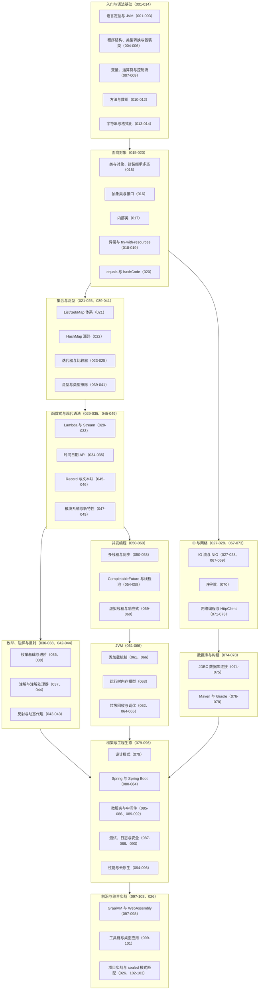

## 前置知识

本文是 Java 模块的全局总结，阅读前建议已经过一遍以下内容：

- [Java 是什么：一次编写、到处运行的企业级语言](/java/001-WhatIsJava)：理解 Java 的定位、字节码与 JVM 的运行模型，这是全部讨论的地基。
- [面向对象编程](/java/015-OOP)：类、封装、继承与多态是 Java 语法体系的主干，后续所有主题都建立在其上。
- [集合框架详解](/java/021-CollectionFrameworkDetailed)：集合是 Java 工程代码中出现频率最高的 API 体系，也是函数式与并发主题的前置。

## 学习目标

1. 用一张知识地图串联模块全部文档，形成"语法基础 -> 面向对象 -> 集合泛型 -> 函数式 -> 并发 -> JVM -> 框架生态"的完整学习脉络。
2. 能用自己的话复述每个主题的核心概念，并写出对应主题的惯用 Java 代码。
3. 能准确区分 `==` 与 `equals`、`String` 与 `StringBuilder` 等易混淆概念，并说明各自的适用场景。
4. 能识别包装类比较、遍历删除、Stream 复用、并发容器误用等高频陷阱，并给出修正方案。
5. 能基于自检清单定位薄弱环节，规划下一段进阶学习路径。

## 知识地图

下图把模块全部文档按主题分组，箭头大致表示推荐的学习顺序。每个节点标注了对应的文档主题与编号，可以按图索骥回查原文。



## 核心概念回顾

为了让所有示例互相连贯，本文沿用本仓库示例的一贯领域：一个"虚拟歌手音乐平台"，围绕 P 主（producer）、歌姬（virtual singer）、歌曲（song）、演唱会（concert）、应援色（theme color）与粉丝团（fan club）展开。所有代码均可独立运行，注释中的编号对应"定义"与"演示"两个阶段。

### 1. 语言定位与运行模型

Java 源代码被编译成字节码，由 JVM 在不同操作系统上执行，这就是"一次编写、到处运行"的来源；JVM 同时提供自动内存管理，把开发者从手动释放内存中解放出来。语言层面，近年版本持续现代化：`record` 把"数据载体"压缩成一行声明，自动生成访问器、`equals`、`hashCode` 与 `toString`；紧凑构造器可以在不重复罗列参数的情况下统一做参数校验；文本块则简化了多行字符串的书写（对应文档 001-003、045-046）。

```java
// 1. 定义 record：一行声明歌姬的姓名、应援色与出道年份
public record Vsinger(String name, String themeColor, int debutYear) {
    // 2. 紧凑构造器：统一校验参数，非法数据在进入系统前就被拦截
    public Vsinger {
        if (debutYear < 2007) throw new IllegalArgumentException("VOCALOID 元年为 2007 年");
    }
}

class VsingerDemo {
    public static void main(String[] args) {
        // 3. 演示创建对象：自动获得 name()、themeColor() 等访问器
        Vsinger miku = new Vsinger("初音未来", "#39C5BB", 2007);
        // 4. record 自带值相等性：内容相同即相等，适合做 DTO 与值对象
        Vsinger sameMiku = new Vsinger("初音未来", "#39C5BB", 2007);
        System.out.println(miku.equals(sameMiku)); // true
        System.out.println(miku.name() + " 的应援色是 " + miku.themeColor());
    }
}
```

### 2. 面向对象：封装、继承与多态

类是模板，对象是实例；继承表达 is-a 关系，接口表达 can-do 能力契约（Java 8 起接口可以携带默认方法）。多态的实现需要三个条件：存在继承或实现关系、子类重写方法、父类引用指向子类对象，运行期依据实际类型分派调用。`equals` 与 `hashCode` 必须成对重写，否则同一对象放进 `HashMap` 后可能出现"存进去找不回来"的诡异现象（对应文档 015-020）。

```java
// 1. 定义演出接口：所有能登台的"角色"都实现它，默认方法提供公共开场白
interface StagePerformer {
    String stageName();
    default String greeting() { return stageName() + " 登台亮相"; }
}

// 2. 歌姬实现接口
class VirtualSinger implements StagePerformer {
    private final String name;                 // 封装：字段私有，仅暴露行为
    VirtualSinger(String name) { this.name = name; }
    @Override public String stageName() { return "歌姬·" + name; }
}

// 3. P 主同样可以实现接口，在谢幕环节登台
class Producer implements StagePerformer {
    private final String name;
    Producer(String name) { this.name = name; }
    @Override public String stageName() { return "P主·" + name; }
}

class LineupDemo {
    public static void main(String[] args) {
        // 4. 多态：父类型引用指向不同子类对象，运行期各自分派
        StagePerformer[] lineup = { new VirtualSinger("初音未来"), new Producer("八王子P") };
        for (StagePerformer p : lineup) System.out.println(p.greeting());
    }
}
```

### 3. 集合与泛型

集合体系的三大接口各有分工：`List` 有序可重复、`Set` 不可重复、`Map` 存储键值对；`ArrayList` 随机访问快，`LinkedList` 插入删除快，`HashMap` 查询接近 O(1) 但不保证顺序。泛型把类型检查提前到编译期，但运行期会被擦除（文档 040），因此 `List<int>` 不存在、运行期拿不到 `List<String>` 的类型参数，通配符 `<? extends T>` 只读不写。工具方法可以借助泛型做到"一份实现，多种类型安全复用"。

```java
import java.util.HashMap;
import java.util.List;
import java.util.Map;

public class ChartDemo {
    // 1. 泛型方法：适用于任何元素类型，编译期保证类型安全
    static <T> Map<Integer, T> buildChart(List<T> items) {
        Map<Integer, T> chart = new HashMap<>();
        for (int rank = 1; rank <= items.size(); rank++) {
            chart.put(rank, items.get(rank - 1)); // 名次 -> 条目
        }
        return chart;
    }

    public static void main(String[] args) {
        // 2. List.of 创建不可变列表：按投稿时间排列歌曲
        List<String> songs = List.of("千本樱", "Melt", "Tell Your World");
        // 3. 生成榜单并遍历：key 是名次，value 是歌名
        Map<Integer, String> chart = buildChart(songs);
        chart.forEach((rank, song) -> System.out.println("第 " + rank + " 名: " + song));
    }
}
```

### 4. 函数式编程：Lambda 与 Stream

Java 8 引入 Lambda 与 Stream 后，集合加工从"命令式循环"转向"声明式流水线"。Stream 的操作分两类：中间操作（`filter`、`map`、`sorted`）是惰性的，只描述处理规则；终端操作（`collect`、`count`、`forEach`）才触发真正执行。同一个 Stream 对象只能被消费一次，需要复用时应从数据源重新获取流。`Collectors.groupingBy` 支持一行完成分组统计，`Optional` 用于显式表达"可能没有值"（对应文档 029-033）。

```java
import java.util.List;

public class StreamDemo {
    // 1. 用 record 承载歌曲数据：标题、P 主、BPM、播放量
    record Song(String title, String producer, int bpm, long playCount) {}

    public static void main(String[] args) {
        List<Song> songs = List.of(
            new Song("千本樱", "黑兔P", 154, 9_800_000L),
            new Song("Melt", "Rika", 82, 6_100_000L),
            new Song("Tell Your World", "kz", 162, 7_500_000L));

        // 2. 声明式流水线：筛选 -> 排序 -> 提取标题 -> 收集
        List<String> hits = songs.stream()
                .filter(s -> s.playCount() > 7_000_000L)                      // 留下播放量达标的热曲
                .sorted((a, b) -> Long.compare(b.playCount(), a.playCount())) // 按播放量降序
                .map(Song::title)                                             // 提取歌名
                .toList();                                                    // 终端操作触发执行

        // 3. 输出热曲榜
        hits.forEach(t -> System.out.println("热曲: " + t));
    }
}
```

### 5. 异常处理与资源管理

异常分两大类：受检异常（如 `IOException`）强制调用方处理，表达"可预期的外部故障"；非受检异常（`RuntimeException` 系）表达程序缺陷，不应捕获后吞掉了事。资源管理方面，凡是实现了 `AutoCloseable` 的资源（文件流、数据库连接等）都应放进 try-with-resources，JVM 会在语句块结束时自动关闭，杜绝手写 `finally` 遗漏关闭的问题（对应文档 018-019）。异常只用于异常路径，不要拿它控制正常流程。

```java
import java.io.BufferedReader;
import java.io.IOException;
import java.nio.file.Files;
import java.nio.file.Path;

public class SetlistReader {
    // 1. 读取演唱会歌单文件：try-with-resources 自动关闭流，无需手写 finally
    static void printSetlist(Path path) {
        try (BufferedReader reader = Files.newBufferedReader(path)) {
            String line;
            while ((line = reader.readLine()) != null) {
                System.out.println("演出曲目: " + line); // 逐行输出歌单
            }
        } catch (IOException e) {
            // 2. 受检异常必须处理：转译为业务语义并记录，而不是静默吞掉
            System.err.println("歌单读取失败: " + e.getMessage());
        }
    }
}
```

### 6. 并发编程：从线程池到虚拟线程

并发的基本纪律是：共享可变数据必须同步。底层工具是 `synchronized` 与 `volatile`，工程工具是 `java.util.concurrent` 提供的锁、原子类与线程安全集合。线程池复用平台线程降低创建成本；`CompletableFuture` 把异步任务组合成依赖图；Java 21 的虚拟线程由 JVM 调度、创建成本极低，让"一个请求一个线程"的同步阻塞风格重新成为高并发 I/O 场景的合理选择（对应文档 050-060）。

```java
import java.util.concurrent.CompletableFuture;
import java.util.concurrent.Executors;

public class ConcertTicketDemo {
    public static void main(String[] args) throws Exception {
        // 1. 虚拟线程执行器：每个任务一个虚拟线程，百万级 I/O 并发的低成本方案
        try (var executor = Executors.newVirtualThreadPerTaskExecutor()) {
            // 2. 三个异步任务并行执行：查票、查场馆、查应援色
            CompletableFuture<String> ticket = CompletableFuture.supplyAsync(() -> "内场票 x2", executor);
            CompletableFuture<String> venue  = CompletableFuture.supplyAsync(() -> "横滨体育馆", executor);
            CompletableFuture<String> color  = CompletableFuture.supplyAsync(() -> "#39C5BB", executor);
            // 3. thenCombine 把两步结果合并，链式组合出最终出行方案
            String plan = ticket.thenCombine(venue, (t, v) -> t + " @ " + v)
                                .thenCombine(color, (p, c) -> p + "（应援色 " + c + "）")
                                .get();
            System.out.println(plan); // 内场票 x2 @ 横滨体育馆（应援色 #39C5BB）
        }
    }
}
```

### 7. JVM：内存模型与垃圾回收

JVM 运行时数据区分为堆、虚拟机栈、方法区等；对象实例分配在堆上，线程私有的栈保存局部变量与方法调用帧。垃圾回收通过可达性分析判断对象存活：从 GC Roots（栈帧局部变量、静态引用等）出发，不可达的对象即可回收。分代回收基于"大多数对象朝生夕死"的弱分代假说，把堆划分为新生代与老年代分别处理；强引用、软引用、弱引用、虚引用四种强度为缓存与资源释放提供了不同的语义（对应文档 061-066）。

```java
import java.lang.ref.WeakReference;

public class GcDemo {
    public static void main(String[] args) {
        // 1. 强引用：只要 fanClub 还引用着对象，它就不会被回收
        var fanClub = new StringBuilder("初音未来粉丝团");
        // 2. 弱引用：不妨碍 GC 回收，常用于可重建的缓存场景
        WeakReference<StringBuilder> cache = new WeakReference<>(fanClub);
        // 3. 断开强引用后，该对象仅剩弱引用可达，下一次 GC 即可回收
        fanClub = null;
        System.gc(); // 建议 GC（不保证立即执行）
        // 4. get() 返回 null 说明缓存已失效，调用方需要重建数据
        System.out.println(cache.get() == null ? "粉丝团缓存已被回收" : "粉丝团缓存仍存活");
    }
}
```

### 8. 框架与工程生态

Spring 的两大基石是 IoC 与 AOP：IoC 容器接管对象的创建与依赖装配，把"new 的权力"上交给容器；AOP 把事务、日志、安全等横切逻辑从业务代码中剥离，以声明式方式织入。Maven 与 Gradle 负责依赖管理与构建生命周期，JUnit 支撑单元测试。这些框架能力的语言地基，正是模块前面讲过的注解（声明元数据）、反射（运行期读取元数据并装配）与动态代理（AOP 的实现机制）（对应文档 037、042-044、079-084）。

```java
// 1. @Service：把演唱会服务声明为 Spring 容器管理的 Bean
@Service
public class ConcertService {
    private final ConcertRepository repository; // 2. 依赖通过构造器注入，便于单元测试时替换实现

    public ConcertService(ConcertRepository repository) {
        this.repository = repository;
    }

    // 3. @Transactional：事务边界由 AOP 统一处理，业务代码只关心领域逻辑
    @Transactional
    public Concert createConcert(String singerName, String venue) {
        // 4. 持久化交给 Repository，体现分层与关注点分离
        return repository.save(new Concert(singerName, venue));
    }
}
```

## 易混淆概念对比

### `==` 与 `equals`

| 对比项 | `==` | `equals` |
| --- | --- | --- |
| 比较内容 | 基本类型比值，引用类型比地址 | 按重写后的逻辑比较内容 |
| 默认行为 | 无法改变 | `Object` 默认实现等同 `==` |
| 包装类陷阱 | `-128` 至 `127` 命中缓存返回 true，超出后返回 false | 始终按值比较 |
| 重写要求 | 不可重写 | 重写时必须同时重写 `hashCode` |
| 典型场景 | 枚举、基本类型比较 | 字符串、包装类、业务对象 |

### `String`、`StringBuilder` 与 `StringBuffer`

| 对比项 | `String` | `StringBuilder` | `StringBuffer` |
| --- | --- | --- | --- |
| 可变性 | 不可变，每次修改产生新对象 | 可变，内部维护字符数组 | 可变，内部维护字符数组 |
| 线程安全 | 不可变因此天然安全 | 非线程安全 | 方法级 synchronized，线程安全 |
| 性能 | 循环拼接退化为 O(n2) | 单线程下最快 | 伴随同步开销 |
| 使用场景 | 常量、少量拼接、Map 的 key | 单线程循环拼接 | 多线程共享同一拼接缓冲 |

## 常见误区与排查

1. **包装类用 `==` 比较**。`Integer` 对 `-128` 至 `127` 有缓存，区间内 `==` 恰好为 true，超出区间后比较的是对象地址，结果随值变化而不稳定。

```java
Integer a = 127, b = 127;
System.out.println(a == b);       // true：命中 IntegerCache，纯属巧合
Integer c = 128, d = 128;
System.out.println(c == d);       // false：超出缓存区间，比较的是地址
// 修正：包装类一律用 equals 比较内容
System.out.println(c.equals(d));  // true
```

2. **在 for-each 中直接删除元素**。for-each 底层依赖迭代器，直接调用集合的 `remove` 会破坏迭代器状态，抛出 `ConcurrentModificationException`。

```java
List<String> setlist = new ArrayList<>(List.of("千本樱", "Melt", "Melt"));
// 错误：增强 for 中调用 list.remove，运行时抛异常
for (String song : setlist) {
    if (song.equals("Melt")) setlist.remove(song);
}
// 修正 1：removeIf 一行完成条件删除
setlist.removeIf(song -> song.equals("Melt"));
// 修正 2：使用迭代器自身的 remove 方法
Iterator<String> it = setlist.iterator();
while (it.hasNext()) {
    if (it.next().equals("Melt")) it.remove();
}
```

3. **循环中用 `String` 拼接长文本**。`String` 不可变，循环拼接每轮都会创建新对象并复制旧内容，整体退化为 O(n2)。

```java
// 错误：每轮新建 String 对象，拼接一万次就复制一万次
String banner = "";
for (int i = 0; i < 10_000; i++) banner += "应援 ";
// 修正：StringBuilder 复用同一个内部数组，追加为均摊 O(1)
StringBuilder sb = new StringBuilder();
for (int i = 0; i < 10_000; i++) sb.append("应援 ");
banner = sb.toString();
```

4. **重写 `equals` 却不重写 `hashCode`**。两者契约要求"相等的对象必须有相等的哈希值"，否则同一对象放入 `HashSet` 或作为 `HashMap` 的 key 后行为不可预测。

```java
class Song {
    final String title;
    Song(String title) { this.title = title; }
    @Override public boolean equals(Object o) {
        return o instanceof Song s && s.title.equals(title);
    }
    // 错误：缺少 hashCode 重写，内容相同的两个 Song 哈希值不同
}
// 修正：补充 hashCode，维持 equals 与 hashCode 的契约
class SongFixed {
    final String title;
    SongFixed(String title) { this.title = title; }
    @Override public boolean equals(Object o) {
        return o instanceof SongFixed s && s.title.equals(title);
    }
    @Override public int hashCode() { return Objects.hash(title); }
}
```

5. **复用同一个 Stream 对象**。Stream 是一次性的数据管道，终端操作后即失效，再次使用会抛出 `IllegalStateException`。

```java
List<String> songs = List.of("千本樱", "Melt");
// 错误：同一条流被消费两次
Stream<String> pipe = songs.stream();
pipe.filter(x -> x.startsWith("千")).count();
pipe.count(); // IllegalStateException: stream has already been operated upon
// 修正：每次加工都从数据源重新获取流
long count = songs.stream().filter(x -> x.startsWith("千")).count();
```

6. **多线程共用 `HashMap` 计数**。`HashMap` 非线程安全，并发写入会丢失更新，极端情况下还会破坏内部结构；应换用并发容器。

```java
// 错误：多个线程同时 merge 会互相覆盖票数
Map<String, Integer> votes = new HashMap<>();
votes.merge("千本樱", 1, Integer::sum);
// 修正：ConcurrentHashMap 保证并发合并的原子性
Map<String, Integer> safeVotes = new ConcurrentHashMap<>();
safeVotes.merge("千本樱", 1, Integer::sum);
```

## 自检清单

- [ ] 能解释字节码与 JVM 的关系，并说明"一次编写、到处运行"的实现原理。
- [ ] 能手写一个 `record`，并说明紧凑构造器适合承担参数校验职责。
- [ ] 能说出多态成立的三个条件，并解释接口默认方法的价值。
- [ ] 能区分 `List`、`Set`、`Map` 的语义差异与典型实现类的适用场景。
- [ ] 能写出一条 Stream 流水线，并解释中间操作与终端操作的区别。
- [ ] 能正确使用 try-with-resources 管理文件、数据库连接等资源。
- [ ] 能复述 `equals` 与 `hashCode` 的契约，并说明违反契约对 `HashMap` 的影响。
- [ ] 能区分线程池、`CompletableFuture` 与虚拟线程的适用场景。
- [ ] 能描述堆的分代结构与可达性分析的工作方式。
- [ ] 能说明 Spring 的 IoC 与 AOP 分别解决了什么问题，及其依赖的语言机制。

## 后续学习路径

如果自检中发现薄弱环节，建议按以下顺序回到模块文档回炉，再向进阶主题推进：

1. **夯实并发**：[JUC 并发工具](/java/052-JUCConcurrency) 与 [Java 与虚拟线程](/java/059-JavaVirtualThread)，理解现代 Java 服务端高并发的两条路线。
2. **深入 JVM**：[JVM 垃圾回收](/java/062-JVMGC) 与 [JVM 内存模型](/java/063-JVMMemoryModel)，为线上问题排查与调优打底。
3. **建立框架体系**：[Spring 基础：IoC 容器、AOP、Bean 生命周期与企业级开发核心](/java/080-SpringBasicsIoCAOPBeanLifecycle)，再进入 [Spring Boot 进阶](/java/081-SpringBootAdvanced)。
4. **补齐数据与中间件**：[Java 与 Redis](/java/089-JavaRedis) 与 [Java 与消息队列](/java/090-JavaMessageQueue)，掌握分布式系统的常用组件。
5. **提升工程能力**：[Java 单元测试](/java/087-JavaUnitTest) 与 [Java 性能调优](/java/094-JavaPerformanceTuning)，把"能跑"升级为"可靠、可维护、高性能"。
6. **走向云原生**：[Java 与 Docker](/java/095-JavaDocker) 与 [Java 与 Kubernetes](/java/096-JavaKubernetes)，完成从语言到交付闭环的最后一公里。
