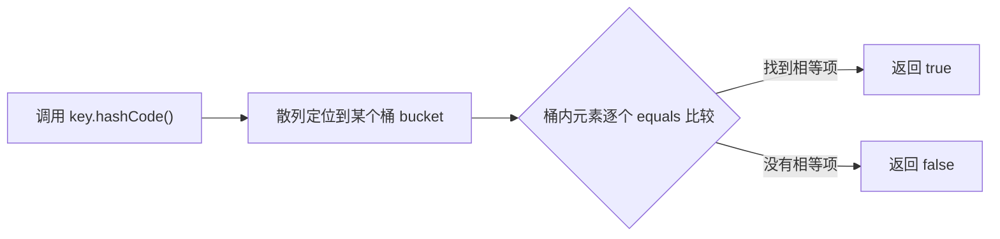

## 一句话定调

**HashSet/HashMap 找对象，先查"门牌号"（hashCode），再比"长相"（equals）**。两个对象相等，门牌号必须相同；门牌号不同，永远不可能相等。

## 为什么会有这条契约

把 `HashSet` 想象成一排贴着门牌号的储物柜。存对象时，柜子管理员只看门牌号决定放进哪一格（调用 `hashCode()`）；取对象时，先按门牌号找到格子，再逐个比对格子里的对象是不是你要的那个（调用 `equals()`）。

推论有两个：

- 若两个对象 `equals` 为 `true` 但 `hashCode` 不同，它们会被放进**不同格子**——你拿着"内容相同"的钥匙去取，永远查不到。这就是"只重写 equals 不重写 hashCode"事故的根源。
- 反过来不成立：门牌号相同（哈希碰撞）不代表相等，管理员还会用 `equals` 精确比对。所以 `hashCode` 允许撞车，`equals` 不允许说谎。

契约的正式表述（`java.lang.Object` 文档）：`equals` 相等则 `hashCode` 必须相等；`hashCode` 相等不要求 `equals` 相等。

## 极简代码（看懂这 20 行就够了）

```java
import java.util.HashSet;
import java.util.Objects;
import java.util.Set;

public class User {
    private final String id;
    private final String name;

    public User(String id, String name) {
        this.id = id;
        this.name = name;
    }

    @Override
    public boolean equals(Object o) {
        if (this == o) return true;              // 同一个对象，短路提速
        if (!(o instanceof User u)) return false; // 类型不同直接 false（顺带处理了 null）
        return Objects.equals(id, u.id) && Objects.equals(name, u.name);
    }

    @Override
    public int hashCode() {
        // Objects.hash 按相同字段生成哈希，保证契约成立
        return Objects.hash(id, name);
    }
}

// 效果：new 出来的两个"内容相同"对象，也能在集合里互相找到
Set<User> users = new HashSet<>();
users.add(new User("S001", "张三"));
System.out.println(users.contains(new User("S001", "张三"))); // true
```

## 完整反例：不重写 hashCode 会发生什么

```java
import java.util.HashMap;
import java.util.Map;

public class BrokenKeyDemo {
    // 错误写法：只重写 equals，不重写 hashCode
    static class Point {
        final int x, y;
        Point(int x, int y) { this.x = x; this.y = y; }

        @Override
        public boolean equals(Object o) {
            return o instanceof Point p && p.x == x && p.y == y;
        }
        // 没有 hashCode() —— 每个 new 出来的对象哈希值都不同
    }

    public static void main(String[] args) {
        Map<Point, String> map = new HashMap<>();
        map.put(new Point(1, 2), "目标值");

        System.out.println(map.get(new Point(1, 2))); // null！查不到
        // equals 判断"相等"的两个对象，因 hashCode 不同被分进不同桶
    }
}
```

预期输出是 `null`，而且没有任何报错——这类 bug 只在运行期悄悄出现，所以必须靠纪律（成对重写）预防。

## record：编译器替你写好契约

内容承载类优先用 record（Java 16 正式），编译器自动生成基于全部组件的 `equals`/`hashCode`/`toString`，从根源上杜绝"忘了成对重写"：

```java
// 一行顶上面 20 行，契约天然成立
public record User(String id, String name) {}

User a = new User("S001", "张三");
User b = new User("S001", "张三");
System.out.println(a.equals(b));          // true
Set<User> set = java.util.Set.of(a);
System.out.println(set.contains(b));      // true
```

手写类 vs record 的选择：字段固定、值语义的数据载体直接 record；需要继承体系或懒加载字段的才手写 equals/hashCode。

## 如果报这个错，看这里

**现象：`HashSet.contains()` / `HashMap.get()` 明明有数据却返回 false/null**

原因：只重写了 `equals` 没重写 `hashCode`，两个相等对象落在不同"门牌号"；或 `hashCode` 依赖了可变字段，对象放入集合后又改了字段。

对策：`equals` 与 `hashCode` 永远一起重写，且只用**不可变字段**参与计算；放入 HashSet/HashMap 后不要再修改参与计算的字段。

```java
// 经典事故：可变字段做 key
import java.util.ArrayList;
import java.util.List;
import java.util.Objects;

public class MutableKeyTrap {
    public static void main(String[] args) {
        List<String> list = new ArrayList<>(List.of("a"));
        var set = new java.util.HashSet<List<String>>();
        set.add(list);

        list.add("b"); // 修改了参与 hashCode 计算的内容
        System.out.println(set.contains(list)); // false！对象还在集合里，却再也"找不到"
    }
}
```

**现象：`hashCode` 相同但 `equals` 为 false（哈希碰撞）**

这是正常现象，不是 bug：`HashMap` 会在同门牌号下用 `equals` 逐个比较。只要契约正确，碰撞只影响性能不影响正确性。

**现象：`equals` 里用 `getClass()` 还是 `instanceof` 争论**

`instanceof` 允许子类与父类相等（值语义友好，但可能破坏对称性）；`getClass()` 严格同 class 才相等。没有继承层次的数据类两者等价；有继承需求时优先考虑把"相等性"上移或改用 record（隐式禁止继承）。

**现象：IDE 生成的 equals 对 `null` 抛 NPE 或不对称**

用 `Objects.equals(a, b)` 比较字段、`instanceof` 判类型，天然规避 null 参数问题；不要手写 `field.equals(other.field)`（字段为 null 时抛 NPE）。

## 哈希查找全过程（一步一图）

`set.contains(new User("S001", "张三"))` 在 HashSet 里经历三步：



对照理解两条契约要求的由来：第一步若"相等对象哈希不同"（没重写 hashCode），流程直接走错桶，第三步根本没有机会执行；第三步若 `equals` 判断不稳定（依赖可变状态），同一对对象两次比较结果不同，集合行为就不可预测。

顺带一提性能常识：`String` 把哈希值缓存在字段里（不可变所以安全），首次计算后复用；自定义类若哈希计算昂贵且对象大量用作 key，可参考这一做法。

## 作为 HashMap key 的实战清单

把自定义类当 key 用之前，按这个清单自查：

1. 参与相等的字段全部不可变（或放入 Map 后绝不变更）；
2. equals 与 hashCode 成对、同字段重写；
3. 判断"业务上怎样算同一个 key"——通常用业务主键（id）而不是全部字段；
4. 能用 `record` 就用 record（组件即契约，编译器兜底）。

## 记住

初学者记住三点：

> 1. 重写 `equals` 就必须重写 `hashCode`，参与计算的字段两边保持一致。
> 2. 用 `Objects.equals` 比字段、`Objects.hash(id, name)` 生成哈希，一行搞定。
> 3. 放进 HashSet/HashMap 的 key 之后不许改内容；能上 record 就上 record。

进阶者还需注意：

- `equals` 必须满足自反、对称、传递、一致四条性质，`instanceof` 写法在继承层次下要小心对称性破坏。
- 哈希质量影响性能：字段很多时可按"区分度高的字段优先"参与计算；`Objects.hash` 稳妥但不是最优。
- 浮点字段用 `Float.compare`/`Double.compare` 参与比较，避免 `-0.0`、`NaN` 语义坑。
